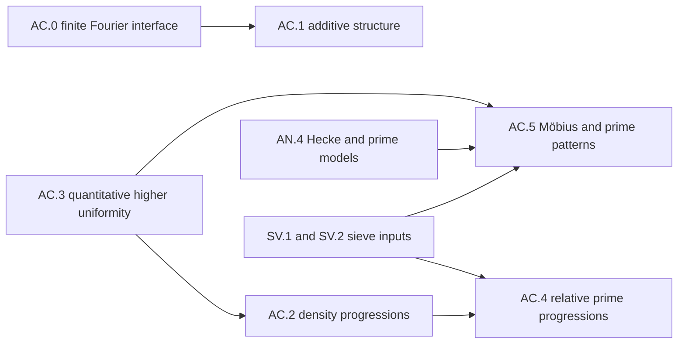

# Additive combinatorics, higher Fourier analysis and primes

This roadmap plans the missing targets of AC.0–AC.5, from the pinned libraries to additive structure, density progressions, higher uniformity, prime progressions, Möbius orthogonality and prime patterns over number fields and their localizations. The packet is a complete target-level pass. Every stage is **planned**, with explicit source, proof or supplier gaps; no stage is asserted closed and no result is asserted implemented.

The definitive statements are in this document and the [packet](../packets/AdditiveCombinatorics.json). The [suggested file](../suggested/AdditiveCombinatorics.lean) provides names, typed signatures and examples with proof placeholders. It includes partial signatures where supplier data cannot yet be expressed completely; the exact differences are recorded below. A successful elaboration checks those signatures, not the mathematical proofs.

## Library and ownership boundary

The baseline is Mathlib **082e2d37e8b0463410cdb532e111cd43d5a66174** and Tau Ceti **f790474821cf4256814db967cb154e7af3d0c369**. The six accepted AUDIT-16 layer records and accepted RS-03 restrictions were read. Current TauCetiRoadmap main and the current Tau Ceti library were also searched read-only, including the nine roadmaps added after the atlas snapshot. Existing characters, Fourier bases and orthogonality, cyclic discrete Fourier inversion, finite convolution, additive energy, Plünnecke–Ruzsa, compact Peter–Weyl, qualitative Roth, nilpotent groups, Lie groups and number-field ideals are reused. The baseline table below records the actual declarations read at the pins.

AC.0 owns the missing probability-normalized arbitrary finite-abelian comparison interface. AlgebraicCodingTheory Layer 3 and ModularForms Layer 0 keep their specializations; the recorded ownership proposal makes EllipticRegulators:ER.4 import this interface for torsion and odd-function identities. FF.1 owns trace characters and Gauss/Jacobi sums. General Lie theory remains in upstream LieGroups; AC.3 owns filtered nilmanifolds, rational adapted coordinates, polynomial sequences and quantitative nilsequence complexity. The corresponding proposal makes ArithmeticLocallySymmetricSpaces:ALS.2 import that carrier for its boundary-fibration applications. Missing global nilpotent and smooth quotient specializations extend LieGroups in Part II. This job records these proposals without editing the other roadmaps.

The scalar and number-field pattern routes require AC.3 and their arithmetic inputs directly. They do not acquire the hypotheses of AC.4 merely through a stage edge. No target here uses Bombieri–Vinogradov. Directed cycle removal extends the Regularity direction; the current Part II three-vertex counting proposal does not supply every fixed directed cycle. Arithmetic prime-model definitions, norm-length bases and Hecke normalizations belong to AnalyticNumberTheory:AN.4. Sieve weights and ideal Type I/II decompositions remain in the SieveMethodsAndPrimePatterns direction.

## Conventions and proof routes

For a finite abelian group G, put N=|G| and Ĝ=AddChar(G,ℂ). G has probability counting measure; its dual has ordinary counting measure. The transform is f̂(χ)=N⁻¹Σ_x f(x)conj(χ(x)); convolution is (f*g)(x)=N⁻¹Σ_y f(y)g(x−y). A point mass has every Fourier coefficient of modulus 1/N. No identification of G with its dual is implicit. Native additive energy counts ordered quadruples without probability normalization.

Chord Bohr sets use the strict condition |χ(x)−1|<r. Phase Bohr sets use |arg χ(x)|/(2π)<ε_χ. For a common 0<ε≤1/2 their chord radius is 2 sin(πε). Empty frequency families impose no constraint even at a nonpositive radius; a nonempty family at radius zero is empty. Regularity uses non-strict volume inequalities, including zero scale change and rank zero. The cyclic progression argument keeps the original cyclic coordinate, so nonfaithful characters do not cause a false injectivity assertion.

All Gowers cubes use complex conjugation by vertex parity. The mixed cube inner product need not be nonnegative; the diagonal product has the required nonnegativity. U¹ is the modulus of the mean and is a seminorm; U^d is a norm for d≥2. The interval [N] means {1,…,N}; integer boxes are [−N,N]^ℓ. Interval and box norms divide by the cube count of the indicator of that same domain. Zero extension into a sufficiently large cyclic group preserves the normalized ratio. The empty interval has norm zero; the zero-dimensional box is a singleton.

Nilsequence degree, nilpotency step, dimension, rational height and Lipschitz bound are distinct parameters. Quotients are homogeneous spaces by discrete cocompact subgroups, which need not be normal. Coordinates are ordered second-kind exponential coordinates. The group metric is the infimum of finite-chain costs with the prescribed minimum of the two directed coordinate costs; the quotient metric takes the infimum over representatives. Polynomial sequences use iterated group differences and integer-binomial Taylor coefficients. Pointwise rationality of an arbitrary sequence does not imply periodicity.

The selected higher-uniformity route is the finite quantitative Leng–Sah–Sawhney inverse theorem, Leng's vertical-frequency step reduction and Kai's sourced box deduction. It does not require an ultralimit proof layer. Single-parameter orbit factorization uses Green–Tao with its published erratum; unequal boxes retain the corrected small-side alternative. Finitary Szemerédi uses progression partitions of **large average part length**, regular resolutions obtained by shifting at a fixed scale, and an energy increment. The quantitative density-increment target is for k≥5; the separate Roth target imports the built qualitative theorem and records the unacquired original Rahman numerical proof.

The selected prime-progression route uses the CFZ dense model and relative counting lemma with only the selected k-linear-forms subproducts. The smooth divisor majorant is spliced with one outside the half-window. For each fixed W, the prime number theorem in the progression 1 modulo W gives the half-window mass; a diagonal choice makes W(N) increase slowly while preserving all finitely many moment estimates. This states a sufficient supplier contract without pretending that a growing-modulus estimate follows from Chebyshev bounds. The original sharp-cutoff Green–Tao route remains a separate comparison, with full linear-forms and correlation conditions and stronger analytic gaps.

Integer finite-complexity patterns exclude proportional slopes. They do not cover twins or Goldbach. Number-field patterns use fractional ideals and a norm-length compatible integer basis; their main factor divides by the power of the Dedekind-zeta residue. Local avoidance uses one common residue witness for all prime ideals above a rational prime. Localization removes the excluded prime ideals from the avoidance product while retaining the normalization multiplier. The integral theorem requires finite cokernels of kernel restrictions; the localized theorem requires torsion cokernels, including for each individual map, and allows Lipschitz boundary covers.

## Targets, APIs and tests

Each numbered item states a mathematical target and its direct prerequisites. Smaller proof steps remain in its outline. The API names and unit tests are proposed signatures, not completed declarations. Source locators refer to the editions in the bibliography; all mathematical statements and source findings below are in our own words.

## AC.0: Finite Fourier normalization and comparisons

Coverage: **planned**. The coverage ledger below records the exact remaining work.

### The character-indexed Fourier transform on a finite abelian group

Target: `AdditiveCombinatorics:AC.0/fourier-transform`. Proposed definition: `TauCeti.AdditiveFourier.fourier`.

For a finite abelian group G of order N and f : G → ℂ, fourier f : AddChar G ℂ → ℂ is fourier f χ = N⁻¹ ∑_{x∈G} f(x) · conj(χ(x)): probability counting measure on G, counting measure on the dual, and indexed by the dual group AddChar G ℂ itself, with no isomorphism G ≅ Ĝ chosen. This is the canonical form of the source's bi-character transform, which the source itself names as the canonical alternative.

Hypotheses and conventions:

- G a finite abelian group, written additively, N = |G| > 0
- f : G → ℂ

Construction or proof outline:

1. Define fourier f χ := N⁻¹ ∑_x f(x) conj(χ x); this is RCLike.wInner with the constant weight RCLike.cWeight and the character in the first, conjugated, slot.
2. Identify it with the coordinate of f in the character basis AddChar.complexBasis, using character orthogonality for the normalised measure.
3. Derive inversion f(x) = ∑_χ fourier f χ · χ(x) from the basis expansion.
4. Derive the transformation rules (translation, modulation, negation, conjugation, precomposition with an isomorphism or a surjection) directly from the defining sum.
5. Compare with Mathlib's ZMod.dft on ZMod N through the explicit isomorphism ZMod N ≅ AddChar (ZMod N) ℂ: fourier f (zmodAddEquiv r) = N⁻¹ · dft f r.

Direct inputs: `mathlib:AddChar`, `mathlib:AddChar.complexBasis`, `mathlib:RCLike.wInner`, `mathlib:RCLike.cWeight`, `mathlib:ZMod.dft`, `tauceti:TauCeti.haarProb`.

Uses:

- AdditiveCombinatorics:AC.0/normalized-convolution: The convolution identity is a statement about the transform of the normalised convolution.
- AdditiveCombinatorics:AC.0/fourier-parseval: Parseval and Plancherel are the transform's isometry statements.
- AdditiveCombinatorics:AC.0/fourier-energy: Additive energy is expressed through the transforms of the two indicators.
- AdditiveCombinatorics:AC.1: The worksheet's AC.1 large-spectrum interfaces (largeSpectrum and its lemmas) are phrased with this transform.

| Proposed API | Role | Statement |
| --- | --- | --- |
| `fourier_apply` | characterisation | fourier f χ = (card G)⁻¹ · ∑ x, f x · star (χ x). |
| `fourier_zero` | simp | fourier 0 = 0. |
| `fourier_add` | structure | fourier (f + g) = fourier f + fourier g. |
| `fourier_smul` | structure | fourier (c • f) = c • fourier f. |
| `fourier_single` | example | fourier (Pi.single a c) χ = (card G)⁻¹ · c · star (χ a). |
| `fourier_character` | characterisation | fourier (fun x => ψ x) χ = if χ = ψ then 1 else 0. |
| `fourier_inversion` | characterisation | ∑ χ, fourier f χ · χ x = f x. |
| `fourier_inversion_reindex` | compatibility | For any equivalence e : ι ≃ AddChar G ℂ, ∑ i, fourier f (e i) · e i x = f x: inversion through an explicitly supplied indexing of the dual, never an identification of the dual with G. |
| `fourier_injective` | extensionality | fourier is injective. |
| `fourier_eq_basis_repr` | compatibility | fourier f χ = (AddChar.complexBasis G).repr f χ. |
| `fourier_eq_wInner` | compatibility | fourier f χ = RCLike.wInner RCLike.cWeight (fun x => χ x) f; the character sits in the first slot because the library inner product conjugates its first argument. |
| `fourier_eq_haarIntegral` | compatibility | fourier f χ is the integral of f · star χ against Tau Ceti's Haar probability measure TauCeti.haarProb on Multiplicative G (discrete topology): the one-dimensional case of the Peter–Weyl coefficients. |
| `fourier_translate` | functoriality | fourier (fun x => f (x − a)) χ = star (χ a) · fourier f χ. |
| `fourier_modulate` | functoriality | fourier (fun x => ψ x · f x) χ = fourier f (χ / ψ). |
| `fourier_neg` | functoriality | fourier (fun x => f (−x)) χ = fourier f χ⁻¹. |
| `fourier_conj` | functoriality | fourier (fun x => star (f x)) χ = star (fourier f χ⁻¹). |
| `fourier_reflection` | functoriality | fourier (fun x => star (f (−x))) χ = star (fourier f χ): the source's reflection identity. |
| `fourier_equiv` | functoriality | For e : G ≃+ H, fourier (f ∘ e) (χ ∘ e) = fourier f χ. |
| `fourier_quotient` | functoriality | For a surjective q : G →+ H, fourier (f ∘ q) (χ ∘ q) = fourier f χ. |
| `fourier_quotient_zero` | functoriality | For q : G →+ H and χ nontrivial on ker q, fourier (f ∘ q) χ = 0. |
| `zmod_character_comparison` | compatibility | AddChar.zmodAddEquiv r x = ZMod.stdAddChar (x · r), the explicit isomorphism the cyclic comparison runs through. |
| `fourier_zmod` | compatibility | On ZMod N, fourier f (AddChar.zmodAddEquiv r) = N⁻¹ · ZMod.dft f r. |

| Unit test | Kind | Expected result |
| --- | --- | --- |
| `fourier.test_nonreal_phase` | computation | Worksheet F1: on ZMod 4, fourier (Pi.single 1 1) (zmodAddEquiv 1) = −i/4. A definition that omits the conjugate gives +i/4 and fails. |
| `fourier.test_distinct_characters` | computation | Worksheet F2: on ZMod 3, the transform of the character zmodAddEquiv 2 vanishes at zmodAddEquiv 1. |
| `fourier.test_self_coefficient_one` | non-example | Worksheet F3: fourier (fun x => χ x) χ = 1, not N; a definition with counting rather than probability measure on G fails. |
| `fourier.test_zero` | degenerate | Worksheet F4: fourier 0 χ = 0. |
| `fourier.test_trivial_group` | degenerate | Worksheet F5: on ZMod 1, fourier f χ = f 0. |
| `fourier.test_noncyclic_delta` | computation | Worksheet F6: on ZMod 2 × ZMod 2, the unit delta at 0 has coefficient 1/4 at every character, on a group that is not cyclic. |
| `fourier.test_conjugate_reflection` | computation | Worksheet F10: on ZMod 4, the conjugate reflection of Pi.single 1 1 has coefficient +i/4 at zmodAddEquiv 1, the conjugate of F1; plain reflection would not conjugate. |
| `fourier.test_conjugate_slot` | non-example | Worksheet F11: fourier (fun x => i · χ x) χ = i. With the character in the linear slot of the inner product the answer would be −i. |

Acceptance:

- fourier of a character χ is the indicator of χ: coefficient one at χ, not N.
- Inversion reconstructs f exactly, with no stray factor of N.
- On ZMod N the transform is N⁻¹ times Mathlib's dft, so neither normalisation silently replaces the other.

Source: [Terence Tao, Lecture notes 2 for 254A (additive combinatorics), within the CMU-hosted 118-page compilation](https://www.math.cmu.edu/users/af1p/Teaching/AdditiveCombinatorics/Tao.pdf), §6, printed p. 8 (physical p. 34), the canonical dual-group alternative. The choice of indexing by the dual group AddChar G ℂ rather than by a chosen bi-character.

Source: [Terence Tao, Lecture notes 2 for 254A (additive combinatorics), within the CMU-hosted 118-page compilation](https://www.math.cmu.edu/users/af1p/Teaching/AdditiveCombinatorics/Tao.pdf), §6, printed p. 8 (physical p. 34), normalised counting measure. The normalisation N⁻¹ on the position side.

Source: [Terence Tao, Lecture notes 2 for 254A (additive combinatorics), within the CMU-hosted 118-page compilation](https://www.math.cmu.edu/users/af1p/Teaching/AdditiveCombinatorics/Tao.pdf), §6, printed p. 9 (physical p. 35), the Fourier transform and inversion. The definition as the inner product against the character, and Fourier inversion.

Atlas planet: **Finite Fourier transform**.

### Normalised convolution on a finite abelian group

Target: `AdditiveCombinatorics:AC.0/normalized-convolution`. Proposed definition: `TauCeti.AdditiveFourier.nconv`.

For f, g : G → ℂ on a finite abelian group G of order N, nconv f g x = N⁻¹ ∑_{y∈G} f(y) g(x − y): convolution with respect to the probability counting measure. It is N⁻¹ times Mathlib's discrete convolution addRingConvolution, a normalisation adapter and not a new convolution theory.

Hypotheses and conventions:

- G a finite abelian group, N = |G| > 0
- f, g : G → ℂ

Construction or proof outline:

1. Define nconv f g := N⁻¹ • DiscreteConvolution.addRingConvolution f g, with nconv_apply giving the explicit sum.
2. Transfer commutativity, associativity and bilinearity from the discrete convolution, tracking the factor N⁻¹ in associativity.
3. Compute on indicators: nconv 1_A 1_B x = N⁻¹ · #{(a, b) ∈ A × B : a + b = x}, i.e. N⁻¹ · Finset.addConvolution A B x.
4. The unit is N·δ₀, not δ₀, because of the normalisation.

Direct inputs: `mathlib:DiscreteConvolution.ringConvolution`, `mathlib:Finset.convolution`.

Uses:

- AdditiveCombinatorics:AC.0/fourier-nconv: The convolution identity takes nconv to the product of transforms.
- AdditiveCombinatorics:AC.0/fourier-energy: Energy is N³ times the squared L² norm of the normalised convolution of the indicators, through nconv_indicator.

| Proposed API | Role | Statement |
| --- | --- | --- |
| `nconv_apply` | characterisation | nconv f g x = (card G)⁻¹ · ∑ y, f y · g (x − y). |
| `nconv_eq_addRingConvolution` | compatibility | nconv f g = (card G)⁻¹ • DiscreteConvolution.addRingConvolution f g. |
| `nconv_indicator` | compatibility | nconv 1_A 1_B x = (card G)⁻¹ · (A.addConvolution B x : ℂ). |
| `nconv_comm` | structure | nconv f g = nconv g f. |
| `nconv_assoc` | structure | nconv (nconv f g) h = nconv f (nconv g h). |
| `nconv_add_left` | structure | nconv (f + g) h = nconv f h + nconv g h. |
| `nconv_add_right` | structure | nconv f (g + h) = nconv f g + nconv f h. |
| `nconv_smul_left` | structure | nconv (c • f) g = c • nconv f g. |
| `nconv_smul_right` | structure | nconv f (c • g) = c • nconv f g. |
| `nconv_zero_left` | simp | nconv 0 f = 0. |
| `nconv_zero_right` | simp | nconv f 0 = 0. |
| `nconv_single` | example | nconv (Pi.single a c) (Pi.single b d) = Pi.single (a + b) ((card G)⁻¹ · c · d). |
| `nconv_unit_left` | example | nconv (Pi.single 0 (card G)) f = f. |
| `nconv_unit_right` | example | nconv f (Pi.single 0 (card G)) = f. |

| Unit test | Kind | Expected result |
| --- | --- | --- |
| `nconv.test_delta_not_unit` | non-example | Worksheet C1: on ZMod 3, nconv δ₀ δ₀ 0 = 1/3, so the unit delta is not the convolution unit under probability measure. |
| `nconv.test_scaled_unit` | computation | Worksheet C2: on ZMod 4, nconv (Pi.single 0 4) f = f. A definition without the factor N⁻¹ makes δ₀ the unit instead, and fails. |
| `nconv.test_zero` | degenerate | Worksheet C4: nconv 0 f = 0. |
| `nconv.test_constants` | computation | Worksheet C5: nconv 1 1 = 1, the constants being fixed by probability normalisation. |
| `nconv.test_support_and_scale` | computation | Worksheet C6: on ZMod 4, nconv δ₁ δ₁ 2 = 1/4, testing the support a + b and the normalisation together. |
| `nconv.test_indicator_multiplicity` | computation | Worksheet C9: on ZMod 3 with A = B = {0, 1}, nconv 1_A 1_B 1 = 2/3, the two representations 0 + 1 and 1 + 0 over N = 3; sumset membership alone would give 1/3. |

Acceptance:

- nconv (N · δ₀) f = f: the unit carries the factor N.
- On indicators the value is N⁻¹ times the representation count, linking the Fourier side to Mathlib's finset convolution.
- Associativity holds with the normalisation, since each convolution carries one factor N⁻¹ and one sum.

Source: [Terence Tao, Lecture notes 2 for 254A (additive combinatorics), within the CMU-hosted 118-page compilation](https://www.math.cmu.edu/users/af1p/Teaching/AdditiveCombinatorics/Tao.pdf), §6, printed p. 9 (physical p. 35), convolution. The definition of convolution against the normalised measure dy.

Atlas planet: **Normalised convolution**.

### Parseval and Plancherel for the character-indexed transform

Target: `AdditiveCombinatorics:AC.0/fourier-parseval`. Proposed theorem: `TauCeti.AdditiveFourier.fourier_parseval`.

For f, g : G → ℂ, N⁻¹ ∑_x f(x) conj(g(x)) = ∑_χ fourier f χ · conj(fourier g χ), and in particular N⁻¹ ∑_x |f(x)|² = ∑_χ |fourier f χ|²: the transform is an isometry from L²(G, probability measure) to ℓ²(Ĝ, counting measure).

Hypotheses and conventions:

- G a finite abelian group
- f, g : G → ℂ

Construction or proof outline:

1. Expand both sides in the character basis using fourier_inversion.
2. Use orthogonality of characters for the normalised measure: N⁻¹ ∑_x χ(x) conj(ψ(x)) = [χ = ψ].
3. Collect terms to obtain Parseval; take g = f for Plancherel.

Direct inputs: [AdditiveCombinatorics:AC.0/fourier-transform](#node-AC-0-fourier-transform), `mathlib:AddChar.complexBasis`.

Acceptance:

- The measures differ on the two sides — probability on G, counting on Ĝ — and the identity is false with both normalised or both counting.
- For f = ⇑χ both sides equal 1.
- For f = 1_A, Plancherel gives ∑_χ |fourier 1_A χ|² = |A|/N, the density — the source's equation (1).

Source: [Terence Tao, Lecture notes 2 for 254A (additive combinatorics), within the CMU-hosted 118-page compilation](https://www.math.cmu.edu/users/af1p/Teaching/AdditiveCombinatorics/Tao.pdf), §6, printed p. 9 (physical p. 35), the Parseval relation and Plancherel. The Parseval relation and the Plancherel formula for the transform.

Atlas planet: **Parseval theorem**.

### The transform takes normalised convolution to the product

Target: `AdditiveCombinatorics:AC.0/fourier-nconv`. Proposed theorem: `TauCeti.AdditiveFourier.fourier_nconv`.

For f, g : G → ℂ and χ ∈ AddChar G ℂ, fourier (nconv f g) χ = fourier f χ · fourier g χ.

Hypotheses and conventions:

- G a finite abelian group
- f, g : G → ℂ
- χ ∈ AddChar G ℂ

Construction or proof outline:

1. Expand fourier (nconv f g) χ = N⁻² ∑_x ∑_y f(y) g(x − y) conj(χ(x)).
2. Substitute x = y + z and use conj(χ(y + z)) = conj(χ(y)) conj(χ(z)).
3. The double sum factorises into (N⁻¹ ∑_y f(y) conj χ(y)) · (N⁻¹ ∑_z g(z) conj χ(z)).

Direct inputs: [AdditiveCombinatorics:AC.0/fourier-transform](#node-AC-0-fourier-transform), [AdditiveCombinatorics:AC.0/normalized-convolution](#node-AC-0-normalized-convolution).

Acceptance:

- The identity holds with no constant exactly because both the convolution and the transform are taken against the probability measure; with unnormalised convolution a factor N appears.
- For f = g = ⇑χ it gives 1 · 1 = 1 at χ.
- It is the audit's named missing identity for AC.0.

Source: [Terence Tao, Lecture notes 2 for 254A (additive combinatorics), within the CMU-hosted 118-page compilation](https://www.math.cmu.edu/users/af1p/Teaching/AdditiveCombinatorics/Tao.pdf), §6, printed p. 9 (physical p. 35), convolution to product. The convolution identity (f ∗ g)ˆ = fˆ ĝ.

Atlas planet: **Convolution theorem**.

### Additive energy in Fourier terms

Target: `AdditiveCombinatorics:AC.0/fourier-energy`. Proposed theorem: `TauCeti.AdditiveFourier.fourier_energy`.

For finsets A, B ⊆ G, E(A, B) = N³ ∑_χ |fourier 1_A χ|² · |fourier 1_B χ|², where E is Mathlib's additive energy Finset.addEnergy.

Hypotheses and conventions:

- G a finite abelian group, N = |G|
- A, B finite subsets of G

Construction or proof outline:

1. Write E(A, B) = ∑_x r(x)² with r(x) = #{(a, b) ∈ A × B : a + b = x} = Finset.addConvolution A B x.
2. By the indicator computation, nconv 1_A 1_B = N⁻¹ · r.
3. Apply Plancherel to nconv 1_A 1_B: N⁻¹ ∑_x |N⁻¹ r(x)|² = ∑_χ |fourier (nconv 1_A 1_B) χ|².
4. Apply the convolution identity to the right-hand side and multiply through by N³.

Direct inputs: [AdditiveCombinatorics:AC.0/fourier-parseval](#node-AC-0-fourier-parseval), [AdditiveCombinatorics:AC.0/fourier-nconv](#node-AC-0-fourier-nconv), [AdditiveCombinatorics:AC.0/normalized-convolution](#node-AC-0-normalized-convolution), `mathlib:Finset.mulEnergy`, `mathlib:Finset.convolution`.

Acceptance:

- For A = B = G both sides equal N³: E(G, G) counts all N³ solutions of a + b = a' + b', and fourier 1_G is the indicator of the trivial character.
- For A = B = {0} both sides equal 1.
- The factor N³ is forced by the normalisations; this is the check that pins it.

Source: [Terence Tao, Lecture notes 2 for 254A (additive combinatorics), within the CMU-hosted 118-page compilation](https://www.math.cmu.edu/users/af1p/Teaching/AdditiveCombinatorics/Tao.pdf), §6, printed p. 10 (physical p. 36), Plancherel applied to χ_A ∗ χ_A. The source uses this identity, in the case A = B, by applying Plancherel to χ_A ∗ χ_A to reach the fourth moment ∑_ξ |χ̂_A(ξ)|⁴; it does not display the energy formula itself, which is the rewriting of ‖χ_A ∗ χ_B‖² as a count.

Atlas planet: **Fourier energy identity**.

### The L² mass of the transform of an indicator

Target: `AdditiveCombinatorics:AC.0/fourier-indicator-l2`. Proposed theorem: `TauCeti.AdditiveFourier.fourier_indicator_l2`.

∑_χ |fourier 1_A χ|² = |A|/N, the density of A (worksheet fourier_indicator_l2).

Hypotheses and conventions:

- G a finite abelian group, N = |G|
- A a finite subset of G; 1_A its indicator

Construction or proof outline:

1. Apply Plancherel (fourier-parseval) to f = 1_A: ∑_χ |fourier 1_A χ|² = N⁻¹ ∑_x |1_A(x)|².
2. |1_A(x)|² = 1_A(x), so the right side is |A|/N.

Direct inputs: [AdditiveCombinatorics:AC.0/fourier-parseval](#node-AC-0-fourier-parseval), [AdditiveCombinatorics:AC.0/fourier-transform](#node-AC-0-fourier-transform).

Acceptance:

- For A = G it gives 1: fourier 1_G is the indicator of the trivial character.
- For A = ∅ both sides are 0.
- For A a singleton it gives 1/N, while each of the N coefficients has modulus 1/N.

Source: [Terence Tao, Lecture notes 2 for 254A (additive combinatorics), within the CMU-hosted 118-page compilation](https://www.math.cmu.edu/users/af1p/Teaching/AdditiveCombinatorics/Tao.pdf), §6, printed p. 9 (physical p. 35), equation (1). Equation (1), with c = |A|/N.

### The transform is bounded by the normalised L¹ norm

Target: `AdditiveCombinatorics:AC.0/fourier-norm-le-l1`. Proposed lemma: `TauCeti.AdditiveFourier.fourier_norm_le_l1`.

For f : G → ℂ and every character χ, |fourier f χ| ≤ N⁻¹ ∑_x |f(x)| (worksheet fourier_norm_le_l1).

Hypotheses and conventions:

- G a finite abelian group, N = |G|
- f : G → ℂ; χ ∈ AddChar G ℂ

Construction or proof outline:

1. fourier_apply writes fourier f χ = N⁻¹ ∑_x f(x) conj(χ(x)); take norms, use the triangle inequality and |χ(x)| = 1.

Direct inputs: [AdditiveCombinatorics:AC.0/fourier-transform](#node-AC-0-fourier-transform).

Acceptance:

- Equality for f = χ (both sides equal 1).
- For f = 0 both sides are 0.
- The bound is uniform in χ.

Source: [Terence Tao, Lecture notes 2 for 254A (additive combinatorics), within the CMU-hosted 118-page compilation](https://www.math.cmu.edu/users/af1p/Teaching/AdditiveCombinatorics/Tao.pdf), §6, printed p. 9 (physical p. 35), equation (2). The first inequality of (2), for a general f.

### Pointwise bound for the transform of an indicator

Target: `AdditiveCombinatorics:AC.0/fourier-indicator-norm-le`. Proposed lemma: `TauCeti.AdditiveFourier.fourier_indicator_norm_le`.

|fourier 1_A χ| ≤ |A|/N for every character χ, with equality at the trivial character (worksheet fourier_indicator_norm_le).

Hypotheses and conventions:

- G a finite abelian group, N = |G|
- A a finite subset of G; 1_A its indicator
- χ ∈ AddChar G ℂ

Construction or proof outline:

1. fourier-norm-le-l1 with f = 1_A, since ∑_x |1_A(x)| = |A|.
2. At the trivial character fourier 1_A 1 = |A|/N.

Direct inputs: [AdditiveCombinatorics:AC.0/fourier-norm-le-l1](#node-AC-0-fourier-norm-le-l1), [AdditiveCombinatorics:AC.0/fourier-transform](#node-AC-0-fourier-transform).

Acceptance:

- Equality at χ = 1.
- For A = G every nontrivial coefficient is 0, far below the bound.
- For A = ∅ the bound is 0.

Source: [Terence Tao, Lecture notes 2 for 254A (additive combinatorics), within the CMU-hosted 118-page compilation](https://www.math.cmu.edu/users/af1p/Teaching/AdditiveCombinatorics/Tao.pdf), §6, printed p. 9 (physical p. 35), equation (2). Equation (2) for the indicator.

### The fourth moment of an indicator's transform is at most the cubed density

Target: `AdditiveCombinatorics:AC.0/fourier-indicator-fourth-le`. Proposed theorem: `TauCeti.AdditiveFourier.fourier_indicator_fourth_le`.

∑_χ |fourier 1_A χ|⁴ ≤ (|A|/N)³ (worksheet fourier_indicator_fourth_le). By fourier-energy this is the trivial bound E(A, A) ≤ |A|³.

Hypotheses and conventions:

- G a finite abelian group, N = |G|
- A a finite subset of G; 1_A its indicator

Construction or proof outline:

1. Bound |fourier 1_A χ|⁴ ≤ (max_χ |fourier 1_A χ|)² · |fourier 1_A χ|² ≤ (|A|/N)² |fourier 1_A χ|² by fourier-indicator-norm-le.
2. Sum over χ and apply fourier-indicator-l2: (|A|/N)² · |A|/N.

Direct inputs: [AdditiveCombinatorics:AC.0/fourier-indicator-norm-le](#node-AC-0-fourier-indicator-norm-le), [AdditiveCombinatorics:AC.0/fourier-indicator-l2](#node-AC-0-fourier-indicator-l2).

Acceptance:

- Equality for A = G (both sides 1).
- Through fourier-energy, N³ times the left side is E(A, A), and the bound is E(A, A) ≤ |A|³, add-energy-le at B = A.
- Against the source's (4), small doubling |A + A| ≤ K|A| gives the matching lower bound (|A|/N)³/K.

Source: [Terence Tao, Lecture notes 2 for 254A (additive combinatorics), within the CMU-hosted 118-page compilation](https://www.math.cmu.edu/users/af1p/Teaching/AdditiveCombinatorics/Tao.pdf), §6, printed p. 10 (physical p. 36), equation (5). Equation (5).

Source: [Terence Tao, Lecture notes 2 for 254A (additive combinatorics), within the CMU-hosted 118-page compilation](https://www.math.cmu.edu/users/af1p/Teaching/AdditiveCombinatorics/Tao.pdf), §6, printed p. 10 (physical p. 36), equation (4). The matching lower bound under small doubling, for the acceptance test.

### The trivial upper bound for additive energy

Target: `AdditiveCombinatorics:AC.0/add-energy-le`. Proposed lemma: `TauCeti.AdditiveFourier.addEnergy_le_card_sq_mul_card`.

For finite subsets A, B of an abelian group, E(A, B) ≤ |A|² |B| and E(A, B) ≤ |A| |B|², where E is Mathlib's Finset.addEnergy. The reviewed audit records these bounds as missing from the pinned Mathlib, which has only the lower bounds |A||B| ≤ E(A, B) and |A|²|B|² ≤ |A + B| E(A, B) and the equality E(G, B) = |G||B|².

Hypotheses and conventions:

- A, B finite subsets of an additive commutative group (cancellation is what is used)

Construction or proof outline:

1. E(A, B) counts (a₁, b₁, a₂, b₂) ∈ A × B × A × B with a₁ + b₁ = a₂ + b₂ (addEnergy_eq_card_filter).
2. The map (a₁, b₁, a₂, b₂) ↦ (a₁, a₂, b₁) is injective on that set, since b₂ = a₁ + b₁ − a₂; so E(A, B) ≤ |A|² |B|.
3. Symmetrically (a₁, b₁, a₂, b₂) ↦ (a₁, b₁, b₂) gives E(A, B) ≤ |A| |B|².

Direct inputs: `mathlib:Finset.mulEnergy`, `mathlib:Finset.mulEnergy_eq_card_filter`, `mathlib:Finset.mulEnergy_univ_left`, `mathlib:Finset.le_mulEnergy`.

Acceptance:

- For A = G, E(G, B) = |G| |B|² (Mathlib's addEnergy_univ_left): the second bound is attained.
- For A = B a subgroup, E(A, A) = |A|³: both bounds are attained.
- Without cancellation the injectivity fails; the lemma is stated for groups.

Source: [Terence Tao, Lecture notes 2 for 254A (additive combinatorics), within the CMU-hosted 118-page compilation](https://www.math.cmu.edu/users/af1p/Teaching/AdditiveCombinatorics/Tao.pdf), §6, printed p. 10 (physical p. 36), equation (5). The source proves the Fourier form for A = B (equation (5), which fourier-energy converts into E(A, A) ≤ |A|³). The combinatorial bound for two sets is the elementary count in the proof steps; no source was needed for it.

## AC.1: Additive structure and characteristic-two Marton theory

Coverage: **planned**. The coverage ledger below records the exact remaining work.

### Shannon entropy, conditional entropy and mutual information

Target: `AdditiveCombinatorics:AC.1/shannon-entropy`. Proposed definition: `TauCeti.EntropicPFR.entropy`.

For a random variable X with values in a finite type, H[X] = Σ_x p_X(x) log(1/p_X(x)) (natural logarithm), computed from the distribution. H[X|Y] = Σ_y p_Y(y) H[X|Y=y], I[X : Y] = H[X] + H[Y] − H[X,Y], and I[X : Y|Z] = Σ_z p_Z(z) I[(X|Z=z) : (Y|Z=z)].

Hypotheses and conventions:

- All random variables take values in finite types; Ω is a probability space and conditioning on an event of probability zero contributes zero weight.
- Mathlib has only the binary entropy function; this node is the general carrier, built on Real.negMulLog and ProbabilityTheory.cond. The planned names follow the Lean formalization of this paper (teorth.github.io/pfr), which is not a pinned library.

Construction or proof outline:

1. Define measureEntropy μ = Σ_s negMulLog(μ{s}) for a measure on a finite type, entropy X μ = measureEntropy(μ.map X), and the conditional and mutual versions as displayed.
2. Jensen (concavity of negMulLog): H[X] ≤ log|S| with equality exactly for the uniform distribution (A.1); and max_x p_X(x) ≥ e^{−H[X]} (A.2).
3. Chain rule H[X,Y] = H[X|Y] + H[Y] (A.3), by expanding p_{X,Y} = p_Y·p_{X|Y}.
4. I[X : Y] ≥ 0 with equality iff X, Y are independent (Jensen), giving (A.4)–(A.5). Conditioning and summing gives submodularity H[X|Y,Z] ≤ H[X|Z] (A.6)–(A.7), and I[X : Y|Z] ≥ 0 with the formula (A.9).
5. Invariance of entropy under injective relabelling, and H[U_s] = log|s| for the uniform distribution on a finite set.

Direct inputs: `mathlib:Real.negMulLog`, `mathlib:ProbabilityTheory.cond`, `mathlib:MeasureTheory.Measure.map`, `mathlib:ProbabilityTheory.IndepFun`, `mathlib:Real.concaveOn_negMulLog`, `mathlib:ProbabilityTheory.uniformOn`.

Uses:

- AdditiveCombinatorics:AC.1/entropic-ruzsa-distance: The entropic Ruzsa distance is a combination of entropies.
- Gowers–Green–Manners–Tao §§2–7 and Appendix A: Every estimate is an entropy inequality.

| Proposed API | Role | Statement |
| --- | --- | --- |
| `TauCeti.EntropicPFR.measureEntropy` | data | The entropy Σ_s −μ{s} log μ{s} of a measure on a finite type. |
| `TauCeti.EntropicPFR.condEntropy` | data | H[X\|Y] = Σ_y p_Y(y) H[X\|Y=y]. |
| `TauCeti.EntropicPFR.mutualInfo` | data | I[X : Y] = H[X] + H[Y] − H[X,Y]. |
| `TauCeti.EntropicPFR.condMutualInfo` | data | I[X : Y\|Z] = Σ_z p_Z(z) I[(X\|Z=z) : (Y\|Z=z)]. |
| `TauCeti.EntropicPFR.entropy_le_log_card` | other | (A.1): H[X] ≤ log\|S\|. |
| `TauCeti.EntropicPFR.measureEntropy_eq_log_card_iff` | characterisation | (A.1): equality iff the distribution is uniform. |
| `TauCeti.EntropicPFR.exists_measure_singleton_ge` | other | (A.2): some value has probability at least e^{−H}. |
| `TauCeti.EntropicPFR.entropy_pair_eq_condEntropy_add` | relation | (A.3): the chain rule. |
| `TauCeti.EntropicPFR.condEntropy_le_entropy` | relation | (A.5): conditioning does not increase entropy. |
| `TauCeti.EntropicPFR.entropy_pair_eq_add_iff` | characterisation | (A.4): H[X,Y] = H[X] + H[Y] iff X and Y are independent. |
| `TauCeti.EntropicPFR.condEntropy_pair_le` | relation | (A.6): submodularity. |
| `TauCeti.EntropicPFR.condMutualInfo_nonneg` | other | (A.8): I[X : Y\|Z] ≥ 0. |
| `TauCeti.EntropicPFR.entropy_comp_of_injective` | simp | Injective relabelling preserves entropy. |
| `TauCeti.EntropicPFR.measureEntropy_uniformOn` | simp | The uniform distribution on a nonempty finite set s has entropy log\|s\|. |

| Unit test | Kind | Expected result |
| --- | --- | --- |
| `entropy_const` | degenerate | A constant random variable has entropy 0. |
| `entropy_uniform_bool` | computation | The uniform distribution on Bool has entropy log 2. |
| `mutualInfo_self` | characterisation | I[X : X] = H[X]: a variable carries all of its own information. |
| `mutualInfo_indep` | compatibility | Independent X, Y (Mathlib's IndepFun) have I[X : Y] = 0. |

Acceptance:

- The source recalls these facts in Appendix A and uses them throughout; none is specific to additive combinatorics.

Source: [W. T. Gowers, Ben Green, Freddie Manners, Terence Tao, On a conjecture of Marton](https://arxiv.org/pdf/2311.05762v2), Appendix A, (A.1)–(A.9), pp. 27–28 (AAM). The definitions and standard inequalities.

Atlas planet: **Shannon entropy**.

### Entropic Ruzsa distance

Target: `AdditiveCombinatorics:AC.1/entropic-ruzsa-distance`. Proposed definition: `TauCeti.EntropicPFR.rdist`.

For probability distributions μ, ν on a finite abelian group G, d[μ; ν] = H[X′ − Y′] − ½H[X′] − ½H[Y′], where X′ ∼ μ and Y′ ∼ ν are independent (1.1). For random variables d[X; Y] = d[p_X; p_Y] depends only on the two distributions. The conditional distance is d[X|Z; Y|W] = Σ_{z,w} p_Z(z)p_W(w) d[(X|Z=z); (Y|W=w)] (A.14).

Hypotheses and conventions:

- All random variables take values in finite types; Ω is a probability space and conditioning on an event of probability zero contributes zero weight.
- X and Y need not be independent, or even defined on the same space.

Construction or proof outline:

1. Define rdist(μ, ν) from the distribution of p.1 − p.2 under μ ⊗ ν, and condRdist as displayed.
2. Symmetry: X′ − Y′ and Y′ − X′ have the same entropy. Nonnegativity and |H[X] − H[Y]| ≤ 2d[X; Y] follow from max(H[X], H[Y]) ≤ H[X − Y] for independent X, Y (A.10)–(A.12).
3. For independent X, Y on one space, d[X; Y] = H[X − Y] − ½H[X] − ½H[Y]; for independent copies, the conditional distance is H[X′ − Y′|Z′, W′] − ½H[X′|Z′] − ½H[Y′|W′] (A.15).
4. Translation invariance, and d[U_H; U_H] = 0 because U_H − U_H′ is again uniform on H.

Direct inputs: [AdditiveCombinatorics:AC.1/shannon-entropy](#node-AC-1-shannon-entropy), `mathlib:MeasureTheory.Measure.prod`.

Uses:

- Gowers–Green–Manners–Tao Theorem 1.8 and §§2–7: The quantity decreased by the compression argument.
- AdditiveCombinatorics:AC.1/tau-functional: τ is built from three distances.

| Proposed API | Role | Statement |
| --- | --- | --- |
| `TauCeti.EntropicPFR.condRdist` | data | The conditional distance (A.14). |
| `TauCeti.EntropicPFR.rdist_symm` | relation | d[μ; ν] = d[ν; μ]. |
| `TauCeti.EntropicPFR.rdist_nonneg` | other | d[μ; ν] ≥ 0. |
| `TauCeti.EntropicPFR.abs_measureEntropy_sub_le` | other | (A.12): \|H[μ] − H[ν]\| ≤ 2d[μ; ν]. |
| `TauCeti.EntropicPFR.rdist_map_eq_of_indepFun` | characterisation | For independent X, Y on one space, d[X; Y] = H[X − Y] − ½H[X] − ½H[Y]. |
| `TauCeti.EntropicPFR.rdist_map_add_const` | simp | Translating one distribution does not change the distance. |
| `TauCeti.EntropicPFR.rdist_uniformOn_self` | example | d[U_H; U_H] = 0 for a subgroup H. |

| Unit test | Kind | Expected result |
| --- | --- | --- |
| `rdist_dirac_zero` | degenerate | Two point masses at 0 are at distance 0. |
| `rdist_cosets` | characterisation | Uniform distributions on two cosets a + H, b + H are at distance 0 although they differ: the distance is not a metric on distributions. |
| `rdist_three_points` | non-example | X uniform on {0, e₁, e₂} ⊂ 𝔽₂² has d[X; X] = (2/3)log(3/2) > 0: a 'distance' of a variable from itself need not vanish. (Checked numerically: 0.2703…) |

Acceptance:

- d[X; X] = 0 only when X is uniform on a coset of a subgroup (Lemma 2.2), and d[X; Y] = 0 can hold for different distributions (p. 4).

Source: [W. T. Gowers, Ben Green, Freddie Manners, Terence Tao, On a conjecture of Marton](https://arxiv.org/pdf/2311.05762v2), §1, (1.1) and the following remarks, p. 4 (AAM). The definition and its basic properties.

Source: [W. T. Gowers, Ben Green, Freddie Manners, Terence Tao, On a conjecture of Marton](https://arxiv.org/pdf/2311.05762v2), Appendix A, (A.10)–(A.15), pp. 29–30 (AAM). The conditional distance and the standard inequalities.

Atlas planet: **Entropic Ruzsa distance**.

### Entropic Ruzsa triangle inequality (A.13)

Target: `AdditiveCombinatorics:AC.1/entropic-ruzsa-triangle`. Proposed theorem: `TauCeti.EntropicPFR.rdist_triangle`.

For probability distributions on a finite abelian group, d[X; Y] ≤ d[X; Z] + d[Z; Y]; equivalently H[X − Y] ≤ H[X − Z] + H[Z − Y] − H[Z] for independent X, Y, Z.

Hypotheses and conventions:

- All random variables take values in finite types; Ω is a probability space and conditioning on an event of probability zero contributes zero weight.

Construction or proof outline:

1. Submodularity (A.6): H[Y − Z|X − Y] ≥ H[Y − Z|X − Y, Y] = H[Z|X, Y] = H[Z], using independence.
2. H[Y − Z|X − Y] = H[X − Z, Y − Z] − H[X − Y] ≤ H[X − Z] + H[Y − Z] − H[X − Y] by (A.5). Combine; the half-entropies in d cancel.

Direct inputs: [AdditiveCombinatorics:AC.1/entropic-ruzsa-distance](#node-AC-1-entropic-ruzsa-distance).

Acceptance:

- The independence of X and Y is not used (source remark, after [9]).

Source: [W. T. Gowers, Ben Green, Freddie Manners, Terence Tao, On a conjecture of Marton](https://arxiv.org/pdf/2311.05762v2), Appendix A, (A.13) and its proof, pp. 29–30 (AAM). The inequality and its proof.

### Madiman's inequality (Lemma A.1)

Target: `AdditiveCombinatorics:AC.1/madiman-inequality`. Proposed lemma: `TauCeti.EntropicPFR.entropy_add_add_sub_le`.

For independent X, Y, Z in a finite abelian group, H[X + Y + Z] − H[X + Y] ≤ H[Y + Z] − H[Y].

Hypotheses and conventions:

- All random variables take values in finite types; Ω is a probability space and conditioning on an event of probability zero contributes zero weight.
- An entropy analogue of Plünnecke's inequality; it generalizes Kaimanovich–Vershik.

Construction or proof outline:

1. By (A.9), I[X : Z|X+Y+Z] = H[X, X+Y+Z] + H[Z, X+Y+Z] − H[X, Z, X+Y+Z] − H[X+Y+Z].
2. By independence (A.4): H[X, X+Y+Z] = H[X] + H[Y+Z], H[Z, X+Y+Z] = H[Z] + H[X+Y], and H[X, Z, X+Y+Z] = H[X] + H[Y] + H[Z]. The claim becomes I[X : Z|X+Y+Z] ≥ 0 (A.8).

Direct inputs: [AdditiveCombinatorics:AC.1/shannon-entropy](#node-AC-1-shannon-entropy).

Acceptance:

- Z = 0 gives an equality.

Source: [W. T. Gowers, Ben Green, Freddie Manners, Terence Tao, On a conjecture of Marton](https://arxiv.org/pdf/2311.05762v2), Appendix A, Lemma A.1 and proof, p. 30 (AAM); (5.5), p. 20. The lemma and its proof.

### Entropic Balog–Szemerédi–Gowers lemma (Lemma A.2)

Target: `AdditiveCombinatorics:AC.1/entropic-bsg`. Proposed theorem: `TauCeti.EntropicPFR.sum_rdist_cond_le`.

Let (A, B) be a G²-valued random variable and Z = A + B. Then Σ_z p_Z(z) d[(A|Z=z); (B|Z=z)] ≤ 3I[A : B] + 2H[Z] − H[A] − H[B].

Hypotheses and conventions:

- All random variables take values in finite types; Ω is a probability space and conditioning on an event of probability zero contributes zero weight.
- A, B are jointly distributed, not assumed independent; 2H[Z] − H[A] − H[B] is not 2d[A; B].

Construction or proof outline:

1. Take (A₁, B₁), (A₂, B₂) conditionally independent trials of (A, B) relative to Z; then H[A₁, B₁, A₂, B₂] = 2H[A,B] − H[Z] (A.17), and the left side is H[A₁ − B₂|Z] − ½H[A₁|Z] − ½H[B₂|Z] (A.18).
2. Submodularity (A.19): H[A₁ − B₂] + H[A₁ − B₂, A₁, B₁] ≤ H[A₁ − B₂, A₁] + H[A₁ − B₂, B₁]. The second term is 2H[A,B] − H[Z]; each term on the right is at most H[A] + H[B], using A₁ − B₂ = A₂ − B₁ (A.20)–(A.22).
3. So H[A₁ − B₂|Z] ≤ H[A₁ − B₂] ≤ 2I[A : B] + H[Z], and H[A₁|Z] = H[B₂|Z] = H[A] + H[B] − I[A : B] − H[Z].

Direct inputs: [AdditiveCombinatorics:AC.1/shannon-entropy](#node-AC-1-shannon-entropy), [AdditiveCombinatorics:AC.1/entropic-ruzsa-distance](#node-AC-1-entropic-ruzsa-distance).

Acceptance:

- The source improves the constants of Tao's entropic BSG [37, Lemma 3.3].

Source: [W. T. Gowers, Ben Green, Freddie Manners, Terence Tao, On a conjecture of Marton](https://arxiv.org/pdf/2311.05762v2), Appendix A, Lemma A.2 and proof, pp. 30–32 (AAM). The lemma and its proof.

### The fibring lemma (Proposition 4.1)

Target: `AdditiveCombinatorics:AC.1/fibring-lemma`. Proposed theorem: `TauCeti.EntropicPFR.rdist_eq_fibring`.

Let π: H → H′ be a homomorphism of finite abelian groups and Z₁, Z₂ H-valued random variables. Then d[Z₁; Z₂] ≥ d[π(Z₁); π(Z₂)] + d[Z₁|π(Z₁); Z₂|π(Z₂)]. If Z₁, Z₂ are independent, the difference is I[Z₁ − Z₂ : (π(Z₁), π(Z₂)) | π(Z₁ − Z₂)] (4.1).

Hypotheses and conventions:

- All random variables take values in finite types; Ω is a probability space and conditioning on an event of probability zero contributes zero weight.

Construction or proof outline:

1. Take Z₁, Z₂ independent. By (A.15), d[Z₁|π(Z₁); Z₂|π(Z₂)] = H[Z₁ − Z₂|π(Z₁), π(Z₂)] − ½H[Z₁|π(Z₁)] − ½H[Z₂|π(Z₂)] ≤ H[Z₁ − Z₂|π(Z₁ − Z₂)] − … by submodularity.
2. H[Z₁ − Z₂|π(Z₁ − Z₂)] = H[Z₁ − Z₂] − H[π(Z₁ − Z₂)] and H[Zᵢ|π(Zᵢ)] = H[Zᵢ] − H[π(Zᵢ)], so the bound is d[Z₁; Z₂] − d[π(Z₁); π(Z₂)].
3. The slack is H[A|B] − H[A|B,C] = I[A : C|B] with A = Z₁ − Z₂, B = π(Z₁ − Z₂), C = (π(Z₁), π(Z₂)), and C determines B.

Direct inputs: [AdditiveCombinatorics:AC.1/entropic-ruzsa-distance](#node-AC-1-entropic-ruzsa-distance), [AdditiveCombinatorics:AC.1/shannon-entropy](#node-AC-1-shannon-entropy).

Acceptance:

- π = 0 gives d[Z₁|0; Z₂|0] = d[Z₁; Z₂]; π = id gives d[Z₁; Z₂] ≥ d[Z₁; Z₂] + 0.

Source: [W. T. Gowers, Ben Green, Freddie Manners, Terence Tao, On a conjecture of Marton](https://arxiv.org/pdf/2311.05762v2), §4, Proposition 4.1 and proof, pp. 16–17 (AAM). The proposition, with its explicit error term.

### Fibring for four independent variables (Corollary 4.2)

Target: `AdditiveCombinatorics:AC.1/fibring-corollary`. Proposed lemma: `TauCeti.EntropicPFR.fibring_four`.

For independent Y₁, Y₂, Y₃, Y₄ in a finite abelian group, d[Y₁ − Y₃; Y₂ − Y₄] + d[Y₁|Y₁ − Y₃; Y₂|Y₂ − Y₄] + I[Y₁ − Y₂ : Y₂ − Y₄ | Y₁ − Y₂ − Y₃ + Y₄] = d[Y₁; Y₂] + d[Y₃; Y₄].

Hypotheses and conventions:

- All random variables take values in finite types; Ω is a probability space and conditioning on an event of probability zero contributes zero weight.
- In characteristic 2 every sign may be replaced by + (Remark 4.3).

Construction or proof outline:

1. Apply Proposition 4.1 with H = G × G, H′ = G, π(x, y) = x − y, Z₁ = (Y₁, Y₃), Z₂ = (Y₂, Y₄); by independence d[Z₁; Z₂] = d[Y₁; Y₂] + d[Y₃; Y₄].
2. Once π(Z₁) = Y₁ − Y₃ is fixed, Z₁ and Y₁ determine each other; so d[Z₁|π(Z₁); Z₂|π(Z₂)] = d[Y₁|Y₁ − Y₃; Y₂|Y₂ − Y₄].
3. The conditioning variable in (4.1) is π(Z₁ − Z₂) = π(Z₁) − π(Z₂) = Y₁ − Y₂ − Y₃ + Y₄; the source prints π(Z₁) + π(Z₂) (E5). Given it, Y₁ − Y₂ determines Y₃ − Y₄, and Y₂ − Y₄ determines Y₁ − Y₃.

Direct inputs: [AdditiveCombinatorics:AC.1/fibring-lemma](#node-AC-1-fibring-lemma).

Acceptance:

- (Y₁, Y₂, Y₃, Y₄) = (X₁, X₂, X̃₂, X̃₁) gives (5.1); (X₂, X₁, X̃₂, X̃₁) gives the identity of §6.

Source: [W. T. Gowers, Ben Green, Freddie Manners, Terence Tao, On a conjecture of Marton](https://arxiv.org/pdf/2311.05762v2), §4, Corollary 4.2 and proof, p. 17 (AAM). The corollary; the conditioning sign is corrected (E5).

### Conditioning costs at most half the mutual information (Lemma 5.2)

Target: `AdditiveCombinatorics:AC.1/conditional-distance-bound`. Proposed lemma: `TauCeti.EntropicPFR.condRdist_le`.

d[X|Z; Y|W] ≤ d[X; Y] + ½I[X : Z] + ½I[Y : W].

Hypotheses and conventions:

- All random variables take values in finite types; Ω is a probability space and conditioning on an event of probability zero contributes zero weight.

Construction or proof outline:

1. With independent copies, d[X|Z; Y|W] = H[X′ − Y′|Z′, W′] − ½H[X′|Z′] − ½H[Y′|W′] ≤ H[X′ − Y′] − ½H[X′|Z′] − ½H[Y′|W′] by (A.5), which is d[X′; Y′] + ½I[X′ : Z′] + ½I[Y′ : W′].

Direct inputs: [AdditiveCombinatorics:AC.1/entropic-ruzsa-distance](#node-AC-1-entropic-ruzsa-distance), [AdditiveCombinatorics:AC.1/shannon-entropy](#node-AC-1-shannon-entropy).

Acceptance:

- Z, W constant gives equality.

Source: [W. T. Gowers, Ben Green, Freddie Manners, Terence Tao, On a conjecture of Marton](https://arxiv.org/pdf/2311.05762v2), §5, Lemma 5.2 and proof, p. 19 (AAM). The lemma and its proof.

### Distances to sums and to fibres (Lemma 5.3)

Target: `AdditiveCombinatorics:AC.1/distance-sum-bounds`. Proposed lemma: `TauCeti.EntropicPFR.rdist_sub_sub_le`.

For Y, Z independent: d[X; Y − Z] − d[X; Y] ≤ ½(H[Y − Z] − H[Y]) = ½d[Y; Z] + ¼H[Z] − ¼H[Y] (5.6), and d[X; Y|Y − Z] − d[X; Y] ≤ ½(H[Y − Z] − H[Z]) = ½d[Y; Z] + ¼H[Y] − ¼H[Z] (5.7).

Hypotheses and conventions:

- All random variables take values in finite types; Ω is a probability space and conditioning on an event of probability zero contributes zero weight.

Construction or proof outline:

1. (5.6): take X independent of (Y, Z); then d[X; Y − Z] − d[X; Y] = H[X − Y + Z] − H[X − Y] − ½H[Y − Z] + ½H[Y], and Madiman's inequality with Y replaced by −Y bounds the first difference by H[Y − Z] − H[Y].
2. (5.7): I[Y : Y − Z] = H[Y − Z] − H[Z]; apply Lemma 5.2 to (X, trivial) and (Y, Y − Z).

Direct inputs: [AdditiveCombinatorics:AC.1/madiman-inequality](#node-AC-1-madiman-inequality), [AdditiveCombinatorics:AC.1/conditional-distance-bound](#node-AC-1-conditional-distance-bound).

Acceptance:

- The source thanks Floris van Doorn for a sign correction to this statement found in the Lean formalization (footnote 7).

Source: [W. T. Gowers, Ben Green, Freddie Manners, Terence Tao, On a conjecture of Marton](https://arxiv.org/pdf/2311.05762v2), §5, Lemma 5.3 and proof, pp. 20–21 (AAM). The lemma and its proof.

### Distance to a fibre of a double sum (Lemma 7.1)

Target: `AdditiveCombinatorics:AC.1/distance-fibre-sum-bound`. Proposed lemma: `TauCeti.EntropicPFR.condRdist_sub_sub_le`.

For Y, Z, Z′ independent: d[X; Y − Z|Y − Z − Z′] − d[X; Y] ≤ ½(H[Y − Z − Z′] + H[Y − Z] − H[Y] − H[Z′]).

Hypotheses and conventions:

- All random variables take values in finite types; Ω is a probability space and conditioning on an event of probability zero contributes zero weight.

Construction or proof outline:

1. (5.7) with Y ↦ Y − Z and Z ↦ Z′ gives d[X; Y − Z|Y − Z − Z′] − d[X; Y − Z] ≤ ½(H[Y − Z − Z′] − H[Z′]); add (5.6).

Direct inputs: [AdditiveCombinatorics:AC.1/distance-sum-bounds](#node-AC-1-distance-sum-bounds).

Acceptance:

- Used six times in (7.3).

Source: [W. T. Gowers, Ben Green, Freddie Manners, Terence Tao, On a conjecture of Marton](https://arxiv.org/pdf/2311.05762v2), §7, Lemma 7.1 and proof, p. 23 (AAM). The lemma and its proof.

### Distance zero means cosets of one subgroup (Lemma 2.2)

Target: `AdditiveCombinatorics:AC.1/hundred-percent-case`. Proposed lemma: `TauCeti.EntropicPFR.exists_subgroup_of_rdist_eq_zero`.

If d[X₁; X₂] = 0, there is a subgroup H ≤ G such that p_{X₁} and p_{X₂} are translates of U_H; in particular d[X₁; U_H] = d[X₂; U_H] = 0.

Hypotheses and conventions:

- All random variables take values in finite types; Ω is a probability space and conditioning on an event of probability zero contributes zero weight.
- G is any finite abelian group; the source states it for G = 𝔽₂ⁿ.

Construction or proof outline:

1. For independent copies, H[X₁′ − X₂′] ≥ H[X₁′ − X₂′|X₂′] = H[X₁′] and likewise H[X₂′]; averaging gives d ≥ 0, so equality holds in both, and X₁′ − X₂′ is independent of X₂′ and of X₁′. Hence p_{X₁ − s₂} = p_{X₁ − X₂} = p_{s₁ − X₂} for s₁, s₂ in the supports (2.4).
2. Let H = Sym(X₁) = Sym(X₂) = Sym(X₁ − X₂), the stabilizer of the distribution under translation; it is a subgroup contained in S − S. From (2.4), S₁ − S₁ = S₂ − S₂ = H.
3. H[X₁] = H[X₁ + U_H] ≥ log|H| by (A.11), while H[X₁] ≤ log|S₁| ≤ log|S₁ − S₁| = log|H|. Equality throughout forces X₁ uniform on S₁ = a₁ + H; likewise X₂.

Direct inputs: [AdditiveCombinatorics:AC.1/entropic-ruzsa-distance](#node-AC-1-entropic-ruzsa-distance), [AdditiveCombinatorics:AC.1/shannon-entropy](#node-AC-1-shannon-entropy).

Acceptance:

- A Dirac mass is uniform on a coset of the trivial subgroup.

Source: [W. T. Gowers, Ben Green, Freddie Manners, Terence Tao, On a conjecture of Marton](https://arxiv.org/pdf/2311.05762v2), §2, Lemma 2.2 and proof, pp. 7–8 (AAM). The lemma and its proof.

### The functional τ and its minimizers

Target: `AdditiveCombinatorics:AC.1/tau-functional`. Proposed definition: `TauCeti.EntropicPFR.tau`.

For η > 0 and fixed reference distributions X₁⁰, X₂⁰ on G = 𝔽₂ⁿ, τ[X₁; X₂] = d[X₁; X₂] + ηd[X₁⁰; X₁] + ηd[X₂⁰; X₂] (2.1). A τ-minimizer is a pair of probability distributions minimizing τ; the source uses η = 1/9.

Hypotheses and conventions:

- τ depends only on the distributions of X₁, X₂; the references are never modified.
- In Lean, G is a finite ℤ/2-module; the definition makes sense for any finite abelian group.

Construction or proof outline:

1. Define tau and IsTauMinimizer on probability measures.
2. Existence: the pairs of probability distributions on the finite set G form a compact set, and d is continuous, so τ attains its minimum.
3. (2.3): τ[X₂⁰; X₁⁰] = (1 + 2η)d[X₁⁰; X₂⁰], by symmetry of d.
4. The conditioned form (3.15): minimality gives d[X₁′|Y₁; X₂′|Y₂] ≥ k − η(d[X₁⁰; X₁′|Y₁] − d[X₁⁰; X₁]) − η(d[X₂⁰; X₂′|Y₂] − d[X₂⁰; X₂]), by applying (3.12) to each pair of fibres and averaging.

Direct inputs: [AdditiveCombinatorics:AC.1/entropic-ruzsa-distance](#node-AC-1-entropic-ruzsa-distance).

Uses:

- AdditiveCombinatorics:AC.1/tau-decrement: Proposition 2.1 is stated for τ-minimizers.
- AdditiveCombinatorics:AC.1/entropic-pfr: Theorem 1.8 is deduced by taking a τ-minimizer.

| Proposed API | Role | Statement |
| --- | --- | --- |
| `TauCeti.EntropicPFR.IsTauMinimizer` | data | (μ₁, μ₂) are probability measures minimizing τ. |
| `TauCeti.EntropicPFR.MinimizerSetup` | data | The setting of Sections 5–7: a τ-minimizer (μ₁, μ₂) for η = 1/9 with four independent variables X₁, X₂, X̃₁, X̃₂ of laws μ₁, μ₂, μ₁, μ₂ on one probability space. |
| `TauCeti.EntropicPFR.exists_isTauMinimizer` | other | A minimizer exists. |
| `TauCeti.EntropicPFR.tau_swap` | example | (2.3): τ[X₂⁰; X₁⁰] = (1 + 2η)d[X₁⁰; X₂⁰]. |
| `TauCeti.EntropicPFR.IsTauMinimizer.condRdist_ge` | relation | (3.15): minimality in conditioned form. |

| Unit test | Kind | Expected result |
| --- | --- | --- |
| `tau_uniform_self` | computation | With every distribution equal to U_H, τ = 0. |
| `not_isTauMinimizer_zero` | non-example | The zero measure is not a minimizer: minimizers are probability measures, and the formula would otherwise give junk values. |
| `tau_nonneg` | characterisation | τ ≥ 0 for probability measures and η ≥ 0. |

Acceptance:

- The argument is not constructive because of the compactness step; Remark 2.3 sketches an algorithmic variant with worse constants.

Source: [W. T. Gowers, Ben Green, Freddie Manners, Terence Tao, On a conjecture of Marton](https://arxiv.org/pdf/2311.05762v2), §2, (2.1)–(2.3) and the proof of Theorem 1.8, pp. 6–9 (AAM). The functional and its minimizers.

Source: [W. T. Gowers, Ben Green, Freddie Manners, Terence Tao, On a conjecture of Marton](https://arxiv.org/pdf/2311.05762v2), §3, (3.12) and (3.15), pp. 14–15 (AAM). The conditioned form of minimality.

### First estimate: I₁ ≤ 2ηk (Section 5)

Target: `AdditiveCombinatorics:AC.1/first-estimate`. Proposed lemma: `TauCeti.EntropicPFR.first_estimate`.

In the minimizer setting, I₁ = I[X₁ + X₂ : X̃₁ + X₂ | S] ≤ 2ηk (3.13), and H[S] ≤ ½H[X₁] + ½H[X₂] + (2 + η)k − I₁ (5.8).

Hypotheses and conventions:

- G is an elementary abelian 2-group (a finite ℤ/2-module, i.e. 𝔽₂ⁿ); η = 1/9; ρ₁, ρ₂ are the reference distributions X₁⁰, X₂⁰; (μ₁, μ₂) minimizes τ; X₁, X₂, X̃₁, X̃₂ are independent with X₁, X̃₁ ∼ μ₁ and X₂, X̃₂ ∼ μ₂; k = d[X₁; X₂] and S = X₁ + X₂ + X̃₁ + X̃₂.

Construction or proof outline:

1. Corollary 4.2 with (Y₁, Y₂, Y₃, Y₄) = (X₁, X₂, X̃₂, X̃₁) gives d[X₁ + X̃₂; X₂ + X̃₁] + d[X₁|X₁ + X̃₂; X₂|X₂ + X̃₁] + I₁ = 2k (5.1).
2. Minimality (3.12), (3.15) bounds each distance below by k − η(…) (5.2). Lemma 5.3 bounds each bracket: the four differences are ½k ± ¼(H[X₂] − H[X₁]), and they add in pairs to k (5.3), (5.4). So I₁ ≤ 2ηk.
3. Subtracting (5.2) from (5.1) and using (5.4) gives d[X₁ + X̃₂; X₂ + X̃₁] ≤ (1 + η)k − I₁, which is (5.8) because H[X₁ + X̃₂] = H[X₂ + X̃₁] = k + ½H[X₁] + ½H[X₂].

Direct inputs: [AdditiveCombinatorics:AC.1/fibring-corollary](#node-AC-1-fibring-corollary), [AdditiveCombinatorics:AC.1/tau-functional](#node-AC-1-tau-functional), [AdditiveCombinatorics:AC.1/distance-sum-bounds](#node-AC-1-distance-sum-bounds), [AdditiveCombinatorics:AC.1/conditional-distance-bound](#node-AC-1-conditional-distance-bound).

Acceptance:

- Only I₁ = O(ηk) is needed for some constant in Theorem 1.8 (Remark 5.1).

Source: [W. T. Gowers, Ben Green, Freddie Manners, Terence Tao, On a conjecture of Marton](https://arxiv.org/pdf/2311.05762v2), §5, (5.1)–(5.8), pp. 18–21 (AAM). The estimate and the entropy bound (5.8).

### Second estimate: the bound (3.14) on I₂ (Section 6)

Target: `AdditiveCombinatorics:AC.1/second-estimate`. Proposed lemma: `TauCeti.EntropicPFR.second_estimate`.

In the minimizer setting, I₂ = I[X₁ + X₂ : X₁ + X̃₁ | S] ≤ 2ηk + 2η(2ηk − I₁)/(1 − η).

Hypotheses and conventions:

- G is an elementary abelian 2-group (a finite ℤ/2-module, i.e. 𝔽₂ⁿ); η = 1/9; ρ₁, ρ₂ are the reference distributions X₁⁰, X₂⁰; (μ₁, μ₂) minimizes τ; X₁, X₂, X̃₁, X̃₂ are independent with X₁, X̃₁ ∼ μ₁ and X₂, X̃₂ ∼ μ₂; k = d[X₁; X₂] and S = X₁ + X₂ + X̃₁ + X̃₂.
- By symmetry I₃ = I[X̃₁ + X₂ : X₁ + X̃₁ | S] equals I₂.

Construction or proof outline:

1. Corollary 4.2 with (X₂, X₁, X̃₂, X̃₁) gives d[X₁ + X̃₁; X₂ + X̃₂] + d[X₁|X₁ + X̃₁; X₂|X₂ + X̃₂] + I₂ = 2k.
2. Minimality and Lemma 5.3 (each bracket at most ½d[Xᵢ; Xᵢ]) give I₂ ≤ η(d[X₁; X₁] + d[X₂; X₂]) (6.4) and d[X₁ + X̃₁; X₂ + X̃₂] ≥ k − (η/2)(d[X₁; X₁] + d[X₂; X₂]) (6.5).
3. Expanding the same distance and using (5.8) gives d[X₁ + X̃₁; X₂ + X̃₂] ≤ (2 + η)k − ½(d[X₁; X₁] + d[X₂; X₂]) − I₁; with (6.5), d[X₁; X₁] + d[X₂; X₂] ≤ 2k + 2(2ηk − I₁)/(1 − η) (6.6), and (6.4) concludes.

Direct inputs: [AdditiveCombinatorics:AC.1/fibring-corollary](#node-AC-1-fibring-corollary), [AdditiveCombinatorics:AC.1/tau-functional](#node-AC-1-tau-functional), [AdditiveCombinatorics:AC.1/distance-sum-bounds](#node-AC-1-distance-sum-bounds), [AdditiveCombinatorics:AC.1/first-estimate](#node-AC-1-first-estimate).

Acceptance:

- The Ruzsa triangle inequality would give the weaker bound 4ηk.

Source: [W. T. Gowers, Ben Green, Freddie Manners, Terence Tao, On a conjecture of Marton](https://arxiv.org/pdf/2311.05762v2), §6, (6.1)–(6.6), pp. 21–23 (AAM). The estimate and its proof.

### The endgame construction (Lemma 7.2)

Target: `AdditiveCombinatorics:AC.1/endgame-lemma`. Proposed lemma: `TauCeti.EntropicPFR.exists_endgame_pair`.

Let G = 𝔽₂ⁿ and (T₁, T₂, T₃) be G³-valued with T₁ + T₂ + T₃ = 0, and δ = Σ_{i<j} I[Tᵢ : Tⱼ]. Then there are T₁′, T₂′ with d[T₁′; T₂′] + η(d[X₁⁰; T₁′] − d[X₁⁰; X₁]) + η(d[X₂⁰; T₂′] − d[X₂⁰; X₂]) ≤ δ + (η/3)(δ + Σ_{i=1}^{2} Σ_{j=1}^{3} (d[Xᵢ⁰; Tⱼ] − d[Xᵢ⁰; Xᵢ])).

Hypotheses and conventions:

- The source writes I[Tᵢ; Tⱼ] in (7.5) for the mutual information I[Tᵢ : Tⱼ] (E6).
- η ≥ 0 and the references X₁⁰, X₂⁰ and X₁, X₂ are as in the τ setting.

Construction or proof outline:

1. Entropic BSG with (A, B) = (T₁, T₂) (so A + B = T₃): Σ_t p_{T₃}(t) d[(T₁|T₃=t); (T₂|T₃=t)] ≤ 3I[T₁ : T₂] + 2H[T₃] − H[T₁] − H[T₂] = δ, because each pair of the Tᵢ determines the third.
2. Lemma 5.2: d[X₁⁰; T₁|T₃] − d[X₁⁰; X₁] ≤ d[X₁⁰; T₁] − d[X₁⁰; X₁] + ½I[T₁ : T₃], and likewise for T₂.
3. Choose t₃ minimizing ψ[(T₁|T₃=t₃); (T₂|T₃=t₃)] (7.7). Do the same for all six permutations and average: each Tⱼ occurs twice in each position, and the mutual-information terms average to δ/3.

Direct inputs: [AdditiveCombinatorics:AC.1/entropic-bsg](#node-AC-1-entropic-bsg), [AdditiveCombinatorics:AC.1/conditional-distance-bound](#node-AC-1-conditional-distance-bound), [AdditiveCombinatorics:AC.1/entropic-ruzsa-distance](#node-AC-1-entropic-ruzsa-distance).

Acceptance:

- If δ = 0 the Tᵢ are pairwise independent and two of them already work, by (3.9).

Source: [W. T. Gowers, Ben Green, Freddie Manners, Terence Tao, On a conjecture of Marton](https://arxiv.org/pdf/2311.05762v2), §7, Lemma 7.2 and proof, pp. 25–26 (AAM). The lemma and its proof; (7.5) notation corrected (E6).

### A τ-minimizer has distance zero (Proposition 2.1)

Target: `AdditiveCombinatorics:AC.1/tau-decrement`. Proposed lemma: `TauCeti.EntropicPFR.rdist_eq_zero_of_isTauMinimizer`.

Let η = 1/9. If (X₁, X₂) minimizes τ, then d[X₁; X₂] = 0. Equivalently (Proposition 2.1), if d[X₁; X₂] > 0 there are X₁′, X₂′ with τ[X₁′; X₂′] < τ[X₁; X₂].

Hypotheses and conventions:

- G is an elementary abelian 2-group (a finite ℤ/2-module, i.e. 𝔽₂ⁿ); η = 1/9; ρ₁, ρ₂ are the reference distributions X₁⁰, X₂⁰; (μ₁, μ₂) minimizes τ; X₁, X₂, X̃₁, X̃₂ are independent with X₁, X̃₁ ∼ μ₁ and X₂, X̃₂ ∼ μ₂; k = d[X₁; X₂] and S = X₁ + X₂ + X̃₁ + X̃₂.

Construction or proof outline:

1. Set U = X₁ + X₂, V = X̃₁ + X₂, W = X₁ + X̃₁; then I₁ = I[U : V|S], I₂ = I[W : U|S], I₃ = I[V : W|S], and by the two estimates their sum is at most 6ηk − ((1 − 5η)/(1 − η))(2ηk − I₁) (7.2).
2. Six applications of Lemma 7.1 and (5.8) give Σ_{i,A∈{U,V,W}} (d[Xᵢ⁰; A|S] − d[Xᵢ⁰; Xᵢ]) ≤ (6 − 3η)k + 3(2ηk − I₁) (7.3); for W the distance to X₂⁰ is computed through W′ = X₂ + X̃₂ = W + S.
3. Characteristic 2: U + V + W = 0 (7.4). Apply Lemma 7.2 to (U, V, W | S = s), then minimality (3.12), and average over s: k ≤ δ̃ + (η/3)(δ̃ + Σ(…)) (7.8).
4. Combine: k ≤ (8η + η²)k − c(2ηk − I₁) with c ≥ 0 when η(2η + 17) ≤ 3, and 2ηk − I₁ ≥ 0 by (3.13). For η = 1/9, 8η + η² = 73/81 < 1, so k = 0.

Direct inputs: [AdditiveCombinatorics:AC.1/first-estimate](#node-AC-1-first-estimate), [AdditiveCombinatorics:AC.1/second-estimate](#node-AC-1-second-estimate), [AdditiveCombinatorics:AC.1/endgame-lemma](#node-AC-1-endgame-lemma), [AdditiveCombinatorics:AC.1/distance-fibre-sum-bound](#node-AC-1-distance-fibre-sum-bound), [AdditiveCombinatorics:AC.1/tau-functional](#node-AC-1-tau-functional).

Acceptance:

- Over ℤ the statement fails: discrete Gaussians are near-minimal (p. 14); the characteristic-2 identity (7.4) is essential.

Source: [W. T. Gowers, Ben Green, Freddie Manners, Terence Tao, On a conjecture of Marton](https://arxiv.org/pdf/2311.05762v2), §2, Proposition 2.1, p. 7; §7, pp. 23–27 (AAM). The proposition and the endgame computation.

### Entropic polynomial Freiman–Ruzsa theorem (Theorem 1.8)

Target: `AdditiveCombinatorics:AC.1/entropic-pfr`. Proposed theorem: `TauCeti.EntropicPFR.entropic_pfr`.

Let G = 𝔽₂ⁿ and X₁⁰, X₂⁰ G-valued random variables. There is a subgroup H ≤ G with d[X₁⁰; U_H] + d[X₂⁰; U_H] ≤ 11d[X₁⁰; X₂⁰]; moreover each of d[X₁⁰; U_H], d[X₂⁰; U_H] is at most 6d[X₁⁰; X₂⁰].

Hypotheses and conventions:

- U_H is the uniform distribution on H. In Lean, G is a finite ℤ/2-module.

Construction or proof outline:

1. Take a τ-minimizer (X₁, X₂) (compactness). By Proposition 2.1, d[X₁; X₂] = 0, so Lemma 2.2 gives H with d[X₁; U_H] = d[X₂; U_H] = 0.
2. The triangle inequality gives d[Xᵢ⁰; U_H] = d[Xᵢ⁰; Xᵢ], so η(d[X₁⁰; U_H] + d[X₂⁰; U_H]) = τ[X₁; X₂] ≤ τ[X₂⁰; X₁⁰] = (1 + 2η)d[X₁⁰; X₂⁰] (2.3). With η = 1/9 this is 11d[X₁⁰; X₂⁰].
3. |d[X₁⁰; U_H] − d[X₂⁰; U_H]| ≤ d[X₁⁰; X₂⁰] by the triangle inequality, so each is at most 6d[X₁⁰; X₂⁰].

Direct inputs: [AdditiveCombinatorics:AC.1/tau-functional](#node-AC-1-tau-functional), [AdditiveCombinatorics:AC.1/tau-decrement](#node-AC-1-tau-decrement), [AdditiveCombinatorics:AC.1/hundred-percent-case](#node-AC-1-hundred-percent-case), [AdditiveCombinatorics:AC.1/entropic-ruzsa-triangle](#node-AC-1-entropic-ruzsa-triangle).

Acceptance:

- X₁⁰ = X₂⁰ uniform on a subgroup H gives H itself, with all distances 0.

Source: [W. T. Gowers, Ben Green, Freddie Manners, Terence Tao, On a conjecture of Marton](https://arxiv.org/pdf/2311.05762v2), §1, Theorem 1.8, p. 5; §2, its proof, pp. 8–9 (AAM). The theorem and its deduction from Proposition 2.1.

### Marton's conjecture in characteristic 2 (Theorem 1.2)

Target: `AdditiveCombinatorics:AC.1/marton-conjecture`. Proposed theorem: `TauCeti.EntropicPFR.pfr`.

If A ⊆ 𝔽₂ⁿ is nonempty with |A + A| ≤ K|A|, then A is covered by at most 2K¹² cosets of some subgroup H ≤ 𝔽₂ⁿ of size at most |A|.

Hypotheses and conventions:

- C = 12 comes from C′ = 11 in Theorem 1.8. Liao's refinement (C = 11, then 9) is not planned.

Construction or proof outline:

1. With U_A uniform on A, H[U_A] = log|A| and H[U_A + U_A′] ≤ log|A + A|, so d[U_A; U_A] ≤ log K. Theorem 1.8 gives H with d[U_A; U_H] ≤ ½C′ log K (B.1), hence |log|H| − log|A|| ≤ C′ log K (B.2).
2. (B.1) says H[U_A − U_H] ≤ ½log(|A||H|) + ½C′ log K; by (A.2) some x₀ has |A ∩ (H + x₀)| ≥ K^{−C′/2}|A|^{1/2}|H|^{1/2}.
3. Ruzsa covering (Mathlib ruzsa_covering_mul, additive form) covers A by at most K|A|/|A ∩ (H + x₀)| ≤ K^{C′/2+1}(|A|/|H|)^{1/2} translates of (A ∩ (H + x₀)) − (A ∩ (H + x₀)) ⊆ H.
4. If |H| ≤ |A| this is at most K^{C′+1} by (B.2). Otherwise cover H by at most 2|H|/|A| cosets of a subgroup H′ with |H′| ≤ |A|, giving at most 2K^{C′/2+1}(|H|/|A|)^{1/2} ≤ 2K^{C′+1} cosets.

Direct inputs: [AdditiveCombinatorics:AC.1/entropic-pfr](#node-AC-1-entropic-pfr), [AdditiveCombinatorics:AC.1/entropic-ruzsa-distance](#node-AC-1-entropic-ruzsa-distance), [AdditiveCombinatorics:AC.1/shannon-entropy](#node-AC-1-shannon-entropy), `mathlib:Finset.ruzsa_covering_mul`.

Acceptance:

- If A is a subgroup, K = 1 and one coset suffices.
- Conversely, a cover by r cosets of H with |H| ≤ |A| gives |A + A| ≤ (r(r−1)/2 + 1)|A|, so the theorem is polynomially sharp (p. 1).
- The factor 2 is needed when A is most of a subgroup (footnote 1).

Source: [W. T. Gowers, Ben Green, Freddie Manners, Terence Tao, On a conjecture of Marton](https://arxiv.org/pdf/2311.05762v2), §1, Conjecture 1.1 and Theorem 1.2, pp. 1–2; Appendix B, pp. 32–33 (AAM). The theorem and the deduction from Theorem 1.8.

Atlas planet: **Marton conjecture**.

### Large spectrum

Target: `AdditiveCombinatorics:AC.1/large-spectrum`. Proposed definition: `TauCeti.AdditiveFourier.largeSpectrum`.

For f:G→ℂ on a finite abelian group and τ∈ℝ, Spec_τ(f)={χ∈Ĝ:τ≤|f̂(χ)|}. The threshold is closed and absolute; an indicator’s relative ε-spectrum is Spec_(ερ)(1_A), where ρ=|A|/|G|.

Hypotheses and conventions:

- Finite abelian G; probability normalization on G and counting normalization on Ĝ.

Construction or proof outline:

1. Filter the existing finite character type by the stated inequality. Parseval bounds its cardinality and the complementary fourth-moment tail.

Direct inputs: [AdditiveCombinatorics:AC.0/fourier-transform](#node-AC-0-fourier-transform), [AdditiveCombinatorics:AC.0/fourier-parseval](#node-AC-0-fourier-parseval), [AdditiveCombinatorics:AC.0/fourier-indicator-fourth-le](#node-AC-0-fourier-indicator-fourth-le).

Uses:

- AC.1 spectral Bogolyubov theorem; Tao Notes 2, §6: Controls rank of the Bohr set and separates resonant fourth mass from its tail.

| Proposed API | Role | Statement |
| --- | --- | --- |
| `mem_largeSpectrum` | characterisation | χ belongs exactly when τ≤\|f̂(χ)\|. |
| `largeSpectrum_antitone` | functoriality | a≤b implies Spec_b(f)⊆Spec_a(f). |
| `largeSpectrum_of_nonpos` | simp | τ≤0 gives all characters. |
| `largeSpectrum_zero` | simp | A positive threshold gives an empty spectrum for the zero function. |
| `largeSpectrum_character` | example | For a character ψ and 0<τ≤1, the spectrum of ψ is {ψ}. |
| `largeSpectrum_card_mul_sq_le` | relation | \|Spec_τ(f)\|τ²≤E\|f\|² for τ≥0. |
| `largeSpectrum_smul` | compatibility | For c≠0, Spec_(\|c\|τ)(cf)=Spec_τ(f). |
| `fourier_fourth_tail_le` | relation | The sum of \|f̂\|⁴ outside Spec_τ(f) is at most τ²E\|f\|². |
| `largeSpectrum_indicator_card_mul_sq_le` | relation | For an indicator, \|Spec_τ(1_A)\|τ²≤ρ. |
| `fourier_indicator_fourth_tail_le` | relation | The complement of Spec_(ερ)(1_A) has fourth mass at most ε²ρ³. |
| `fourier_indicator_largeSpectrum_concentration` | relation | If \|A+A\|≤K\|A\|, Spec_(ρ/(2√K))(1_A) carries at least 3/4 of all fourth mass. |
| `largeSpectrum_indicator_card_at_sqrt` | relation | For nonempty A and K>0, the spectrum at ρ/(2√K) has cardinality at most 4K/ρ. |

| Unit test | Kind | Expected result |
| --- | --- | --- |
| `largeSpectrum.test_zero_threshold` | degenerate | Spec_0(0) on ℤ/4 is the whole dual. |
| `largeSpectrum.test_positive_zero` | degenerate | Spec_1(0) on ℤ/4 is empty. |
| `largeSpectrum.test_endpoint` | characterisation | Spec_1(ψ)={ψ} for each character ψ. |
| `largeSpectrum.test_point_mass` | computation | The unit point mass on ℤ/4 has full spectrum at 1/4 and empty spectrum at 1/3. |
| `largeSpectrum.test_nonreal_scale` | computation | Spec_2(2iψ)={ψ}. |

Acceptance:

- Spec_0(0) on ℤ/4 is the whole dual.
- Spec_1(0) on ℤ/4 is empty.
- Spec_1(ψ)={ψ} for each character ψ.
- The unit point mass on ℤ/4 has full spectrum at 1/4 and empty spectrum at 1/3.
- Spec_2(2iψ)={ψ}.

Source: [Terence Tao, Lecture notes 2 for 254A (additive combinatorics), within the CMU-hosted 118-page compilation](https://www.math.cmu.edu/users/af1p/Teaching/AdditiveCombinatorics/Tao.pdf), Notes 2, §6, pp. 9–11, (6)–(7). The source’s relative indicator threshold becomes the absolute-threshold interface used here.

### Chord-radius Bohr set

Target: `AdditiveCombinatorics:AC.1/chord-bohr-set`. Proposed definition: `TauCeti.AdditiveFourier.bohrSet`.

For finite Λ⊆Ĝ and real δ, B_ch(Λ,δ)={x∈G: |χ(x)−1|<δ for every χ∈Λ}. An empty family gives G at every radius; a nonempty family at δ≤0 gives the empty set.

Hypotheses and conventions:

- Finite abelian G; strict complex chord distance.

Construction or proof outline:

1. Use the existing additive characters. Their multiplicativity, norm-one property and triangle inequality supply symmetry and addition bounds.

Direct inputs: [AdditiveCombinatorics:AC.0/fourier-transform](#node-AC-0-fourier-transform).

Uses:

- Tao Notes 2, §§6–7; AC.1 Freiman route: Turns Fourier concentration into a structured subset of 2A−2A without choosing an identification of G with its dual.

| Proposed API | Role | Statement |
| --- | --- | --- |
| `mem_bohrSet` | characterisation | Membership is the stated strict chord inequality for every listed character. |
| `bohrSet_empty` | simp | The empty frequency family gives G for all δ. |
| `bohrSet_of_nonpos` | simp | Nonempty Λ and δ≤0 give ∅. |
| `zero_mem_bohrSet_iff` | characterisation | Zero belongs exactly if δ>0 or Λ=∅. |
| `bohrSet_mono` | functoriality | Increasing the radius enlarges the set. |
| `bohrSet_antitone` | functoriality | Adding frequencies shrinks the set. |
| `bohrSet_union` | relation | The Bohr set for a union is the intersection at a common radius. |
| `neg_mem_bohrSet` | simp | x belongs exactly when −x belongs. |
| `bohrSet_add_subset` | relation | B(Λ,δ)+B(Λ,ε)⊆B(Λ,δ+ε). |
| `bohrSet_sub_subset` | relation | B(Λ,δ)−B(Λ,ε)⊆B(Λ,δ+ε). |
| `bohrSet_erase_one` | simp | At a positive radius the trivial character can be erased. |
| `bohrSet_pullback` | functoriality | Pulling characters back along q gives the inverse image of their Bohr set. |
| `bohrSet_eq_univ_of_two_lt` | simp | δ>2 gives G. |

| Unit test | Kind | Expected result |
| --- | --- | --- |
| `bohrSet.test_empty_family` | degenerate | B_ch(∅,−1) in ℤ/4 is G. |
| `bohrSet.test_zero_radius` | non-example | B_ch({1},0) is empty. |
| `bohrSet.test_trivial_character` | computation | B_ch({1},1/4)=G. |
| `bohrSet.test_strict_antipode` | non-example | For the standard character on ℤ/4, 2 is excluded at chord radius 2. |
| `bohrSet.test_noncyclic_kernel` | computation | On (ℤ/2)², the first-coordinate character at radius 1/4 gives {(0,0),(0,1)}. |

Acceptance:

- B_ch(∅,−1) in ℤ/4 is G.
- B_ch({1},0) is empty.
- B_ch({1},1/4)=G.
- For the standard character on ℤ/4, 2 is excluded at chord radius 2.
- On (ℤ/2)², the first-coordinate character at radius 1/4 gives {(0,0),(0,1)}.

Source: [Terence Tao, Lecture notes 2 for 254A (additive combinatorics), within the CMU-hosted 118-page compilation](https://www.math.cmu.edu/users/af1p/Teaching/AdditiveCombinatorics/Tao.pdf), Notes 2, §6, p. 11, (9). This is the source’s chord convention, distinguished from its subsequent phase convention.

Atlas planet: **Bohr set**.

### Spectral Bogolyubov theorem

Target: `AdditiveCombinatorics:AC.1/spectral-bogolyubov`. Proposed theorem: `TauCeti.AdditiveFourier.bohrSet_largeSpectrum_subset_double_sub_double`.

If A is a nonempty subset of a finite abelian group G, ρ=|A|/|G|, K>0 and |A+A|≤K|A|, then Λ=Spec_(ρ/(2√K))(1_A) has |Λ|≤4K/ρ and B_ch(Λ,1/4)⊆2A−2A. The inverse Fourier sum of |1̂_A|⁴ has real part at least (5/16)Σχ|1̂_A(χ)|⁴ on this Bohr set.

Hypotheses and conventions:

- No characteristic restriction; no claim that a general Bohr set itself is a subgroup.

Construction or proof outline:

1. Energy Cauchy–Schwarz gives fourth mass at least ρ³/K. The complementary mass is at most ρ³/(4K), so the selected mass is at least three quarters of the total.
2. Each resonant character has real part greater than 3/4. Subtracting the tail leaves (3/4)(3/4)−1/4=5/16 times total mass, correcting E1.
3. Fourier inversion of the fourfold convolution gives |G|^−3 times the number of representations x=a₁+a₂−a₃−a₄. Positive mass therefore proves the containment.

Direct inputs: [AdditiveCombinatorics:AC.1/large-spectrum](#node-AC-1-large-spectrum), [AdditiveCombinatorics:AC.1/chord-bohr-set](#node-AC-1-chord-bohr-set), [AdditiveCombinatorics:AC.0/fourier-energy](#node-AC-0-fourier-energy), [AdditiveCombinatorics:AC.0/fourier-nconv](#node-AC-0-fourier-nconv), `mathlib:Finset.le_card_mul_mul_mulEnergy`.

Acceptance:

- Retain every ambient-group, normalization and quantitative parameter in the statement.
- Use only the listed proof inputs; recorded gaps are not asserted as established results.

Source: [Terence Tao, Lecture notes 2 for 254A (additive combinatorics), within the CMU-hosted 118-page compilation](https://www.math.cmu.edu/users/af1p/Teaching/AdditiveCombinatorics/Tao.pdf), Notes 2, §6, pp. 9–11, (5)–(9). The fourth-moment proof gives the stated subset after the corrected mass conversion E1.

### Phase-radius Bohr set and regularity

Target: `AdditiveCombinatorics:AC.1/phase-bohr-set`. Proposed definition: `TauCeti.AdditiveFourier.phaseBohrSet`.

For finite Γ⊆Ĝ and radii ε_χ∈(0,1], put B(Γ,ε)={x:|arg χ(x)|/(2π)<ε_χ for all χ∈Γ}. Write d=|Γ| and B_η=B(Γ,(1+η)ε). B is regular when, for every η with 1+η>0 and d|η|≤1/100, (1−100d|η|)|B|≤|B_η|≤(1+100d|η|)|B|. These inequalities are non-strict, including η=0 and d=0.

Hypotheses and conventions:

- G finite abelian; arg takes values in (−π,π]. All stored radii are positive; the scaling condition keeps them positive.

Construction or proof outline:

1. Filter G using phase distances on the existing character group. Express regularity by the two finite-cardinality bounds, correcting the strict inequalities in the source’s Definition 4.2.

Direct inputs: [AdditiveCombinatorics:AC.1/chord-bohr-set](#node-AC-1-chord-bohr-set).

Uses:

- Regular Bohr shrink and translation estimates; AC.1 density increments: Regularity controls boundary loss when a small Bohr set translates a larger one. Phase and chord radii are converted before using the Fourier argument.

| Proposed API | Role | Statement |
| --- | --- | --- |
| `phaseBohrSet_mem` | characterisation | Membership is the phase-distance inequality for each frequency. |
| `phaseBohrSet_empty` | simp | The empty family gives G. |
| `phaseBohrSet_mono` | functoriality | Coordinatewise larger radii give larger sets. |
| `phaseBohrSet_neg` | simp | The set is symmetric under negation. |
| `phaseBohrSet_chord_comparison` | compatibility | For a common 0<ε≤1/2, the phase set equals the chord set with radius 2 sin(πε). |
| `phaseBohrSet_card_lower` | relation | For d frequencies, \|B\|≥2^−d\|G\|∏χ ε_χ. |
| `phaseBohrSet_half_card` | relation | \|B(Γ,ε)\|≤8^(d+1)\|B(Γ,ε/2)\|. |
| `isRegularPhaseBohr_zero` | simp | The regularity bounds at η=0 are equalities. |
| `isRegularPhaseBohr_empty` | simp | Every empty-frequency phase Bohr set is regular. |

| Unit test | Kind | Expected result |
| --- | --- | --- |
| `phaseBohrSet.test_empty` | degenerate | With Γ=∅ the set is G and regular at rank zero. |
| `phaseBohrSet.test_quarter_endpoint` | non-example | The standard character on ℤ/4 excludes 1 and 3 at phase radius 1/4. |
| `phaseBohrSet.test_half_endpoint` | computation | At phase radius 1/2 on ℤ/4 the antipode 2 is excluded but 0,1,3 are included. |
| `phaseBohrSet.test_chord_radius` | compatibility | Phase radius 1/32 implies chord radius 1/4; phase radius 1/20 does not, as the phase 1/24 demonstrates. |

Acceptance:

- With Γ=∅ the set is G and regular at rank zero.
- The standard character on ℤ/4 excludes 1 and 3 at phase radius 1/4.
- At phase radius 1/2 on ℤ/4 the antipode 2 is excluded but 0,1,3 are included.
- Phase radius 1/32 implies chord radius 1/4; phase radius 1/20 does not, as the phase 1/24 demonstrates.

Source: [Tomasz Schoen and Ilya D. Shkredov, Roth’s theorem in many variables](https://arxiv.org/pdf/1106.1601v1), §4, Definitions 4.1–4.2, p. 5. Vector phase radii and two-sided small-scale volume control are used with non-strict endpoint inequalities.

### Regular Bohr shrink and translation estimate

Target: `AdditiveCombinatorics:AC.1/regular-bohr-shrink`. Proposed theorem: `TauCeti.AdditiveFourier.regularBohr_shrink`.

For every phase Bohr set B(Γ,ε), there is r∈[1/2,1] for which B(Γ,rε) is regular. If d=|Γ|≥1, B is regular, 0<κ≤1 and B′=B(Γ,ε′) with 0<ε′_χ≤κε_χ/(100d), then each h∈B′ satisfies |(B+h)△B|≤2κ|B|. With probability-normalized density μ_B=(|G|/|B|)1_B, E|μ_B*μ_(B′)−μ_B|≤2κ.

Hypotheses and conventions:

- At d=0 use B=G and exact zero translation error instead of dividing by d. Nonempty Bohr sets contain zero.

Construction or proof outline:

1. Use the half-scale volume bound and a covering argument in the logarithm of the common scale to find a point with controlled two-sided growth.
2. The inclusions B_(−κ/(100d))⊆B∩(B+h)⊆B∪(B+h)⊆B_(κ/(100d)) bound the symmetric difference. Average translations over B′ for the convolution estimate.

Direct inputs: [AdditiveCombinatorics:AC.1/phase-bohr-set](#node-AC-1-phase-bohr-set), [AdditiveCombinatorics:AC.0/normalized-convolution](#node-AC-0-normalized-convolution).

Acceptance:

- Retain every ambient-group, normalization and quantitative parameter in the statement.
- Use only the listed proof inputs; recorded gaps are not asserted as established results.

Source: [Tomasz Schoen and Ilya D. Shkredov, Roth’s theorem in many variables](https://arxiv.org/pdf/1106.1601v1), §4, Lemmas 4.3–4.7, pp. 5–6. The source states the regular shrink and proves the convolution stability. Its cited shrink proof needs the separately recorded closure input.

### Fourier density increment on a Bohr translate

Target: `AdditiveCombinatorics:AC.1/bohr-density-increment`. Proposed theorem: `TauCeti.AdditiveFourier.bohr_density_increment`.

Let A⊆G have density 0<α<1. Suppose a nontrivial character χ satisfies |1̂_A(χ)|≥η>0. If Λ contains χ and 0<r≤1/2, then B=B_ch(Λ,r) is nonempty and some translate x−B has A-density at least α+η²/(4α). All averages use probability counting measure.

Hypotheses and conventions:

- No torsion-free or prime-modulus assumption; the estimate concerns a translate of a finite Bohr set.

Construction or proof outline:

1. Set h=1_A*μ_B. Then 0≤h≤1 and Eh=α. The near-constancy of χ on B gives |μ̂_B(χ)|≥1−r≥1/2.
2. Parseval gives E(h−α)²≥η²/4. Since Eh²≤(max h)α, some value satisfies h(x)≥α+η²/(4α).
3. Use regularBohr_shrink when a regular phase Bohr set is needed, first converting the phase and chord conventions.

Direct inputs: [AdditiveCombinatorics:AC.1/chord-bohr-set](#node-AC-1-chord-bohr-set), [AdditiveCombinatorics:AC.0/fourier-parseval](#node-AC-0-fourier-parseval), [AdditiveCombinatorics:AC.0/fourier-nconv](#node-AC-0-fourier-nconv), [AdditiveCombinatorics:AC.1/regular-bohr-shrink](#node-AC-1-regular-bohr-shrink).

Acceptance:

- Retain every ambient-group, normalization and quantitative parameter in the statement.
- Use only the listed proof inputs; recorded gaps are not asserted as established results.

Source: [Terence Tao, Lecture notes 2 for 254A (additive combinatorics), within the CMU-hosted 118-page compilation](https://www.math.cmu.edu/users/af1p/Teaching/AdditiveCombinatorics/Tao.pdf), Notes 2, §6, pp. 9–11, Fourier identities; direct variance corollary. This node is a direct Fourier corollary with its explicit variance gain; the progression increment in AC.2 uses a different quantitative partition argument.

### Generalized arithmetic progression

Target: `AdditiveCombinatorics:AC.1/generalized-arithmetic-progression`. Proposed definition: `TauCeti.AdditiveFourier.GeneralizedAP`.

A rank-d progression in an abelian group G consists of a base a, steps v₁,…,v_d and lengths L_i∈ℕ. Its parameter box is ∏_i{0,…,L_i}, its evaluation is a+Σ_i n_i v_i, its underlying set is the box image, and its volume is ∏_i(L_i+1). It is proper precisely when evaluation is injective on the box.

Hypotheses and conventions:

- G can be infinite and can have torsion. Rank zero is a singleton of volume one.

Construction or proof outline:

1. Use finite products of natural intervals and the native finite-set image. Define properness as injectivity on that finite parameter type.

Direct inputs: `mathlib:Finset.expect`.

Uses:

- Tao Notes 2, Freiman theorem and cyclic Bohr lemma; GN.1 consumer: Carries the finite parameter box, exact size comparison and properness required by the inverse theorem.

| Proposed API | Role | Statement |
| --- | --- | --- |
| `GeneralizedAP.point` | data | Evaluation is a+Σn_i v_i. |
| `GeneralizedAP.mem_carrier` | characterisation | x belongs exactly if it is the evaluation of a bounded parameter tuple. |
| `GeneralizedAP.volume` | data | The volume is ∏(L_i+1). |
| `GeneralizedAP.card_le_volume` | relation | Image cardinality is at most volume. |
| `GeneralizedAP.card_eq_volume_iff` | characterisation | Image cardinality equals volume exactly when the progression is proper. |
| `GeneralizedAP.translate` | functoriality | Translation changes the base and preserves properness and volume. |
| `GeneralizedAP.map` | functoriality | An additive homomorphism maps steps and base; an injective one preserves properness. |
| `GeneralizedAP.freiman_compatibility` | compatibility | An order-two Freiman homomorphism on the carrier preserves every equality x₁+x₂=x₃+x₄ among its points; a Freiman isomorphism also reflects these equalities. No global extension is claimed. |

| Unit test | Kind | Expected result |
| --- | --- | --- |
| `GeneralizedAP.test_rank_zero` | degenerate | Rank zero has carrier {a} and volume one. |
| `GeneralizedAP.test_interval` | computation | In ℤ, base 3, one step 2 and length 2 give {3,5,7}, volume 3 and a proper progression. |
| `GeneralizedAP.test_zero_step` | non-example | A zero step of length one gives image cardinality one and volume two, so is improper. |
| `GeneralizedAP.test_torsion_wrap` | non-example | In ℤ/2, a step 1 of length 2 is improper: volume three, image cardinality two. |

Acceptance:

- Rank zero has carrier {a} and volume one.
- In ℤ, base 3, one step 2 and length 2 give {3,5,7}, volume 3 and a proper progression.
- A zero step of length one gives image cardinality one and volume two, so is improper.
- In ℤ/2, a step 1 of length 2 is improper: volume three, image cardinality two.

Source: [Terence Tao, Lecture notes 2 for 254A (additive combinatorics), within the CMU-hosted 118-page compilation](https://www.math.cmu.edu/users/af1p/Teaching/AdditiveCombinatorics/Tao.pdf), Notes 2, §3, pp. 4–5 and §8, pp. 14–19. Progression volume is parameter count, not necessarily image cardinality; the source distinguishes proper and improper progressions.

### Balog–Szemerédi–Gowers theorem

Target: `AdditiveCombinatorics:AC.1/balog-szemeredi-gowers`. Proposed theorem: `TauCeti.AdditiveFourier.balog_szemeredi_gowers`.

There are absolute c>0 and C≥1 such that, for every abelian group G, nonempty finite A⊆G and K≥1 with E(A,A)≥|A|³/K, there is A′⊆A with |A′|≥cK^−C|A| and |A′+A′|≤c^−1K^C|A′|. The constants do not depend on G, its torsion or |A|.

Hypotheses and conventions:

- Native additive energy counts all ordered quadruples; polynomial dependence in K is part of the target, without asserting a particular optimal exponent.

Construction or proof outline:

1. Select popular differences: energy yields a bipartite graph with polynomially many edges and a difference-label set of polynomial size.
2. Use the quantitative bipartite path argument of Notes 3, Theorem 2.2, to select large A′ and B′ with small A′−B′.
3. Apply the imported Ruzsa triangle and Plünnecke inequalities to obtain the stated doubling bound for A′. Small cardinalities are absorbed into the absolute constants.

Direct inputs: `mathlib:Finset.mulEnergy`, `mathlib:Finset.mulEnergy_eq_sum_sq`, `mathlib:Finset.ruzsa_triangle_inequality_div_div_div`, `mathlib:Finset.pluennecke_ruzsa_inequality_pow_div_pow_mul`.

Acceptance:

- Retain every ambient-group, normalization and quantitative parameter in the statement.
- Use only the listed proof inputs; recorded gaps are not asserted as established results.

Source: [Terence Tao, Lecture notes 2 for 254A (additive combinatorics), within the CMU-hosted 118-page compilation](https://www.math.cmu.edu/users/af1p/Teaching/AdditiveCombinatorics/Tao.pdf), Notes 3, §1–2, pp. 1–7, Theorems 2.1–2.2. The quantitative bipartite difference theorem and its full path proof imply the energy-to-small-doubling form with polynomial loss.

Atlas planet: **Balog–Szemerédi–Gowers theorem**.

### Ruzsa modelling lemma

Target: `AdditiveCombinatorics:AC.1/ruzsa-modelling`. Proposed theorem: `TauCeti.AdditiveFourier.ruzsa_modelling`.

For each K≥1 there is C(K)≥1 such that every nonempty finite A in a torsion-free abelian group with |A+A|≤K|A| has A′⊆A, |A′|≥|A|/8, an integer |A|≤N≤C(K)|A|, and a Freiman isomorphism of order eight from A′ onto B⊆ℤ/N. Hence B has density at least 1/(8C(K)).

Hypotheses and conventions:

- The Freiman isomorphism concerns sums of eight points of the selected finite sets; no global group embedding into ℤ/N is claimed.

Construction or proof outline:

1. Reduce the subgroup generated by A to a finite-rank free abelian group and choose an integer linear map separating the finite relation set.
2. Control 8A−8A by Plünnecke. Select an interval in the circle and reduce modulo N so that eight-term relations neither disappear nor wrap.
3. Record the subset loss and the modulus-to-cardinality bound before invoking the cyclic Fourier result.

Direct inputs: `mathlib:IsAddFreimanIso`, `mathlib:Finset.pluennecke_ruzsa_inequality_pow_div_pow_mul`.

Acceptance:

- Retain every ambient-group, normalization and quantitative parameter in the statement.
- Use only the listed proof inputs; recorded gaps are not asserted as established results.

Source: [Terence Tao, Lecture notes 2 for 254A (additive combinatorics), within the CMU-hosted 118-page compilation](https://www.math.cmu.edu/users/af1p/Teaching/AdditiveCombinatorics/Tao.pdf), Notes 2, §5, pp. 6–8. The modelling construction supplies a positive-density cyclic image of a large part of A, with relation order fixed.

### A progression inside a cyclic Bohr set

Target: `AdditiveCombinatorics:AC.1/cyclic-bohr-progression`. Proposed theorem: `TauCeti.AdditiveFourier.cyclic_bohr_contains_proper_gap`.

For each d there is c_d>0 such that, for N≥1, at most d characters Γ on ℤ/N and common phase radius 0<ρ≤1/4, B(Γ,ρ) contains a proper generalized arithmetic progression P of rank at most d+1 and |P|≥c_dρ^d N. Constants depend only on d.

Hypotheses and conventions:

- This target is cyclic. It is not asserted for arbitrary finite abelian groups with unbounded rank. The d+1 coordinate construction also handles a nontrivial common character kernel.

Construction or proof outline:

1. Use the full lattice of integer x and integer frequency lifts in ℝ^(d+1), with a box limiting |x| below N/2 and phase discrepancies below ρ. This avoids the source’s unproved injectivity of x↦(χ(x))χ.
2. Apply GN.1’s Minkowski upper product estimate to the independent successive-minimum directions. Truncate the parameter lengths so their whole sum remains in the box.
3. The x-coordinate and small phase box make reduction modulo N injective on the chosen parameter box. Product bounds give c_dρ^dN. Do not replace this lattice result by Minkowski’s first theorem.

Direct inputs: [AdditiveCombinatorics:AC.1/phase-bohr-set](#node-AC-1-phase-bohr-set), [AdditiveCombinatorics:AC.1/generalized-arithmetic-progression](#node-AC-1-generalized-arithmetic-progression), `GeometryOfNumbersAndQuadraticArithmetic:GN.1/minkowski-second-upper`.

Acceptance:

- Retain every ambient-group, normalization and quantitative parameter in the statement.
- Use only the listed proof inputs; recorded gaps are not asserted as established results.

Source: [Terence Tao, Lecture notes 2 for 254A (additive combinatorics), within the CMU-hosted 118-page compilation](https://www.math.cmu.edu/users/af1p/Teaching/AdditiveCombinatorics/Tao.pdf), Notes 2, §7, pp. 11–13. The cyclic geometric step motivates this corrected full-lattice formulation; GN.1 supplies the general product bound rather than rebuilding geometry of numbers here.

### Freiman theorem in torsion-free groups

Target: `AdditiveCombinatorics:AC.1/freiman-torsion-free`. Proposed theorem: `TauCeti.AdditiveFourier.freiman_torsion_free`.

For every K≥1 there are D(K)∈ℕ and C(K)≥1 such that every nonempty finite A in a torsion-free abelian group with |A+A|≤K|A| is contained in a proper generalized arithmetic progression P of rank at most D(K) and |P|≤C(K)|A|. Both bounds depend only on K.

Hypotheses and conventions:

- Torsion-free is essential; an unrestricted finite-group target is not obtained by recycling the cyclic model. The quantitative functions are not claimed optimal.

Construction or proof outline:

1. Model a large subset with an order-eight Freiman isomorphism. Spectral Bogolyubov and the cyclic lattice lemma put a large proper progression in the fourfold difference set of the model.
2. Pull the required relation structure back. Ruzsa covering covers A by a bounded set of translates of that progression.
3. Absorb the bounded translation set into a progression and properize by lattice rank reduction, as in Notes 2, §8. Track D and C as functions of K throughout.

Direct inputs: [AdditiveCombinatorics:AC.1/ruzsa-modelling](#node-AC-1-ruzsa-modelling), [AdditiveCombinatorics:AC.1/spectral-bogolyubov](#node-AC-1-spectral-bogolyubov), [AdditiveCombinatorics:AC.1/cyclic-bohr-progression](#node-AC-1-cyclic-bohr-progression), `mathlib:Finset.ruzsa_covering_mul`, [AdditiveCombinatorics:AC.1/progression-properization](#node-AC-1-progression-properization), [AdditiveCombinatorics:AC.1/progression-properization](#node-AC-1-progression-properization).

Acceptance:

- Retain every ambient-group, normalization and quantitative parameter in the statement.
- Use only the listed proof inputs; recorded gaps are not asserted as established results.

Source: [Terence Tao, Lecture notes 2 for 254A (additive combinatorics), within the CMU-hosted 118-page compilation](https://www.math.cmu.edu/users/af1p/Teaching/AdditiveCombinatorics/Tao.pdf), Notes 2, Theorem 3.1, p. 4; §§4–8, pp. 5–19; Theorem 8.1, p. 14. The source proves the torsion-free structure theorem through modelling, Bohr geometry, covering and properization. Its cyclic geometric step is corrected as recorded in E10.

Atlas planet: **Freiman theorem**.

### Freiman theorem for bounded exponent

Target: `AdditiveCombinatorics:AC.1/freiman-bounded-torsion`. Proposed theorem: `TauCeti.AdditiveFourier.freiman_bounded_exponent`.

For every positive integer r and K≥1 there is C(r,K)≥1 such that, for an abelian group G of exponent dividing r and nonempty finite A with |A+A|≤K|A|, there is a finite subgroup H and a translate x+H containing A with |H|≤C(r,K)|A|. The bound is independent of the ambient group rank.

Hypotheses and conventions:

- This is a bounded-exponent target; r is retained. It does not assert a polynomial bound in K.

Construction or proof outline:

1. Translate A so that zero belongs to it. Ruzsa covering and Plünnecke bound a generating set of polynomial size in K after a bounded number of sumset steps.
2. Bound the subgroup generated by those elements by r to that generator count, and cover the remaining finite difference set. Keep the resulting finite bound as C(r,K).
3. For exponent two, the separate Marton node improves to polynomially many cosets of a subgroup of size at most |A|; it is not a restatement of this coarse containment.

Direct inputs: `mathlib:Finset.ruzsa_covering_mul`, `mathlib:Finset.pluennecke_ruzsa_inequality_pow_mul`.

Acceptance:

- Retain every ambient-group, normalization and quantitative parameter in the statement.
- Use only the listed proof inputs; recorded gaps are not asserted as established results.

Source: [Terence Tao, Lecture notes 2 for 254A (additive combinatorics), within the CMU-hosted 118-page compilation](https://www.math.cmu.edu/users/af1p/Teaching/AdditiveCombinatorics/Tao.pdf), Notes 2, §2, Theorem 2.1 and proof, pp. 2–4. The bounded-exponent proof gives ambient-rank-independent containment with a bound depending on r and K.

### Properization of progressions

Target: `AdditiveCombinatorics:AC.1/progression-properization`. Proposed theorem: `TauCeti.AdditiveFourier.progression_properization`.

For each d there is C_d≥1 such that every rank-d generalized arithmetic progression in a torsion-free abelian group is contained in a proper progression of rank at most d and volume at most C_d times its original volume.

Hypotheses and conventions:

- The progression may have collisions; the torsion-free hypothesis is retained.

Construction or proof outline:

1. Represent the parameter map on ℤ^d. If it is not injective on the needed enlarged box, take a primitive kernel relation and pass to a lower-rank lattice quotient.
2. Use the reduced convex body and successive-minimum estimates to bound the new progression volume. Iterate at most d times.

Direct inputs: [AdditiveCombinatorics:AC.1/generalized-arithmetic-progression](#node-AC-1-generalized-arithmetic-progression), `GeometryOfNumbersAndQuadraticArithmetic:GN.1/minkowski-second-upper`.

Acceptance:

- Retain every ambient-group, normalization and quantitative parameter in the statement.
- Use only the listed proof inputs; recorded gaps are not asserted as established results.

Source: [Terence Tao, Lecture notes 2 for 254A (additive combinatorics), within the CMU-hosted 118-page compilation](https://www.math.cmu.edu/users/af1p/Teaching/AdditiveCombinatorics/Tao.pdf), Notes 2, §8, Theorem 8.1, pp. 14–19. The rank-reduction argument yields a proper containing progression with dimension-dependent loss.

## AC.2: Density progressions and ordered-product removal

Coverage: **planned**. The coverage ledger below records the exact remaining work.

### Progression counting average

Target: `AdditiveCombinatorics:AC.2/progression-average`. Proposed definition: `TauCeti.AdditiveFourier.cyclicProgressionAverage`.

For k functions on ℤ/N, Λ_k(f₀,…,f_(k−1))=E_(x,r)∏_(i=0)^(k−1) f_i(x+ir). For integer functions zero-extended from [N], use E_(x,r∈{0,…,N})∏_i f_i(x+ir). The interval denominator is (N+1)². Nontrivial progressions have r≠0.

Hypotheses and conventions:

- The cyclic version includes wraparound and r=0. For the interval version k≥1 and N=0 give zero; an empty product at k=0 gives one.

Construction or proof outline:

1. Use finite probability counting averages; keep cyclic and integer interfaces separate. Zero extension accounts for boundary vertices.

Direct inputs: `mathlib:Finset.expect`.

Uses:

- LSS §3 density increment; CFZ relative counting; Green–Tao endgame: Fixes the denominator and separates genuine progressions from the diagonal and cyclic wraparound.

| Proposed API | Role | Statement |
| --- | --- | --- |
| `cyclicProgressionAverage` | data | Average over both cyclic start and difference. |
| `intervalProgressionAverage` | data | Average over 0≤x,r≤N with zero extension. |
| `cyclicProgressionAverage_const` | simp | Constant inputs give their product. |
| `intervalProgressionAverage_indicator` | compatibility | For indicators the average is the count of admissible ordered progressions divided by (N+1)². |
| `cyclicProgressionAverage_translate` | functoriality | Common translation of every input preserves the average. |
| `cyclicProgressionAverage_multilinear` | structure | The average is complex multilinear in its k inputs. |
| `cyclicProgressionAverage_diagonal` | relation | The r=0 contribution is E_x∏f_i(x)/N. |
| `intervalProgressionAverage_empty` | simp | N=0 and k≥1 give zero. |

| Unit test | Kind | Expected result |
| --- | --- | --- |
| `cyclicProgressionAverage.test_full` | computation | All inputs one give one, including k=0. |
| `cyclicProgressionAverage.test_singleton` | computation | On ℤ/5, the indicator of {0} has three-term average 1/25. |
| `intervalProgressionAverage.test_boundary` | non-example | For the indicator of [2], k=3, only x=1,2 with r=0 contribute, giving 2/9. |
| `intervalProgressionAverage.test_empty` | degenerate | At N=0 and k=3 the average is zero. |

Acceptance:

- All inputs one give one, including k=0.
- On ℤ/5, the indicator of {0} has three-term average 1/25.
- For the indicator of [2], k=3, only x=1,2 with r=0 contribute, giving 2/9.
- At N=0 and k=3 the average is zero.

Source: [Ben Green and Terence Tao, The primes contain arbitrarily long arithmetic progressions](https://arxiv.org/abs/math/0404188), §2, Proposition 2.3, pp. 4–5. The cyclic progression average includes zero difference.

Source: [James Leng, Ashwin Sah and Mehtaab Sawhney, Improved bounds for Szemerédi’s theorem](https://arxiv.org/pdf/2402.17995v2), §3, progression notation, p. 7. The density-increment proof uses the stated integer average and zero extension.

### Dense generalized von Neumann inequality

Target: `AdditiveCombinatorics:AC.2/dense-generalised-von-neumann`. Proposed theorem: `TauCeti.AdditiveFourier.dense_generalised_von_neumann`.

For k≥2 and complex 1-bounded functions on ℤ/p with p prime and p>k, |Λ_k(f₀,…,f_(k−1))|≤min_i U^(k−1)(f_i). For integer zero-extended functions on [N], the interval progression average is at most C_k times the minimum normalized U^(k−1)[N] norm.

Hypotheses and conventions:

- All test functions are 1-bounded. The finite prime modulus avoids noninvertible coefficient changes of variables.

Construction or proof outline:

1. Apply Cauchy–Schwarz k−1 times and use invertibility of every nonzero difference among the progression coefficients.
2. Embed the interval in a sufficiently large cyclic group and track the different counting denominators and the indicator normalization.

Direct inputs: [AdditiveCombinatorics:AC.2/progression-average](#node-AC-2-progression-average), [AdditiveCombinatorics:AC.3/gowers-cauchy-schwarz](#node-AC-3-gowers-cauchy-schwarz), [AdditiveCombinatorics:AC.3/interval-box-gowers](#node-AC-3-interval-box-gowers).

Acceptance:

- Retain every ambient-group, normalization and quantitative parameter in the statement.
- Use only the listed proof inputs; recorded gaps are not asserted as established results.

Source: [James Leng, Ashwin Sah and Mehtaab Sawhney, Improved bounds for Szemerédi’s theorem](https://arxiv.org/pdf/2402.17995v2), §3, generalized von Neumann discussion and Lemma 3.7 proof, pp. 7 and 9–10. The interval counting error is controlled by the correctly normalized Gowers norm.

Source: [Ben Green and Terence Tao, The primes contain arbitrarily long arithmetic progressions](https://arxiv.org/abs/math/0404188), §5, Proposition 5.3 proof specialized to ν=1, pp. 13–19. The dense cyclic case removes every pseudorandom-weight term.

Atlas planet: **Generalized von Neumann theorem**.

### Nilsequence progression partition

Target: `AdditiveCombinatorics:AC.2/nilsequence-progression-partition`. Proposed theorem: `TauCeti.AdditiveFourier.nilsequence_progression_partition`.

Fix degree s. For T≥1 polynomial orbits on nilmanifolds of dimension at most d≥1 and complexity at most M≥2, [N] partitions into L disjoint nonempty arithmetic progressions with N/L≥(1/2)N^(c_s/(Td)^C_s). On every part each orbit has diameter at most M^(C_s d^C_s)N^(−c_s/(Td)^C_s).

Hypotheses and conventions:

- N≥1. The lower bound concerns average part length, not every part. The metric is the Mal’cev quotient metric.

Construction or proof outline:

1. First prove simultaneous monomial recurrence with bound C_s d N^(−c_s/d²), then refine by degree to partition ordinary polynomial phases.
2. Use the small-image-to-C∞ bound and quotient by the first nontrivial filtration layer to factor off smooth and lattice-valued sequences on each part.
3. Induct on filtration type, not on dimension. Quantitative BCH and lattice reordering control the lifted errors and the final partition count.

Direct inputs: [AdditiveCombinatorics:AC.3/malcev-metric-nilsequence](#node-AC-3-malcev-metric-nilsequence), [AdditiveCombinatorics:AC.3/polynomial-sequence-calculus](#node-AC-3-polynomial-sequence-calculus), [AdditiveCombinatorics:AC.3/horizontal-character-smoothness](#node-AC-3-horizontal-character-smoothness), `ExponentialSumsAndCircleMethod:ES.0`.

Acceptance:

- Retain every ambient-group, normalization and quantitative parameter in the statement.
- Use only the listed proof inputs; recorded gaps are not asserted as established results.

Source: [James Leng, Ashwin Sah and Mehtaab Sawhney, Improved bounds for Szemerédi’s theorem](https://arxiv.org/pdf/2402.17995v2), §2, Lemma 2.1, Proposition 2.2 and Lemmas 2.3–2.4, pp. 4–7. The complete partition argument is selected; its simultaneous-recurrence and quantitative Weyl inputs are exact supplier requests.

### Finite nilsequence factor and regular resolution

Target: `AdditiveCombinatorics:AC.2/nilsequence-factor`. Proposed construction: `TauCeti.AdditiveFourier.NilsequenceFactor`.

For bounded real functions h₁,…,h_T on [N] and K>0, partition [N] by the finite label vector (floor(Kh_i(n)))_i. Its conditional average of f on a cell is the cell mean. A resolution K for h is C-regular when, for every r>0, the proportion of n with dist(Kh(n),ℤ)≤r is at most 2Cr. Joins refine all the chosen labels.

Hypotheses and conventions:

- Use a native finite partition. Empty cells are omitted; no infinite measure-theoretic conditional expectation is redefined here.

Construction or proof outline:

1. Filter the finite image of bucket labels and use its nonempty fibres. Form joins through tuple labels. Conditional averaging is a finite cell sum divided by its cardinality.

Direct inputs: `mathlib:Finpartition`, [AdditiveCombinatorics:AC.3/malcev-metric-nilsequence](#node-AC-3-malcev-metric-nilsequence).

Uses:

- LSS Lemma 3.8 and Lemma 3.7: Converts inverse-theorem correlations into an energy-increasing finite factor and controls boundary loss on progression cells.

| Proposed API | Role | Statement |
| --- | --- | --- |
| `NilsequenceFactor.ofFunctions` | constructor | The factor is the partition into nonempty bucket-vector fibres. |
| `NilsequenceFactor.sameCell_iff` | characterisation | Two points share a cell exactly when all bucket labels agree. |
| `NilsequenceFactor.join` | structure | Tuple labels give the common refinement. |
| `factorAverage` | data | The value at n is the average of f on its cell. |
| `factorAverage_mean` | relation | The average of factorAverage f equals the average of f. |
| `factorAverage_idempotent` | simp | Averaging a cell-constant function returns that function. |
| `factorAverage_bounds` | relation | Averaging preserves real bounds 0≤f≤1. |
| `factorAverage_refinement_energy` | relation | Refinement cannot decrease the squared L² norm of the conditional average. |
| `IsRegularResolution` | characterisation | The two-sided integer-boundary proportion is at most 2Cr for every r>0. |
| `regularResolution_exists` | constructor | For every h on a nonempty finite interval and fixed K>0, some shift t∈[0,1/K) makes h−t C-regular, for an absolute C. |

| Unit test | Kind | Expected result |
| --- | --- | --- |
| `NilsequenceFactor.test_one_cell` | degenerate | A constant label gives one cell, and its conditional average is the global mean. |
| `NilsequenceFactor.test_two_cells` | computation | On {1,2,3,4}, labels {1,2} and {3,4} send values 0,1,2,3 to 1/2,1/2,5/2,5/2. |
| `NilsequenceFactor.test_join` | compatibility | Joining a partition with itself preserves its cells. |
| `IsRegularResolution.test_integer_constant` | non-example | If Kh is identically an integer, no finite C satisfies regularity for every r>0. |
| `IsRegularResolution.test_half_constant` | characterisation | If Kh is identically 1/2, it is C-regular for C≥1. |

Acceptance:

- A constant label gives one cell, and its conditional average is the global mean.
- On {1,2,3,4}, labels {1,2} and {3,4} send values 0,1,2,3 to 1/2,1/2,5/2,5/2.
- Joining a partition with itself preserves its cells.
- If Kh is identically an integer, no finite C satisfies regularity for every r>0.
- If Kh is identically 1/2, it is C-regular for C≥1.

Source: [James Leng, Ashwin Sah and Mehtaab Sawhney, Improved bounds for Szemerédi’s theorem](https://arxiv.org/pdf/2402.17995v2), §3, Definitions 3.4–3.5 and Fact 3.6, pp. 8–9. Bucket factors and regular resolutions are the finite combinatorial structure used by the energy increment.

### Uniform factor approximation

Target: `AdditiveCombinatorics:AC.2/uniform-factor-approximation`. Proposed theorem: `TauCeti.AdditiveFourier.uniform_factor_approximation`.

For fixed k≥5, 0<η<1/2 and real 0≤f≤1 on [N], there is a factor generated by T real degree-(k−2) nilsequences of absolute value at most 2, obtained by shifts in [0,1/K_i) of real parts of 1-bounded complex nilsequences, each of dimension d, complexity M and regular resolution K_i, such that U^(k−1)[N](f−E(f|factor))≤η. One may take d≤C_k(log*(1/η))^C_k and T,M,K_i≤exp(C_k(log*(1/η))^C_k).

Hypotheses and conventions:

- The conditional average is real and lies in [0,1]. The residual is 2-bounded; divide by two before invoking a 1-bounded inverse theorem.
- Regularity is obtained by shifting at each fixed resolution K_i, rather than choosing K_i to regularize an unshifted observable. Dimension is separate from rational and Lipschitz complexity.

Construction or proof outline:

1. When the residual norm exceeds η, apply the quantitative inverse theorem to the normalized residual and use a real or imaginary part of the correlating observable.
2. Keep the chosen positive bucket resolution, shift the observable by some t∈[0,1/K) to make it regular, and refine the factor. Correlation forces a definite increment of finite L² energy.
3. Energy is at most one, so iteration terminates after exponentially-polylogarithmically many refinements with the displayed bounds.

Direct inputs: [AdditiveCombinatorics:AC.2/nilsequence-factor](#node-AC-2-nilsequence-factor), [AdditiveCombinatorics:AC.3/quasipolynomial-inverse](#node-AC-3-quasipolynomial-inverse).

Acceptance:

- Retain every ambient-group, normalization and quantitative parameter in the statement.
- Use only the listed proof inputs; recorded gaps are not asserted as established results.

Source: [James Leng, Ashwin Sah and Mehtaab Sawhney, Improved bounds for Szemerédi’s theorem](https://arxiv.org/pdf/2402.17995v2), §3, Lemma 3.8 and proof, pp. 10–11. The source gives the quantitative factor approximation; the real-observable and residual normalization are made explicit.

### Progression density-increment trichotomy

Target: `AdditiveCombinatorics:AC.2/progression-density-increment`. Proposed theorem: `TauCeti.AdditiveFourier.progression_density_increment`.

Fix k≥5. There are positive constants c_k,c′_k,C_k such that, for 0<δ≤1 and 0≤f≤1 on [N] with mean at least δ, at least one holds: N≤exp(exp(C_k(log*(1/δ))^C_k)); Λ_k(f)≥c_kδ^k; or a nonempty progression P⊆[N] has |P|≥N^(1/exp(C_k(log*(1/δ))^C_k)) and mean_P f≥(1+c′_k)δ.

Hypotheses and conventions:

- The interval average has denominator (N+1)². The exponent in the progression length is positive; the source’s negative exponent is corrected in E8.

Construction or proof outline:

1. Approximate f by a regular nilsequence factor at tolerance a small multiple of δ^k and apply dense generalized von Neumann.
2. Partition into progressions with nearly constant nilsequences. Regularity bounds bucket-boundary losses, giving a progression where the structured conditional mean is large.
3. Use the weak maximal inequality from E7 to select a regular resolution; the source’s asserted L¹ maximal estimate is unnecessary.

Direct inputs: [AdditiveCombinatorics:AC.2/uniform-factor-approximation](#node-AC-2-uniform-factor-approximation), [AdditiveCombinatorics:AC.2/nilsequence-progression-partition](#node-AC-2-nilsequence-progression-partition), [AdditiveCombinatorics:AC.2/dense-generalised-von-neumann](#node-AC-2-dense-generalised-von-neumann).

Acceptance:

- Retain every ambient-group, normalization and quantitative parameter in the statement.
- Use only the listed proof inputs; recorded gaps are not asserted as established results.

Source: [James Leng, Ashwin Sah and Mehtaab Sawhney, Improved bounds for Szemerédi’s theorem](https://arxiv.org/pdf/2402.17995v2), §3, Lemma 3.7, pp. 9–10; density-increment extraction p. 12. The proof supplies the multiplicative density gain and the corrected positive-power length; E7 supplies the repaired resolution argument.

### Quantitative finitary Szemerédi theorem

Target: `AdditiveCombinatorics:AC.2/quantitative-szemeredi`. Proposed theorem: `TauCeti.AdditiveFourier.quantitative_szemeredi`.

For each k≥5 there are C_k≥1 and 0<c_k<1 such that, for every N≥3, a subset A⊆[N] without a nonconstant k-term arithmetic progression has |A|≤C_kN exp(−(log log N)^c_k). Consequently, for every k≥4 and δ>0, sufficiently long δ-dense intervals contain a nonconstant k-term progression. For k=3 import Mathlib’s Roth theorem.

Hypotheses and conventions:

- A nonconstant progression has positive integer common difference and all k points in A. The k=4 qualitative consequence follows by taking four points of a five-term progression; no stronger quantitative four-term claim is made.

Construction or proof outline:

1. Apply the density-increment trichotomy to an indicator. The diagonal contribution is at most 1/(N+1), so for sufficiently large N the dense-count alternative produces a nonzero difference.
2. Iterate the multiplicative density increase on affinely reindexed progressions. The bounded density forces termination in O_k(log(1/δ)) steps.
3. Track the successive positive length exponents and invert the resulting double-exponential threshold to obtain the stated bound. Absorb small N into C_k.

Direct inputs: [AdditiveCombinatorics:AC.2/progression-density-increment](#node-AC-2-progression-density-increment), `mathlib:roth_3ap_theorem_nat`.

Acceptance:

- Retain every ambient-group, normalization and quantitative parameter in the statement.
- Use only the listed proof inputs; recorded gaps are not asserted as established results.

Source: [James Leng, Ashwin Sah and Mehtaab Sawhney, Improved bounds for Szemerédi’s theorem](https://arxiv.org/pdf/2402.17995v2), Theorem 1.1, p. 1; complete deduction at the end of §3, pp. 11–12. The selected complete finitary route uses the quantitative inverse theorem, factor approximation and partition argument.

Atlas planet: **Szemerédi theorem**.

### Upper natural density

Target: `AdditiveCombinatorics:AC.2/upper-density`. Proposed definition: `TauCeti.AdditiveFourier.upperNaturalDensity`.

For A⊆ℕ let d_N(A)=|A∩{0,…,N−1}|/N for N≥1, and define its upper natural density as limsup_(N→∞) d_N(A).

Hypotheses and conventions:

- This is the anchored interval density, not upper Banach density. Removing a finite prefix does not change it.

Construction or proof outline:

1. Use the native filter limsup of a real sequence bounded between zero and one.

Direct inputs: `mathlib:Finset.expect`.

Uses:

- Finite-to-infinite Szemerédi bridge; Green–Tao motivation: Turns a finitary density theorem into progressions arbitrarily far out in a positive-upper-density set.

| Proposed API | Role | Statement |
| --- | --- | --- |
| `upperNaturalDensity` | data | Limsup of the anchored interval densities. |
| `upperNaturalDensity_bounds` | relation | The value lies between zero and one. |
| `upperNaturalDensity_finite` | simp | A finite set has upper density zero. |
| `upperNaturalDensity_univ` | simp | ℕ has upper density one. |
| `upperNaturalDensity_mono` | functoriality | Inclusion cannot decrease upper density. |
| `upperNaturalDensity_remove_finite` | relation | Removing a finite subset preserves upper density. |
| `upperNaturalDensity_residue` | example | One residue class modulo positive q has upper density 1/q. |

| Unit test | Kind | Expected result |
| --- | --- | --- |
| `upperNaturalDensity.test_finite` | degenerate | {0,1,2} has upper density zero. |
| `upperNaturalDensity.test_evens` | computation | The even natural numbers have upper density 1/2. |
| `upperNaturalDensity.test_limsup` | non-example | Alternating occupied and empty blocks whose lengths dominate all preceding blocks can have upper density one and lower density zero. |

Acceptance:

- {0,1,2} has upper density zero.
- The even natural numbers have upper density 1/2.
- Alternating occupied and empty blocks whose lengths dominate all preceding blocks can have upper density one and lower density zero.

Source: [Ben Green and Terence Tao, The primes contain arbitrarily long arithmetic progressions](https://arxiv.org/abs/math/0404188), §2, Proposition 2.1 and its setup, pp. 3–4. The source uses positive upper density in intervals anchored at zero; no ergodic infrastructure is needed for the finite-to-infinite implication.

### Finite, upper-density and Varnavides bridges

Target: `AdditiveCombinatorics:AC.2/szemeredi-set-form-and-functional-form`. Proposed theorem: `TauCeti.AdditiveFourier.szemeredi_varnavides_bridge`.

The finitary Szemerédi theorem implies that every A⊆ℕ of positive upper natural density contains a nonconstant k-term progression beyond every fixed lower bound. It also implies: for fixed k≥3 and δ>0 there are c(k,δ)>0 and N₀ such that, for prime p≥N₀ and 0≤f≤1 on ℤ/p with Ef≥δ, Λ_k(f)≥c(k,δ).

Hypotheses and conventions:

- Both are consequences of the finite theorem. This node does not assert that an unproved ergodic correspondence recovers its quantitative threshold.

Construction or proof outline:

1. Remove the desired finite prefix, choose a long anchored interval with density at least half the positive limsup, and apply the finite theorem.
2. For the functional claim take A={f≥δ/2}, which has density at least δ/2. Average over bounded-length affine progressions, count those with enough points of A, and apply finitary Szemerédi on each.
3. Bound the number of ambient progressions witnessing any one k-term progression to obtain a positive proportion; multiply by (δ/2)^k.

Direct inputs: [AdditiveCombinatorics:AC.2/quantitative-szemeredi](#node-AC-2-quantitative-szemeredi), [AdditiveCombinatorics:AC.2/upper-density](#node-AC-2-upper-density), [AdditiveCombinatorics:AC.2/progression-average](#node-AC-2-progression-average).

Acceptance:

- Retain every ambient-group, normalization and quantitative parameter in the statement.
- Use only the listed proof inputs; recorded gaps are not asserted as established results.

Source: [Ben Green and Terence Tao, The primes contain arbitrarily long arithmetic progressions](https://arxiv.org/abs/math/0404188), §2, Propositions 2.1 and 2.3 and the Varnavides remark, pp. 3–5. The source records the set and functional endpoints. The finite double-counting bridge is spelled out here as the intended proof.

Atlas planet: **Varnavides theorem**.

### Rahman’s double-exponential Roth threshold

Target: `AdditiveCombinatorics:AC.2/rahman-threshold`. Proposed theorem: `TauCeti.AdditiveFourier.rahman_roth_threshold`.

For 0<δ<1, integer k≥exp(exp((132 log 2)/δ)) and J⊆{0,…,k−1} with |J|≥δk, there are i<j with i,j,2j−i∈J.

Hypotheses and conventions:

- The exact coefficient 132 log 2 belongs to this added target. Mathlib’s qualitative Roth theorem supplies neither this threshold nor its numerical proof.

Construction or proof outline:

1. Acquire the Rahman edition cited by Bennett–Siksek, then check the density-increment recurrence and every numerical inequality giving this threshold.
2. Formalize that numerical recurrence above Mathlib’s elementary arithmetic and finite-set interfaces; do not infer the explicit threshold from the weaker built-in theorem.

Direct inputs: `mathlib:roth_3ap_theorem_nat`.

Acceptance:

- Retain every ambient-group, normalization and quantitative parameter in the statement.
- Use only the listed proof inputs; recorded gaps are not asserted as established results.

Source: [Michael A. Bennett and Samir Siksek, A conjecture of Erdős, supersingular primes and short character sums](https://personal.math.ubc.ca/~bennett/BeSi-Annals-2020.pdf), §8, Theorem 8, equation (36), printed p. 381; reference [31], p. 392. The exact target statement is acquired. Its original numerical proof is still a source-acquisition gap as the brief requires.

### Removal for an ordered group-product equation

Target: `AdditiveCombinatorics:AC.2/ordered-product-removal`. Proposed theorem: `TauCeti.AdditiveFourier.ordered_product_removal`.

For m≥2 and ε>0 there is δ=δ(m,ε)>0 such that, for every finite group G of order N, subsets A₁,…,A_m and a∈G, at most δN^(m−1) solutions of x₁⋯x_m=a with x_i∈A_i permit deleting at most εN elements from each A_i so that no solution remains.

Hypotheses and conventions:

- The group may be nonabelian. This is one ordered-product equation, not arbitrary linear-system removal. For m=2 the conclusion follows directly by deleting the first coordinates of the few solutions.

Construction or proof outline:

1. For m≥3 form the directed m-partite cycle graph with edges labelled by the allowed group elements, including a on the closing edge. Every solution has N lifts to directed cycles.
2. Apply the fixed directed-cycle graph-removal theorem and mark a group label when at least N/m of its corresponding edges were deleted.
3. The solution lifts are edge-disjoint for each fixed label position. The marking bound deletes few labels and the edge-disjointness forces every remaining solution to be marked.

Direct inputs: `mathlib:Quiver`.

Acceptance:

- Retain every ambient-group, normalization and quantitative parameter in the statement.
- Use only the listed proof inputs; recorded gaps are not asserted as established results.

Source: [Daniel Král’, Oriol Serra and Lluís Vena, A removal lemma for systems of linear equations over finite fields](https://arxiv.org/pdf/0804.4847v1), Theorem 2, pp. 1–2; Lemma 6 and complete proof, pp. 4–6. The actual theorem is the ordered-product equation in a finite group. The arbitrary finite-field-system theorem is a different target and is not silently imported.

Atlas planet: **Arithmetic removal lemma**.

## AC.3: Complex uniformity, filtered nilsequences and inverse theorems

Coverage: **planned**. The coverage ledger below records the exact remaining work.

### Complex Gowers cube and uniformity seminorm

Target: `AdditiveCombinatorics:AC.3/gowers-inner-product-and-uniformity-norm`. Proposed definition: `TauCeti.AdditiveFourier.gowersNorm`.

For d≥1 and complex functions f_ω on a finite abelian group G, define ⟨f_ω⟩_Ud=E_(x,h₁,…,h_d)∏_(ω∈{0,1}^d) C^|ω|f_ω(x+Σω_i h_i), where C is complex conjugation. For a single f the cube is real and nonnegative; ‖f‖_Ud is its real 2^d-th root. A general mixed cube need not be nonnegative.

Hypotheses and conventions:

- G is nonempty by its group structure. U¹ is a seminorm, not generally a norm; d≥2 gives a norm. Order zero is excluded from the norm assertions.

Construction or proof outline:

1. Define the finite Boolean cube, vertices, parity conjugation and probability average. Successive pairing in the last direction proves nonnegativity of the diagonal cube.

Direct inputs: `mathlib:Finset.expect`.

Uses:

- AC.2 density increment; AC.3 inverse theorem; AC.4 transference; Kai Appendix D: Measures a residual’s uniformity and supplies the cube controlled by repeated Cauchy–Schwarz.

| Proposed API | Role | Statement |
| --- | --- | --- |
| `gowersInnerProduct_const` | simp | For constant c_ω the cube is ∏C^\|ω\|c_ω. |
| `gowersInnerProduct_nonneg_of_indep_last` | relation | A cube in dimension d+1 whose paired functions agree across the last coordinate has real nonnegative value. |
| `gowersNorm_pow_eq` | characterisation | For d≥1, ‖f‖_Ud^(2^d) equals the real part of its diagonal cube. |
| `gowersNorm_nonneg` | structure | The chosen root is nonnegative. |
| `gowersNorm_one` | simp | The constant one has U^d norm one for d≥1. |
| `gowersNorm_U1` | compatibility | U¹(f)=\|Ef\|. |
| `gowersNorm_character` | example | A nontrivial character has U¹ zero and U^d one for d≥2. |
| `gowersNorm_U2_fourier` | compatibility | U²(f)^4=Σχ\|f̂(χ)\|^4 with AC.0’s normalization. |
| `gowersNorm_translate` | functoriality | Translation preserves every U^d seminorm. |
| `gowersNorm_smul` | relation | U^d(cf)=\|c\|U^d(f). |

| Unit test | Kind | Expected result |
| --- | --- | --- |
| `gowersNorm.test_mean` | computation | On ℤ/2, f(0)=1,f(1)=−1 has U¹ zero and U² one. |
| `gowersNorm.test_complex_character` | computation | The standard nonreal character on ℤ/3 has U² one; omitting conjugation gives a different cube. |
| `gowersInnerProduct.test_negative_mixed` | non-example | For d=1 and constant f₀=1,f₁=−1, the mixed cube equals −1. |
| `gowersNorm.test_point_mass` | compatibility | For the unit point mass on ℤ/2, U²^4=1/8, agreeing with the sum of two Fourier fourth powers. |

Acceptance:

- On ℤ/2, f(0)=1,f(1)=−1 has U¹ zero and U² one.
- The standard nonreal character on ℤ/3 has U² one; omitting conjugation gives a different cube.
- For d=1 and constant f₀=1,f₁=−1, the mixed cube equals −1.
- For the unit point mass on ℤ/2, U²^4=1/8, agreeing with the sum of two Fourier fourth powers.

Source: [Ben Green and Terence Tao, The primes contain arbitrarily long arithmetic progressions](https://arxiv.org/abs/math/0404188), §5, Definition 5.1 and (5.2)–(5.4), pp. 11–12. The source’s real cube is extended to the conjugated complex convention required by the inverse theorem.

Source: [James Leng, Ashwin Sah and Mehtaab Sawhney, Quasipolynomial bounds on the inverse theorem for the Gowers U^(s+1)[N]-norm](https://arxiv.org/pdf/2402.17994v3), Definition 1.1, p. 1. Conjugated discrete derivatives fix the complex convention.

Atlas planet: **Gowers uniformity norm**.

### Gowers–Cauchy–Schwarz inequality

Target: `AdditiveCombinatorics:AC.3/gowers-cauchy-schwarz`. Proposed theorem: `TauCeti.AdditiveFourier.gowers_cauchy_schwarz`.

For d≥1, |⟨f_ω⟩_Ud|≤∏ω‖f_ω‖_Ud for every complex cube family.

Hypotheses and conventions:

- Finite abelian G; probability normalization.

Construction or proof outline:

1. Apply ordinary Cauchy–Schwarz successively in each direction, changing variables by translations. The conjugations produce diagonal nonnegative cubes.

Direct inputs: [AdditiveCombinatorics:AC.3/gowers-inner-product-and-uniformity-norm](#node-AC-3-gowers-inner-product-and-uniformity-norm).

Acceptance:

- Retain every ambient-group, normalization and quantitative parameter in the statement.
- Use only the listed proof inputs; recorded gaps are not asserted as established results.

Source: [Ben Green and Terence Tao, The primes contain arbitrarily long arithmetic progressions](https://arxiv.org/abs/math/0404188), §5, (5.5)–(5.7), p. 12; repeated Cauchy–Schwarz in Proposition 5.3, pp. 13–19. The real proof extends using parity conjugation; U¹ separation is explicitly excluded.

### Gowers triangle inequality

Target: `AdditiveCombinatorics:AC.3/gowers-triangle-inequality`. Proposed theorem: `TauCeti.AdditiveFourier.gowersNorm_add_le`.

For d≥1, U^d(f+g)≤U^d(f)+U^d(g).

Hypotheses and conventions:

- Finite abelian G; probability normalization.

Construction or proof outline:

1. Expand the cube multilinearly and bound every mixed term by Gowers–Cauchy–Schwarz; then take the nonnegative root.

Direct inputs: [AdditiveCombinatorics:AC.3/gowers-cauchy-schwarz](#node-AC-3-gowers-cauchy-schwarz).

Acceptance:

- Retain every ambient-group, normalization and quantitative parameter in the statement.
- Use only the listed proof inputs; recorded gaps are not asserted as established results.

Source: [Ben Green and Terence Tao, The primes contain arbitrarily long arithmetic progressions](https://arxiv.org/abs/math/0404188), §5, (5.5)–(5.7), p. 12; repeated Cauchy–Schwarz in Proposition 5.3, pp. 13–19. The real proof extends using parity conjugation; U¹ separation is explicitly excluded.

### Monotonicity of Gowers seminorms

Target: `AdditiveCombinatorics:AC.3/gowers-norm-monotone`. Proposed theorem: `TauCeti.AdditiveFourier.gowersNorm_mono`.

For d≥1, U^d(f)≤U^(d+1)(f).

Hypotheses and conventions:

- Finite abelian G; probability normalization.

Construction or proof outline:

1. Apply the paired-cube positivity identity and Cauchy–Schwarz to the last-direction average.

Direct inputs: [AdditiveCombinatorics:AC.3/gowers-cauchy-schwarz](#node-AC-3-gowers-cauchy-schwarz).

Acceptance:

- Retain every ambient-group, normalization and quantitative parameter in the statement.
- Use only the listed proof inputs; recorded gaps are not asserted as established results.

Source: [Ben Green and Terence Tao, The primes contain arbitrarily long arithmetic progressions](https://arxiv.org/abs/math/0404188), §5, (5.5)–(5.7), p. 12; repeated Cauchy–Schwarz in Proposition 5.3, pp. 13–19. The real proof extends using parity conjugation; U¹ separation is explicitly excluded.

### Gowers norm separation

Target: `AdditiveCombinatorics:AC.3/gowers-norm-is-norm`. Proposed theorem: `TauCeti.AdditiveFourier.gowersNorm_eq_zero_iff`.

For d≥2, U^d(f)=0 if and only if f=0.

Hypotheses and conventions:

- Finite abelian G; probability normalization.

Construction or proof outline:

1. At d=2 use AC.0 Fourier inversion and the fourth-power sum. Higher orders follow by monotonicity.

Direct inputs: [AdditiveCombinatorics:AC.3/gowers-inner-product-and-uniformity-norm](#node-AC-3-gowers-inner-product-and-uniformity-norm), [AdditiveCombinatorics:AC.3/gowers-norm-monotone](#node-AC-3-gowers-norm-monotone), [AdditiveCombinatorics:AC.0/fourier-transform](#node-AC-0-fourier-transform).

Acceptance:

- Retain every ambient-group, normalization and quantitative parameter in the statement.
- Use only the listed proof inputs; recorded gaps are not asserted as established results.

Source: [Ben Green and Terence Tao, The primes contain arbitrarily long arithmetic progressions](https://arxiv.org/abs/math/0404188), §5, (5.5)–(5.7), p. 12; repeated Cauchy–Schwarz in Proposition 5.3, pp. 13–19. The real proof extends using parity conjugation; U¹ separation is explicitly excluded.

### Interval and box Gowers norms

Target: `AdditiveCombinatorics:AC.3/interval-box-gowers`. Proposed definition: `TauCeti.AdditiveFourier.intervalGowersNorm`.

For [N]={1,…,N}, zero-extend f to ℤ/M with M≥2^dN and divide its U^d norm by U^d(1_[N]); the ratio is U^d[N](f). For the box B=[−N,N]^ℓ use (ℤ/M)^ℓ, M≥2^d(2N+1), and divide by the box indicator’s U^d norm. The ratios are independent of such M. Define the empty interval norm at N=0 as zero. A zero-dimensional box is a singleton.

Hypotheses and conventions:

- d≥1; box N≥0. Values outside the indicated interval or box are ignored. No finite-field inverse theorem is substituted for these norms.

Construction or proof outline:

1. Embed integer coordinates by reduction modulo a large modulus. The admissible size prevents vertex relations from wrapping, so the cube counts and indicator normalization scale together.

Direct inputs: [AdditiveCombinatorics:AC.3/gowers-inner-product-and-uniformity-norm](#node-AC-3-gowers-inner-product-and-uniformity-norm).

Uses:

- LSS inverse Theorem 1.2; LSS density increment; Kai Theorem A.1 and §9: Distinguishes integer interval and multiparameter-box hypotheses from the cyclic group seminorm.

| Proposed API | Role | Statement |
| --- | --- | --- |
| `intervalGowersNorm` | constructor | Use the canonical modulus 2^dN+1 for the interval ratio. |
| `boxGowersNorm` | constructor | Use the canonical modulus 2^d(2N+1)+1 in each box coordinate. |
| `intervalGowersNorm_independent_modulus` | characterisation | Every admissible modulus gives the same interval ratio. |
| `boxGowersNorm_independent_modulus` | characterisation | Every admissible modulus gives the same box ratio. |
| `intervalGowersNorm_zero` | simp | The empty interval norm is zero. |
| `intervalGowersNorm_one` | simp | For N≥1 the constant one on [N] has norm one. |
| `boxGowersNorm_one` | simp | The constant one on every nonempty box has norm one. |
| `boxGowersNorm_dim_zero` | simp | For ℓ=0 the norm is the absolute value at the unique point. |
| `intervalGowersNorm_smul` | relation | The norm scales by the absolute value of a complex scalar. |
| `intervalGowersNorm_affine_reindex` | functoriality | An injective affine parametrization of a finite progression transports its interval norm exactly. |

| Unit test | Kind | Expected result |
| --- | --- | --- |
| `intervalGowersNorm.test_empty` | degenerate | N=0 gives zero even for an ambient constant function. |
| `intervalGowersNorm.test_singleton` | computation | For N=1 and value 2i, every d≥1 gives 2. |
| `intervalGowersNorm.test_normalization` | non-example | For the constant one on [2], the ratio is one, while the unnormalized zero-extension norm is less than one. |
| `boxGowersNorm.test_dim_zero` | degenerate | At ℓ=0 the value −3i has norm three. |
| `boxGowersNorm.test_modulus` | compatibility | For [2], d=2 and f=1_[2], moduli 8 and 9 both give normalized norm one. |

Acceptance:

- N=0 gives zero even for an ambient constant function.
- For N=1 and value 2i, every d≥1 gives 2.
- For the constant one on [2], the ratio is one, while the unnormalized zero-extension norm is less than one.
- At ℓ=0 the value −3i has norm three.
- For [2], d=2 and f=1_[2], moduli 8 and 9 both give normalized norm one.

Source: [James Leng, Ashwin Sah and Mehtaab Sawhney, Quasipolynomial bounds on the inverse theorem for the Gowers U^(s+1)[N]-norm](https://arxiv.org/pdf/2402.17994v3), Definition 1.1 and its remark, p. 1. The ratio convention supplies the interval theorem’s exact norm; its cited modulus-independence proof is recorded as a closure input.

Source: [Wataru Kai, Linear patterns of prime elements in number fields](https://arxiv.org/pdf/2306.16983v5), Appendix A, Theorem A.1; Appendix D.1, pp. 65–66 and 69–70. The number-field route uses a normalized norm on an integer box, with each coordinate embedded separately.

### Degree filtration

Target: `AdditiveCombinatorics:AC.3/degree-filtration`. Proposed definition: `TauCeti.AdditiveFourier.DegreeFiltration`.

A degree-s filtration of a group G is a sequence G_i of subgroups with G₀=G₁=G, G_(s+1)={1}, G_j⊆G_i for i≤j, and [G_i,G_j]⊆G_(i+j), using [x,y]=x^−1y^−1xy. The terminal condition and nesting make every group at an index at least s+1 trivial.

Hypotheses and conventions:

- s∈ℕ; s=0 forces G to be trivial. Lie filtrations additionally require closed connected Lie subgroups and rationality of their lattice intersections.

Construction or proof outline:

1. Bundle the existing subgroups with the specified equalities, nesting and elementwise commutator membership. Lie and lattice hypotheses belong to the nilmanifold, not to arbitrary filtered groups.

Direct inputs: `mathlib:Group.IsNilpotent`.

Uses:

- LSS Definitions 2.5, 2.7 and inverse theorem; Kai §4: Constrains the degree of polynomial derivatives and the nilsequence’s complexity data.

| Proposed API | Role | Statement |
| --- | --- | --- |
| `DegreeFiltration.level` | projection | Retrieve G_i as a native subgroup. |
| `DegreeFiltration.zero_eq_top` | simp | G₀=G. |
| `DegreeFiltration.one_eq_top` | simp | G₁=G. |
| `DegreeFiltration.antitone` | structure | i≤j implies G_j≤G_i. |
| `DegreeFiltration.comm_mem` | relation | Commutators of levels i and j belong to level i+j. |
| `DegreeFiltration.above_degree` | simp | i>s implies G_i={1}. |
| `DegreeFiltration.pullback` | functoriality | An injective group homomorphism pulls a degree filtration back to its source, preserving its degree and commutator law. |
| `DegreeFiltration.degree_one_iff` | characterisation | A degree-one filtration exists exactly when G is commutative. |

| Unit test | Kind | Expected result |
| --- | --- | --- |
| `DegreeFiltration.test_abelian` | characterisation | The standard degree-one filtration of a commutative group has levels zero and one equal to G and all levels of index at least two trivial. |
| `DegreeFiltration.test_heisenberg` | characterisation | The real Heisenberg group has level two its centre and level three trivial; commutators of level one can be nontrivial. |
| `DegreeFiltration.test_degree_zero` | non-example | A nontrivial group cannot have a degree-zero filtration. |

Acceptance:

- The standard degree-one filtration of a commutative group has levels zero and one equal to G and all levels of index at least two trivial.
- The real Heisenberg group has level two its centre and level three trivial; commutators of level one can be nontrivial.
- A nontrivial group cannot have a degree-zero filtration.

Source: [James Leng, Ashwin Sah and Mehtaab Sawhney, Quasipolynomial bounds on the inverse theorem for the Gowers U^(s+1)[N]-norm](https://arxiv.org/pdf/2402.17994v3), §2.2, Definitions 2.3–2.4, pp. 6–7. The equality G₀=G₁ is part of a degree filtration, not merely a generic ℕ-filtration.

### Filtered polynomial sequence

Target: `AdditiveCombinatorics:AC.3/filtered-polynomial-sequence`. Proposed definition: `TauCeti.AdditiveFourier.IsFilteredPolynomial`.

For a degree filtration G_• and g:ℤ^ℓ→G, put ∂_h g(n)=g(n+h)g(n)^−1. The sequence is polynomial when every r-fold iterated derivative belongs to G_r, for every choice of directions and base point; the zero-fold condition is g(n)∈G₀.

Hypotheses and conventions:

- ℓ≥1 for the analytic endpoints; the algebraic definition also makes sense at ℓ=0. Iterated derivative order is fixed, since the target can be noncommutative.

Construction or proof outline:

1. Iterate the concrete multiplicative derivative through a list of integer vectors. Bundle the membership condition. The general polynomial-map group theorem and Taylor expansion are distinct key inputs.

Direct inputs: [AdditiveCombinatorics:AC.3/degree-filtration](#node-AC-3-degree-filtration).

Uses:

- LSS inverse theorem; GT Möbius theorem; Kai §9: Makes polynomiality intrinsic to the filtration rather than requiring ordinary coordinate polynomials.

| Proposed API | Role | Statement |
| --- | --- | --- |
| `filteredDerivative` | data | ∂_h g(n)=g(n+h)g(n)^−1. |
| `iteratedFilteredDerivative` | data | The empty list returns g; adding a direction applies the derivative. |
| `IsFilteredPolynomial` | characterisation | Every derivative of list length r lands in G_r. |
| `IsFilteredPolynomial.const` | constructor | Every constant sequence is polynomial. |
| `IsFilteredPolynomial.shift` | functoriality | Translation of the integer domain preserves polynomiality. |
| `IsFilteredPolynomial.affine` | functoriality | Precomposition with an integer affine map preserves polynomiality. |
| `IsFilteredPolynomial.mul` | structure | Pointwise multiplication of two polynomial sequences is polynomial for the same filtration. |
| `IsFilteredPolynomial.inv` | structure | Pointwise inversion preserves polynomiality. |
| `IsFilteredPolynomial.map` | functoriality | A filtration-preserving homomorphism maps polynomial sequences to polynomial sequences. |

| Unit test | Kind | Expected result |
| --- | --- | --- |
| `IsFilteredPolynomial.test_linear` | characterisation | On additive ℝ with degree-one filtration, g(n)=a+bn is polynomial. |
| `IsFilteredPolynomial.test_quadratic` | non-example | g(n)=n² on additive ℝ is not polynomial for the degree-one filtration, since its second derivative is 2. |
| `IsFilteredPolynomial.test_quadratic_degree_two` | characterisation | The same sequence is polynomial for the degree-two filtration with G₂=ℝ and G₃=0. |
| `filteredDerivative.test_orientation` | computation | For g(n)=a^n b, ∂_h g(n)=a^h; reversing the product convention can introduce conjugation. |

Acceptance:

- On additive ℝ with degree-one filtration, g(n)=a+bn is polynomial.
- g(n)=n² on additive ℝ is not polynomial for the degree-one filtration, since its second derivative is 2.
- The same sequence is polynomial for the degree-two filtration with G₂=ℝ and G₃=0.
- For g(n)=a^n b, ∂_h g(n)=a^h; reversing the product convention can introduce conjugation.

Source: [James Leng, Ashwin Sah and Mehtaab Sawhney, Quasipolynomial bounds on the inverse theorem for the Gowers U^(s+1)[N]-norm](https://arxiv.org/pdf/2402.17994v3), §2.2, Definitions 2.5–2.6, pp. 7–8. For the standard domain degree filtration, arbitrary directions at level one give this iterated-derivative description.

### Polynomial-sequence calculus and Taylor expansion

Target: `AdditiveCombinatorics:AC.3/polynomial-sequence-calculus`. Proposed theorem: `TauCeti.AdditiveFourier.polynomial_sequence_taylor`.

Filtered polynomial sequences form a group under pointwise multiplication. For a degree-s filtration, every polynomial g:ℤ→G has a unique expansion g(n)=g₀g₁^(binom(n,1))⋯g_s^(binom(n,s)), with g_i∈G_i; the expansion determines its iterated derivative degree.

Hypotheses and conventions:

- Integer binomial coefficients include negative integers. Coefficient order is increasing degree; no claim that the factors commute.

Construction or proof outline:

1. Use commutator reordering and the filtration law to establish closure under multiplication and inversion.
2. Peel off successive Taylor coefficients at n=0 and induct on derivative order; use the binomial difference identity.

Direct inputs: [AdditiveCombinatorics:AC.3/filtered-polynomial-sequence](#node-AC-3-filtered-polynomial-sequence).

Acceptance:

- Retain every ambient-group, normalization and quantitative parameter in the statement.
- Use only the listed proof inputs; recorded gaps are not asserted as established results.

Source: [James Leng, Ashwin Sah and Mehtaab Sawhney, Quasipolynomial bounds on the inverse theorem for the Gowers U^(s+1)[N]-norm](https://arxiv.org/pdf/2402.17994v3), §2.3, following Definition 2.9, pp. 8–9; citations to polynomial-map calculus. The source uses the standard Taylor theorem and group property from its cited nilsequence appendices; acquisition and detailed proof closure remain explicit.

### Filtered nilmanifold

Target: `AdditiveCombinatorics:AC.3/filtered-nilmanifold`. Proposed definition: `TauCeti.AdditiveFourier.FilteredNilmanifold`.

A degree-s filtered nilmanifold consists of a finite-dimensional real connected simply connected nilpotent Lie group G, a degree-s filtration by closed connected Lie subgroups G_i, and a discrete subgroup Γ with compact right-coset space G/Γ. For every i, Γ∩G_i is cocompact in G_i. Γ need not be normal.

Hypotheses and conventions:

- The quotient is a homogeneous space, not generally a quotient group. Use the native smooth Lie-group structure and native subgroup/coset topology.

Construction or proof outline:

1. Bundle the native Lie-group and simply-connected-space instances, the filtration and lattice. Import the global nilpotent exponential, smooth homogeneous quotient and invariant probability measure from LieGroups, Part II.

Direct inputs: `mathlib:LieGroup`, `mathlib:SimplyConnectedSpace`, `mathlib:Group.IsNilpotent`, [AdditiveCombinatorics:AC.3/degree-filtration](#node-AC-3-degree-filtration), `tauceti:TauCetiRoadmap/RepresentationTheory/LieGroups#layer-0-the-exponential-map-and-one-parameter-subgroups`, `tauceti:TauCetiRoadmap/RepresentationTheory/LieGroups#layer-2-the-closed-subgroup-cartan-theorem`, `tauceti:TauCetiRoadmap/RepresentationTheory/LieGroups#layer-3-the-lie-functor-and-baker-campbell-hausdorff`, `tauceti:TauCetiRoadmap/RepresentationTheory/LieGroups#layer-5-simply-connected-covers-and-the-enveloping-algebra`.

Uses:

- LSS nilsequence inverse theorem; GT Möbius orthogonality; Kai §9; ALS.2 consumer: Supplies compact homogeneous spaces with rational filtration, while global Lie foundations retain their original owner.

| Proposed API | Role | Statement |
| --- | --- | --- |
| `FilteredNilmanifold.group` | projection | Underlying real Lie group and its manifold dimension. |
| `FilteredNilmanifold.lattice` | projection | Discrete cocompact subgroup Γ. |
| `FilteredNilmanifold.coset` | data | Canonical point gΓ in the right-coset space. |
| `FilteredNilmanifold.coset_eq_iff` | characterisation | gΓ=hΓ exactly when h^−1g∈Γ. |
| `FilteredNilmanifold.leftTranslate` | functoriality | Left multiplication acts continuously on the coset space. |
| `FilteredNilmanifold.invariantProbability` | data | Normalized G-invariant probability measure on G/Γ. |
| `FilteredNilmanifold.layer_compact` | structure | Each G_i/(Γ∩G_i) is compact. |
| `FilteredNilmanifold.abelian_torus` | compatibility | For G=ℝ^m and Γ=ℤ^m the coset space agrees with the standard real torus. |

| Unit test | Kind | Expected result |
| --- | --- | --- |
| `FilteredNilmanifold.test_circle` | compatibility | ℝ/ℤ with the degree-one filtration is the circle. |
| `FilteredNilmanifold.test_heisenberg` | characterisation | The real Heisenberg group modulo its integer lattice is compact, but the lattice is not normal. |
| `FilteredNilmanifold.test_dense_subgroup` | non-example | ℝ/ℚ fails the discrete-lattice requirement. |
| `FilteredNilmanifold.test_noncompact_quotient` | non-example | ℝ/{0} fails compactness. |

Acceptance:

- ℝ/ℤ with the degree-one filtration is the circle.
- The real Heisenberg group modulo its integer lattice is compact, but the lattice is not normal.
- ℝ/ℚ fails the discrete-lattice requirement.
- ℝ/{0} fails compactness.

Source: [James Leng, Ashwin Sah and Mehtaab Sawhney, Quasipolynomial bounds on the inverse theorem for the Gowers U^(s+1)[N]-norm](https://arxiv.org/pdf/2402.17994v3), §2.2, Definition 2.7, p. 8. Rationality here means compactness of each lattice-intersection quotient; it is additional to compactness of G/Γ.

### Rational adapted Mal’cev coordinates

Target: `AdditiveCombinatorics:AC.3/rational-malcev-basis`. Proposed definition: `TauCeti.AdditiveFourier.RationalMalcevBasis`.

For a filtered nilmanifold of dimension m, a Q-rational adapted Mal’cev basis X₁,…,X_m of log G has bracket coefficients c_ijk∈ℚ of reduced height max(|numerator|,denominator)≤Q, global second-kind coordinates g=exp(t₁X₁)⋯exp(t_mX_m), and Γ corresponding exactly to ℤ^m. Each log G_i is the span of the final dim G_i basis vectors. Complexity≤M means Q≤M for such an adapted basis; dimension is a separate parameter.

Hypotheses and conventions:

- Q,M≥1. First-kind exponential coordinates and second-kind ordered coordinates are distinct. The exponential is the Lie-group exponential.

Construction or proof outline:

1. Use the native Lie algebra of left-invariant derivations. Import its identification with the tangent Lie algebra and global exponential from LieGroups, Part II. Store the basis, rational bracket data and adapted global coordinate equivalence.

Direct inputs: [AdditiveCombinatorics:AC.3/filtered-nilmanifold](#node-AC-3-filtered-nilmanifold), `mathlib:LeftInvariantDerivation`.

Uses:

- LSS Definition 3.5, inverse theorem; Leng efficient equidistribution; Kai rational nilsequence bounds: Tracks rationality separately from dimension and fixes every metric and polynomial coefficient convention.

| Proposed API | Role | Statement |
| --- | --- | --- |
| `RationalMalcevBasis.basis` | projection | Native real Lie-algebra basis. |
| `RationalMalcevBasis.coordinates` | data | Second-kind coordinate equivalence G≃ℝ^m. |
| `RationalMalcevBasis.bracket_coeff` | relation | [X_i,X_j]=Σ_k c_ijk X_k with rational height≤Q. |
| `RationalMalcevBasis.coordinates_one` | simp | The identity has coordinate zero. |
| `RationalMalcevBasis.mem_lattice_iff` | characterisation | g∈Γ exactly when all second-kind coordinates are integers. |
| `RationalMalcevBasis.layer_tail` | compatibility | Membership in G_i corresponds to vanishing coordinates before its adapted tail. |
| `RationalMalcevBasis.height_mono` | functoriality | A Q-rational basis is also Q′-rational when Q≤Q′. |
| `RationalMalcevBasis.first_second_kind` | compatibility | The two coordinate systems are related by finite triangular BCH polynomials, with controlled rational coefficients. |

| Unit test | Kind | Expected result |
| --- | --- | --- |
| `RationalMalcevBasis.test_torus` | computation | For additive ℝ^m and standard basis, brackets vanish and both coordinate systems are the identity. |
| `RationalMalcevBasis.test_height` | computation | The reduced height of 2/3 is 3, and irrational √2 has no finite rational height. |
| `RationalMalcevBasis.test_heisenberg_order` | non-example | In the Heisenberg group, ordered exponential coordinates differ from first-kind coordinates by the central cross term. |
| `RationalMalcevBasis.test_lattice_scale` | non-example | On ℝ/ℤ, a basis vector 2 does not identify the lattice with integer second-kind coordinates. |

Acceptance:

- For additive ℝ^m and standard basis, brackets vanish and both coordinate systems are the identity.
- The reduced height of 2/3 is 3, and irrational √2 has no finite rational height.
- In the Heisenberg group, ordered exponential coordinates differ from first-kind coordinates by the central cross term.
- On ℝ/ℤ, a basis vector 2 does not identify the lattice with integer second-kind coordinates.

Source: [James Leng, Ashwin Sah and Mehtaab Sawhney, Quasipolynomial bounds on the inverse theorem for the Gowers U^(s+1)[N]-norm](https://arxiv.org/pdf/2402.17994v3), §3, Definitions 3.1–3.5, pp. 10–12. These data supply rationality, integer lattice coordinates and filtration adaptation; dimension is not absorbed into complexity.

Atlas planet: **Mal’cev coordinates**.

### Mal’cev metric and bounded nilsequence

Target: `AdditiveCombinatorics:AC.3/malcev-metric-nilsequence`. Proposed construction: `TauCeti.AdditiveFourier.BoundedNilsequence`.

For second-kind coordinates ψ, define d_G(x,y) as the infimum of finite-chain sums with edge cost min(‖ψ(uv^−1)‖∞,‖ψ(vu^−1)‖∞). Define d_(G/Γ)(xΓ,yΓ)=inf_(γ,γ′∈Γ)d_G(xγ,yγ′). For F:G/Γ→ℂ put ‖F‖Lip=‖F‖∞+Lip(F). A bounded degree-s nilsequence is n↦F(g(n)Γ), with g filtered polynomial and |F|≤1; its dimension, basis height and Lipschitz bound are separate data.

Hypotheses and conventions:

- The group metric is right invariant. The minimum in the edge cost and the infimum over both representatives follow the source exactly.

Construction or proof outline:

1. Construct the chain metric, prove it induces the manifold topology, and descend it through the right-lattice isometry action.
2. Use the imported compact homogeneous probability measure. Bundle g,F and a nonnegative Lipschitz constant L with |F(x)−F(y)|≤L d(x,y); the source Lipschitz norm is bounded by 1+L.

Direct inputs: [AdditiveCombinatorics:AC.3/rational-malcev-basis](#node-AC-3-rational-malcev-basis), [AdditiveCombinatorics:AC.3/filtered-polynomial-sequence](#node-AC-3-filtered-polynomial-sequence).

Uses:

- LSS Theorem 1.2; GT Möbius Theorem 1.1; Kai §4 and Proposition 9.3: Fixes the test-function norm in every correlation and equidistribution estimate.

| Proposed API | Role | Statement |
| --- | --- | --- |
| `malcevGroupDistance` | constructor | Finite-chain infimum with the specified minimum edge cost. |
| `malcevQuotientDistance` | constructor | Infimum over lattice representatives of the group distance. |
| `malcevGroupDistance_right` | relation | d_G(xz,yz)=d_G(x,y). |
| `malcevQuotientDistance_representative` | characterisation | Changing either coset representative leaves the distance unchanged. |
| `malcevMetricSpace` | instance | The quotient distance gives a metric inducing its native quotient topology. |
| `BoundedNilsequence.value` | data | The value at n is F(g(n)Γ). |
| `BoundedNilsequence.norm_le_one` | relation | Every value has complex norm at most one. |
| `BoundedNilsequence.shift` | functoriality | A domain shift preserves degree, dimension, rationality and Lipschitz bound. |
| `BoundedNilsequence.character` | example | A linear phase on ℝ/ℤ is a degree-one nilsequence. |
| `malcevMetric_comparison` | compatibility | The coordinate metric and a basis-induced Riemannian metric compare with explicit constants depending on degree, dimension and rationality; Kai’s norm cannot be substituted without this comparison. |

| Unit test | Kind | Expected result |
| --- | --- | --- |
| `malcevMetric.test_circle` | computation | On ℝ/ℤ with standard basis, distance equals distance modulo ℤ. |
| `malcevMetric.test_representatives` | compatibility | Circle representatives x and x+3 give the same quotient distance. |
| `BoundedNilsequence.test_linear_phase` | characterisation | g(n)=αn on ℝ and F(x)=exp(2πix) give a degree-one phase. |
| `BoundedNilsequence.test_boundedness` | non-example | The constant observable F=2 fails the bounded-nilsequence condition. |

Acceptance:

- On ℝ/ℤ with standard basis, distance equals distance modulo ℤ.
- Circle representatives x and x+3 give the same quotient distance.
- g(n)=αn on ℝ and F(x)=exp(2πix) give a degree-one phase.
- The constant observable F=2 fails the bounded-nilsequence condition.

Source: [James Leng, Ashwin Sah and Mehtaab Sawhney, Quasipolynomial bounds on the inverse theorem for the Gowers U^(s+1)[N]-norm](https://arxiv.org/pdf/2402.17994v3), §3, Definition 3.4, pp. 11–12; Theorem 1.2, p. 1. The coordinate chain metric and quotient metric are the conventions of the quantitative inverse theorem.

Atlas planet: **Nilsequence**.

### Horizontal character, smoothness and equidistribution

Target: `AdditiveCombinatorics:AC.3/horizontal-character-smoothness`. Proposed definition: `TauCeti.AdditiveFourier.HorizontalCharacter`.

A horizontal character is a continuous homomorphism η:G→ℝ with η(Γ)⊆ℤ, viewed modulo ℤ. Its integer coefficient vector in Mal’cev coordinates defines its size. For a binomial polynomial P(n)=Σ_(j=0)^s α_j binom(n,j), put ‖P‖C∞[N]=max_(1≤j≤s)N^j dist(α_j,ℤ). A finite orbit is δ-equidistributed if its average differs from invariant probability integration by at most δ‖F‖Lip for every Lipschitz F; it is totally δ-equidistributed if the same holds on every subprogression of length at least δN.

Hypotheses and conventions:

- N≥1, 0<δ<1; the constant coefficient is excluded from C∞. Kai’s starred monomial norm is a different norm and is related by bounded-degree integer-denominator conversion.

Construction or proof outline:

1. Use the native continuous homomorphism type and integer lattice-annihilation condition. Define the finite averages and invariant integrals with the metric fixed above.

Direct inputs: [AdditiveCombinatorics:AC.3/malcev-metric-nilsequence](#node-AC-3-malcev-metric-nilsequence).

Uses:

- GT quantitative Leibman and factorization; GT Möbius Proposition 2.1; Leng and Kai nilsequence correlations: Distinguishes Diophantine obstructions, orbit discrepancy and the two polynomial coefficient conventions.

| Proposed API | Role | Statement |
| --- | --- | --- |
| `HorizontalCharacter.coefficient` | data | Integer coefficients with respect to the fixed Mal’cev basis. |
| `HorizontalCharacter.size` | data | The supremum norm of the coefficient vector. |
| `HorizontalCharacter.lattice_integer` | relation | The lifted character is integer-valued on Γ. |
| `polynomialSmoothness` | data | Maximum weighted distance of nonconstant binomial coefficients to ℤ. |
| `polynomialSmoothness_constant` | simp | Every constant polynomial has smoothness zero. |
| `polynomialSmoothness_integer_coeff` | simp | Integer binomial coefficients give smoothness zero. |
| `polynomialSmoothness_monomial_comparison` | compatibility | At degree s, passage between monomial and binomial coefficient norms requires constants and denominator clearing bounded by a function of s; the norms are not equal. |
| `IsEquidistributed` | characterisation | The stated Lipschitz-test discrepancy bound holds. |
| `IsTotallyEquidistributed` | characterisation | The discrepancy bound holds on every progression of relative length at least δ. |
| `IsTotallyEquidistributed.to_equidistributed` | relation | Total equidistribution implies ordinary equidistribution. |

| Unit test | Kind | Expected result |
| --- | --- | --- |
| `polynomialSmoothness.test_constant` | degenerate | P(n)=√2 has smoothness zero. |
| `polynomialSmoothness.test_linear` | computation | P(n)=n/4 has smoothness N/4. |
| `polynomialSmoothness.test_binomial` | non-example | P(n)=binom(n,2)/2 has smoothness N²/2, whereas its monomial quadratic coefficient is 1/4. |
| `IsEquidistributed.test_singleton_torus` | non-example | A constant orbit on the circle is not δ-equidistributed for all δ>0. |
| `HorizontalCharacter.test_circle` | compatibility | On ℝ/ℤ, lifted horizontal characters are x↦mx for m∈ℤ. |

Acceptance:

- P(n)=√2 has smoothness zero.
- P(n)=n/4 has smoothness N/4.
- P(n)=binom(n,2)/2 has smoothness N²/2, whereas its monomial quadratic coefficient is 1/4.
- A constant orbit on the circle is not δ-equidistributed for all δ>0.
- On ℝ/ℤ, lifted horizontal characters are x↦mx for m∈ℤ.

Source: [James Leng, Ashwin Sah and Mehtaab Sawhney, Quasipolynomial bounds on the inverse theorem for the Gowers U^(s+1)[N]-norm](https://arxiv.org/pdf/2402.17994v3), Definition 2.9, pp. 8–9; Definition 3.11, p. 14. Lifted horizontal characters and their integer coefficient size.

Source: [Ben Green and Terence Tao, The Möbius function is strongly orthogonal to nilsequences](https://arxiv.org/pdf/0807.1736v4), §2, Proposition 2.1 and its setup, pp. 4–6. Total equidistribution is the hypothesis of the Type I/II estimate.

Source: [James Leng, Ashwin Sah and Mehtaab Sawhney, Improved bounds for Szemerédi’s theorem](https://arxiv.org/pdf/2402.17995v2), §2, before Lemma 2.4, p. 5. The smoothness norm uses binomial coefficients and omits the constant term.

### Quasipolynomial interval inverse theorem

Target: `AdditiveCombinatorics:AC.3/quasipolynomial-inverse`. Proposed theorem: `TauCeti.AdditiveFourier.quasipolynomial_inverse`.

For each s≥1 there are c_s>0 and C_s≥1 such that, for N≥1, 0<δ<1/2 and |f|≤1 on [N] with U^(s+1)[N](f)≥δ, there is a bounded degree-s nilsequence F(g(n)Γ) of dimension ≤C_s(log*(1/δ))^C_s, basis complexity and Lipschitz norm ≤exp(C_s(log*(1/δ))^C_s), and correlation |E_[N] f(n)conj(F(g(n)Γ))|≥exp(−C_s(log*(1/δ))^C_s). Here log*(x)=max(log x,e^e).

Hypotheses and conventions:

- This is an integer interval theorem. It is finite and quantitative; no ultralimit proof or finite-field inverse theorem is invoked.

Construction or proof outline:

1. Induct on s, using derivative correlations and the previous-order inverse theorem. Replace the correlating objects by rational nilcharacters with controlled dimension and height.
2. Use efficient equidistribution to align the varying nilcharacters, reduce degree-rank and linearize their dependence on the derivative parameter.
3. Symmetrize the multilinear symbol and integrate to a degree-s nilsequence; recover the original correlation by Cauchy–Schwarz. Track the polylogarithmic dimension and exponential-polylogarithmic height losses.

Direct inputs: [AdditiveCombinatorics:AC.3/interval-box-gowers](#node-AC-3-interval-box-gowers), [AdditiveCombinatorics:AC.3/malcev-metric-nilsequence](#node-AC-3-malcev-metric-nilsequence), [AdditiveCombinatorics:AC.3/polynomial-sequence-calculus](#node-AC-3-polynomial-sequence-calculus), [AdditiveCombinatorics:AC.3/efficient-equidistribution](#node-AC-3-efficient-equidistribution), [AdditiveCombinatorics:AC.1/balog-szemeredi-gowers](#node-AC-1-balog-szemeredi-gowers).

Acceptance:

- Retain every ambient-group, normalization and quantitative parameter in the statement.
- Use only the listed proof inputs; recorded gaps are not asserted as established results.

Source: [James Leng, Ashwin Sah and Mehtaab Sawhney, Quasipolynomial bounds on the inverse theorem for the Gowers U^(s+1)[N]-norm](https://arxiv.org/pdf/2402.17994v3), Theorem 1.2, p. 1; proof overview §4, pp. 15–19; §§5–12 and Appendices A–C. This selected finite route supplies the target. The deeper nilcharacter contracts are identified in the closure gap; an unbounded observable can be rescaled with another quasipolynomial loss.

Atlas planet: **Gowers inverse theorem**.

### Multiparameter box inverse theorem

Target: `AdditiveCombinatorics:AC.3/box-inverse`. Proposed theorem: `TauCeti.AdditiveFourier.box_inverse`.

For each s,ℓ≥1 there are c_(s,ℓ)>0, N₀(s,ℓ) and C_(s,ℓ) such that, for N≥N₀, 0<δ<c_(s,ℓ), and a complex 1-bounded f on [−N,N]^ℓ with normalized U^(s+1) box norm at least δ, there is a bounded degree-s polynomial nilsequence g:ℤ^ℓ→G correlating with f by at least exp(−C(log*(1/δ))^C), of dimension at most C(log*(1/δ))^C and rationality and Lipschitz norm at most exp(C(log*(1/δ))^C).

Hypotheses and conventions:

- The 1-boundedness condition omitted in Kai’s printed Theorem A.1 is restored; see E13. Thresholds and constants depend on s and ℓ.

Construction or proof outline:

1. Apply the injective Kronecker substitution φ(x)=Σ_i(5N)^(i−1)x_i. It preserves the finite additive relations of cube vertices; its image occupies a dimension-dependent positive proportion of an interval of length O_ℓ(N^ℓ).
2. Zero-extend to that interval. Compare normalized cube counts with constants depending on s,ℓ, apply the interval inverse theorem at the reduced threshold, and compose its polynomial sequence with φ.
3. Transfer the correlation using the exact interval-to-box cardinality ratio; retain every dimension-dependent constant.

Direct inputs: [AdditiveCombinatorics:AC.3/interval-box-gowers](#node-AC-3-interval-box-gowers), [AdditiveCombinatorics:AC.3/quasipolynomial-inverse](#node-AC-3-quasipolynomial-inverse).

Acceptance:

- Retain every ambient-group, normalization and quantitative parameter in the statement.
- Use only the listed proof inputs; recorded gaps are not asserted as established results.

Source: [Wataru Kai, Linear patterns of prime elements in number fields](https://arxiv.org/pdf/2306.16983v5), Appendix A, Theorem A.1 and proof, printed pp. 59–60. The source gives the quantitative multiparameter deduction; the missing boundedness assumption is restored.

### Vertical character

Target: `AdditiveCombinatorics:AC.3/vertical-character`. Proposed definition: `TauCeti.AdditiveFourier.HasVerticalFrequency`.

For a rational connected central Lie subgroup T≤G and a continuous homomorphism ξ:T→ℝ with ξ(T∩Γ)⊆ℤ, a scalar observable F on G/Γ has vertical frequency ξ when F(tx)=exp(2πiξ(t))F(x) for all t∈T. A vertical character uses T equal to the final nontrivial lower-central-series group.

Hypotheses and conventions:

- Rationality means the lattice intersection is cocompact. A nonzero frequency is additional to the transformation law; the zero function satisfies that law for every frequency.

Construction or proof outline:

1. Use the native central subgroup and continuous homomorphism, and state the transformation identity on the homogeneous quotient.

Direct inputs: [AdditiveCombinatorics:AC.3/filtered-nilmanifold](#node-AC-3-filtered-nilmanifold), [AdditiveCombinatorics:AC.3/rational-malcev-basis](#node-AC-3-rational-malcev-basis).

Uses:

- Leng Theorem 4; LSS nilcharacter reduction: Separates the vertical-frequency hypothesis from arbitrary Lipschitz observables before step reduction.

| Proposed API | Role | Statement |
| --- | --- | --- |
| `HasVerticalFrequency` | characterisation | F(tx)=exp(2πiξ(t))F(x) on every coset. |
| `HasVerticalFrequency.lattice` | compatibility | The identity action of T∩Γ agrees with integer-valued ξ. |
| `HasVerticalFrequency.conj` | functoriality | Conjugation changes ξ to −ξ. |
| `HasVerticalFrequency.mul` | structure | Products add their frequencies. |
| `HasVerticalFrequency.zero_frequency` | characterisation | Zero frequency is exactly invariance under T. |
| `HasVerticalFrequency.integral_zero` | relation | A nonzero vertical frequency forces invariant probability integral zero. |

| Unit test | Kind | Expected result |
| --- | --- | --- |
| `HasVerticalFrequency.test_circle` | computation | On ℝ/ℤ, F(x)=exp(2πimx) has frequency t↦mt. |
| `HasVerticalFrequency.test_constant` | non-example | The observable F=1 cannot have a nonzero circle frequency. |
| `HasVerticalFrequency.test_zero` | degenerate | F=0 satisfies every frequency law; a norm or correlation hypothesis is needed to make frequency informative. |

Acceptance:

- On ℝ/ℤ, F(x)=exp(2πimx) has frequency t↦mt.
- The observable F=1 cannot have a nonzero circle frequency.
- F=0 satisfies every frequency law; a norm or correlation hypothesis is needed to make frequency informative.

Source: [James Leng, Efficient equidistribution of nilsequences](https://arxiv.org/pdf/2312.10772v5), Definition 1.2 and Theorem 4, pp. 4–5. Nonzero vertical frequency is the specific hypothesis of the efficient step-reduction theorem.

### Efficient vertical-character step reduction

Target: `AdditiveCombinatorics:AC.3/efficient-equidistribution`. Proposed theorem: `TauCeti.AdditiveFourier.efficient_equidistribution`.

Fix degree k and box dimension ℓ. There is C=C(k,ℓ) such that, for 0<δ<1/10, M≥1, a degree-k filtered nilmanifold G/Γ with G of nilpotency step s, dimension d and complexity at most M, an observable F with Lipschitz norm at most M and nonzero final-central frequency ξ of size at most M/δ, and a filtered polynomial g:ℤ^ℓ→G with |E_(n∈∏[N_i])F(g(n)Γ)|≥δ, either min_i N_i≤(M/δ)^(C d^C), or there are 1≤r≤dim(G/[G,G]) horizontal characters η₁,…,η_r of size at most (M/δ)^(C d^C), with multivariate binomial C∞ norm of η_i∘g at most that bound, such that ξ([[…[w₁,w₂],w₃],…,w_s])=0 for all w_j∈G′=⋂kerη_i. Consequently G′/kerξ has step at most s−1.

Hypotheses and conventions:

- Every N_i>1. The obstruction is a set of horizontal characters and a vertical commutator identity, not a claim of effective Ratner equidistribution for an arbitrary observable.

Construction or proof outline:

1. Use van der Corput and the refined bracket-polynomial lemma to obtain simultaneous rational constraints on a horizontal subspace.
2. Separate the degree-one derivative case from higher-degree derivatives and control the rational kernel intersection.
3. The resulting vertical iterated-commutator vanishing lowers step in one operation; all rationality losses have exponent polynomial in dimension.

Direct inputs: [AdditiveCombinatorics:AC.3/horizontal-character-smoothness](#node-AC-3-horizontal-character-smoothness), [AdditiveCombinatorics:AC.3/vertical-character](#node-AC-3-vertical-character), [AdditiveCombinatorics:AC.3/polynomial-sequence-calculus](#node-AC-3-polynomial-sequence-calculus).

Acceptance:

- Retain every ambient-group, normalization and quantitative parameter in the statement.
- Use only the listed proof inputs; recorded gaps are not asserted as established results.

Source: [James Leng, Efficient equidistribution of nilsequences](https://arxiv.org/pdf/2312.10772v5), Theorem 4, pp. 4–5; proof strategy §1.3, pp. 6–7. The source theorem has a nonzero vertical-frequency hypothesis and an explicit small-side alternative, both retained here.

### Smooth and rational orbit factors

Target: `AdditiveCombinatorics:AC.3/orbit-factorization-data`. Proposed definition: `TauCeti.AdditiveFourier.IsSmoothSequence`.

A group element γ is M-rational relative to Γ when γ^r∈Γ for some integer 1≤r≤M. A sequence is M-rational when every value has this property; its coset sequence being periodic of period at most M is a separate condition. A sequence ε is (M,N)-smooth when d_G(ε(n),1)≤M and d_G(ε(n),ε(n−1))≤M/N for all n∈[N]. A connected subgroup H is M-rational when its Lie algebra has a basis of rational combinations of the fixed Mal’cev basis with coefficients of reduced height at most M.

Hypotheses and conventions:

- M,N≥1. Pointwise rationality does not by itself supply periodicity of an arbitrary sequence. Smoothness is measured in the right-invariant group metric.

Construction or proof outline:

1. Use actual powers, lattice membership, Lie-algebra spans and the fixed coordinate metric. Record the smooth and rational predicates separately.

Direct inputs: [AdditiveCombinatorics:AC.3/malcev-metric-nilsequence](#node-AC-3-malcev-metric-nilsequence).

Uses:

- GT orbit Theorem 1.19; GT Möbius §2 proof: Supplies the smooth, totally equidistributed and rational-periodic decomposition with each condition kept separate.

| Proposed API | Role | Statement |
| --- | --- | --- |
| `IsRationalElement` | characterisation | A power with positive exponent at most M lies in Γ. |
| `IsRationalSequence` | characterisation | Every value is an M-rational element. |
| `IsSmoothSequence` | characterisation | The two displayed group-distance bounds hold on [N]. |
| `IsRationalSubgroup` | characterisation | The Lie algebra has a basis of bounded-height rational coordinate combinations. |
| `IsRationalElement.lattice` | simp | A lattice element is 1-rational. |
| `IsSmoothSequence.const_one` | simp | The constant identity is (M,N)-smooth for M≥0. |
| `IsSmoothSequence.diameter` | relation | For m,n∈[N], d_G(ε(m),ε(n))≤M\|m−n\|/N. |
| `IsRationalPeriodicSequence` | characterisation | Pointwise M-rationality together with a separate period q≤M such that γ(n+q)Γ=γ(n)Γ for every n. |

| Unit test | Kind | Expected result |
| --- | --- | --- |
| `IsRationalElement.test_circle` | computation | For additive ℝ/ℤ, 1/3 is 3-rational but not 2-rational. |
| `IsSmoothSequence.test_identity` | degenerate | The identity sequence has zero distance and zero increments. |
| `IsRationalSequence.test_nonperiodic` | non-example | An arbitrary nonperiodic zero-one choice between circle points 0 and 1/2 is pointwise 2-rational but need not be periodic. |

Acceptance:

- For additive ℝ/ℤ, 1/3 is 3-rational but not 2-rational.
- The identity sequence has zero distance and zero increments.
- An arbitrary nonperiodic zero-one choice between circle points 0 and 1/2 is pointwise 2-rational but need not be periodic.

Source: [Ben Green and Terence Tao, The quantitative behaviour of polynomial orbits on nilmanifolds](https://arxiv.org/pdf/0709.3562v4), Definitions 1.17–1.18, pp. 9–10; Definition 2.5, p. 12. The finite factorization uses each of these distinct quantitative predicates.

### Quantitative polynomial-orbit factorization

Target: `AdditiveCombinatorics:AC.3/quantitative-orbit-factorization`. Proposed theorem: `TauCeti.AdditiveFourier.quantitative_orbit_factorization`.

Fix dimension m, degree d and A>0. Given M₀≥2, N≥1, an M₀-rational adapted nilmanifold and polynomial g:ℤ→G, there are M₀≤M≤C_(A,m,d)M₀^C_(A,m,d), a connected rational subgroup G′, an adapted basis for G′/(Γ∩G′) made of M-rational combinations of the original basis, and polynomial sequences g=εg′γ such that ε is (M,N)-smooth, g′ takes values in G′ and is totally M^−A-equidistributed there, and γ is M-rational with coset period at most M.

Hypotheses and conventions:

- This is the single-parameter theorem. The 2015 erratum states that Theorems 1.19 and 2.9 are unaffected; multiparameter uses require its equal-side correction or its small-side alternative.

Construction or proof outline:

1. Use the quantitative Leibman obstruction to restrict a nonequidistributed orbit to a rational subgroup.
2. Iterate the rational reduction, preserving smooth and periodic factors and their coordinate bounds. Stop when the residual is totally equidistributed at the requested scale.
3. Use the corrected orbit theorem wherever the proof passes through multiparameter auxiliary cubes.

Direct inputs: [AdditiveCombinatorics:AC.3/orbit-factorization-data](#node-AC-3-orbit-factorization-data), [AdditiveCombinatorics:AC.3/horizontal-character-smoothness](#node-AC-3-horizontal-character-smoothness), [AdditiveCombinatorics:AC.3/polynomial-sequence-calculus](#node-AC-3-polynomial-sequence-calculus).

Acceptance:

- Retain every ambient-group, normalization and quantitative parameter in the statement.
- Use only the listed proof inputs; recorded gaps are not asserted as established results.

Source: [Ben Green and Terence Tao, The quantitative behaviour of polynomial orbits on nilmanifolds](https://arxiv.org/pdf/0709.3562v4), Theorem 1.19, p. 10; Theorem 2.9, pp. 13–14; §§7–10. The exact single-parameter contract is acquired; the proof and coordinate lemmas are a source-closure task.

Source: [Ben Green and Terence Tao, On the quantitative distribution of polynomial nilsequences — erratum](https://arxiv.org/pdf/1311.6170v3), §1, pp. 1–3. The single-parameter endpoints survive, but the original unequal-side multiparameter assertion is not used uncorrected.

## AC.4: Relative counting and prime progressions

Coverage: **planned**. The coverage ledger below records the exact remaining work.

### Green–Tao pseudorandom measure family

Target: `AdditiveCombinatorics:AC.4/linear-forms-correlation-and-pseudorandomness`. Proposed definition: `TauCeti.AdditiveFourier.IsKPseudorandom`.

A measure family ν_N:ℤ/N→ℝ is nonnegative with Eν_N→1 along prime N. Its (m₀,t₀,L₀) linear-forms condition says that the average of ∏_(i=1)^mν_N(Σ_jL_ijx_j+b_i) tends uniformly to one for m≤m₀,t≤t₀, arbitrary offsets b_i, and nonzero pairwise nonproportional rational rows whose reduced numerator and denominator sizes are at most L₀. Denominators are invertible for sufficiently large prime N. Its m₀-correlation condition supplies nonnegative weights τ_(m,N), with every fixed positive-integer moment uniformly bounded in N, satisfying E_x∏_(i=1)^mν_N(x+h_i)≤Σ_(i<j)τ_(m,N)(h_i−h_j) for 2≤m≤m₀, including repeated shifts. For k≥3, k-pseudorandom means the triple (k2^(k−1),3k−4,k) and correlation order 2^(k−1), together with the measure-family conditions.

Hypotheses and conventions:

- Asymptotic conditions belong to a family, not a single finite function with an unexplained error term. This is the stronger original route, retained separately from the chosen CFZ condition.

Construction or proof outline:

1. Write each convergence with ε,N₀ quantifiers uniform in offsets. Bound each rational-row family before reducing it modulo primes.
2. Store the correlation weights for each m and uniform moment bounds for each fixed exponent. Repeated shifts force an actual bound on τ(0).

Direct inputs: `mathlib:Finset.expect`.

Uses:

- GT Lemma 5.2, Proposition 5.3, Proposition 8.1 and Theorem 3.5: Keeps the hypotheses of the older proof meaningful without imposing them on the simpler linear-forms-only proof.

| Proposed API | Role | Statement |
| --- | --- | --- |
| `IsMeasureFamily` | characterisation | Nonnegativity and mean convergence along primes. |
| `LinearFormsCondition` | characterisation | Uniform ε,N₀ bounds for every permitted rational-row system and every offset. |
| `CorrelationCondition` | characterisation | Nonnegative weights control all shift products and have all fixed moments uniformly bounded. |
| `IsKPseudorandom` | characterisation | The measure-family conditions and the exact linear-forms triple and correlation order. |
| `isKPseudorandom_def` | simp | Unfolding keeps every k-dependent parameter. |
| `linearFormsCondition_uniform_in_b` | relation | The chosen N₀ works for all offsets at once. |
| `nuConst_isKPseudorandom` | example | The constant-one family is k-pseudorandom for k≥3, using τ=1. |
| `correlationCondition_coincident` | relation | Taking every shift equal bounds Eν_N^m by binom(m,2)τ_(m,N)(0). |

| Unit test | Kind | Expected result |
| --- | --- | --- |
| `isKPseudorandom.test_constant` | computation | ν_N=1 meets both conditions with τ=1. |
| `isKPseudorandom.test_mean_two` | non-example | The constant family ν_N=2 fails the measure condition and the singleton linear-forms moment. |
| `isKPseudorandom.test_coincident_shifts` | characterisation | For m=2 and equal shifts, the correlation inequality reads Eν_N²≤τ_(2,N)(0). |
| `isKPseudorandom.test_parameters` | characterisation | At k=3 the exact triple is (12,5,3) and correlation order is 4. |

Acceptance:

- ν_N=1 meets both conditions with τ=1.
- The constant family ν_N=2 fails the measure condition and the singleton linear-forms moment.
- For m=2 and equal shifts, the correlation inequality reads Eν_N²≤τ_(2,N)(0).
- At k=3 the exact triple is (12,5,3) and correlation order is 4.

Source: [Ben Green and Terence Tao, The primes contain arbitrarily long arithmetic progressions](https://arxiv.org/abs/math/0404188), §2, (2.4), p. 5; §3, Definitions 3.1–3.3, pp. 7–9. These are the original independent linear-forms and correlation assumptions with their exact k-dependent parameters.

### Pseudorandom measures are Gowers close to one

Target: `AdditiveCombinatorics:AC.4/pseudorandom-measures-are-U-d-close-to-one`. Proposed theorem: `TauCeti.AdditiveFourier.pseudorandom_gowers_close`.

For a k-pseudorandom family and 1≤d≤k−1, U^d(ν_N−1)→0 along prime N.

Hypotheses and conventions:

- Asymptotics are along prime N; constants depend only on the fixed displayed parameters and the family’s convergence rates.

Construction or proof outline:

1. Expand the diagonal cube of ν−1 into finitely many selected ν products. Each nonempty cube subproduct is allowed by the linear-forms condition, so the constant terms cancel.

Direct inputs: [AdditiveCombinatorics:AC.4/linear-forms-correlation-and-pseudorandomness](#node-AC-4-linear-forms-correlation-and-pseudorandomness), [AdditiveCombinatorics:AC.3/gowers-inner-product-and-uniformity-norm](#node-AC-3-gowers-inner-product-and-uniformity-norm).

Acceptance:

- Retain every ambient-group, normalization and quantitative parameter in the statement.
- Use only the listed proof inputs; recorded gaps are not asserted as established results.

Source: [Ben Green and Terence Tao, The primes contain arbitrarily long arithmetic progressions](https://arxiv.org/abs/math/0404188), §5, Lemma 5.2, p. 12. The original route is retained with concrete family quantifiers and its full stronger hypotheses.

### Weighted generalized von Neumann estimate

Target: `AdditiveCombinatorics:AC.4/generalised-von-neumann-relative-to-a-pseudorandom-measure`. Proposed theorem: `TauCeti.AdditiveFourier.weighted_generalised_von_neumann`.

For fixed k≥3, a k-pseudorandom family and real functions |f_i|≤ν_N+1, |Λ_k(f₀,…,f_(k−1))|≤2^(k+1)min_i U^(k−1)(f_i)+o_k(1), uniformly in the functions.

Hypotheses and conventions:

- Asymptotics are along prime N; constants depend only on the fixed displayed parameters and the family’s convergence rates.

Construction or proof outline:

1. Apply the source’s weighted Cauchy–Schwarz scheme and the linear-forms condition to the auxiliary weights. The original correlation input controls exceptional dual-function moments.

Direct inputs: [AdditiveCombinatorics:AC.4/linear-forms-correlation-and-pseudorandomness](#node-AC-4-linear-forms-correlation-and-pseudorandomness), [AdditiveCombinatorics:AC.2/progression-average](#node-AC-2-progression-average), [AdditiveCombinatorics:AC.3/gowers-cauchy-schwarz](#node-AC-3-gowers-cauchy-schwarz).

Acceptance:

- Retain every ambient-group, normalization and quantitative parameter in the statement.
- Use only the listed proof inputs; recorded gaps are not asserted as established results.

Source: [Ben Green and Terence Tao, The primes contain arbitrarily long arithmetic progressions](https://arxiv.org/abs/math/0404188), §5, Proposition 5.3, (5.11)–(5.12), pp. 13–19. The original route is retained with concrete family quantifiers and its full stronger hypotheses.

### Weighted Koopman–von Neumann structure theorem

Target: `AdditiveCombinatorics:AC.4/koopman-von-neumann-structure-theorem`. Proposed theorem: `TauCeti.AdditiveFourier.weighted_koopman_von_neumann`.

For a k-pseudorandom ν and 0≤f≤ν, each sufficiently small ε>0 gives a finite factor B and B-measurable exceptional set Ω with E(ν+1)1_Ω=o_ε(1), (1−1_Ω)E(ν|B)≤1+o_ε(1), and U^(k−1)((1−1_Ω)(f−E(f|B)))≤ε.

Hypotheses and conventions:

- Asymptotics are along prime N; constants depend only on the fixed displayed parameters and the family’s convergence rates.

Construction or proof outline:

1. Bound the dual functions and regularize their finite level-set partitions.
2. Refine when a residual has excessive Gowers norm; a bounded weighted energy increases at every refinement.
3. Remove the exceptional cells and retain the source’s order of ε and N limits.

Direct inputs: [AdditiveCombinatorics:AC.4/linear-forms-correlation-and-pseudorandomness](#node-AC-4-linear-forms-correlation-and-pseudorandomness), [AdditiveCombinatorics:AC.4/pseudorandom-measures-are-U-d-close-to-one](#node-AC-4-pseudorandom-measures-are-U-d-close-to-one), [AdditiveCombinatorics:AC.2/nilsequence-factor](#node-AC-2-nilsequence-factor).

Acceptance:

- Retain every ambient-group, normalization and quantitative parameter in the statement.
- Use only the listed proof inputs; recorded gaps are not asserted as established results.

Source: [Ben Green and Terence Tao, The primes contain arbitrarily long arithmetic progressions](https://arxiv.org/abs/math/0404188), §8, Proposition 8.1 and Proposition 8.2, pp. 28–34. The original route is retained with concrete family quantifiers and its full stronger hypotheses.

### Original relative Szemerédi theorem

Target: `AdditiveCombinatorics:AC.4/relative-szemeredi-theorem`. Proposed theorem: `TauCeti.AdditiveFourier.original_relative_szemeredi`.

For fixed k≥3, δ>0 and a k-pseudorandom family, every 0≤f_N≤ν_N with Ef_N≥δ satisfies Λ_k(f_N)≥c(k,δ)−o_(k,δ)(1), where c(k,δ)>0 is the dense functional constant.

Hypotheses and conventions:

- Asymptotics are along prime N; constants depend only on the fixed displayed parameters and the family’s convergence rates.

Construction or proof outline:

1. Use the weighted finite factor and remove its exceptional cells. Apply dense functional Szemerédi to the bounded structured average.
2. Control the count difference by weighted generalized von Neumann, first choosing ε and then taking N large.

Direct inputs: [AdditiveCombinatorics:AC.4/koopman-von-neumann-structure-theorem](#node-AC-4-koopman-von-neumann-structure-theorem), [AdditiveCombinatorics:AC.4/generalised-von-neumann-relative-to-a-pseudorandom-measure](#node-AC-4-generalised-von-neumann-relative-to-a-pseudorandom-measure), [AdditiveCombinatorics:AC.2/szemeredi-set-form-and-functional-form](#node-AC-2-szemeredi-set-form-and-functional-form).

Acceptance:

- Retain every ambient-group, normalization and quantitative parameter in the statement.
- Use only the listed proof inputs; recorded gaps are not asserted as established results.

Source: [Ben Green and Terence Tao, The primes contain arbitrarily long arithmetic progressions](https://arxiv.org/abs/math/0404188), §3, Theorem 3.5, pp. 9–10; deduction in §8, pp. 29–30. The original route is retained with concrete family quantifiers and its full stronger hypotheses.

### Arithmetic-progression linear-forms condition

Target: `AdditiveCombinatorics:AC.4/ap-linear-forms-condition`. Proposed definition: `TauCeti.AdditiveFourier.APLinearFormsCondition`.

For k≥3 and N coprime to (k−1)!, put ψ_j(x)=Σ_(i≠j)(i−j)x_i. Double every variable into x_i⁰,x_i¹. The k-linear-forms error of ν:ℤ/N→ℝ is the maximum over selected subsets of the k2^(k−1) indexed forms ψ_j(x^ω) of |E∏selectedν(ψ_j(x^ω))−1|. The bit ω_j is omitted from the index; it does not create duplicate forms. ν satisfies the finite ε-condition when ν≥0 and this error is at most ε. A family satisfies the condition when the error tends to zero.

Hypotheses and conventions:

- The empty subproduct is one. The selected-subproduct condition is stronger than checking only the full product or only Eν.

Construction or proof outline:

1. Use indices (j,ω) with ω_j fixed to zero, and filter all subsets of this finite index type. Build the doubled linear maps using integer coefficients in ℤ/N.

Direct inputs: `mathlib:Finset.expect`.

Uses:

- CFZ dense model, relative counting and smooth prime majorant; Zhao Theorem 2.4: Provides the exact finite family of moments needed for the selected transference proof, with no separate correlation condition.

| Proposed API | Role | Statement |
| --- | --- | --- |
| `apLinearForm` | data | Evaluate ψ_j on the chosen doubled variables. |
| `apLinearFormsError` | data | Maximum selected-subproduct deviation from one. |
| `APLinearFormsCondition` | characterisation | ν≥0 and apLinearFormsError≤ε. |
| `APLinearFormsCondition.const_one` | simp | The constant-one weight has zero error. |
| `APLinearFormsCondition.mean` | relation | For k≥3 and coprime modulus, \|Eν−1\|≤ε. |
| `APLinearFormsCondition.mono_error` | functoriality | Increasing ε preserves the condition. |
| `apLinearForm_index_card` | characterisation | The finite form index has k2^(k−1) elements. |

| Unit test | Kind | Expected result |
| --- | --- | --- |
| `APLinearFormsCondition.test_k_three` | computation | At k=3 the form index has twelve elements, not twenty-four. |
| `APLinearFormsCondition.test_empty_product` | degenerate | The empty selected set has deviation zero for every ν. |
| `APLinearFormsCondition.test_constant_two` | non-example | For ν=2 a singleton subproduct has deviation one. |
| `APLinearFormsCondition.test_constant_one` | computation | ν=1 has zero error for every selected subset. |

Acceptance:

- At k=3 the form index has twelve elements, not twenty-four.
- The empty selected set has deviation zero for every ν.
- For ν=2 a singleton subproduct has deviation one.
- ν=1 has zero error for every selected subset.

Source: [David Conlon, Jacob Fox and Yufei Zhao, The Green–Tao theorem: an exposition](https://arxiv.org/pdf/1403.2957v4), §4, Definition 4.1, pp. 7–8. The doubled progression forms and every selected subproduct define the chosen pseudorandomness condition.

Source: [Yufei Zhao, An arithmetic transference proof of a relative Szemerédi theorem](https://arxiv.org/pdf/1307.4959v2), §2, Definition 2.2 and Example 2.3, pp. 2–3. At k=3 there are exactly twelve forms, with arbitrary factors erased.

Atlas planet: **Linear forms condition**.

### Arithmetic cut discrepancy

Target: `AdditiveCombinatorics:AC.4/cut-discrepancy`. Proposed definition: `TauCeti.AdditiveFourier.IsDiscrepancyPair`.

For ψ_j:(ℤ/N)^k→ℤ/N define Disc_j(f,g) as the supremum of |E_x(f−g)(ψ_j(x))∏_(i≠j)u_i(x without coordinate i)| over real tests 0≤u_i≤1. A discrepancy pair at tolerance ε has Disc_j≤ε for every j.

Hypotheses and conventions:

- N coprime to (k−1)! ensures each ψ_j is surjective. The tests omit their own coordinate, not coordinate j.

Construction or proof outline:

1. Use the finite product domain and coordinate-erasure maps. Define the supremum over bounded tests, whose products are bounded by one.

Direct inputs: [AdditiveCombinatorics:AC.4/ap-linear-forms-condition](#node-AC-4-ap-linear-forms-condition).

Uses:

- CFZ Theorems 5.1 and 6.1; Zhao Lemmas 3.3 and 4.1: Supplies the dense-model approximation that relative counting can actually consume.

| Proposed API | Role | Statement |
| --- | --- | --- |
| `arithmeticDiscrepancy` | data | Supremum of the stated omitted-coordinate test averages. |
| `IsDiscrepancyPair` | characterisation | Every progression homomorphism has discrepancy at most ε. |
| `arithmeticDiscrepancy_self` | simp | Disc_j(f,f)=0. |
| `arithmeticDiscrepancy_symm` | structure | Disc_j(f,g)=Disc_j(g,f). |
| `arithmeticDiscrepancy_triangle` | relation | Discrepancy satisfies the triangle inequality. |
| `arithmeticDiscrepancy_mean` | relation | The discrepancy bounds \|Ef−Eg\|. |
| `arithmeticDiscrepancy_l1` | compatibility | Disc_j(f,g)≤E\|f−g\| for the surjective ψ_j. |

| Unit test | Kind | Expected result |
| --- | --- | --- |
| `arithmeticDiscrepancy.test_self` | degenerate | Every function has zero discrepancy from itself. |
| `arithmeticDiscrepancy.test_constants` | computation | For constant c,d, the discrepancy is \|c−d\|. |
| `arithmeticDiscrepancy.test_mean` | non-example | The constants zero and one cannot be a discrepancy pair at tolerance 1/2. |

Acceptance:

- Every function has zero discrepancy from itself.
- For constant c,d, the discrepancy is |c−d|.
- The constants zero and one cannot be a discrepancy pair at tolerance 1/2.

Source: [David Conlon, Jacob Fox and Yufei Zhao, The Green–Tao theorem: an exposition](https://arxiv.org/pdf/1403.2957v4), §5, Definition 5.2, pp. 9–10. The cut-discrepancy model uses products of omitted-coordinate tests.

Source: [Yufei Zhao, An arithmetic transference proof of a relative Szemerédi theorem](https://arxiv.org/pdf/1307.4959v2), §3, discrepancy-pair definition, pp. 3–4. Arithmetic discrepancy is specialized to the progression homomorphisms.

### Arithmetic dense-model theorem

Target: `AdditiveCombinatorics:AC.4/dense-model`. Proposed theorem: `TauCeti.AdditiveFourier.arithmetic_dense_model`.

For fixed k≥3 and ε>0 there is η(k,ε)>0 such that, for N coprime to (k−1)!, ν≥0 with arithmetic discrepancy from one at most η, and 0≤f≤ν with Ef≤1, there is 0≤g≤1 with IsDiscrepancyPair(f,g,ε). In particular |Ef−Eg|≤ε.

Hypotheses and conventions:

- The hypothesis is cut pseudorandomness against products of omitted-coordinate tests; the k-linear-forms condition implies it by repeated Cauchy–Schwarz. Exact mean equality is not asserted for this chosen formulation.

Construction or proof outline:

1. Use finite-dimensional separation for the convex set of bounded dense models. Approximate the positive-part function by a polynomial on the separating functional’s bounded range.
2. Products of the cut-test functions stay in the required test class, so sufficiently small pseudorandom discrepancy contradicts separation.
3. Derive the needed ν-versus-one discrepancy from the selected doubled moments by Cauchy–Schwarz.

Direct inputs: [AdditiveCombinatorics:AC.4/cut-discrepancy](#node-AC-4-cut-discrepancy), [AdditiveCombinatorics:AC.4/ap-linear-forms-condition](#node-AC-4-ap-linear-forms-condition).

Acceptance:

- Retain every ambient-group, normalization and quantitative parameter in the statement.
- Use only the listed proof inputs; recorded gaps are not asserted as established results.

Source: [David Conlon, Jacob Fox and Yufei Zhao, The Green–Tao theorem: an exposition](https://arxiv.org/pdf/1403.2957v4), §5, Theorem 5.1 and proof, pp. 8–12. The source supplies the bounded dense model by separation and polynomial approximation.

Source: [Yufei Zhao, An arithmetic transference proof of a relative Szemerédi theorem](https://arxiv.org/pdf/1307.4959v2), §3, Lemmas 3.3–3.4, pp. 3–4. The arithmetic specialization and test-algebra closure are explicit.

Atlas planet: **Dense model theorem**.

### Relative progression counting theorem

Target: `AdditiveCombinatorics:AC.4/relative-counting`. Proposed theorem: `TauCeti.AdditiveFourier.relative_progression_counting`.

For each k≥3 and γ>0 there are ε,η>0 such that, if ν meets the k-linear-forms condition at error η, 0≤f_j≤ν, 0≤g_j≤1 and every corresponding ψ_j-discrepancy is at most ε, then |Λ_k(f₀,…,f_(k−1))−Λ_k(g₀,…,g_(k−1))|≤γ.

Hypotheses and conventions:

- N is coprime to (k−1)!; all constants depend only on k,γ. A cut model without the linear-forms moments does not give this conclusion.

Construction or proof outline:

1. Telescope the pattern count, replacing one sparse function at a time. Densify the adjacent sparse products with the selected doubled-moment estimates.
2. Repeated Cauchy–Schwarz bounds the error introduced by densification, and the remaining omitted-coordinate tests are controlled by discrepancy.
3. Choose η and ε in the order required by the finite telescoping argument.

Direct inputs: [AdditiveCombinatorics:AC.4/cut-discrepancy](#node-AC-4-cut-discrepancy), [AdditiveCombinatorics:AC.4/ap-linear-forms-condition](#node-AC-4-ap-linear-forms-condition), [AdditiveCombinatorics:AC.2/progression-average](#node-AC-2-progression-average).

Acceptance:

- Retain every ambient-group, normalization and quantitative parameter in the statement.
- Use only the listed proof inputs; recorded gaps are not asserted as established results.

Source: [David Conlon, Jacob Fox and Yufei Zhao, The Green–Tao theorem: an exposition](https://arxiv.org/pdf/1403.2957v4), §6, Theorem 6.1 and densification proof, pp. 12–15. The exposition explains the counting mechanism; its general k-uniform relative counting reference remains a precise source-closure input.

Source: [Yufei Zhao, An arithmetic transference proof of a relative Szemerédi theorem](https://arxiv.org/pdf/1307.4959v2), §4, Lemma 4.1, pp. 4–5. The progression-specialized relative count follows from the source’s stated relative hypergraph counting lemma.

Atlas planet: **Relative counting theorem**.

### Linear-forms-only relative Szemerédi theorem

Target: `AdditiveCombinatorics:AC.4/linear-forms-relative-szemeredi`. Proposed theorem: `TauCeti.AdditiveFourier.linear_forms_relative_szemeredi`.

For fixed k≥3,δ>0 and a nonnegative family ν_N with k-linear-forms error tending to zero on moduli coprime to (k−1)!, every 0≤f_N≤ν_N with Ef_N≥δ has Λ_k(f_N)≥c(k,δ)−o_(k,δ)(1), with c(k,δ)>0.

Hypotheses and conventions:

- Choose δ≤1; larger means are reduced by scaling. The error depends on the linear-forms convergence rate. No separate correlation condition or Bombieri–Vinogradov theorem is a hypothesis.

Construction or proof outline:

1. Choose a cut dense model with mean at least δ−ε.
2. Apply the dense Varnavides theorem and the relative counting estimate. Take ε small in terms of k,δ and then η sufficiently small.

Direct inputs: [AdditiveCombinatorics:AC.4/dense-model](#node-AC-4-dense-model), [AdditiveCombinatorics:AC.4/relative-counting](#node-AC-4-relative-counting), [AdditiveCombinatorics:AC.2/szemeredi-set-form-and-functional-form](#node-AC-2-szemeredi-set-form-and-functional-form).

Acceptance:

- Retain every ambient-group, normalization and quantitative parameter in the statement.
- Use only the listed proof inputs; recorded gaps are not asserted as established results.

Source: [David Conlon, Jacob Fox and Yufei Zhao, The Green–Tao theorem: an exposition](https://arxiv.org/pdf/1403.2957v4), §7, Theorem 7.1 and deduction, pp. 15–16. The source completes the linear-forms-only transfer.

Source: [Yufei Zhao, An arithmetic transference proof of a relative Szemerédi theorem](https://arxiv.org/pdf/1307.4959v2), Theorem 2.4 and §5 proof, pp. 3 and 5–6. The arithmetic proof retains the dense theorem’s constant.

Atlas planet: **Relative Szemerédi theorem**.

### Smooth W-tricked prime majorant

Target: `AdditiveCombinatorics:AC.4/smooth-sieve-majorant`. Proposed construction: `TauCeti.AdditiveFourier.smoothMajorant`.

Fix k≥3 and a smooth cutoff χ:ℝ→[0,1] supported on [−1,1], with χ(0)=1 and c_χ=∫₀∞χ′(t)²dt>0. Put Λ_(χ,R)(n)=(log R)Σ_(d|n)μ(d)χ(log d/log R), W=∏_(p≤w)p, b∈{1,…,W} coprime to W, and R=N^(1/(k2^(k+3))). On the representative half-window N/2≤n<N define ν(n)=(φ(W)/W)Λ_(χ,R)(Wn+b)²/(c_χlog R); outside it set ν=1. The modified prime weight is (φ(W)/W)log(Wn+b) on shifted primes and zero elsewhere.

Hypotheses and conventions:

- N prime and sufficiently large; w tends to infinity sufficiently slowly. Divisors of a nonzero integer mean positive divisors of its absolute value. The selected cutoff is fixed throughout the proof.

Construction or proof outline:

1. Use native Möbius, totient, positive divisors and primality. The smooth truncated divisor sum is the SV.1-owned sieve-weight variant requested below.
2. At a shifted prime larger than R only the divisor one contributes, so Λ_(χ,R)=log R. This gives domination by a fixed positive multiple δ_k=1/(c_χk2^(k+4)) of the modified prime weight on the half-window for sufficiently large N.

Direct inputs: `mathlib:ArithmeticFunction.moebius`, `mathlib:Nat.totient`, `SieveMethodsAndPrimePatterns:SV.1`.

Uses:

- CFZ §§8–9; prime-progressions endgame: Provides both the sparse prime domination and exactly the moments needed by linear-forms-only transference.

| Proposed API | Role | Statement |
| --- | --- | --- |
| `smoothDivisorSum` | data | The stated smooth Möbius divisor sum on nonzero integers. |
| `wTrickModulus` | data | Product of rational primes at most w. |
| `modifiedPrimeWeight` | data | Shifted-prime logarithmic weight with the totient factor. |
| `smoothMajorant` | constructor | Squared smooth sieve weight on the half-window, one elsewhere. |
| `smoothMajorant_nonneg` | relation | The majorant is nonnegative everywhere. |
| `smoothMajorant_outside` | simp | Outside the half-window the weight is one. |
| `smoothDivisorSum_large_prime` | simp | For a prime p>R, the divisor sum is log R. |
| `smoothMajorant_dominates` | relation | On the half-window ν≥δ_k modifiedPrimeWeight for sufficiently large N. |
| `modifiedPrimeWeight_zero` | simp | The prime weight vanishes if Wn+b is not prime. |

| Unit test | Kind | Expected result |
| --- | --- | --- |
| `wTrickModulus.test_small` | computation | w=1 gives W=1 and w=5 gives W=30. |
| `smoothMajorant.test_outside` | degenerate | A representative n<N/2 receives weight one. |
| `smoothDivisorSum.test_large_prime` | computation | At p>R the only nonzero divisor contribution is d=1, so the weight is log R. |
| `modifiedPrimeWeight.test_shift` | non-example | For W=6,b=1,n=1 the shifted integer 7 is prime, although n is not prime. |
| `modifiedPrimeWeight.test_composite` | computation | For W=6,b=1,n=4 the shifted integer 25 gives zero. |

Acceptance:

- w=1 gives W=1 and w=5 gives W=30.
- A representative n<N/2 receives weight one.
- At p>R the only nonzero divisor contribution is d=1, so the weight is log R.
- For W=6,b=1,n=1 the shifted integer 7 is prime, although n is not prime.
- For W=6,b=1,n=4 the shifted integer 25 gives zero.

Source: [David Conlon, Jacob Fox and Yufei Zhao, The Green–Tao theorem: an exposition](https://arxiv.org/pdf/1403.2957v4), §8, smooth cutoff and weights, pp. 16–18; Proposition 8.3, p. 18. The smooth variant changes the analytic inputs of the older sharp cutoff route.

Atlas planet: **Prime majorant**.

### Smooth divisor linear-forms moments

Target: `AdditiveCombinatorics:AC.4/smooth-divisor-linear-moments`. Proposed theorem: `TauCeti.AdditiveFourier.smooth_divisor_linear_moments`.

Fix m,t,L and nonzero integer affine forms ψ₁,…,ψ_m:ℤ^t→ℤ with pairwise nonproportional rational slopes and bounded coefficients L. For W as above, b coprime to W, R→∞ with R=o(N^(1/(10m))), and a product box whose side lengths are at least R^(10m), E_x∏_(i=1)^mΛ_(χ,R)(Wψ_i(x)+b)²=(1+o_(m,t,L,χ)(1))(Wc_χlog R/φ(W))^m.

Hypotheses and conventions:

- w→∞ sufficiently slowly. The average is over the integer box and is uniform in permitted b and offsets of size O_L(N). Nonzero shifted arguments are required when defining divisor sums.

Construction or proof outline:

1. Expand the divisor sums and impose divisibility with the Chinese remainder theorem; control boundary counts using the side-length hypothesis.
2. Use smooth Fourier inversion with rapid decay to form the Euler product. At p≤w coprimality removes all local divisibilities; at large p use pairwise slope independence to bound multiple intersections by O(p^−2).
3. Factor the product into zeta functions near one approached from the right half-plane. The built-in pole asymptotic and smooth Fourier decay control the remainder; no classical zero-free region is required.

Direct inputs: [AdditiveCombinatorics:AC.4/smooth-sieve-majorant](#node-AC-4-smooth-sieve-majorant), `mathlib:isBigO_riemannZeta_sub_one_div`.

Acceptance:

- Retain every ambient-group, normalization and quantitative parameter in the statement.
- Use only the listed proof inputs; recorded gaps are not asserted as established results.

Source: [David Conlon, Jacob Fox and Yufei Zhao, The Green–Tao theorem: an exposition](https://arxiv.org/pdf/1403.2957v4), Proposition 8.3 and complete proof in §9, pp. 18–23. The smooth proof uses right-of-line zeta estimates and a finite affine-form sieve calculation, not Bombieri–Vinogradov or maximal divisor order.

### Linear forms condition for the smooth prime majorant

Target: `AdditiveCombinatorics:AC.4/smooth-majorant-linear-forms`. Proposed theorem: `TauCeti.AdditiveFourier.smoothMajorant_linear_forms`.

For every fixed k≥3, the smooth majorant family has k-linear-forms error tending to zero along prime N, uniformly in the permitted coprime residue b, with w(N)→∞ sufficiently slowly.

Hypotheses and conventions:

- R=N^(1/(k2^(k+3))). The half-window splice is included in the proof; full-box moment estimates alone do not establish this statement.

Construction or proof outline:

1. Partition the doubled-variable cube into slowly refining boxes. Away from window boundaries each selected product is a fixed subproduct of smooth sieve weights or ones.
2. Apply the multiple-form moment theorem on the good boxes. Bound bad-box mass using a higher selected moment and a vanishing fraction of boundary boxes.
3. Choose the grid resolution and w(N) by a diagonal argument so that every one of the finitely many selected products has error tending to zero.

Direct inputs: [AdditiveCombinatorics:AC.4/smooth-divisor-linear-moments](#node-AC-4-smooth-divisor-linear-moments), [AdditiveCombinatorics:AC.4/ap-linear-forms-condition](#node-AC-4-ap-linear-forms-condition).

Acceptance:

- Retain every ambient-group, normalization and quantitative parameter in the statement.
- Use only the listed proof inputs; recorded gaps are not asserted as established results.

Source: [David Conlon, Jacob Fox and Yufei Zhao, The Green–Tao theorem: an exposition](https://arxiv.org/pdf/1403.2957v4), §8, deduction following Proposition 8.3, pp. 18–19. The source explicitly partitions into boxes to handle the majorant’s window splice.

### Original sharp-cutoff W-tricked majorant

Target: `AdditiveCombinatorics:AC.4/w-trick-and-goldston-yildirim-majorant`. Proposed construction: `TauCeti.AdditiveFourier.majorantNu`.

For k≥3 put ε_k=1/(2^k(k+4)!), R=N^(1/(k2^(k+4))), W=∏_(p≤w(N))p and Λ_R(n)=Σ_(d|n,d≤R)μ(d)log(R/d). The original ν equals (φ(W)/W)Λ_R(Wn+1)²/log R on ε_kN≤n≤2ε_kN and one outside. Its original prime weight is (φ(W)/W)log(Wn+1) at shifted primes and zero otherwise.

Hypotheses and conventions:

- N prime and sufficiently large; w→∞ slowly; R is real, not rounded to a natural parameter. This comparison route needs distinct analytic and correlation inputs.

Construction or proof outline:

1. Build the sharp truncated divisor sum supplied by SV.1 and splice its square into the narrow window.
2. Prove domination using the single surviving divisor at a shifted prime larger than R.
3. For the original pseudorandomness theorem use the exact multiple-form and repeated-shift moment calculations of GT §§9–10; retain all separate missing analytic inputs.

Direct inputs: `mathlib:ArithmeticFunction.moebius`, `mathlib:Nat.totient`, `SieveMethodsAndPrimePatterns:SV.1`, `AnalyticNumberTheory:AN.2`, `AnalyticNumberTheory:AN.3`, `ClassicalArithmeticCompletion:CA.2`.

Uses:

- GT Proposition 9.1 and original prime-progression proof: Preserves the old source route with its full original hypotheses, without making its additional analytic gaps prerequisites of the selected smooth route.

| Proposed API | Role | Statement |
| --- | --- | --- |
| `truncatedDivisorSum` | data | The sharp sum with real cutoff R and positive divisors. |
| `modifiedVonMangoldt` | data | The b=1 prime weight with shifted primality. |
| `majorantNu` | constructor | The exact N-dependent narrow-window majorant. |
| `majorantNu_nonneg` | relation | The original weight is nonnegative for R>1. |
| `majorantNu_outside` | simp | The original weight is one outside its narrow window. |
| `majorantNu_dominates` | relation | On its window, ν≥k^−1 2^(−k−5) modifiedVonMangoldt for sufficiently large N. |
| `majorantNu_isKPseudorandom` | relation | With the separately requested analytic inputs, the original majorant family is k-pseudorandom. |

| Unit test | Kind | Expected result |
| --- | --- | --- |
| `majorantNu.test_outside_range` | computation | At representative zero the original weight is one. |
| `majorantNu.test_nonneg` | characterisation | On the window the formula is a nonnegative square divided by log R>0. |
| `modifiedVonMangoldt.test_shifted_primality` | non-example | W=6,n=1 has nonzero shifted prime weight because 7 is prime. |
| `majorantNu.test_domination_constant` | compatibility | At k=3 the stated domination coefficient is 1/(3·2^8), not one. |

Acceptance:

- At representative zero the original weight is one.
- On the window the formula is a nonnegative square divided by log R>0.
- W=6,n=1 has nonzero shifted prime weight because 7 is prime.
- At k=3 the stated domination coefficient is 1/(3·2^8), not one.

Source: [Ben Green and Terence Tao, The primes contain arbitrarily long arithmetic progressions](https://arxiv.org/abs/math/0404188), §9, Proposition 9.1 and Definitions 9.2–9.3, pp. 35–37; Propositions 9.5–9.6, pp. 37–43; §10, pp. 43–49; Appendix A, pp. 51–56. This is the original stronger proof, retained for comparison with explicit source and supplier gaps.

### Arbitrarily long prime progressions

Target: `AdditiveCombinatorics:AC.4/prime-progressions-endgame`. Proposed theorem: `TauCeti.AdditiveFourier.prime_progressions`.

For every k≥1 and lower bound H, there are a>H and r≥1 such that a,a+r,…,a+(k−1)r are all prime.

Hypotheses and conventions:

- The selected proof uses the smooth linear-forms-only majorant. It also yields a relative-density extension when the weighted-density bridge is supplied.

Construction or proof outline:

1. For each fixed w, set W to the corresponding primorial and use the fixed-progression prime number theorem at residue 1 modulo W. Subtract its values at WN+1 and WN/2+1 to give modified prime-weight mean tending to 1/2 on the half-window. Choose w(N) tending to infinity sufficiently slowly by diagonalizing both this convergence and the finitely many smooth-majorant moment estimates. This uses no estimate uniform over arbitrary growing moduli.
2. Scale the shifted prime weight by the fixed domination constant and apply linear-forms-only relative Szemerédi. The r=0 contribution is O_k(log^kN/N), so a nonzero cyclic difference survives.
3. Every selected point lies in one interval of length less than N/2. Consecutive differences therefore have a unique lift of absolute value less than N/2 and are equal as integers. Reverse the progression if the lifted difference is negative, and undo the W-trick. Let N exceed the prescribed lower bound.

Direct inputs: [AdditiveCombinatorics:AC.4/smooth-majorant-linear-forms](#node-AC-4-smooth-majorant-linear-forms), [AdditiveCombinatorics:AC.4/smooth-sieve-majorant](#node-AC-4-smooth-sieve-majorant), [AdditiveCombinatorics:AC.4/linear-forms-relative-szemeredi](#node-AC-4-linear-forms-relative-szemeredi), `AnalyticNumberTheory:AN.2/fixed-progression-prime-number-theorem`.

Acceptance:

- Retain every ambient-group, normalization and quantitative parameter in the statement.
- Use only the listed proof inputs; recorded gaps are not asserted as established results.

Source: [David Conlon, Jacob Fox and Yufei Zhao, The Green–Tao theorem: an exposition](https://arxiv.org/pdf/1403.2957v4), §8, prime-weight density and conclusion, pp. 16–19. The smooth transfer and half-window endgame are combined here with the separately cited fixed-modulus prime number theorem and an explicit diagonal choice; the exposition’s density argument is not used as an unproved bridge.

Source: [Ben Green and Terence Tao, The primes contain arbitrarily long arithmetic progressions](https://arxiv.org/abs/math/0404188), Theorem 1.1, p. 1; §9 endgame, pp. 35–36. The theorem’s endpoint and the diagonal/wraparound issue are retained.

Atlas planet: **Green–Tao theorem**.

## AC.5: Möbius orthogonality and integer, number-field and localized patterns

Coverage: **planned**. The coverage ledger below records the exact remaining work.

### Density of sums of powers

Target: `AdditiveCombinatorics:AC.5/power-sum-density`. Proposed theorem: `TauCeti.AdditiveFourier.power_sum_density`.

For j≥1, t≥2^j+1 and 0<α≤1, there is c_(j,t)>0 such that every S⊆{1,…,K}, K≥1, with |S|≥αK satisfies |{x₁^j+⋯+x_t^j:x_i∈S}|≥c_(j,t)α^(2t)K^j.

Hypotheses and conventions:

- The uniform upper bound for the number of positive t-power representations is needed. Existing ES.4 and ES.3 nodes supply degrees j≥3, degree one is elementary, and degree two is a precise remaining supplier request.

Construction or proof outline:

1. The total representation mass is |S|^t. Apply Cauchy–Schwarz to its counting function.
2. Bound its second moment by the total mass times the ambient uniform bound C_(j,t)K^(t−j). The support lower bound follows.

Direct inputs: `ExponentialSumsAndCircleMethod:ES.4/waring-classical-asymptotic`, `ExponentialSumsAndCircleMethod:ES.3/waring-series-absolute-convergence`, `ExponentialSumsAndCircleMethod:ES.4`.

Acceptance:

- Retain every ambient-group, normalization and quantitative parameter in the statement.
- Use only the listed proof inputs; recorded gaps are not asserted as established results.

Source: [Ben Green and Terence Tao, The Möbius function is strongly orthogonal to nilsequences](https://arxiv.org/pdf/0807.1736v4), §3, Lemma 3.3 and proof, p. 9. This exact Waring-type support estimate appears in the Möbius Type I argument.

### Möbius orthogonality on an equidistributed orbit

Target: `AdditiveCombinatorics:AC.5/mobius-equidistributed`. Proposed theorem: `TauCeti.AdditiveFourier.mobius_equidistributed`.

Fix dimension m and filtration degree d. There are c_(m,d)>0 and C_(m,d) such that, for sufficiently large N, 0<δ<1/2, Q≥2, a Q-rational nilmanifold and polynomial orbit totally δ-equidistributed on [N], every real Lipschitz F of invariant mean zero and every progression P⊆[N] of length at least N/Q satisfy |E_[N] μ(n)1_P(n)F(g(n)Γ)|≤C_(m,d)δ^c_(m,d)Q‖F‖Lip log N.

Hypotheses and conventions:

- The arithmetic progression’s length, total equidistribution and mean-zero condition are all retained.

Construction or proof outline:

1. Apply the Möbius-specific Type I/II dichotomy to the bounded normalized observable restricted to P.
2. For Type I, use quantitative Leibman on many dilated orbits, then the power-sum-density lemma and coefficient control to contradict total equidistribution.
3. For Type II, analyze the product orbit and its horizontal obstructions; repeated Cauchy–Schwarz and the corrected orbit machinery again contradict total equidistribution.

Direct inputs: [AdditiveCombinatorics:AC.3/horizontal-character-smoothness](#node-AC-3-horizontal-character-smoothness), [AdditiveCombinatorics:AC.3/quantitative-orbit-factorization](#node-AC-3-quantitative-orbit-factorization), [AdditiveCombinatorics:AC.5/power-sum-density](#node-AC-5-power-sum-density), `SieveMethodsAndPrimePatterns:SV.2`.

Acceptance:

- Retain every ambient-group, normalization and quantitative parameter in the statement.
- Use only the listed proof inputs; recorded gaps are not asserted as established results.

Source: [Ben Green and Terence Tao, The Möbius function is strongly orthogonal to nilsequences](https://arxiv.org/pdf/0807.1736v4), Proposition 2.1, pp. 3–4; Proposition 3.1 and complete proof in §3, pp. 6–11. The separate Möbius Type I/II proof is read. The imported dichotomy is not replaced by a von-Mangoldt Vaughan identity.

### Möbius–nilsequence orthogonality

Target: `AdditiveCombinatorics:AC.5/mobius-nilsequence-orthogonality`. Proposed theorem: `TauCeti.AdditiveFourier.mobius_nilsequence_orthogonality`.

For every dimension m≥1, filtration degree d≥1 and A>0 there are C_(m,d,A)>0 and B_(m,d,A) such that, for N≥2, Q≥2, a Q-rational adapted nilmanifold, any polynomial g and real Lipschitz F:G/Γ→[−1,1], |E_[N]μ(n)F(g(n)Γ)|≤C Q^B(1+‖F‖Lip)(log N)^−A. The constants are ineffective. For complex 1-bounded F, split into real and imaginary parts and change C.

Hypotheses and conventions:

- The estimate is uniform in g and retains dependence on rationality and Lipschitz norm. The group is connected simply connected and the filtration degree is fixed.

Construction or proof outline:

1. Apply quantitative orbit factorization with M₀=log N. Split by the rational coset period and into subprogressions where the smooth factor can be frozen.
2. Conjugate the rational subnilmanifold and compare its adapted basis and metric quantitatively. Subtract the observable’s invariant mean.
3. Use equidistributed-orbit Möbius orthogonality on the mean-zero part. Use the periodic Möbius estimate derived from a uniform Dirichlet-character bound on the mean part. Choose the factorization exponent large enough to absorb all polylogarithmic losses.

Direct inputs: [AdditiveCombinatorics:AC.3/quantitative-orbit-factorization](#node-AC-3-quantitative-orbit-factorization), [AdditiveCombinatorics:AC.5/mobius-equidistributed](#node-AC-5-mobius-equidistributed), `AnalyticNumberTheory:AN.3`.

Acceptance:

- Retain every ambient-group, normalization and quantitative parameter in the statement.
- Use only the listed proof inputs; recorded gaps are not asserted as established results.

Source: [Ben Green and Terence Tao, The Möbius function is strongly orthogonal to nilsequences](https://arxiv.org/pdf/0807.1736v4), Theorem 1.1, p. 2; complete §2 deduction, pp. 4–6; Appendix A, Propositions A.1–A.2, pp. 21–22. The selected proof is separate from prime-progressions transference; it needs uniform character cancellation and quantitative factorization.

Atlas planet: **Möbius–nilsequence orthogonality**.

### Affine-linear system and Cauchy–Schwarz complexity

Target: `AdditiveCombinatorics:AC.5/affine-linear-system`. Proposed definition: `TauCeti.AdditiveFourier.AffineSystem`.

An integer affine system Ψ of t forms in d variables has ψ_i(x)=b_i+v_i·x, with b_i∈ℤ and v_i∈ℤ^d. Its size at scale N is max_i(max(‖v_i‖∞,|b_i|/N)). Its Cauchy–Schwarz complexity is at most s when, for every i, the other indices partition into at most s+1 classes so that v_i is outside the ℚ-linear span of the slopes in each class. This is the affine-span convention allowing constants. Finite complexity excludes proportional slopes.

Hypotheses and conventions:

- N≥1, every slope is nonzero for the prime-pattern theorems. Empty classes are allowed; a nonzero slope is outside their zero span.

Construction or proof outline:

1. Use native integer vectors and affine maps, and native rational submodule spans after scalar extension. Encode the finite class assignment for each omitted index.

Direct inputs: `mathlib:AffineMap`, `mathlib:Submodule.span`.

Uses:

- GT linear equations main theorem; Leng Theorem 5; ES.3 consumer: Checks finite complexity at the use site, rather than assuming all locally admissible prime patterns are covered.

| Proposed API | Role | Statement |
| --- | --- | --- |
| `AffineSystem.eval` | data | Evaluate the integer affine forms. |
| `AffineSystem.linearPart` | projection | Retrieve the native linear maps given by the slopes. |
| `AffineSystem.size` | data | The stated slope and scaled-offset maximum. |
| `HasCSComplexity` | characterisation | Every omitted index has the required bounded partition of the others. |
| `HasCSComplexity.mono` | functoriality | Increasing s preserves the complexity bound. |
| `HasCSComplexity.finite_iff` | characterisation | For nonzero slopes, finite complexity is equivalent to pairwise nonproportionality over ℚ. |
| `HasCSComplexity.progressions` | example | The k-term progression system x+ir has complexity k−2 for k≥2. |
| `HasCSComplexity.independent` | example | Independent coordinate forms have complexity zero. |
| `AffineSystem.reindex` | functoriality | Permuting forms preserves their complexity and local-factor products. |

| Unit test | Kind | Expected result |
| --- | --- | --- |
| `HasCSComplexity.test_coordinates` | computation | The system x,y has complexity zero. |
| `HasCSComplexity.test_three_ap` | computation | x,x+r,x+2r has complexity one and not zero. |
| `HasCSComplexity.test_twins` | non-example | x,x+2 has infinite complexity. |
| `HasCSComplexity.test_goldbach` | non-example | x,H−x has proportional slopes and infinite complexity. |

Acceptance:

- The system x,y has complexity zero.
- x,x+r,x+2r has complexity one and not zero.
- x,x+2 has infinite complexity.
- x,H−x has proportional slopes and infinite complexity.

Source: [Ben Green and Terence Tao, Linear equations in primes](https://arxiv.org/pdf/math/0606088v2), Definitions 1.1 and 1.5, pp. 2–3 and 7; Lemma 1.6, p. 8. The size and exact complexity convention separate finite-complexity systems from twins and Goldbach-type proportional patterns.

Atlas planet: **Cauchy–Schwarz complexity**.

### Integer prime-pattern local factors

Target: `AdditiveCombinatorics:AC.5/integer-local-factors`. Proposed definition: `TauCeti.AdditiveFourier.integerLocalFactor`.

For a nonconstant integer affine system, β_p=E_(x∈(ℤ/p)^d)∏_i[p/(p−1)·1_(ψ_i(x)≠0 mod p)]. For a convex Ω⊆[−N,N]^d, β∞ is the real volume of Ω∩{ψ_i>0 for every i}. The singular product is the product of β_p over rational primes when it converges.

Hypotheses and conventions:

- Nonzero slopes; prime p. The positivity region is essential because the integer von Mangoldt function is zero on nonpositive inputs.

Construction or proof outline:

1. Use the finite residue average and native volume. For pairwise nonproportional slopes, discard finitely many primes dividing coefficient minors and use two-hyperplane intersection counts.

Direct inputs: [AdditiveCombinatorics:AC.5/affine-linear-system](#node-AC-5-affine-linear-system), `mathlib:Finset.expect`, `ExponentialSumsAndCircleMethod:ES.3`.

Uses:

- GT main theorem; Leng Theorem 5; ES.3 singular-factor arithmetic: Supplies the exact admissibility test and the main term for finite-complexity integer prime patterns.

| Proposed API | Role | Statement |
| --- | --- | --- |
| `integerLocalFactor` | data | The finite normalized residue density β_p. |
| `integerArchimedeanFactor` | data | The volume cut out by Ω and every positive affine value. |
| `integerLocalFactor_nonneg` | relation | Every local factor is nonnegative. |
| `integerLocalFactor_positive_iff` | characterisation | β_p>0 exactly if some residue vector avoids zero in every form. |
| `integerLocalFactor_reindex` | functoriality | Permuting the forms preserves β_p. |
| `integerLocalFactor_good_prime` | relation | Outside finitely many coefficient-minor primes, β_p=1+O_(d,t,L)(p^−2) for pairwise nonproportional slopes. |
| `integerSingularProduct_positive` | relation | For a finite-complexity system, the absolutely convergent product is positive exactly when every β_p is positive. |

| Unit test | Kind | Expected result |
| --- | --- | --- |
| `integerLocalFactor.test_one_coordinate` | computation | For ψ(x)=x, β_p=1. |
| `integerLocalFactor.test_coordinates` | compatibility | For independent coordinate forms, every β_p=1. |
| `integerLocalFactor.test_parity_obstruction` | non-example | For ψ(x)=2x, β₂=0. |
| `integerArchimedeanFactor.test_positive_region` | computation | For ψ(x)=x and Ω=[−N,N], β∞=N, rather than 2N. |

Acceptance:

- For ψ(x)=x, β_p=1.
- For independent coordinate forms, every β_p=1.
- For ψ(x)=2x, β₂=0.
- For ψ(x)=x and Ω=[−N,N], β∞=N, rather than 2N.

Source: [Ben Green and Terence Tao, Linear equations in primes](https://arxiv.org/pdf/math/0606088v2), (1.4) and (1.6), pp. 4–5; Lemma 1.3, p. 5. The source supplies the exact archimedean positivity and residue-density factors.

Atlas planet: **Prime-pattern local factors**.

### Cauchy–Schwarz complexity for vector-valued forms

Target: `AdditiveCombinatorics:AC.5/module-linear-complexity`. Proposed definition: `TauCeti.AdditiveFourier.HasModuleCSComplexity`.

For affine maps ψ_i:ℤ^d→ℤ^n, vector-valued complexity at most s means that, for each i, the other indices partition into at most s+1 classes C so that the restriction of the linear part of ψ_i to ⋂_(j∈C)ker(dotψ_j) has rank n. Integer rank n is equivalent to finite cokernel in ℤ^n. In the localized target a[S^−1], replace finite cokernel by torsion cokernel of the additive-group map; individual maps must also have torsion cokernel.

Hypotheses and conventions:

- Affine offsets do not alter the kernels. The localized target is generally not finitely generated over ℤ, so torsion cokernel does not imply finite cokernel.

Construction or proof outline:

1. Use native ℤ-linear maps, kernels, rank after extension to ℚ, and the cokernel quotient. Do not replace the target rank condition by scalar pairwise nonproportionality.

Direct inputs: `mathlib:LinearMap.ker`, `mathlib:Submodule.span`.

Uses:

- Kai generalized von Neumann Theorem D.3; Kai 12.1 and 13.1; Alpöge–Bhargava–Shnidman consumer: Tests the exact kernel/cokernel condition in number-field and localized applications.

| Proposed API | Role | Statement |
| --- | --- | --- |
| `HasModuleCSComplexity` | characterisation | Every omitted index has the full-rank restriction partition. |
| `HasModuleCSComplexity.mono` | functoriality | Increasing the class bound preserves the condition. |
| `HasModuleCSComplexity.scalar` | compatibility | For n=1, the condition agrees with scalar Cauchy–Schwarz complexity. |
| `fullRank_iff_finite_cokernel` | compatibility | For an integer linear map into ℤ^n, full rational rank is equivalent to finite cokernel. |
| `HasTorsionCokernel` | characterisation | Every target class has finite additive order in the cokernel. |
| `finiteCokernel_hasTorsionCokernel` | relation | A finite cokernel is torsion, but the converse fails for non-finitely-generated targets. |

| Unit test | Kind | Expected result |
| --- | --- | --- |
| `HasModuleCSComplexity.test_independent_blocks` | characterisation | The projections ℤ⁴→ℤ² onto the first and last two coordinates satisfy the pairwise restriction condition. |
| `HasModuleCSComplexity.test_gaussian` | non-example | The full-rank maps ℤ²→ℤ[i], (x,y)↦x+iy and x−iy, have zero kernels and fail the restriction condition. |
| `HasTorsionCokernel.test_localized` | compatibility | ℤ→ℤ[1/p] has torsion but infinite cokernel. |
| `HasModuleCSComplexity.test_scalar_twins` | non-example | Scalar twins still fail: the relevant restricted linear map is zero. |

Acceptance:

- The projections ℤ⁴→ℤ² onto the first and last two coordinates satisfy the pairwise restriction condition.
- The full-rank maps ℤ²→ℤ[i], (x,y)↦x+iy and x−iy, have zero kernels and fail the restriction condition.
- ℤ→ℤ[1/p] has torsion but infinite cokernel.
- Scalar twins still fail: the relevant restricted linear map is zero.

Source: [Wataru Kai, Linear patterns of prime elements in number fields](https://arxiv.org/pdf/2306.16983v5), Appendix D, Definition D.1 and Lemma D.2, p. 70; Theorems 12.1 and 13.1, pp. 54 and 56. The vector-valued and localized hypotheses are strictly stronger or differently scoped than the scalar condition.

### Vector-valued generalized von Neumann theorem

Target: `AdditiveCombinatorics:AC.5/module-generalised-von-neumann`. Proposed theorem: `TauCeti.AdditiveFourier.module_generalised_von_neumann`.

Fix positive t,d,L,n and s≥1. Let ψ_i:ℤ^d→ℤ^n have size at scale N at most L and vector-valued Cauchy–Schwarz complexity at most s. If every complex f_i is 1-bounded and one has normalized U^(s+1) norm at most 0<δ≤1 on [−(d+1)LN,(d+1)LN]^n, then for convex Ω⊆[−N,N]^d, |E_(x∈[−N,N]^d)1_Ω(x)∏_if_i(ψ_i(x))|≤C_(d,n,s)L^dδ^(1/(2d+2)).

Hypotheses and conventions:

- N≥1. The boundedness assumption missing from Kai’s printed theorem is restored in E12. Constants do not conceal a dependence on the unbounded sizes of other f_i.

Construction or proof outline:

1. Extend the system to a normal form using the full-rank kernel restrictions. Reduce modulo a prime comparable to (d+1)LN.
2. Approximate the convex-set indicator by Lipschitz functions and a truncated Fourier series, absorbing Fourier phases into the test functions.
3. Apply repeated Cauchy–Schwarz to the normal-form average and optimize the smoothing and Fourier truncation parameters.

Direct inputs: [AdditiveCombinatorics:AC.5/module-linear-complexity](#node-AC-5-module-linear-complexity), [AdditiveCombinatorics:AC.3/interval-box-gowers](#node-AC-3-interval-box-gowers), [AdditiveCombinatorics:AC.3/gowers-cauchy-schwarz](#node-AC-3-gowers-cauchy-schwarz).

Acceptance:

- Retain every ambient-group, normalization and quantitative parameter in the statement.
- Use only the listed proof inputs; recorded gaps are not asserted as established results.

Source: [Wataru Kai, Linear patterns of prime elements in number fields](https://arxiv.org/pdf/2306.16983v5), Appendix D, Theorem D.3, p. 71; Propositions D.5–D.7 and complete proof, pp. 72–77. The source proof uses bounded functions. Its boundary approximation and normal-form linear algebra remain source-closure tasks.

### Quadratic Hecke-character uniformity

Target: `AdditiveCombinatorics:AC.5/quadratic-hecke-uniformity`. Proposed theorem: `TauCeti.AdditiveFourier.quadratic_hecke_uniformity`.

For a real primitive Hecke character χ of conductor q and fixed s≥1, its residue-class function on O_K/q satisfies U^(s+1)(χ)≤C_(K,s,ε)N(q)^(−1/2^(s+2)+ε) for every ε>0. The associated Siegel and Cramér models are Gowers-close at the polylogarithmic rates needed for arbitrary fixed log-power error.

Hypotheses and conventions:

- The conductor is an ideal. Reduction at odd primes involves polynomials that are not squares over the algebraic closure; a coprime-degree special case of Weil is insufficient. Dyadic factors require a separate conductor bound.

Construction or proof outline:

1. Use ideal Chinese remainder decomposition. For odd residue characteristics, expand the Gowers cube and apply the general multiplicative-character Weil bound to the resulting nonsquare polynomial.
2. Bound exceptional degeneracies and the dyadic local factors using the primitive quadratic-conductor input.
3. Combine the conductor decay with the Hecke Siegel-zero model from AN.4 to compare it with the Cramér model.

Direct inputs: `FiniteFieldsAndCharacterSums:FF.2/weil-bound-multiplicative`, `AnalyticNumberTheory:AN.4`, [AdditiveCombinatorics:AC.3/gowers-inner-product-and-uniformity-norm](#node-AC-3-gowers-inner-product-and-uniformity-norm).

Acceptance:

- Retain every ambient-group, normalization and quantitative parameter in the statement.
- Use only the listed proof inputs; recorded gaps are not asserted as established results.

Source: [Wataru Kai, Linear patterns of prime elements in number fields](https://arxiv.org/pdf/2306.16983v5), §7, Lemma 7.1 and Proposition 7.2, pp. 28–31. The separate character-sum ingredient is retained, including the nonsquare and dyadic-conductor conditions.

### Number-field prime-model uniformity

Target: `AdditiveCombinatorics:AC.5/number-field-prime-uniformity`. Proposed theorem: `TauCeti.AdditiveFourier.number_field_prime_uniformity`.

For a number field K of degree n, every nonzero fractional ideal a with norm-length compatible integer basis, fixed s≥1 and sufficiently large N, there is 0<c_(s,n)<1 such that, uniformly in convex Ω⊆[−N,N]^n, nonzero integral q and congruence class a₀+qa, U^(s+1)_[−N,N]^n(1_(Ω∩(a₀+qa))(Λ_K^a−Λ_Siegel,Q^a))≤exp(−(log N)^c_(s,n)). For every A>1, replacing the Siegel model by the Cramér model gives O_(s,K,A)((log N)^−A).

Hypotheses and conventions:

- The arithmetic models and norm-length bases are owned by AN.4. The basis compatibility is required for constants uniform in a. The integer box norm is normalized.

Construction or proof outline:

1. Prove nilsequence correlation bounds by the ideal Type I, twisted Type I and Type II decompositions of Λ and its models. Track the conductor, ideal congruence class and nilsequence dimension in each case.
2. Use the box inverse theorem on the residual divided by its logarithmic supremum bound. Choose the inverse-theorem threshold so that dimension and complexity stay within the correlation theorem’s permitted log-power range.
3. Apply quadratic Hecke-character uniformity to compare the Siegel and Cramér models.

Direct inputs: [AdditiveCombinatorics:AC.3/box-inverse](#node-AC-3-box-inverse), [AdditiveCombinatorics:AC.3/efficient-equidistribution](#node-AC-3-efficient-equidistribution), [AdditiveCombinatorics:AC.5/quadratic-hecke-uniformity](#node-AC-5-quadratic-hecke-uniformity), `AnalyticNumberTheory:AN.4`, `SieveMethodsAndPrimePatterns:SV.2`.

Acceptance:

- Retain every ambient-group, normalization and quantitative parameter in the statement.
- Use only the listed proof inputs; recorded gaps are not asserted as established results.

Source: [Wataru Kai, Linear patterns of prime elements in number fields](https://arxiv.org/pdf/2306.16983v5), Theorem 9.1, Corollary 9.2 and Theorem 9.3, pp. 37–42; ideal decompositions in §8, pp. 32–37; Type I/II proofs §§10–11, pp. 43–53. The source’s separate ideal and Hecke inputs are explicit; the unread Type I/II closure remains a precise gap.

### Number-field and localized local factors

Target: `AdditiveCombinatorics:AC.5/number-field-local-factors`. Proposed definition: `TauCeti.AdditiveFourier.numberFieldLocalFactor`.

For degree-n K, fractional ideal a and affine ψ_i:ℤ^d→a, define β_p=(p^n/φ_K(p))^t times the proportion of x∈(ℤ/p)^d for which every ψ_i(x) is nonzero in a/𝔭a for every prime ideal 𝔭 above p. The localized factor β_(p,S) imposes this avoidance only for 𝔭∉S, retaining the same multiplier (p^n/φ_K(p))^t. Let C_(S,Ψ)=∏_pβ_(p,S). All conditions above a rational prime use one common x.

Hypotheses and conventions:

- φ_K(p)=|(O_K/pO_K)×|. For localized maps choose a finitely generated fractional ideal containing their images, as in Kai Appendix E; the coefficient is independent of that auxiliary choice.

Construction or proof outline:

1. Use native prime ideals and residue quotients, with one finite average over the rational-prime source.
2. For all but finitely many p, use the full-rank kernel restriction to estimate simultaneous vanishings. Treat removed prime ideals at S separately; they can change the multiplier without leaving an avoidance condition.

Direct inputs: `AnalyticNumberTheory:AN.4`, [AdditiveCombinatorics:AC.5/module-linear-complexity](#node-AC-5-module-linear-complexity), `ExponentialSumsAndCircleMethod:ES.3`.

Uses:

- Kai 12.1 and 13.1; arithmetic applications importing the localized theorem: Preserves the exact normalization and the common-residue admissibility required by number-field patterns.

| Proposed API | Role | Statement |
| --- | --- | --- |
| `numberFieldLocalFactor` | data | The all-prime-ideals-over-p avoidance density with its exact multiplier. |
| `localizedLocalFactor` | data | The avoidance density after removing only the prime ideals in S. |
| `numberFieldLocalFactor_nonneg` | relation | Every factor is nonnegative. |
| `numberFieldLocalFactor_positive_iff` | characterisation | One common residue vector avoids every required zero condition. |
| `localizedLocalFactor_empty` | simp | At S=∅ the localized factor is the original factor. |
| `localizedLocalFactor_all_above` | simp | If every prime ideal over p belongs to S, the factor equals (p^n/φ_K(p))^t. |
| `numberFieldLocalFactor_rational` | compatibility | At K=ℚ,a=ℤ the original factor is the integer local factor. |
| `numberFieldLocalFactor_prime_ideal_product` | compatibility | For an O_K-module source and O_K-affine forms, the rational-prime factor splits as the product over prime ideals above p. |
| `localizedSingularProduct_positive` | relation | Under the source’s torsion-cokernel assumptions, the convergent product is positive exactly when the simultaneous local avoidance condition holds at every rational prime. |

| Unit test | Kind | Expected result |
| --- | --- | --- |
| `numberFieldLocalFactor.test_rational` | compatibility | At K=ℚ and ψ(x)=x the factor is one. |
| `localizedLocalFactor.test_removed_prime` | non-example | At K=ℚ,t=1 and S={p}, the p-factor is p/(p−1), rather than one. |
| `numberFieldLocalFactor.test_common_variable` | non-example | Separate witnesses for different prime ideals above p do not establish positivity without a common source residue vector. |
| `localizedLocalFactor.test_empty` | degenerate | Removing no prime ideals preserves every factor. |

Acceptance:

- At K=ℚ and ψ(x)=x the factor is one.
- At K=ℚ,t=1 and S={p}, the p-factor is p/(p−1), rather than one.
- Separate witnesses for different prime ideals above p do not establish positivity without a common source residue vector.
- Removing no prime ideals preserves every factor.

Source: [Wataru Kai, Linear patterns of prime elements in number fields](https://arxiv.org/pdf/2306.16983v5), §5, Proposition 5.2 and (5.4), pp. 15–17; Theorem 12.1 and Remark 12.3, pp. 54–55; Theorem 13.1, pp. 56–57; Appendix E, pp. 78–83. The rational-prime and prime-ideal factorizations agree only with the additional O_K-linearity stated by the source.

### Prime patterns in a number-field fractional ideal

Target: `AdditiveCombinatorics:AC.5/number-field-prime-patterns`. Proposed theorem: `TauCeti.AdditiveFourier.number_field_prime_patterns`.

Let K have degree n and a be a nonzero fractional ideal with a norm-length compatible ℤ-basis. For t,d≥2, A>1, sufficiently large N and affine ψ_i:ℤ^d→a of size at most (log N)^A such that dotψ_i restricted to ker dotψ_j has finite cokernel for every i≠j, every convex Ω⊆[−N,N]^d satisfies Σ_(x∈Ω∩ℤ^d)∏_iΛ_K^a(ψ_i(x))=vol(Ω)/(res_(s=1)ζ_K(s))^t·∏_pβ_p+O_(t,d,K,A)(N^d(log N)^−A). Constants are uniform in a with the required basis. With a fixed ideal and any fixed basis, they can depend on that basis.

Hypotheses and conventions:

- Λ_K^a(x)=Λ_K(xa^−1), restoring the omitted outer function in the source’s §12 recall. The residue occurs in the denominator. Finite-cokernel kernel restrictions cannot be dropped.

Construction or proof outline:

1. Normalize the prime and Cramér weights by a sufficient multiple of log N to make them bounded. Use a telescoping product and vector-valued generalized von Neumann on the Gowers-small residual.
2. Choose its log-power exponent large enough to absorb the coefficient-size and product losses.
3. Evaluate the Cramér-model product by ideal sieve/local factors and lattice-point approximation. Restore the reciprocal residue normalization.

Direct inputs: [AdditiveCombinatorics:AC.5/number-field-prime-uniformity](#node-AC-5-number-field-prime-uniformity), [AdditiveCombinatorics:AC.5/module-generalised-von-neumann](#node-AC-5-module-generalised-von-neumann), [AdditiveCombinatorics:AC.5/number-field-local-factors](#node-AC-5-number-field-local-factors), `AnalyticNumberTheory:AN.4`, `SieveMethodsAndPrimePatterns:SV.1`.

Acceptance:

- Retain every ambient-group, normalization and quantitative parameter in the statement.
- Use only the listed proof inputs; recorded gaps are not asserted as established results.

Source: [Wataru Kai, Linear patterns of prime elements in number fields](https://arxiv.org/pdf/2306.16983v5), Theorem 12.1 and complete proof, pp. 54–55; Proposition 5.2, pp. 15–17. The source’s exact fractional-ideal, basis, finite-cokernel, coefficient-size and residue conditions are retained.

Atlas planet: **Number-field prime-pattern theorem**.

### Localized prime-model uniformity

Target: `AdditiveCombinatorics:AC.5/localized-prime-uniformity`. Proposed theorem: `TauCeti.AdditiveFourier.localized_prime_uniformity`.

For fixed K,S,s,A>1 and a nonzero fractional ideal a with norm-length compatible basis, the localized weight Λ_(O_K[S^−1])^a and its localized Cramér model differ by O_(s,K,S,A)((log N)^−A) in normalized U^(s+1) on [−N,N]^n, uniformly in a.

Hypotheses and conventions:

- S is a finite set of nonzero prime ideals. Contributions of higher prime powers are removed before the S-supported ideal decomposition.

Construction or proof outline:

1. Decompose both weights into contributions from ideals q supported in S, plus a bounded correction supported on S-unit elements.
2. For N(q)≤N^(n/2), apply number-field prime-model uniformity in a norm-length compatible basis of qa. For larger q use the crude support bound for the unnormalized cube.
3. Sum the convergent S-supported norm powers and the polylogarithmic number of large ideals, then divide by the exact box-indicator normalization.

Direct inputs: [AdditiveCombinatorics:AC.5/number-field-prime-uniformity](#node-AC-5-number-field-prime-uniformity), [AdditiveCombinatorics:AC.3/interval-box-gowers](#node-AC-3-interval-box-gowers), `AnalyticNumberTheory:AN.4`.

Acceptance:

- Retain every ambient-group, normalization and quantitative parameter in the statement.
- Use only the listed proof inputs; recorded gaps are not asserted as established results.

Source: [Wataru Kai, Linear patterns of prime elements in number fields](https://arxiv.org/pdf/2306.16983v5), Appendix E, Lemma E.2 and Proposition E.3 with complete proof, pp. 79–81. This separate localization argument uses uniformity in varying fractional ideals and both normalized and unnormalized cubes.

### Prime patterns in a localized number field

Target: `AdditiveCombinatorics:AC.5/localized-prime-patterns`. Proposed theorem: `TauCeti.AdditiveFourier.localized_prime_patterns`.

Let K be a number field, S a finite set of nonzero prime ideals, a a nonzero fractional ideal and affine ψ_i:ℤ^d→a[S^−1], t,d≥1. Assume each linear part and its restriction to the kernel of every other linear part has torsion cokernel. For A>1, N sufficiently large depending on K,S,Ψ,A, and Ω⊆[−N,N]^d whose boundary is covered by Z Lipschitz maps with constants at most L₀N, Σ_(x∈Ω∩ℤ^d)∏_iΛ_(O_K[S^−1])^a(ψ_i(x))=C_(S,Ψ)vol(Ω)/(res_(s=1)ζ_K(s))^t+O_(K,S,Ψ,Z,L₀,A)(N^d(log N)^−A). The convergent C_(S,Ψ) is positive under the simultaneous local avoidance condition.

Hypotheses and conventions:

- The torsion-cokernel condition refers to additive-group quotients and includes individual maps. Ω is measurable and its boundary cover is by maps from [0,1]^(d−1); convex Ω is included. The fixed localized system is not required to have finite cokernel over ℤ.

Construction or proof outline:

1. Choose a finitely generated fractional ideal containing the affine images and spanning the same localized module. Apply localized prime-model uniformity.
2. Use the vector-valued generalized von Neumann argument and its Lipschitz-boundary extension to replace the weights by localized Cramér models.
3. Evaluate their product with the ideal sieve in the localized Dedekind ring, using the retained rational-prime multiplier and only the prime ideals outside S.

Direct inputs: [AdditiveCombinatorics:AC.5/localized-prime-uniformity](#node-AC-5-localized-prime-uniformity), [AdditiveCombinatorics:AC.5/module-generalised-von-neumann](#node-AC-5-module-generalised-von-neumann), [AdditiveCombinatorics:AC.5/number-field-local-factors](#node-AC-5-number-field-local-factors), `AnalyticNumberTheory:AN.4`, `SieveMethodsAndPrimePatterns:SV.1`.

Acceptance:

- Retain every ambient-group, normalization and quantitative parameter in the statement.
- Use only the listed proof inputs; recorded gaps are not asserted as established results.

Source: [Wataru Kai, Linear patterns of prime elements in number fields](https://arxiv.org/pdf/2306.16983v5), Theorem 13.1, pp. 56–57; complete Appendix E deduction, pp. 78–83; boundary extension Appendix D, Remark D.13, p. 77. The localization endpoint has torsion-cokernel hypotheses and a Lipschitz-boundary error, distinct from the integral theorem.

Atlas planet: **Localized prime-pattern theorem**.

### Finite-complexity linear equations in integer primes

Target: `AdditiveCombinatorics:AC.5/linear-equations-in-primes`. Proposed theorem: `TauCeti.AdditiveFourier.linear_equations_in_primes`.

For fixed positive d,t,L,A, an integer affine system ψ_i(x)=b_i+v_i·x with nonzero pairwise ℚ-linearly independent slopes, ‖v_i‖∞≤L and |b_i|≤LN, and convex Ω⊆[−N,N]^d, Σ_(x∈Ω∩ℤ^d)∏_iΛ(ψ_i(x))=β∞∏_pβ_p+O_(d,t,L,A)(N^d(log N)^−A). The implied constant can be ineffective. The product is positive exactly when every local factor is positive; β∞ includes the positive-value restriction.

Hypotheses and conventions:

- No proportional slope system is covered. In particular the theorem is not a twin-prime or Goldbach theorem. Λ is extended by zero to nonpositive integers.

Construction or proof outline:

1. Use the finite quantitative inverse theorem and efficient nilsequence equidistribution to prove a log-power Gowers approximation by the Siegel model, then compare it with the Cramér model.
2. Telescope the pattern average, apply the finite-complexity generalized von Neumann estimate, and evaluate the Cramér count by its local factors.
3. Alternatively, for t,d≥2 specialize the number-field theorem to K=ℚ, a=ℤ and intersect Ω with the positive-value region. Nonproportional scalar slopes imply its finite-cokernel kernel restrictions. The t=1 case is the fixed-progression prime number theorem and lattice slicing.

Direct inputs: [AdditiveCombinatorics:AC.5/affine-linear-system](#node-AC-5-affine-linear-system), [AdditiveCombinatorics:AC.5/integer-local-factors](#node-AC-5-integer-local-factors), [AdditiveCombinatorics:AC.5/number-field-prime-patterns](#node-AC-5-number-field-prime-patterns), `AnalyticNumberTheory:AN.2/fixed-progression-prime-number-theorem`.

Acceptance:

- Retain every ambient-group, normalization and quantitative parameter in the statement.
- Use only the listed proof inputs; recorded gaps are not asserted as established results.

Source: [Ben Green and Terence Tao, Linear equations in primes](https://arxiv.org/pdf/math/0606088v2), Main theorem, pp. 1–2; Theorem 1.8, pp. 9–10. The original theorem is conditional on inverse and Möbius-nilsequence inputs; these inputs have their own nodes here.

Source: [James Leng, Efficient equidistribution of nilsequences](https://arxiv.org/pdf/2312.10772v5), Theorem 5, p. 6; §5. The selected finite quantitative endpoint saves every fixed logarithmic power. Its integer analytic closure is also supplied by the K=ℚ specialization of the number-field chain.

Atlas planet: **Linear equations in primes**.

## Suggested-file limitations

These differences are explicit applications of the prototype rule: a condition that cannot yet be expressed is left out. The definitive targets above retain it. No missing condition is represented by an opaque proposition or an arbitrary proposition field. Designated arithmetic supplier data remain signatures with proof-placeholder bodies.

- `AdditiveCombinatorics:AC.3/filtered-nilmanifold`, `AdditiveCombinatorics:AC.3/rational-malcev-basis`: The prototype bundles native LieGroup, LeftInvariantDerivation, subgroup/coset and topology data. It omits the smooth structures on each layer, the canonical global exponential-product equality, and the Lie-ideal tail condition until the LieGroups supplier gives those interfaces. The first_second_kind API only records the origin compatibility; its full finite triangular BCH comparison is in the reader and the nilsequence-calculus gap. The reader defines the target objects in full; the prototype is not a substitute definition.
- `AdditiveCombinatorics:AC.3/malcev-metric-nilsequence`: The coordinate chain metric and quotient infimum are typed; the API named malcevMetric_comparison gives only a conditional metric comparison implication. Its basis-induced Riemannian construction and uniform constants are stated in the reader and remain supplier/proof gaps.
- `AdditiveCombinatorics:AC.3/efficient-equidistribution`, `AdditiveCombinatorics:AC.3/quantitative-orbit-factorization`: The vertical obstruction signature gives the weaker r≤dimension bound, while the reader also bounds rank by the abelianization dimension and states the step-lowering quotient. Orbit factorization has a native subgroup embedding and an adapted basis, but omits the bounded rational Lie-algebra change-of-basis condition. These missing conditions are left out explicitly, without proposition stand-ins.
- `AdditiveCombinatorics:AC.5/quadratic-hecke-uniformity`, `AdditiveCombinatorics:AC.5/number-field-prime-uniformity`, `AdditiveCombinatorics:AC.5/number-field-prime-patterns`: Native ideals, quotient rings, fractional ideals, integer lattice equivalences, prime-weight and Cramér formulae are present as AN.4 consumer sketches. The residue is designated supplier data, not an implemented zeta residue. The Hecke ray-character identification and Siegel-model comparison are omitted. Uniformity is prototyped at its Cramér endpoint with a fixed basis; constants may depend on that basis. The reader also states the exponential Siegel rate, uniform congruence classes and norm-length compatibility.
- `AdditiveCombinatorics:AC.5/number-field-local-factors`, `AdditiveCombinatorics:AC.5/localized-prime-uniformity`, `AdditiveCombinatorics:AC.5/localized-prime-patterns`: Finite residue maps test the common-witness and retained-multiplier rules, and native ideal local factors are additionally sketched. Identifying the generic maps with fractional-ideal residue fields, and the product formula under O_K-linearity, remains arithmetic supplier work. The localized module, weights and singular constant are named data interfaces with proof-placeholder bodies, not completed arithmetic definitions. No opaque proposition stands for these missing identifications.
- `AdditiveCombinatorics:AC.4/w-trick-and-goldston-yildirim-majorant`: The majorantNu_isKPseudorandom signature assembles an already supplied measure, linear-forms condition and correlation condition. It does not establish these analytic hypotheses for the sharp weight. The exact cutoff family and their proof obligations remain in the reader and the separate sharp-route gap.

## Coverage and remaining proof work

### AdditiveCombinatorics:AC.0 — planned

- Verify the stated quotient/fibre-cardinality, cyclic-transform and finite Peter–Weyl comparison signatures as proofs; additive energy and the native Plünnecke–Ruzsa/covering inequalities are already baseline imports.

### AdditiveCombinatorics:AC.1 — planned

- Regular Bohr shrink and cyclic lattice bookkeeping: The target statements, endpoint tests and native APIs are specified. Read a primary proof of the regular half-scale choice and L¹ small-shift estimate, then verify the full x-plus-frequency lattice argument for a nonfaithful family and the properization constants. A character-value map alone need not be injective; the selected rank bound is d+1.

### AdditiveCombinatorics:AC.2 — planned

- Exact Rahman threshold: original numerical proof not acquired: Bennett–Siksek §8 Theorem 8, equation (36), p. 381 records k≥exp(exp(132 log 2/δ)), but does not reproduce Rahman’s argument. Public Toronto/MIT thesis endpoints did not supply a readable source. Acquire a cleared or public primary proof before claiming numerical proof closure; qualitative Mathlib Roth does not establish this threshold.
- Directed ordered-cycle removal supplier: KSV Theorem 2 is reduced, in the stated order, to directed m-cycle removal in a labelled layered graph. Current upstream Regularity Part II PR #66 plans binary-palette and induced three-vertex counting; it does not state removal for every fixed directed cycle. Request an extension with: for each fixed directed H and ε>0, δ>0 such that at most δ|V|^|H| labelled injective copies imply at most ε|V|² arc deletions, respecting directions and parts. The native Quiver is only data. No generic graph removal is planned again here.
- Supplier contract: ExponentialSumsAndCircleMethod:ES.0 — Quantitative simultaneous polynomial recurrence: for k,d≥1 and α₁,…,α_d∈ℝ/ℤ, some 1≤n≤N satisfies max_i‖α_i n^k‖≤C_k d N^(−c_k/d²), in the form cited by LSS Szemerédi Proposition 2.1/Corollary 2.2. Supply also quantitative Weyl control of ordinary polynomial exponential sums at the dimension dependence required by the progression-partition proof.

### AdditiveCombinatorics:AC.3 — planned

- Quantitative inverse proof closure: The modern finite quasipolynomial inverse target and its objects have exact signatures. Complete the source-backed internal proof contracts for LSS §§5–12 and Appendices A–C: degree-rank and multidegree nilcharacters, correlation reduction, symmetry and integration, retaining separate dimension, rational height, Lipschitz and correlation losses. The current node’s outline is target-level, not a checked complete internal proof.
- Nilsequence calculus and efficient step-reduction closure: Acquire and verify the integer-binomial Taylor and iterated-difference equivalence, finite BCH coordinate changes, metric descent/comparisons, horizontal-character denominator clearing and the quantitative vertical-frequency step-reduction proof in Leng §4. The box inverse instead has its complete Kronecker-encoding source proof read, but still needs its explicit zero-extension Gowers norm comparison.
- Supplier contract: tauceti:TauCetiRoadmap/RepresentationTheory/LieGroups#layer-0-the-exponential-map-and-one-parameter-subgroups — Reuse the existing exponential, closed-subgroup and Lie-algebra/BCH programme. The finite-dimensional simply connected nilpotent consumer needs global exponential diffeomorphism, finite rational BCH formulas, smooth homogeneous quotient by a discrete cocompact subgroup, and its invariant probability measure. Any missing global or quotient specialization is LieGroups, Part II; do not plan the general Lie correspondence in additive combinatorics.
- Supplier contract: tauceti:TauCetiRoadmap/RepresentationTheory/LieGroups#layer-2-the-closed-subgroup-cartan-theorem — Reuse the existing exponential, closed-subgroup and Lie-algebra/BCH programme. The finite-dimensional simply connected nilpotent consumer needs global exponential diffeomorphism, finite rational BCH formulas, smooth homogeneous quotient by a discrete cocompact subgroup, and its invariant probability measure. Any missing global or quotient specialization is LieGroups, Part II; do not plan the general Lie correspondence in additive combinatorics.
- Supplier contract: tauceti:TauCetiRoadmap/RepresentationTheory/LieGroups#layer-3-the-lie-functor-and-baker-campbell-hausdorff — Reuse the existing exponential, closed-subgroup and Lie-algebra/BCH programme. The finite-dimensional simply connected nilpotent consumer needs global exponential diffeomorphism, finite rational BCH formulas, smooth homogeneous quotient by a discrete cocompact subgroup, and its invariant probability measure. Any missing global or quotient specialization is LieGroups, Part II; do not plan the general Lie correspondence in additive combinatorics.
- Supplier contract: tauceti:TauCetiRoadmap/RepresentationTheory/LieGroups#layer-5-simply-connected-covers-and-the-enveloping-algebra — Reuse the existing exponential, closed-subgroup and Lie-algebra/BCH programme. The finite-dimensional simply connected nilpotent consumer needs global exponential diffeomorphism, finite rational BCH formulas, smooth homogeneous quotient by a discrete cocompact subgroup, and its invariant probability measure. Any missing global or quotient specialization is LieGroups, Part II; do not plan the general Lie correspondence in additive combinatorics.

### AdditiveCombinatorics:AC.4 — planned

- Selected relative-counting and smooth-analysis proof closure: Read the referenced general k-uniform relative hypergraph counting proof that the CFZ exposition and Zhao invoke; preserve all selected subproducts during densification. For smooth moments verify an existing native Fourier inversion/rapid-decay interface sufficient for the cutoff and the uniform bad-box estimate. These are precise proof refinements of stated targets; no counting theorem is asserted as built.
- Original sharp-cutoff comparison proof closure: GT §10 repeated-shift moments, correlation kernels with bounded moments of every fixed order, and the unbounded-tail approximation proof remain to be checked against the requested classical analytic inputs. The selected linear-forms-only proof does not traverse this gap.
- Supplier contract: SieveMethodsAndPrimePatterns:SV.1 — Supply the smooth χ-truncated Möbius divisor sum Λ_(χ,R)(n)=(log R)Σ_(d|n)μ(d)χ(log d/log R), χ smooth supported on [−1,1], χ(0)=1, and the positive constant cχ=∫₀∞χ′². Also supply the original sharp Λ_R variant for the comparison route. These are requested sieve-weight variants, not a duplicate general sieve theory.
- Supplier contract: AnalyticNumberTheory:AN.2 — Original sharp-cutoff route only: classical ζ zero-free region Re(s)≥1−c/log(|Im(s)|+2), with the bounded-height pole treated separately, logarithmic bounds for ζ−1/(s−1) and 1/ζ there, and the convexity estimate used by GT Appendix A.3. The pinned pole asymptotic alone supplies none of these.
- Supplier contract: AnalyticNumberTheory:AN.3 — Original sharp-cutoff route: a Siegel–Walfisz estimate sufficient for its increasing primorial. Möbius route: GT Appendix A.1, |N⁻¹Σ_(n≤N)μ(n)χ(n)|≤C_A q^(1/2)(log N)^−A for a Dirichlet character modulo q, and Appendix A.2, the corresponding C_A q bound for q-periodic bounded tests. Do not replace these μ estimates by Λ estimates.
- Supplier contract: ClassicalArithmeticCompletion:CA.2 — Original sharp-cutoff correlation route only: maximal divisor order d(n)≤exp(C log n/log log n) for n sufficiently large, with constants adequate for GT §10 repeated-shift moments. The selected smooth route does not require this theorem.

### AdditiveCombinatorics:AC.5 — planned

- Ideal Type I/II and vector counting proof closure: Kai §§10–11 nilsequence correlations for the ideal Vaughan decomposition remain to be read and parameter-audited: fixed degree, dimension at most (log N)^ρ, and height/Lipschitz complexity at most exp((log N)^ρ), for sufficiently small ρ. Read Appendix D.3’s full module generalized-von-Neumann proof and retain its restored 1-boundedness and enlarged-box factor. The complete localized Appendix E argument is read; its input uniformity and sieve suppliers remain open.
- Supplier contract: SieveMethodsAndPrimePatterns:SV.1 — For fixed number field K, supply joint local-divisibility counts and ideal upper-bound sieve for the fractional-ideal Cramér model, including Kai Proposition 5.2, Lemma B.2, and the S-supported denominator sums in Appendix E. Constants must be uniform over norm-length compatible bases and permitted ideals.
- Supplier contract: AnalyticNumberTheory:AN.3 — Original sharp-cutoff route: a Siegel–Walfisz estimate sufficient for its increasing primorial. Möbius route: GT Appendix A.1, |N⁻¹Σ_(n≤N)μ(n)χ(n)|≤C_A q^(1/2)(log N)^−A for a Dirichlet character modulo q, and Appendix A.2, the corresponding C_A q bound for q-periodic bounded tests. Do not replace these μ estimates by Λ estimates.
- Supplier contract: ExponentialSumsAndCircleMethod:ES.4 — Only the quadratic case not covered by the existing d≥3 Waring node is needed: for t≥5, the number of t-tuples 1≤n_i≤K with Σn_i²=m is at most C_t K^(t−2), uniformly in m. Degree one is elementary; degrees at least three import the named classical-asymptotic and absolute-convergence nodes.
- Supplier contract: SieveMethodsAndPrimePatterns:SV.2 — GT Möbius Proposition 3.1 with all normalizations: correlation |E_(N<n≤2N)μ(n)f(n)|≥ε, |f|≤1, forces either Type I at K≤N^(2/3) with a quantitatively large family of k and large averages E_(N/k<w≤2N/k)f(kw), or a Type II four-point correlation at N^(1/3)/2≤K≤4N^(2/3), N/4≤KW≤4N; loss polynomial in ε/log N. Supply the distinct ideal Vaughan decomposition and twisted Type I/Type II contracts of Kai §8, Proposition 8.5 for Λ minus its Siegel model.
- Supplier contract: ExponentialSumsAndCircleMethod:ES.3 — Affine-pattern singular products rather than only Waring products: for a fixed finite-complexity integer affine system, and for the full-rank vector-valued number-field systems in Kai, identify the finite-field local factors, prove good-prime β_p=1+O(p^−2), absolute convergence, and positivity exactly when all local factors are positive. Keep localization factors grouped over each rational prime.
- Supplier contract: AnalyticNumberTheory:AN.4 — Supply Kai’s fractional-ideal prime weight Λ_K^a(x)=Λ_K(xa⁻¹), Cramér and Siegel models with all ideal-norm, exceptional-character and zeta-residue normalizations; compatible norm-length bases and covolumes uniform in a; the fixed-field Hecke Siegel–Walfisz/model comparison estimates; the quadratic-conductor dyadic character-sum bounds of §§6–7; and their S-localized weight. This is prime-model arithmetic in AN.4’s direction and is proposed as Part II, not redefined here.

## Supplier contracts

### Request 1: SieveMethodsAndPrimePatterns:SV.1

Supply the smooth χ-truncated Möbius divisor sum Λ_(χ,R)(n)=(log R)Σ_(d|n)μ(d)χ(log d/log R), χ smooth supported on [−1,1], χ(0)=1, and the positive constant cχ=∫₀∞χ′². Also supply the original sharp Λ_R variant for the comparison route. These are requested sieve-weight variants, not a duplicate general sieve theory.

Consumers: [AdditiveCombinatorics:AC.4/smooth-sieve-majorant](#node-AC-4-smooth-sieve-majorant), [AdditiveCombinatorics:AC.4/w-trick-and-goldston-yildirim-majorant](#node-AC-4-w-trick-and-goldston-yildirim-majorant).

### Request 2: SieveMethodsAndPrimePatterns:SV.1

For fixed number field K, supply joint local-divisibility counts and ideal upper-bound sieve for the fractional-ideal Cramér model, including Kai Proposition 5.2, Lemma B.2, and the S-supported denominator sums in Appendix E. Constants must be uniform over norm-length compatible bases and permitted ideals.

Consumers: [AdditiveCombinatorics:AC.5/number-field-prime-patterns](#node-AC-5-number-field-prime-patterns), [AdditiveCombinatorics:AC.5/localized-prime-patterns](#node-AC-5-localized-prime-patterns).

### Request 3: AnalyticNumberTheory:AN.2

Original sharp-cutoff route only: classical ζ zero-free region Re(s)≥1−c/log(|Im(s)|+2), with the bounded-height pole treated separately, logarithmic bounds for ζ−1/(s−1) and 1/ζ there, and the convexity estimate used by GT Appendix A.3. The pinned pole asymptotic alone supplies none of these.

Consumers: [AdditiveCombinatorics:AC.4/w-trick-and-goldston-yildirim-majorant](#node-AC-4-w-trick-and-goldston-yildirim-majorant).

### Request 4: AnalyticNumberTheory:AN.3

Original sharp-cutoff route: a Siegel–Walfisz estimate sufficient for its increasing primorial. Möbius route: GT Appendix A.1, |N⁻¹Σ_(n≤N)μ(n)χ(n)|≤C_A q^(1/2)(log N)^−A for a Dirichlet character modulo q, and Appendix A.2, the corresponding C_A q bound for q-periodic bounded tests. Do not replace these μ estimates by Λ estimates.

Consumers: [AdditiveCombinatorics:AC.4/w-trick-and-goldston-yildirim-majorant](#node-AC-4-w-trick-and-goldston-yildirim-majorant), [AdditiveCombinatorics:AC.5/mobius-nilsequence-orthogonality](#node-AC-5-mobius-nilsequence-orthogonality).

### Request 5: ClassicalArithmeticCompletion:CA.2

Original sharp-cutoff correlation route only: maximal divisor order d(n)≤exp(C log n/log log n) for n sufficiently large, with constants adequate for GT §10 repeated-shift moments. The selected smooth route does not require this theorem.

Consumers: [AdditiveCombinatorics:AC.4/w-trick-and-goldston-yildirim-majorant](#node-AC-4-w-trick-and-goldston-yildirim-majorant).

### Request 6: ExponentialSumsAndCircleMethod:ES.0

Quantitative simultaneous polynomial recurrence: for k,d≥1 and α₁,…,α_d∈ℝ/ℤ, some 1≤n≤N satisfies max_i‖α_i n^k‖≤C_k d N^(−c_k/d²), in the form cited by LSS Szemerédi Proposition 2.1/Corollary 2.2. Supply also quantitative Weyl control of ordinary polynomial exponential sums at the dimension dependence required by the progression-partition proof.

Consumers: [AdditiveCombinatorics:AC.2/nilsequence-progression-partition](#node-AC-2-nilsequence-progression-partition).

### Request 7: ExponentialSumsAndCircleMethod:ES.4

Only the quadratic case not covered by the existing d≥3 Waring node is needed: for t≥5, the number of t-tuples 1≤n_i≤K with Σn_i²=m is at most C_t K^(t−2), uniformly in m. Degree one is elementary; degrees at least three import the named classical-asymptotic and absolute-convergence nodes.

Consumers: [AdditiveCombinatorics:AC.5/power-sum-density](#node-AC-5-power-sum-density).

### Request 8: SieveMethodsAndPrimePatterns:SV.2

GT Möbius Proposition 3.1 with all normalizations: correlation |E_(N<n≤2N)μ(n)f(n)|≥ε, |f|≤1, forces either Type I at K≤N^(2/3) with a quantitatively large family of k and large averages E_(N/k<w≤2N/k)f(kw), or a Type II four-point correlation at N^(1/3)/2≤K≤4N^(2/3), N/4≤KW≤4N; loss polynomial in ε/log N. Supply the distinct ideal Vaughan decomposition and twisted Type I/Type II contracts of Kai §8, Proposition 8.5 for Λ minus its Siegel model.

Consumers: [AdditiveCombinatorics:AC.5/mobius-equidistributed](#node-AC-5-mobius-equidistributed), [AdditiveCombinatorics:AC.5/number-field-prime-uniformity](#node-AC-5-number-field-prime-uniformity).

### Request 9: ExponentialSumsAndCircleMethod:ES.3

Affine-pattern singular products rather than only Waring products: for a fixed finite-complexity integer affine system, and for the full-rank vector-valued number-field systems in Kai, identify the finite-field local factors, prove good-prime β_p=1+O(p^−2), absolute convergence, and positivity exactly when all local factors are positive. Keep localization factors grouped over each rational prime.

Consumers: [AdditiveCombinatorics:AC.5/integer-local-factors](#node-AC-5-integer-local-factors), [AdditiveCombinatorics:AC.5/number-field-local-factors](#node-AC-5-number-field-local-factors).

### Request 10: AnalyticNumberTheory:AN.4

Supply Kai’s fractional-ideal prime weight Λ_K^a(x)=Λ_K(xa⁻¹), Cramér and Siegel models with all ideal-norm, exceptional-character and zeta-residue normalizations; compatible norm-length bases and covolumes uniform in a; the fixed-field Hecke Siegel–Walfisz/model comparison estimates; the quadratic-conductor dyadic character-sum bounds of §§6–7; and their S-localized weight. This is prime-model arithmetic in AN.4’s direction and is proposed as Part II, not redefined here.

Consumers: [AdditiveCombinatorics:AC.5/quadratic-hecke-uniformity](#node-AC-5-quadratic-hecke-uniformity), [AdditiveCombinatorics:AC.5/number-field-prime-uniformity](#node-AC-5-number-field-prime-uniformity), [AdditiveCombinatorics:AC.5/number-field-local-factors](#node-AC-5-number-field-local-factors), [AdditiveCombinatorics:AC.5/number-field-prime-patterns](#node-AC-5-number-field-prime-patterns), [AdditiveCombinatorics:AC.5/localized-prime-uniformity](#node-AC-5-localized-prime-uniformity), [AdditiveCombinatorics:AC.5/localized-prime-patterns](#node-AC-5-localized-prime-patterns).

### Request 11: tauceti:TauCetiRoadmap/RepresentationTheory/LieGroups#layer-0-the-exponential-map-and-one-parameter-subgroups

Reuse the existing exponential, closed-subgroup and Lie-algebra/BCH programme. The finite-dimensional simply connected nilpotent consumer needs global exponential diffeomorphism, finite rational BCH formulas, smooth homogeneous quotient by a discrete cocompact subgroup, and its invariant probability measure. Any missing global or quotient specialization is LieGroups, Part II; do not plan the general Lie correspondence in additive combinatorics.

Consumers: [AdditiveCombinatorics:AC.3/filtered-nilmanifold](#node-AC-3-filtered-nilmanifold), [AdditiveCombinatorics:AC.3/rational-malcev-basis](#node-AC-3-rational-malcev-basis), [AdditiveCombinatorics:AC.3/horizontal-character-smoothness](#node-AC-3-horizontal-character-smoothness), [AdditiveCombinatorics:AC.3/orbit-factorization-data](#node-AC-3-orbit-factorization-data).

### Request 12: tauceti:TauCetiRoadmap/RepresentationTheory/LieGroups#layer-2-the-closed-subgroup-cartan-theorem

Reuse the existing exponential, closed-subgroup and Lie-algebra/BCH programme. The finite-dimensional simply connected nilpotent consumer needs global exponential diffeomorphism, finite rational BCH formulas, smooth homogeneous quotient by a discrete cocompact subgroup, and its invariant probability measure. Any missing global or quotient specialization is LieGroups, Part II; do not plan the general Lie correspondence in additive combinatorics.

Consumers: [AdditiveCombinatorics:AC.3/filtered-nilmanifold](#node-AC-3-filtered-nilmanifold), [AdditiveCombinatorics:AC.3/rational-malcev-basis](#node-AC-3-rational-malcev-basis), [AdditiveCombinatorics:AC.3/horizontal-character-smoothness](#node-AC-3-horizontal-character-smoothness), [AdditiveCombinatorics:AC.3/orbit-factorization-data](#node-AC-3-orbit-factorization-data).

### Request 13: tauceti:TauCetiRoadmap/RepresentationTheory/LieGroups#layer-3-the-lie-functor-and-baker-campbell-hausdorff

Reuse the existing exponential, closed-subgroup and Lie-algebra/BCH programme. The finite-dimensional simply connected nilpotent consumer needs global exponential diffeomorphism, finite rational BCH formulas, smooth homogeneous quotient by a discrete cocompact subgroup, and its invariant probability measure. Any missing global or quotient specialization is LieGroups, Part II; do not plan the general Lie correspondence in additive combinatorics.

Consumers: [AdditiveCombinatorics:AC.3/filtered-nilmanifold](#node-AC-3-filtered-nilmanifold), [AdditiveCombinatorics:AC.3/rational-malcev-basis](#node-AC-3-rational-malcev-basis), [AdditiveCombinatorics:AC.3/horizontal-character-smoothness](#node-AC-3-horizontal-character-smoothness), [AdditiveCombinatorics:AC.3/orbit-factorization-data](#node-AC-3-orbit-factorization-data).

### Request 14: tauceti:TauCetiRoadmap/RepresentationTheory/LieGroups#layer-5-simply-connected-covers-and-the-enveloping-algebra

Reuse the existing exponential, closed-subgroup and Lie-algebra/BCH programme. The finite-dimensional simply connected nilpotent consumer needs global exponential diffeomorphism, finite rational BCH formulas, smooth homogeneous quotient by a discrete cocompact subgroup, and its invariant probability measure. Any missing global or quotient specialization is LieGroups, Part II; do not plan the general Lie correspondence in additive combinatorics.

Consumers: [AdditiveCombinatorics:AC.3/filtered-nilmanifold](#node-AC-3-filtered-nilmanifold), [AdditiveCombinatorics:AC.3/rational-malcev-basis](#node-AC-3-rational-malcev-basis), [AdditiveCombinatorics:AC.3/horizontal-character-smoothness](#node-AC-3-horizontal-character-smoothness), [AdditiveCombinatorics:AC.3/orbit-factorization-data](#node-AC-3-orbit-factorization-data).

## Source corrections

These records distinguish corrections retained from predecessors from this run’s source readings. They are scoped to the editions read, and do not claim a new discovery or a complete search of all published corrections. No source passage is reproduced.

### AdditiveCombinatorics/E1 — misprint

[Lecture notes 2 for 254A (additive combinatorics), within the CMU-hosted 118-page compilation](https://www.math.cmu.edu/users/af1p/Teaching/AdditiveCombinatorics/Tao.pdf), Lecture notes 2, §6, printed p.11 (PDF p.37), the two inequalities immediately after (9)..

Issue: The two post-(9) estimates use total fourth-moment mass where the pointwise character estimate initially controls only the selected-frequency mass.

Correction: In these two immediate inequalities put Λ, not Z, in the right-hand sum. Alternatively keep Z and use 9/16 in place of 3/4.

Reason: The pointwise estimate Re e(x,ξ)>3/4 on Λ yields (3/4) times the mass on Λ. Equation (6) supplies a further factor 3/4 when converting to total mass. The complementary sum is at most one third of the mass on Λ, so the corrected argument still proves the claimed nonvanishing. This identifies the missing step/index in the printed inference; it does not assert a counterexample to every stronger inequality for actual indicator spectra.

Affects: the proof

Correction history: new

### AdditiveCombinatorics/E2 — misprint

[Lecture notes 2 for 254A (additive combinatorics), within the CMU-hosted 118-page compilation](https://www.math.cmu.edu/users/af1p/Teaching/AdditiveCombinatorics/Tao.pdf), Lecture notes 2, §7 opening, printed p.11 (PDF p.37), displayed phase-distance description of X..

Issue: The opening phase description scales its radius by N and binds the point variable where a frequency variable is required.

Correction: Use {x ∈ Z/NZ : ||xξ/N|| < δ for every ξ∈Λ}, where ||·|| is distance to the nearest integer and δ is a fixed small phase radius.

Reason: The quantified frequency must be ξ. Phase distance is dimensionless and at most 1/2. For example N=20 and δ=1/20 makes the printed δN condition automatic, whereas x=10 and ξ=1 give character value −1 and do not satisfy (9). For comparison with the chord-radius set, choose the smaller constant in E3.

Affects: the proof

Correction history: new

### AdditiveCombinatorics/E3 — error

[Lecture notes 2 for 254A (additive combinatorics), within the CMU-hosted 118-page compilation](https://www.math.cmu.edu/users/af1p/Teaching/AdditiveCombinatorics/Tao.pdf), Lecture notes 2, §7, first paragraph of printed p.12 (PDF p.38), comparison with the chord radius 1/4 of (9)..

Issue: The source proposes making X slightly smaller and choosing δ as 1/20 for a concrete value.

Correction: For the asserted contained phase-distance Bohr set, use δ=1/32 (or any positive δ with 2 sin(πδ)≤1/4).

Reason: Even after correcting δN to δ, t=1/24 satisfies ||t||<1/20 but |exp(2πit)−1|=sqrt(2−(sqrt(6)+sqrt(2))/2)>1/4. The phase radius 1/20 therefore does not ensure the chord-radius condition. In contrast δ=1/32 gives |exp(2πit)−1|≤2π||t||<π/16<1/4. This changes only a harmless absolute constant, not the existence of the progression.

Affects: the proof

Correction history: new

### AdditiveCombinatorics/E4 — misprint

[Lecture notes 2 for 254A (additive combinatorics), within the CMU-hosted 118-page compilation](https://www.math.cmu.edu/users/af1p/Teaching/AdditiveCombinatorics/Tao.pdf), Lecture notes 2, §6, printed p. 9 (physical p. 35), the sentence introducing the Fourier transform..

Issue: The introduction to the Fourier transform contains a repeated verb.

Correction: Remove the repeated verb in the introductory sentence.

Reason: A duplicated word; the definition that follows is unaffected.

Affects: nothing

Correction history: new

### AdditiveCombinatorics/E5 — misprint

[On a conjecture of Marton](https://arxiv.org/pdf/2311.05762v2), Proof of Corollary 4.2, p. 17 of the accepted manuscript (arXiv v2 §4).

Issue: In the proof of Corollary 4.2, the first conditioning variable uses addition of projected variables, while the following expression and equation (4.1) use their difference.

Correction: The conditioning variable is π(Z1 − Z2) = π(Z1) − π(Z2), as in (4.1).

Reason: Corollary 4.2 is stated for an arbitrary abelian group, and (4.1) conditions on π(Z1 − Z2). The right-hand side as printed, Y1 − Y2 − Y3 + Y4, equals π(Z1) − π(Z2) = (Y1 − Y3) − (Y2 − Y4), not π(Z1) + π(Z2) = Y1 − Y3 + Y2 − Y4. The two agree only in characteristic 2 (Remark 4.3). Checked on the page image.

Affects: nothing

Correction history: new

### AdditiveCombinatorics/E6 — misprint

[On a conjecture of Marton](https://arxiv.org/pdf/2311.05762v2), Lemma 7.2, display (7.5), p. 25 of the accepted manuscript (arXiv v2).

Issue: The mutual-information terms defining the sum in (7.5) use the distance punctuation.

Correction: δ := Σ_{1⩽i<j⩽3} I[Ti : Tj], the mutual information.

Reason: The paper writes mutual information with a colon, I[X : Y], and reserves the semicolon for the distance d[X; Y]; the proof of Lemma 7.2 evaluates δ as a sum of mutual informations. Checked on the page image.

Affects: nothing

Correction history: new

### AdditiveCombinatorics/E7 — error

[Improved bounds for Szemerédi’s theorem](https://arxiv.org/pdf/2402.17995v2), arXiv v2, §3.1, p. 9, argument before Fact 3.6.

Issue: The circular maximal function of the finite atomic distribution is asserted to have bounded average.

Correction: Use the weak (1,1) maximal inequality to choose a shift with bounded maximal function; the conclusion of Fact 3.6 survives.

Reason: A single atom has maximal function at least 1/(2 dist(t,ℤ)); its integral diverges near the atom. Weak (1,1) instead bounds the bad shifts by C/λ.

Affects: the proof

Correction history: No correction located in the consulted arXiv record and author pages; scoped to the version read, with no novelty claim.

### AdditiveCombinatorics/E8 — misprint

[Improved bounds for Szemerédi’s theorem](https://arxiv.org/pdf/2402.17995v2), arXiv v2, p. 12, density-increment extraction.

Issue: The extracted progression length has a negative power of N.

Correction: Use the positive reciprocal-exponential exponent, as in Lemma 3.7 and the iteration on p. 9.

Reason: A negative-power length gives no quantitative control of the next interval and cannot yield the asserted iterative bound.

Affects: the proof

Correction history: No correction located in the consulted arXiv record and author pages; scoped to the version read, with no novelty claim.

### AdditiveCombinatorics/E9 — error

[Roth’s theorem in many variables](https://arxiv.org/pdf/1106.1601v1), arXiv v1, §4, Definition 4.2, p. 5.

Issue: Both sides of the regularity volume comparison use strict inequalities.

Correction: Use non-strict inequalities at both ends, including the scale η=0.

Reason: At η=0 the printed condition demands |B|<|B|. The empty frequency family also has exact equality for every permitted scale.

Affects: a stated result

Correction history: No correction located in the consulted arXiv record and author pages; scoped to the version read, with no novelty claim.

### AdditiveCombinatorics/E10 — gap

[Lecture notes 2 for 254A (additive combinatorics), within the CMU-hosted 118-page compilation](https://www.math.cmu.edu/users/af1p/Teaching/AdditiveCombinatorics/Tao.pdf), Notes 2, §7, pp. 12–13, character-coordinate lattice map.

Issue: The map from a cyclic element to its selected character coordinates is treated as injective without a faithfulness assumption.

Correction: Retain the cyclic coordinate itself and use the full x-plus-frequency lattice of rank d+1, or explicitly account for the common character kernel.

Reason: On ℤ/4 with only the trivial character every element has the same character value. A common nontrivial kernel prevents the stated injectivity.

Affects: the proof

Correction history: No correction located in the consulted arXiv record and author pages; scoped to the version read, with no novelty claim.

### AdditiveCombinatorics/E11 — misprint

[Linear patterns of prime elements in number fields](https://arxiv.org/pdf/2306.16983v5), arXiv v5, §12, definition recalled on printed p. 54.

Issue: The recalled fractional-ideal prime-weight formula omits the outer von Mangoldt weight.

Correction: Use Λ_K^a(x)=Λ_K(xa⁻¹), as in the original definition.

Reason: The unweighted ideal itself is not a real-valued function, and cannot occur in the real-valued counting product.

Affects: a stated result

Correction history: No correction located in the consulted arXiv record and author pages; scoped to the version read, with no novelty claim.

### AdditiveCombinatorics/E12 — gap

[Linear patterns of prime elements in number fields](https://arxiv.org/pdf/2306.16983v5), arXiv v5, Appendix D, Theorem D.3, printed p. 71.

Issue: The displayed generalized-von-Neumann statement does not bind the other functions to be 1-bounded.

Correction: Restore 1-boundedness of all functions; use the enlarged box and the source’s dimension-dependent normalization.

Reason: Multiplying one function other than the distinguished function by an arbitrarily large constant scales the left side without scaling the stated right side.

Affects: a stated result

Correction history: No correction located in the consulted arXiv record and author pages; scoped to the version read, with no novelty claim.

### AdditiveCombinatorics/E13 — gap

[Linear patterns of prime elements in number fields](https://arxiv.org/pdf/2306.16983v5), arXiv v5, Appendix A, Theorem A.1, printed pp. 59–60.

Issue: The displayed box-inverse statement does not include the 1-boundedness needed by the interval inverse theorem used in its proof.

Correction: Require |f|≤1, retain sufficiently large N and the stated small-δ range, then use the source’s Kronecker encoding.

Reason: An unbounded point mass scaled so that its normalized cube norm is fixed has vanishing average correlation against every 1-bounded test; for s≥2 its average mass tends to zero. The proof invokes a 1-bounded interval inverse theorem.

Affects: a stated result

Correction history: No correction located in the consulted arXiv record and author pages; scoped to the version read, with no novelty claim.

### AdditiveCombinatorics/E14 — error

[The quantitative behaviour of polynomial orbits on nilmanifolds](https://arxiv.org/pdf/0709.3562v4), arXiv v4, Lemmas 8.6 and 2.7; compared with arXiv:1311.6170v3, pp. 1–4.

Issue: The original multivariable argument extends equal-side estimates to unequal boxes without the requisite small-side alternative.

Correction: Use the corrected equal-side proposition, or retain the minimum-side lower bound and small-side alternative from the erratum. The one-variable factorization theorem remains usable.

Reason: The published erratum identifies the unequal-side failure and supplies the corrected hypotheses.

Affects: the proof

Correction history: Green–Tao, On the quantitative distribution of polynomial nilsequences—erratum, arXiv:1311.6170v3, corrected Lemma 2.1 and discussion pp. 1–4.

## Baseline declarations

These are imports or comparisons, not new targets. Statements were read at the recorded pins.

| Declaration | Pinned module | Provides |
| --- | --- | --- |
| `mathlib:ZMod` | [Mathlib/Data/ZMod/Defs.lean](https://github.com/leanprover-community/mathlib4/blob/082e2d37e8b0463410cdb532e111cd43d5a66174/Mathlib/Data/ZMod/Defs.lean) | The ambient cyclic group Z_N = Z/NZ on which every statement of this roadmap's Green-Tao material lives. |
| `mathlib:Finset.expect` | [Mathlib/Algebra/BigOperators/Expect.lean](https://github.com/leanprover-community/mathlib4/blob/082e2d37e8b0463410cdb532e111cd43d5a66174/Mathlib/Algebra/BigOperators/Expect.lean) | The average of a function over a finset, `(#s)⁻¹ • ∑ i ∈ s, f i`, with notation `𝔼 i ∈ s, f i`. This is exactly the source's expectation E(· \| x ∈ Z_N), in which every definition and estimate below is phrased. |
| `mathlib:AddChar` | [Mathlib/Algebra/Group/AddChar.lean](https://github.com/leanprover-community/mathlib4/blob/082e2d37e8b0463410cdb532e111cd43d5a66174/Mathlib/Algebra/Group/AddChar.lean) | Additive characters A → M intertwining addition with multiplication, the dual group in which the finite Fourier analysis of AC.0 is phrased. |
| `mathlib:AddChar.complexBasis` | [Mathlib/Analysis/Fourier/FiniteAbelian/PontryaginDuality.lean](https://github.com/leanprover-community/mathlib4/blob/082e2d37e8b0463410cdb532e111cd43d5a66174/Mathlib/Analysis/Fourier/FiniteAbelian/PontryaginDuality.lean) | The basis of G → ℂ formed by the additive characters of a finite abelian group G. |
| `mathlib:RCLike.wInner` | [Mathlib/Analysis/RCLike/Inner.lean](https://github.com/leanprover-community/mathlib4/blob/082e2d37e8b0463410cdb532e111cd43d5a66174/Mathlib/Analysis/RCLike/Inner.lean) | The weighted inner product ∑ i, w i • ⟪f i, g i⟫ of two functions; it conjugates its first argument. |
| `mathlib:RCLike.cWeight` | [Mathlib/Analysis/RCLike/Inner.lean](https://github.com/leanprover-community/mathlib4/blob/082e2d37e8b0463410cdb532e111cd43d5a66174/Mathlib/Analysis/RCLike/Inner.lean) | The constant weight (card ι)⁻¹, i.e. the normalised counting measure. |
| `mathlib:ZMod.dft` | [Mathlib/Analysis/Fourier/ZMod.lean](https://github.com/leanprover-community/mathlib4/blob/082e2d37e8b0463410cdb532e111cd43d5a66174/Mathlib/Analysis/Fourier/ZMod.lean) | The discrete Fourier transform on ZMod N, as a linear equivalence; the cyclic case the character-indexed transform must agree with. |
| `mathlib:DiscreteConvolution.ringConvolution` | [Mathlib/Topology/Algebra/InfiniteSum/DiscreteConvolution.lean](https://github.com/leanprover-community/mathlib4/blob/082e2d37e8b0463410cdb532e111cd43d5a66174/Mathlib/Topology/Algebra/InfiniteSum/DiscreteConvolution.lean) | The (unnormalised) convolution of functions on a monoid. Its @[to_additive (dont_translate := R) addRingConvolution] twin DiscreteConvolution.addRingConvolution, on an additive monoid, is the one the nodes use. |
| `mathlib:Finset.convolution` | [Mathlib/Combinatorics/Additive/Convolution.lean](https://github.com/leanprover-community/mathlib4/blob/082e2d37e8b0463410cdb532e111cd43d5a66174/Mathlib/Combinatorics/Additive/Convolution.lean) | The representation count #{(a, b) ∈ A ×ˢ B \| a * b = x}. Its @[to_additive addConvolution] twin Finset.addConvolution, counting a + b = x, is the one the nodes use. |
| `tauceti:TauCeti.haarProb` | [TauCeti/RepresentationTheory/Compact/Haar.lean](https://github.com/TauCetiProject/TauCeti/blob/f790474821cf4256814db967cb154e7af3d0c369/TauCeti/RepresentationTheory/Compact/Haar.lean) | The Haar probability measure on a compact group; on a finite discrete group it is normalised counting measure. |
| `mathlib:Finset.mulEnergy` | [Mathlib/Combinatorics/Additive/Energy.lean](https://github.com/leanprover-community/mathlib4/blob/082e2d37e8b0463410cdb532e111cd43d5a66174/Mathlib/Combinatorics/Additive/Energy.lean) | The multiplicative energy of two finsets. Its @[to_additive] twin Finset.addEnergy, the number of quadruples with a₁ + b₁ = a₂ + b₂, is the one the nodes use. |
| `mathlib:Finset.card_mul_le` | [Mathlib/Algebra/Group/Pointwise/Finset/Basic.lean](https://github.com/leanprover-community/mathlib4/blob/082e2d37e8b0463410cdb532e111cd43d5a66174/Mathlib/Algebra/Group/Pointwise/Finset/Basic.lean) | #(s * t) ≤ #s * #t. The index lists only this multiplicative declaration; its @[to_additive] twin Finset.card_add_le bounds a sumset. |
| `mathlib:Finset.mulEnergy_eq_sum_sq` | [Mathlib/Combinatorics/Additive/Energy.lean](https://github.com/leanprover-community/mathlib4/blob/082e2d37e8b0463410cdb532e111cd43d5a66174/Mathlib/Combinatorics/Additive/Energy.lean) | Over a finite type, Eₘ[s, t] = ∑ a, #{(x, y) ∈ s ×ˢ t \| x * y = a}². The index lists only this multiplicative declaration; its @[to_additive] twin addEnergy_eq_sum_sq is energy as the sum of squared representation counts. |
| `mathlib:Finset.mulEnergy_eq_card_filter` | [Mathlib/Combinatorics/Additive/Energy.lean](https://github.com/leanprover-community/mathlib4/blob/082e2d37e8b0463410cdb532e111cd43d5a66174/Mathlib/Combinatorics/Additive/Energy.lean) | Eₘ[s, t] = #{x ∈ (s ×ˢ t) ×ˢ s ×ˢ t \| x.1.1 * x.1.2 = x.2.1 * x.2.2}. The index lists only this multiplicative declaration; its @[to_additive] twin addEnergy_eq_card_filter is the defining count. |
| `mathlib:Finset.le_mulEnergy` | [Mathlib/Combinatorics/Additive/Energy.lean](https://github.com/leanprover-community/mathlib4/blob/082e2d37e8b0463410cdb532e111cd43d5a66174/Mathlib/Combinatorics/Additive/Energy.lean) | #s * #t ≤ Eₘ[s, t]. The index lists only this multiplicative declaration; its @[to_additive] twin le_addEnergy is the trivial lower bound. |
| `mathlib:Finset.le_card_mul_mul_mulEnergy` | [Mathlib/Combinatorics/Additive/Energy.lean](https://github.com/leanprover-community/mathlib4/blob/082e2d37e8b0463410cdb532e111cd43d5a66174/Mathlib/Combinatorics/Additive/Energy.lean) | #s² #t² ≤ #(s * t) Eₘ[s, t] (Cauchy–Schwarz). The index lists only this multiplicative declaration; its @[to_additive] twin le_card_add_mul_addEnergy links energy to doubling. |
| `mathlib:Finset.mulEnergy_univ_left` | [Mathlib/Combinatorics/Additive/Energy.lean](https://github.com/leanprover-community/mathlib4/blob/082e2d37e8b0463410cdb532e111cd43d5a66174/Mathlib/Combinatorics/Additive/Energy.lean) | In a finite group, Eₘ[univ, t] = #G · #t². The index lists only this multiplicative declaration; its @[to_additive] twin addEnergy_univ_left is the equality case of the trivial upper bound. |
| `mathlib:Finset.pluennecke_ruzsa_inequality_pow_mul` | [Mathlib/Combinatorics/Additive/PluenneckeRuzsa.lean](https://github.com/leanprover-community/mathlib4/blob/082e2d37e8b0463410cdb532e111cd43d5a66174/Mathlib/Combinatorics/Additive/PluenneckeRuzsa.lean) | For A nonempty, #(B ^ n) ≤ (#(A * B)/#A)^n · #A. The index lists only this multiplicative declaration; its @[to_additive] twin is the Plünnecke–Ruzsa inequality for iterated sumsets nB. |
| `mathlib:Finset.pluennecke_ruzsa_inequality_pow_div_pow_mul` | [Mathlib/Combinatorics/Additive/PluenneckeRuzsa.lean](https://github.com/leanprover-community/mathlib4/blob/082e2d37e8b0463410cdb532e111cd43d5a66174/Mathlib/Combinatorics/Additive/PluenneckeRuzsa.lean) | For A nonempty, #(B^m / B^n) ≤ (#(A * B)/#A)^(m+n) · #A. The index lists only this multiplicative declaration; its @[to_additive] twin bounds mB − nB. |
| `mathlib:Finset.ruzsa_triangle_inequality_div_div_div` | [Mathlib/Combinatorics/Additive/PluenneckeRuzsa.lean](https://github.com/leanprover-community/mathlib4/blob/082e2d37e8b0463410cdb532e111cd43d5a66174/Mathlib/Combinatorics/Additive/PluenneckeRuzsa.lean) | #(A / C) · #B ≤ #(A / B) · #(C / B). The index lists only this multiplicative declaration; its @[to_additive] twin is Ruzsa's triangle inequality \|A − C\|\|B\| ≤ \|A − B\|\|C − B\|. |
| `mathlib:Finset.ruzsa_covering_mul` | [Mathlib/Combinatorics/Additive/RuzsaCovering.lean](https://github.com/leanprover-community/mathlib4/blob/082e2d37e8b0463410cdb532e111cd43d5a66174/Mathlib/Combinatorics/Additive/RuzsaCovering.lean) | If #(A * B) ≤ K #B with B nonempty, some F ⊆ A with #F ≤ K has A ⊆ F * (B / B). The index lists only this multiplicative declaration; its @[to_additive] twin ruzsa_covering_add is Ruzsa's covering lemma. |
| `mathlib:Real.negMulLog` | [Mathlib/Analysis/SpecialFunctions/Log/NegMulLog.lean](https://github.com/leanprover-community/mathlib4/blob/082e2d37e8b0463410cdb532e111cd43d5a66174/Mathlib/Analysis/SpecialFunctions/Log/NegMulLog.lean) | negMulLog x = −x log x, the summand of Shannon entropy. |
| `mathlib:Real.concaveOn_negMulLog` | [Mathlib/Analysis/SpecialFunctions/Log/NegMulLog.lean](https://github.com/leanprover-community/mathlib4/blob/082e2d37e8b0463410cdb532e111cd43d5a66174/Mathlib/Analysis/SpecialFunctions/Log/NegMulLog.lean) | negMulLog is concave on [0, ∞): the Jensen input for H ≤ log\|S\| and I ≥ 0. |
| `mathlib:ProbabilityTheory.cond` | [Mathlib/Probability/ConditionalProbability.lean](https://github.com/leanprover-community/mathlib4/blob/082e2d37e8b0463410cdb532e111cd43d5a66174/Mathlib/Probability/ConditionalProbability.lean) | The conditional measure μ[\|s] = (μ s)⁻¹ • μ.restrict s. |
| `mathlib:ProbabilityTheory.IndepFun` | [Mathlib/Probability/Independence/Basic.lean](https://github.com/leanprover-community/mathlib4/blob/082e2d37e8b0463410cdb532e111cd43d5a66174/Mathlib/Probability/Independence/Basic.lean) | Independence of two random variables. |
| `mathlib:ProbabilityTheory.uniformOn` | [Mathlib/Probability/UniformOn.lean](https://github.com/leanprover-community/mathlib4/blob/082e2d37e8b0463410cdb532e111cd43d5a66174/Mathlib/Probability/UniformOn.lean) | The uniform probability measure on a finite set (counting measure conditioned on it). |
| `mathlib:MeasureTheory.Measure.map` | [Mathlib/MeasureTheory/Measure/Map.lean](https://github.com/leanprover-community/mathlib4/blob/082e2d37e8b0463410cdb532e111cd43d5a66174/Mathlib/MeasureTheory/Measure/Map.lean) | Pushforward of a measure; the distribution of a random variable. |
| `mathlib:MeasureTheory.Measure.prod` | [Mathlib/MeasureTheory/Measure/Prod.lean](https://github.com/leanprover-community/mathlib4/blob/082e2d37e8b0463410cdb532e111cd43d5a66174/Mathlib/MeasureTheory/Measure/Prod.lean) | Product measure: the joint law of independent copies. |
| `mathlib:IsAddFreimanIso` | [Mathlib/Combinatorics/Additive/FreimanHom.lean](https://github.com/leanprover-community/mathlib4/blob/082e2d37e8b0463410cdb532e111cd43d5a66174/Mathlib/Combinatorics/Additive/FreimanHom.lean) | Bijective Freiman map of specified order; equality of mapped multiset sums is equivalent to equality of original sums. |
| `mathlib:Group.IsNilpotent` | [Mathlib/GroupTheory/Nilpotent.lean](https://github.com/leanprover-community/mathlib4/blob/082e2d37e8b0463410cdb532e111cd43d5a66174/Mathlib/GroupTheory/Nilpotent.lean) | Some term of the native upper central series is the whole group. |
| `mathlib:LieGroup` | [Mathlib/Geometry/Manifold/Algebra/LieGroup.lean](https://github.com/leanprover-community/mathlib4/blob/082e2d37e8b0463410cdb532e111cd43d5a66174/Mathlib/Geometry/Manifold/Algebra/LieGroup.lean) | Native smooth multiplication and inversion on a manifold; used as a typeclass, not reconstructed. |
| `mathlib:SimplyConnectedSpace` | [Mathlib/AlgebraicTopology/FundamentalGroupoid/SimplyConnected.lean](https://github.com/leanprover-community/mathlib4/blob/082e2d37e8b0463410cdb532e111cd43d5a66174/Mathlib/AlgebraicTopology/FundamentalGroupoid/SimplyConnected.lean) | Native simply connected topological spaces, expressed by the fundamental groupoid. |
| `mathlib:LeftInvariantDerivation` | [Mathlib/Geometry/Manifold/Algebra/LeftInvariantDerivation.lean](https://github.com/leanprover-community/mathlib4/blob/082e2d37e8b0463410cdb532e111cd43d5a66174/Mathlib/Geometry/Manifold/Algebra/LeftInvariantDerivation.lean) | Left-invariant derivations of the algebra of smooth real functions, with its native Lie algebra. |
| `mathlib:Finpartition` | [Mathlib/Order/Partition/Finpartition.lean](https://github.com/leanprover-community/mathlib4/blob/082e2d37e8b0463410cdb532e111cd43d5a66174/Mathlib/Order/Partition/Finpartition.lean) | Finite independent non-bottom parts with supremum equal to the partitioned lattice element. |
| `mathlib:roth_3ap_theorem_nat` | [Mathlib/Combinatorics/Additive/Corner/Roth.lean](https://github.com/leanprover-community/mathlib4/blob/082e2d37e8b0463410cdb532e111cd43d5a66174/Mathlib/Combinatorics/Additive/Corner/Roth.lean) | A positive-density subset of a sufficiently long natural interval is not three-AP-free; the sufficient threshold is cornersBound(ε/3). |
| `mathlib:rothNumberNat_isLittleO_id` | [Mathlib/Combinatorics/Additive/Corner/Roth.lean](https://github.com/leanprover-community/mathlib4/blob/082e2d37e8b0463410cdb532e111cd43d5a66174/Mathlib/Combinatorics/Additive/Corner/Roth.lean) | The maximum size of a three-AP-free subset of the natural interval is o(N). |
| `mathlib:Behrend.roth_lower_bound` | [Mathlib/Combinatorics/AP/Three/Behrend.lean](https://github.com/leanprover-community/mathlib4/blob/082e2d37e8b0463410cdb532e111cd43d5a66174/Mathlib/Combinatorics/AP/Three/Behrend.lean) | The native Roth number has lower bound N exp(−4√log N). |
| `mathlib:Quiver` | [Mathlib/Combinatorics/Quiver/Basic.lean](https://github.com/leanprover-community/mathlib4/blob/082e2d37e8b0463410cdb532e111cd43d5a66174/Mathlib/Combinatorics/Quiver/Basic.lean) | Native directed incidence data; supplies a directed graph presentation, not a directed removal theorem. |
| `mathlib:ArithmeticFunction.moebius` | [Mathlib/NumberTheory/ArithmeticFunction/Moebius.lean](https://github.com/leanprover-community/mathlib4/blob/082e2d37e8b0463410cdb532e111cd43d5a66174/Mathlib/NumberTheory/ArithmeticFunction/Moebius.lean) | The native integer-valued Möbius function on naturals: zero for nonsquarefree inputs and (−1) to the number of distinct prime factors otherwise. |
| `mathlib:Nat.totient` | [Mathlib/Data/Nat/Totient.lean](https://github.com/leanprover-community/mathlib4/blob/082e2d37e8b0463410cdb532e111cd43d5a66174/Mathlib/Data/Nat/Totient.lean) | Number of naturals below n coprime to n. |
| `mathlib:isBigO_riemannZeta_sub_one_div` | [Mathlib/NumberTheory/Harmonic/ZetaAsymp.lean](https://github.com/leanprover-community/mathlib4/blob/082e2d37e8b0463410cdb532e111cd43d5a66174/Mathlib/NumberTheory/Harmonic/ZetaAsymp.lean) | The complex zeta function minus its principal part at one is bounded near one. |
| `mathlib:AffineMap` | [Mathlib/LinearAlgebra/AffineSpace/AffineMap.lean](https://github.com/leanprover-community/mathlib4/blob/082e2d37e8b0463410cdb532e111cd43d5a66174/Mathlib/LinearAlgebra/AffineSpace/AffineMap.lean) | Native affine maps with an associated linear map and the translation compatibility law. |
| `mathlib:Submodule.span` | [Mathlib/LinearAlgebra/Span/Defs.lean](https://github.com/leanprover-community/mathlib4/blob/082e2d37e8b0463410cdb532e111cd43d5a66174/Mathlib/LinearAlgebra/Span/Defs.lean) | The infimum of submodules containing a set; used for rational linear-span complexity. |
| `mathlib:LinearMap.ker` | [Mathlib/Algebra/Module/Submodule/Ker.lean](https://github.com/leanprover-community/mathlib4/blob/082e2d37e8b0463410cdb532e111cd43d5a66174/Mathlib/Algebra/Module/Submodule/Ker.lean) | The native kernel submodule, the inverse image of zero. |
| `mathlib:ArithmeticFunction.vonMangoldt` | [Mathlib/NumberTheory/ArithmeticFunction/VonMangoldt.lean](https://github.com/leanprover-community/mathlib4/blob/082e2d37e8b0463410cdb532e111cd43d5a66174/Mathlib/NumberTheory/ArithmeticFunction/VonMangoldt.lean) | The native prime-power weight log(minFac n), zero away from positive prime powers; the integer consumer extends it by zero on nonpositive arguments. |
| `mathlib:NumberField.RingOfIntegers` | [Mathlib/NumberTheory/NumberField/Basic.lean](https://github.com/leanprover-community/mathlib4/blob/082e2d37e8b0463410cdb532e111cd43d5a66174/Mathlib/NumberTheory/NumberField/Basic.lean) | The integral closure of the integers in the field, with native ring structure. |
| `mathlib:NumberField.basisOfFractionalIdeal` | [Mathlib/NumberTheory/NumberField/FractionalIdeal.lean](https://github.com/leanprover-community/mathlib4/blob/082e2d37e8b0463410cdb532e111cd43d5a66174/Mathlib/NumberTheory/NumberField/FractionalIdeal.lean) | The native rational basis of a nonzero fractional ideal obtained from its integer basis through localized modules; no uniform norm-length control is inferred. |
| `mathlib:Ideal.absNorm` | [Mathlib/RingTheory/Ideal/Norm/AbsNorm.lean](https://github.com/leanprover-community/mathlib4/blob/082e2d37e8b0463410cdb532e111cd43d5a66174/Mathlib/RingTheory/Ideal/Norm/AbsNorm.lean) | The absolute ideal norm is the cardinality of the ideal quotient; multiplicativity is bundled. These data are reused by AN.4 consumer signatures. |

## Source bibliography and reading scope

### green-tao-2008

[Ben Green and Terence Tao, The primes contain arbitrarily long arithmetic progressions](https://arxiv.org/abs/math/0404188). arXiv:math/0404188v6, 23 September 2007 (56 pp.); the version corresponding to Annals of Mathematics 167 (2008), 481-547. Read 2026-10-11.

- Abstract and section 1 (Introduction), Theorems 1.1 and 1.2, printed pp. 1-2
- Section 2: Proposition 2.1 (Szemeredi), Conjecture 2.2, Proposition 2.3 (functional Szemeredi) and the Varnavides remark, the definition (2.4) of a measure, printed pp. 3-5
- Section 3: Definition 3.1 (linear forms condition) with examples (3.1)-(3.4), Definition 3.2 (correlation condition) with (3.5)-(3.6), Definition 3.3 (k-pseudorandom), Lemma 3.4 with proof, Theorem 3.5 with (3.7)-(3.9), printed pp. 7-10
- Section 5: Definition 5.1 (Gowers inner product), positivity (5.2)-(5.3), the norm (5.4), Lemma 5.2 with proof, Proposition 5.3 (generalised von Neumann) with hypothesis (5.11) and the opening of its proof, printed pp. 11-14
- Section 8: Proposition 8.1 (generalised Koopman-von Neumann structure theorem) with (8.1)-(8.3), and the complete deduction of Theorem 3.5 from it, printed pp. 28-30
- Section 9: the W-trick and the definition of the modified von Mangoldt function, Proposition 9.1, the deduction of Theorem 1.1 from Propositions 9.1 and 3.5, Definition 9.2 (Goldston-Yildirim truncated divisor sum), Definition 9.3, Lemma 9.4 with proof, Propositions 9.5, 9.6, Lemma 9.7, statements of Propositions 9.8 and 9.10, printed pp. 35-40 and 43
- Appendix A: Lemma A.1 (classical zero-free region) with its citation to Titchmarsh Chapter 3, printed p. 51
- REVIEW-EXT-08-EXT-16 (fetched 2026-09-16 from https://arxiv.org/pdf/math/0404188v6; SHA-256 d03dd6156165fc92e488b3fec35a574c8f7c9df55125cec0f3eebdf95d7256e1 matches this entry; 56 pp., stamp 'arXiv:math/0404188v6 [math.NT] 23 Sep 2007'; printed page = PDF page): re-read every passage cited by the packet, and additionally read Section 4 (pp. 10-11), (5.5)-(5.7) and the complete proof of Proposition 5.3 with Lemmas 5.4 and 5.5 (pp. 12-19), Section 6 (Lemma 6.1, Proposition 6.2, Lemma 6.3; pp. 19-25), Section 7 (Definition 7.1, Propositions 7.2 and 7.3; pp. 25-28), the proof of Proposition 8.1 and Proposition 8.2 with proof (pp. 29-34), Lemma 9.9 and Proposition 9.10 with proof and the proof of Proposition 9.1 (pp. 40-42), Section 11 remarks (pp. 49-51), and Appendix A through the proof of Lemma A.3 plus the uses of Lemma A.1 on p. 54 (pp. 51-54)

Public-file SHA-256: `d03dd6156165fc92e488b3fec35a574c8f7c9df55125cec0f3eebdf95d7256e1`.

### tao-254a-notes2-cmu

[Terence Tao, Lecture notes 2 for 254A (additive combinatorics), within the CMU-hosted 118-page compilation](https://www.math.cmu.edu/users/af1p/Teaching/AdditiveCombinatorics/Tao.pdf). Undated 118-page CMU-hosted compilation of Tao’s 254A lecture notes; section page numbers restart for each set of notes.. Read 2026-10-11.

- Notes 2, §§1–8, printed pp. 1–19 (physical pp. 27–45): bounded-torsion and torsion-free structure, modelling, Fourier–Bohr argument, cyclic lattices and properization. Notes 3, §§1–2, printed pp. 1–7: energy and the quantitative bipartite Balog–Szemerédi argument.

Public-file SHA-256: `961b333259ff9db8289e6e8a59c10a7a418d6709694fc99f33252ee91694ffe9`.

### GGMT-2025

[W. T. Gowers, Ben Green, Freddie Manners, Terence Tao, On a conjecture of Marton](https://arxiv.org/pdf/2311.05762v2). arXiv:2311.05762v2; the earlier checkpoint read the Oxford accepted manuscript corresponding to Annals of Mathematics 201 (2025), 515–549.. Read 2026-10-11.

- Predecessor: full accepted manuscript §§1–7 and Appendices A–B, pp. 1–33. Present run: public arXiv v2, the theorem statements and source conventions supporting the retained characteristic-two chain; bibliography-dependent consequences are outside the chosen Marton target.

Public-file SHA-256: `1e3e7bfbc440f95b60202024c0d1e995e8a98dc2f5370bead60b47861d90e1b3`.

### regular-bohr

[Tomasz Schoen and Ilya D. Shkredov, Roth’s theorem in many variables](https://arxiv.org/pdf/1106.1601v1). arXiv:1106.1601v1, 8 June 2011. Read 2026-10-11.

- §4, Definitions 4.1–4.2 and Lemmas 4.3–4.7, printed pp. 5–6.

Public-file SHA-256: `d59e641b865934268ca012e846a5ff32f769423ddb3f1c9fe368579b3e3a841f`.

### cfz

[David Conlon, Jacob Fox and Yufei Zhao, The Green–Tao theorem: an exposition](https://arxiv.org/pdf/1403.2957v4). arXiv:1403.2957v4. Read 2026-10-11.

- §§1 and 4–9, pp. 1–4 and 7–23: exact linear forms, dense model, relative counting, relative Szemerédi, smooth sieve and its Euler-product proof. The general hypergraph counting proof is referenced by the exposition and is a recorded acquisition gap.

Public-file SHA-256: `a5664e46390c7dc3165068a8c815f251ed33a864aeff027928bc1f0c18488ad1`.

### zhao-transfer

[Yufei Zhao, An arithmetic transference proof of a relative Szemerédi theorem](https://arxiv.org/pdf/1307.4959v2). arXiv:1307.4959v2, 30 October 2013. Read 2026-10-11.

- Full §§1–5, pp. 1–6.

Public-file SHA-256: `7a0348171f946881383df440365f3831b6d73e6457b4ca33f133753444584f66`.

### lss-inverse

[James Leng, Ashwin Sah and Mehtaab Sawhney, Quasipolynomial bounds on the inverse theorem for the Gowers U^(s+1)[N]-norm](https://arxiv.org/pdf/2402.17994v3). arXiv:2402.17994v3, 10 August 2024. Read 2026-10-11.

- §1, pp. 1–5; filtration and polynomial conventions in §2, pp. 6–9; nilmanifold, Mal’cev, metric and complexity definitions in §3, pp. 9–15; proof overview §4, pp. 15–19; the quantitative rank-reduction and symmetrization contracts in §§5–12 and Appendices A–C are identified in the closure gap.

Public-file SHA-256: `12439e0bda174047274fa49d0c578fad528b25a7205c172c70ca683d1fba6005`.

### lss-szemeredi

[James Leng, Ashwin Sah and Mehtaab Sawhney, Improved bounds for Szemerédi’s theorem](https://arxiv.org/pdf/2402.17995v2). arXiv:2402.17995v2, 29 February 2024. Read 2026-10-11.

- Full §§1–3, pp. 1–12; source bibliography p. 13. Page images checked for the maximal-inequality and progression-length corrections.

Public-file SHA-256: `522373d9f9555ff7117bb4e8c5837e1b6d990f70ad17edad5a0c2aacf31e1cd9`.

### leng-equid

[James Leng, Efficient equidistribution of nilsequences](https://arxiv.org/pdf/2312.10772v5). arXiv:2312.10772v5, 12 August 2024. Read 2026-10-11.

- Introduction and main Theorems 4–5, pp. 1–6; conventions pp. 6–8. The step-reduction proof and dimension-dependent metric lemmas are recorded as a closure task.

Public-file SHA-256: `779c3233f7dfb1bb401e66ec58ada8fab6ca49555a109dbadaf3bc7531b057ec`.

### ksv

[Daniel Král’, Oriol Serra and Lluís Vena, A removal lemma for systems of linear equations over finite fields](https://arxiv.org/pdf/0804.4847v1). arXiv:0804.4847v1, 30 April 2008. Read 2026-10-11.

- Introduction, Theorems 1–4, pp. 1–3; Lemma 6 and the complete ordered-product proof of Theorem 2, pp. 4–6. The arbitrary-field-system theorem is outside the selected ordered-product target.

Public-file SHA-256: `dea848ae1941e898b390aa71b1b32efbc404a46b7016747dea0e1359831dba1b`.

### gt-mobius

[Ben Green and Terence Tao, The Möbius function is strongly orthogonal to nilsequences](https://arxiv.org/pdf/0807.1736v4). arXiv:0807.1736v4, 29 April 2011. Read 2026-10-11.

- Main theorem and its complete proof, §§1–3, pp. 1–11; Appendix A, Propositions A.1–A.2, pp. 21–22. Applications in §§4–5 are outside the selected endpoint.

Public-file SHA-256: `1983964ece08526e3ceca872c011d1fd6d95d689670e3715bcc6c3a20749d577`.

### gt-lep

[Ben Green and Terence Tao, Linear equations in primes](https://arxiv.org/pdf/math/0606088v2). arXiv:math/0606088v2, 26 March 2008. Read 2026-10-11.

- Introduction and main theorem, Definitions 1.1 and 1.5, local factors and Lemma 1.3, pp. 1–10. The finite-complexity transference and model-to-prime proof inputs are itemized in a closure gap.

Public-file SHA-256: `4cc772cfa6f2f9fa2af82d07b6323669c8150ac1911e83a245cc667f956500f5`.

### kai

[Wataru Kai, Linear patterns of prime elements in number fields](https://arxiv.org/pdf/2306.16983v5). arXiv:2306.16983v5, 21 August 2024. Read 2026-10-11.

- Introduction and proof architecture §2, pp. 1–10; §§3–5 definitions and Proposition 5.2, pp. 11–17; §7, Lemma 7.1 and Proposition 7.2, pp. 28–31; §9, pp. 37–42; Theorems 12.1 and 13.1 with the proof of 12.1, pp. 54–57; Appendix D definitions and generalized von Neumann theorem, pp. 69–72. The ideal Type I/II and localization proof closures remain explicit.
- Appendix A, Theorem A.1 and its complete Kronecker-encoding proof, printed pp. 59–60; Appendix E, full localized-prime argument, pp. 78–83. Appendix D.3 proof and §§10–11 ideal Type I/II correlations remain explicit proof-closure tasks.

Public-file SHA-256: `c5e9e91fd7c698d0296a5412620a4556cf56f39ed964d353e423802c7ab495a7`.

### bennett-siksek

[Michael A. Bennett and Samir Siksek, A conjecture of Erdős, supersingular primes and short character sums](https://personal.math.ubc.ca/~bennett/BeSi-Annals-2020.pdf). Annals of Mathematics 191 (2020), author-hosted final text. Read 2026-10-11.

- §8, Theorem 8 and equation (36), printed p. 381; reference [31], p. 392. Only the Rahman threshold is in this roadmap’s scope.

Public-file SHA-256: `3920a7524a37870942fe3591ac858db23cb604f4331bccd2a6dc5f11a1671fbf`.

### gt-orbits

[Ben Green and Terence Tao, The quantitative behaviour of polynomial orbits on nilmanifolds](https://arxiv.org/pdf/0709.3562v4). arXiv:0709.3562v4. Read 2026-10-11.

- Definitions 1.17–1.18 and Theorem 1.19, pp. 9–10; Definitions 2.1–2.8 and Theorem 2.9, pp. 11–14. Full single-parameter factorization proof closure and coordinate-comparison lemmas remain explicit.

Public-file SHA-256: `37f15cf46255b462e2fba97ba1ab6539d48e43ef45c96bff70b324a61d7c82e9`.

### gt-orbits-erratum

[Ben Green and Terence Tao, On the quantitative distribution of polynomial nilsequences — erratum](https://arxiv.org/pdf/1311.6170v3). arXiv:1311.6170v3, 14 August 2015. Read 2026-10-11.

- Introduction and corrected multiparameter theorem, pp. 1–3; binomial/monomial coefficient conversion, Lemma 2.1, pp. 3–4. The corrected equal-side and unequal-side proof closures are separately recorded.

Public-file SHA-256: `0930ad0e0cb4bdf9ea72463fd31c45e1002c5a3528162d892113d089a0040f3d`.

## Structure and upstream notes

**Additive combinatorics sublayers.** Keep the six stage ids. Display AC.1 as Fourier–Bohr/Freiman and entropy/Marton sublayers; AC.3 as cube norms, filtered nilsequences and quantitative inverse/factorization; AC.4 as selected smooth transference and original sharp comparison; AC.5 as Möbius, integer patterns, number-field and localized patterns. These are atlas display subdivisions, not separate blueprint jobs.

**LieGroups, Part II.** Extend the existing LieGroups direction only with the missing global nilpotent exponential/BCH and smooth compact homogeneous-quotient measure specializations required by the listed consumer requests. General Lie theory remains upstream.

**AnalyticNumberTheory, Part II: prime-model arithmetic.** Place missing fractional-ideal Cramér/Siegel and S-localized prime-model definitions, compatible bases/covolumes and Hecke analytic normalizations with AN.4. Additive combinatorics owns their Gowers-uniformity and pattern-counting applications.

**Regularity, Part II: directed pattern removal.** Extend current upstream Regularity Part II with the exact fixed directed-cycle removal contract in the recorded gap. Do not confuse a three-vertex counting programme with arbitrary directed-cycle removal.

**Exponential sums, Part II: affine-pattern singular products.** Extend ES.3’s singular-product direction to the requested finite-complexity scalar and full-rank vector affine systems; keep Waring and affine pattern normalizations separate.

**Shared nilmanifold carrier.** Point the ALS.2 boundary-fibration consumer to the AC.3 filtered-nilmanifold and rational-coordinate carrier, importing global Lie facts from upstream LieGroups. This records the ownership change for the manager; no ALS packet or atlas edge is changed by this job.

**Finite Fourier specialization links.** Point ER.4 to the AC.0 arbitrary finite-abelian Fourier interface, retaining its odd-function and torsion specialization. Keep algebraic-coding, modular-form and finite-field specializations with their owners. Remove the unused SV.3 Bombieri–Vinogradov dependency from AC.4, and distinguish the selected smooth route’s fixed-modulus AN.2 input from the sharp comparison route’s stronger AN.2/AN.3 inputs. These are proposed manager edits; no other packet or atlas edge is changed.

`tauceti:TauCetiRoadmap/RepresentationTheory/LieGroups`: Current main and the current Tau Ceti library were searched read-only. Reuse native LieGroup and LeftInvariantDerivation and upstream layers 0, 2, 3, 5. The requested global nilpotent and homogeneous quotient specializations are not asserted present.

`tauceti:TauCetiRoadmap/Regularity`: Read the current Part II proposal in https://github.com/TauCetiProject/TauCetiRoadmap/pull/66. Its finite-palette induced three-vertex targets do not supply arbitrary fixed directed-cycle removal. This consumer records an extension request, and leaves upstream files unchanged.

## Verification

The packet checker reports zero errors and zero warnings. All 100 targets, all 285 API entries and all 129 named unit tests have counterparts in the suggested file, including native structure projections. Every implementation status remains unchecked. The [handoff](../handoff/BP-AdditiveCombinatorics.md) records the final elaboration result, exact source gaps and the treatment of all nine assigned red-team findings.
