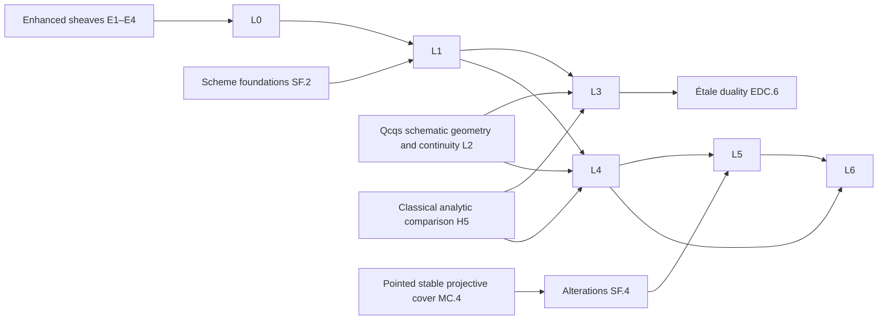

# Adic coefficients and comparison with schemes

Proposed roadmap `AdicCoefficientsAndComparisons`; complete target-level planning pass for L0–L6. Every stage is **planned**, none is closed. The packet has 45 declarations, 78 API items, 56 unit tests, 29 planets, 17 baseline citations, eight recorded gaps and eighteen supplier requests. Every implementation status is unchecked.

The main source is Scholze’s *Étale cohomology of diamonds*, §§26–27. Added sources contribute general-base compactifications, corrected boundary and vector-bundle refinements, and higher-cohomology/constructible-category continuity. The paper versions, passages and hashes are listed below. The [packet](../packets/AdicCoefficientsAndComparisons.json), this document and the [suggested file](../suggested/AdicCoefficientsAndComparisons.lean) use the same declaration ids and API/test names.

## Dependency boundaries

EnhancedDerivedSheaves E1–E4 supplies enhanced sheaves, completion interfaces, left completion and coherent coefficient systems; DerivedDeRhamCohomology DD.1 remains the generic completion owner. DiamondEtaleCohomology C0/C2/C3/C6 and DiamondSixOperations S0/S1/S3/S5 supply the diamond formalism. SchemeAndStackFoundations SF.2 supplies the existing scheme support carrier and pro-étale exports; L2 extends it. ClassicalAdicEtaleCohomology H0/H1/H5 supplies the Galois and analytic inputs. The existing AdicSpaces roadmap and native Spa supply adic foundations, not a scheme/diamond comparison theorem.

The diagram shows supplier direction. The proposed L2 split below separates its purely schematic approximation/compactification/continuity prefix from its enhanced coefficient extension. It also makes those shared inputs available to the GeneralBasesFourier consumer without adding an analytic dependency.

## L0. Adic coefficients

The coefficient ring Λ is complete for I, where I is generated by a finite regular sequence and contains an integer prime to p. The enhanced v-derived carrier, its completion and the coherent coefficient tower are imported. L0 adds the étale condition after reduction. For Λ=Zℓ, I=(ℓ), require ℓ≠p. The completed constant coefficient object is the tensor unit; identifying it with a discrete constant sheaf requires a separate argument. Rational coefficients here mean scalar localisation of integral constructible lattices. The completed ℓ-telescope is zero and cannot define that rational category.

| Declaration | Kind | Planet |
|---|---|---|
| `L0/derived-I-complete-etale-category` | definition | Adic étale derived category |
| `L0/adic-coefficient-limit` | theorem | Adic coefficient reconstruction |
| `L0/completed-tensor-and-colimits` | construction | Completed tensor product |
| `L0/six-operations-for-adic-coefficients` | construction | Six adic operations |
| `L0/reduction-detects-equivalences` | theorem | Adic reduction principle |
| `L0/rational-constructible-coefficients` | construction | Rational constructible coefficients |

### Adic étale derived category

Declaration `AdicCoefficientsAndComparisons:L0/derived-I-complete-etale-category`. Dét,adic(Y,Λ) is the full enhanced subcategory of D(Yv,Λ) on derived I-complete A whose derived reduction A⊗ΛΛ/I is in the discrete étale subcategory. Derived completeness uses the imported completion functor, not completeness of individual cohomology modules alone. The coefficient unit is the completed constant coefficient object, not an unverified identification with the discrete constant Λ-sheaf.

Hypotheses: Λ commutative, I-adically complete; I finitely generated by a regular sequence and containing an integer prime to p. Y a small v-stack over characteristic-p perfectoid spaces.

Construction or proof:

1. Use the enhanced sheaf category and the discrete étale essential-image predicate.
2. Intersect the derived-complete object property with the étale reduction property; inherit morphisms through the native full subcategory.

Direct prerequisites: `EnhancedDerivedSheaves:E1/enhanced-derived-category`, `EnhancedDerivedSheaves:E4/the-imported-completion-interface`, `DiamondEtaleCohomology:C2`, `mathlib:CategoryTheory.ObjectProperty.FullSubcategory`.

Uses: ECD §26 operations: The common carrier for completed operations. L1 and L3: The target of adic scheme comparison.

API:

| Name | Role | Contract |
|---|---|---|
| `AdicEtale.ofComplete` | constructor | From A, a derived-completeness witness and an étale-reduction witness, construct the corresponding object. |
| `AdicEtale.forget` | coercion | Fully faithful inclusion into enhanced D(Yv,Λ). |
| `AdicEtale.mem_iff` | characterisation | Membership is precisely the conjunction of the two stated object properties. |
| `AdicEtale.reduce` | functoriality | For n≥1, derived reduction to Λ/Iⁿ lands in the discrete étale category. |
| `AdicEtale.ext` | extensionality | Two morphisms are equal iff their images in D(Yv,Λ) are equal. |
| `AdicEtale.discrete_zeroIdeal` | compatibility | For I=0 and Λ killed by an integer prime to p, identify with the supplied discrete category through the same inclusion. |

Unit tests:

- `AdicEtale.point`: At a geometric point with Λ=Zℓ, I=(ℓ), the constant lattice Λ[0] is admitted and reduces to Z/ℓⁿ.
- `AdicEtale.torsion`: The constant Z/ℓ complex is admitted: derived ℓ-completeness does not mean torsion freeness.
- `AdicEtale.reject_inverted`: The nonzero constant Qℓ object in ambient D(Yv,Zℓ) is not derived ℓ-complete; derived completion sends it to zero.
- `AdicEtale.empty`: For Y empty the category has only the zero object up to equivalence.

Acceptance:

- No noetherianity of Λ is added.
- I=0 gives the discrete category only in the standing prime-to-p torsion coefficient range.

Sources: [ECD](https://people.mpim-bonn.mpg.de/scholze/EtCohDiamonds.pdf), Definition 26.1, pp. 161–162.

### Enhanced coefficient reconstruction

Declaration `AdicCoefficientsAndComparisons:L0/adic-coefficient-limit`. Reduction induces an equivalence of PRESENTABLE STABLE enhanced categories Dét,adic(Y,Λ) ≃ limₙ Dét(Y,Λ/Iⁿ), with coherent derived base-change identifications at consecutive levels. Its homotopy category is the category in Definition 26.1.

Hypotheses: Λ commutative, I-adically complete; I finitely generated by a regular sequence and containing an integer prime to p. Y a small v-stack over characteristic-p perfectoid spaces.

Construction or proof:

1. Apply the supplier reconstruction to derived-complete enhanced sheaves.
2. Restrict to the full étale-reduction subcategory; higher reductions remain étale by the I-adic filtration.
3. Presentability and stability follow from the enhanced limit, not the ordinary inverse limit of homotopy categories.

Direct prerequisites: `AdicCoefficientsAndComparisons:L0/derived-I-complete-etale-category`, `EnhancedDerivedSheaves:E4/compatible-coefficient-systems`, `EnhancedDerivedSheaves:E4/coefficient-system-reconstruction`, `DiamondEtaleCohomology:C0`.

Acceptance:

- Compatible tower includes higher coherence data.
- No noetherianity hypothesis inserted.

Sources: [ECD](https://people.mpim-bonn.mpg.de/scholze/EtCohDiamonds.pdf), Proposition 26.2, p. 162.

### Rational coefficients from integral lattices

Declaration `AdicCoefficientsAndComparisons:L0/rational-constructible-coefficients`. For ℓ≠p, define the rational lattice category as the scalar localisation Dcons(X,Zℓ)[1/ℓ]: objects are integral constructible complexes, with Hom tensored with Qℓ, and coherent localisation of composition. Over topologically noetherian schemes in BS §6.8 this is equivalent to the supplied constructible Qℓ category. No equivalence with arbitrary Qℓ sheaves on a general v-stack is asserted.

Hypotheses: Integral bounded constructible ℓ-adic category supplied for the scheme/site in question. The BS comparison uses its topologically noetherian scheme hypotheses.

Construction or proof:

1. Localise morphism complexes of the integral lattice enhancement coherently and take its homotopy category.
2. Use BS 6.8.14 for the topologically noetherian scheme comparison.
3. For general diamonds record the need for an independent lattice/constructibility theorem; do not invert ℓ by completed colimits.

Direct prerequisites: `AdicCoefficientsAndComparisons:L0/derived-I-complete-etale-category`, `EnhancedDerivedSheaves:E1/enhanced-derived-category`, `SchemeAndStackFoundations:SF.2`.

Uses: Campaign L0 rational variant: Clarifies what rational coefficients mean without completed presentable localisation. BS 6.8.14: Agreement with the closest scheme coefficient category.

API:

| Name | Role | Contract |
|---|---|---|
| `RationalLattice.localise` | constructor | Integral constructible complexes map into the rational lattice category. |
| `RationalLattice.hom` | characterisation | Hom(A,B)=Homint(A,B)⊗Zℓ Qℓ with localised composition. |
| `RationalLattice.invert` | simp | Multiplication by ℓ on each localised object is invertible. |
| `RationalLattice.universal` | universal-property | Λ-linear enhanced functors inverting ℓ factor through the scalar localisation. |
| `RationalLattice.schemeComparison` | equivalence | Under BS §6.8 hypotheses compare with constructible Qℓ complexes; the integral lattice realises this functor. |

Unit tests:

- `RationalLattice.point`: At a geometric point, the localised rank-one lattice has endomorphism ring Qℓ, not zero.
- `RationalLattice.torsion`: An integral constructible complex killed by a power of ℓ becomes zero.
- `RationalLattice.zero`: The zero integral complex remains zero.
- `RationalLattice.isogeny`: Multiplication by ℓ on the rank-one lattice becomes an isomorphism.

Acceptance:

- The distinction between rational lattices and all rational sheaves is retained.

Sources: [BS](https://arxiv.org/pdf/1309.1198), Proposition 6.8.14.

### Completed operations on adic étale objects

Declaration `AdicCoefficientsAndComparisons:L0/completed-tensor-and-colimits`. On Dét,adic(Y,Λ), A⊗̂B=CompI(A⊗ᴸΛB) and colimadic Aα=CompI(colimambient Aα). The unit is CompI(Λconstant); internal RHom is the right adjoint of completed tensor. The inclusion generally fails to preserve colimits.

Hypotheses: Λ commutative, I-adically complete; I finitely generated by a regular sequence and containing an integer prime to p. Y a small v-stack over characteristic-p perfectoid spaces.

Construction or proof:

1. Restrict the completion of ambient tensor and colimits using étale reduction.
2. Import enhanced monoidal completion and tensor/Hom adjunction from the generic owners.
3. Identify reductions using coefficient reconstruction.

Direct prerequisites: `AdicCoefficientsAndComparisons:L0/adic-coefficient-limit`, `EnhancedDerivedSheaves:E4/the-imported-completion-interface`, `EnhancedDerivedSheaves:E1/presentability-and-derived-tensor`.

Uses: ECD 26.3 and 27.1(i): Reduction and tensor comparison. Rational coefficients: The ℓ-telescope test prevents rational coefficients being defined by presentable adic localisation.

API:

| Name | Role | Contract |
|---|---|---|
| `AdicEtale.tensor` | structure | Closed symmetric monoidal completed tensor with unit Λ. |
| `AdicEtale.colimit` | universal-property | Mapping out of the completed ambient colimit into a complete object satisfies the enhanced colimit universal property. |
| `AdicEtale.tensor_reduce` | compatibility | Reduction of completed tensor is the derived tensor of reductions over Λ/Iⁿ. |
| `AdicEtale.internalHom` | universal-property | Map(A⊗̂B,C)≃Map(A,RHom(B,C)) in enhanced mapping spaces. |
| `AdicEtale.unit_tensor` | simp | CompI(Λconstant)⊗̂A≃A. |

Unit tests:

- `AdicEtale.tensor_point`: For Zℓ at a point, Z/ℓ⊗ᴸZℓ Z/ℓ has a nonzero Tor term in degree −1; it is not ordinary tensor alone.
- `AdicEtale.telescope`: The completed colimit Zℓ --ℓ→ Zℓ --ℓ→ ... is zero, although its ambient colimit is Qℓ.
- `AdicEtale.empty_colimit`: The empty completed colimit is zero.
- `AdicEtale.unit`: Zℓ⊗̂Zℓ≃Zℓ at a point.

Acceptance:

- The tensor is derived and completed.
- Distinguish ordinary coproduct from its completed value.

Sources: [ECD](https://people.mpim-bonn.mpg.de/scholze/EtCohDiamonds.pdf), §26 following Proposition 26.2, p. 162.

### Derived reduction detects equivalences

Declaration `AdicCoefficientsAndComparisons:L0/reduction-detects-equivalences`. For a map between derived I-complete objects, reduction modulo I is an equivalence iff the map is an equivalence. For exact enhanced Λ-linear operations with the coherent scalar-change data of the E4 supplier, perfect reduction and the filtration of Iⁿ identify all finite-level operations, including right adjoints.

Hypotheses: Λ commutative, I-adically complete; I finitely generated by a regular sequence and containing an integer prime to p. Y a small v-stack over characteristic-p perfectoid spaces.

Construction or proof:

1. Apply derived Nakayama to the cone using the completion supplier.
2. Use a Koszul finite resolution of Λ/I for the regular sequence; use the finite filtration of Λ/Iⁿ to pass to n.
3. Apply to cones of the specified natural transformations; exactness alone is not a scalar-change hypothesis.

Direct prerequisites: `AdicCoefficientsAndComparisons:L0/adic-coefficient-limit`, `EnhancedDerivedSheaves:E4/perfect-coefficient-change`, `EnhancedDerivedSheaves:E4/the-imported-completion-interface`.

Acceptance:

- Exclude a map between arbitrary noncomplete objects.
- State perfect Λ-linearity and finite-level identification explicitly.

Sources: [ECD](https://people.mpim-bonn.mpg.de/scholze/EtCohDiamonds.pdf), Remark 26.3, p. 162.

### Six adic operations

Declaration `AdicCoefficientsAndComparisons:L0/six-operations-for-adic-coefficients`. For arbitrary f:Y′→Y, restriction gives f*, with right adjoint Rf*. For compactifiable f representable in locally spatial diamonds and locally finite dim.trg, coherent levelwise Rf! gives Rf!:Dét,adic(Y′,Λ)→Dét,adic(Y,Λ), with right adjoint f!. Tensor and internal Hom are those of the preceding node. All six operations have the coefficient-change identifications of Remark 26.3.

Hypotheses: Λ commutative, I-adically complete; I finitely generated by a regular sequence and containing an integer prime to p. Y a small v-stack over characteristic-p perfectoid spaces. The support operations require precisely the geometric eligibility conditions just stated.

Construction or proof:

1. Use restriction on the v-site, which preserves limits and reduction.
2. Construct support pushforward on the coherent tower of coefficient rings using the six-operation suppliers.
3. Pass to the enhanced limit; obtain right adjoints by presentability. Apply the perfect-coefficient-change supplier to right adjoints.

Direct prerequisites: `AdicCoefficientsAndComparisons:L0/adic-coefficient-limit`, `AdicCoefficientsAndComparisons:L0/completed-tensor-and-colimits`, `EnhancedDerivedSheaves:E4/perfect-coefficient-change`, `DiamondSixOperations:S0`, `DiamondSixOperations:S1`, `DiamondSixOperations:S3`.

Uses: ECD 27.4–27.5: The operations compared with schemes. Diamond duality consumers: Adic extension of the torsion formalism.

API:

| Name | Role | Contract |
|---|---|---|
| `AdicSix.pullback` | functoriality | Coherent f* for all small v-stack maps, identity and composition. |
| `AdicSix.pushAdjunction` | universal-property | f* ⊣ Rf*. |
| `AdicSix.support` | constructor | Given geometric eligibility, coherent Rf! specialising to extension by zero for opens and Rf* for proper maps. |
| `AdicSix.shriekAdjunction` | universal-property | Rf! ⊣ f!. |
| `AdicSix.reduce` | compatibility | All six operations agree after Λ/Iⁿ reduction with the supplied discrete operations; identify the canonical comparison. |
| `AdicSix.baseChange` | compatibility | Base-change transformations and projection formulas are inherited by reduction, with their original geometric hypotheses. |

Unit tests:

- `AdicSix.identity`: For idY, all four functors and all adjunction units/counits are identity up to the specified coherent equivalence.
- `AdicSix.empty_open`: Extension by zero from the empty open is the zero functor.
- `AdicSix.open_boundary`: For j:U↪Y and a geometric point outside U, (j!Λ) has zero stalk; j* direct image need not.
- `AdicSix.proper`: For a finite proper disjoint union of two geometric points over one, Rf!Λ=Rf*Λ=Λ⊕Λ.

Acceptance:

- All coefficient-change diagrams commute, not only objectwise reductions.
- No f! is attached to a geometrically ineligible map.

Sources: [ECD](https://people.mpim-bonn.mpg.de/scholze/EtCohDiamonds.pdf), §26 operations and Remark 26.3, p. 162.

Layer status: **planned**. Remaining obligations:

- AdicCoefficientsAndComparisons/G-enhancement: Enhanced and geometric carriers unavailable in pinned Lean
- AdicCoefficientsAndComparisons/G-rational: Rational lattice comparison scope
- Resolve precise supplier requests before claiming closure.

## L1. The scheme-to-v-sheaf constructions

The characteristic-p construction begins with an arbitrary scheme and its discrete affine pair (R,R⁺), with R⁺ the integral closure of Fp. Its output is a small v-sheaf, and it factors through perfection. The mixed-characteristic construction begins with a complete DVR O with perfect residue field and a scheme locally of finite type over O. Its points are marked untilts over Spa(O,O) with O-linear locally ringed-space maps to the scheme. The two residue-field conventions are related by a plus-ring map; they are not identified by notation. The unbounded scheme coefficient source is left-completed. SF.2 must export the pro-étale comparison beyond the existing native site.

| Declaration | Kind | Planet |
|---|---|---|
| `L1/char-p-scheme-diamond-and-comparison-functor` | construction | Characteristic-p scheme v-sheaf |
| `L1/scheme-adic-category` | definition | Scheme adic étale category |
| `L1/comparison-pullback` | construction | Scheme comparison pullback |
| `L1/mixed-characteristic-scheme-diamond` | construction | Mixed-characteristic scheme diamond |
| `L1/plus-convention-comparison` | theorem | — |

### Characteristic-p scheme v-sheaf

Declaration `AdicCoefficientsAndComparisons:L1/char-p-scheme-diamond-and-comparison-functor`. For a characteristic-p scheme X, construct X◇ as the v-sheaf of maps from perfectoid S to the adic avatar of X. On Spec R use the discrete pair (R,R⁺), R⁺ the integral closure of Fp in R; glue along scheme opens. It factors through perfection. This construction makes no local finite-type hypothesis.

Hypotheses: X arbitrary of characteristic p. Universe and smallness conventions of the v-stack supplier.

Construction or proof:

1. Use native Spa with the indicated plus subring, supplied adicification and v-sheafification.
2. Glue along scheme open immersions and prove descent.
3. Frobenius is invertible on perfectoid test objects, so the functor factors through perfection.

Direct prerequisites: `tauceti:TauCeti.ValuationSpectrum.spa`, `tauceti:TauCeti.ValuationSpectrum.spa_integralClosure`, `DiamondsAndVStacks:D6`, `PerfectoidSpaces:P1`.

Uses: ECD 27.2–27.4: Comparison for arbitrary characteristic-p schemes and their perfections. L2 geometric limit inputs: Infinite-variable perfected affine charts.

API:

| Name | Role | Contract |
|---|---|---|
| `SchemeDiamond.charP` | constructor | Functor from characteristic-p schemes to small v-sheaves. |
| `SchemeDiamond.charP_points` | characterisation | On perfectoid S, sections are precisely adic maps S→Xad with the stated plus ring. |
| `SchemeDiamond.charP_open` | compatibility | Scheme open immersion induces the corresponding open v-sheaf immersion. |
| `SchemeDiamond.charP_perfection` | equivalence | Xperf◇≃X◇, naturally in X. |
| `SchemeDiamond.charP_functor` | functoriality | Identity and composition with coherent gluing. |
| `SchemeDiamond.charP_spa` | compatibility | Affine chart uses native TauCeti.ValuationSpectrum.spa for the discrete pair (R,R⁺). |

Unit tests:

- `SchemeDiamond.Fp`: Spec Fp maps to Spd(Fp,Fp).
- `SchemeDiamond.plusRing`: For a perfect field k extending Fp, the chart uses k⁺=integral closure of Fp; it must not silently use k.
- `SchemeDiamond.empty`: The empty scheme gives the empty v-sheaf.
- `SchemeDiamond.frobenius`: Frobenius induces an isomorphism on X◇ even if X was not perfect.

Acceptance:

- Retain integral-closure-of-Fp plus ring, even when R is a field.

Sources: [ECD](https://people.mpim-bonn.mpg.de/scholze/EtCohDiamonds.pdf), §27 opening paragraph, p. 163.

### Scheme adic étale category

Declaration `AdicCoefficientsAndComparisons:L1/scheme-adic-category`. Dét,adic(X,Λ) is the full enhanced subcategory of D(Xproét,Λ) consisting of derived I-complete A for which A⊗ᴸΛΛ/I belongs to the LEFT-COMPLETED étale essential image D̂(Xét,Λ/I). Equivalently, the reduction has classical étale cohomology sheaves. Replace D̂ by ordinary D only under a verified left-completeness hypothesis.

Hypotheses: Λ commutative, I-adically complete; I finitely generated by a regular sequence and containing an integer prime to p. X a scheme.

Construction or proof:

1. Use the SF.2 pro-étale export and the enhanced completion supplier.
2. Use BS 5.3.2 for the unbounded left-completed image, BS 5.2.6 only for bounded below.
3. Form the native full subcategory.

Direct prerequisites: `mathlib:CategoryTheory.ObjectProperty.FullSubcategory`, `SchemeAndStackFoundations:SF.2`, `EnhancedDerivedSheaves:E4/the-imported-completion-interface`, `EnhancedDerivedSheaves:E2/left-completion`.

Uses: ECD 27.2: Correct source for unbounded comparison. RT-AREA-etale/23: Names the exact missing SF.2 pro-étale export.

API:

| Name | Role | Contract |
|---|---|---|
| `SchemeAdic.ofComplete` | constructor | Embed a derived-complete pro-étale complex with classical étale reduction cohomology. |
| `SchemeAdic.forget` | coercion | Fully faithful inclusion into enhanced D(Xproét,Λ). |
| `SchemeAdic.reduce` | functoriality | Reduction to Λ/Iⁿ belongs to the left-completed étale category. |
| `SchemeAdic.boundedBelow` | compatibility | Bounded-below étale complexes agree with their pro-étale pullbacks under BS 5.2.6. |
| `SchemeAdic.leftComplete` | equivalence | If the étale derived category is left complete, use ordinary étale complexes in the reduction condition. |
| `SchemeAdic.ext` | extensionality | Equality of morphisms is detected by the pro-étale inclusion. |

Unit tests:

- `SchemeAdic.geometricPoint`: At an algebraically closed point with Zℓ, the constant lattice belongs and its reductions are the classical étale constants.
- `SchemeAdic.zeroIdeal`: For I=0 and prime-to-p torsion Λ, the category is the left-completed étale essential image, not all pro-étale complexes.
- `SchemeAdic.reject_inverted`: The ambient nonzero Qℓ constant is excluded for Λ=Zℓ,I=(ℓ).
- `SchemeAdic.empty`: Over the empty scheme all objects are zero.

Acceptance:

- Ordinary unbounded D is not substituted without finite-dimensionality evidence.

Sources: [ECD](https://people.mpim-bonn.mpg.de/scholze/EtCohDiamonds.pdf), §27 pro-étale paragraph, p. 163.

### Mixed-characteristic scheme diamond

Declaration `AdicCoefficientsAndComparisons:L1/mixed-characteristic-scheme-diamond`. Fix a complete DVR O with perfect residue field k of characteristic p. For X locally of finite type over O, X◇(S) consists of an untilt S♯ over Spa(O,O) and an O-linear locally ringed-space map S♯→X. This gives a diamond over Spd O, naturally in X. For Spec k it gives Spd(k,k), which differs from the characteristic-p convention when k⁺≠k.

Hypotheses: O and X as stated; perfectoid tests S have characteristic p.

Construction or proof:

1. Use the untilt supplier over the explicit pair (O,O).
2. Form the mapping v-sheaf and check it is a diamond using D6 geometry.
3. Glue finite-type affine charts; retain the local finite-type hypothesis for representability.

Direct prerequisites: `DiamondsAndVStacks:D6`, `PerfectoidSpaces:P1`, `tauceti:TauCeti.ValuationSpectrum.spa`.

Uses: ECD 27.5–27.7: The mixed-characteristic comparison space. L4 test space: Base change along its analytic cover.

API:

| Name | Role | Contract |
|---|---|---|
| `SchemeDiamond.overDVR` | constructor | Functor from locally finite-type O-schemes to diamonds over Spd O. |
| `SchemeDiamond.overDVR_points` | characterisation | Sections are the untilt/mapping pairs in the statement. |
| `SchemeDiamond.overDVR_functor` | functoriality | Composition, identity and gluing along opens. |
| `SchemeDiamond.overDVR_closedFibre` | compatibility | The residue point is Spd(k,k). |
| `SchemeDiamond.overDVR_generic` | compatibility | Generic fibre agrees with the analytic generic-fibre diamond where that avatar exists. |
| `SchemeDiamond.overDVR_empty` | simp | Empty scheme maps to empty diamond. |

Unit tests:

- `SchemeDiamond.residue`: Spec k gives Spd(k,k), retaining k as the plus ring.
- `SchemeDiamond.base`: Spec O gives Spd(O,O), with structural morphism identity.
- `SchemeDiamond.emptyDVR`: Empty O-scheme gives empty diamond.
- `SchemeDiamond.nonagreement`: For perfect k with elements transcendental over Fp, k⁺ is a proper subring: the two residue-point conventions cannot be asserted equal.

Acceptance:

- Do not identify its closed fibre with the characteristic-p avatar without changing the plus ring.

Sources: [ECD](https://people.mpim-bonn.mpg.de/scholze/EtCohDiamonds.pdf), §27 mixed-characteristic paragraph, pp. 165–166.

### Scheme-to-v-sheaf comparison functor

Declaration `AdicCoefficientsAndComparisons:L1/comparison-pullback`. The natural morphism cX:X◇v→Xét for discrete coefficients, and cX:X◇v→Xproét for adic coefficients, induces derived pullback cX*. In the adic case use completed pullback into Dét,adic(X◇,Λ); its source is the scheme adic category. The same construction for O-schemes uses the mixed-characteristic diamond below.

Hypotheses: Discrete coefficient case and regular adic case use their separate source categories.

Construction or proof:

1. Construct the morphism of sites on supplied étale/pro-étale objects.
2. Derive the pullback through the enhanced sheaf supplier; complete it for the adic category.
3. Check reduction and geometric points, including the mixed-characteristic convention.

Direct prerequisites: `AdicCoefficientsAndComparisons:L1/char-p-scheme-diamond-and-comparison-functor`, `AdicCoefficientsAndComparisons:L1/scheme-adic-category`, `AdicCoefficientsAndComparisons:L0/derived-I-complete-etale-category`, `mathlib:AlgebraicGeometry.Scheme.smallEtaleTopology`, `EnhancedDerivedSheaves:E1/presentability-and-derived-tensor`, `SchemeAndStackFoundations:SF.2`.

Uses: ECD 27.1–27.7: Canonical functor whose operation comparisons and full faithfulness are tested. EtaleDualityAndPerverseSheaves:EDC.6: Import the characteristic-p operation comparison from L3.

API:

| Name | Role | Contract |
|---|---|---|
| `SchemeComparison.pullback` | constructor | Derived cX* on the specified source category. |
| `SchemeComparison.reduce` | compatibility | cX* commutes with Λ/Iⁿ reduction by the canonical coherent map. |
| `SchemeComparison.stalk` | characterisation | At a geometric perfectoid point, identify pullback with the corresponding scheme geometric stalk. |
| `SchemeComparison.unit` | simp | cX* of the coefficient unit is the coefficient unit. |
| `SchemeComparison.colimit` | functoriality | Preserves the completed enhanced colimits, yielding a right adjoint. |

Unit tests:

- `SchemeComparison.point`: At a geometric point finite torsion constants pull back to the same coefficient complex.
- `SchemeComparison.zero`: cX*0=0.
- `SchemeComparison.openSupport`: The pullback of a sheaf extended by zero from a scheme open has zero stalks outside the corresponding diamond open.
- `SchemeComparison.adic`: The pulled-back Zℓ lattice has reductions Z/ℓⁿ; the operation uses derived completion.

Acceptance:

- The morphism is from the v-site towards the scheme site.

Sources: [ECD](https://people.mpim-bonn.mpg.de/scholze/EtCohDiamonds.pdf), §27, p. 163 and mixed-characteristic paragraph pp. 165–166.

### Comparison of residue-field conventions

Declaration `AdicCoefficientsAndComparisons:L1/plus-convention-comparison`. For a perfect field k over Fp with k⁺ the integral closure of Fp, the inclusion k⁺⊂k gives a natural map Spd(k,k)→Spd(k,k⁺) between the mixed-characteristic residue avatar and the characteristic-p scheme avatar. In the finite algebraic extension case k=k⁺ it is the identity. It is not asserted to be an isomorphism for general k.

Hypotheses: O has residue field k; k perfect.

Construction or proof:

1. Use the identity ring map and the inclusion of plus rings in native Spa.
2. Use native spa_antitone and v-sheafification to get the direction.
3. For k algebraic over Fp all elements are integral, so the pairs agree.

Direct prerequisites: `AdicCoefficientsAndComparisons:L1/char-p-scheme-diamond-and-comparison-functor`, `AdicCoefficientsAndComparisons:L1/mixed-characteristic-scheme-diamond`, `tauceti:TauCeti.ValuationSpectrum.spa_antitone`.

Acceptance:

- The arrow points from the larger plus ring to the smaller one.

Sources: [ECD](https://people.mpim-bonn.mpg.de/scholze/EtCohDiamonds.pdf), Mixed-characteristic paragraph, pp. 165–166.

Layer status: **planned**. Remaining obligations:

- AdicCoefficientsAndComparisons/G-enhancement: Enhanced and geometric carriers unavailable in pinned Lean
- Resolve precise supplier requests before claiming closure.

## L2. General qcqs scheme compactification and coefficient extensions

This is also the shared schematic supplier for approximation and continuity. Its geometric prefix has no diamond-support prerequisite. Native Scheme, properness, open immersions, local finite presentation and schematic image are reused. Finite presentation means quasi-compact, quasi-separated and locally finitely presented. Separate finite type from finite presentation throughout: a finite-type morphism can have infinitely many relations. Ordinary compactifications allow extra proper components. Strict arrows control inverse images of the open; fp compactifications impose finite presentation on the proper ambient map. Both binary refinement and parallel-arrow equalisation are required. The coefficient extension uses the existing scheme support carrier. Zavyalov contributes only its §2.1 compactification results here; universally coherent quasi-coherent duality in §2.2 is outside this issue’s targets.

The noetherian repairs used for the added Boxer–Pilloni sources are:

- Cartier boundary: take a schematically dense refinement and blow up the ambient compactification at the boundary ideal.
- Finite locally free extension: split the finitely many constant-rank pieces of the open, take their disjoint schematic closures, extend coherently there and apply Tag 0ESN on each piece.
- Cofilteredness: equalise parallel arrows with the closed diagonal, in addition to forming common refinements. In the fp category, carry this construction out after noetherian descent.

| Declaration | Kind | Planet |
|---|---|---|
| `L2/nagata-factorisation-as-used-in-27-4` | theorem | Nonnoetherian Nagata compactification |
| `L2/affine-transition-limit-existence` | theorem | — |
| `L2/noetherian-approximation` | theorem | — |
| `L2/fp-relative-diagram-descent` | theorem | — |
| `L2/compactification-property-descent` | theorem | — |
| `L2/finite-type-fp-factorisation` | theorem | — |
| `L2/compactification` | definition | Scheme compactification |
| `L2/fp-compactification` | definition | Finitely presented compactification |
| `L2/compactification-morphism` | definition | — |
| `L2/compactification-category` | construction | — |
| `L2/strict-from-dense` | theorem | — |
| `L2/compactification-cofiltered` | theorem | — |
| `L2/fp-compactification-limit` | theorem | — |
| `L2/fp-strict-cofiltered` | theorem | Strict fp compactification cofilteredness |
| `L2/cartier-boundary-cofinal` | theorem | — |
| `L2/vector-bundle-extension-cofinal` | theorem | Vector-bundle extension compactifications |
| `L2/etale-cohomology-continuity` | theorem | — |
| `L2/constructible-Hom-continuity` | theorem | — |
| `L2/constructible-derived-continuity` | theorem | Constructible category continuity |
| `L2/scheme-support-extension` | construction | — |
| `L2/coefficient-and-unbounded-extension` | theorem | — |

### Affine-transition inverse limits

Declaration `AdicCoefficientsAndComparisons:L2/affine-transition-limit-existence`. Every directed inverse system of schemes with affine transition morphisms has a limit in Schemes; its projections are affine, and restriction to an open in any base stage commutes with the limit. If all stages are qcqs, so is the limit.

Hypotheses: Small directed nonempty index set; transitions affine.

Construction or proof:

1. On affine opens of a chosen base stage take Spec of the filtered colimit of coordinate algebras.
2. Glue the resulting charts using the uniqueness part of the affine universal property.
3. Verify the cone universal property and affine projections; finite affine covers and qc intersections give qcqs.

Direct prerequisites: `mathlib:AlgebraicGeometry.Scheme.exists_π_app_comp_eq_of_locallyOfFinitePresentation`.

Acceptance:

- The native factorisation theorem assumes a limit; it is not evidence for existence.

Sources: [ST-01YX](https://stacks.math.columbia.edu/tag/01YX), Lemma 32.2.2, Tag 01YX.

### Scheme compactification

Declaration `AdicCoefficientsAndComparisons:L2/compactification`. For a separated finite-type f:Y→X with X qcqs, a compactification is a scheme Ybar, a quasi-compact open immersion j:Y→Ybar, a proper p:Ybar→X and the equality p∘j=f. Density is NOT part of the definition: additional proper components are permitted. It is native Scheme and native proper/open predicates.

Hypotheses: X qcqs; f separated finite type.

Construction or proof:

1. Bundle the stated native morphisms and factorisation equality.
2. Define schematic density only as the native separate IsSchemeTheoreticallyDominant j property.

Direct prerequisites: `mathlib:AlgebraicGeometry.IsProper`, `mathlib:AlgebraicGeometry.IsSchemeTheoreticallyDominant`, `mathlib:AlgebraicGeometry.AffineSpace`.

Uses: ECD 27.4–27.5: Define scheme proper-support functors on qcqs bases. BP 2.1.5–6 and ZAV 2.1: Refinements of compactifications.

API:

| Name | Role | Contract |
|---|---|---|
| `Compactification.mk` | constructor | Bundle the proper morphism and qc open immersion factoring f. |
| `Compactification.ambient` | projection | The native scheme Ybar. |
| `Compactification.open` | projection | The native qc open immersion j with its open range. |
| `Compactification.properMap` | projection | The native proper p, together with p∘j=f. |
| `Compactification.iso` | equivalence | An ambient isomorphism commuting with j and p transports a compactification. |
| `Compactification.image` | compatibility | The native scheme-theoretic image of j gives the schematically dense refinement, with native toImage factorisation. |

Unit tests:

- `Compactification.proper`: If f is proper, (Y,idY,f) is a compactification.
- `Compactification.empty`: The empty Y admits (empty,identity,empty→X); it can also embed openly in any proper boundary scheme.
- `Compactification.extraComponent`: For X a point and Y that point, Y⊔Y proper over X with j the first summand is a compactification whose j is not dominant.
- `Compactification.nonproper`: The identity open embedding of A¹k with its structural map to Spec k is not a compactification, since the ambient map is not proper.

Acceptance:

- Extra proper boundary components are allowed; tests must distinguish them from the dense refinement.

Sources: [BP](https://www.ma.imperial.ac.uk/~gboxer/higherhidaSiegel.pdf), Definition 2.1.2, p. 7; Stacks Tag 0ATT for the general base; [ST-0ATT](https://stacks.math.columbia.edu/tag/0ATT), Definition 38.31.1, Tag 0ATT.

### Finite-presentation objects and diagram descent

Declaration `AdicCoefficientsAndComparisons:L2/fp-relative-diagram-descent`. For a directed affine-transition inverse system of qcqs Si with limit S, the category of finitely presented S-schemes is the filtered categorical colimit of the categories of finitely presented Si-schemes. Objects descend, maps descend, and equality of descended maps holds at a sufficiently large index. Finite diagrams and fp modules descend in the same sense.

Hypotheses: Finite presentation includes quasi-compactness and quasi-separatedness.

Construction or proof:

1. Descend affine finitely presented algebras using finitely many generators and relations.
2. Glue a finite affine cover; use native morphism factorisation for maps to lfp targets with a given limit cone.
3. Descend equalities and finitely many cocycle relations after a common index; apply Tag 01ZR for fp modules.

Direct prerequisites: `AdicCoefficientsAndComparisons:L2/affine-transition-limit-existence`, `mathlib:AlgebraicGeometry.Scheme.exists_π_app_comp_eq_of_locallyOfFinitePresentation`, `mathlib:AlgebraicGeometry.LocallyOfFinitePresentation`, `mathlib:AlgebraicGeometry.Scheme.exists_hom_hom_comp_eq_comp_of_locallyOfFiniteType`.

Acceptance:

- Include the eventual-equality clause, not only existence of models.
- Do not re-plan the native Hom factorisation lemma.

Sources: [ST-01ZM](https://stacks.math.columbia.edu/tag/01ZM), Lemma 32.10.1, Tag 01ZM; [ST-01ZR](https://stacks.math.columbia.edu/tag/01ZR), Lemma 32.10.2, Tag 01ZR.

### Finitely presented compactification

Declaration `AdicCoefficientsAndComparisons:L2/fp-compactification`. For separated finitely presented f:Y→X, an fp compactification is a compactification with p:Ybar→X locally of finite presentation. Properness already supplies quasi-compactness and quasi-separatedness, hence p is finitely presented.

Hypotheses: X qcqs; f separated finitely presented.

Construction or proof:

1. Add the native lfp predicate to the compactification carrier.
2. Use native properness to recover the remaining finite-presentation conditions.

Direct prerequisites: `AdicCoefficientsAndComparisons:L2/compactification`, `mathlib:AlgebraicGeometry.LocallyOfFinitePresentation`, `mathlib:AlgebraicGeometry.AffineSpace`.

Uses: ZAV 2.1.4–5: Limit descent and strict cofilteredness. Scheme upper-shriek extensions: Use the existing coefficient carrier over general bases.

API:

| Name | Role | Contract |
|---|---|---|
| `FPCompactification.mk` | constructor | Extend a compactification by a native lfp witness for p. |
| `FPCompactification.forget` | coercion | Forget to the same ordinary compactification; do not change its ambient scheme. |
| `FPCompactification.baseChange` | functoriality | Arbitrary base change preserves fp compactifications and their open factorisation. |
| `FPCompactification.finitePresentation` | characterisation | Proper p plus its lfp witness satisfies the native qc, qs and lfp finite-presentation convention. |

Unit tests:

- `FPCompactification.proper`: For a proper finitely presented f, the identity compactification is fp.
- `FPCompactification.empty`: The empty identity compactification is fp.
- `FPCompactification.basePoint`: Base change of P¹k compactifying A¹k to a field extension keeps the same open chart and a proper lfp ambient map.
- `FPCompactification.rejectFiniteType`: Over a noncoherent ring A with a non-finitely-generated ideal J, a proper closed Spec(A/J)→Spec A compactification is not necessarily fp.

Acceptance:

- Finite type alone is not substituted for finite presentation.

Sources: [ZAV](https://arxiv.org/pdf/2111.01830v3), Definition 2.1.1, p. 10.

### Maps and strict maps of compactifications

Declaration `AdicCoefficientsAndComparisons:L2/compactification-morphism`. A morphism C′→C is an X-map g:Ybar′→Ybar with g∘j′=j. It is strict precisely if the inverse image of j(Y) equals j′(Y), equivalently the open square with the identity of Y is cartesian. Morphisms are not required to be strict in the ambient category.

Hypotheses: Two compactifications of the same f.

Construction or proof:

1. Bundle the ambient native morphism and two triangle equalities.
2. Use equality of inverse-image opens as the strictness predicate; equivalent cartesian formulation via open immersions.

Direct prerequisites: `AdicCoefficientsAndComparisons:L2/compactification`.

Uses: ZAV 2.1.5: Strict cones and strict equalisation. BP 2.1.4–6: Control boundaries after refinements.

API:

| Name | Role | Contract |
|---|---|---|
| `Compactification.Hom.mk` | constructor | Bundle g with its two commuting triangles. |
| `Compactification.Hom.map` | projection | The ambient scheme map g. |
| `Compactification.Hom.ext` | extensionality | Two bundled morphisms are equal iff their ambient maps are equal. |
| `Compactification.Hom.strict_iff` | characterisation | Strictness iff inverse image of the target open range equals the source open range. |
| `Compactification.Hom.strict_comp` | functoriality | Identities and composites of strict morphisms are strict. |
| `Compactification.Hom.strict_baseChange` | compatibility | Base change preserves strictness, as in ZAV Remark 2.1.3. |

Unit tests:

- `Compactification.Hom.identity`: Every identity is strict.
- `Compactification.Hom.boundary`: The fold from the extra-component compactification Y⊔Y to Y is a compactification morphism but is not strict.
- `Compactification.Hom.empty`: Every map between compactifications of empty Y is strict, since both open ranges are empty.
- `Compactification.Hom.baseChange`: For a strict map, its pullback along any base map has exactly the pulled-back Y as the inverse image of the target open.

Acceptance:

- Keep the direction C′→C: refinements point towards coarser compactifications.

Sources: [ZAV](https://arxiv.org/pdf/2111.01830v3), Definition 2.1.1 and Remark 2.1.3, p. 10.

### Noetherian approximation of qcqs schemes

Declaration `AdicCoefficientsAndComparisons:L2/noetherian-approximation`. Every qcqs scheme S is a directed inverse limit of schemes Si finite type over Z with affine transitions, with affine projections S→Si. The presentation can be chosen with affine S→Si0; finitely many finite-presentation objects and morphisms descend after increasing the index.

Hypotheses: S qcqs; no noetherianity assumed on S.

Construction or proof:

1. Induct by adding one affine open U to an already approximated qc open V; the overlap W=U∩V is qc by quasi-separatedness and descends to quasi-affine Wi.
2. Write U=Spec B, R=Γ(W,O), Ri=Γ(Wi,O), and Bi=B×R Ri; choose finite-type subalgebras of Bi retaining the finite principal-open overlap data.
3. Glue finite-type affine charts to Vi along Wi and take the directed system of compatible choices. Check affine transitions and the limit by gluing.
4. Apply relative-object and eventual-equality descent to any finite fp diagram.

Direct prerequisites: `AdicCoefficientsAndComparisons:L2/affine-transition-limit-existence`, `AdicCoefficientsAndComparisons:L2/fp-relative-diagram-descent`.

Acceptance:

- No finite-type model is required to share the original nonnoetherian coordinate ring.

Sources: [ST-01ZA](https://stacks.math.columbia.edu/tag/01ZA), Proposition 32.5.4, Tag 01ZA; [ST-07RN](https://stacks.math.columbia.edu/tag/07RN), Lemma 32.5.3, Tag 07RN.

### Descent of compactification properties

Declaration `AdicCoefficientsAndComparisons:L2/compactification-property-descent`. In the relative fp descent situation, a descended open immersion becomes an open immersion at some index; a descended finite-type morphism that is proper at the limit becomes proper at some index. Applied to a compactification diagram, both properties and its commuting triangle hold at a common stage.

Hypotheses: qcqs bases and affine transitions; relative schemes and the relevant maps initially finitely presented, so the local finite-type/presentation assumptions of Tags 0EUU and 081F hold.

Construction or proof:

1. For the open map, use eventual étaleness and the eventual-isomorphism criterion onto its qc open image.
2. For the proper map, descend separatedness and apply Chow approximation, then descend the closed immersion into projective space.
3. Increase the common index to make the triangle commute and the open inverse-image equality hold.

Direct prerequisites: `AdicCoefficientsAndComparisons:L2/fp-relative-diagram-descent`, `SchemeAndStackFoundations:SF.2`.

Acceptance:

- No descent of arbitrary closed subschemes over a noncoherent base is inferred.

Sources: [ST-081F](https://stacks.math.columbia.edu/tag/081F), Lemma 32.13.1, Tag 081F, with Tag 0EUU for the open map; [ST-0EUU](https://stacks.math.columbia.edu/tag/0EUU), Lemma 32.8.12, Tag 0EUU.

### Finite-type factorisation through finite presentation

Declaration `AdicCoefficientsAndComparisons:L2/finite-type-fp-factorisation`. If f:Y→X is finite type, X qcqs, there is a closed immersion Y→Y′ and a finitely presented Y′→X. If f is separated, Y′→X can be chosen separated. This is the missing bridge from finite type to the fp limit machinery.

Hypotheses: No finite presentation of f assumed.

Construction or proof:

1. On finitely many affine charts, replace each finite-type algebra by a finitely presented algebra mapping onto it.
2. Use the relative factorisation and gluing argument of Stacks 32.9.6, retaining separatedness.
3. Apply native closed immersion and properness interfaces in subsequent compactification steps.

Direct prerequisites: `AdicCoefficientsAndComparisons:L2/fp-relative-diagram-descent`, `mathlib:AlgebraicGeometry.LocallyOfFinitePresentation`, `SchemeAndStackFoundations:SF.2`.

Acceptance:

- Infinite relation ideals are allowed in the closed immersion.

Sources: [ST-01ZJ](https://stacks.math.columbia.edu/tag/01ZJ), Proposition 32.9.6, Tag 01ZJ.

### Category of compactifications

Declaration `AdicCoefficientsAndComparisons:L2/compactification-category`. Ordinary compactifications of f, with the morphisms just defined, form a category Comp(f); fp compactifications form the full subcategory Compfp(f). Arbitrary base change induces functors on both categories and preserves strict arrows. Dense and bundle-extending compactifications are full subcategories, with cofinality expressed as initiality towards Comp(f).

Hypotheses: Fix f:Y→X; use universe choices consistent with native Schemes.

Construction or proof:

1. Compose and take identities on native ambient maps; triangle equations follow by associativity.
2. Use full subcategories for fp/dense predicates, retaining all ordinary arrows.
3. Define base change by native pullback and prove coherence; no quotient of isomorphism classes replaces the category.

Direct prerequisites: `AdicCoefficientsAndComparisons:L2/compactification-morphism`, `AdicCoefficientsAndComparisons:L2/fp-compactification`, `mathlib:CategoryTheory.ObjectProperty.FullSubcategory`.

Uses: L2 cofilteredness: Nonemptiness, cones and equalisation are three independent obligations. L2 scheme Rf!: Coherent independence uses the category, not just pairwise refinements.

API:

| Name | Role | Contract |
|---|---|---|
| `Compactification.category` | instance | Inherited category with ambient composition. |
| `FPCompactification.inclusion` | functoriality | Fully faithful inclusion into ordinary compactifications. |
| `Compactification.baseChange` | functoriality | Base-change functor, coherent for identity and composition. |
| `Compactification.isomorphism` | characterisation | A compactification arrow is an isomorphism iff its ambient map is an isomorphism. |

Unit tests:

- `Compactification.category_id`: Composition with the identity preserves the ambient morphism and the bundled map.
- `Compactification.parallelMaps`: For Y a point, C′=Y⊔Y and C=Y⊔Y, two arrows fixing the first summand and sending the other to different summands remain distinct morphisms.
- `Compactification.category_empty`: Comp(empty→X) retains proper ambient schemes; it is not the one-object category of empty schemes.
- `Compactification.fpForget`: Fp inclusion changes neither ambient maps nor their composition.

Acceptance:

- Ordinary category retains parallel arrows for the equaliser test.

Sources: [ZAV](https://arxiv.org/pdf/2111.01830v3), §2.1 and Lemma 2.1.4, p. 10.

### Strictness from a dense source

Declaration `AdicCoefficientsAndComparisons:L2/strict-from-dense`. A map C′→C whose source open j′(Y) is topologically dense in Ybar′ is strict. Over nonreduced schemes topological density still suffices for this set/open equality; schematic density is a separate requirement for vector-bundle extension.

Hypotheses: Both are compactifications; target proper, hence separated over X.

Construction or proof:

1. Restrict to the inverse image of the target open: it has a section Y→g⁻¹(Y).
2. Separatedness makes the section closed; it is also open and topologically dense, so it is all of g⁻¹(Y).

Direct prerequisites: `AdicCoefficientsAndComparisons:L2/compactification-morphism`.

Acceptance:

- Do not strengthen density gratuitously; do not use this lemma to satisfy Tag 0ESN.

Sources: [BP](https://www.ma.imperial.ac.uk/~gboxer/higherhidaSiegel.pdf), Lemma 2.1.4 and proof, p. 7.

### Higher étale cohomology continuity

Declaration `AdicCoefficientsAndComparisons:L2/etale-cohomology-continuity`. Let Xi be a directed inverse system of qcqs schemes with affine transitions and limit X. For a compatible system of abelian étale sheaves Fi with transition maps, set F=colimᵢ πi⁻¹Fi. Then colimᵢ Hqét(Xi,Fi)≅Hqét(X,F) for every q≥0. A sheaf descended from a fixed stage is a special case. For the system Gm,Xi, the sheaf colimit is Gm,X by its finite-presentation representing scheme; the inverse-image maps πi⁻¹Gm,Xi→Gm,X need NOT be individually isomorphisms.

Hypotheses: qcqs stages, affine transitions; sheaf transition maps with their composition law.

Construction or proof:

1. Identify the limit étale site through finitely presented étale objects, eventual equality and descended finite covering families.
2. Apply the étale-topos continuity theorem to F=colim πi⁻¹Fi for all q.
3. For Gm, descend a unit and its inverse on each fp étale chart; this identifies the SHEAF COLIMIT with Gm,X, not the individual inverse image. Apply the same Hq theorem, as in CES §4.10.

Direct prerequisites: `AdicCoefficientsAndComparisons:L2/fp-relative-diagram-descent`, `SchemeAndStackFoundations:SF.2`.

Acceptance:

- Include all q, including q=2 for Gm.
- Do not substitute ordinary ring/global-section continuity.

Sources: [ST-09YQ](https://stacks.math.columbia.edu/tag/09YQ), Theorem 59.51.3, Tag 09YQ; CES §4.10; [CES](https://arxiv.org/pdf/1711.06456v4), §4.10, especially (4.10.5)–(4.10.7), printed pp. 9–11 in the retrieved PDF.

### Nonnoetherian Nagata compactification

Declaration `AdicCoefficientsAndComparisons:L2/nagata-factorisation-as-used-in-27-4`. For separated finite-type f:Y→X with X qcqs, there are a quasi-compact open immersion j:Y→Ybar and proper p:Ybar→X with p∘j=f. This includes finite type not finite presentation. Perfections are handled by transport of the coefficient theory, not by falsely asserting that perfection remains finite type.

Hypotheses: Schemes qcqs, f separated finite type.

Construction or proof:

1. Apply L2 noetherian approximation and the finite-type closed-in-finite-presentation factorisation.
2. Import noetherian Nagata from SF.2; descend the fp part, compactify there, and base change.
3. Take the schematic closure of Y in the base-changed compactification using the native image.

Direct prerequisites: `AdicCoefficientsAndComparisons:L2/noetherian-approximation`, `AdicCoefficientsAndComparisons:L2/finite-type-fp-factorisation`, `SchemeAndStackFoundations:SF.2`, `mathlib:AlgebraicGeometry.Scheme.Hom.image`.

Acceptance:

- Do not assume the finite-type morphism is finitely presented.

Sources: [ST-0F41](https://stacks.math.columbia.edu/tag/0F41), Theorem 38.33.8, Tag 0F41.

### Cofiltered compactifications

Declaration `AdicCoefficientsAndComparisons:L2/compactification-cofiltered`. If f is compactifiable, Comp(f) is cofiltered: it is nonempty, two objects admit a common refinement, and every parallel pair is equalised by a refinement. Dense and schematically dense compactifications form an initial full subcategory; the necessary refinement maps can be strict.

Hypotheses: X qcqs and f separated finite type, or simply assume a compactification exists.

Construction or proof:

1. Use the native schematic image of Y in the product of two compactifications for a common refinement.
2. For a,b:C′→C, pull back the closed diagonal of separated C over X to obtain a closed equaliser E⊂C′ containing Y openly; E→X is proper.
3. Replace by the schematic closure of Y when a strict dense refinement is required.
4. Prove initiality using nonemptiness and cofilteredness of the relevant comma categories; binary cones alone do not establish it.

Direct prerequisites: `AdicCoefficientsAndComparisons:L2/compactification-category`, `AdicCoefficientsAndComparisons:L2/strict-from-dense`, `mathlib:AlgebraicGeometry.Scheme.Hom.image`, `mathlib:AlgebraicGeometry.Scheme.kerAdjunction`, `mathlib:AlgebraicGeometry.Scheme.Hom.toImage_imageι`, `mathlib:CategoryTheory.IsCofiltered`.

Acceptance:

- Exercise with distinct parallel maps from an extra proper component must be equalised.
- This ordinary equaliser is not asserted fp over a noncoherent base.

Sources: [ST-0ATU](https://stacks.math.columbia.edu/tag/0ATU), Lemma 38.32.1, Tag 0ATU.

### Compactifications over inverse limits

Declaration `AdicCoefficientsAndComparisons:L2/fp-compactification-limit`. For a directed inverse system of qcqs Yi with affine transitions and a least base index 0, and separated finitely presented X0→Y0, the natural functor colimᵢ Compfp(X0×Y0 Yi/Yi)→Compfp(X0×Y0 Y/Y) is an equivalence. It sends strict arrows to strict arrows, and a strict arrow at the limit is strict after increasing the index.

Hypotheses: Y=lim Yi, all relative objects fp.

Construction or proof:

1. Descend ambient fp schemes and maps using relative diagram descent.
2. Descend properness, open immersions and their factorisation identities.
3. For strictness descend the equality of the two qc opens, equivalently the open pullback square.
4. Use eventual equality for full faithfulness, not a set-level object bijection.

Direct prerequisites: `AdicCoefficientsAndComparisons:L2/fp-relative-diagram-descent`, `AdicCoefficientsAndComparisons:L2/compactification-property-descent`, `AdicCoefficientsAndComparisons:L2/compactification-category`.

Acceptance:

- Both object and arrow descent, including relations, are required.

Sources: [ZAV](https://arxiv.org/pdf/2111.01830v3), Lemma 2.1.4 and proof, pp. 10–11.

### Continuity of constructible derived Hom

Declaration `AdicCoefficientsAndComparisons:L2/constructible-Hom-continuity`. For a small filtered affine-transition system of qcqs schemes Xα with limit X and a Noetherian ring Λ, let Fα0∈D−c(Xα0,Λ), Gα0∈D+(Xα0,Λ). Then colimα Hom(Fα,Gα)→Hom(F,G) is an isomorphism, likewise after shifts. The lemma itself imposes no invertibility or noetherianity on the schemes.

Hypotheses: Uniform upper bound on F and lower bound on G inherited from the fixed stage.

Construction or proof:

1. Truncate the fixed-stage bounded-above F against bounded-below G and induct on its finite cohomological range.
2. For a constructible sheaf F, use an exact sequence K→j!ΛU→F→0 with U→Xα0 qc étale and K constructible; induct on Ext degree.
3. For F=j!ΛU, apply adjunction and étale higher-cohomology continuity.

Direct prerequisites: `AdicCoefficientsAndComparisons:L2/etale-cohomology-continuity`, `SchemeAndStackFoundations:SF.2`.

Acceptance:

- Record asymmetric D−c and D+ hypotheses, not two arbitrary unbounded complexes.

Sources: [ABE](https://arxiv.org/pdf/2405.19601v2), §1.4 continuity lemma proof, pp. 4–5 (unnumbered lemma; Hom is a stronger claim in its proof).

### Strict cofilteredness of fp compactifications

Declaration `AdicCoefficientsAndComparisons:L2/fp-strict-cofiltered`. For X qcqs and separated finitely presented f:Y→X, Compfp(f) is nonempty; any two objects admit an fp common refinement with strict arrows, and any parallel pair is equalised by a strict arrow from an fp compactification.

Hypotheses: No noetherianity of X required.

Construction or proof:

1. Choose a noetherian approximation of X and descend f and the finite diagram of compactifications using the fp limit equivalence.
2. At the noetherian stage use Nagata and the full cofilteredness/equaliser proof; closed subschemes of finite-type noetherian ambients are fp.
3. Take the schematic closure to obtain strict arrows, then base change and use preservation of strictness.

Direct prerequisites: `AdicCoefficientsAndComparisons:L2/noetherian-approximation`, `AdicCoefficientsAndComparisons:L2/fp-compactification-limit`, `AdicCoefficientsAndComparisons:L2/compactification-cofiltered`, `SchemeAndStackFoundations:SF.2`, `mathlib:CategoryTheory.IsCofiltered`.

Acceptance:

- Avoid using a potentially non-fp equaliser directly over the original noncoherent base.

Sources: [ZAV](https://arxiv.org/pdf/2111.01830v3), Corollary 2.1.5 and proof, p. 11.

### Cartier-boundary compactifications

Declaration `AdicCoefficientsAndComparisons:L2/cartier-boundary-cofinal`. Over a noetherian affine base S, for separated finite-type Y→S, compactifications whose complement supports an effective Cartier divisor form an initial full subcategory of Comp(f). Refinements to arbitrary compactifications may be chosen strict. The empty boundary is permitted as the empty effective Cartier divisor.

Hypotheses: Noetherian affine S, as in BP §2.1.1.

Construction or proof:

1. Replace the given compactification by the schematic closure of Y.
2. Blow up Ybar, not Y, at a coherent ideal defining its boundary; the centre is disjoint from Y.
3. Use imported Rees blow-up geometry to make the inverse-image boundary Cartier, and density to make the refinement strict.
4. Combine with cofilteredness to prove initiality, not only existence of a dominating object.

Direct prerequisites: `AdicCoefficientsAndComparisons:L2/compactification-cofiltered`, `AdicCoefficientsAndComparisons:L2/strict-from-dense`, `AlgebraicModuliForArithmeticGeometry:R09.7a`.

Acceptance:

- Blow-up is the identity on Y.
- Does not import flattening through L5, which would make a cycle.

Sources: [BP](https://www.ma.imperial.ac.uk/~gboxer/higherhidaSiegel.pdf), Lemma 2.1.5, p. 7, corrected blow-up ambient.

### Vector-bundle extension compactifications

Declaration `AdicCoefficientsAndComparisons:L2/vector-bundle-extension-cofinal`. Under BP §2.1.1 hypotheses, for finite locally free F on Y, compactifications to which F extends as finite locally free form an initial full subcategory. Strict refinements exist to each compactification. Rank is locally constant and may differ on different open-and-closed rank pieces.

Hypotheses: S noetherian affine; Y finite type separated; F finite locally free, not necessarily constant rank.

Construction or proof:

1. Decompose Y into its finitely many open-and-closed constant-rank pieces; take the disjoint union of their native schematic closures in the given ambient scheme.
2. This remains proper and is strict over Y; each piece of Y is now scheme-theoretically dense in its closure.
3. Import coherent extension from SF.0; apply Tag 0ESN on each constant-rank closure via a Fitting-ideal blow-up from R09.7a.
4. Combine the locally free strict transforms; use cofilteredness, persistence under pullback, and dense strict refinements to prove initiality.

Direct prerequisites: `AdicCoefficientsAndComparisons:L2/compactification-cofiltered`, `AdicCoefficientsAndComparisons:L2/strict-from-dense`, `mathlib:AlgebraicGeometry.Scheme.Hom.image`, `mathlib:AlgebraicGeometry.IsSchemeTheoreticallyDominant`, `SchemeAndStackFoundations:SF.0`, `AlgebraicModuliForArithmeticGeometry:R09.7a`.

Acceptance:

- Test rank one on one connected component and rank two on another.
- Schematic density and constant rank must be checked BEFORE applying Tag 0ESN.

Sources: [BP](https://www.ma.imperial.ac.uk/~gboxer/higherhidaSiegel.pdf), Lemma 2.1.6, p. 7, corrected using Stacks Tag 0ESN; [ST-0ESN](https://stacks.math.columbia.edu/tag/0ESN), Lemma 31.36.3, Tag 0ESN; [ST-0G41](https://stacks.math.columbia.edu/tag/0G41), Lemma 28.23.5, Tag 0G41.

### Continuity of bounded constructible categories

Declaration `AdicCoefficientsAndComparisons:L2/constructible-derived-continuity`. For a small filtered affine-transition system of qcqs schemes Xα with limit X and a Noetherian ring Λ, the natural functor 2-colimα Dᵇc(Xα,Λ)→Dᵇc(X,Λ) is an equivalence. Bounded constructible complexes, maps and finite diagrams descend, and equality is eventual. No invertibility assumption is in the lemma; no enhanced unbounded equivalence is asserted.

Hypotheses: qcqs schemes, affine transitions, fixed Noetherian Λ with invertibility as in the source.

Construction or proof:

1. Use the preceding Hom theorem for full faithfulness.
2. Descend a finite constructible stratification and finite locally constant sheaves using finitely presented étale data.
3. Reconstruct bounded complexes by descending extension classes through Hom continuity, then descend finite diagram relations.

Direct prerequisites: `AdicCoefficientsAndComparisons:L2/constructible-Hom-continuity`, `AdicCoefficientsAndComparisons:L2/fp-relative-diagram-descent`, `SchemeAndStackFoundations:SF.2`.

Acceptance:

- Check extension classes, not only cohomology sheaves.
- This owns the ABE-25/A11 input requested by GeneralBasesFourier.

Sources: [ABE](https://arxiv.org/pdf/2405.19601v2), §1.4, unnumbered continuity lemma and proof, pp. 4–5.

### Proper-support operations over qcqs schemes

Declaration `AdicCoefficientsAndComparisons:L2/scheme-support-extension`. Extend the EXISTING scheme étale proper-support carrier to separated finite-type maps between qcqs schemes: for a compactification f=p∘j, Rf!=Rp*j!. On the supplied enhanced left-completed torsion category with n invertible, use coherent compactification independence; regular adic coefficients use the enhanced inverse limit. Provide the composition, arbitrary base-change and projection-formula identifications with the classical noetherian formalism. Perfections in characteristic p use universal-homeomorphism invariance.

Hypotheses: The noetherian six-operation carrier and proper base-change/finite-cd inputs are supplied by SF.2. No new Rf! carrier is defined in parallel with that supplier.

Construction or proof:

1. Use nonnoetherian Nagata and full cofilteredness for compactification choices.
2. Descend finite-presentation proper/open diagrams and finite constructible coefficients to noetherian models; extend the imported noetherian proper base-change map by L2 cohomology/constructible continuity. Pass to larger torsion modules and left-completed complexes only with the coefficient/bound proof recorded in G-support. Compare Rp*j! on strict refinements.
3. Use coherent enhanced descent over the compactification category, including composition and base-change diagrams.
4. Apply L0 reconstruction for adic coefficients and SF.2 invariance for perfections.

Direct prerequisites: `AdicCoefficientsAndComparisons:L2/nagata-factorisation-as-used-in-27-4`, `AdicCoefficientsAndComparisons:L2/compactification-cofiltered`, `AdicCoefficientsAndComparisons:L2/fp-strict-cofiltered`, `AdicCoefficientsAndComparisons:L0/adic-coefficient-limit`, `SchemeAndStackFoundations:SF.2`, `EnhancedDerivedSheaves:E1/presentability-and-derived-tensor`, `AdicCoefficientsAndComparisons:L2/etale-cohomology-continuity`, `AdicCoefficientsAndComparisons:L2/constructible-derived-continuity`.

Uses: ECD 27.4–27.5: Comparison with diamond Rf! over the correct schematic carrier. ZAV §2.1: Strict fp compactifications supply general-base upper-shriek choice control; quasi-coherent duality is not re-planned here.

API:

| Name | Role | Contract |
|---|---|---|
| `SchemeSupport.extend` | constructor | On the supplied category, extend the existing support functor to the stated qcqs maps. |
| `SchemeSupport.compactification` | characterisation | Rf!≃Rp*j! for each compactification, compatibly with refinements. |
| `SchemeSupport.open` | simp | For an open j, Rj! is the supplied extension by zero. |
| `SchemeSupport.proper` | compatibility | For proper f, Rf! agrees with the supplied Rf*. |
| `SchemeSupport.compose` | functoriality | R(g∘f)!≃Rg!Rf!, with identity and associativity coherence. |
| `SchemeSupport.baseChange` | compatibility | For a cartesian square the canonical pullback/support exchange is an equivalence with coefficient and scheme hypotheses retained. |
| `SchemeSupport.projection` | compatibility | Rf!(A⊗f*B)≃Rf!A⊗B in the supplied tensor formalism. |
| `SchemeSupport.adic` | compatibility | Derived reduction identifies the adic support functor with each finite-level support functor. |

Unit tests:

- `SchemeSupport.properPoint`: For a finite two-point scheme over a geometric point, support pushforward equals direct image and sends constants to Λ⊕Λ.
- `SchemeSupport.openBoundary`: For A¹\{0}↪A¹, extension by zero has zero stalk at 0.
- `SchemeSupport.empty`: The empty source induces the zero support functor.
- `SchemeSupport.refinement`: For two compactifications linked by a strict refinement, the two Rp*j! constructions agree by the canonical proper-base-change map, not an arbitrary isomorphism.

Acceptance:

- The unbounded extension and coherence are separate supplier obligations G-support.

Sources: [ECD](https://people.mpim-bonn.mpg.de/scholze/EtCohDiamonds.pdf), Proof of Proposition 27.4, p. 165.

### Scheme support coefficient extensions

Declaration `AdicCoefficientsAndComparisons:L2/coefficient-and-unbounded-extension`. The qcqs support extension admits larger discrete coefficient rings killed by n prime to p, bounded-below and enhanced left-completed unbounded complexes, and regular adic coefficients, compatibly with the original finite noetherian construction. This statement requires a locally uniform finite relative cohomological bound for proper models and coherent perfect scalar change; it does not assume every module over the coefficient ring is finite.

Hypotheses: f separated finite type qcqs; coefficient ring killed by n invertible on schemes, or regular adic L0 coefficients. Bounds and enhancement are supplier obligations recorded in G-support.

Construction or proof:

1. Extend from finite coefficients using filtered colimits of modules and finite perfect scalar-change arguments; maintain the canonical exchange transformations.
2. Use Postnikov truncations with the local relative bounds to construct the left-completed unbounded operation.
3. Identify the adic tower operation via regular-sequence reconstruction; transport through perfections by universal-homeomorphism invariance.

Direct prerequisites: `AdicCoefficientsAndComparisons:L2/scheme-support-extension`, `EnhancedDerivedSheaves:E1/presentability-and-derived-tensor`, `EnhancedDerivedSheaves:E2/left-completion`, `SchemeAndStackFoundations:SF.2`, `AdicCoefficientsAndComparisons:L0/adic-coefficient-limit`, `EnhancedDerivedSheaves:E4/perfect-coefficient-change`.

Acceptance:

- This is a required target with an explicit gap for its bound/coherence proof.
- No second scheme support functor is introduced.

Sources: [ECD](https://people.mpim-bonn.mpg.de/scholze/EtCohDiamonds.pdf), Proposition 27.4 proof, p. 165, and §§26–27 coefficient reductions.

Layer status: **planned**. Remaining obligations:

- AdicCoefficientsAndComparisons/G-enhancement: Enhanced and geometric carriers unavailable in pinned Lean
- AdicCoefficientsAndComparisons/G-support: Qcqs unbounded support and coherent coefficient proof
- Resolve precise supplier requests before claiming closure.
- Complete the documented native Lean signature refinements: affine-limit projection/open/qcqs consequences, dense-subcategory initiality and strict binary refinements, base-change coherence/cartesian strictness, and the concrete P¹ chart example.

## L3. Characteristic-p cohomological comparison

The four displayed identities below are separate statements with separate directions. Full faithfulness is not essential surjectivity. The radius proof uses actual restriction maps, an overconvergent direct limit over shrinking neighbourhoods, finite total cohomology on the specified finite balls, and an inverse limit over a cofinal expanding exhaustion. The freshly read H5 radius-restriction supplier covers that exact scope. General analytic finiteness outside its hypotheses is not inferred. Proper-support comparison first reduces to noetherian fp models using L2, and then uses the H5 proper analytic comparison.

The operation identities are:

- (f◇)* cX* ≃ cY* f*, and cX* is symmetric monoidal.
- RcX* RHom(cX*A,B) ≃ RHom(A,RcX*B).
- Rf* RcY* ≃ RcX* Rf◇*.
- cX* Rf! ≃ Rf◇! cY*, whose right-adjoint mate is f! RcX* ≃ RcY* (f◇)!.

| Declaration | Kind | Planet |
|---|---|---|
| `L3/full-faithfulness-27-2` | theorem | Characteristic-p full faithfulness |
| `L3/rf-shriek-comparison-27-4` | theorem | Characteristic-p proper-support comparison |
| `L3/commutation-and-adjoints-27-1-27-3` | theorem | Tensor and pullback comparison |
| `L3/internal-Hom-right-adjoint` | theorem | Internal Hom adjoint comparison |
| `L3/pushforward-right-adjoint` | theorem | Direct-image adjoint identity |

### Characteristic-p full faithfulness

Declaration `AdicCoefficientsAndComparisons:L3/full-faithfulness-27-2`. For any characteristic-p scheme X and regular adic coefficients as in L0 (or discrete Λ killed by an integer prime to p), cX*:Dét(X,Λ)→Dét(X◇,Λ) is fully faithful, with right adjoint RcX*. The scheme category is left-completed in the unbounded discrete case.

Hypotheses: X arbitrary, no finite-type or noetherian hypothesis.

Construction or proof:

1. Use enhanced presentability for the right adjoint; reduce the unit modulo I and use Postnikov limits.
2. Étale-local descent, perfection, closed embeddings and finite-coordinate descent reduce to constructible complexes on perfected affine space.
3. After C=completed algebraic closure of Fp-bar((t)), use C6 base-change full faithfulness and H5 radius-restriction stabilisation on finite-dimensional balls.
4. Use the H5 analytic comparison to identify the canonical map on affine-space cohomology; verify compatibility with the original adjunction unit.

Direct prerequisites: `AdicCoefficientsAndComparisons:L1/comparison-pullback`, `AdicCoefficientsAndComparisons:L0/reduction-detects-equivalences`, `AdicCoefficientsAndComparisons:L2/constructible-derived-continuity`, `ClassicalAdicEtaleCohomology:H5/radius-restriction-stabilization`, `ClassicalAdicEtaleCohomology:H5/comparison-over-nonarchimedean-fields-3-8-1`, `DiamondEtaleCohomology:C6`, `SchemeAndStackFoundations:SF.2`, `EnhancedDerivedSheaves:E2/left-completion`.

Acceptance:

- Prove the NATURAL restriction maps are isomorphisms; abstract equal cardinalities alone are insufficient.
- Remove the integrated 6.1.1 gap only to the exact finite-polydisc supplier scope; do not import all-smooth finiteness as total finiteness.

Sources: [ECD](https://people.mpim-bonn.mpg.de/scholze/EtCohDiamonds.pdf), Proposition 27.2 and proof, pp. 163–164.

### Tensor and pullback compatibility

Declaration `AdicCoefficientsAndComparisons:L3/commutation-and-adjoints-27-1-27-3`. The scheme comparison cX* is symmetric monoidal for the discrete derived tensor and for the adic completed derived tensor. For every characteristic-p scheme map f:Y→X the canonical natural transformation (f◇)*cX*≃cY*f* is an equivalence. The mixed-characteristic version satisfies the same identities in its finite-type/local finite-type construction range.

Hypotheses: Use each comparison functor with its specified coefficient carrier; f* exists without support eligibility.

Construction or proof:

1. Compute restriction on the underlying site maps.
2. For adic coefficients compare the completed tensor by reduction and use L0 detection.
3. Check the identity/composition coherence inherited from morphisms of sites.

Direct prerequisites: `AdicCoefficientsAndComparisons:L1/comparison-pullback`, `AdicCoefficientsAndComparisons:L0/completed-tensor-and-colimits`, `AdicCoefficientsAndComparisons:L0/reduction-detects-equivalences`.

Acceptance:

- This retained integrated ID now realises only 27.1; 27.3 is split into the following declarations.

Sources: [ECD](https://people.mpim-bonn.mpg.de/scholze/EtCohDiamonds.pdf), Proposition 27.1, p. 163, and p. 166 extension.

### Characteristic-p proper-support comparison

Declaration `AdicCoefficientsAndComparisons:L3/rf-shriek-comparison-27-4`. For separated finite-type f:Y→X of qcqs characteristic-p schemes, or the perfection of such a map, f◇ is compactifiable, representable in locally spatial diamonds, and locally finite in dim.trg. The canonical map cX*Rf!→Rf◇!cY* is an equivalence. Its right-adjoint mate is f!RcX*≃RcY*(f◇)!.

Hypotheses: Coefficients discrete prime-to-p torsion or regular adic as L0.

Construction or proof:

1. Use the nonnoetherian Nagata factorisation and coherent independence of scheme Rf!.
2. Check extension by zero on opens; for proper maps reduce to fp models over noetherian finite-type bases via continuity.
3. Apply C6 change of algebraically closed field, scheme proper base change and H5 3.7.2.
4. Pass to adic coefficients by reduction and to the right-adjoint identity by mates.

Direct prerequisites: `AdicCoefficientsAndComparisons:L2/nagata-factorisation-as-used-in-27-4`, `AdicCoefficientsAndComparisons:L2/scheme-support-extension`, `AdicCoefficientsAndComparisons:L2/constructible-derived-continuity`, `AdicCoefficientsAndComparisons:L3/full-faithfulness-27-2`, `AdicCoefficientsAndComparisons:L0/six-operations-for-adic-coefficients`, `ClassicalAdicEtaleCohomology:H5/proper-comparison-3-7-2`, `DiamondsAndVStacks:D6`, `DiamondEtaleCohomology:C6`, `SchemeAndStackFoundations:SF.2`, `mathlib:CategoryTheory.conjugateIsoEquiv`.

Acceptance:

- Keep the right-adjoint direction; this does not state cY*f!≃(f◇)!cX*.
- Account for colimit and Postnikov reductions with the exact finite-cd supplier.

Sources: [ECD](https://people.mpim-bonn.mpg.de/scholze/EtCohDiamonds.pdf), Proposition 27.4 and proof, p. 165.

### Internal Hom through the right adjoint

Declaration `AdicCoefficientsAndComparisons:L3/internal-Hom-right-adjoint`. For A∈Dét(X,Λ) and B∈Dét(X◇,Λ), RcX* RHom(cX*A,B)≃RHom(A,RcX*B), naturally in both variables. The right adjoint exists for cX* in both comparison constructions; the full-faithfulness theorem is needed only in characteristic p.

Hypotheses: Discrete prime-to-p or regular adic coefficient formalism.

Construction or proof:

1. Obtain RcX* by the enhanced adjoint theorem for colimit-preserving cX*.
2. Use closed monoidal adjunction and the tensor comparison of 27.1(i).
3. Verify the mate on mapping objects, including coherent finite-level reduction.

Direct prerequisites: `AdicCoefficientsAndComparisons:L3/commutation-and-adjoints-27-1-27-3`, `EnhancedDerivedSheaves:E1/presentability-and-derived-tensor`.

Acceptance:

- Retain B in the diamond category; do not claim c* commutes with arbitrary internal Hom.

Sources: [ECD](https://people.mpim-bonn.mpg.de/scholze/EtCohDiamonds.pdf), Proposition 27.3(i), p. 165.

### Direct-image right-adjoint identity

Declaration `AdicCoefficientsAndComparisons:L3/pushforward-right-adjoint`. For scheme f:Y→X in either comparison range, Rf*RcY*≃RcX*Rf◇*, as the right-adjoint mate of (f◇)*cX*≃cY*f*. This is not the direct-image comparison cX*Rf*≃Rf◇*cY*.

Hypotheses: All functors on the specified scheme/diamond categories.

Construction or proof:

1. Form the two composite adjunctions.
2. Take right-adjoint mates of the pullback equivalence and use uniqueness of right adjoints.

Direct prerequisites: `AdicCoefficientsAndComparisons:L3/commutation-and-adjoints-27-1-27-3`, `AdicCoefficientsAndComparisons:L3/internal-Hom-right-adjoint`, `mathlib:CategoryTheory.conjugateIsoEquiv`.

Acceptance:

- Check types and the direction; no constructibility required for this adjoint identity.

Sources: [ECD](https://people.mpim-bonn.mpg.de/scholze/EtCohDiamonds.pdf), Proposition 27.3(ii), p. 165.

Layer status: **planned**. Remaining obligations:

- AdicCoefficientsAndComparisons/G-support: Qcqs unbounded support and coherent coefficient proof
- Resolve precise supplier requests before claiming closure.

## L4. Mixed-characteristic proper-support comparison

The global theorem uses schemes finite type over O and separated maps. For proper maps its canonical comparison is tested after pulling back to T=D(x) in the formal Spa of O[[x]], with (π,x)-adic topology. Both sides then become the analytic proper direct image through the relative analytification fibre-product identification. The geometry requested from S5 must cover the nonanalytic base Spa(O,O), because ECD 24.4 literally has analytic source and target. That citation passage remains an explicit proof obligation.

| Declaration | Kind | Planet |
|---|---|---|
| `L4/proper-support-comparison-27-5` | theorem | Mixed-characteristic proper-support comparison |
| `L4/analytic-test-space` | construction | Analytic DVR test space |

### Analytic test space over a DVR

Declaration `AdicCoefficientsAndComparisons:L4/analytic-test-space`. For O as in L1, give O[[x]] the (π,x)-adic topology, set T=D(x)⊂Spa(O[[x]],O[[x]]), and use the structural T→Spa(O,O). T is analytic. Its diamond is surjective and ℓ-cohomologically smooth over Spd O for ℓ≠p; hence pullback along T◇ is conservative and remains so after base change. For X locally finite type over O, (X×Spec O T)◇≃X◇×Spd O T◇.

Hypotheses: Fix a uniformiser π; completion and topology are part of the construction. The source cites 24.4 for cohomological smoothness although its literal base hypothesis is analytic; G-test records this passage.

Construction or proof:

1. Use the native Spa carrier and the supplied formal/analytic geometry to make D(x) an analytic adic space.
2. Construct the relative analytification chart and verify the untilt-based fibre-product identification.
3. Request the precise S5 extension to this nonanalytic base, including surjectivity and universal conservativity; apply it to the canonical comparison.

Direct prerequisites: `AdicCoefficientsAndComparisons:L1/mixed-characteristic-scheme-diamond`, `tauceti:TauCeti.ValuationSpectrum.spa`, `DiamondsAndVStacks:D6`, `DiamondSixOperations:S5`, `AdicSpacesPartII:R1`.

Uses: ECD 27.5 proper comparison: Conservative pullback reduces both sides to analytic proper base change. ECD 27.6: Same pullback is used in normal-crossing boundary calculations.

API:

| Name | Role | Contract |
|---|---|---|
| `DVRTestSpace.mk` | constructor | Construct T with its (π,x)-adic charts and map to Spa(O,O). |
| `DVRTestSpace.analytic` | characterisation | The local rings on D(x) have x invertible as a topologically nilpotent unit, hence the space is analytic. |
| `DVRTestSpace.diamondCover` | structure | Surjective ℓ-cohomologically smooth T◇→Spd O with the supplier proof, ℓ≠p. |
| `DVRTestSpace.conservative` | universal-property | After any base change, pullback detects isomorphisms in the specified étale derived category. |
| `DVRTestSpace.fibreProduct` | compatibility | Identify the diamond of relative analytification with X◇×Spd O T◇, naturally in X. |

Unit tests:

- `DVRTestSpace.base`: For X=Spec O the fibre-product identification returns T◇ itself.
- `DVRTestSpace.special`: Over a residue perfectoid field choose a nonzero topologically nilpotent value for x; the cover has a point above the special fibre.
- `DVRTestSpace.generic`: Over a generic untilt field take both π and x topologically nilpotent with x nonzero; a generic-fibre lift exists.
- `DVRTestSpace.zeroExcluded`: The point with x=0 lies outside T, even though it lies in the ambient formal Spa.

Acceptance:

- Both generic and special branches are covered.
- Do not invoke analytic-base 24.4 on Spa(O,O) without its extension.

Sources: [ECD](https://people.mpim-bonn.mpg.de/scholze/EtCohDiamonds.pdf), Proof of Proposition 27.5, p. 166.

### Mixed-characteristic proper-support comparison

Declaration `AdicCoefficientsAndComparisons:L4/proper-support-comparison-27-5`. For separated f:Y→X between schemes finite type over a complete DVR O with perfect residue characteristic p, f◇ has the support eligibility of L0 and cX*Rf!≃Rf◇!cY*. Consequently f!RcX*≃RcY*(f◇)!. No full faithfulness on arbitrary nonconstructible mixed-characteristic complexes is asserted.

Hypotheses: Finite type over O, not merely local finite type for this global theorem. Discrete prime-to-p torsion or regular adic coefficients.

Construction or proof:

1. Factor into an open immersion and proper map; check extension by zero for opens.
2. For proper f, use Postnikov limits and finite cohomological dimension to reduce to bounded-below coefficients.
3. Pull back to the conservative analytic test space T in the next node; H5 proper comparison identifies the scheme side, and C3/D6 identify the diamond side.
4. Descend the canonical comparison, then apply the adic reduction principle and right-adjoint mates.

Direct prerequisites: `AdicCoefficientsAndComparisons:L1/mixed-characteristic-scheme-diamond`, `AdicCoefficientsAndComparisons:L1/comparison-pullback`, `AdicCoefficientsAndComparisons:L4/analytic-test-space`, `AdicCoefficientsAndComparisons:L2/scheme-support-extension`, `AdicCoefficientsAndComparisons:L0/six-operations-for-adic-coefficients`, `ClassicalAdicEtaleCohomology:H5/proper-comparison-3-7-2`, `DiamondEtaleCohomology:C3`, `DiamondsAndVStacks:D6`, `SchemeAndStackFoundations:SF.2`.

Acceptance:

- Map compared is the canonical base-change transformation.
- The analytic test-space cohomological-smoothness obligation is recorded separately.

Sources: [ECD](https://people.mpim-bonn.mpg.de/scholze/EtCohDiamonds.pdf), Proposition 27.5 and proof, p. 166.

Layer status: **planned**. Remaining obligations:

- AdicCoefficientsAndComparisons/G-enhancement: Enhanced and geometric carriers unavailable in pinned Lean
- AdicCoefficientsAndComparisons/G-test: Nonanalytic-base passage in the test-space argument
- Resolve precise supplier requests before claiming closure.

## L5. Alterations and the local normal-crossing calculations

General alteration geometry is imported from SF.4 under accepted RS-25 and the single-owner rule. L5 owns the comparison-specific proper hypercover descent, local purity/Kummer identification and strictly semistable induction. The source-scoped field and trait theorems retain properness, dominance, integrality, generic finiteness and allowed finite extensions. In particular, generic étaleness in de Jong 4.1 uses a perfect field. Proper descent cannot be replaced by an étale-site hypercover assertion, and an alteration degree divisible by ℓ cannot be divided to construct a splitting. The existing pointed proper moduli theorem in MC.2 is used; the unpointed projective-cover result of MC.4 needs a pointed extension for the schematic alteration proof.

| Declaration | Kind | Planet |
|---|---|---|
| `L5/normal-crossing-local-comparison` | theorem | Normal-crossing boundary comparison |
| `L5/alteration-hypercover-descent` | theorem | Proper alteration descent |
| `L5/semistable-boundary-induction` | theorem | Semistable comparison induction |

### Proper alteration hypercover comparison descent

Declaration `AdicCoefficientsAndComparisons:L5/alteration-hypercover-descent`. For finite prime-to-p Λ, form a proper hypercover of a finite-type scheme pair by recursively applying the SF.4 alterations to matching objects. The pullback of étale complexes is an enhanced cohomological descent equivalence to cartesian complexes on that proper hypercover. The same descent is compatible with scheme/diamond comparison and detects the comparison on the augmentation. An alteration degree divisible by ℓ is allowed.

Hypotheses: Use finite-type noetherian scheme geometry and all proper matching-map conditions; a proper surjection is not asserted to be an étale-site cover.

Construction or proof:

1. Import the source-scoped field/trait alteration theorems from SF.4; refine recursively to form the proper matching maps.
2. Use scheme proper cohomological descent from SF.2, not the topological hypercover theorem alone.
3. After proper comparison L4, transport the hypercover comparison to the diamond side, then apply E2 enhanced totalisation/descent.

Direct prerequisites: `SchemeAndStackFoundations:SF.4`, `SchemeAndStackFoundations:SF.2`, `AdicCoefficientsAndComparisons:L4/proper-support-comparison-27-5`, `EnhancedDerivedSheaves:E2/hypercovers-and-cohomological-descent`.

Acceptance:

- Do not invert alteration degree or manufacture a trace splitting.
- Explicit proper-hypercover descent obligation G-proper-descent remains.

Sources: [ECD](https://people.mpim-bonn.mpg.de/scholze/EtCohDiamonds.pdf), Proof of Proposition 27.6, p. 166, alteration reduction.

### Normal-crossing boundary comparison

Declaration `AdicCoefficientsAndComparisons:L5/normal-crossing-local-comparison`. Let X be smooth over a perfect field of residue characteristic p, or a characteristic-zero generic field, D a strict normal-crossing divisor with smooth strata and j:X\D↪X. For finite prime-to-p coefficients Λ, the canonical comparison for Rj* is an equivalence after passage to the L4 analytic test space. In a strict henselian chart with r boundary parameters, the tame constant-coefficient calculation is the exterior algebra on r Kummer generators Λ(−1) in degree 1; compare generators and residues, not just ranks.

Hypotheses: Λ finite killed by n with gcd(n,p)=1; for the characteristic-zero branch the analytic residue characteristic condition still applies. General constructible coefficients reduced to constants after finite covers and proper descent.

Construction or proof:

1. Import scheme purity/Kummer local calculations from EDC.3 and analytic boundary calculations from H1.
2. Identify cycle classes, twists and restriction maps under c*, then use localisation and the strata filtration.
3. Apply proper hypercover descent to the supplied alteration; do not re-prove de Jong geometry in L5.

Direct prerequisites: `AdicCoefficientsAndComparisons:L5/alteration-hypercover-descent`, `AdicCoefficientsAndComparisons:L4/analytic-test-space`, `EtaleDualityAndPerverseSheaves:EDC.3`, `ClassicalAdicEtaleCohomology:H1`, `SchemeAndStackFoundations:SF.4`.

Acceptance:

- For one boundary component, the degree-one generator and Tate twist match.
- For two components, verify the cup-product generator and both residue maps.
- The source leaves these calculations unwritten; G-local records the remaining proof.

Sources: [ECD](https://people.mpim-bonn.mpg.de/scholze/EtCohDiamonds.pdf), Proof of Proposition 27.6, pp. 166–167.

### Strictly semistable boundary induction

Declaration `AdicCoefficientsAndComparisons:L5/semistable-boundary-induction`. For a proper strictly semistable O-model after a permitted finite trait extension, the comparison for j:Xη↪X with constant finite prime-to-p coefficients is an equivalence. Use smooth local charts and dimension induction to reduce its cone to finitely many closed-fibre points, then use proper pushforward to the trait.

Hypotheses: Strict semistable pair imported from de Jong 6.5 through SF.4; trait extension is finite and residue field remains perfect.

Construction or proof:

1. For smooth strata apply the normal-crossing calculation and compatible smooth pullback.
2. Induct on chart dimension; explicitly identify the remaining cone support and finite-point case.
3. Proper pushforward is conservative on a complex supported on finitely many closed points: after a finite residue-field cover their stalks appear as a finite direct sum.
4. L4 proper comparison reduces the image to the trait open comparison in L6.

Direct prerequisites: `AdicCoefficientsAndComparisons:L5/normal-crossing-local-comparison`, `AdicCoefficientsAndComparisons:L4/proper-support-comparison-27-5`, `AdicCoefficientsAndComparisons:L6/trait-open-comparison`, `SchemeAndStackFoundations:SF.4`, `ClassicalAdicEtaleCohomology:H1`.

Acceptance:

- Do not assert proper pushforward conservative on all complexes.
- The source only sketches the chart induction; G-local tracks its exact completion.

Sources: [ECD](https://people.mpim-bonn.mpg.de/scholze/EtCohDiamonds.pdf), Proof of Proposition 27.6, p. 167.

Layer status: **planned**. Remaining obligations:

- AdicCoefficientsAndComparisons/G-local: Unwritten normal-crossing and semistable calculations
- AdicCoefficientsAndComparisons/G-proper-descent: Proper descent is not étale hypercover descent
- AdicCoefficientsAndComparisons/G-owners: Alteration owner settled in SF.4; supplier edges pending
- Resolve precise supplier requests before claiming closure.

## L6. Constructible direct-image comparison and full faithfulness

For 27.6 use bounded constructible complexes and a finite ring killed by an integer prime to p. Proper maps are handled by L4; open immersions need the L5 reductions and the explicit trait calculation. At a geometric closed trait point, the relevant group is inertia IK, with the residual Gk action. At the generic point it is continuous GK cohomology. Proposition 27.7 is kept in the standing prime-to-p setting. Its locally finite-type range is obtained on a basis of separated finite-type affine étale neighbourhoods, rather than by applying a global finite-type structural map to an arbitrary locally finite-type scheme. No unrestricted ℓ-adic Rf* constructibility theorem is inferred from 27.6.

| Declaration | Kind | Planet |
|---|---|---|
| `L6/constructible-direct-image-comparison-27-6` | theorem | Constructible direct-image comparison |
| `L6/constructible-full-faithfulness-27-7` | theorem | Constructible mixed-characteristic full faithfulness |
| `L6/trait-open-comparison` | theorem | Trait inertia comparison |

### Trait comparison with inertia

Declaration `AdicCoefficientsAndComparisons:L6/trait-open-comparison`. For j:Spec K↪Spec O, finite prime-to-p Λ and a finite continuous GK-module M, the comparison cO*Rj*M→Rj◇*cK*M is an equivalence. At a geometric closed point sbar its two stalks identify canonically with RΓ(IK,M), IK=Gal(Ksep/Ksh), with the residual Gk action; at geometric generic points both give M. These identifications intertwine the comparison, transition maps and twists.

Hypotheses: O complete DVR with perfect k, K its fraction field; use strict henselisation at sbar for Ksh.

Construction or proof:

1. Scheme-side stalk formula uses henselian localisation and continuous Galois cohomology.
2. For the diamond side use the analytic punctured-trait/nearby-cycle export with the same inertia action.
3. Verify the canonical comparison acts identically on continuous cocycles; glue generic and special stalk identifications.

Direct prerequisites: `ClassicalAdicEtaleCohomology:H0/profinite-g-set-cohomology`, `ClassicalAdicEtaleCohomology:H1`, `SchemeAndStackFoundations:SF.2`, `AdicCoefficientsAndComparisons:L1/mixed-characteristic-scheme-diamond`.

Acceptance:

- Use inertia for the CLOSED stalk, not GK; retain the residual Gk action.
- Record the analytic inertia computation as G-trait until its canonical-map compatibility is proved.

Sources: [ECD](https://people.mpim-bonn.mpg.de/scholze/EtCohDiamonds.pdf), Proofs of Propositions 27.6–27.7, p. 167.

### Constructible direct-image comparison

Declaration `AdicCoefficientsAndComparisons:L6/constructible-direct-image-comparison-27-6`. For separated f:Y→X between schemes finite type over O, and a finite ring Λ killed by an integer prime to p, the canonical map cX*Rf*A→Rf◇*cY*A is an equivalence for A in Dᵇc(Yét,Λ). Constructible means bounded with finite locally constant cohomology on a finite constructible stratification.

Hypotheses: O complete DVR with perfect residue field. No arbitrary unbounded or arbitrary ℓ-adic extension is inferred.

Construction or proof:

1. Nagata factorisation reduces to a proper map and an open immersion; use L4 for the proper part.
2. Devissage and proper hypercovers reduce the open part to constant coefficients on a residue or generic-fibre stratum.
3. Use the SF.4 field alterations and L5 normal-crossing calculation for the residue and horizontal generic-fibre branches.
4. For the remaining generic-fibre inclusion use the strictly semistable induction and the trait calculation below.

Direct prerequisites: `AdicCoefficientsAndComparisons:L4/proper-support-comparison-27-5`, `AdicCoefficientsAndComparisons:L5/normal-crossing-local-comparison`, `AdicCoefficientsAndComparisons:L5/semistable-boundary-induction`, `AdicCoefficientsAndComparisons:L6/trait-open-comparison`, `AdicCoefficientsAndComparisons:L2/nagata-factorisation-as-used-in-27-4`.

Acceptance:

- Each reduction acts on the canonical natural map, including Galois actions and twists.

Sources: [ECD](https://people.mpim-bonn.mpg.de/scholze/EtCohDiamonds.pdf), Proposition 27.6 and proof, pp. 166–167.

### Constructible mixed-characteristic full faithfulness

Declaration `AdicCoefficientsAndComparisons:L6/constructible-full-faithfulness-27-7`. For X locally of finite type over O and finite Λ killed by an integer prime to p, the adjunction unit A→RcX*cX*A is an equivalence for A∈Dᵇc(Xét,Λ). Thus cX* is fully faithful on this subcategory. The prime-to-p restriction is explicit even though 27.7 abbreviates its coefficient hypothesis to finite Λ.

Hypotheses: Use the mixed-characteristic diamond convention and complete DVR with perfect residue.

Construction or proof:

1. For Spec O, finite-cover devissage reduces to constants and constants supported on the closed fibre; apply the trait calculation and continuous Galois cohomology.
2. For finite-type separated affine étale test objects, use L6 27.6 for their structural morphism to Spec O.
3. Check the unit on a basis of such neighbourhoods and use étale descent to cover locally finite-type X; no global finite-type hypothesis is smuggled in.

Direct prerequisites: `AdicCoefficientsAndComparisons:L6/constructible-direct-image-comparison-27-6`, `AdicCoefficientsAndComparisons:L6/trait-open-comparison`, `AdicCoefficientsAndComparisons:L1/comparison-pullback`, `ClassicalAdicEtaleCohomology:H0/profinite-g-set-cohomology`, `SchemeAndStackFoundations:SF.2`.

Acceptance:

- Local finite type allowed only by the basis/descent argument.
- Prime-to-p finite coefficients are retained; a literal all-finite-rings extension is a gap.

Sources: [ECD](https://people.mpim-bonn.mpg.de/scholze/EtCohDiamonds.pdf), Proposition 27.7 and proof, p. 167.

Layer status: **planned**. Remaining obligations:

- AdicCoefficientsAndComparisons/G-local: Unwritten normal-crossing and semistable calculations
- AdicCoefficientsAndComparisons/G-trait: Canonical punctured-trait inertia computation
- Resolve precise supplier requests before claiming closure.

## Baseline reused

The statements below were read at Mathlib `082e2d37e8b0463410cdb532e111cd43d5a66174` and Tau Ceti `f790474821cf4256814db967cb154e7af3d0c369`. The declaration index validates the names; it does not certify the proposed mathematics.

- [`AlgebraicGeometry.Scheme.Hom.image`](https://github.com/leanprover-community/mathlib4/blob/082e2d37e8b0463410cdb532e111cd43d5a66174/Mathlib/AlgebraicGeometry/IdealSheaf/Subscheme.lean): Native scheme-theoretic image f.ker.subscheme; use for schematic closure, not a new image definition.
- [`AlgebraicGeometry.Scheme.Hom.toImage_imageι`](https://github.com/leanprover-community/mathlib4/blob/082e2d37e8b0463410cdb532e111cd43d5a66174/Mathlib/AlgebraicGeometry/IdealSheaf/Subscheme.lean): Canonical factorisation through the scheme-theoretic image.
- [`AlgebraicGeometry.Scheme.kerAdjunction`](https://github.com/leanprover-community/mathlib4/blob/082e2d37e8b0463410cdb532e111cd43d5a66174/Mathlib/AlgebraicGeometry/IdealSheaf/Subscheme.lean): Adjunction between closed subschemes and kernel ideals.
- [`AlgebraicGeometry.IsSchemeTheoreticallyDominant`](https://github.com/leanprover-community/mathlib4/blob/082e2d37e8b0463410cdb532e111cd43d5a66174/Mathlib/AlgebraicGeometry/Morphisms/SchemeTheoreticallyDominant.lean): Native class ker=bottom; schematic density is not merely topological density.
- [`AlgebraicGeometry.IsProper`](https://github.com/leanprover-community/mathlib4/blob/082e2d37e8b0463410cdb532e111cd43d5a66174/Mathlib/AlgebraicGeometry/Morphisms/Proper.lean): Native proper scheme morphism; composition and base change are provided by instances.
- [`AlgebraicGeometry.LocallyOfFinitePresentation`](https://github.com/leanprover-community/mathlib4/blob/082e2d37e8b0463410cdb532e111cd43d5a66174/Mathlib/AlgebraicGeometry/Morphisms/FinitePresentation.lean): Native local finite-presentation predicate. Finite presentation also requires quasi-compactness and quasi-separatedness.
- [`AlgebraicGeometry.Scheme.exists_π_app_comp_eq_of_locallyOfFinitePresentation`](https://github.com/leanprover-community/mathlib4/blob/082e2d37e8b0463410cdb532e111cd43d5a66174/Mathlib/AlgebraicGeometry/AffineTransitionLimit.lean): For a GIVEN limit cone of qcqs schemes with affine transitions, a morphism to an lfp relative target descends to some stage. Does not construct the limit or descend arbitrary relative objects.
- [`AlgebraicGeometry.Scheme.smallEtaleTopology`](https://github.com/leanprover-community/mathlib4/blob/082e2d37e8b0463410cdb532e111cd43d5a66174/Mathlib/AlgebraicGeometry/Sites/Etale.lean): Native small étale site; the comparison functor needs sheaf and enhanced derived layers in addition.
- [`CategoryTheory.ObjectProperty.FullSubcategory`](https://github.com/leanprover-community/mathlib4/blob/082e2d37e8b0463410cdb532e111cd43d5a66174/Mathlib/CategoryTheory/ObjectProperty/FullSubcategory.lean): Native full subcategory carrier for objects satisfying a predicate, with inherited morphisms.
- [`TauCeti.ValuationSpectrum.spa`](https://github.com/TauCetiProject/TauCeti/blob/f790474821cf4256814db967cb154e7af3d0c369/TauCeti/AlgebraicGeometry/AdicSpace/Spa/Basic.lean): Native Spa for a topological commutative ring with an explicit plus subring; does not provide the scheme diamond.
- [`TauCeti.ValuationSpectrum.spa_antitone`](https://github.com/TauCetiProject/TauCeti/blob/f790474821cf4256814db967cb154e7af3d0c369/TauCeti/AlgebraicGeometry/AdicSpace/Spa/Basic.lean): Enlarging the plus subring shrinks Spa; preserves the distinction between (k,k) and (k,k⁺).
- [`TauCeti.ValuationSpectrum.spa_integralClosure`](https://github.com/TauCetiProject/TauCeti/blob/f790474821cf4256814db967cb154e7af3d0c369/TauCeti/AlgebraicGeometry/AdicSpace/Spa/Basic.lean): Integral closure of the plus subring does not change Spa; use the characteristic-p convention.
- [`AlgebraicGeometry.Scheme.ProEt`](https://github.com/leanprover-community/mathlib4/blob/082e2d37e8b0463410cdb532e111cd43d5a66174/Mathlib/AlgebraicGeometry/Sites/Proetale.lean): Native category of weakly étale schemes over X and its topology; not the derived left-completed essential-image theorem.
- [`AlgebraicGeometry.Scheme.exists_hom_hom_comp_eq_comp_of_locallyOfFiniteType`](https://github.com/leanprover-community/mathlib4/blob/082e2d37e8b0463410cdb532e111cd43d5a66174/Mathlib/AlgebraicGeometry/AffineTransitionLimit.lean): Eventual equality of two relative maps at different stages of a given qc affine-transition limit; the relative target is locally finite type.
- [`AlgebraicGeometry.AffineSpace`](https://github.com/leanprover-community/mathlib4/blob/082e2d37e8b0463410cdb532e111cd43d5a66174/Mathlib/AlgebraicGeometry/AffineSpace.lean): Native affine space as a pullback over Spec Z with arbitrary coordinate index; suggested file uses its affine-line structural map as a nonproper counterexample.
- [`CategoryTheory.IsCofiltered`](https://github.com/leanprover-community/mathlib4/blob/082e2d37e8b0463410cdb532e111cd43d5a66174/Mathlib/CategoryTheory/Filtered/Basic.lean): Native cofiltered category class includes binary cones, parallel-arrow equalisation and nonemptiness; do not re-plan this class.
- [`CategoryTheory.conjugateIsoEquiv`](https://github.com/leanprover-community/mathlib4/blob/082e2d37e8b0463410cdb532e111cd43d5a66174/Mathlib/CategoryTheory/Adjunction/Mates.lean): For two adjunctions on the same source/target categories, natural isomorphisms of left adjoints correspond contravariantly to natural isomorphisms of right adjoints. Apply to composite adjunctions for the 27.3 and 27.4 mates.

## Supplier requests

These are requests for precise exports beyond the native baseline or beyond the exact scope of the existing node. They are not duplicate proof plans. Existing H5 and enhanced nodes are imported directly where their freshly read statements suffice.

### `DiamondEtaleCohomology:C0`

Repleteness of the v-topos of a small v-stack, with the restrictions under which E4 coefficient reconstruction applies. Supply the actual replete-topos proof, not mere existence of the site.

Needed by: `AdicCoefficientsAndComparisons:L0/adic-coefficient-limit`.

### `DiamondEtaleCohomology:C2`

Discrete prime-to-p étale essential-image category inside enhanced v-derived sheaves, stability under finite reductions and restriction. The exact small-v-stack range is needed.

Needed by: `AdicCoefficientsAndComparisons:L0/derived-I-complete-etale-category`.

### `DiamondSixOperations:S0`

Geometric support eligibility, compactifications and coherence for maps representable in locally spatial diamonds with locally finite dim.trg, at all finite coefficient levels.

Needed by: `AdicCoefficientsAndComparisons:L0/six-operations-for-adic-coefficients`.

### `DiamondSixOperations:S1`

Enhanced support pushforward for the preceding maps: open extension by zero, proper direct image, composition and arbitrary base-change transformations, compatible with coefficient change.

Needed by: `AdicCoefficientsAndComparisons:L0/six-operations-for-adic-coefficients`.

### `DiamondSixOperations:S3`

Enhanced right adjoints and internal Hom, with coherent Λ-linearity and finite-level scalar-extension identifications. Exactness by itself does not prove Remark 26.3.

Needed by: `AdicCoefficientsAndComparisons:L0/six-operations-for-adic-coefficients`.

### `DiamondsAndVStacks:D6`

Adic avatar and diamondification on discrete Huber pairs, including scheme gluing, local spatiality, relative analytic fibre products and ECD Lemma 15.6. Supply support-eligibility geometry for finite-type proper/open scheme maps and their perfections.

Needed by: `AdicCoefficientsAndComparisons:L1/char-p-scheme-diamond-and-comparison-functor`, `AdicCoefficientsAndComparisons:L1/mixed-characteristic-scheme-diamond`, `AdicCoefficientsAndComparisons:L3/rf-shriek-comparison-27-4`, `AdicCoefficientsAndComparisons:L4/proper-support-comparison-27-5`, `AdicCoefficientsAndComparisons:L4/analytic-test-space`.

### `PerfectoidSpaces:P1`

The untilt functor over an explicit plus-ring base, its marking and descent. Characteristic-p maps require Frobenius/perfection invariance, while the O-variant retains (O,O).

Needed by: `AdicCoefficientsAndComparisons:L1/char-p-scheme-diamond-and-comparison-functor`, `AdicCoefficientsAndComparisons:L1/mixed-characteristic-scheme-diamond`.

### `SchemeAndStackFoundations:SF.2`

Use the existing native Scheme.ProEt and small étale site. Export Bhatt–Scholze §4 repleteness and Props. 5.2.6 (bounded below) and 5.3.2 (UNBOUNDED LEFT-COMPLETED essential image); add SF.2→L1. Export the existing NOETHERIAN Nagata/étale Rf! carrier, proper base change and relative finite-cohomological bounds for invertible torsion; universal-homeomorphism/perfection invariance, algebraically closed field-extension invariance, constructible étale sheaf descent, proper-hypercover cohomological descent, and the BS 6.8.14 rational lattice comparison in its stated topologically noetherian range. L2 extends that same carrier over qcqs bases.

Needed by: `AdicCoefficientsAndComparisons:L0/rational-constructible-coefficients`, `AdicCoefficientsAndComparisons:L1/scheme-adic-category`, `AdicCoefficientsAndComparisons:L1/comparison-pullback`, `AdicCoefficientsAndComparisons:L2/nagata-factorisation-as-used-in-27-4`, `AdicCoefficientsAndComparisons:L3/full-faithfulness-27-2`, `AdicCoefficientsAndComparisons:L3/rf-shriek-comparison-27-4`, `AdicCoefficientsAndComparisons:L4/proper-support-comparison-27-5`, `AdicCoefficientsAndComparisons:L6/constructible-full-faithfulness-27-7`, `AdicCoefficientsAndComparisons:L2/compactification-property-descent`, `AdicCoefficientsAndComparisons:L2/finite-type-fp-factorisation`, `AdicCoefficientsAndComparisons:L2/fp-strict-cofiltered`, `AdicCoefficientsAndComparisons:L2/etale-cohomology-continuity`, `AdicCoefficientsAndComparisons:L2/constructible-Hom-continuity`, `AdicCoefficientsAndComparisons:L2/constructible-derived-continuity`, `AdicCoefficientsAndComparisons:L2/scheme-support-extension`, `AdicCoefficientsAndComparisons:L5/alteration-hypercover-descent`, `AdicCoefficientsAndComparisons:L6/trait-open-comparison`, `AdicCoefficientsAndComparisons:L2/coefficient-and-unbounded-extension`.

### `DiamondEtaleCohomology:C6`

ECD Theorem 19.5 algebraically closed nonarchimedean base-extension full faithfulness in the exact scheme-avatar geometry of 27.2/27.4; identify the natural map. No analytic comparison is deduced just from smallness.

Needed by: `AdicCoefficientsAndComparisons:L3/full-faithfulness-27-2`, `AdicCoefficientsAndComparisons:L3/rf-shriek-comparison-27-4`.

### `DiamondEtaleCohomology:C3`

ECD Proposition 17.6 base change and colimit/boundedness bounds for the diamond-side analytic test-space pullback, keeping the bounded-below or locally finite-cd unbounded restrictions.

Needed by: `AdicCoefficientsAndComparisons:L4/proper-support-comparison-27-5`.

### `EtaleDualityAndPerverseSheaves:EDC.3`

Prime-to-p purity and Kummer local calculation on strict normal-crossing strata, including Λ(−r)[−2r], cup products, residues and functorial cycle classes. L5 compares these with analytic classes rather than owning generic purity.

Needed by: `AdicCoefficientsAndComparisons:L5/normal-crossing-local-comparison`.

### `ClassicalAdicEtaleCohomology:H1`

Analytic normal-crossing local Rj* and nearby-cycle computations for the exact smooth/strictly semistable charts of ECD 27.6, with inertia and residual Gk action and canonical comparison maps. The punctured-trait export must use RΓ(IK,M) at the closed geometric stalk.

Needed by: `AdicCoefficientsAndComparisons:L5/normal-crossing-local-comparison`, `AdicCoefficientsAndComparisons:L5/semistable-boundary-induction`, `AdicCoefficientsAndComparisons:L6/trait-open-comparison`.

### `SchemeAndStackFoundations:SF.4`

Single owner of de Jong 1996 source-scoped alterations: §2.20 proper dominant integral generically finite maps; Thm 4.1 projective regular compactification with strict normal-crossing boundary, generically étale for PERFECT k; Thm 5.8 projective curve fibration for excellent integral X,S with nonempty pure dimension-one fibres and fibrewise dense smooth locus, after alterations a split semistable curve with smooth generic fibre and marked boundary control; Thm 6.5 for the source S-variety over a complete excellent trait with perfect residue, a finite trait extension and alteration to a projective strict semistable pair, including the special fibre in Z. Import blow-up/strict-transform geometry from its owner and the full POINTED stable projective cover from StableReductionPartII:MC.4. The generic alteration proofs must remain free of H1/H5 dependencies. Add SF.4→L5, SF.4→RD.5 and SF.4→PrimeToDegreeAlterations; L5 owns only comparison descent/calculations.

Needed by: `AdicCoefficientsAndComparisons:L5/normal-crossing-local-comparison`, `AdicCoefficientsAndComparisons:L5/alteration-hypercover-descent`, `AdicCoefficientsAndComparisons:L5/semistable-boundary-induction`.

### `AlgebraicModuliForArithmeticGeometry:R09.7a`

Use the single Rees-algebra/blow-up/strict-transform owner. Its characteristic-zero resolution-facing scope must export the ordinary noetherian blow-up statements required here: properness, identity off the centre, inverse-image ideal an invertible Cartier ideal after schematically dense refinement, and Tag 0ESN finite-presentation module strict transform after the r-th Fitting blow-up. These are needed over arbitrary noetherian affine bases, including mixed characteristic; no resolution theorem is assumed.

Needed by: `AdicCoefficientsAndComparisons:L2/cartier-boundary-cofinal`, `AdicCoefficientsAndComparisons:L2/vector-bundle-extension-cofinal`.

### `SchemeAndStackFoundations:SF.0`

Noetherian coherent extension of a finite locally free sheaf from a qc open, in the finite-presentation form of Tag 0G41, after forming the native schematic closure. The extension is not automatically constant rank away from the open.

Needed by: `AdicCoefficientsAndComparisons:L2/vector-bundle-extension-cofinal`.

### `DiamondSixOperations:S5`

For T=D(x) in Spa(O[[x]],O[[x]]) with (π,x)-adic topology, prove T◇→Spd O surjective and ℓ-cohomologically smooth, with universal conservativity, despite the NONANALYTIC base Spa(O,O). ECD 27.5 cites 24.4, whose literal statement has analytic source and target; give its valid extension or a direct proof.

Needed by: `AdicCoefficientsAndComparisons:L4/analytic-test-space`.

### `AdicSpacesPartII:R1`

Formal (π,x)-adic Spa chart and its analytic D(x), with relative scheme analytification over T. Import the established analytic-space carrier rather than turning a set of valuations into an adic space.

Needed by: `AdicCoefficientsAndComparisons:L4/analytic-test-space`.

### `StableReductionPartII:MC.4`

The existing MC.4/finite-projective-cover covers only unpointed g≥2. Extend the SAME owner to Mbar_g,n for 2g−2+n>0 (de Jong §2.24 directly uses n≥3, all g): a normal projective scheme over Z finite dominant over the pointed stable stack, carrying its universal stable curve; construct via two distinct prime level covers and their normalisations. Export pointed stable extension after finite surjective base change. MC.2/pointed-dm-theorem already supplies proper pointed moduli, so do not plan that theorem again. SF.4 imports the missing cover for the curve-fibration proof; L5 consumes the resulting alterations.

Needed by: `AdicCoefficientsAndComparisons:L5/alteration-hypercover-descent`.

## Gaps and closure

All targets have declarations and prerequisite chains ending in native declarations, an existing blueprint/integrated node, a requested stage, or one of these explicit proof obligations. “Complete” records the finished planning pass, and “planned” records target coverage. Neither means a theorem has been formalised or that its proof gaps are closed.

### AdicCoefficientsAndComparisons/G-enhancement: Enhanced and geometric carriers unavailable in pinned Lean

The native libraries have ordinary DerivedCategory and scheme sites, but not the required enhanced stable/presentable v-sheaf, derived-completion or coherent coefficient-system carriers. E0–E4 declarations read are planning evidence, not implemented APIs. The suggested file gives concrete native Scheme prototypes and an ordinary categorical mate prototype; enhanced signatures, their API lemmas and examples are omitted with a per-name inventory, as Protocol §13 requires when their conditions cannot be stated. A follow-up must replace the inventory with genuine supplied types and elaborate every omitted signature without dummy Prop fields. The P¹ base-field test is represented only by a generic base-change proper/lfp signature; its concrete chart identification needs the projective-space supplier.

Affected declarations: `AdicCoefficientsAndComparisons:L0/derived-I-complete-etale-category`, `AdicCoefficientsAndComparisons:L0/completed-tensor-and-colimits`, `AdicCoefficientsAndComparisons:L0/six-operations-for-adic-coefficients`, `AdicCoefficientsAndComparisons:L0/rational-constructible-coefficients`, `AdicCoefficientsAndComparisons:L1/char-p-scheme-diamond-and-comparison-functor`, `AdicCoefficientsAndComparisons:L1/scheme-adic-category`, `AdicCoefficientsAndComparisons:L1/comparison-pullback`, `AdicCoefficientsAndComparisons:L1/mixed-characteristic-scheme-diamond`, `AdicCoefficientsAndComparisons:L4/analytic-test-space`, `AdicCoefficientsAndComparisons:L2/scheme-support-extension`, `AdicCoefficientsAndComparisons:L2/fp-compactification`.

### AdicCoefficientsAndComparisons/G-support: Qcqs unbounded support and coherent coefficient proof

A complete proof must verify the finite relative cohomological bound on the proper/fp models, its local uniformity under base change, exact tensor/scalar-change comparisons for larger torsion coefficients, left-completed Postnikov extension and enhanced coherence of choice-independence. The source sketches these reductions; classical noetherian support cannot simply be asserted on every unbounded complex.

Affected declarations: `AdicCoefficientsAndComparisons:L2/scheme-support-extension`, `AdicCoefficientsAndComparisons:L2/coefficient-and-unbounded-extension`, `AdicCoefficientsAndComparisons:L3/rf-shriek-comparison-27-4`.

### AdicCoefficientsAndComparisons/G-local: Unwritten normal-crossing and semistable calculations

ECD 27.6 says the local complexes can be computed and sketches a dimension induction. Supply the explicit Kummer/cycle-class comparison on all strata, twists and residue maps, smooth-chart induction, and proof that the remaining cone is supported on finitely many closed points. The proof cannot be inferred from an isomorphism of abstract cohomology ranks.

Affected declarations: `AdicCoefficientsAndComparisons:L5/normal-crossing-local-comparison`, `AdicCoefficientsAndComparisons:L5/semistable-boundary-induction`, `AdicCoefficientsAndComparisons:L6/constructible-direct-image-comparison-27-6`.

### AdicCoefficientsAndComparisons/G-trait: Canonical punctured-trait inertia computation

Identify the analytic/diamond closed stalk with RΓ(IK,M), with residual Gk action, and prove that the natural comparison equals the scheme-side cocycle map. H0 continuous group cohomology alone supplies neither this geometric identification nor its compatibility.

Affected declarations: `AdicCoefficientsAndComparisons:L6/trait-open-comparison`, `AdicCoefficientsAndComparisons:L6/constructible-full-faithfulness-27-7`.

### AdicCoefficientsAndComparisons/G-test: Nonanalytic-base passage in the test-space argument

Fresh reading confirms ECD 24.4 assumes analytic source and target, whereas Spa(O,O) is nonanalytic. 27.5 asserts the relative test-space smoothness by that citation. The precise extension is requested from S5, with a direct proof as an alternative; it is not treated as an established consequence of 24.4.

Affected declarations: `AdicCoefficientsAndComparisons:L4/analytic-test-space`, `AdicCoefficientsAndComparisons:L4/proper-support-comparison-27-5`.

### AdicCoefficientsAndComparisons/G-proper-descent: Proper descent is not étale hypercover descent

A proper alteration is not an étale-site covering map. SF.2 must export geometric proper hypercover cohomological descent for these invertible torsion coefficients, and E2 then supplies the enhanced cartesian totalisation. No division by the alteration degree is allowed.

Affected declarations: `AdicCoefficientsAndComparisons:L5/alteration-hypercover-descent`.

### AdicCoefficientsAndComparisons/G-rational: Rational lattice comparison scope

The defined scalar-localised integral lattice category exists once its enhancement is supplied. BS 6.8.14 identifies it with constructible rational sheaves on its topologically noetherian schemes. No source read establishes the analogous all-constructible-Qℓ identification for arbitrary small v-stacks; request a separate lattice/constructibility proof before making that assertion.

Affected declarations: `AdicCoefficientsAndComparisons:L0/rational-constructible-coefficients`.

### AdicCoefficientsAndComparisons/G-owners: Alteration owner settled in SF.4; supplier edges pending

Confirmed findings RT-AREA-algebraicgeometry/16 (SF.4 owns de Jong’s theorems; SF.4 → L5) and RT-AREA-etale/21 (a new stage L5:alterations owns them; L5:alterations → SF.4) prescribed opposite owners. Accepted RS-25 keeps ‘source-scoped alterations’ in SF.4. This packet follows RT-AREA-algebraicgeometry/16 and RS-25: L5 imports the alterations from SF.4 and keeps roadmap tasks 4–5, which also meets RT-AREA-etale/21’s concern that schematic alterations not inherit H1/H5. Round 2 of the algebraic-geometry area fix (FIX-RT-AREA-algebraicgeometry~2, 2026-10-09) settled the same owner in the SchemeAndStackFoundations packet, so the two packets agree and no L5:alterations stage is created. PadicDifferentialEquationsAndRigidCohomology still requests de Jong’s theorem from L5 for RD.5 and proposes L5 as owner; retargeting that request to SF.4 is handed to its blueprint job. Still open: the atlas edge SF.4 → L5 is a proposal in that packet’s restructure list, SF.4 has no alteration nodes yet (BP-SchemeAndStackFoundations--SF.4), and SF.4’s import of the pointed projective cover from StableReductionPartII MC.4 closes the cycle SF.4 → SF.5 → MC.4 → SF.4 until the rescope for RT-AREA-algebraicgeometry/15 removes SF.4 → SF.5. Until then the L5 nodes rest on the SF.4 request.

Affected declarations: `AdicCoefficientsAndComparisons:L5/alteration-hypercover-descent`.

## Structure and ownership decisions

RT-AG/16 and RT-etale/21 conflict; the accepted RS-25 retains source-scoped alterations in SF.4.

Keep the unique schematic alteration owner SF.4. Import tasks 1–3 of L5 from SF.4 and narrow L5 to proper comparison descent and local calculations. Add MC.4 pointed projective-cover→SF.4→L5, and SF.4→RD.5 / PrimeToDegreeAlterations. Do not create the competing L5:alterations owner without an explicit superseding restructuring.

L2 has shared purely schematic geometry and continuity, followed by a coefficient extension that needs enhancements; its six planet limit hides useful targets.

Propose L2:approximation (affine limits, noetherian approximation, fp data/properties and finite-type factorisation), L2:compactifications (ordinary/fp categories, full equalisation, fp limit equivalence, Nagata, Cartier and vector-bundle refinements), L2:continuity (higher cohomology, Hom and Dᵇc), and L2:support (the same-carrier coefficient/unbounded extension). Keep current L2 ids until integration. The first three prefixes depend on schematic suppliers only and may supply SF.4, H1/H5 and GeneralBasesFourier without diamond support dependencies.

RT-etale/15, /17 and /23 require cross-stage imports outside the issue-owned files.

Add SF.2→L1 (BS 5.2.6/5.3.2), L3→EDC.6 (27.1–27.4), and L2:continuity→GeneralBasesFourier for ABE/A10–A11; its A11 is the bounded constructible category continuity node here. H1:valuation-nearby-cycles / H1:valuation-exports→GeneralBasesFourier supplies YZ/A07 and ABE/A14, not L2. L4 and H5 are implied EDC.6 ancestors and need no duplicate theorem. No atlas, supplier packet or brief is edited by this issue.

The three integrated L5 alteration nodes are replaced by the single SF.4 request. The other eleven integrated ids are retained, with the combined L0/L1/L3 declarations split into precise definitions and theorems. Their old review verdict is not copied onto this packet.

## Suggested Lean scope

Concrete native Scheme prototypes and ordinary categorical mate prototype; enhanced sheaf/diamond signatures inventoried as unavailable, not elaborated.

The file elaborated with `lean-check` at the pinned Mathlib, with only placeholder-proof warnings. It imports individual Mathlib modules and uses native scheme types. It imports no Tau Ceti module, so the shared Tau Ceti build’s newer HEAD does not affect this compilation claim. The 17 baseline declarations are separately checked at the two required pins.

- FPCompactification.basePoint has only a generic base-change proper/lfp example in Lean: the concrete P¹ chart/base-field example awaits the supplied projective-space construction.
- L2 scheme-support API and its tests need the same missing enhancement as L0; no duplicate carrier is introduced.
- Noetherian approximation, fp categorical limit equivalence and Cartier/vector-bundle refinements need the supplier constructions beyond the native scheme signatures shown here.
- All omitted node, API and test names appear in the file inventory with their mathematical statement.
- The native theorem signatures are fragments: affineTransitionLimit states existence but not its affine projections/open restriction/qcqs consequences; compactificationCofiltered and fpStrictCofiltered omit initiality/dense-subcategory and binary strict-refinement signatures. Compactification.baseChange is typed, while its identity/composition coherence and the cartesian reformulation of strictness remain named mathematical obligations in the packet.

Compilation verifies the types of the included signatures. It verifies none of the mathematical proofs and does not elaborate the unavailable enhanced/diamond inventory. The P¹ test has a generic base-change signature only; its concrete chart agreement remains a named obligation.

## Source versions and issues

Public texts were retrieved and read on 6 October 2026. A preprint and its version of record are distinct evidence; the hashes identify the actual text used.

- **ECD**: Peter Scholze, [Étale cohomology of diamonds](https://people.mpim-bonn.mpg.de/scholze/EtCohDiamonds.pdf). Author PDF dated 14 April 2026; printed pp. 161–167 for §§26–27 Read: §26, Definition 26.1, Proposition 26.2, operations and Remark 26.3; §27, both scheme functors and Propositions 27.1–27.7 with proofs. SHA256 `4ce3d1232a6e9e186d1a36da5cc659616569ac8dd2bb263510247c07995a26c1`.
- **BS**: Bhargav Bhatt and Peter Scholze, [The pro-étale topology for schemes](https://arxiv.org/pdf/1309.1198). Public arXiv PDF 1309.1198 retrieved 6 October 2026; Astérisque 369 (2015) bibliography. Claims concern this retrieved text. Read: §3.4 Definition 3.4.1, Proposition 3.4.2, Lemmas 3.4.8–9, Definition 3.4.10 and Lemmas 3.4.11–12; §3.5 Lemma 3.5.7; §5 Propositions 5.2.6 and 5.3.2 statements and proofs; §6.8 Proposition 6.8.14. SHA256 `ae0960a28f0f25300211569cd350def057d6c0f781f635694182868e766d3c84`.
- **ZAV**: Bogdan Zavyalov, [Mod-p Poincaré Duality in p-adic analytic geometry](https://arxiv.org/pdf/2111.01830v3). arXiv:2111.01830v3, 21 February 2024; §2.1 printed pp. 10–11. Annals 201 (2025) bibliographic route; version of record not read. Read: §2.1, Definition 2.1.1, Remarks 2.1.2–3, Lemma 2.1.4 and Corollary 2.1.5, including proofs. SHA256 `a984d973782649972a835b302e20ec91fc9c1abc5e5b43c7eccc5934b9c2c951`.
- **BP**: George Boxer and Vincent Pilloni, [Higher Hida theory for Siegel modular forms](https://www.ma.imperial.ac.uk/~gboxer/higherhidaSiegel.pdf). Boxer author PDF retrieved 6 October 2026, printed p. 7, §2.1.1. Source issues below concern this PDF; the Inventiones 244 (2026) version of record was not read. Read: §2.1.1, Definition 2.1.2, Remark 2.1.3, strictness, Lemmas 2.1.4–6 and proofs. SHA256 `b97084726de7a30645a7e154a0bd68de86bdda00d36ead35c5e248fde14662ee`.
- **CES**: Kęstutis Česnavičius, [Purity for the Brauer group](https://arxiv.org/pdf/1711.06456v4). arXiv:1711.06456v4, public text dated 4 December 2018; Duke Math. J. (2019) bibliographic route Read: §4.10, statements and proof of the limit identifications (4.10.5)–(4.10.7); §§5.3–5.4, applications of continuity. SHA256 `a62a12bbe26595aec89d31d24d46774a1ee3eff73c08da0febf5a2b472118709`.
- **ABE**: Tomoyuki Abe, [On the Serre conjecture for Artin characters in the geometric case](https://arxiv.org/pdf/2405.19601v2). arXiv:2405.19601v2, 13 June 2025; §1.4 printed pp. 4–5, read directly. Read: §1.4, continuity lemma and proof, printed pp. 4–5. SHA256 `56d897a77e1a3ef0455c861d0f5bd5b499f47ea9420fd5fcca0594e794c020a6`.
- **DJ**: A. J. de Jong, [Smoothness, semi-stability and alterations](https://www.numdam.org/item/PMIHES_1996__83__51_0.pdf). Publications Mathématiques de l’IHÉS 83 (1996), pp. 51–93; Numdam scan, OCR not authoritative for formulas Read: §2.20 alteration definition; §2.24 pointed projective cover construction; Theorems 4.1, 5.8 and 6.5 statements; no assertion that their full proofs were read. SHA256 `9e4e7dab2525e9a0fb0820752434c5a168914873b6118f5a967fcccae257ffb7`.
- **ST-01ZA**: The Stacks Project authors, [The Stacks Project, Tag 01ZA](https://stacks.math.columbia.edu/tag/01ZA). Public HTML retrieved 6 October 2026 Read: Statement and proof of the tagged result. SHA256 `6449d5f9c86d461893ca03c9b750807dcb016918a79c99a8aa47d872398f32a8`.
- **ST-09YQ**: The Stacks Project authors, [The Stacks Project, Tag 09YQ](https://stacks.math.columbia.edu/tag/09YQ). Public HTML retrieved 6 October 2026 Read: Statement and proof of the tagged result. SHA256 `121cadc742b80f62dae86e5427321df0e1bc79903c76a6f4e8054277ac8fb34d`.
- **ST-0ESN**: The Stacks Project authors, [The Stacks Project, Tag 0ESN](https://stacks.math.columbia.edu/tag/0ESN). Public HTML retrieved 6 October 2026 Read: Statement and proof of the tagged result. SHA256 `66a6d71d7debb3295adf5dffc3f7a258d1dbe870f0119866eaf56f14beacbfe0`.
- **ST-0ATT**: The Stacks Project authors, [The Stacks Project, Tag 0ATT](https://stacks.math.columbia.edu/tag/0ATT). Public HTML retrieved 6 October 2026 Read: Statement and proof of the tagged result. SHA256 `8898b4c9a49316e342ea80eb522f63fa5ac3f7ef79f86c5c9d9cae8618c0d90d`.
- **ST-0F41**: The Stacks Project authors, [The Stacks Project, Tag 0F41](https://stacks.math.columbia.edu/tag/0F41). Public HTML retrieved 6 October 2026 Read: Statement and proof of the tagged result. SHA256 `86e53aa1fa31486597e86d31cbd3bdf70f193bdf537e153793e9eea63f67c99d`.
- **ST-095V**: The Stacks Project authors, [The Stacks Project, Tag 095V](https://stacks.math.columbia.edu/tag/095V). Public HTML retrieved 6 October 2026 Read: Statement and proof of the tagged result. SHA256 `dd4b065335a8effb84b56d41ba61dbe1abc45cb72e456e067f8c79806151c715`.
- **ST-0G41**: The Stacks Project authors, [The Stacks Project, Tag 0G41](https://stacks.math.columbia.edu/tag/0G41). Public HTML retrieved 6 October 2026 Read: Statement and proof of the tagged result. SHA256 `134a580a5c89f62ca1863c7f13bd19d751768b549edbdaf5c4b954e46fc9fb24`.
- **ST-01ZM**: The Stacks Project authors, [The Stacks Project, Tag 01ZM](https://stacks.math.columbia.edu/tag/01ZM). Public HTML retrieved 6 October 2026 Read: Statement and proof of the tagged result. SHA256 `f24dc66991adbc1a0c758cb5bf409ca15f4fbf78c306608006471fa4a3aa88ce`.
- **ST-01ZR**: The Stacks Project authors, [The Stacks Project, Tag 01ZR](https://stacks.math.columbia.edu/tag/01ZR). Public HTML retrieved 6 October 2026 Read: Statement and proof of the tagged result. SHA256 `6dae72a0f68ff004723759bd2552185270b7a14c32dbca4903906bb270367571`.
- **ST-01ZJ**: The Stacks Project authors, [The Stacks Project, Tag 01ZJ](https://stacks.math.columbia.edu/tag/01ZJ). Public HTML retrieved 6 October 2026 Read: Statement and proof of the tagged result. SHA256 `2a60065cbec562b02883c5da88f1d78ca3b882e92a13886240ed730ce8c98694`.
- **ST-01YX**: The Stacks Project authors, [The Stacks Project, Tag 01YX](https://stacks.math.columbia.edu/tag/01YX). Public HTML retrieved 6 October 2026 Read: Statement and proof of the tagged result. SHA256 `75b31156e1a32581f46ae5a491ac2c43b723232439b93c8674f31a938c7b844b`.
- **ST-0EUU**: The Stacks Project authors, [The Stacks Project, Tag 0EUU](https://stacks.math.columbia.edu/tag/0EUU). Public HTML retrieved 6 October 2026 Read: Statement and proof of the tagged result. SHA256 `dc295aa068728ca11ac8204c03bd7f55c788a570898c65285e7ac38102898718`.
- **ST-081F**: The Stacks Project authors, [The Stacks Project, Tag 081F](https://stacks.math.columbia.edu/tag/081F). Public HTML retrieved 6 October 2026 Read: Statement and proof of the tagged result. SHA256 `3de17126874c2a028f8a81f18f7a5ae9f6c8b08738fa16c27c57cefc429af789`.
- **ST-0ATU**: The Stacks Project authors, [The Stacks Project, Tag 0ATU](https://stacks.math.columbia.edu/tag/0ATU). Public HTML retrieved 6 October 2026 Read: Statement and proof of the tagged result. SHA256 `1879e9f76636d90801c2abe3e54eb25f7e226011eef933c028e6fda02b924842`.
- **ST-07RN**: The Stacks Project authors, [The Stacks Project, Tag 07RN](https://stacks.math.columbia.edu/tag/07RN). Public HTML retrieved 6 October 2026 Read: Lemma 32.5.3 statement and complete finite affine-gluing proof. SHA256 `21f91a21622d2a679106a182c47c453410aa9949934031d7664ab80099b07ea5`.

Not read: Zavyalov Annals version of record; Boxer–Pilloni Inventiones version of record; Full Huber book; specific analytic claims use the freshly read H5 supplier statements, with their source-access limitations; Complete proofs of de Jong alterations: imported SF.4 work, not claimed as read or re-planned here.

### AdicCoefficientsAndComparisons/E1 (gap)

Lemma 2.1.6, printed p. 7 in the Boxer author PDF, SHA256 b97084726de7a30645a7e154a0bd68de86bdda00d36ead35c5e248fde14662ee.

Printed phrase: “a coherent F¯ extension”. Before Tag 0ESN, split Y into its finitely many constant-rank open-and-closed pieces and take their schematic closures; apply the Fitting blow-up on each schematically dense constant-rank piece.

Tag 0ESN requires both schematic density and constant rank on the open. An arbitrary coherent extension does not ensure these conditions.

Previously recorded and independently reviewed as PAPER-BOXER-PILLONI-26/E12; independently rechecked in the current hashed author PDF. No published correction established in this run.

Correction search: Boxer author PDF retrieved 6 October 2026, §2.1.1; Public web search for Higher Hida theory for Siegel modular forms erratum/corrigendum and author versions; Existing PAPER-BOXER-PILLONI-26 sourceIssues and reviewed comparison with its earlier public versions (lead, not fresh version-of-record evidence).

### AdicCoefficientsAndComparisons/E2 (misprint)

Lemma 2.1.5, printed p. 7 in the Boxer author PDF, SHA256 b97084726de7a30645a7e154a0bd68de86bdda00d36ead35c5e248fde14662ee.

Printed phrase: “the blow-up of X at the ideal I”. Blow up the ambient compactification Xbar at its boundary ideal, after taking a dense refinement.

The ideal is on Xbar; its restriction to X is the unit ideal, so blowing up X cannot modify its boundary.

Previously recorded and independently reviewed as PAPER-BOXER-PILLONI-26/E13; independently rechecked in the current hashed author PDF. No published correction established in this run.

Correction search: Boxer author PDF retrieved 6 October 2026, §2.1.1; Public web search for Higher Hida theory for Siegel modular forms erratum/corrigendum and author versions; Existing PAPER-BOXER-PILLONI-26 sourceIssues and reviewed comparison with its earlier public versions (lead, not fresh version-of-record evidence).

### AdicCoefficientsAndComparisons/E3 (gap)

§2.1.1 paragraph following Definition 2.1.2, printed p. 7 in the Boxer author PDF, SHA256 b97084726de7a30645a7e154a0bd68de86bdda00d36ead35c5e248fde14662ee.

Printed phrase: “the category is cofiltered”. Prove equalisation of parallel arrows as well as existence of binary common refinements. Use the closed diagonal of the separated target and the closed equaliser containing X.

Two distinct arrows on an extra proper boundary component may agree on X, so common refinements alone do not satisfy the third cofilteredness axiom.

Previously recorded and independently reviewed as PAPER-BOXER-PILLONI-26/E14; independently rechecked in the current hashed author PDF. No published correction established in this run.

Correction search: Boxer author PDF retrieved 6 October 2026, §2.1.1; Public web search for Higher Hida theory for Siegel modular forms erratum/corrigendum and author versions; Existing PAPER-BOXER-PILLONI-26 sourceIssues and reviewed comparison with its earlier public versions (lead, not fresh version-of-record evidence).
