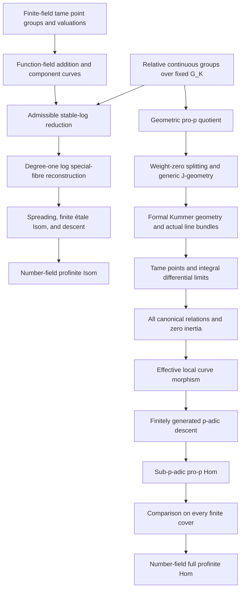

# Anabelian reconstruction of proper hyperbolic curves

This part plans `AnabelianGeometryAndNonabelianChabauty:NC.1`. Its endpoints concern smooth, proper, geometrically connected curves of genus at least two over number fields. They recover a curve isomorphism from an arithmetic fundamental-group isomorphism, and a dominant curve morphism from an open arithmetic fundamental-group homomorphism. The proof must recover actual scheme morphisms, including their action on every finite cover. An equivariant linear map on cohomology alone does not supply such a morphism.

There are three endpoint statements. For a number field K and proper hyperbolic K-curves X,Y, the first is

\[
 \operatorname{Isom}_K(X,Y)\simeq
 \operatorname{Isom}^{\mathrm{geom.out}}_{G_K}(\Pi_X,\Pi_Y).
\]

The second uses a chosen prime p and the **geometrically** pro-p arithmetic quotient:

\[
 \operatorname{Hom}^{\mathrm{dom}}_K(X,Y)\simeq
 \operatorname{Hom}^{\mathrm{open,geom.out}}_{G_K}
       (\Pi_X^{(p)},\Pi_Y^{(p)}).
\]

It holds over every sub-p-adic field, meaning a field embedded in a finitely generated extension of Q_p, and therefore over number fields. The third uses the full groups:

\[
 \operatorname{Hom}^{\mathrm{dom}}_K(X,Y)\simeq
 \operatorname{Hom}^{\mathrm{open,geom.out}}_{G_K}(\Pi_X,\Pi_Y).
\]

Here the arithmetic quotient G_K is fixed pointwise, the homomorphisms are continuous, and only conjugation by the target geometric kernel is removed. For these proper curves, dominant means nonconstant. Rational points are not assumed. These conventions are part of the statements, rather than choices a contributor can change while implementing them. The Isom endpoint is Mochizuki [M96, Theorems 10.1–10.2, pp. 625–626]; the geometric pro-p Hom endpoint is [M99, Corollary 15.5, author-copy pp. 78–79], and the full Hom endpoint is the proper one-dimensional specialization of [M99, Theorem 16.5 and its remark, author-copy pp. 85–87].

## The two reconstruction routes

The Isom route recovers a stable log special fibre and lifts it through a finite étale Isom scheme after spreading over the integers of K. Its finite-field component step uses tame affine reconstruction on normalization components with their branches removed. That step requires recovery of valuations, principal functions and addition. Reconstructing just a dual graph cannot finish it.

The Hom route works through a different effectivity argument. Relative Hodge–Tate theory and a two-step quotient transport the generic Picard-section test. Formal Kummer geometry then gives actual prime-to-p line bundles and tame points on all relevant pro-p covers. An integral comparison makes their differential coordinates converge. This proves preservation of the canonical relation ideal, eliminates generic-source inertia, and recovers the curve map from its function-field map. The number-field full-group conclusion repeats that reconstruction on **all** finite covers, including degrees divisible by primes other than p.

The diagram suppresses shared faithfulness and centre inputs. The local and finitely generated Galois-centre proofs precede their Hom reconstruction; the sub-p-adic centre proof follows the finitely generated case and uses an affine punctured-elliptic helper. This order avoids a circular use of sub-p-adic reconstruction. The geometric Isom construction remains the stable-log route; its final arithmetic-to-geometric conjugacy adjustment may reuse the separately established Galois-centre result.

## Carriers and conventions

For a geometrically connected curve, use the supplied arithmetic exact sequence

\[
 1\longrightarrow\Delta_X\longrightarrow\Pi_X
 \longrightarrow G_K\longrightarrow1.
\]

A geometric basepoint changes the sequence by its supplied path comparison; the final constructions are natural up to the prescribed geometric inner conjugation. The relative geometric pro-p group is Π_X modulo the image of the existing pro-p kernel of Δ_X. Taking the maximal pro-p quotient of the entire Π_X would remove arithmetic information and give the wrong endpoint. In the suggested prototypes a normal closure exposes the native quotient, followed by the equality with the characteristic-kernel image and the continuous geometric-kernel identification in the compact Hausdorff case.

In the Hom route, a generic-source symbol Π_(K(X)) means this same geometric pro-p construction on the generic-point arithmetic group, retaining the entire G_K. Its geometric group can have infinite rank. The arithmetic base never becomes a maximal pro-p Galois group merely because the geometric kernel does.

Stable curves, their normalization, dual graphs with loops, coherent cohomology, canonical sheaves, Picard objects, finite covers and polarized descent are supplied by their existing owners. A log stable curve includes the map to the stable-moduli boundary log structure. An ordinary nodal curve without that datum does not determine node thickness or log gluing. The admissible-cover supplier allows an étale component cover of degree divisible by p when the local marking and node indices are invertible; the existing invertible-total-group-order interface needs the stated extension. Source [M95, §§3.5–3.13, author-copy pp. 19–25] supplies this distinction. Only the arithmetic cofinal cover-system adapter is owned here.

The regular left-action stabilizer is trivial; a singleton action has full stabilizer. These calibrate the native tower intersection. Cofinal invariance in the prototype takes the explicit assertion that fixing the subsystem fixes every level. The geometric proof must obtain that assertion from the actual transition maps and cofinality; no topology-free assertion about an arbitrary subset of indices is made.

For finite-field reconstruction, Frobenius and the cardinality of the constants must be recovered together. An abstract copy of the procyclic Galois group alone has forgotten the cardinality. Normalization components are punctured at their branch points before tame affine reconstruction. Self-nodes retain both branches and their graph loop. The node chart xy=t^e retains the full integer e, even when p divides it; its comparison uses calibrated cyclotomic embeddings and the associated Kummer torsor. The degree-one condition is imposed before finite-field log effectivity, and established for isomorphisms arising from local generic groups.

For the Hom effectivity proof, H_X is the geometric Jacobian abelianization, not an arbitrary potentially geometric representation. The terms H_X^F,H_X^I,H_X^FI,H_X^M and the actual formal Kummer maps are retained. FI-geometry is a condition in cohomology with H_X^I coefficients witnessed by the image of the H_X^FI formal subgroup; it does not assert that every section already lifts to H_X^FI. An irreducibly splittable family must become a pointed constant curve after the indicated disk normalization, whose base has a section and geometrically irreducible fibres. A normal finite cover alone is insufficient.

A J-geometric section passes a Pic¹ test. Over a finite p-adic field its abelianized section comes from Pic¹(K). This conclusion does not manufacture a curve point. The nondegenerate sections used in the convergence argument also satisfy a nonzero cohomology-to-differential condition and have tame points on every associated Frattini cover. Those extra conditions are essential; the resulting point theorem is not a proof of the section conjecture.

All completions in the differential argument keep their integral lattices. The coefficient Ô_(Lbar) is the p-adic completion of the integral closure of O_L in an algebraic closure, not O_L itself. The Frattini iteration takes closed commutators and pth powers repeatedly; it is not the lower p-central series. At each fixed cover level n, the component-group correction and auxiliary constants extension are independent of the deeper sequence index m; they can depend on n. The separate generalized-Jacobian comparison has a bound independent of the finite puncture set. Neither assertion is replaced by a scalar rational Hodge–Tate isomorphism.

For a canonical relation, the multiplication is the actual map

\[
 \mu_N:H^0(Y,\omega_Y)^{\otimes N}
      \longrightarrow H^0(Y,\omega_Y^{\otimes N}),\qquad
 R_N(Y)=\ker\mu_N.
\]

The transported differential map must kill R_N after target multiplication for **every** N. Its injectivity is a separate statement. The kernel-factorization adapter factors through the image of μ_N and does not assert that μ_N is surjective. A hyperelliptic genus-two curve has no canonical embedding, so the proof passes to a cofinal nonhyperelliptic étale cover before using its canonical ideal, then descends.

## Existing libraries and supplier boundaries

The pinned baseline is Mathlib `082e2d37e8b0463410cdb532e111cd43d5a66174` and Tau Ceti `f790474821cf4256814db967cb154e7af3d0c369`. Continuous homomorphisms and multiplicative homeomorphisms, native quotient groups, stabilizers and linear kernels are reused. The pro-p kernel and maximal pro-p quotient are also reused. This part introduces relative adapters, rather than rebuilding those objects.

The current ProfiniteArithmetic roadmap already supplies continuous inner/outer automorphisms, characteristic-quotient topology, extension outer actions, and the closed lower-central graded Lie ring. It owns those interfaces. A rational two-step Malcev quotient is stronger than its graded Lie-ring contract; the independent NC.2 foundation request must be separated from reconstruction before assembly. Current AlgebraicCurves Layer 9 handles arbitrary residue fields, and Layer 12 supplies the scheme/function-field and canonical-sheaf dictionaries. Both are broader than the old atlas snapshot. StableReduction owns the effective geometry of stable models, and NC.1 owns recovery of that datum from groups.

The native suggested file elaborates the relative group objects, geometric pro-p quotient, tower stabilizer and kernel-of-supplied-multiplication adapter, with fifteen example signatures. It does not construct the geometric suppliers needed to realize them as étale groups or canonical section spaces. Its named omission ledger records every geometric declaration, API and test whose genuine signature is unavailable. In particular it does not encode missing objects as opaque types or mathematical conclusions as arbitrary proposition fields. All implementation statuses are unchecked.

## Target contracts

Each contract below gives its exact statement, hypotheses, source locators, proposed declaration or object API, direct prerequisites, proof route, and acceptance tests. A same-part prerequisite abbreviates only the node id prefix `AnabelianGeometryAndNonabelianChabauty:NC.1/`. References to another roadmap keep that roadmap’s stage or node id.

### Relative arithmetic interfaces

#### Relative outer open homomorphisms

Node `AnabelianGeometryAndNonabelianChabauty:NC.1/relative-outer-hom` (definition).

For surjections q_X:Π_X→Γ and q_Y:Π_Y→Γ of profinite groups, OverHom consists of continuous homomorphisms f with q_Y∘f=q_X. RelativeOuterHom is its quotient by f∼g iff g=Int(d)∘f for some d∈ker(q_Y); the open locus consists of classes with open image. Γ is fixed pointwise.

**Hypotheses.** q_X and q_Y continuous surjective Π_X, Π_Y and Γ profinite.

**Proof route.** Form the subtype of native continuous homomorphisms satisfying the commuting square. Use target geometric conjugation to define a setoid; openness is invariant under conjugation. Compose representatives; f maps the source geometric kernel into the target one, so composition descends.

**Sources.** [M99] §0, author-copy pp. 14–16; Theorem 14.1 and Corollary 15.5, pp. 71–79.

**Uses.** M99 Theorem 14.1 / Corollary 15.5: Correct target of dominant morphisms; avoid quotienting by arithmetic elements.. AnabelianGeometryAndNonabelianChabauty:NC.1/full-profinite-hom: Separate continuity, open image, base square and geometric conjugacy..

**Prerequisites.** `mathlib:ContinuousMonoidHom`, `mathlib:ContinuousMonoidHom.comp`, `InverseGaloisAndArithmeticFundamentalGroups:IG.1/arithmetic-exact-sequence`, `InverseGaloisAndArithmeticFundamentalGroups:IG.0/basepoint-and-components`.

**API.**

- `TauCeti.Anabelian.OverHom` (structure): Native continuous homomorphism with q_Y∘f=q_X.
- `TauCeti.Anabelian.RelativeOuterHom` (data): Geometric-conjugacy quotient of OverHom.
- `TauCeti.Anabelian.RelativeOuterHom.eq_iff` (characterisation): Two representatives give the same class exactly when a target kernel element conjugates one to the other.
- `TauCeti.Anabelian.RelativeOuterHom.comp` (compatibility): Composition over Γ descends and is associative.
- `TauCeti.Anabelian.RelativeOuterHom.open_iff` (characterisation): Openness of a class means openness of the range of any representative.

**Unit tests.**

- `TauCeti.Anabelian.relativeHom_self_test` (compatibility): The identity over q represents the identity class; composing with it leaves every class fixed.
- `TauCeti.Anabelian.relativeHom_kernel_conj_test` (characterisation): Int(d) and identity have the same class whenever q(d)=1.
- `TauCeti.Anabelian.relativeHom_base_change_test` (non-example): For q_X=q_Y=id_Γ, the only relative homomorphism is identity; any nonidentity automorphism of Γ is excluded.

**Acceptance.** A map over a nontrivial automorphism of Γ fails the commuting-square condition. A constant curve map has geometric image trivial and is excluded by openness.

#### Relative outer isomorphisms

Node `AnabelianGeometryAndNonabelianChabauty:NC.1/relative-outer-isom` (definition).

RelativeOuterIsom(q_X,q_Y) consists of continuous group equivalences e over the identity of Γ, modulo target ker(q_Y) conjugation. Its inversion and composition are compatible with RelativeOuterHom. An inverse must be continuous, not just an algebraic inverse.

**Hypotheses.** Same profinite extensions as relative-outer-hom.

**Proof route.** Restrict the previous relation to native ContinuousMulEquiv representatives. The commuting square transports to the inverse; geometric conjugation is transported across e.

**Sources.** [M96] §0, pp. 571–574; Theorems 10.1–10.2, pp. 625–626.

**Uses.** M96 Theorem 10.1: Arithmetic form of the number-field Isom bijection.. M96 Theorem 10.2: Comparison with geometric outer equivariance over fixed G_K..

**Prerequisites.** `relative-outer-hom`, `mathlib:ContinuousMulEquiv`, `InverseGaloisAndArithmeticFundamentalGroups:IG.1/arithmetic-exact-sequence`.

**API.**

- `TauCeti.Anabelian.OverIsom` (structure): Native continuous multiplicative equivalence commuting with q_X,q_Y.
- `TauCeti.Anabelian.RelativeOuterIsom` (data): Quotient of OverIsom by target geometric inner conjugations.
- `TauCeti.Anabelian.RelativeOuterIsom.eq_iff` (characterisation): Equality is witnessed by one target geometric conjugator on every element.
- `TauCeti.Anabelian.RelativeOuterIsom.symm` (equivalence): Inversion swaps X and Y and is well-defined on classes.
- `TauCeti.Anabelian.RelativeOuterIsom.toHom` (compatibility): The underlying relative Hom class has open image and respects composition.

**Unit tests.**

- `TauCeti.Anabelian.relativeIsom_id_test` (compatibility): The reflexive equivalence gives the identity and its inverse.
- `TauCeti.Anabelian.relativeIsom_conj_test` (characterisation): An inner equivalence by d∈ker q is the identity outer class.
- `TauCeti.Anabelian.relativeIsom_base_test` (non-example): Over q=id_Γ, there is exactly one relative isomorphism; Γ automorphisms are not silently admitted.

**Acceptance.** Recover both directions of the original continuous equivalence.

#### Geometrically pro-p arithmetic quotient

Node `AnabelianGeometryAndNonabelianChabauty:NC.1/relative-pro-p` (construction).

Put Δ=ker(q:Π→Γ) and N_p=image(proPKernel p Δ→Π). N_p is closed normal in Π because proPKernel is characteristic under continuous conjugations. Define Π^(p)=Π/N_p, obtaining 1→Δ(p)→Π^(p)→Γ→1. Only Δ is pro-p completed. The construction preserves relative homomorphisms and sends open-image maps to open-image maps.

**Hypotheses.** p prime; Π,Γ profinite; q continuous surjective.

**Proof route.** Apply the existing pro-p-kernel construction to the closed geometric subgroup Δ. Arithmetic conjugation restricts to a continuous automorphism of Δ; its pro-p kernel is invariant. Factor q and relative maps through the closed normal quotient; identify the kernel with Δ/proPKernel p Δ. Use quotient-map openness to transport open images.

**Sources.** [M99] §0, author-copy pp. 14–16; Corollary 15.5, pp. 77–79.

**Uses.** M99 §0 and Corollary 15.5: Define the actual input of pro-p Hom reconstruction.. M99 Theorem 16.5 remark: Pass from full profinite Hom to relative geometric pro-p Hom without changing G_K..

**Prerequisites.** `tauceti:TauCeti.proPKernel`, `tauceti:TauCeti.map_proPKernel_eq`, `tauceti:TauCeti.proPKernel_le_comap`, `tauceti:TauCeti.maximalProPQuotient`, `mathlib:QuotientGroup.lift`, `relative-outer-hom`, `InverseGaloisAndArithmeticFundamentalGroups:IG.1/arithmetic-exact-sequence`.

**API.**

- `TauCeti.Anabelian.relativeProPKernel` (data): Image in Π of the native geometric pro-p kernel; normal closure agrees with this image.
- `TauCeti.Anabelian.RelativeProP` (data): Π modulo relativeProPKernel.
- `TauCeti.Anabelian.RelativeProP.projection` (projection): A continuous surjection to Γ with geometric kernel canonically Δ(p).
- `TauCeti.Anabelian.RelativeProP.map` (functoriality): Every relative continuous homomorphism descends, naturally and compatibly with classes.
- `TauCeti.Anabelian.RelativeProP.open_map` (compatibility): An open-image relative map induces an open-image map on these quotients.

**Unit tests.**

- `TauCeti.Anabelian.relativeProP_identity_test` (degenerate): For q=id_Γ, Δ=1, so Π^(p)≃Γ even when Γ is not pro-p.
- `TauCeti.Anabelian.relativeProP_field_test` (compatibility): For Γ=1, Π^(p) is the native maximalProPQuotient p Π.
- `TauCeti.Anabelian.relativeProP_prime_to_p_test` (computation): For Π=C_ℓ×C_p→C_ℓ with ℓ≠p, Π^(p)≃Π; completing the whole Π would lose C_ℓ.

**Acceptance.** The full Γ survives even when Γ has finite quotients of order prime to p.

#### Decomposition subgroups from recovered towers

Node `AnabelianGeometryAndNonabelianChabauty:NC.1/tower-decomposition` (construction).

For a compatible component or point tower x=(x_i) in finite-cover geometric data with Π-actions, define D_x=⋂_i Stab_Π(x_i). Recover inertia as the subgroup acting trivially on the underlying component while retaining its action on the log branches. Changing the lift by a gives D_(a·x)=aD_xa⁻¹; do not replace D_x by a normal closure.

**Hypotheses.** Compatible cofiltered cover tower; recovered finite-level Π-actions; closed stabilizers.

**Proof route.** Intersect native point stabilizers. Compare membership with fixing every finite level; cofinal restriction leaves the intersection unchanged. For component inertia separately forget the component log structure; its kernel can still act nontrivially on that log structure.

**Sources.** [M96] Proposition 4.1, pp. 589–590; Proposition 5.2, pp. 594–595.

**Uses.** M96 Propositions 4.1 and 5.2: Recover component and node decomposition groups from their reconstructed towers.. T97 Proposition 2.8: Distinguish lifted points by actual decomposition subgroups, not just their abelianizations..

**Prerequisites.** `mathlib:MulAction.stabilizer`, `InverseGaloisAndArithmeticFundamentalGroups:IG.1/decomposition-inertia`, `log-admissible-system`.

**API.**

- `TauCeti.Anabelian.towerDecomposition` (data): Intersection of native point stabilizers at every finite level.
- `TauCeti.Anabelian.towerDecomposition.mem_iff` (characterisation): An element belongs exactly when it fixes every x_i.
- `TauCeti.Anabelian.towerDecomposition.conjugate` (compatibility): Transporting the tower by a conjugates the subgroup by a.
- `TauCeti.Anabelian.towerDecomposition.cofinal` (compatibility): A cofinal compatible subsystem computes the same subgroup.
- `TauCeti.Anabelian.towerDecomposition.isClosed` (other): Closed finite-level stabilizers give a closed tower subgroup.

**Unit tests.**

- `TauCeti.Anabelian.towerDecomposition_singleton_test` (compatibility): A one-level tower has exactly the native point stabilizer.
- `TauCeti.Anabelian.towerDecomposition_regular_test` (computation): For one level with the regular left action of Π on itself, the stabilizer of 1 is the trivial subgroup.
- `TauCeti.Anabelian.towerDecomposition_trivial_test` (degenerate): For the action on a singleton, the tower stabilizer is the whole group.

**Acceptance.** For a nonnormal point stabilizer, conjugation changes the subgroup while preserving its conjugacy class.

### Finite-field points, functions and addition

#### Recover finite-field tame point decomposition groups

Node `AnabelianGeometryAndNonabelianChabauty:NC.1/finite-field-decomposition` (theorem).

For a smooth geometrically connected affine hyperbolic curve U over a finite field k, its arithmetic tame group recovers its geometric kernel, arithmetic Frobenius, #k, compactification genus and number of geometric punctures, and the conjugacy classes of decomposition groups of all points of its smooth compactification, distinguishing punctures from interior points. The recovery is compatible with every open subgroup and finite constant extension.

**Hypotheses.** k finite; U affine and hyperbolic; full geometric tame quotient with full G_k retained.

**Declaration.** `TauCeti.Anabelian.finiteFieldTameDecomposition`.

**Proof route.** Use tame abelianization modulo torsion to identify the geometric kernel; Frobenius weights on prime-to-p abelianization recover #k and the type. Use Hurwitz to characterize covers extending étale over the compactification and Lefschetz traces to decide whether each cover has points over a finite constant extension. A section is geometric precisely when every associated finite cover has such a point; Kummer differences across all covers identify sections attached to one lifted point. Generate its decomposition group from these sections and distinguish a cusp by the multiplicity of splittings; invoke separated decomposition groups to obtain uniqueness.

**Sources.** [T97] Propositions 2.8–2.10, pp. 151–155; Propositions 3.3–3.8, pp. 156–162.

**Prerequisites.** `InverseGaloisAndArithmeticFundamentalGroups:IG.0/etale-fundamental-group`, `InverseGaloisAndArithmeticFundamentalGroups:IG.1/arithmetic-exact-sequence`, `InverseGaloisAndArithmeticFundamentalGroups:IG.1/tame-and-prime-to-p`, `InverseGaloisAndArithmeticFundamentalGroups:IG.1/decomposition-inertia`, `tauceti:TauCetiRoadmap/ProfiniteCohomology#layer-9-the-galois-interface-hilbert-90-and-kummer-theory`, `tauceti:TauCetiRoadmap/JacobianChallenge#layer-f-abeljacobi-and-the-universal-property`, `tauceti:TauCetiRoadmap/AlgebraicCurves#layer-7-the-different-and-the-hurwitz-genus-formula`, `WeightsInEtaleCohomology:R34.2`, `tower-decomposition`.

**Acceptance.** The Frobenius generator is recovered, although G_k≃Ẑ alone does not recover #k. The compactification may be proper, but the input U is punctured; no claim reconstructs arbitrary proper finite-field curves here.

#### Recover addition from valuations and unit congruences

Node `AnabelianGeometryAndNonabelianChabauty:NC.1/linear-system-addition` (theorem).

Let C_1,C_2 be smooth proper connected curves over algebraically closed fields, with function fields F_i. A multiplicative monoid isomorphism Φ:F_1→F_2 and a bijection of their points that preserve each normalized valuation, identify chosen finite sets S_i of at least three points, and preserve 1+m_P at every P∈S_1 determine an additive Φ, hence a field isomorphism.

**Hypotheses.** Valuations preserve their integral normalization; Φ(0)=0; |S_1|≥3; preservation of 1+m, not only O×.

**Declaration.** `TauCeti.Anabelian.additionOfValuationsAndPrincipalUnits`.

**Proof route.** Riemann–Roch produces minimal functions with two-dimensional pole spaces and prescribed values 0,1,∞ at three marked points. Preserving valuations identifies minimal pole spaces; local unit congruences recover the coefficients of ax+b and force addition on constants and the rational subfields generated by these minimal functions. Generic degree-g divisors and Abel-map birationality show these rational subfields multiplicatively generate F. Compatible evaluations on a dense set glue their ring maps, so addition holds on all of F.

**Sources.** [T97] Lemma 4.7, Definition 4.8 and Lemmas 4.9–4.16, pp. 167–175.

**Prerequisites.** `tauceti:TauCetiRoadmap/AlgebraicCurves#layer-4-repartitions-weil-differentials-and-riemannroch`, `tauceti:TauCetiRoadmap/JacobianChallenge#layer-d-the-relative-picard-functor-and-the-jacobian-scheme`, `tauceti:TauCetiRoadmap/AlgebraicCurves#layer-12-the-dictionary--function-fields--curves-and-the-comparison-contracts`.

**Acceptance.** On P¹, use marked 0,1,∞ and a coordinate to recover x↦ax+b. A valuation-preserving multiplicative map without the three unit-congruence conditions is not accepted as a field map.

#### Tame affine reconstruction over finite fields

Node `AnabelianGeometryAndNonabelianChabauty:NC.1/finite-field-tame-isom` (theorem).

An isomorphism of the arithmetic tame fundamental groups of smooth geometrically connected affine hyperbolic curves over finite fields lifts uniquely to an isomorphism of their pointed universal tame covers, and hence gives a unique underlying scheme isomorphism modulo geometric deck transformations. Field automorphisms of the finite constants may occur; k-linearity and cyclotomic degree are extra conditions used in log gluing.

**Hypotheses.** Affine hyperbolic curves over finite fields; continuous tame group isomorphism; full arithmetic quotient.

**Declaration.** `TauCeti.Anabelian.finiteFieldTameIsom`.

**Proof route.** Recover points, decomposition groups and Frobenius at every finite cover. Local and global function-field reciprocity identify the kernel of the restricted-product-to-abelian-group map with multiplicative global functions; transfer gives compatibility across covers. After passing to a cover with at least three geometric punctures, recover valuations and principal-unit congruences and apply linear-system addition. Intersect local rings to recover the affine scheme and its cover tower; Frobenius lifts topologically generate the arithmetic group, which verifies recovery of the given isomorphism.

**Sources.** [T97] Theorem 4.3, Lemmas 4.4–4.5 and Claim 4.6, pp. 164–168; completion of Lemma 4.16, p. 175.

**Prerequisites.** `finite-field-decomposition`, `linear-system-addition`, `FunctionFieldArithmetic:FA.4/profinite-reciprocity`, `FunctionFieldArithmetic:FA.4/local-abelian-existence`, `InverseGaloisAndArithmeticFundamentalGroups:IG.0/etale-fundamental-group`, `tauceti:TauCetiRoadmap/AlgebraicCurves#layer-12-the-dictionary--function-fields--curves-and-the-comparison-contracts`.

**Acceptance.** The function-field map is additive and compatible with the given group map on every finite tame cover.

### Stable-log reconstruction and the Isom endpoint

#### Admissible stable log-cover system

Node `AnabelianGeometryAndNonabelianChabauty:NC.1/log-admissible-system` (definition).

A stable log curve is a stable pointed curve with the log structure pulled back from the boundary log structure on its stable-curve moduli family, over a standard log point. A finite generically étale cover is pre-admissible if its stable extension is multi-admissible; it is potentially pre-admissible if this holds after a finite tame base extension. The admissible arithmetic group is Π modulo the intersection of the co-admissible open subgroups. Its base quotient is the tame log-point Galois group Γ^t. Multi-admissible means a disjoint union of admissible connected covers. The imported admissibility predicate requires a finite map of fibrewise generic degree d, preservation of the smooth/node loci, marked-divisor bounds μ_C≤π*μ_D≤dμ_C, étaleness off nodes and markings, tame marking ramification, and strict-henselian node charts xy=a, uv=a^e, u=x^e, v=y^e with 1≤e≤d invertible on the base. Equivalently it has the source’s log-étale lift and characteristic-generator multiplicity bound. Total cover degree need not be invertible.

**Hypotheses.** Residue characteristic p>0; stable log curve of hyperbolic type; pointed branches included.

**Proof route.** Use genuine étale sheaves of monoids and charts from CR.5 and stable models from StableReduction. Import generic admissible covers from IG.5, using the requested extension for étale p-degree components; NC.1 owns their cofinal arithmetic reconstruction system. Form the cofiltered family of potentially pre-admissible pointed covers, with cofinal orderly Galois covers. Take the quotient characterized by this family; record geometric kernel and tame base quotient, rather than substituting ordinary étale π₁.

**Sources.** [M96] Definitions 2.4 and 2.7, Lemmas 2.5–2.6, Proposition 2.8, pp. 580–585; [M95] Definitions §§3.3–3.6 and 3.9; Proposition 3.11; Lemmas 3.12–3.13, author-copy pp. 18–25.

**Uses.** M96 §§3–7: Recover special components, nodes and log gluings from the cover family.. M96 Proposition 8.4: Identify precisely this quotient from the local generic arithmetic group..

**Prerequisites.** `CrystallineCohomology:CR.5:log-algebra/log-structure`, `CrystallineCohomology:CR.5:log-algebra/log-chart`, `CrystallineCohomology:CR.5:log-algebra/kummer-morphism`, `tauceti:TauCetiRoadmap/StableReduction#layer-8-canonical-contraction-and-unpointed-stable-reduction`, `tauceti:TauCetiRoadmap/StableReduction#layer-9-marked-stabilization-and-stable-pointed-reduction`, `InverseGaloisAndArithmeticFundamentalGroups:IG.0/etale-fundamental-group`, `InverseGaloisAndArithmeticFundamentalGroups:IG.1/tame-and-prime-to-p`, `InverseGaloisAndArithmeticFundamentalGroups:IG.5/admissible-g-covers`, `InverseGaloisAndArithmeticFundamentalGroups:IG.5`, `StableReductionPartII:MC.0/universal-curve`, `StableReductionPartII:MC.1/normal-crossing-boundary`.

**API.**

- `TauCeti.Anabelian.AdmissibleLogCoverSystem` (structure): Pointed stable log curve and its cofiltered potentially pre-admissible covers.
- `TauCeti.Anabelian.AdmissibleLogCoverSystem.admissibleGroup` (projection): Quotient by the intersection of co-admissible subgroups with its map to Γ^t.
- `TauCeti.Anabelian.AdmissibleLogCoverSystem.orderly_cofinal` (characterisation): Orderly Galois covers form a cofinal subfamily.
- `TauCeti.Anabelian.AdmissibleLogCoverSystem.tame_baseChange` (compatibility): Further tame base extensions induce the prescribed compatible system.

**Unit tests.**

- `TauCeti.Anabelian.admissible_identity_test` (degenerate): The identity stable log cover is pre-admissible and represents the top subgroup.
- `TauCeti.Anabelian.admissible_orderly_test` (compatibility): Computing the intersection using all co-admissible covers or orderly Galois covers gives the same quotient.
- `TauCeti.Anabelian.admissible_wild_base_test` (non-example): A cover requiring a genuinely wild base extension is not declared potentially pre-admissible merely because its generic cover is étale.

**Acceptance.** Distinguish admissible log π₁, special ordinary étale π₁ and the intermediate quotient used in §3. The identity cover of a nodal curve has d=e=1; an erroneous strict bound e<d would exclude it. Étale p-degree covers are allowed despite a total degree divisible by p.

#### Cofinal sturdy orderly covers

Node `AnabelianGeometryAndNonabelianChabauty:NC.1/sturdy-cover` (theorem).

A stable log hyperbolic curve admits a cofinal system of orderly covers whose normalization components all have genus at least two. Further finite tame extensions and covers can separate the branch combinatorics and make the required nodes rational. These changes are tracked with descent data; they are not hypotheses silently imposed on the original curve.

**Hypotheses.** M96 admissible system; residue characteristic p>0.

**Declaration.** `TauCeti.Anabelian.sturdyOrderlyCoversCofinal`.

**Proof route.** Use stable-cover extension and the cofinal orderly criterion. Construct prime-to-p covers with genus growth on every component, then untangle the finitely many branch incidences. Take common refinements of the finitely many choices and retain deck actions for descent.

**Sources.** [M96] Definition 1.1, pp. 574–575; Lemma 2.9, pp. 585–587; Lemma 4.2, pp. 590–592.

**Prerequisites.** `log-admissible-system`, `tauceti:TauCetiRoadmap/StableReduction#layer-1-nodes-normalization-and-dual-graphs`, `tauceti:TauCetiRoadmap/StableReduction#layer-9-marked-stabilization-and-stable-pointed-reduction`, `tauceti:TauCetiRoadmap/AlgebraicCurves#layer-7-the-different-and-the-hurwitz-genus-formula`, `InverseGaloisAndArithmeticFundamentalGroups:IG.0/etale-fundamental-group`.

**Acceptance.** Every open co-admissible subgroup contains a sturdy orderly subgroup; characteristic two requires the source’s separate combinatorial argument.

#### Recover components and their Jacobian torsion

Node `AnabelianGeometryAndNonabelianChabauty:NC.1/component-recovery` (theorem).

The admissible group and its Frobenius recover the normalization-component tower of a stable log curve and the prime-to-p Jacobian torsion attached to each component, with component decomposition and inertia groups. The reconstruction is independent of the auxiliary prime ℓ≠p.

**Hypotheses.** After cofinal sturdy/orderly reduction; finite residue field.

**Declaration.** `TauCeti.Anabelian.admissibleComponentsAndTorsion`.

**Proof route.** In each finite cover, distinguish graph cohomology (some Frobenius power fixes it) from normalization cohomology (weight one). Prime-degree cyclic covers maximize component counts or minimize graph-cycle defects; the resulting equivalence relation identifies covers supported on one component. Compare choices of ℓ through fibre-product covers, recover Jacobian torsion, and identify component groups as tower stabilizers.

**Sources.** [M96] Propositions 1.2–1.4 and Corollaries 1.5–1.6, pp. 576–579; Proposition 4.1, pp. 589–590.

**Prerequisites.** `sturdy-cover`, `tower-decomposition`, `WeightsInEtaleCohomology:R34.2`, `AbelianSchemesAndArithmeticModuli:A4/etale-tate-module`, `tauceti:TauCetiRoadmap/StableReduction#layer-1-nodes-normalization-and-dual-graphs`, `tauceti:TauCetiRoadmap/ProfiniteCohomology#layer-10-continuous-cohomology-in-all-degrees`.

**Acceptance.** Weights recover the graph/normalization distinction; merely identifying total H¹ does not recover components.

#### Recover ordinary special-fibre étale quotient

Node `AnabelianGeometryAndNonabelianChabauty:NC.1/ordinary-special-quotient` (theorem).

The admissible arithmetic group intrinsically determines its ordinary special-fibre étale quotient, compatibly with component data and finite covers. The intermediate quotient defined using liftable prime torsors is distinguished from both the admissible and ordinary étale groups.

**Hypotheses.** Stable log curve over a finite field; primes ℓ≠p; orderly cover comparisons.

**Declaration.** `TauCeti.Anabelian.ordinarySpecialQuotientRecovered`.

**Proof route.** A cyclic prime torsor lifts through Z_ℓ precisely when it kills the appropriate node inertia. Use Frobenius weight q^m to separate residual tame base ramification from ordinary étale torsors. Intersect the kernels across all covers to obtain the characteristic ordinary-special quotient.

**Sources.** [M96] Propositions 3.1–3.2, pp. 587–589.

**Prerequisites.** `log-admissible-system`, `InverseGaloisAndArithmeticFundamentalGroups:IG.0/etale-fundamental-group`, `InverseGaloisAndArithmeticFundamentalGroups:IG.1/tame-and-prime-to-p`, `tauceti:TauCetiRoadmap/ProfiniteCohomology#layer-10-continuous-cohomology-in-all-degrees`, `WeightsInEtaleCohomology:R34.2`.

**Acceptance.** Compare with ordinary π₁ only after the intrinsic quotient construction; do not identify it with Π′.

#### Recover nodes and marked branches

Node `AnabelianGeometryAndNonabelianChabauty:NC.1/node-branch-recovery` (theorem).

The admissible group recovers the node tower, its incidence with normalization components, and the paired branch inertia groups. For each component its normalization-minus-branches tame fundamental group is identified as a subgroup with the prescribed branch labels.

**Hypotheses.** Sturdy untangled cover; general curves recovered by cofinal descent; ℓ,n≠p distinct with ℓ≡1 mod n for the eigenspace construction.

**Declaration.** `TauCeti.Anabelian.admissibleNodesAndBranches`.

**Proof route.** Compare admissible and ordinary étale prime-torsor quotients; the ramification quotient represents graph cycles. The branch-restriction map identifies the entire ramification quotient L_r with the incidence kernel K_Y, using the author’s December 2012 correction. Use a cyclic degree-n cover nontrivial on every component and split this quotient into character eigenspaces. Node lines are the compatible basis elements selected by maximal node counts; fibre products compare auxiliary covers, and genus growth identifies component incidence. Untangled covers make normalization-component tame-group inclusions injective; descend the paired branches.

**Sources.** [M96] Lemma 4.2, pp. 590–592; Propositions 5.1–5.2 and Corollaries 5.3–5.4, pp. 594–596; [M96C] Correction (1), p. 1.

**Prerequisites.** `component-recovery`, `sturdy-cover`, `InverseGaloisAndArithmeticFundamentalGroups:IG.1/tame-and-prime-to-p`, `tauceti:TauCetiRoadmap/StableReduction#layer-1-nodes-normalization-and-dual-graphs`, `tauceti:TauCetiRoadmap/ProfiniteCohomology#layer-10-continuous-cohomology-in-all-degrees`.

**Acceptance.** A self-node has two branches on one component and contributes one graph loop; it is not discarded.

#### Cyclotomic calibration and reconstruction degree

Node `AnabelianGeometryAndNonabelianChabauty:NC.1/cyclotomic-degree` (definition).

For an admissible group isomorphism between singular stable log curves over a finite field, compare its maps on the marked normalization-component cyclotomic inertia copies with their fixed cyclotomic identifications. The common scalar is the reconstruction-theoretic degree d_RT∈p^Z⊂Q_{>0}. Node comparison forces the component scalars to agree. Degree-one is a restriction on these calibrated identifications, not mere preservation of abstract inertia subgroups.

**Hypotheses.** At least one special curve nonsmooth; admissible group isomorphism over the same tame base; calibrations fixed.

**Proof route.** Recover the normalization-component tame groups and their branch inertias. Apply tame affine reconstruction to identify each scalar as a power of p. Use adjacency at nodes and connectedness to obtain one positive rational scalar.

**Sources.** [M96] §6, pp. 596–600; Lemma 7.1 and Theorem 7.2, pp. 602–605.

**Uses.** M96 Theorem 7.2: State the exact finite-field log Isom target.. M96 Lemma 9.1: Force the degree to one for maps coming from a p-adic generic fibre..

**Prerequisites.** `tower-decomposition`, `finite-field-tame-isom`, `CrystallineCohomology:CR.5:log-algebra/log-chart`.

**API.**

- `TauCeti.Anabelian.ReconstructionDegree` (data): Common calibrated scalar in p^Z for singular admissible isomorphisms.
- `TauCeti.Anabelian.ReconstructionDegree.component_eq` (characterisation): Every component gives the same scalar.
- `TauCeti.Anabelian.ReconstructionDegree.comp` (compatibility): Degrees multiply under composition and invert under inversion.
- `TauCeti.Anabelian.ReconstructionDegree.one_iff` (characterisation): Degree one means identity on all calibrated cyclotomic inertia copies.

**Unit tests.**

- `TauCeti.Anabelian.reconstructionDegree_identity_test` (computation): The identity isomorphism has degree 1.
- `TauCeti.Anabelian.reconstructionDegree_frobenius_test` (non-example): A relative Frobenius comparison has cyclotomic degree p and is excluded from degree-one reconstruction.
- `TauCeti.Anabelian.reconstructionDegree_composition_test` (compatibility): Composing degrees p^a and p^b gives p^(a+b), with inverse p^(-a).

**Acceptance.** Independent inversion or prime-adic rescaling of one branch is rejected by the cyclotomic diagrams.

#### Recover node thickness and log gluing

Node `AnabelianGeometryAndNonabelianChabauty:NC.1/thickness-log-gluing` (theorem).

At a stable node with chart xy=t^e, the calibrated two branch inertia embeddings determine the full integer e≥1 and the Kummer gluing torsor identifying the branch log structures. Hence component log isomorphisms with matching calibrated branch data glue uniquely to a stable log isomorphism.

**Hypotheses.** Fixed cyclotomic identifications; e may be divisible by p; paired branches and base log parameter retained.

**Declaration.** `TauCeti.Anabelian.nodeThicknessAndLogGluing`.

**Proof route.** Express the characteristic monoid by x+y=e·t and the two inertia restriction maps using that integer. Recover e from the compatible cyclotomic embeddings, not from an abstract prime-to-p group alone. Recover the Kummer class of the gluing line/torsor from the two restrictions and assemble the log structures along the normalization conductor.

**Sources.** [M96] §6, Proposition 6.1, Corollaries 6.2–6.3 and Theorem 6.4, pp. 596–600.

**Prerequisites.** `node-branch-recovery`, `CrystallineCohomology:CR.5:log-algebra/log-chart`, `CrystallineCohomology:CR.5:log-algebra/kummer-morphism`, `tauceti:TauCetiRoadmap/StableReduction#layer-1-nodes-normalization-and-dual-graphs`, `tauceti:TauCetiRoadmap/ProfiniteCohomology#layer-9-the-galois-interface-hilbert-90-and-kummer-theory`.

**Acceptance.** Charts with e=1 and e=p have distinct calibrated thickness data; a reduction modulo p loses required information.

#### Degree-one stable log reconstruction

Node `AnabelianGeometryAndNonabelianChabauty:NC.1/finite-field-log-isom` (theorem).

For stable log hyperbolic curves over a finite field, with at least one nonsmooth, the map from log isomorphisms over the fixed log point to geometric outer admissible arithmetic group isomorphisms of reconstruction degree one is bijective.

**Hypotheses.** Fixed tame base Γ^t; degree-one cyclotomic calibration; source and target as in M96 Theorem 7.2.

**Declaration.** `TauCeti.Anabelian.stableLogIsomDegreeOne`.

**Proof route.** On sturdy untangled covers, component decomposition groups give tame normalization-minus-branches groups. Tame affine reconstruction supplies component scheme isomorphisms; degree one aligns their finite-field and branch identifications. Recover node thickness and gluing torsors, then glue log curves. Repeat on every orderly cover to recover the given admissible group map, and descend the cofinal auxiliary choices.

**Sources.** [M96] Lemma 7.1 and Theorems 7.2 and 7.4, pp. 602–607.

**Prerequisites.** `cyclotomic-degree`, `thickness-log-gluing`, `finite-field-tame-isom`, `sturdy-cover`, `relative-outer-isom`, `InverseGaloisAndArithmeticFundamentalGroups:IG.0/etale-fundamental-group`.

**Acceptance.** Remove sturdy/untangled assumptions by descent. The degree-one hypothesis is necessary before local generic-fibre normalization is proved.

#### Recover admissible reduction from the generic group

Node `AnabelianGeometryAndNonabelianChabauty:NC.1/local-admissible-recovery` (theorem).

For K/Q_p finite and a proper hyperbolic curve with stable reduction, the arithmetic generic group over G_K recovers its admissible log reduction quotient. Generic finite étale covers extend to the stable model, and potential admissibility is characterized by the semistability criterion and unramified p-tower tests.

**Hypotheses.** K p-adic local; stable model after finite extension; every test respects the arithmetic projection.

**Declaration.** `TauCeti.Anabelian.genericGroupRecoversAdmissibleReduction`.

**Proof route.** A G_(K^ur)-equivariant map from Jacobian p-Tate data to Z_p factors through its ordinary étale part. A degree-p geometrically connected abelian generic cover extends étale exactly when its K^ur restriction lifts through a Z_p tower. Resolve indeterminacy to extend generic covers to proper surjective stable-model maps; use sturdy covers to exclude exceptional rational components. Combine all cyclic order-p subextension tests with semistability and purity to characterize the co-admissible family.

**Sources.** [M96] Lemmas 8.1–8.3 and Proposition 8.4, pp. 610–613.

**Prerequisites.** `log-admissible-system`, `sturdy-cover`, `tauceti:TauCetiRoadmap/StableReduction#layer-4-blowups-and-intersection-theory-on-arithmetic-surfaces`, `tauceti:TauCetiRoadmap/StableReduction#layer-8-canonical-contraction-and-unpointed-stable-reduction`, `NeronModelsAndSemistableAbelianVarieties:R11.3/raynaud-extension-comparison`, `FiniteFlatGroupsAndIntegralPadicHodgeTheory:R07.1/tate-generic-fibre-theorem`, `tauceti:TauCetiRoadmap/ProfiniteCohomology#layer-10-continuous-cohomology-in-all-degrees`, `InverseGaloisAndArithmeticFundamentalGroups:IG.0/etale-fundamental-group`.

**Acceptance.** A single H¹ comparison cannot replace the tests on all cyclic p-subextensions.

#### Local generic isomorphisms have degree one

Node `AnabelianGeometryAndNonabelianChabauty:NC.1/degree-normalization` (theorem).

A G_K-compatible isomorphism of arithmetic fundamental groups of proper hyperbolic curves over K/Q_p finite has p-adic and every ℓ-adic fundamental-class scalar equal to 1; on singular admissible reduction its reconstruction degree is also 1.

**Hypotheses.** Stable models; p and ℓ≠p pairings normalized by trace; compare a cofinal cover with a graph loop.

**Declaration.** `TauCeti.Anabelian.localArithmeticIsomDegreeOne`.

**Proof route.** Raynaud uniformization compares the toric monodromy pairing and period lattice over the rational numbers, independent of ℓ. The p-adic and ℓ-adic cup products identify their degree scalars with the same rational pairing ratio and force them to ±1. Graph duality identifies the ℓ scalar with the positive reconstruction degree in p^Z; positivity removes −1.

**Sources.** [M96] Lemma 9.1, pp. 613–617.

**Prerequisites.** `local-admissible-recovery`, `cyclotomic-degree`, `NeronModelsAndSemistableAbelianVarieties:R11.3/rigid-uniformisation`, `NeronModelsAndSemistableAbelianVarieties:R11.4/integral-monodromy-pairing`, `tauceti:TauCetiRoadmap/ProfiniteCohomology#layer-12-the-graded-cup-product-in-all-degrees`, `tauceti:TauCetiRoadmap/StableReduction#layer-1-nodes-normalization-and-dual-graphs`.

**Acceptance.** Degree one is derived from the generic arithmetic input; it is not a freely chosen normalization.

#### Reconstruct the local stable log special fibre

Node `AnabelianGeometryAndNonabelianChabauty:NC.1/local-special-isom` (theorem).

An arithmetic group isomorphism over G_K for proper hyperbolic K-curves induces a unique stable log special-fibre isomorphism, compatible with the original map on each prime-to-p cohomology realization and all admissible covers. This is a special-fibre result.

**Hypotheses.** K/Q_p finite; chosen common finite stable-reduction extension.

**Declaration.** `TauCeti.Anabelian.stableLogSpecialFibreIsom`.

**Proof route.** In the singular case combine admissible recovery, degree normalization and stable log reconstruction. In the smooth case produce a geometrically connected degree-p abelian étale cover with singular stable reduction: otherwise the étale/inseparable genus comparison contradicts Hurwitz. Reconstruct that cover, recognize the distinguished component via prime-to-p covers and descend its log isomorphism.

**Sources.** [M96] Theorem 9.2, pp. 617–619.

**Prerequisites.** `degree-normalization`, `finite-field-log-isom`, `local-admissible-recovery`, `tauceti:TauCetiRoadmap/AlgebraicCurves#layer-7-the-different-and-the-hurwitz-genus-formula`, `tauceti:TauCetiRoadmap/StableReduction#layer-8-canonical-contraction-and-unpointed-stable-reduction`, `InverseGaloisAndArithmeticFundamentalGroups:IG.0/etale-fundamental-group`.

**Acceptance.** Do not promote Theorem 9.2 into an unconditional isomorphism of entire p-adic generic curves.

#### Faithfulness of hyperbolic maps on Tate data

Node `AnabelianGeometryAndNonabelianChabauty:NC.1/curve-map-rigidity` (theorem).

For smooth proper geometrically connected genus-at-least-two curves in characteristic zero, dominant maps agreeing on the geometric fundamental-group map induce the same curve map. In the fixed isomorphism or dominant-morphism locus, the Jacobian Tate action supplies the rigidity used for descent; any remaining translation ambiguity is eliminated on the curve by the hyperbolic Jacobian embedding and its compatibility with all covers.

**Hypotheses.** Dominant maps; proper hyperbolic curves; compare after a finite extension giving a rational point; never infer a map from Tate data alone.

**Declaration.** `TauCeti.Anabelian.hyperbolicMapFundamentalGroupFaithful`.

**Proof route.** Pass to a pointed finite extension and use Abel–Jacobi and injectivity of Hom of abelian varieties into Tate-module Hom. A difference not detected by the linear part is a translation; use the preserved embedded curve and cover compatibility to eliminate it in the given morphism comparison. Descend the equality by faithful base change.

**Sources.** [M99] Theorem 14.1, author-copy pp. 71–73; §15 proof, pp. 74–77; [M96] §10, pp. 624–626.

**Prerequisites.** `tauceti:TauCetiRoadmap/JacobianChallenge#layer-f-abeljacobi-and-the-universal-property`, `AbelianSchemesAndArithmeticModuli:A6/hom-to-tate-module-homs-is-injective`, `InverseGaloisAndArithmeticFundamentalGroups:IG.0/etale-fundamental-group`, `InverseGaloisAndArithmeticFundamentalGroups:IG.1/arithmetic-exact-sequence`.

**Acceptance.** Only equality of already existing maps is concluded; arbitrary Tate-module morphisms need not be effective.

#### Number-field profinite Isom theorem

Node `AnabelianGeometryAndNonabelianChabauty:NC.1/number-field-isom` (theorem).

For a number field K and smooth geometrically connected proper K-curves X,Y of genus at least two, Isom_K(X,Y)→RelativeOuterIsom(Π_X→G_K,Π_Y→G_K) is bijective. No rational point on either curve is assumed.

**Hypotheses.** Full profinite groups; continuous equivalences over the identity of G_K; quotient by target geometric inner conjugation.

**Declaration.** `TauCeti.Anabelian.numberFieldProfiniteIsom`.

**Proof route.** Spread the curves and their finite unramified Isom scheme over a localization of O_K, then shrink it to finite étale; fix ℓ invertible there. At closed primes, local special-fibre reconstruction supplies the unique log isomorphism with the prescribed ℓ-adic action. Lift through the finite étale Isom scheme after a finite extension of K; faithfulness and equivariance supply the Galois cocycle and descend the resulting curve isomorphism. Perform the comparison on every finite étale cover to recover the entire original group isomorphism, then use centre-freeness of G_K to make the conjugator geometric.

**Sources.** [M96] Theorems 10.1–10.2 and §10 proof, pp. 624–626.

**Prerequisites.** `relative-outer-isom`, `local-special-isom`, `curve-map-rigidity`, `galois-centre-free`, `AlgebraicModuliForArithmeticGeometry:R09.1`, `InverseGaloisAndArithmeticFundamentalGroups:IG.0/etale-fundamental-group`, `InverseGaloisAndArithmeticFundamentalGroups:IG.1/arithmetic-exact-sequence`, `tauceti:TauCetiRoadmap/StableReduction#layer-8-canonical-contraction-and-unpointed-stable-reduction`.

**Acceptance.** For the genus-two curve y²=x⁵−1 over Q, identity and the hyperelliptic involution produce distinct classes. The proof descends without assuming X(K) nonempty.

#### Arithmetic and geometric formulations of Isom

Node `AnabelianGeometryAndNonabelianChabauty:NC.1/geometric-outer-comparison` (comparison).

For these number-field curves, restriction identifies relative outer arithmetic isomorphisms over G_K with geometric group isomorphisms Δ_X≃Δ_Y modulo target Δ_Y inner automorphisms whose outer classes intertwine the two G_K outer actions. The fixed G_K is not allowed to vary.

**Hypotheses.** Proper hyperbolic curves; centre-free geometric kernels; fixed arithmetic extensions.

**Declaration.** `TauCeti.Anabelian.arithmeticGeometricIsomComparison`.

**Proof route.** Centre-freeness of the geometric kernels identifies each arithmetic extension with the pullback of its outer-action extension. An intertwining geometric equivalence therefore extends over the identity of G_K, uniquely up to geometric inner equivalence. Restrict back and check the two identifications, using the existing generic continuous outer-action interfaces.

**Sources.** [M96] Theorem 7.4, p. 607; Theorem 10.2, p. 626.

**Prerequisites.** `number-field-isom`, `InverseGaloisAndArithmeticFundamentalGroups:IG.1/arithmetic-exact-sequence`, `tauceti:TauCetiRoadmap/ProfiniteProPGroups#layer-4-free-pro-p-and-pro-c-groups-on-finite-sets`, `geometric-centre-free`.

**Acceptance.** The conclusion is exactly outer equivariance; it does not assert an equality of chosen lifts G_K→Aut(Δ).

### Geometric sections and arithmetic line bundles

#### Weight-zero two-step quotient

Node `AnabelianGeometryAndNonabelianChabauty:NC.1/weight-zero-quotient` (construction).

For a proper hyperbolic curve over a p-adic field or its smooth relative family, let M be the two-step Q_p Malcev Lie algebra of its geometric pro-p group, H=M^ab and H_0 its weight-zero Hodge–Tate quotient. Push the commutator part to Λ²H_0, obtaining U_X. Its inverse image B_X of the weight-one part of H has a unique equivariant projection onto Λ²H_0. Quotient U_X by that projection’s kernel to obtain 0→Λ²H_0→Z_X→H_0→0. This is the specific NC.1 quotient, not a new general unipotent fundamental group.

**Hypotheses.** p-adic relative Hodge–Tate comparison; two-step Malcev quotient from NC.2; genus at least two for the splitting test.

**Proof route.** For proper curves the kernel of Λ²H→M^[1] is the dual cup-product line; its image in Λ²H_0 vanishes. Use separated Hodge–Tate weights to split B_X equivariantly over the completed geometric base ring. Take the kernel quotient and retain its exact sequence and section-dependent arithmetic action; the underlying quotient is independent of geometric inner conjugation.

**Sources.** [M99] Lemma 3.1, Definitions 3.2 and 3.4, author-copy pp. 22–26.

**Uses.** M99 Proposition 4.4: Detect whether the abelianized section is geometric by the wedge defect.. M99 Lemma 5.2: Open generic-point maps preserve the quotient and transport geometric splitting..

**Prerequisites.** `AnabelianGeometryAndNonabelianChabauty:NC.2`, `PadicHodgeTheory:R06.5`, `tauceti:TauCetiRoadmap/ProfiniteCohomology#layer-12-the-graded-cup-product-in-all-degrees`, `InverseGaloisAndArithmeticFundamentalGroups:IG.1/arithmetic-exact-sequence`.

**API.**

- `TauCeti.Anabelian.WeightZeroTwoStep` (data): The canonical quotient Z_X and its exact extension by Λ²H_0.
- `TauCeti.Anabelian.WeightZeroTwoStep.comm_quotient` (projection): The two-step commutator quotient maps to Λ²H_0, with the proper-curve cup relation killed.
- `TauCeti.Anabelian.WeightZeroTwoStep.inner_independent` (compatibility): Geometric inner conjugation yields the canonical same underlying weight-zero extension.
- `TauCeti.Anabelian.WeightZeroTwoStep.section_action` (functoriality): A section induces the arithmetic action; its change is described by the wedge defect.

**Unit tests.**

- `TauCeti.Anabelian.weightZero_affine_relation_test` (compatibility): For an affine curve the two-step commutator relation kernel is zero; for a proper curve it is the single dual cup line.
- `TauCeti.Anabelian.weightZero_wedge_test` (non-example): For dim H_0≥2 and δ≠0, some v has δ∧v≠0, so the translated section does not preserve a splitting.
- `TauCeti.Anabelian.weightZero_inner_test` (compatibility): Conjugate geometric-basepoint choices identify the underlying extension without asserting equal chosen section actions.

**Acceptance.** Keep the geometric and arithmetic actions distinct: a section changes the arithmetic action on Z_X.

#### Jacobian-geometric section test

Node `AnabelianGeometryAndNonabelianChabauty:NC.1/j-geometric-section` (definition).

After a finite extension supplies a curve point, the degree-one Picard arithmetic extension has a canonical weight-zero geometric section independent of that point. A section of the curve or generic-point arithmetic group is J-geometric when its induced weight-zero Pic¹ section equals that canonical section. Over a finite extension of Q_p this means its abelianized section comes from a Pic¹(K) point, not necessarily an X(K) point.

**Hypotheses.** Proper genus-at-least-two curve; p-adic Hodge–Tate realization; actual Pic¹ torsor, with its possible lack of K-points retained.

**Proof route.** Push the arithmetic geometric kernel out to the abelian Tate module and pass to the weight-zero Pic¹ extension. Prove geometric Picard sections induce the same weight-zero section using the finite local Kummer kernel. Define the equality condition on sections and verify independence after compatible finite extensions.

**Sources.** [M99] §4, Lemma 4.1 and Definition 4.2, author-copy pp. 27–31.

**Uses.** M99 Proposition 4.4: Identify split weight-zero extensions.. M99 Proposition 5.4: Transport generic geometric sections through open maps..

**Prerequisites.** `weight-zero-quotient`, `JacobianChallengePartII:JC0/picard-torsors`, `JacobianChallengePartII:JC4/actual-to-relative-obstruction`, `tauceti:TauCetiRoadmap/ProfiniteCohomology#layer-9-the-galois-interface-hilbert-90-and-kummer-theory`, `PadicHodgeTheory:R06.5`.

**API.**

- `TauCeti.Anabelian.IsJGeometric` (characterisation): Equality with the canonical weight-zero Pic¹ section.
- `TauCeti.Anabelian.IsJGeometric.picard_iff` (characterisation): Over finite p-adic K, the abelianized section is represented by a Pic¹(K) point exactly when it is J-geometric.
- `TauCeti.Anabelian.IsJGeometric.baseChange` (compatibility): The condition commutes with restriction to finite field extensions.
- `TauCeti.Anabelian.IsJGeometric.inner` (compatibility): Target geometric conjugation does not change the condition.

**Unit tests.**

- `TauCeti.Anabelian.jGeometric_curve_point_test` (compatibility): The section of a rational curve point is J-geometric.
- `TauCeti.Anabelian.jGeometric_picard_point_test` (non-example): If z∈Pic¹(K) lies outside the Abel image of X(K), and an arithmetic curve section has abelianized section equal to the Picard section of z, it passes the J-geometric test but is not the section of a point of X(K). Existence of such a lifting section is not asserted.
- `TauCeti.Anabelian.jGeometric_translation_test` (characterisation): A translation with nonzero weight-zero defect fails the predicate; zero defect passes.

**Acceptance.** A J-geometric section gives a Pic¹ point over a local field; no section-conjecture assertion follows.

#### Formal Kummer geometry on disk covers

Node `AnabelianGeometryAndNonabelianChabauty:NC.1/fi-geometric-section` (definition).

Let S′ normalize the disk Spec O_K[[t]] in a finite extension of its function field. An irreducibly splittable proper hyperbolic curve family becomes a constant curve Z/K′ with Z(K′) nonempty after this extension; S′→Spec O_(K′) has a section and geometrically irreducible fibres. For its geometric abelianization H_X, let H_X^I be the quotient by potentially cyclotomic submodules, H_X^F the largest submodule with no nonzero potentially trivial torsion-free quotient, and H_X^FI the image of H_X^F in H_X^I. For a section whose constant-family map factors through Γ_(S′), subtract a constant geometric Picard section to obtain δ∈H¹(S′_K,H_X). F-geometry means δ lies, up to a nonzero integer multiple, in the image of the formal Kummer subgroup H¹_f(S′_K,H_X^F). FI-geometry means its image in H¹(S′_K,H_X^I) similarly lies in the image of H¹_f(S′_K,H_X^FI). These are predicates on this actual family and section, not on an arbitrary representation.

**Hypotheses.** Finite normal disk cover S′ with constants K′; actual constant-family identification with a pointed proper hyperbolic Z/K′; an O_(K′)-section and geometrically irreducible fibres of S′; factorization of the section’s constant-family map through Γ_(S′).

**Proof route.** Use the actual Jacobian abelianization H_X and its Raynaud-derived H_X^F,H_X^I,H_X^FI terms; the F and FI terms are potentially Tate modules of p-divisible groups. Subtract the canonical constant geometric Picard section in H¹ and define the two conditions using its actual F and FI terms. Retain saturation and finite-base-change compatibility; never identify FI and F without the irreducibly-splittable theorem.

**Sources.** [M99] Definitions 6.1–6.4 and the H_X filtration, author-copy pp. 35–38.

**Uses.** M99 Proposition 6.5: Upgrade the projected Kummer condition.. M99 Proposition 7.4: Produce prime-to-p degree line bundles on target covers..

**Prerequisites.** `j-geometric-section`, `FiniteFlatGroupsAndIntegralPadicHodgeTheory:R07.1`, `NeronModelsAndSemistableAbelianVarieties:R11.3/raynaud-extension-comparison`, `tauceti:TauCetiRoadmap/ProfiniteCohomology#layer-9-the-galois-interface-hilbert-90-and-kummer-theory`.

**API.**

- `TauCeti.Anabelian.IsFGeometric` (characterisation): The section difference lies in the saturated H^F formal Kummer image.
- `TauCeti.Anabelian.IsFIGeometric` (characterisation): The image of δ in H¹(S′_K,H_X^I) is in the image of H¹_f(S′_K,H_X^FI) after a nonzero multiple.
- `TauCeti.Anabelian.FormalGeometry.saturation` (characterisation): Membership is witnessed by a nonzero integer multiple and a formal-group section.
- `TauCeti.Anabelian.FormalGeometry.baseChange` (compatibility): The conditions are preserved by the indicated finite constant extensions.

**Unit tests.**

- `TauCeti.Anabelian.formalGeometry_geometric_test` (compatibility): An actual geometric disk section satisfies both conditions.
- `TauCeti.Anabelian.formalGeometry_saturation_test` (characterisation): If nδ is a formal Kummer class for n≠0, δ satisfies the saturated condition even when it is not itself in the unsaturated image.
- `TauCeti.Anabelian.formalGeometry_split_test` (non-example): A normal disk cover without a section or with reducible geometric special fibre is excluded from the FI⇒F interface.

**Acceptance.** The geometrically irreducible fibre and disk section are essential in FI⇒F.

#### Arithmetic Chern classes on pro-p curve products

Node `AnabelianGeometryAndNonabelianChabauty:NC.1/arithmetic-chern-comparison` (comparison).

For positive-genus characteristic-zero curves and their products, the pro-p K(π,1) comparison identifies continuous group cohomology with étale cohomology for Z_p twists after finite-level effacement and derived inverse-limit control. Kummer gives functorial arithmetic first Chern classes of actual line bundles; trace of c₁(L) on a curve equals deg L.

**Hypotheses.** All p-power coefficients and Tate twists; product comparison; compatible trace and cup product; no replacement by an abstract H² class.

**Declaration.** `TauCeti.Anabelian.arithmeticChernClassComparison`.

**Proof route.** Use finite-cover prime-class killing and product effacement from NC.0. Upgrade via p-power coefficient dévissage and controlled inverse limits to continuous Z_p cohomology. Apply the actual Kummer exact sequence and check tensor, pullback, diagonal and trace-degree formulas.

**Sources.** [M99] §0, Lemma 0.4, author-copy pp. 14–16; §7, Lemmas 7.1–7.3, pp. 40–44.

**Prerequisites.** `AnabelianGeometryAndNonabelianChabauty:NC.0/product-cover-effacement`, `tauceti:TauCetiRoadmap/ProfiniteCohomology#layer-9-the-galois-interface-hilbert-90-and-kummer-theory`, `tauceti:TauCetiRoadmap/ProfiniteCohomology#layer-10-continuous-cohomology-in-all-degrees`, `tauceti:TauCetiRoadmap/ProfiniteCohomology#layer-12-the-graded-cup-product-in-all-degrees`, `tauceti:TauCetiRoadmap/JacobianChallenge#layer-a-line-bundles-divisors-picard-group-degree`, `AnabelianGeometryAndNonabelianChabauty:NC.0`.

**Acceptance.** The diagonal has degree one after restriction; if the multiplying integer contains p^b, the p-power root argument must be retained.

#### Geometric sections split the weight-zero extension

Node `AnabelianGeometryAndNonabelianChabauty:NC.1/geometric-splitting` (theorem).

A geometric section of a hyperbolic curve, including the generic-point section of its universal family, splits the associated weight-zero two-step extension Z_X equivariantly. For a proper p-adic genus-at-least-two curve a section splits Z_X exactly when its abelianized section is J-geometric.

**Hypotheses.** Geometric sections; universal smooth curve family; p-adic relative comparison; dim H_0=genus≥2 for the converse.

**Declaration.** `TauCeti.Anabelian.geometricSectionWeightZeroSplitting`.

**Proof route.** Prove splitting in the universal family by dense ordinary reduction and the ordinary free-pro-p quotient. Specialize the universal-family result to a curve even with bad reduction. Changing a section by an abelian defect δ changes the splitting by v↦δ∧v; dimension at least two makes vanishing equivalent to δ=0.

**Sources.** [M99] Propositions 3.3 and 3.5 and Proposition 4.4, author-copy pp. 23–32.

**Prerequisites.** `weight-zero-quotient`, `j-geometric-section`, `AlgebraicModuliForArithmeticGeometry:R09.1`, `PadicHodgeTheory:R06.5`, `tauceti:TauCetiRoadmap/ProfiniteProPGroups#layer-4-free-pro-p-and-pro-c-groups-on-finite-sets`.

**Acceptance.** Use ordinarity only as the universal-family specialization device; no open-Hom invariance of ordinary reductions is assumed.

#### Open maps preserve the generic Picard section test

Node `AnabelianGeometryAndNonabelianChabauty:NC.1/open-map-j-geometric` (theorem).

An open arithmetic pro-p map Π_(K(X))→Π_Y over Γ_K sends the generic geometric section used in the source to a J-geometric section of Y. The induced weight-zero map is surjective and annihilates the relevant weight-one inertia.

**Hypotheses.** K/Q_p finite; proper hyperbolic X,Y; continuous open relative map; allowed finite étale covers and finite field extensions.

**Declaration.** `TauCeti.Anabelian.openMapGenericSectionJGeometric`.

**Proof route.** Use relative Hodge–Tate weight vanishing to kill weight-one inertia in the weight-zero quotient. Construct Z_X→Z_Y from the Malcev quotients and openness. Transport the generic geometric splitting and apply the splitting characterization.

**Sources.** [M99] Lemma 5.2 and Proposition 5.4, author-copy pp. 32–34.

**Prerequisites.** `geometric-splitting`, `relative-pro-p`, `PadicHodgeTheory:R06.5`, `InverseGaloisAndArithmeticFundamentalGroups:IG.1/decomposition-inertia`.

**Acceptance.** The conclusion is J-geometric, weaker than a curve point; subsequent effectivity arguments remain necessary.

#### Upgrade formal Kummer geometry

Node `AnabelianGeometryAndNonabelianChabauty:NC.1/fi-to-f` (theorem).

For an irreducibly splittable proper hyperbolic curve family and a section satisfying the Γ_(S′) factorization of Definition 6.4, FI-geometry implies F-geometry for its actual Jacobian abelianization H_X.

**Hypotheses.** The chosen S′ has an O_(K′)-section and geometrically irreducible fibres; the family becomes Z/K′ with Z(K′) nonempty; use the actual H_X and its F,I,FI,M filtration.

**Declaration.** `TauCeti.Anabelian.fiGeometricImpliesFGeometric`.

**Proof route.** The projected condition leaves an obstruction in the potentially multiplicative part. Units of the generic normal disk ring are generated up to torsion by integral-ring units and constant-field units, using its unique vertical height-one prime. Correct by the constant geometric section and a nonzero multiple to eliminate that obstruction in the formal Kummer image.

**Sources.** [M99] Proposition 6.5 and Lemma 6.6, author-copy pp. 38–40.

**Prerequisites.** `fi-geometric-section`, `tauceti:TauCetiRoadmap/StableReduction#layer-4-blowups-and-intersection-theory-on-arithmetic-surfaces`, `FiniteFlatGroupsAndIntegralPadicHodgeTheory:R07.1`, `NeronModelsAndSemistableAbelianVarieties:R11.3/raynaud-extension-comparison`, `tauceti:TauCetiRoadmap/ProfiniteCohomology#layer-9-the-galois-interface-hilbert-90-and-kummer-theory`.

**Acceptance.** A reducible special fibre gives several vertical primes and does not meet this theorem’s hypotheses.

#### Prime-to-p divisor effectivity from sections

Node `AnabelianGeometryAndNonabelianChabauty:NC.1/prime-to-p-line-bundle` (theorem).

In the disk-cover setup of Proposition 7.4, an open relative map and an FI-geometric source section produce on the target curve an actual line bundle of degree prime to p. For a geometric section of the Pic^N arithmetic extension, functorial diagonal Chern classes and Kummer divisibility recover a line bundle of prime-to-p degree.

**Hypotheses.** Irreducibly-splittable source disk cover; proper hyperbolic target; compatible open map; actual Picard/Kummer obstruction controlled.

**Declaration.** `TauCeti.Anabelian.openMapPrimeToPLineBundle`.

**Proof route.** Tate full faithfulness extends the induced p-divisible-group map, so formal Kummer classes are respected. Transport the constant J-geometric section and upgrade FI to F, then use norm and a nonzero multiple to obtain a geometric Pic^N section. Pull a line class from Pic^N×Y whose restriction is a nonzero tensor power of the diagonal; functorial Chern classes give mζ=c₁(M) with deg ζ=1. Write m=a·p^b with p∤a, take the required Kummer p^b-root, and retain degree a rather than merely degree m.

**Sources.** [M99] Lemmas 7.1–7.3 and Proposition 7.4, author-copy pp. 40–45.

**Prerequisites.** `open-map-j-geometric`, `fi-to-f`, `arithmetic-chern-comparison`, `FiniteFlatGroupsAndIntegralPadicHodgeTheory:R07.1/tate-generic-fibre-theorem`, `JacobianChallengePartII:JC4/actual-to-relative-obstruction`, `tauceti:TauCetiRoadmap/JacobianChallenge#layer-a-line-bundles-divisors-picard-group-degree`, `tauceti:TauCetiRoadmap/JacobianChallenge#layer-d-the-relative-picard-functor-and-the-jacobian-scheme`.

**Acceptance.** Distinguish a point of relative Picard from an actual line bundle; verify the Brauer obstruction is killed at the indicated step.

### Canonical relations and curve-map effectivity

#### Nondegeneracy for mixed-characteristic sections

Node `AnabelianGeometryAndNonabelianChabauty:NC.1/nondegenerate-section` (definition).

Let L be a complete mixed-characteristic DVR field containing K/Q_p finite, with m_K O_L=m_L, one-variable residue function field over k_K, and k_K algebraically closed in that residue field. For α:Γ_L→Π_X^(p) over Γ_K, nondegeneracy means the induced map H¹(Δ_X^(p),Z_p(1))→HΩ_L is nonzero. Here HΩ_L=H¹(Γ_(L/K),Ô_(Lbar)(1))/torsion, Ô_(Lbar) is the p-adic completion of the integral closure of O_L in an algebraic closure, and Γ_(L/K)=ker(Γ_L→Γ_K).

**Hypotheses.** X proper hyperbolic over K; compatible field inclusion K→L; uniformizer and residue-constant assumptions as stated.

**Proof route.** Build the restriction/coefficient map into the torsion-free differential cohomology quotient. Define nonzero image on the actual map, and compare with the integral Hodge–Tate differential realization. Define associated covers using image(α) and the iterated Frattini subgroups of Δ_X.

**Sources.** [M99] §9, condition (*)non, author-copy p. 47; Lemmas 9.1–9.2, pp. 48–51.

**Uses.** M99 Lemma 9.3 / Corollary 10.5: Extract a compatible tower point and descend it to L.. M99 §§12–13: Nonvanishing at a generic special component makes canonical relations detectable..

**Prerequisites.** `InverseGaloisAndArithmeticFundamentalGroups:IG.1/arithmetic-exact-sequence`, `tauceti:TauCetiRoadmap/ProfiniteCohomology#layer-6-change-of-groups`, `tauceti:TauCetiRoadmap/ProfiniteCohomology#layer-10-continuous-cohomology-in-all-degrees`, `PadicHodgeTheory:R06.5`, `tauceti:TauCetiRoadmap/AlgebraicCurves#layer-9-kähler-differentials-residues-and-the-comparison`, `tauceti:TauCetiRoadmap/ProfiniteProPGroups#layer-3-pro-p-groups-the-maximal-pro-p-quotient-frattini-theory-generation`.

**API.**

- `TauCeti.Anabelian.IsNondegenerateSection` (characterisation): The actual H¹→HΩ_L map is nonzero.
- `TauCeti.Anabelian.IsNondegenerateSection.kernel_quotient` (compatibility): The relative arithmetic quotient retains Γ_K and uses Γ_(L/K) for the comparison.
- `TauCeti.Anabelian.IsNondegenerateSection.frattiniCover` (data): The nth cover corresponds to image(α)·Δ_X〈n〉, with transition maps.
- `TauCeti.Anabelian.IsNondegenerateSection.inner` (compatibility): Geometric inner conjugation does not alter nondegeneracy or the cover system up to canonical isomorphism.

**Unit tests.**

- `TauCeti.Anabelian.nondegenerate_zero_test` (degenerate): The zero cohomology map fails nondegeneracy.
- `TauCeti.Anabelian.nondegenerate_geometric_test` (compatibility): The generic-point section along a nonzero differential in the source has nonzero HΩ_L pullback.
- `TauCeti.Anabelian.nondegenerate_residue_test` (non-example): The theorem does not apply if the residue constants enlarge k_K or the chosen uniformizer is incompatible.

**Acceptance.** Nonzero rational Cp data without the integral lattice and residue hypotheses are insufficient.

#### Canonical relations with section multiplication

Node `AnabelianGeometryAndNonabelianChabauty:NC.1/canonical-relations` (definition).

For a smooth proper curve C/K put V_C=H⁰(C,ω_C). For each N≥1, R_N(C) is the kernel of the actual multiplication μ_N:V_C^⊗N→H⁰(C,ω_C^⊗N). A transported differential map θ:V_Y→F_∞ preserves canonical relations exactly when Ψ_N(θ^⊗N(R_N(Y)))=0 for every N, where Ψ_N is multiplication in the completed differential target. The native LinearMap.ker supplies the kernel carrier.

**Hypotheses.** Smooth proper curves; genuine canonical sheaf and section multiplication; completed targets with their multiplication.

**Proof route.** Construct μ_N from the already-owned sheaf tensor and section operations. Use the native kernel and provide permutation and field-base-change compatibility. Define transported relation vanishing degree by degree; testing only degree one or injectivity of θ does not suffice.

**Sources.** [M99] §12, author-copy pp. 62–65; Corollary 13.4, pp. 68–69.

**Uses.** M99 Corollary 13.4: The arithmetic argument proves every relation vanishes.. M99 Theorem 14.1: Relate the recovered differential injection to an actual rational map and then a proper curve morphism..

**Prerequisites.** `mathlib:LinearMap.ker`, `tauceti:TauCetiRoadmap/StableReduction#layer-2-coherent-curve-theory-duality-and-positivity`, `tauceti:TauCetiRoadmap/AlgebraicCurves#layer-12-the-dictionary--function-fields--curves-and-the-comparison-contracts`.

**API.**

- `TauCeti.Anabelian.CanonicalRelations` (data): Native kernel of the actual canonical section multiplication μ_N.
- `TauCeti.Anabelian.CanonicalRelations.mem_iff` (characterisation): A tensor belongs exactly when its product section is zero.
- `TauCeti.Anabelian.CanonicalRelations.baseChange` (compatibility): Flat field extension transports the multiplication kernel with its tensor identifications.
- `TauCeti.Anabelian.CanonicalRelations.transport_iff` (characterisation): Relation preservation is equivalent to vanishing of the target multiplication on the image of each kernel.
- `TauCeti.Anabelian.CanonicalRelations.factor` (universal-property): Vanishing on the kernel factors the composite through the image of μ_N; do not assert μ_N surjective.

**Unit tests.**

- `TauCeti.Anabelian.canonicalRelations_degree_one_test` (degenerate): For N=1, μ_1 is identity and R_1=0.
- `TauCeti.Anabelian.canonicalRelations_zero_product_test` (characterisation): If μ_N(r)=0, every relation-preserving transported multiplication kills r.
- `TauCeti.Anabelian.canonicalRelations_injection_test` (non-example): An injective linear map may send a tensor in ker μ to one with nonzero product; such a map fails transport_iff.

**Acceptance.** For nonhyperelliptic curves, relations cut out the actual canonical image; hyperelliptic cases first pass to the source’s étale cover.

#### Prime-to-p line bundles yield tame points

Node `AnabelianGeometryAndNonabelianChabauty:NC.1/tame-point-existence` (theorem).

Let M be a complete mixed-characteristic DVR field with residue field k((t)), where k is finite of characteristic p. A proper hyperbolic M-curve with an actual line bundle of degree prime to p has a point over a finite tame extension M′/M. If L⊂M has the same uniformizer, k_L is a one-variable function field over k, and k_L→k((t)) is completion at a k-valued point, then for a curve defined over L a tame point over M′ descends to a tame extension L′/L of the same ramification index.

**Hypotheses.** Complete mixed-characteristic DVR fields with the compatible integral-ring inclusion m_L O_M=m_M; the indicated residue completion at a k-valued point; actual line degree prime to p; regular proper model over O_L.

**Declaration.** `TauCeti.Anabelian.primeToPLineBundleTamePoint`.

**Proof route.** Take a sufficiently ample prime-to-p power and a separable Bertini divisor. Choose a closed point of degree prime to p. In its Galois closure, normality of the wild pro-p kernel puts it inside every conjugate of the point stabilizer (each contains a p-Sylow subgroup); the faithful action forces that kernel to vanish, giving a tame extension. Use a regular model, geometric regularity of the residue completion and Hensel lifting to compare tame points with their exact ramification index.

**Sources.** [M99] Proposition 8.1 and Lemma 8.2, author-copy pp. 45–46.

**Prerequisites.** `prime-to-p-line-bundle`, `tauceti:TauCetiRoadmap/StableReduction#layer-2-coherent-curve-theory-duality-and-positivity`, `tauceti:TauCetiRoadmap/StableReduction#layer-4-blowups-and-intersection-theory-on-arithmetic-surfaces`, `tauceti:TauCetiRoadmap/AlgebraicCurves#layer-9-kähler-differentials-residues-and-the-comparison`, `InverseGaloisAndArithmeticFundamentalGroups:IG.1/tame-and-prime-to-p`.

**Acceptance.** The residue field here is a function field; the local finite-residue Galois-group roadmap cannot stand in for these DVR results.

#### Compatible points in the Frattini tower

Node `AnabelianGeometryAndNonabelianChabauty:NC.1/compatible-tower-point` (theorem).

For a nondegenerate α:Γ_L→Π_X in the mixed-characteristic setup, if every associated Frattini cover has a point over L^tame, a subsequence yields a compatible point of X_∞ over M=completion(L^tame). The projective differential coordinates of these points approximate the α-induced coordinates uniformly.

**Hypotheses.** All associated covers, not just X; fixed integral comparison lattice with one uniform p-power bound; HΩ_L p-adically separated.

**Declaration.** `TauCeti.Anabelian.nondegenerateFrattiniTowerPoint`.

**Proof route.** Use Raynaud uniformization and the formal Jacobian to compare induced differentials with the integral Hodge–Tate lattice. The α-coordinates determine reductions modulo p^(n−n₀) with n₀ independent of the cover depth. Choose compatible projective limits, apply Krasner control to the finite canonical maps and a Cantor diagonal selection to the cover levels.

**Sources.** [M99] Lemma 9.3 and proof, author-copy pp. 49–53.

**Prerequisites.** `nondegenerate-section`, `tame-point-existence`, `NeronModelsAndSemistableAbelianVarieties:R11.3/rigid-uniformisation`, `NeronModelsAndSemistableAbelianVarieties:R11.3/raynaud-extension-comparison`, `FiniteFlatGroupsAndIntegralPadicHodgeTheory:R07.1`, `tauceti:TauCetiRoadmap/ProfiniteProPGroups#layer-3-pro-p-groups-the-maximal-pro-p-quotient-frattini-theory-generation`.

**Acceptance.** A rational Cp comparison alone supplies no uniform n₀ and cannot justify the tower limit.

#### Canonical covers descend the tower point

Node `AnabelianGeometryAndNonabelianChabauty:NC.1/canonical-cover-descent` (theorem).

The compatible point supplied above is defined over L, and its decomposition section recovers α. In characteristic zero a connected cyclic étale cover of degree greater than two of a proper hyperbolic curve is nonhyperelliptic; an étale cover of a nonhyperelliptic curve is nonhyperelliptic. This permits canonical embeddings throughout a cofinal cover tower.

**Hypotheses.** Nondegenerate α; tame points on every Frattini cover; characteristic-zero canonical maps. For each fixed cover level n the p-primary component-group bound is uniform in the deeper sequence index m; a field extension may depend on n but not on m.

**Declaration.** `TauCeti.Anabelian.nondegenerateSectionIsGeometric`.

**Proof route.** The limiting canonical image is uniquely determined by α and defined over L. For each fixed cover n, bound the p-primary component-group defect uniformly over m≥n. Enlarge the constants by a field depending on n but independent of m, obtain the unique limiting canonical image, and descend that image to L by its α-characterization. Pass to a nonhyperelliptic étale cover, where the canonical map is an embedding; descend the unique points and their compatibilities.

**Sources.** [M99] Lemmas 10.1–10.4 and Corollary 10.5, author-copy pp. 53–57.

**Prerequisites.** `compatible-tower-point`, `NeronModelsAndSemistableAbelianVarieties:R11.2/component-group`, `tauceti:TauCetiRoadmap/AlgebraicCurves#layer-4-repartitions-weil-differentials-and-riemannroch`, `tauceti:TauCetiRoadmap/AlgebraicCurves#layer-12-the-dictionary--function-fields--curves-and-the-comparison-contracts`, `tauceti:TauCetiRoadmap/AlgebraicCurves#layer-7-the-different-and-the-hurwitz-genus-formula`, `InverseGaloisAndArithmeticFundamentalGroups:IG.0/etale-fundamental-group`.

**Acceptance.** A genus-two curve is hyperelliptic, so the proof cannot start by embedding it canonically. This is a theorem for the specified nondegenerate sections with points on every cover, not the section conjecture. No single component-group bound or auxiliary field extension is asserted for all n; only each fixed-n limit is uniform in m.

#### Completed toric differential comparison

Node `AnabelianGeometryAndNonabelianChabauty:NC.1/completed-differential-comparison` (theorem).

For U=Spec K(X), the completed prime-to-weight-zero quotient of its geometric abelianization is assembled from point inertia and the potentially multiplicative quotients. Its dual C_T embeds into the completed logarithmic differential space F_∞ through generalized-Jacobian Hodge–Tate comparisons, with finite-rank approximants and a uniform integral bound. This defines the multiplication Ψ_N used to test canonical relations.

**Hypotheses.** K p-adic finite; proper hyperbolic X; point removed to normalize the inertia product; exact topologies and inverse/completed direct limits retained.

**Declaration.** `TauCeti.Anabelian.completedToricDifferentialComparison`.

**Proof route.** Describe the inertia product over all other points and the universal torsion-free cyclotomic quotient. For finite point sets build generalized Jacobians by the indicated node pinchings; their Raynaud good-reduction/formal parts provide the differential maps. A bound independent of the point set permits completion; compare with completed log differentials and construct their tensor multiplication.

**Sources.** [M99] Lemmas 11.1–11.2 and Proposition 11.3, author-copy pp. 57–62.

**Prerequisites.** `InverseGaloisAndArithmeticFundamentalGroups:IG.1/decomposition-inertia`, `NeronModelsAndSemistableAbelianVarieties:R11.3/raynaud-extension-comparison`, `NeronModelsAndSemistableAbelianVarieties:R11.3/rigid-uniformisation`, `FiniteFlatGroupsAndIntegralPadicHodgeTheory:R07.1`, `tauceti:TauCetiRoadmap/AlgebraicCurves#layer-9-kähler-differentials-residues-and-the-comparison`, `tauceti:TauCetiRoadmap/StableReduction#layer-1-nodes-normalization-and-dual-graphs`, `tauceti:TauCetiRoadmap/JacobianChallenge#layer-d-the-relative-picard-functor-and-the-jacobian-scheme`, `tauceti:TauCetiRoadmap/ProfiniteCohomology#layer-10-continuous-cohomology-in-all-degrees`.

**Acceptance.** An ordinary uncompleted direct sum of point inertia or a varying comparison bound does not supply F_∞.

#### Arithmetic maps preserve all canonical relations

Node `AnabelianGeometryAndNonabelianChabauty:NC.1/canonical-relation-vanishing` (theorem).

An open relative generic-point pro-p homomorphism induces an injective differential map θ:H⁰(Y,ω_Y)→F_∞ for which Ψ_N(θ^⊗N(R_N(Y)))=0 for every N.

**Hypotheses.** K/Q_p finite; proper hyperbolic target; compatible generic-point input; all disk normalizations retain a section and geometric irreducibility.

**Declaration.** `TauCeti.Anabelian.openMapCanonicalRelationsVanish`.

**Proof route.** If a transported relation were nonzero, choose a stable marked blowup and a generic special component where its differential pullback κ_L is nonzero. Graph Weil divisors on the disk normalization are Q-Cartier; their formal Jacobian classes make the source section F/FI-geometric. Every target Frattini cover receives a prime-to-p line bundle and a tame point; nondegeneracy and tower-point descent make the transported section geometric over L. Evaluation at that geometric point forces the purported relation to vanish, contradicting the chosen component.

**Sources.** [M99] Proposition 12.1, Lemmas 13.1–13.3 and Corollary 13.4, author-copy pp. 62–69.

**Prerequisites.** `canonical-relations`, `completed-differential-comparison`, `prime-to-p-line-bundle`, `tame-point-existence`, `canonical-cover-descent`, `tauceti:TauCetiRoadmap/StableReduction#layer-4-blowups-and-intersection-theory-on-arithmetic-surfaces`, `tauceti:TauCetiRoadmap/StableReduction#layer-9-marked-stabilization-and-stable-pointed-reduction`, `PadicHodgeTheory:R06.5`.

**Acceptance.** Verify every degree N; an injection of H⁰ spaces without this property does not imply a curve map.

#### Annihilate inertia and recover regular differentials

Node `AnabelianGeometryAndNonabelianChabauty:NC.1/inertia-and-regularity` (theorem).

The differential map induced by an open generic-point homomorphism to Π_Y lands in H⁰(X,ω_X), and the group homomorphism factors through Π_X when X is a smooth proper source. Residues of the transported differentials vanish at every closed point.

**Hypotheses.** Proper hyperbolic X,Y; target replaced by a nonhyperelliptic finite étale cover when needed; relation preservation already proved.

**Declaration.** `TauCeti.Anabelian.openMapInertiaAndRegularity`.

**Proof route.** A nonzero residue at x forces nontrivial image of its inertia. Choose a finite target p-cover detecting that inertia and pull it back to a ramified source cover at x′. Canonical relations place the residue projective point on the canonically embedded target cover. The ramification stabilizer fixes this point, contradicting the free action on an étale target cover; all residues vanish and the map factors through the proper-source group.

**Sources.** [M99] Theorem 14.1 proof, author-copy pp. 69–72; Lemma 15.2, pp. 74–76.

**Prerequisites.** `canonical-relation-vanishing`, `canonical-cover-descent`, `InverseGaloisAndArithmeticFundamentalGroups:IG.1/decomposition-inertia`, `tauceti:TauCetiRoadmap/AlgebraicCurves#layer-9-kähler-differentials-residues-and-the-comparison`, `InverseGaloisAndArithmeticFundamentalGroups:IG.0/etale-fundamental-group`, `PadicHodgeTheory:R06.5`.

**Acceptance.** The argument detects nontrivial inertia on a finite cover; killing only its abelianization is insufficient.

#### Effectivity of the recovered canonical map

Node `AnabelianGeometryAndNonabelianChabauty:NC.1/canonical-effectivity` (theorem).

An injective K-linear map on canonical differentials obtained above, preserving all canonical relations and the finite-cover compatibilities, determines a dominant K-map X→Y. For nonhyperelliptic Y its canonical ideal gives the function-field embedding, which extends uniquely over the proper smooth source; a cofinal nonhyperelliptic cover handles general Y.

**Hypotheses.** Characteristic zero; source/target proper hyperbolic; regular differentials and all-degree relation preservation, not just equivariant H¹.

**Declaration.** `TauCeti.Anabelian.canonicalRelationsCurveEffectivity`.

**Proof route.** Use the actual canonical ring/image and relation ideal to obtain a rational map into Y’s canonical image. Compare function fields via the existing scheme/function-field dictionary and extend through the regular proper curve. Descend the nonhyperelliptic-cover morphism with its deck action. Repeat on all p-covers to identify its relative outer pro-p homomorphism with the prescribed one.

**Sources.** [M99] Theorem 14.1 proof, author-copy pp. 69–73.

**Prerequisites.** `inertia-and-regularity`, `canonical-cover-descent`, `canonical-relations`, `tauceti:TauCetiRoadmap/AlgebraicCurves#layer-12-the-dictionary--function-fields--curves-and-the-comparison-contracts`, `tauceti:TauCetiRoadmap/AlgebraicCurves#layer-4-repartitions-weil-differentials-and-riemannroch`, `tauceti:TauCetiRoadmap/StableReduction#layer-2-coherent-curve-theory-duality-and-positivity`, `InverseGaloisAndArithmeticFundamentalGroups:IG.0/etale-fundamental-group`.

**Acceptance.** Separate the function-field/canonical-ring construction from the existing general proper-curve extension theorem.

### Field descent, full covers and centre-freeness

#### Centre-freeness of hyperbolic geometric kernels

Node `AnabelianGeometryAndNonabelianChabauty:NC.1/geometric-centre-free` (theorem).

For every smooth geometrically connected hyperbolic curve in characteristic zero, the geometric full profinite and pro-p fundamental groups are centre-free. Proper curves have genus≥2 and use surface pro-p groups; affine curves use nonabelian free pro-p groups of rank 2g+r−1≥2. The admissible stable-log geometric kernel in finite-field reconstruction is also centre-free after cofinal sturdy-cover reduction.

**Hypotheses.** Characteristic-zero curve type 2g−2+r>0; the proper case has r=0 and g≥2. The stable-log case uses its admissible cover family.

**Declaration.** `TauCeti.Anabelian.hyperbolicGeometricKernelCentreFree`.

**Proof route.** Descend to a finite characteristic-zero model, use algebraically closed base-extension invariance and Riemann existence, and transport the surface/free presentations. Apply the nonabelian free pro-p or negative-Euler-characteristic surface pro-p centre theorem to every open subgroup. A central element detected in an abelian pro-ℓ quotient of a closed central subgroup is detected in a pro-ℓ quotient of an open subgroup; this transfers centre triviality to the full profinite group. For the log geometric kernel, Artin–Schreier class killing makes the relevant maximal pro-p groups nonabelian free after sturdy covers; apply the same open-subgroup criterion.

**Sources.** [T97] Lemmas 1.5 and 1.8 and Proposition 1.11, pp. 144–146; [M96] Lemma 7.3, pp. 605–606.

**Prerequisites.** `tauceti:TauCetiRoadmap/ProfiniteProPGroups#layer-7-demushkin-groups-their-invariants-and-the-orientation`, `tauceti:TauCetiRoadmap/ProfiniteProPGroups#layer-4-free-pro-p-and-pro-c-groups-on-finite-sets`, `InverseGaloisAndArithmeticFundamentalGroups:IG.0/etale-fundamental-group`, `tauceti:TauCetiRoadmap/ProfiniteCohomology#layer-10-continuous-cohomology-in-all-degrees`, `sturdy-cover`, `InverseGaloisAndArithmeticFundamentalGroups:IG.1/charzero-base-extension`, `InverseGaloisAndArithmeticFundamentalGroups:IG.3/general-riemann-existence`.

**Acceptance.** Rank-two Z_p² is not included; genus≥2 is used.

#### Local Galois centre-freeness

Node `AnabelianGeometryAndNonabelianChabauty:NC.1/local-galois-centre-free` (theorem).

For K/Q_p finite, Z(G_K)=1; the same holds for finitely generated extensions by induction on an Artin-neighborhood tower. This input is established before Hom reconstruction over sub-p-adic fields.

**Hypotheses.** Full absolute Galois groups; local finite p-adic K or finitely generated p-adic extension.

**Declaration.** `TauCeti.Anabelian.localAndFinitelyGeneratedGaloisCentreFree`.

**Proof route.** The tame quotient has trivial centre by its Frobenius/cyclotomic semidirect description. Use local duality and degree-p unramified restriction to kill H² of wild inertia. Its nonabelian free pro-p structure (including the H¹ rank test) then kills a central element in the wild kernel. For finitely generated extensions use the centre-free geometric kernel and local base in the Artin-neighborhood induction.

**Sources.** [M99] Lemmas 15.6–15.7, author-copy pp. 79–80.

**Prerequisites.** `tauceti:TauCetiRoadmap/ProfiniteProPGroups#layer-4-free-pro-p-and-pro-c-groups-on-finite-sets`, `tauceti:TauCetiRoadmap/ProfiniteCohomology#layer-10-continuous-cohomology-in-all-degrees`, `InverseGaloisAndArithmeticFundamentalGroups:IG.1/arithmetic-exact-sequence`, `geometric-centre-free`, `AnabelianGeometryAndNonabelianChabauty:NC.0/artin-neighbourhood`, `AnabelianGeometryAndNonabelianChabauty:NC.0`, `tauceti:TauCetiRoadmap/ClassFieldTheory#layer-5-local-coefficients-the-brauer-group-the-local-invariant-and-duality`, `tauceti:TauCetiRoadmap/LocalFieldsRamification#layer-4-the-tame-quotient-of-the-absolute-galois-group`.

**Acceptance.** Local Hom recovery needs this local case only; the sub-p-adic case depends on the already established finitely-generated reconstruction.

#### Local relative pro-p Hom theorem

Node `AnabelianGeometryAndNonabelianChabauty:NC.1/local-pro-p-hom` (theorem).

For proper hyperbolic curves X,Y over K/Q_p finite, dominant K-morphisms X→Y correspond bijectively to continuous open relative homomorphisms Π_X^(p)→Π_Y^(p) over G_K, modulo target Δ_Y^(p) inner conjugation. The generic-source form says that every continuous open relative map from Π_(K(X)) to Π_Y^(p) determines a dominant rational K-map X⇢Y, which extends over the proper smooth source and factors the group map through Π_X^(p).

**Hypotheses.** K p-adic finite; fixed p; geometric relative quotients; proper genus≥2; dominant equals nonconstant.

**Declaration.** `TauCeti.Anabelian.localGeometricProPHom`.

**Proof route.** For surjective image first use generic-point J-geometry, canonical relation preservation and effectivity. An open image is the group of a connected finite étale target cover after the compatible field adjustment; recover the morphism to this cover and descend. Use finite-cover comparisons and faithfulness to prove uniqueness and recovery of the original group map. Base Galois centre-freeness makes the recovery conjugator geometric.

**Sources.** [M99] Theorem 14.1 and Corollary 14.2, author-copy pp. 71–73.

**Prerequisites.** `canonical-effectivity`, `curve-map-rigidity`, `relative-pro-p`, `relative-outer-hom`, `local-galois-centre-free`, `InverseGaloisAndArithmeticFundamentalGroups:IG.0/etale-fundamental-group`, `InverseGaloisAndArithmeticFundamentalGroups:IG.1/arithmetic-exact-sequence`.

**Acceptance.** Source-generic and proper-curve cases are distinguished; constants fail the open-image condition.

#### Hom reconstruction over finitely generated p-adic fields

Node `AnabelianGeometryAndNonabelianChabauty:NC.1/finitely-generated-hom` (theorem).

The relative pro-p Hom bijection holds over every field finitely generated over Q_p. The same generic-source/proper-target form holds, with X and Y proper hyperbolic, before extracting the proper-source bijection.

**Hypotheses.** Proper hyperbolic curves; continuous open relative maps; induction on transcendence degree; dominant Hom locus only.

**Declaration.** `TauCeti.Anabelian.finitelyGeneratedPadicProPHom`.

**Proof route.** Spread to a smooth model; Frattini/H¹ tests preserve surjectivity on a dense collection of specializations. Specialization detects generic source inertia by a fixed-point/free-deck-action contradiction, so the generic-point map factors through the proper-source group. The dominant Hom scheme is finite unramified by negative-degree tangent pullback and the Hurwitz degree bound; shrink to finite étale. Lift a specialized morphism after a finite extension and descend by Tate/curve rigidity; check all finite covers to identify the original group map.

**Sources.** [M99] Lemmas 15.1–15.2 and Corollary 15.3, author-copy pp. 73–77.

**Prerequisites.** `local-pro-p-hom`, `inertia-and-regularity`, `curve-map-rigidity`, `AlgebraicModuliForArithmeticGeometry:R09.1`, `tauceti:TauCetiRoadmap/StableReduction#layer-8-canonical-contraction-and-unpointed-stable-reduction`, `tauceti:TauCetiRoadmap/ProfiniteProPGroups#layer-3-pro-p-groups-the-maximal-pro-p-quotient-frattini-theory-generation`, `InverseGaloisAndArithmeticFundamentalGroups:IG.0/etale-fundamental-group`, `tauceti:TauCetiRoadmap/AlgebraicCurves#layer-7-the-different-and-the-hurwitz-genus-formula`.

**Acceptance.** The full Hom scheme contains a varying family of constant maps; only its dominant locus is finite.

#### Punctured elliptic reconstruction for the centre argument

Node `AnabelianGeometryAndNonabelianChabauty:NC.1/punctured-elliptic-isom` (theorem).

For K finitely generated over Q_p and elliptic K-curves E,F, put U=E−{0} and V=F−{0}. Every continuous isomorphism Π_U^(p)≃Π_V^(p) of the punctured curves’ arithmetic groups over G_K, modulo target geometric inner conjugation, induces a unique K-isomorphism U≃V. It extends to an isomorphism of the smooth proper compactifications, so j(E)=j(F).

**Hypotheses.** One puncture on each elliptic curve; full G_K retained; quotient by geometric inner conjugation; no use of sub-p-adic centre-freeness.

**Declaration.** `TauCeti.Anabelian.finitelyGeneratedPuncturedEllipticIsom`.

**Proof route.** Choose cofinal p-power étale covers ramified to arbitrarily high order at the punctures. After refinement, the compactifications of source and target have genus at least two, as measured by Hurwitz. Compose with the generic-source and proper-target quotients and apply the finitely-generated generic-point reconstruction to the compactifications. Compare with covers whose puncture ramification exceeds the recovered map degree. Since the pulled-back cover is étale on the source affine curve, the map cannot hit a target puncture there. Apply the same construction to the inverse and descend compatible deck actions; uniqueness gives inverse affine maps and hence the compactification isomorphism.

**Sources.** [M99] Corollary 14.2 and its proof, author-copy p. 73; Corollary 15.3, p. 77; application in Lemma 15.8, p. 80.

**Prerequisites.** `finitely-generated-hom`, `inertia-and-regularity`, `curve-map-rigidity`, `InverseGaloisAndArithmeticFundamentalGroups:IG.0/etale-fundamental-group`, `InverseGaloisAndArithmeticFundamentalGroups:IG.1/decomposition-inertia`, `InverseGaloisAndArithmeticFundamentalGroups:IG.1/tame-and-prime-to-p`, `InverseGaloisAndArithmeticFundamentalGroups:IG.1/charzero-base-extension`, `InverseGaloisAndArithmeticFundamentalGroups:IG.3/general-riemann-existence`, `tauceti:TauCetiRoadmap/ProfiniteProPGroups#layer-3-pro-p-groups-the-maximal-pro-p-quotient-frattini-theory-generation`, `tauceti:TauCetiRoadmap/AlgebraicCurves#layer-7-the-different-and-the-hurwitz-genus-formula`, `tauceti:TauCetiRoadmap/AlgebraicCurves#layer-12-the-dictionary--function-fields--curves-and-the-comparison-contracts`.

**Acceptance.** A proper genus-one Isom theorem is not asserted; removing the origin supplies hyperbolicity. This helper precedes the sub-p-adic centre argument, avoiding a dependency on Corollary 15.5.

#### Centre-freeness needed for geometric conjugacy

Node `AnabelianGeometryAndNonabelianChabauty:NC.1/galois-centre-free` (theorem).

Absolute Galois groups of p-adic local fields, finitely generated extensions of Q_p and sub-p-adic fields have trivial centre. Consequently, a conjugator between two homomorphisms over the identity of G_K has trivial image in G_K whenever the source arithmetic projection is surjective.

**Hypotheses.** Sub-p-adic K with chosen embedding; full G_K, not its pro-p quotient.

**Declaration.** `TauCeti.Anabelian.subPadicGaloisCentreFree`.

**Proof route.** For p-adic K use the tame quotient and cohomological freeness/nonabelianity of wild inertia. For finitely generated extensions induct with an Artin-neighborhood/free-curve sequence. If a central element acts nontrivially on a finite Galois extension generated by α, choose an elliptic curve with j=α and remove its origin. Over a finitely generated p-adic composite field, the punctured-elliptic Isom helper identifies this curve with its conjugate, forcing α to equal its moved value. Project the conjugacy relation to G_K; its surjective source forces the conjugator’s image to be central.

**Sources.** [M99] Lemmas 15.6–15.8, author-copy pp. 79–80.

**Prerequisites.** `local-galois-centre-free`, `punctured-elliptic-isom`, `InverseGaloisAndArithmeticFundamentalGroups:IG.1/arithmetic-exact-sequence`.

**Acceptance.** Do not invoke sub-p-adic centre-freeness in the earlier finitely-generated proof; separate the local and finitely-generated cases to avoid a logical cycle.

#### Sub-p-adic relative pro-p Hom theorem

Node `AnabelianGeometryAndNonabelianChabauty:NC.1/sub-p-adic-hom` (theorem).

A sub-p-adic field K is a field admitting an embedding into a finitely generated extension of Q_p. For every such K and proper hyperbolic K-curves, dominant maps correspond bijectively to open relative geometric pro-p Hom classes over G_K. In particular every number field is sub-p-adic via a completion at a place above p.

**Hypotheses.** Chosen embedding K→L with L finitely generated over Q_p; arithmetic groups retain the entire G_K; no finite generation of K itself.

**Declaration.** `TauCeti.Anabelian.subPadicGeometricProPHom`.

**Proof route.** Restrict the relative group map to G_L and reconstruct an L-morphism using the finitely-generated result. Define it over an intermediate finite Galois extension K′/K using the finite unramified dominant Hom scheme. G_K-equivariance, uniqueness and all-cover compatibility supply its descent cocycle to K.

**Sources.** [M99] Definition 15.4 and Corollary 15.5, author-copy pp. 77–79.

**Prerequisites.** `finitely-generated-hom`, `curve-map-rigidity`, `relative-pro-p`, `AlgebraicModuliForArithmeticGeometry:R09.1`, `InverseGaloisAndArithmeticFundamentalGroups:IG.1/arithmetic-exact-sequence`.

**Acceptance.** For K=Q, embed into Q_p and recover maps over Q after G_Q descent, not merely over Q_p.

#### Number-field full profinite Hom theorem

Node `AnabelianGeometryAndNonabelianChabauty:NC.1/full-profinite-hom` (theorem).

For a number field K and proper smooth geometrically connected curves X,Y of genus≥2, Hom_K^dom(X,Y)→RelativeOuterHom_open(Π_X→G_K,Π_Y→G_K) is bijective. The input is the full profinite group, the homomorphism is continuous with open image, and only target geometric conjugacy is removed.

**Hypotheses.** Number field K; dominant/nonconstant K-maps; full arithmetic groups; no section conjecture.

**Declaration.** `TauCeti.Anabelian.numberFieldFullProfiniteHom`.

**Proof route.** Descend the full relative homomorphism to its geometric pro-p quotient and use sub-p-adic Hom reconstruction to obtain a unique K-map. For every finite étale target cover, including covers of degree not a p-power, pull it back along the original full homomorphism and repeat the pro-p reconstruction on that cover. The resulting compatible maps identify the full original homomorphism with the induced map, up to target arithmetic conjugacy; centre-freeness of G_K makes that conjugacy geometric. Injectivity follows from the pro-p theorem and faithfulness.

**Sources.** [M99] Theorem 16.5 and its full-profinite remark, author-copy pp. 85–87, restricted here to proper one-dimensional curves.

**Prerequisites.** `sub-p-adic-hom`, `relative-outer-hom`, `galois-centre-free`, `InverseGaloisAndArithmeticFundamentalGroups:IG.0/etale-fundamental-group`, `InverseGaloisAndArithmeticFundamentalGroups:IG.1/arithmetic-exact-sequence`.

**Acceptance.** It is insufficient to compare only p-power covers in the full-profinite conclusion. For y²=x⁵−1 over Q the identity is recovered; constant maps are absent.

## Exact supplier requests

These requests name a precise interface within an existing owner; they do not assert that the owner’s broad stage already supplies it. Each request lists the same-part contracts that consume it. Existing finer-node receipts follow the requests.

### `AlgebraicModuliForArithmeticGeometry:R09.1`

Supply the dominant-morphism and isomorphism loci for proper hyperbolic curves as finite unramified schemes, their spreading/shrinking to finite étale, and universal pointed curve families used for weight-zero splitting. Constant maps are excluded from the Hom locus.

Consumed by: `number-field-isom`, `geometric-splitting`, `finitely-generated-hom`, `sub-p-adic-hom`.

### `AnabelianGeometryAndNonabelianChabauty:NC.0`

Sharpen the positive-genus curve/product effacement interface to geometric pro-p covers and p-power coefficients/twists, then identify relative arithmetic group cohomology over full G_K. Existing full finite-coefficient K(π,1) and product-cover-effacement alone do not assert this pro-p cofinality or the Z_p inverse-limit comparison. Also supply cofinal hyperbolic Artin-neighborhood models of characteristic-zero function fields and the exact geometric fibration sequences used for centre-freeness; the existing artin-neighbourhood node states K(π,1) for a given tower, not existence of the cofinal tower.

Consumed by: `arithmetic-chern-comparison`, `local-galois-centre-free`.

### `AnabelianGeometryAndNonabelianChabauty:NC.2`

Supply the two-step Q_p Malcev quotient of the geometric pro-p group, its Lie bracket and functorial unipotent representation interpretation without using NC.1 reconstruction.

Consumed by: `weight-zero-quotient`.

### `FiniteFlatGroupsAndIntegralPadicHodgeTheory:R07.1`

Supply integral Hodge–Tate maps for formal p-divisible groups, with uniform p-power bounds for the Jacobian/generalized-Jacobian comparison, not merely a rational C_p isomorphism.

Consumed by: `fi-geometric-section`, `fi-to-f`, `compatible-tower-point`, `completed-differential-comparison`.

### `InverseGaloisAndArithmeticFundamentalGroups:IG.5`

Extend the existing admissible-cover carrier from invertible total G-order to covers whose local marking/node ramification indices are invertible while the component étale degree may be divisible by p. Include non-Galois covers, log admissibility, generator multiplicity bounds and normalized fibre products. M95 §§3.5–3.13 gives the exact contract. This is InverseGaloisAndArithmeticFundamentalGroups, Part II, not a new generic cover definition in NC.1.

Consumed by: `log-admissible-system`.

### `PadicHodgeTheory:R06.5`

Supply relative Hodge–Tate comparison on a smooth p-adic base with normal-crossing boundary (Faltings almost purity and Tate weight vanishing), with functoriality under the open maps in M99 §2; scalar single-field comparison is insufficient.

Consumed by: `weight-zero-quotient`, `j-geometric-section`, `nondegenerate-section`, `geometric-splitting`, `open-map-j-geometric`, `canonical-relation-vanishing`, `inertia-and-regularity`.

### `WeightsInEtaleCohomology:R34.2`

Supply finite-field curve H^1 Frobenius weights and the point-count trace formula over every finite constant extension, for arbitrary smooth proper curves and finite covers, not only characteristic-zero reduction examples.

Consumed by: `finite-field-decomposition`, `component-recovery`, `ordinary-special-quotient`.

### `tauceti:TauCetiRoadmap/AlgebraicCurves#layer-12-the-dictionary--function-fields--curves-and-the-comparison-contracts`

Use the scheme/function-field anti-equivalence for smooth proper geometrically integral curves and dominant morphisms, with coherent genus and canonical differentials compared to the function-field carriers.

Consumed by: `linear-system-addition`, `finite-field-tame-isom`, `canonical-relations`, `canonical-cover-descent`, `canonical-effectivity`, `punctured-elliptic-isom`.

### `tauceti:TauCetiRoadmap/AlgebraicCurves#layer-4-repartitions-weil-differentials-and-riemannroch`

Use exact Riemann–Roch spaces, degree and the dimension l(D); no second divisor or linear-system theory is introduced here.

Consumed by: `linear-system-addition`, `canonical-cover-descent`, `canonical-effectivity`.

### `tauceti:TauCetiRoadmap/AlgebraicCurves#layer-7-the-different-and-the-hurwitz-genus-formula`

Use separable Hurwitz and ramification terms for all finite covers used in reconstruction.

Consumed by: `finite-field-decomposition`, `sturdy-cover`, `local-special-isom`, `canonical-cover-descent`, `finitely-generated-hom`, `punctured-elliptic-isom`.

### `tauceti:TauCetiRoadmap/AlgebraicCurves#layer-9-kähler-differentials-residues-and-the-comparison`

Use complete-DVR Kähler/Weil differentials and residue compatibility with arbitrary residue field, including residue function fields; finite-residue local-field interfaces alone do not suffice.

Consumed by: `nondegenerate-section`, `tame-point-existence`, `completed-differential-comparison`, `inertia-and-regularity`.

### `tauceti:TauCetiRoadmap/ClassFieldTheory#layer-5-local-coefficients-the-brauer-group-the-local-invariant-and-duality`

Use local duality H²(K,F_p(1))≃F_p and the degree-multiplying restriction under an unramified degree-p extension, plus the H¹ rank/nonabelianity test for wild inertia. Reuse the current coefficient and Brauer-invariant dictionaries.

Consumed by: `local-galois-centre-free`.

### `tauceti:TauCetiRoadmap/JacobianChallenge#layer-a-line-bundles-divisors-picard-group-degree`

Use actual line bundles, Cartier/Weil/principal divisor comparison, degree, norm and tensor powers on curves.

Consumed by: `arithmetic-chern-comparison`, `prime-to-p-line-bundle`.

### `tauceti:TauCetiRoadmap/JacobianChallenge#layer-d-the-relative-picard-functor-and-the-jacobian-scheme`

Use representable Picard components, Abel maps from symmetric powers, generic birationality of Sym^g→Pic^g and generalized Jacobians where separately supplied; do not infer an actual line bundle from a sheaf point without its obstruction.

Consumed by: `linear-system-addition`, `prime-to-p-line-bundle`, `completed-differential-comparison`.

### `tauceti:TauCetiRoadmap/JacobianChallenge#layer-f-abeljacobi-and-the-universal-property`

Use Abel–Jacobi closed immersion and base-change naturality for positive-genus curves, after the indicated finite extension supplies a rational point.

Consumed by: `finite-field-decomposition`, `curve-map-rigidity`.

### `tauceti:TauCetiRoadmap/LocalFieldsRamification#layer-4-the-tame-quotient-of-the-absolute-galois-group`

Use full local tame/wild subgroups, the normal pro-p wild kernel, and the Iwasawa tame presentation with arithmetic Frobenius; extract centre-freeness of the tame quotient without replacing the full G_K by its maximal pro-p quotient.

Consumed by: `local-galois-centre-free`.

### `tauceti:TauCetiRoadmap/ProfiniteCohomology#layer-10-continuous-cohomology-in-all-degrees`

Use continuous Z_p coefficient cohomology with derived inverse-limit control and arithmetic Hochschild–Serre; discrete finite-coefficient results must first be transported.

Consumed by: `component-recovery`, `node-branch-recovery`, `ordinary-special-quotient`, `local-admissible-recovery`, `nondegenerate-section`, `arithmetic-chern-comparison`, `completed-differential-comparison`, `local-galois-centre-free`, `geometric-centre-free`.

### `tauceti:TauCetiRoadmap/ProfiniteCohomology#layer-12-the-graded-cup-product-in-all-degrees`

Use all-degree cup products, trace and Poincaré duality comparisons for geometric curve cohomology.

Consumed by: `degree-normalization`, `weight-zero-quotient`, `arithmetic-chern-comparison`.

### `tauceti:TauCetiRoadmap/ProfiniteCohomology#layer-6-change-of-groups`

Use restriction, inflation, transfer, Hochschild–Serre and inner-conjugacy independence, with continuous cochains on the native carrier.

Consumed by: `nondegenerate-section`.

### `tauceti:TauCetiRoadmap/ProfiniteCohomology#layer-9-the-galois-interface-hilbert-90-and-kummer-theory`

Use Kummer theory, its compatible p-power inverse limit and functoriality under field/group maps.

Consumed by: `finite-field-decomposition`, `thickness-log-gluing`, `j-geometric-section`, `fi-geometric-section`, `arithmetic-chern-comparison`, `fi-to-f`.

### `tauceti:TauCetiRoadmap/ProfiniteProPGroups#layer-3-pro-p-groups-the-maximal-pro-p-quotient-frattini-theory-generation`

Use Frattini quotients, finite generation and iterated closed commutator-plus-pth-power subgroups; distinguish these iterations from the lower p-central series.

Consumed by: `nondegenerate-section`, `compatible-tower-point`, `finitely-generated-hom`, `punctured-elliptic-isom`.

### `tauceti:TauCetiRoadmap/ProfiniteProPGroups#layer-4-free-pro-p-and-pro-c-groups-on-finite-sets`

Use nonabelian free pro-p centre triviality and cohomological freeness criteria. Include centre triviality for nonabelian free pro-p groups; this is an exact additional supplier interface, not an assumption inferred from the word free.

Consumed by: `geometric-outer-comparison`, `geometric-splitting`, `local-galois-centre-free`, `geometric-centre-free`.

### `tauceti:TauCetiRoadmap/ProfiniteProPGroups#layer-7-demushkin-groups-their-invariants-and-the-orientation`

Extend the current Demushkin API with centre triviality for the proper-curve pro-p surface group of rank 2g≥4 (and its open subgroups), using the surface presentation/cup form. Do not assert it for rank-two Z_p². Record this extension as ProfiniteProPGroups, Part II; the current roadmap has no explicit centre theorem.

Consumed by: `geometric-centre-free`.

### `tauceti:TauCetiRoadmap/StableReduction#layer-1-nodes-normalization-and-dual-graphs`

Use the current normalization, node/branch double cover, dual graph with loops and local equation xy=π^e; preserve branch pairing and thickness under finite extensions.

Consumed by: `sturdy-cover`, `component-recovery`, `node-branch-recovery`, `thickness-log-gluing`, `degree-normalization`, `completed-differential-comparison`.

### `tauceti:TauCetiRoadmap/StableReduction#layer-2-coherent-curve-theory-duality-and-positivity`

Use actual coherent cohomology, nodal dualizing sheaf, ample line bundles, tensor powers, effective Cartier sections and polarized descent. The anabelian proof supplies a recovered map; this supplier supplies its geometric operations.

Consumed by: `canonical-relations`, `tame-point-existence`, `canonical-effectivity`.

### `tauceti:TauCetiRoadmap/StableReduction#layer-4-blowups-and-intersection-theory-on-arithmetic-surfaces`

Resolve rational maps between arithmetic surface models and control exceptional rational curves; also supply completion/normality of the disk normalizations used in the generic-point proof.

Consumed by: `local-admissible-recovery`, `fi-to-f`, `tame-point-existence`, `canonical-relation-vanishing`.

### `tauceti:TauCetiRoadmap/StableReduction#layer-8-canonical-contraction-and-unpointed-stable-reduction`

Use stable reduction after finite DVR extension, uniqueness over a fixed DVR and compatible extension of generic isomorphisms; include the Jacobian semistability criterion under its stated perfect-residue hypotheses.

Consumed by: `log-admissible-system`, `local-admissible-recovery`, `local-special-isom`, `number-field-isom`, `finitely-generated-hom`.

### `tauceti:TauCetiRoadmap/StableReduction#layer-9-marked-stabilization-and-stable-pointed-reduction`

Use marked stable reduction of normalizations and compatible stabilization after changing the marked branches.

Consumed by: `log-admissible-system`, `sturdy-cover`, `canonical-relation-vanishing`.

### Statements checked in existing supplier nodes

- `InverseGaloisAndArithmeticFundamentalGroups:IG.0/etale-fundamental-group`: Finite étale fibre functor and cover/open-subgroup dictionary; connected covers require open subgroups, not necessarily normal ones.
- `InverseGaloisAndArithmeticFundamentalGroups:IG.0/basepoint-and-components`: Basepoint paths give isomorphisms up to inner conjugacy.
- `InverseGaloisAndArithmeticFundamentalGroups:IG.1/arithmetic-exact-sequence`: Exact full arithmetic sequence for geometrically connected curves, with outer G_K action.
- `InverseGaloisAndArithmeticFundamentalGroups:IG.1/decomposition-inertia`: Ordinary decomposition/inertia quotient and geometric-lift conventions.
- `InverseGaloisAndArithmeticFundamentalGroups:IG.1/tame-and-prime-to-p`: Tame and prime-to-p quotients retain their stated residue/ramification hypotheses.
- `CrystallineCohomology:CR.5:log-algebra/log-structure`: Sheaf log structure on X_et; no finite chart assumptions without a separate fineness hypothesis.
- `CrystallineCohomology:CR.5:log-algebra/log-chart`: Actual monoid chart and associated log structure; chart is not necessarily characteristic stalk.
- `CrystallineCohomology:CR.5:log-algebra/kummer-morphism`: Kummer maps are injective with power-surjectivity; invertible torsion orders are required for Kummer étale.
- `NeronModelsAndSemistableAbelianVarieties:R11.3/raynaud-extension-comparison`: Formal identity Raynaud extension for semistable abelian varieties over complete DVRs.
- `NeronModelsAndSemistableAbelianVarieties:R11.3/rigid-uniformisation`: Semiabelian Raynaud extension modulo a lattice, with integral polarized valuation pairing.
- `NeronModelsAndSemistableAbelianVarieties:R11.4/integral-monodromy-pairing`: Integral monodromy pairing without integral unimodularity.
- `NeronModelsAndSemistableAbelianVarieties:R11.2/component-group`: Finite étale geometric component group; rational points are Galois invariants.
- `FiniteFlatGroupsAndIntegralPadicHodgeTheory:R07.1/tate-generic-fibre-theorem`: Over complete perfect-residue DVRs, homomorphisms of p-divisible groups equal G_K-equivariant Tate-module homomorphisms.
- `JacobianChallengePartII:JC0/picard-torsors`: Pic^d is an fppf Pic^0 torsor and may have no field point.
- `JacobianChallengePartII:JC4/actual-to-relative-obstruction`: Actual-to-relative Picard boundary in cohomological Brauer groups; no automatic actual line bundle.
- `AbelianSchemesAndArithmeticModuli:A4/etale-tate-module`: Integral Tate sheaf with twist-valued Weil pairing, not a Z_ℓ-valued pairing.
- `AbelianSchemesAndArithmeticModuli:A6/hom-to-tate-module-homs-is-injective`: Hom of abelian varieties injects into integral Tate-module Hom; this does not give Hom surjectivity.
- `FunctionFieldArithmetic:FA.4/profinite-reciprocity`: Function-field idele class profinite completion is the abelian Galois group, with arithmetic Frobenius degree normalization.
- `FunctionFieldArithmetic:FA.4/local-abelian-existence`: Equal-characteristic local abelian existence; finite Artin maps use the class-field supplier.
- `AnabelianGeometryAndNonabelianChabauty:NC.0/product-cover-effacement`: Prime-field class killing on finite covers of a product by a product refinement; not yet pro-p cofinality.
- `AnabelianGeometryAndNonabelianChabauty:NC.0/artin-neighbourhood`: A given tower of elementary curve fibrations has the full finite-coefficient K(π,1) property; this does not construct a cofinal hyperbolic tower.
- `InverseGaloisAndArithmeticFundamentalGroups:IG.1/charzero-base-extension`: Finite étale categories are invariant under algebraically closed characteristic-zero base extension; the positive-characteristic nonproper case is excluded.
- `InverseGaloisAndArithmeticFundamentalGroups:IG.3/general-riemann-existence`: Finite étale schemes on a complex finite-type scheme correspond to finite topological covers; curves extend their covers by normalization at punctures.
- `tauceti:TauCetiRoadmap/ClassFieldTheory#layer-5-local-coefficients-the-brauer-group-the-local-invariant-and-duality`: Local duality and Brauer restriction use the native continuous coefficient dictionary, with degree-multiplying restriction and arithmetic Frobenius normalization.
- `tauceti:TauCetiRoadmap/LocalFieldsRamification#layer-4-the-tame-quotient-of-the-absolute-galois-group`: The full tame quotient has normal pro-p wild kernel, twisted prime-to-p inertia, and an Iwasawa presentation marked by Frobenius and tame inertia.
- `InverseGaloisAndArithmeticFundamentalGroups:IG.5/admissible-g-covers`: Finite balanced nodal G-covers over Z[1/|G|]; the stated invertible-order hypothesis does not cover all étale p-degree components needed here.
- `StableReductionPartII:MC.0/universal-curve`: The additional arbitrary section of the universal stable curve may hit a node; base change gives the actual curve family.
- `StableReductionPartII:MC.1/normal-crossing-boundary`: The unpointed stable-moduli boundary is a relative normal-crossings Cartier divisor; global components need not be smooth or simple.

### Current upstream reuse

- [ProfiniteArithmetic](https://github.com/TauCetiProject/TauCetiRoadmap/blob/main/TauCetiRoadmap/ProfiniteArithmetic/README.md), 2.1 continuous inner/outer automorphisms, 2.2 characteristic-quotient topology, 2.3 outer actions from extensions, 3 closed lower central series: Import these current interfaces when typing geometric outer equivariance. The arithmetic formulation uses native continuous homomorphisms and their relative kernel quotient; no generic Out, characteristic quotient or central-series definition is replanned.
- [AlgebraicCurves](https://github.com/TauCetiProject/TauCetiRoadmap/blob/main/TauCetiRoadmap/AlgebraicCurves/README.md), 3–5 divisors and Riemann–Roch, 7 separable Hurwitz, 9 differentials for arbitrary residue fields, 12A–12E scheme/function-field and canonical-sheaf dictionary: Import the current enlarged Layer 12 contracts rather than the older atlas snapshot; minimal pole spaces and canonical reconstruction use these carriers.
- [StableReduction](https://github.com/TauCetiProject/TauCetiRoadmap/blob/main/TauCetiRoadmap/StableReduction/README.md), 1 node charts, normalization and graph loops, 2 polarized descent, 8 uniqueness of stable models, 9 marked stabilization: Own only extraction of the geometric/log datum from the group; suppliers own stable curves and effective geometric descent.

## Source versions and corrected statements

Locators for M95 and M99 use the author copies’ printed pages; they are not inferred journal-page offsets. M96 and T97 use published journal pages. The hashes identify exactly the versions read. No source passage is reproduced.

### [M96] The Profinite Grothendieck Conjecture for Closed Hyperbolic Curves over Number Fields

Shinichi Mochizuki. Journal of Mathematical Sciences, University of Tokyo 3 (1996), 571–627; publisher PDF. [Source](https://www.ms.u-tokyo.ac.jp/journal/pdf/jms030305.pdf).

Read: Introduction and §§1–8, pp. 571–613; §9, Lemma 9.1 and Theorem 9.2, pp. 613–619; §10, pp. 624–627; §9 ordinary-local assertions 9.3–9.8 are outside this proof chain. Checked on 2026-10-10. SHA-256 `90f4e3b19a7797b34ee7e87c25dfeacaa4ae11beef21d60bb30346776c76b950`.

### [M99] The Local Pro-p Anabelian Geometry of Curves

Shinichi Mochizuki. Author copy of Inventiones Mathematicae 138 (1999), 319–423; locators below use the author copy’s printed pages. [Source](https://www.kurims.kyoto-u.ac.jp/~motizuki/The%20Local%20Pro-p%20Anabelian%20Geometry%20of%20Curves.pdf).

Read: Introduction and §§0–15, author-copy pp. 1–80; Theorem 16.5 and its full-profinite remark, author-copy pp. 85–87; higher-dimensional proof and §§17–19 not used. Checked on 2026-10-10. SHA-256 `6e7ffd16f4c074068cc616a051bfcfba04a4dc412b1ee7465c732d0383b8a2cc`.

### [T97] The Grothendieck conjecture for affine curves

Akio Tamagawa. Compositio Mathematica 109 (1997), 135–194; publisher PDF. [Source](https://www.cambridge.org/core/services/aop-cambridge-core/content/view/1992BA14A2D63FA076DB39A34EC45E83/S0010437X97000614a.pdf/grothendieck_conjecture_for_affine_curves.pdf).

Read: §§1–2 notation and Proposition 2.8–2.10, pp. 138–155; §3 finite-field tame invariants, pp. 156–162; §4 Theorem 4.3 and its proof through Lemma 4.16, pp. 163–175; unrestricted wild, local and generalized pro-C variants outside the chain. Checked on 2026-10-10. SHA-256 `af7e7aef3ecf0c9747f30fa7126116af923d0644a9a512c584aa69c8bb16e508`.

### [M95] The Geometry of the Compactification of the Hurwitz Scheme

Shinichi Mochizuki. Author copy of Publications of RIMS 31 (1995), 355–441; locators use the author copy’s printed pages. [Source](https://www.kurims.kyoto-u.ac.jp/~motizuki/The%20Geometry%20of%20the%20Compactification%20of%20the%20Hurwitz%20Scheme.pdf).

Read: §§3.3–3.13, author-copy pp. 18–25; covers, local node charts, log/underlying equivalence and uniqueness; other Hurwitz moduli/intersection targets not used. Checked on 2026-10-10. SHA-256 `637a3fd7d18ef511c57e5a4d59b7e28aede3a08bd9518cf160ec14c344638e6e`.

### [M96C] Comments on The Profinite Grothendieck Conjecture for Closed Hyperbolic Curves over Number Fields

Shinichi Mochizuki. Author correction note, December 2012, p. 1. [Source](https://www.kurims.kyoto-u.ac.jp/~motizuki/The%20Profinite%20Grothendieck%20Conjecture%20for%20Closed%20Hyperbolic%20Curves%20over%20Number%20Fields%20%28comments%29.pdf).

Read: Correction (1), p. 1. Checked on 2026-10-10. SHA-256 `b6e66e8230bab4737b2a936a6b6cbd3234233eb48ae766b8158175390f976456`.

### [M99C] Comments on The Local Pro-p Anabelian Geometry of Curves

Shinichi Mochizuki. Author correction note, June 2019, p. 1; appendix corrections lie outside this packet’s proof chain. [Source](https://www.kurims.kyoto-u.ac.jp/~motizuki/The%20Local%20Pro-p%20Anabelian%20Geometry%20of%20Curves%20%28comments%29.pdf).

Read: Corrections (1)–(2), p. 1. Checked on 2026-10-10. SHA-256 `e01d70acf57510305038d55eabaf1aea348ddf9a6b4db13798f6387d51c2b5f3`.

### AnabelianGeometryAndNonabelianChabauty/E1

[M99], §15 discussion before Corollary 15.3, author-copy p. 76. The finiteness argument names the relative Hom scheme without explicitly restricting the displayed Hom notation to dominant maps. Read literally as all morphisms, that scheme also contains constant maps. Use the dominant/nonconstant relative Hom locus throughout the finite-unramified and shrinking argument. The packet’s moduli request and Hom endpoints make this restriction explicit. Constant maps from a proper geometrically connected curve to Y vary with Y. The tangent pullback has negative degree only for nonconstant maps to a genus-at-least-two target; Hurwitz then bounds their degrees. Reach: the proof. No separate correction of this notation located in the author’s June 2019 comments. This is a contextual qualification in the author copy, not an assertion that the published theorem is false.

### AnabelianGeometryAndNonabelianChabauty/E2

[M96], §5, discussion of λ:L_r→D′_Y across pp. 593–594. The argument of λ in the equality with the incidence kernel is garbled in the published PDF. The image of the whole ramification quotient is the incidence kernel: λ(L_r)=K_Y. Restriction to paired branches lands in the incidence kernel; the subsequent dimension count makes λ injective and identifies L_r with K_Y. Reach: the proof. Author’s December 2012 comments, correction (1), p. 1 (M96C).

### AnabelianGeometryAndNonabelianChabauty/E3

[M95], §3.9 node condition, author-copy p. 22. The parenthetical bound on the node exponent is strict: e<d. Use 1≤e≤d, with e invertible on the base. The source itself uses the weak inequality in §3.10, author-copy p. 24. For the identity cover of a nodal curve, d=e=1. More generally a totally ramified node may use e=d; the local degree cannot exceed the total degree. Reach: a stated result. No correction of this parenthetical bound located in the author’s August 2017 comments; the following proof already uses e≤d. Finding is restricted to the author copy read here.

## Closure, planets and acceptance of this part

Coverage of `AnabelianGeometryAndNonabelianChabauty:NC.1` is **planned**, with four recorded gaps. The packet is a complete target-level planning pass; coverage is not closed and no formal implementation is claimed. Its 46 nodes comprise eight definitions, three constructions, 33 theorems and two comparisons; the objects have 49 API items and 33 tests. Ten pinned baseline declarations and 28 exact supplier requests terminate the prerequisite chains alongside the recorded gaps.

### G1: genuine geometric signatures not yet expressible at the pinned baseline

The pinned libraries provide no arithmetic étale curve group, stable log-cover category, relative Hodge–Tate family, Picard arithmetic extension or completed differential multiplication with these comparison maps. Suggested therefore gives native relative group prototypes and the kernel-of-actual-multiplication adapter, then a named omission ledger for geometric definitions, APIs, tests and theorems. No opaque carrier or proposition-valued stand-in claims that these signatures have been typed. The mathematical statements and tests are complete here and in the reader; type them against the listed suppliers before packaging.

### G2: integral and relative comparison closure

Relative Faltings almost purity, weight vanishing and the uniform integral Hodge–Tate bounds are precise requests to R06.5 and R07.1. The papers state and use these inputs, but scalar Hodge–Tate decomposition nodes do not supply the integral completed-base comparison or its bound independent of cover depth and finite puncture set.

### G3: pro-p arithmetic cohomology closure

NC.0 supplies full finite-coefficient effacement and product refinements. The sharpened pro-p-cover cofinality and continuous Z_p twisted arithmetic comparison are requested explicitly; do not infer them from the full profinite K(π,1) property alone.

### G4: supplier extensions for effectivity and centre-freeness

Cofinal hyperbolic Artin-neighborhood models and their exact sequences, exact dominant Hom/Isom representability and finite-étale spreading, universal-family availability, generalized-Jacobian integral comparison and the surface-group centre theorem are supplier requests, not blanket conclusions of generic moduli/Picard/profinite stages. ProfiniteProPGroups centre extension is proposed as Part II. The function-field reciprocity supplier is outside the 94-roadmap Caraiani–Newton tier list; the maintainer must place that existing supplier below this packet before upstream packaging. The IG.5 extension distinguishes invertible local node indices from invertible total group order. The NC.2 two-step Malcev foundation is requested independently of reconstruction and must be split before assembly to keep stage-level dependencies acyclic.

The six planets are:

| Planet | Contract |
|---|---|
| Geometric pro-p quotient | `relative-pro-p` |
| Admissible log covers | `log-admissible-system` |
| Stable log reconstruction | `finite-field-log-isom` |
| Profinite Isom theorem | `number-field-isom` |
| Canonical relations | `canonical-relations` |
| Geometric pro-p Hom theorem | `sub-p-adic-hom` |

Closure requires genuine geometric signatures against the requested suppliers, the independent Malcev foundation split, pro-p arithmetic cohomology comparisons, uniform integral comparison contracts and the stated generic-owner extensions. The function-field reciprocity supplier also needs an explicit lower-tier placement before upstream packaging. All definitions retain their discriminatory tests when instantiated on these geometric objects. The separate Isom, pro-p Hom and full Hom endpoints must pass their hypotheses and all-cover recovery tests, with the punctured-elliptic helper preceding sub-p-adic Galois-centre descent.
