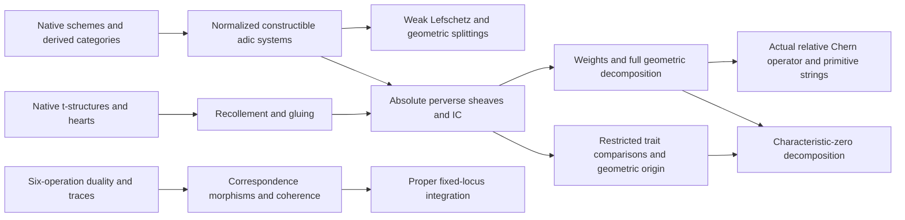

# Étale duality and perverse sheaves: EDC.4–EDC.8

This part plans the passage from étale duality and cycle classes to weak Lefschetz, perverse sheaves, decomposition and cohomological traces. Its objects are separated schemes of finite type over a specified field; the broader finite-coefficient projective-bundle and scheme/diamond comparison inputs keep the ranges of their existing suppliers. The packet is a completed target-level pass. Every stage is planned, with explicit external requests and seven named gaps. The independent review stored in the packet is unchanged historical evidence; this revision requires a fresh independent review.

The library baseline is Mathlib `082e2d37e8b0463410cdb532e111cd43d5a66174` and Tau Ceti `f790474821cf4256814db967cb154e7af3d0c369`. The reviewed library audit has no existing implementation of the EDC.4 or EDC.6–EDC.8 target theories and only a partial t-structure foundation for EDC.5. Native triangulated categories, subobjects, kernels, images, derived categories and scheme morphism properties are reused. In particular, the pinned t-structure heart is a full subcategory, but its abelian-category theorem still needs the admissibility argument: it is not already supplied by the heart definition.

The [packet](../packets/EtaleDualityAndPerverseSheaves--EDC.4.json) is the dependency graph and the [suggested file](../suggested/EtaleDualityAndPerverseSheaves--EDC.4.lean) contains active planning forms. Its admitted theorem bodies validate the shapes of the statements when elaborated; they are not proofs. Imported carrier definitions in that file represent the exact interfaces requested from their owners. All packet items retain unchecked implementation status. Mathematical statements below are in this document’s own words, with source locators; no source passages are reproduced.

## Conventions and the dependency boundary

Geometric objects in the suggested file are separated finite-type schemes over one specified field k, represented by the native category over Spec k. Broader finite-coefficient qcqs results already supplied by EDC.0–EDC.3 are imported, not replanned; the active geometric signatures display their finite-type specializations and adic extensions.

IntegralDatum consists of a complete DVR O finite over Z_ell, with a chosen uniformizer, residue characteristic ell prime and invertible in k, and fraction field finite over Q_ell. RationalDatum identifies the coefficient field E with that fraction field. Finite coefficients have a positive annihilator invertible in k; perverse coefficients are finite ell-power torsion fields or DVR quotients, O, or finite E.

Cohomological shifts satisfy H^q(K[n])=H^{q+n}(K), so a degree-zero sheaf on a smooth d-dimensional stratum is perverse after [d]. Integral p and p-plus are distinct. Geometric Frobenius acts on E(1) by q inverse.

Projective bundles parametrize lines in V, with O(1) dual to the tautological line. Thus the Chern relation is the sum of c_r(V) xi^(m+1-r), with plus signs. Exceptional self-intersection is multiplication by minus zeta.

A full finite biproduct isomorphism includes vanishing outside its support set. An arbitrary retract does not encode decomposition. Correspondence coherence uses SupportEquiv, whose equality transports the actual correspondence morphism u, in addition to identifying the support scheme.

All declarations remain planning items with unchecked implementation status. Suggested carrier data imported from named owners are scaffolding. Elaborating admitted theorem bodies validates types, not mathematical proofs.

The field is perfect in the perverse construction. For integral and rational coefficients, BBD 2.2.14, p.71, and 4.0, p.101, also require every mod-ℓ Galois cohomology group to be finite after every finite extension of the base field. This does not assert a bound on cohomological dimension. Finite coefficient perverse categories do not require this additional arithmetic condition. A geometric point is an actual morphism from the spectrum of a separably closed field; its dimension is the dimension of the closure of its image. Thus the perverse inequalities depend on a geometric location and its closure dimension, rather than on an unconnected numerical parameter. Numerical finiteness and trace statements use geometric cohomology over a separably closed base.

The abstract BBD theory belongs to EDC.5, until a general triangulated-categories roadmap takes ownership. It uses native Mathlib t-structures and abelian subcategories. Scheme sites and derived constructibility belong to SF.2; EDC.0–EDC.3 own the six-operation duality, Tate twists, traces, purity, Gysin and cycle classes used here. EnhancedDerivedSheaves E4 supplies inverse-limit reconstruction and repleteness, but those facts alone do not supply a constructible adic category. DWP.8 supplies mixedness, weights and directional six-operation estimates; DWP.9 supplies the absolute hard-Lefschetz and vector-space graded-operator results. EDC.7 separately supplies the categorical graded primitive construction.

The comparison index uses the existing fine nodes of AdicCoefficientsAndComparisons L2–L6. ECD §27 identifies exceptional pullback and internal Hom through the right adjoint Rc_*; its full-faithfulness theorem cannot invert a counit on an arbitrary diamond object. The stronger c^* duality transport therefore remains a named gap and a precise L3 request. Huber 3.8.1 remains an imported H5 comparison with coefficients prime to char(k); this revision does not claim a fresh reading of an uncleared book.

The graph below displays the mathematical flow at the level of constructions. The full packet records finer acyclic dependencies, including every consumed API lemma.

## EDC.4: affine bounds and geometric cohomology splittings

The proof starts with Artin’s support-sensitive affine cohomological dimension, imported from SF.2. If the nonzero ordinary cohomology sheaf in degree q has support dimension at most d_q, the hypercohomology spectral sequence bounds total degree by max(q+d_q). The bound only concerns nonzero sheaves. Smooth duality then gives low-degree compact-support vanishing for finite locally free lisse inputs. For integral coefficients the dual universal-coefficient calculation has Hom in degree 2d-i and Ext-one in degree 2d-i+1; both vanish in the required range. Localization on an affine hyperplane complement gives restriction bijectivity below the middle degree and injectivity in that degree. The Gysin sequence gives the opposite high-degree range when the section is smooth. The integral universal-coefficient sequence makes the middle restriction cokernel saturated. See SGA 4 XIV 3.1–3.4, pp.159–161, and Weil II 4.1.6, pp.218–219.

An ample section is represented by a genuine line bundle, a positive tensor power and its section’s zero scheme. Properness and ampleness give an affine complement (Stacks Tag 0EKE, Lemma 44.18, p.106 of the recorded PDF). This avoids assuming the theorem’s crucial affine conclusion as input. Along a chosen smooth ample-section chain one obtains the complete-intersection calculation. In high even degree, the dual low hyperplane power is the integral generator; the high hyperplane power is degree(X) times that generator. A smooth conic modulo 2 detects the difference. The primitive direct-sum assertion requires the degree to be a coefficient unit in the integral or finite-coefficient case.

For a bundle V of rank m+1, the projective bundle parametrizes lines, ξ is c1(O(1)) for the dual tautological line, and the derived columns are the adjunction images of its actual cup powers. All columns together form the specified isomorphism. The Chern relation has plus signs in this convention. Fibre integration gives π_*(ξ^m)=1 and zero for smaller powers, fixing the pairing of the summands. After untwisting, geometric Frobenius multiplies the j-th column by q^j. Milne 23.2, pp.139–140, supports this basis and relation; EDC.3 already owns the general finite-coefficient projective-bundle result.

For a smooth centre of codimension c, the blow-up map is the sum of the unit and the exceptional Gysin columns j_*(ζ^(a-1)p^*(-)), 1≤a<c. Self-intersection restricts these columns to -ζ^a. Checking that specified map on geometric stalks proves the derived split; knowing only the cohomology sheaves would not produce it. The same proper split supplies ordinary, compact-support and closed-support retractions and all exceptional cokernel summands. The pencil-axis result is its codimension-two case; the incidence variety and pencil map belong to LPV.3.

The vanishing and restricted spaces are actual kernels and images of Gysin and restriction. Adjointness under the perfect trace pairing gives mutual orthogonality and the dimension sum. No direct-sum axiom is imposed. A quadric surface hyperplane section in a quadric threefold over a base of characteristic different from 2, with F₂ coefficients, has a nonzero isotropic restricted line that is also the vanishing line. This example separates weak Lefschetz orthogonality from hard Lefschetz decomposition.

### Artin vanishing for constructible complexes on affine schemes

**Theorem · EtaleDualityAndPerverseSheaves:EDC.4/affine-vanishing-hypercohomology**

Let k be a separably closed field, n ≥ 1 invertible in k, Λ a noetherian ring with nΛ = 0, and U an affine scheme of finite type over k. (a) For every constructible sheaf F of Λ-modules on U_ét with dim Supp F ≤ e, H^q(U, F) = 0 for q > e (Artin's affine vanishing theorem, SGA 4 XIV 3.1–3.2, imported). (b) Let K ∈ D^b_c(U, Λ) and let d_q ∈ ℤ ∪ {−∞} satisfy dim Supp ℋ^q(K) ≤ d_q for every q (dim ∅ = −∞). Then H^m(U, K) = 0 for every m > max_q (q + d_q). (c) In particular, if dim Supp ℋ^q(K) ≤ −q for all q, then H^m(U, K) = 0 for m > 0; and H^m(U, K) = 0 for m > dim U + max{q : ℋ^q(K) ≠ 0}. The same bounds hold for K ∈ D^b_c(U, O_E) and D^b_c(U, E) (E/ℚ_ℓ finite, ℓ invertible in k), by passage to the limit.

Additional scope: k separably closed; n invertible in k; Λ noetherian with nΛ = 0 (for (a) and (b)). U affine of finite type over k; affineness is essential: H²(P¹, Λ(1)) = Λ although dim P¹ = 1. For O_E and E coefficients, the finiteness and Mittag-Leffler properties of the ℓ-adic formalism are imported (EllAdicRealization through SchemeAndStackFoundations:SF.2).

Proof plan:

1. (a) is SGA 4 XIV Corollaire 3.2 (Artin), requested from SchemeAndStackFoundations:SF.2 as part of the constructible-sheaf toolkit of CohomologicalPointCounting; BBD Corollaire 4.1.4 restates it.
2. (b) Use the hypercohomology spectral sequence E₂^{p,q} = H^p(U, ℋ^q K) ⇒ H^{p+q}(U, K), which converges because K is bounded. By (a), E₂^{p,q} = 0 for p > d_q, so every term with p + q = m vanishes when m > q + d_q for all q.
3. (c) is (b) with d_q = −q, respectively d_q = dim U.
4. For O, use the uniformly bounded normalized reductions and geometric finiteness from EDC.6, apply the finite-level support bound, and pass through derived completion. Rational coefficients follow by finite coefficient localization. The bound is imposed only on nonzero ordinary cohomology sheaves.

Direct prerequisites: `SchemeAndStackFoundations:SF.2`; `EtaleDualityAndPerverseSheaves:EDC.0/constructible-ctf-complexes`; `EtaleDualityAndPerverseSheaves:EDC.0/etale-derived-category`; [Classical and pro-étale ℓ-adic constructible categories](#classical-and-proetale-adic-categories) (`EtaleDualityAndPerverseSheaves:EDC.6/classical-and-proetale-adic-categories`); [normalized system uniform bounds API lemma](#api-normalized-system-uniform-bounds) (`EtaleDualityAndPerverseSheaves:EDC.6/api-normalized-system-uniform-bounds`).

Source support: [La conjecture de Weil. II](https://www.numdam.org/article/PMIHES_1980__52__137_0.pdf), §4, (4.1.6), p. 218. Deligne's proof of weak Lefschetz rests on the cohomological dimension of affine varieties (SGA 4 XIV 3.2). [SGA 4, Exposé XIV: Théorème de finitude pour un morphisme propre; dimension cohomologique des schémas algébriques affines](https://www.normalesup.org/~forgogozo/SGA4/14/14.pdf), XIV, Corollaire 3.2, LNM 305 pp. 159–160. Artin's affine vanishing: cd X ≤ dim X for X affine of finite type over a separably closed field (the retyped text keeps the margin page number 160 and the footnote mark (4)).

Active suggested names: `TauCeti.EtaleDuality.affine_vanishing_hypercohomology`.

### Vanishing of low-degree compactly supported cohomology of smooth affine varieties

**Theorem · EtaleDualityAndPerverseSheaves:EDC.4/compact-support-vanishing-smooth-affine**

Let k be separably closed, n invertible in k, Λ = O/π^m (more generally a noetherian self-injective ring killed by n), U a smooth affine k-scheme of pure dimension d and L a locally constant constructible sheaf of Λ-modules on U. Then H^i_c(U, L) = 0 for i < d. The same holds for a lisse O_E-sheaf or a lisse E-sheaf L (E/ℚ_ℓ finite, ℓ invertible in k).

Additional scope: k separably closed, n invertible; U smooth, affine, of pure dimension d. Λ self-injective, so that Poincaré duality is a perfect pairing degreewise; for O_E use the derived duality and the universal-coefficient sequence. A lisse O_E-sheaf here means locally finite free over O_E; geometric cohomology finiteness and coefficient reduction are used for the integral limit.

Proof plan:

1. Poincaré duality (EDC.2:pairings/poincare-duality-torsion): H^i_c(U, L) ≅ Hom_Λ(H^{2d−i}(U, L^∨(d)), Λ).
2. Artin vanishing (EDC.4/affine-vanishing-hypercohomology (a)) with e = d: H^{2d−i}(U, L^∨(d)) = 0 when 2d − i > d, that is i < d.
3. For O use derived Poincare duality and the universal-coefficient short exact sequence. The Hom term uses H^{2d-i}; the Ext-one term uses H^{2d-i+1}. Both vanish for i<d. Retain the locally finite-free lisse input and geometric finiteness. Tensoring with E gives the rational case.

Direct prerequisites: [Artin vanishing for constructible complexes on affine schemes](#affine-vanishing-hypercohomology) (`EtaleDualityAndPerverseSheaves:EDC.4/affine-vanishing-hypercohomology`); `EtaleDualityAndPerverseSheaves:EDC.2:pairings/poincare-duality-torsion`; `EtaleDualityAndPerverseSheaves:EDC.2:pairings/adic-and-rational-poincare-duality`; [Classical and pro-étale ℓ-adic constructible categories](#classical-and-proetale-adic-categories) (`EtaleDualityAndPerverseSheaves:EDC.6/classical-and-proetale-adic-categories`).

Source support: [La conjecture de Weil. II](https://www.numdam.org/article/PMIHES_1980__52__137_0.pdf), §4, (4.1.6), p. 219. Deligne deduces the vanishing of H^i_c(X − Y) for i < n from affine vanishing and Poincaré duality on the smooth affine X − Y.

Active suggested names: `TauCeti.EtaleDuality.compact_support_vanishing_smooth_affine`.

### The weak Lefschetz theorem

**Theorem · EtaleDualityAndPerverseSheaves:EDC.4/weak-lefschetz**

Let k be a separably closed field, ℓ a prime invertible in k, X a smooth projective k-scheme of pure dimension n + 1 with a closed immersion X ⊂ P^N_k, H ⊂ P^N a hyperplane and Y = X ∩ H (scheme-theoretic, Y ≠ X), with inclusion i : Y → X. Let Λ be ℤ/ℓ^m, O_E/λ^m, O_E or E (E/ℚ_ℓ finite), and L a locally constant constructible (respectively lisse) sheaf of Λ-modules on X. Then the restriction i^* : H^q(X, L) → H^q(Y, i^*L) is an isomorphism for q < n and injective for q = n. Y need not be smooth. If X, Y and L are defined over a subfield k₀ with k = k₀^sep, i^* is Gal(k/k₀)-equivariant; over k₀ = 𝔽_q it commutes with the geometric Frobenius.

Additional scope: k separably closed; ℓ invertible in k; X smooth projective of pure dimension n + 1; Y = X ∩ H for a hyperplane H of an embedding X ⊂ P^N. U := X − Y is affine (a closed subscheme of P^N − H ≅ 𝔸^N) and smooth of pure dimension n + 1; these are the only properties of Y used. This theorem is distinct from hard Lefschetz (DeligneWeightsAndPurity:DWP.9) and makes no claim about the nondegeneracy of the intersection form on the vanishing part (EDC.4/vanishing-and-restriction-subspaces). For O_E coefficients use finite-free lisse sheaves. Rational and integral coefficient categories are imported from EDC.6/classical-and-proetale-adic-categories.

Proof plan:

1. U = X − Y is affine: X − Y → P^N − H is a closed immersion, hence an affine morphism (mathlib:AlgebraicGeometry.isClosedImmersion_iff_isAffineHom), into the affine scheme P^N − H = D_+(h) ≅ Spec of a degree-zero localization (mathlib:AlgebraicGeometry.Proj.basicOpenIsoSpec); so U is affine (mathlib:AlgebraicGeometry.isAffine_of_isAffineHom).
2. The localization triangle j_!j^*L → L → i_*i^*L → for j : U → X open and i : Y → X closed (EDC.1:biduality/recollement-adjunctions) gives, X being proper, the exact sequence … → H^q_c(U, L) → H^q(X, L) → H^q(Y, i^*L) → H^{q+1}_c(U, L) → ….
3. By EDC.4/compact-support-vanishing-smooth-affine applied to the smooth affine U of pure dimension n + 1, H^q_c(U, L) = 0 for q < n + 1. Hence i^* is injective for q ≤ n and surjective for q ≤ n − 1.
4. Equivariance: all maps are induced by morphisms of schemes defined over k₀, hence commute with the Galois action (EDC.2:pairings/galois-frobenius-equivariance for the conventions).

Direct prerequisites: [Vanishing of low-degree compactly supported cohomology of smooth affine varieties](#compact-support-vanishing-smooth-affine) (`EtaleDualityAndPerverseSheaves:EDC.4/compact-support-vanishing-smooth-affine`); `EtaleDualityAndPerverseSheaves:EDC.1:biduality/recollement-adjunctions`; `EtaleDualityAndPerverseSheaves:EDC.2:pairings/galois-frobenius-equivariance`; [mathlib:AlgebraicGeometry.isClosedImmersion_iff_isAffineHom](https://github.com/leanprover-community/mathlib4/blob/082e2d37e8b0463410cdb532e111cd43d5a66174/Mathlib/AlgebraicGeometry/Morphisms/ClosedImmersion.lean); [mathlib:AlgebraicGeometry.Proj.basicOpenIsoSpec](https://github.com/leanprover-community/mathlib4/blob/082e2d37e8b0463410cdb532e111cd43d5a66174/Mathlib/AlgebraicGeometry/ProjectiveSpectrum/Basic.lean); [mathlib:AlgebraicGeometry.isAffine_of_isAffineHom](https://github.com/leanprover-community/mathlib4/blob/082e2d37e8b0463410cdb532e111cd43d5a66174/Mathlib/AlgebraicGeometry/Morphisms/Affine.lean); [Classical and pro-étale ℓ-adic constructible categories](#classical-and-proetale-adic-categories) (`EtaleDualityAndPerverseSheaves:EDC.6/classical-and-proetale-adic-categories`).

Source support: [La conjecture de Weil. II](https://www.numdam.org/article/PMIHES_1980__52__137_0.pdf), §4, (4.1.6), p. 218–219. Deligne's weak Lefschetz: the long exact sequence of relative cohomology together with the vanishing of H^i_c(X − Y) for i < n gives the restriction statement. [La conjecture de Weil. I](https://www.numdam.org/article/PMIHES_1974__43__273_0.pdf), §7, p. 299. Weil I derives weak Lefschetz from affine vanishing and Poincaré duality, exactly the route of this node.

Active suggested names: `TauCeti.EtaleDuality.weak_lefschetz`.

### The dual (Gysin) form of weak Lefschetz

**Theorem · EtaleDualityAndPerverseSheaves:EDC.4/weak-lefschetz-gysin**

In the situation of EDC.4/weak-lefschetz assume moreover that Y is smooth (a smooth hyperplane section, of pure dimension n). Then the Gysin map i_* : H^q(Y, i^*L) → H^{q+2}(X, L(1)) is an isomorphism for q > n and surjective for q = n, for Λ = ℤ/ℓ^m, O_E/λ^m, O_E or E and L locally constant constructible (lisse). Equivalently H^{q+2}(X, L(1))/i_*H^q(Y, i^*L) injects into H^{q+2}(U, L(1)), which vanishes for q + 2 > n + 1.

Additional scope: As in EDC.4/weak-lefschetz, with Y smooth of pure dimension n (smooth pair (Y, X) of codimension 1).

Proof plan:

1. The Gysin sequence of the smooth pair (Y, X) (EDC.3/gysin-sequence): … → H^{q+1}(U, L(1)) → H^q(Y, i^*L) →i_* H^{q+2}(X, L(1)) → H^{q+2}(U, L(1)) → ….
2. U = X − Y is affine of dimension n + 1, so H^m(U, L(1)) = 0 for m > n + 1 (EDC.4/affine-vanishing-hypercohomology (a)).
3. Hence i_* is surjective when q + 2 > n + 1 (q ≥ n) and injective when q + 1 > n + 1 (q > n).
4. For field coefficients this is the transpose of EDC.4/weak-lefschetz under Poincaré duality on X and Y (EDC.3/gysin-map: i_* is the transpose of i^*), which gives the same ranges.

Direct prerequisites: `EtaleDualityAndPerverseSheaves:EDC.3/gysin-sequence`; [Artin vanishing for constructible complexes on affine schemes](#affine-vanishing-hypercohomology) (`EtaleDualityAndPerverseSheaves:EDC.4/affine-vanishing-hypercohomology`); `EtaleDualityAndPerverseSheaves:EDC.3/gysin-map`; [The weak Lefschetz theorem](#weak-lefschetz) (`EtaleDualityAndPerverseSheaves:EDC.4/weak-lefschetz`).

Source support: [La conjecture de Weil. II](https://www.numdam.org/article/PMIHES_1980__52__137_0.pdf), §4, (4.1.6), p. 219. Deligne states the Gysin (dual) form of weak Lefschetz. [La conjecture de Weil. I](https://www.numdam.org/article/PMIHES_1974__43__273_0.pdf), §7, p. 300. Weil I uses the surjectivity of the Gysin map H^{n−1}(Y)(−1) → H^{n+1}(X) as the dual of weak Lefschetz.

Active suggested names: `TauCeti.EtaleDuality.weak_lefschetz_gysin`.

### Integral weak Lefschetz: torsion-freeness of the cokernel

**Theorem · EtaleDualityAndPerverseSheaves:EDC.4/weak-lefschetz-integral**

In the situation of EDC.4/weak-lefschetz with L = ℤ_ℓ (U = X − Y, n + 1 = dim X): the group H^{n+1}_c(U, ℤ_ℓ) is torsion-free, and consequently H^n(Y, ℤ_ℓ)/i^*H^n(X, ℤ_ℓ) is torsion-free. The same holds for O_E in place of ℤ_ℓ.

Additional scope: k separably closed, ℓ invertible; X smooth projective of pure dimension n + 1; Y = X ∩ H a hyperplane section; U = X − Y. RΓ_c(U, ℤ_ℓ) is a perfect complex of ℤ_ℓ-modules with RΓ_c(U, ℤ_ℓ) ⊗^L ℤ/ℓ ≅ RΓ_c(U, ℤ/ℓ) (ℓ-adic formalism imported through SchemeAndStackFoundations:SF.2).

Proof plan:

1. Universal coefficients: there is a short exact sequence 0 → H^n_c(U, ℤ_ℓ) ⊗ ℤ/ℓ → H^n_c(U, ℤ/ℓ) → Tor₁^{ℤ_ℓ}(H^{n+1}_c(U, ℤ_ℓ), ℤ/ℓ) → 0.
2. H^n_c(U, ℤ/ℓ) = 0 by EDC.4/compact-support-vanishing-smooth-affine (n < n + 1), so H^{n+1}_c(U, ℤ_ℓ)[ℓ] = Tor₁(H^{n+1}_c(U, ℤ_ℓ), ℤ/ℓ) = 0; a finitely generated ℤ_ℓ-module without ℓ-torsion is torsion-free.
3. The exact sequence H^n(X, ℤ_ℓ) → H^n(Y, ℤ_ℓ) → H^{n+1}_c(U, ℤ_ℓ) of EDC.4/weak-lefschetz embeds H^n(Y)/i^*H^n(X) into the torsion-free H^{n+1}_c(U, ℤ_ℓ).

Direct prerequisites: [Vanishing of low-degree compactly supported cohomology of smooth affine varieties](#compact-support-vanishing-smooth-affine) (`EtaleDualityAndPerverseSheaves:EDC.4/compact-support-vanishing-smooth-affine`); [The weak Lefschetz theorem](#weak-lefschetz) (`EtaleDualityAndPerverseSheaves:EDC.4/weak-lefschetz`); `EtaleDualityAndPerverseSheaves:EDC.2:pairings/adic-and-rational-poincare-duality`; `SchemeAndStackFoundations:SF.2`.

Source support: [La conjecture de Weil. II](https://www.numdam.org/article/PMIHES_1980__52__137_0.pdf), §4, (4.1.6), p. 219. Deligne's (4.1.6): the universal coefficient formula gives the torsion-freeness of H^{n+1}_c(X − Y, ℤ_ℓ), hence of H^n(Y, ℤ_ℓ)/H^n(X, ℤ_ℓ).

Active suggested names: `TauCeti.EtaleDuality.weak_lefschetz_integral`.

### Weak Lefschetz for ample divisors and hypersurface sections

**Theorem · EtaleDualityAndPerverseSheaves:EDC.4/ample-divisor-weak-lefschetz**

Let k be separably closed, ℓ invertible in k, X a smooth projective k-scheme of pure dimension n + 1, ℒ an ample invertible O_X-module, r ≥ 1 and s ∈ Γ(X, ℒ^{⊗r}) with zero scheme Y = V(s) ≠ X. Then the conclusions of EDC.4/weak-lefschetz (restriction H^q(X, L) → H^q(Y, L) bijective for q < n, injective for q = n) and, when Y is smooth, of EDC.4/weak-lefschetz-gysin hold, for Λ = ℤ/ℓ^m, O_E/λ^m, O_E, E. In particular they hold for Y = X ∩ V(F) with F a homogeneous form of degree r on P^N ⊃ X. By induction they hold along a chain X = X_0 ⊃ X_1 ⊃ … ⊃ X_c of smooth successive ample divisors.

Additional scope: X smooth projective of pure dimension n + 1 over k separably closed; ℒ ample; Y the zero scheme of a section of a positive power of ℒ. Only the affineness of X − Y = X_s and its smoothness are used, together with topological invariance of the étale site (Y and Y_red have the same cohomology).

Proof plan:

1. X is proper over k and ℒ^{⊗r} is ample, so X_s = X − Y is affine (Stacks, Tag 0EKE: for f universally closed and ℒ f-ample, X_s → S is affine; requested from SchemeAndStackFoundations:SF.0). Ampleness alone does not suffice without properness: on a quasi-affine non-affine X with ℒ = O_X and s = 1, X_s = X.
2. With U = X_s affine and smooth of pure dimension n + 1, the proofs of EDC.4/weak-lefschetz and EDC.4/weak-lefschetz-gysin apply verbatim: they use only EDC.4/compact-support-vanishing-smooth-affine and EDC.4/affine-vanishing-hypercohomology for U.
3. Alternatively, ℒ^{⊗rN} is very ample for N ≫ 0 and s^N is a hyperplane section in the corresponding embedding; Y and V(s^N) have the same reduced subscheme, and étale cohomology only depends on it (topological invariance, imported through SchemeAndStackFoundations:SF.2). For F of degree r on P^N, V(F) is a hyperplane section of the r-th Veronese re-embedding (Weil I, 5.7).
4. Chains: apply the statement to each X_{j+1} ⊂ X_j (each smooth projective) and compose.

Direct prerequisites: [The weak Lefschetz theorem](#weak-lefschetz) (`EtaleDualityAndPerverseSheaves:EDC.4/weak-lefschetz`); [The dual (Gysin) form of weak Lefschetz](#weak-lefschetz-gysin) (`EtaleDualityAndPerverseSheaves:EDC.4/weak-lefschetz-gysin`); `SchemeAndStackFoundations:SF.0`; `SchemeAndStackFoundations:SF.2`; `SchemeAndStackFoundations:SF.3`.

Source support: [La conjecture de Weil. I](https://www.numdam.org/article/PMIHES_1974__43__273_0.pdf), §5, (5.7), p. 292. Weil I's Veronese re-embedding turns degree-r hypersurface sections into hyperplane sections. [The Stacks Project, Chapter 29: Morphisms of Schemes](https://stacks.math.columbia.edu/download/morphisms.pdf), Morphisms of Schemes, Lemma 44.18, Tag 0EKE. For X proper (universally closed) and ℒ ample, X_s is affine: the complement of an ample divisor in a proper scheme is affine.

Active suggested names: `TauCeti.EtaleDuality.ample_divisor_weak_lefschetz`.

### Cohomology of smooth complete intersections

**Theorem · EtaleDualityAndPerverseSheaves:EDC.4/complete-intersection-cohomology**

Let k be separably closed, ℓ invertible in k, and X ⊂ P^N_k a smooth complete intersection of dimension m ≥ 1 (there is a chain P^N = X_N ⊃ X_{N−1} ⊃ … ⊃ X_m = X with each X_r = X_{r+1} ∩ H_r for a hypersurface H_r, all X_r smooth). Let Λ = ℤ/ℓ^a, ℤ_ℓ or ℚ_ℓ and h = c₁(O(1))|_X ∈ H²(X, Λ(1)). Then: (a) for q ≠ m, 0 ≤ q ≤ 2m, H^q(X, Λ) = 0 for q odd and H^q(X, Λ(q/2)) is free of rank one for q even; h^{q/2} generates for q < m. For q > m, a generator is dual to h^{m−q/2} under Poincaré duality, and h^{q/2} is deg(X) times that generator (after the trace normalization); the restriction H^q(P^N, Λ) → H^q(X, Λ) is an isomorphism for q < m. (b) H^m(X, Λ) = Λ(−m/2)·h^{m/2} ⊕ H^m(X, Λ)_0 when m is even (for Λ = ℚ_ℓ, and for ℤ/ℓ^a or ℤ_ℓ when deg X is prime to ℓ), with H^m(X)_0 := ker(∪h : H^m(X) → H^{m+2}(X)(1)); H^m(X) = H^m(X)_0 when m is odd. (c) With ℤ_ℓ coefficients all H^q(X, ℤ_ℓ) are torsion-free. (d) If X is defined over 𝔽_q, the geometric Frobenius acts on H^{2j}(X, ℚ_ℓ), 2j ≠ m, by multiplication by q^j. The comparison of primitive ranks across characteristics is the separate target EDC.6/complete-intersection-betti-comparison; it is not a conclusion of this node.

Additional scope: X a smooth complete intersection in P^N over a separably closed field; ℓ invertible. The splitting in (b) uses that h^m has degree deg X on X (Tr(h^m) = deg X): it is a direct sum over ℚ_ℓ, and over ℤ/ℓ^a or ℤ_ℓ only when deg X is a unit.

Proof plan:

1. Induction along the chain X_N = P^N ⊃ … ⊃ X_m = X, each X_r an ample divisor in the smooth projective X_{r+1} (EDC.4/ample-divisor-weak-lefschetz): H^q(X_{r+1}) → H^q(X_r) is bijective for q < r and injective for q = r; the Gysin map H^q(X_r)(−1) → H^{q+2}(X_{r+1}) is bijective for q > r and surjective for q = r (EDC.4/weak-lefschetz-gysin).
2. Hence H^q(X) ≅ H^q(P^N) for q < m (EDC.3/projective-space-cohomology), and by Poincaré duality on X (EDC.2:pairings/poincare-duality-torsion, adic form EDC.2:pairings/adic-and-rational-poincare-duality) H^q(X) for q > m is dual to H^{2m−q}(X), which is Λ·h^{m−q/2} or 0.
3. Torsion-freeness: for each smooth divisor X_r in X_{r+1}, integral weak Lefschetz gives an injection H^r(X_{r+1}, ℤ_ℓ) → H^r(X_r, ℤ_ℓ) with torsion-free cokernel. The source group is in a degree below dim X_{r+1}, hence identified with the free projective-space group by the already proved low-degree calculation. Therefore the middle group of X_r is free as well. Integral Poincaré duality and its universal-coefficient sequence then give freeness in all higher degrees, including degree r+1. This avoids assuming freeness in degree r+1 to prove it in degree r.
4. Splitting (b): Tr_X(h^m) = deg X (EDC.3/projective-space-cohomology, degree formula), so h^{m/2} ∪ h^{m/2} ≠ 0 and Λh^{m/2} is a direct summand complementary to the kernel of ∪h when deg X is invertible in Λ.
5. Frobenius: the low-degree hyperplane powers have eigenvalue q^j in untwisted cohomology. In high degrees use the perfect Frobenius-equivariant pairing with low degrees, whose multiplier is q^m; the resulting eigenvalue is q^j even when h^j is not an integral generator.

Discriminating tests:

- **TauCeti.EtaleDuality.completeIntersection_conic_generator** (non-example): On a smooth conic in characteristic different from 2, the hyperplane class has trace 2 and vanishes with F_2 coefficients. A high-degree generator therefore uses duality rather than blindly using h^r.

Direct prerequisites: [Weak Lefschetz for ample divisors and hypersurface sections](#ample-divisor-weak-lefschetz) (`EtaleDualityAndPerverseSheaves:EDC.4/ample-divisor-weak-lefschetz`); [The weak Lefschetz theorem](#weak-lefschetz) (`EtaleDualityAndPerverseSheaves:EDC.4/weak-lefschetz`); [The dual (Gysin) form of weak Lefschetz](#weak-lefschetz-gysin) (`EtaleDualityAndPerverseSheaves:EDC.4/weak-lefschetz-gysin`); [Integral weak Lefschetz: torsion-freeness of the cokernel](#weak-lefschetz-integral) (`EtaleDualityAndPerverseSheaves:EDC.4/weak-lefschetz-integral`); `EtaleDualityAndPerverseSheaves:EDC.3/projective-space-cohomology`; `EtaleDualityAndPerverseSheaves:EDC.2:pairings/poincare-duality-torsion`; `EtaleDualityAndPerverseSheaves:EDC.2:pairings/adic-and-rational-poincare-duality`; `EtaleDualityAndPerverseSheaves:EDC.0/tate-twist`; `SchemeAndStackFoundations:SF.0`.

Source support: [Lectures on Étale Cohomology](https://www.jmilne.org/math/CourseNotes/LEC.pdf), §16 (aside on complete intersections), p. 110. Milne gives the low-degree calculation, dual high-degree groups and primitive rational decomposition. The integral refinement uses saturated weak Lefschetz and integral duality; it does not assert that high integral hyperplane powers are generators.

Active suggested names: `TauCeti.EtaleDuality.complete_intersection_cohomology`, `TauCeti.EtaleDuality.complete_intersection_integral_free`, `TauCeti.EtaleDuality.complete_intersection_primitive_split`, `TauCeti.EtaleDuality.complete_intersection_odd_primitive`, `TauCeti.EtaleDuality.complete_intersection_frobenius`.

### The projective-bundle decomposition with Tate twists and Frobenius

**Theorem · EtaleDualityAndPerverseSheaves:EDC.4/projective-bundle-decomposition**

Let X be a quasi-compact quasi-separated scheme with n invertible, Λ = ℤ/n or O/π^r. For Λ = O_E or E require additionally that X is of finite type over a field with ℓ invertible and take bounded constructible K. Let V be a locally free O_X-module of rank m + 1, π : P(V) → X the projective bundle and ξ = c₁(O(1)) ∈ H²(P(V), Λ(1)). (a) The map ⊕_{j=0}^{m} Λ_X(−j)[−2j] → Rπ_*Λ_{P(V)} given by ξ^j is an isomorphism in D(X, Λ) (refining EDC.3/projective-bundle-freeness), hence H^q(P(V), π^*K) ≅ ⊕_j H^{q−2j}(X, K(−j)) for every K ∈ D(X, Λ). (b) Ring structure: ⊕_q H^q(P(V), Λ(∗)) = H^∗(X, Λ(∗))[ξ]/(Σ_{r=0}^{m+1} c_r(V) ξ^{m+1−r}). (c) For X smooth over k and π_* the Gysin pushforward (relative dimension m), π_*(π^*a ∪ ξ^j) = 0 for j < m and π_*(π^*a ∪ ξ^m) = a. (d) If X and V are defined over a field k₀ and k = k₀^sep, the decomposition H^q(P(V)_k, Λ) ≅ ⊕_j H^{q−2j}(X_k, Λ)(−j) is Gal(k/k₀)-equivariant; over k₀ = 𝔽_q the geometric Frobenius acts on the j-th summand as F_X ⊗ q^j (untwisted cohomology). (e) For X smooth proper of pure dimension d over k separably closed, the Poincaré pairing on P(V) restricted to the summands j and j' vanishes when j + j' < m and is ⟨π^*a ξ^j, π^*b ξ^{m−j}⟩ = ⟨a, b⟩_X when j + j' = m.

Additional scope: X qcqs with n invertible (for (c) and (e): X smooth, respectively smooth proper, over a field); E locally free of rank m + 1 (Zariski-locally free). Twists and Frobenius conventions are those of EDC.0/tate-twist (geometric Frobenius acts on Λ(−1) by q). The arbitrary-qcqs finite-coefficient decomposition is imported from EDC.3/projective-bundle-freeness. The adic extension uses EDC.6/classical-and-proetale-adic-categories in its finite-type range; the coefficient field and vector bundle are distinct objects. P(V) parametrizes lines and xi=c1(O(1)); the plus-sign relation follows this convention. The supplied EDC.3 finite-coefficient qcqs theorem is reused; the geometric adic refinement is finite type.

Proof plan:

1. (a) is EDC.3/projective-bundle-freeness for Λ = ℤ/n and O/π^m; for O_E pass to the limit over m (the maps are compatible with reduction), and for E tensor with E.
2. (b) is the definition of Chern classes (EDC.3/chern-classes) together with the freeness in (a).
3. (c) Projection formula for the Gysin map (EDC.3/gysin-map): π_*(π^*a ∪ ξ^j) = a ∪ π_*(ξ^j); π_*(ξ^j) ∈ H^{2j−2m}(X) vanishes for j < m by degree and π_*(ξ^m) = 1 because on a fibre P^m, Tr(ξ^m) = 1 (EDC.3/projective-space-cohomology).
4. (d) ξ is the Chern class of a line bundle defined over k₀, so it is Galois-invariant in H²(P(E)_k, Λ(1)); in untwisted cohomology F^*ξ = q·ξ (EDC.0/tate-twist), which gives the stated action.
5. (e) Tr_{P(E)} = Tr_X ∘ π_* (EDC.3/gysin-map, compatibility of traces), and (c).

Direct prerequisites: `EtaleDualityAndPerverseSheaves:EDC.3/projective-bundle-freeness`; `EtaleDualityAndPerverseSheaves:EDC.3/chern-classes`; `EtaleDualityAndPerverseSheaves:EDC.3/gysin-map`; `EtaleDualityAndPerverseSheaves:EDC.3/projective-space-cohomology`; `EtaleDualityAndPerverseSheaves:EDC.2:pairings/galois-frobenius-equivariance`; `EtaleDualityAndPerverseSheaves:EDC.0/tate-twist`; `EtaleDualityAndPerverseSheaves:EDC.2:pairings/adic-and-rational-poincare-duality`; [Classical and pro-étale ℓ-adic constructible categories](#classical-and-proetale-adic-categories) (`EtaleDualityAndPerverseSheaves:EDC.6/classical-and-proetale-adic-categories`); `SchemeAndStackFoundations:SF.0`; `SchemeAndStackFoundations:SF.3`; `SchemeAndStackFoundations:SF.5`.

Source support: [Lectures on Étale Cohomology](https://www.jmilne.org/math/CourseNotes/LEC.pdf), §23, Theorem 23.2, p. 139. Milne states the lines-convention projective-bundle basis and the relation defining its Chern classes. Adjunction sends the Kummer cup-power morphisms to the specified derived columns.

Active suggested names: `TauCeti.EtaleDuality.bundleColumn`, `TauCeti.EtaleDuality.projective_bundle_decomposition`, `TauCeti.EtaleDuality.projective_bundle_cohomology`, `TauCeti.EtaleDuality.projective_bundle_chern_relation`, `TauCeti.EtaleDuality.projective_bundle_pushforward`, `TauCeti.EtaleDuality.projective_bundle_pushforward_lower`, `TauCeti.EtaleDuality.projective_bundle_frobenius`, `TauCeti.EtaleDuality.projective_bundle_pairing`.

### Direct images along the blow-up of a smooth centre

**Theorem · EtaleDualityAndPerverseSheaves:EDC.4/blowup-direct-images**

Let k be a field, ℓ invertible in k, X a smooth k-scheme, i : Z → X a smooth closed subscheme of pure codimension c ≥ 2, π : X̃ = Bl_Z X → X the blow-up, E = π^{−1}(Z) the exceptional divisor with j : E → X̃ and p = π|_E : E → Z, and ζ := c₁(O_E(1)) = −j^*c₁(O_X̃(E)) ∈ H²(E, Λ(1)). Then X̃ is smooth, E is a smooth divisor with E ≅ P(N_{Z/X}) over Z (imported), Λ_X → Rπ_*Λ_X̃ is split injective, and Rπ_*Λ_X̃ ≅ Λ_X ⊕ ⊕_{a=1}^{c−1} i_*Λ_Z(−a)[−2a]; equivalently π_*Λ = Λ, R^{2a}π_*Λ ≅ i_*Λ_Z(−a) for 1 ≤ a ≤ c − 1 (generated by the image of ζ^a under j^*), and R^qπ_*Λ = 0 for all other q > 0. Λ = ℤ/ℓ^m, O_E/λ^m, O_E or E. The splitting is the actual sum of the adjunction unit and j_*(zeta^(a-1)p^*(-)); its restriction to E has columns 1,-zeta,...,-zeta^(c-1).

Additional scope: X smooth over a field k, Z ⊂ X smooth of pure codimension c ≥ 2; ℓ invertible in k. The geometry of the blow-up (X̃ smooth, E = P(N_{Z/X}), O_X̃(−E)|_E = O_E(1), π an isomorphism over X − Z, π proper) is requested from SchemeAndStackFoundations:SF.0.

Proof plan:

1. Over X − Z, π is an isomorphism, so Rπ_*Λ|_{X−Z} = Λ.
2. π is proper, so proper base change (requested from SchemeAndStackFoundations:SF.2) gives (R^qπ_*Λ)_z̄ = H^q(P^{c−1}_{z̄}, Λ) at geometric points z̄ of Z: Λ(−a) for q = 2a ≤ 2(c − 1), 0 otherwise (EDC.3/projective-space-cohomology).
3. Use the adjunction unit for Λ_X and, for 1 ≤ a ≤ c−1, the morphism i_*Λ_Z(−a)[−2a] → Rπ_*Λ_X̃ obtained from p^*, multiplication by ζ^{a−1}, and the exceptional-divisor Gysin map j_*. Their direct sum defines the proposed decomposition morphism.
4. Check this morphism on geometric stalks by proper base change. Off Z it is the identity. Over Z its restriction to E has columns 1 and −ζ^a, since j^*j_*y = −ζ∪y by EDC.3/self-intersection-formula. These form the projective-bundle basis, so the morphism is an isomorphism. The trace π_* splits its first column by the degree-one projection formula. Merely knowing the cohomology sheaves of a complex would not prove a derived splitting.

Direct prerequisites: [The projective-bundle decomposition with Tate twists and Frobenius](#projective-bundle-decomposition) (`EtaleDualityAndPerverseSheaves:EDC.4/projective-bundle-decomposition`); `EtaleDualityAndPerverseSheaves:EDC.3/projective-space-cohomology`; `EtaleDualityAndPerverseSheaves:EDC.3/gysin-map`; `SchemeAndStackFoundations:SF.0`; `SchemeAndStackFoundations:SF.2`; `EtaleDualityAndPerverseSheaves:EDC.3/self-intersection-formula`; [Classical and pro-étale ℓ-adic constructible categories](#classical-and-proetale-adic-categories) (`EtaleDualityAndPerverseSheaves:EDC.6/classical-and-proetale-adic-categories`); `SchemeAndStackFoundations:SF.5`.

Source support: [Lectures on Étale Cohomology](https://www.jmilne.org/math/CourseNotes/LEC.pdf), §33, proof of Lemma 33.2, p. 194. Milne computes the direct images along the blow-up of the codimension-two axis by proper base change: π_*Λ = Λ, R²π_*Λ supported on A ∩ X, other R^r = 0.

Active suggested names: `TauCeti.EtaleDuality.blowupSplitMap`, `TauCeti.EtaleDuality.blowup_direct_images`, `TauCeti.EtaleDuality.blowupColumn_cohomology`, `TauCeti.EtaleDuality.blowup_exceptional_restriction`.

### The blow-up formula along a smooth centre

**Theorem · EtaleDualityAndPerverseSheaves:EDC.4/blowup-formula**

In the situation of EDC.4/blowup-direct-images, for every q the map Φ : H^q(X, Λ) ⊕ ⊕_{a=1}^{c−1} H^{q−2a}(Z, Λ(−a)) → H^q(X̃, Λ), (x, (z_a)) ↦ π^*x + Σ_a j_*(ζ^{a−1} ∪ p^*z_a), is an isomorphism, where j_* : H^{r}(E, Λ(s)) → H^{r+2}(X̃, Λ(s+1)) is the Gysin map of the divisor E. Its inverse has first component π_* (the Gysin pushforward, with π_*π^* = id). Compatibilities: j^*π^*x = p^*i^*x; π_*j_*(ζ^{a−1} ∪ p^*z) = 0 for 1 ≤ a ≤ c − 1 (degree reasons along the fibres P^{c−1}); for X proper over k separably closed, Tr_X̃(π^*x) = Tr_X(x) on top-degree classes; if X, Z are defined over k₀ (k = k₀^sep) Φ is Gal(k/k₀)-equivariant and over 𝔽_q the geometric Frobenius acts on the summand H^{q−2a}(Z)(−a) as F_Z ⊗ q^a (untwisted). Λ = ℤ/ℓ^m, O_E/λ^m, O_E or E.

Additional scope: As in EDC.4/blowup-direct-images; for Galois and Frobenius statements X and Z are defined over k₀ and the cohomology is that of X_k, Z_k. For cohomology over a non-separably-closed k₀ the decomposition is of Galois modules after base change to k.

Proof plan:

1. Apply RΓ(X, −) to Rπ_*Λ_X̃ ≅ Λ_X ⊕ ⊕_a i_*Λ_Z(−a)[−2a] (EDC.4/blowup-direct-images): H^q(X̃) ≅ H^q(X) ⊕ ⊕_a H^{q−2a}(Z)(−a).
2. Identify the summands with Φ: the first is π^* (adjunction unit). For the others, j_*(ζ^{a−1} ∪ p^*z) restricted to E is exactly −ζ^a ∪ p^*z, because j^*j_*y = y ∪ c₁(O(E))|_E = −y ∪ ζ (self-intersection formula, EDC.3/self-intersection-formula); the explicit projective-bundle basis on geometric stalks shows that Φ realises the decomposition.
3. π_*π^* = id: π is proper birational between smooth schemes of the same dimension (EDC.3/gysin-map, projection formula with π_*1 = 1).
4. Traces: Tr_X̃ = Tr_X ∘ π_* (EDC.3/gysin-map) and π_*π^* = id. Equivariance and Frobenius as in EDC.4/projective-bundle-decomposition (d): ζ and the Gysin map of E are defined over k₀ and j_* raises the twist by one.

Direct prerequisites: [Direct images along the blow-up of a smooth centre](#blowup-direct-images) (`EtaleDualityAndPerverseSheaves:EDC.4/blowup-direct-images`); `EtaleDualityAndPerverseSheaves:EDC.3/gysin-map`; `EtaleDualityAndPerverseSheaves:EDC.3/self-intersection-formula`; [The projective-bundle decomposition with Tate twists and Frobenius](#projective-bundle-decomposition) (`EtaleDualityAndPerverseSheaves:EDC.4/projective-bundle-decomposition`).

Source support: [La conjecture de Weil. I](https://www.numdam.org/article/PMIHES_1974__43__273_0.pdf), §7, p. 299. Weil I uses the blow-up formula along the smooth codimension-two centre A ∩ X: H*(X̃) = H*(X) ⊕ H^{*−2}(A ∩ X)(−1). [Lectures on Étale Cohomology](https://www.jmilne.org/math/CourseNotes/LEC.pdf), §33, proof of Lemma 33.2, p. 194. Milne obtains H*(X*) ≅ H*(X) ⊕ H*−2(A ∩ X)(−1) from the degenerating Leray spectral sequence of the blow-up.

Active suggested names: `TauCeti.EtaleDuality.blowupCohomologyMap`, `TauCeti.EtaleDuality.blowup_formula`, `TauCeti.EtaleDuality.blowup_first_inverse`, `TauCeti.EtaleDuality.blowup_frobenius`.

### Cohomology of the blow-up along the axis of a pencil

**Application · EtaleDualityAndPerverseSheaves:EDC.4/pencil-axis-blowup**

Let X ⊂ P^N be a smooth projective k-scheme of pure dimension n + 1 over a separably closed field k (ℓ invertible), and A ⊂ P^N a linear subspace of codimension 2 meeting X transversally, so that A ∩ X is smooth of pure codimension 2 in X (possibly empty). Let π : X̃ = Bl_{A∩X}X → X. Then for Λ = ℤ/ℓ^m, ℤ_ℓ, ℚ_ℓ: H^q(X̃, Λ) ≅ H^q(X, Λ) ⊕ H^{q−2}(A ∩ X, Λ)(−1), via π^* and j_*p^*, with π^* split injective; if X and A are defined over 𝔽_q the decomposition commutes with the geometric Frobenius, which acts on the second summand as q·F_{A∩X}. In particular b_q(X̃) = b_q(X) + b_{q−2}(A ∩ X) and χ(X̃) = χ(X) + χ(A ∩ X). The identification of X̃ with the incidence variety of the pencil and the map X̃ → P¹ belong to LefschetzPencilsAndVanishingCycles:LPV.3 and are not used here.

Additional scope: X smooth projective of pure dimension n + 1; A a codimension-2 linear subspace transverse to X (so A ∩ X is smooth of codimension 2). n≥1, so the ambient dimension is at least two; the empty-axis case remains allowed.

Proof plan:

1. This is EDC.4/blowup-formula with c = 2, Z = A ∩ X, E = P(N_{Z/X}) a P¹-bundle over Z, ζ⁰ = 1.
2. Frobenius on the summand: EDC.4/blowup-formula (twist (−1) contributes the factor q).

Direct prerequisites: [The blow-up formula along a smooth centre](#blowup-formula) (`EtaleDualityAndPerverseSheaves:EDC.4/blowup-formula`).

Source support: [La conjecture de Weil. I](https://www.numdam.org/article/PMIHES_1974__43__273_0.pdf), §7, proof of Lemme (7.1), p. 299. Weil I passes to the blow-up of X along the smooth codimension-two centre A ∩ X (the axis of the pencil) and uses its cohomology. [Lectures on Étale Cohomology](https://www.jmilne.org/math/CourseNotes/LEC.pdf), §33, Lemma 33.2 and proof, p. 193–194. Milne blows up along the axis A ∩ X of a Lefschetz pencil before applying the Leray spectral sequence of X* → P¹.

Active suggested names: `TauCeti.EtaleDuality.pencil_axis_blowup`.

### Pullback along blow-ups and projective bundles is split injective

**Theorem · EtaleDualityAndPerverseSheaves:EDC.4/pullback-injective-blowup-bundle**

Let σ : X' → X be either (i) the blow-up of a smooth k-scheme X along a smooth closed subscheme Z of pure codimension c ≥ 2, or (ii) a projective bundle P(E) → X of relative dimension r ≥ 1 over a qcqs X, with ℓ invertible. For Λ = ℤ/ℓ^m, O_E/λ^m, O_E or E, σ^* : H^q(X, Λ) → H^q(X', Λ) is split injective, with retraction π_* in case (i) and a ↦ σ_*(ξ^r ∪ −) in case (ii); the same holds for cohomology with compact supports and for cohomology with supports in a closed subset T ⊂ X and its preimage. In case (ii) the cokernel is the sum of H^{q−2j}(X, Λ)(−j) for 1≤j≤r; for r=1 this is H^{q−2}(X, Λ)(−1), and in case (i) the cokernel is ⊕_{a=1}^{c−1} H^{q−2a}(Z, Λ)(−a), so σ^* is bijective in degrees q < 2 (and an isomorphism in all degrees when Z = ∅).

Additional scope: As in EDC.4/blowup-formula (case (i)) or EDC.4/projective-bundle-decomposition (case (ii)); integral coefficients O_E allowed. The adic projective-bundle case has the finite-type and bounded-constructible range of EDC.4/projective-bundle-decomposition. Supports and compact supports use the same proper derived decomposition, not a new pullback on compact supports for arbitrary nonproper morphisms.

Proof plan:

1. (i) EDC.4/blowup-formula: H^q(X') = σ^*H^q(X) ⊕ (exceptional summands), with π_*σ^* = id.
2. (ii) EDC.4/projective-bundle-decomposition (a) and (c).
3. Compact supports and supports in T: apply the same decompositions of Rσ_*Λ (EDC.4/blowup-direct-images, EDC.4/projective-bundle-decomposition (a)), which are isomorphisms in D(X, Λ), to RΓ_c(X, −) and RΓ_T(X, −) (proper base change for σ proper, imported through SchemeAndStackFoundations:SF.2).

Direct prerequisites: [The blow-up formula along a smooth centre](#blowup-formula) (`EtaleDualityAndPerverseSheaves:EDC.4/blowup-formula`); [The projective-bundle decomposition with Tate twists and Frobenius](#projective-bundle-decomposition) (`EtaleDualityAndPerverseSheaves:EDC.4/projective-bundle-decomposition`); [Direct images along the blow-up of a smooth centre](#blowup-direct-images) (`EtaleDualityAndPerverseSheaves:EDC.4/blowup-direct-images`); `SchemeAndStackFoundations:SF.2`; [Classical and pro-étale ℓ-adic constructible categories](#classical-and-proetale-adic-categories) (`EtaleDualityAndPerverseSheaves:EDC.6/classical-and-proetale-adic-categories`).

Source support: [On the Beilinson–Bloch–Kato conjecture for Rankin–Selberg motives](https://arxiv.org/pdf/1912.11942v3), §5.11, Lemma 5.11.3(3), p. 98 (arXiv v3). Liu–Tian–Xiao–Zhang–Zhu use injectivity of the pullback along a blow-up with smooth centre or a P¹-bundle (Lemma 5.11.3(3)–(4)); this node is that statement for étale cohomology with O_λ coefficients.

Active suggested names: `TauCeti.EtaleDuality.pullback_injective_blowup_bundle`, `TauCeti.EtaleDuality.bundle_supported_retraction`, `TauCeti.EtaleDuality.blowup_supported_retraction`, `TauCeti.EtaleDuality.bundle_supported_cokernel`, `TauCeti.EtaleDuality.blowup_supported_cokernel`, `TauCeti.EtaleDuality.supported_modification_low_degrees`.

### Vanishing and restricted subspaces of a hyperplane section, and primitive subspaces

**Construction · EtaleDualityAndPerverseSheaves:EDC.4/vanishing-and-restriction-subspaces**

Let k be separably closed, ℓ invertible, E a field of coefficients (finite of characteristic ℓ, or finite over ℚ_ℓ), X a smooth projective k-scheme of pure dimension n + 1 and i : Y → X a smooth hyperplane section (pure dimension n), with Lefschetz class L = c₁(O_X(1)) ∈ H²(X, E(1)). Define the vanishing subspace Van(Y) := ker(i_* : H^n(Y, E) → H^{n+2}(X, E(1))) and the restricted subspace Res(Y) := im(i^* : H^n(X, E) → H^n(Y, E)), both E-subspaces of H^n(Y, E). Then, with respect to the Poincaré pairing ⟨y, y'⟩ = Tr_Y(y ∪ y') on H^n(Y, E) (perfect and (−1)^n-symmetric after the identification E(n) ≅ E over k), Res(Y) = Van(Y)^⊥ and Van(Y) = Res(Y)^⊥; dim Res(Y) + dim Van(Y) = dim H^n(Y). Moreover i_*i^* = L ∪ − on H^∗(X). For 0 ≤ q ≤ n + 1 the primitive subspace is P^q(X) := ker(L^{n+2−q} : H^q(X, E) → H^{2n+4−q}(X, E(n+2−q))). No decomposition H^n(Y) = Res(Y) ⊕ Van(Y) and no Lefschetz decomposition into primitive parts is asserted: both require hard Lefschetz (DeligneWeightsAndPurity:DWP.9).

Additional scope: X smooth projective of pure dimension n + 1 over k separably closed; Y a smooth hyperplane section; field coefficients E (so that orthogonal complements have complementary dimensions).

Proof plan:

1. Van(Y) and Res(Y) are kernels and images of E-linear maps between finite-dimensional spaces (finiteness imported through SchemeAndStackFoundations:SF.2).
2. i_* is the transpose of i^* for the Poincaré pairings of Y and X (EDC.3/gysin-map): ⟨i^*x, y⟩_Y = ⟨x, i_*y⟩_X. Hence y ⊥ Res(Y) ⟺ i_*y ⊥ H^n(X) ⟺ i_*y = 0 (perfectness on X, EDC.2:pairings/poincare-duality-torsion), i.e. Res(Y)^⊥ = Van(Y); the pairing on Y is perfect, so Van(Y)^⊥ = Res(Y) and the dimensions add up.
3. i_*i^*x = cl(Y) ∪ x = L ∪ x (EDC.3/projective-space-cohomology, the hyperplane-section formula).
4. P^q(X) is a kernel of an E-linear map; nothing about its complement is claimed.

Reusable API:

- **TauCeti.EtaleDuality.vanishingSubspace** (constructor): Van(Y) := ker(i_* : H^n(Y, E) → H^{n+2}(X, E(1))) as an E-subspace of H^n(Y, E).
- **TauCeti.EtaleDuality.restrictedSubspace** (constructor): Res(Y) := im(i^* : H^n(X, E) → H^n(Y, E)) as an E-subspace of H^n(Y, E).
- **TauCeti.EtaleDuality.restrictedSubspace_eq_orthogonal** (characterisation): Res(Y) = Van(Y)^⊥ for the Poincaré pairing of Y.
- **TauCeti.EtaleDuality.vanishingSubspace_eq_orthogonal** (characterisation): Van(Y) = Res(Y)^⊥ for the Poincaré pairing of Y.
- **TauCeti.EtaleDuality.finrank_restricted_add_vanishing** (relation): dim Res(Y) + dim Van(Y) = dim H^n(Y, E).
- **TauCeti.EtaleDuality.gysin_comp_restriction** (relation): i_* ∘ i^* = L ∪ − : H^q(X, E) → H^{q+2}(X, E(1)).
- **TauCeti.EtaleDuality.primitiveSubspace** (constructor): P^q(X) := ker(L^{n+2−q} : H^q(X, E) → H^{2n+4−q}(X, E(n+2−q))) for q ≤ n + 1.
- **TauCeti.EtaleDuality.vanishingSubspace_galois** (functoriality): If X, Y are defined over k₀, Van(Y) and Res(Y) are Gal(k/k₀)-stable subspaces.

Discriminating tests:

- **TauCeti.EtaleDuality.vanishingSubspace_projectiveSpace** (computation): For X = P^{n+1} and Y = P^n a hyperplane, Van(Y) = 0 and Res(Y) = H^n(Y).
- **TauCeti.EtaleDuality.restrictedSubspace_planeCubic** (computation): For X=P² embedded by O(3), a smooth plane cubic Y is a hyperplane section; Res(Y)=0 and Van(Y)=H¹(Y,E) has dimension 2.
- **TauCeti.EtaleDuality.vanishingSubspace_zero_of_curve_point** (degenerate): For n=0, X a smooth connected projective curve and Y a nonempty reduced hyperplane section of d points, Van(Y) is the kernel of the sum map E^d → E and has dimension d−1.
- **TauCeti.EtaleDuality.not_vanishing_inf_restricted_eq_bot** (non-example): Use 𝔽₂ coefficients over a separably closed base field of characteristic different from 2. Take X a smooth quadric threefold and Y its smooth quadric surface hyperplane section. H²(Y) ≅ 𝔽₂², Res(Y) is spanned by h = (1,1), and h∪h has trace 2 = 0, so Res(Y) = Van(Y) is nonzero. This detects an unjustified direct-sum axiom.

Uses: DeligneWeightsAndPurity:DWP.9 (orthogonal decomposition of a hyperplane section, Weil II 4.3.9): hard Lefschetz upgrades Res(Y) = Van(Y)^⊥ to H^n(Y) = Res(Y) ⊕ Van(Y); LefschetzPencilsAndVanishingCycles:LPV.4 (global vanishing cycles): the vanishing cycles of a Lefschetz pencil span Van(Y) and Res(Y) is their orthogonal; Deligne, Weil II (4.3.1)–(4.3.2): Ev(Y) and Ev(Y)^⊥ for the trace pairing on H^n(Y).

Direct prerequisites: `EtaleDualityAndPerverseSheaves:EDC.3/gysin-map`; `EtaleDualityAndPerverseSheaves:EDC.2:pairings/poincare-duality-torsion`; `EtaleDualityAndPerverseSheaves:EDC.3/projective-space-cohomology`; [The weak Lefschetz theorem](#weak-lefschetz) (`EtaleDualityAndPerverseSheaves:EDC.4/weak-lefschetz`); [The dual (Gysin) form of weak Lefschetz](#weak-lefschetz-gysin) (`EtaleDualityAndPerverseSheaves:EDC.4/weak-lefschetz-gysin`); `SchemeAndStackFoundations:SF.2`; `EtaleDualityAndPerverseSheaves:EDC.2:pairings/adic-and-rational-poincare-duality`; `SchemeAndStackFoundations:SF.0`.

Source support: [La conjecture de Weil. II](https://www.numdam.org/article/PMIHES_1980__52__137_0.pdf), §4.3, before Lemme (4.3.2), p. 222. Deligne uses the vanishing part of H^n(Y) and its orthogonal for the trace pairing; this node constructs both as subspaces without the hard-Lefschetz splitting.

Active suggested names: `TauCeti.EtaleDuality.vanishingSubspace`, `TauCeti.EtaleDuality.restrictedSubspace`, `TauCeti.EtaleDuality.primitiveSubspace`.

## EDC.5: bounded t-cohomology, recollement and absolute perversity

The heart is first proved abelian using the native abelian-subcategory admissibility criterion. H⁰ is the truncation composite corestricted to the heart, and H^n is H⁰ after [n]. Detection and cohomological aisle characterizations require both bounds on the object. The degenerate t-structure with lower aisle zero and upper aisle the whole category shows why a bound below alone is insufficient. The canonical derived-category test identifies the entire cohomology functor naturally with ordinary homology, rather than merely checking one zero object.

A recollement contains six functors, four adjunctions, the required full faithfulness and the actual adjunction distinguished triangles. A full embedding without adjoints fails the definition: the finite-dimensional-vector-space inclusion into all vector spaces supplies a discriminating example. Gluing defines both t-structure halves and proves boundedness and the six directional exactness assertions. Intermediate extension is the image in the heart of the canonical lower-shriek-to-pushforward morphism. Its no-closed-subobject and no-closed-quotient conditions are separate, and its simple classification includes a simple closed object and its pushforward isomorphism.

The perverse t-structure imposes stalk and costalk inequalities at every actual geometric point with its closure dimension. The field coefficient case is self-dual; integral p and p-plus remain distinct. On a smooth stratum of dimension d, a lisse object L[d] is perverse. On a separably closed point the heart is equivalent to all finite coefficient modules. Étale restriction computes the Hom presheaf, and derived object descent together with local inequalities gives effective perverse descent. Finite length covers the specified field and DVR-quotient coefficients, while the integral perverse category need not be artinian.

The open/closed recollement gives the actual five-term exact sequences, without an invented amplitude-one bound for every closed immersion. Locally closed intermediate extension is open extension followed by closed pushforward. A global ordinary-truncation formula is used only with a smooth boundary of dimension e and input concentrated in degrees at most -e-1; a skyscraper in the open disproves the unrestricted version. IC is formed from a smooth dense open and an actual lisse L[d], not an arbitrary perverse input. Dense-open independence compares the restrictions of the same local system. Finite birational IC comparison needs its lisse extension on the entire smooth source. Nodal and cuspidal curve stalks distinguish two branches from one.

Artin vanishing supplies affine exactness, the general fibre-dimension estimates give all four perverse amplitudes, and smooth connected-fibre pullback has its prescribed shift and full faithfulness. Semismallness and smallness are actual fibre-dimension-locus conditions; a small-map IC theorem separately assumes a dense smooth generic finite-etale square. The integral uniformizer is a selected scalar endomorphism, with torsion and torsion-free properties defined from that map. The torsion pair and its p-plus tilt retain the residue point object in degree -1 and the free point object in degree zero. These targets use BBD 1.3–1.4, pp.29–55, 2.1–2.2, pp.57–73, and 3.3–4.3.1, pp.98–113.

### The heart of a t-structure is abelian

**Theorem · EtaleDualityAndPerverseSheaves:EDC.5/t-structure-heart-abelian**

Let C be a triangulated category and t = (C^{≤0}, C^{≥0}) a t-structure on C (Mathlib's TStructure). The heart C^♥ = C^{≤0} ∩ C^{≥0} (Mathlib's TStructure.heart, as a full subcategory) is an abelian category; a sequence 0 → A → B → C → 0 in C^♥ is short exact if and only if it extends to a distinguished triangle A → B → C → A[1] of C, and this extension is unique. Ext¹_{C^♥}(C, A) → Hom_C(C, A[1]) is an isomorphism and Hom_C(A, B[n]) = 0 for n < 0 and A, B ∈ C^♥.

Additional scope: C triangulated (IsTriangulated, octahedral axiom); t a t-structure.

Proof plan:

1. Hom_C(A, B[n]) = 0 for n < 0 and A, B in the heart: B[n] ∈ C^{≥1} when n < 0 (Mathlib TStructure.zero').
2. Every morphism f : A → B of the heart is admissible: complete it to a triangle A → B → S → A[1]; S ∈ C^{[−1,0]}, and the truncation triangle τ^{≤−1}S → S → τ^{≥0}S → gives K := (τ^{≤−1}S)[−1] and Q := τ^{≥0}S in the heart with the triangle K[1] → S → Q → required by Mathlib's AbelianSubcategory criterion (BBD 1.2).
3. Apply mathlib:CategoryTheory.Triangulated.AbelianSubcategory.abelian to the inclusion of the heart (BBD 1.3.6). Short exact sequences ↔ triangles is BBD 1.3.6's proof (1.2.4).

Direct prerequisites: [mathlib:CategoryTheory.Triangulated.TStructure](https://github.com/leanprover-community/mathlib4/blob/082e2d37e8b0463410cdb532e111cd43d5a66174/Mathlib/CategoryTheory/Triangulated/TStructure/Basic.lean); [mathlib:CategoryTheory.Triangulated.TStructure.heart](https://github.com/leanprover-community/mathlib4/blob/082e2d37e8b0463410cdb532e111cd43d5a66174/Mathlib/CategoryTheory/Triangulated/TStructure/Heart.lean); [mathlib:CategoryTheory.Triangulated.AbelianSubcategory.abelian](https://github.com/leanprover-community/mathlib4/blob/082e2d37e8b0463410cdb532e111cd43d5a66174/Mathlib/CategoryTheory/Triangulated/TStructure/AbelianSubcategory.lean).

Source support: [Faisceaux pervers](https://www.numdam.org/item/AST_1982__100__1_0.pdf), Théorème 1.3.6, p. 31. The heart of a t-category is an admissible abelian subcategory and H⁰ is cohomological.

Active suggested names: `TauCeti.EtaleDuality.TStructure.heartAbelian`.

### Cohomology functors of a t-structure

**Construction · EtaleDualityAndPerverseSheaves:EDC.5/t-cohomology-functor**

For a t-structure t on a triangulated category C, the functor H⁰_t := τ^{≥0}τ^{≤0} : C → C^♥ (Mathlib's truncation functors, corestricted to the heart) is a homological functor: it sends distinguished triangles to long exact sequences in the abelian category C^♥ (EDC.5/t-structure-heart-abelian). Set H^n_t(X) := H⁰_t(X[n]). For X ∈ C^♥, H⁰_t(X) ≅ X; for X ∈ C^{≤a} ∩ C^{≥b} (a bounded object), X = 0 if and only if H^n_t(X) = 0 for all n, and X ∈ C^{≤0} if and only if H^n_t(X) = 0 for n > 0.

Additional scope: C triangulated, t a t-structure; conservativity statements are for bounded objects (t-structures need not be nondegenerate).

Proof plan:

1. Define H⁰_t from Mathlib's truncations τ^{≤0}, τ^{≥0} (TStructure.truncLE, truncGE) — the composite lands in the heart.
2. Homological: BBD 1.3.6 (second assertion) — for a triangle X → Y → Z →, the long sequence of H^n_t is exact; proved by reducing to triangles in C^{≤0} and C^{≥0} with the truncation triangles.
3. Conservativity on bounded objects by induction on the length using the truncation triangles.

Reusable API:

- **TauCeti.EtaleDuality.TStructure.homologyZero** (constructor): H⁰_t : C ⥤ heart(t), the composite τ^{≥0}τ^{≤0} corestricted to the heart.
- **TauCeti.EtaleDuality.TStructure.homology** (constructor): H^n_t := H⁰_t ∘ [n] : C ⥤ heart(t).
- **TauCeti.EtaleDuality.TStructure.homologyZero_isHomological** (instance): H⁰_t is a homological functor (Mathlib Functor.IsHomological).
- **TauCeti.EtaleDuality.TStructure.homologyZero_obj_heart** (simp): For X in the heart, H⁰_t(X) ≅ X.
- **TauCeti.EtaleDuality.TStructure.isZero_of_homology_isZero** (characterisation): For t-bounded X (specified lower and upper bounds), if every H^n_t(X) is zero then X is zero. The converse follows because the homological functors preserve zero objects.
- **TauCeti.EtaleDuality.TStructure.isLE_iff_homology** (characterisation): For X bounded for t (X ∈ C^{≥a} ∩ C^{≤b} for some a,b), X ∈ C^{≤0} iff H^n_t(X) ≅ 0 for every n > 0.
- **TauCeti.EtaleDuality.canonicalHeartEquiv** (equivalence): The canonical heart of the derived category of an abelian category A is naturally equivalent to A, and under this equivalence H^n_t is naturally isomorphic to the usual derived homology functor in every integer degree.

Discriminating tests:

- **TauCeti.EtaleDuality.homologyZero_canonical** (compatibility): For the canonical t-structure on D(A), H^n_t ≅ the homology functor DerivedCategory.homologyFunctor A n.
- **TauCeti.EtaleDuality.homologyZero_zero** (degenerate): H⁰_t(0) ≅ 0.
- **TauCeti.EtaleDuality.homologyZero_shift_ne** (non-example): H⁰_t does not commute with shifts: on D(A), H⁰_t(A[1]) = 0 while H⁰_t(A) = A for A ≠ 0 in A, so H⁰_t is not a triangulated functor.
- **TauCeti.EtaleDuality.not_isLE_iff_homology_of_bounded_below** (non-example): For the degenerate t-structure (C^{≤0}, C^{≥0}) = (0,C) on a nonzero triangulated category, every object is bounded below and every H^n_t is zero, but nonzero objects are not in C^{≤0}. Bounded below alone does not imply the characterization.

Uses: BBD 1.3.6–1.3.7 and §2.1: perverse cohomology pH^n := H^n_t for the perverse t-structure; the long exact sequences used throughout §§1.4–5; EtaleDualityAndPerverseSheaves:EDC.7 (decomposition theorem): K ≅ ⊕ pH^i(K)[−i] is stated with the perverse cohomology functors; LefschetzPencilsAndVanishingCycles:LPV.6: t-exactness of nearby cycles is checked on perverse cohomology.

Direct prerequisites: [The heart of a t-structure is abelian](#t-structure-heart-abelian) (`EtaleDualityAndPerverseSheaves:EDC.5/t-structure-heart-abelian`); [mathlib:CategoryTheory.Triangulated.TStructure](https://github.com/leanprover-community/mathlib4/blob/082e2d37e8b0463410cdb532e111cd43d5a66174/Mathlib/CategoryTheory/Triangulated/TStructure/Basic.lean); [mathlib:CategoryTheory.Functor.IsHomological](https://github.com/leanprover-community/mathlib4/blob/082e2d37e8b0463410cdb532e111cd43d5a66174/Mathlib/CategoryTheory/Triangulated/HomologicalFunctor.lean); [mathlib:DerivedCategory.TStructure.t](https://github.com/leanprover-community/mathlib4/blob/082e2d37e8b0463410cdb532e111cd43d5a66174/Mathlib/Algebra/Homology/DerivedCategory/TStructure.lean).

Source support: [Faisceaux pervers](https://www.numdam.org/item/AST_1982__100__1_0.pdf), Théorème 1.3.6, p. 31. H⁰ = τ_{≥0}τ_{≤0} with values in the heart is a cohomological functor.

Active suggested names: `TauCeti.EtaleDuality.TStructure.homologyZero`, `TauCeti.EtaleDuality.TStructure.homology`, `TauCeti.EtaleDuality.canonicalHeartEquiv`.

### Left and right t-exact functors

**Definition · EtaleDualityAndPerverseSheaves:EDC.5/t-exact-functor**

Let (C₁, t₁), (C₂, t₂) be triangulated categories with t-structures and T : C₁ → C₂ a triangulated functor. T is right t-exact if T(C₁^{≤0}) ⊂ C₂^{≤0}, left t-exact if T(C₁^{≥0}) ⊂ C₂^{≥0}, and t-exact if both. If T is left (right) t-exact, the induced functor pT := H⁰_{t₂} ∘ T ∘ ι : C₁^♥ → C₂^♥ is left (right) exact. For an adjoint pair T* ⊣ T_* of triangulated functors, T* is right t-exact if and only if T_* is left t-exact. Composites of right (left) t-exact functors are right (left) t-exact.

Additional scope: Triangulated functors between triangulated categories with t-structures.

Proof plan:

1. Definition by the two inclusions; the adjoint criterion: Hom(T*X, Y) = Hom(X, T_*Y) and the characterisation C^{≤0} = ⊥(C^{≥1}) (BBD 1.3.17 (iii)).
2. Exactness of pT: from the long exact sequence of H⁰_t applied to T of a triangle (EDC.5/t-cohomology-functor), BBD 1.3.17 (i).

Reusable API:

- **TauCeti.EtaleDuality.Functor.IsRightTExact** (constructor): T is right t-exact: T(C₁^{≤0}) ⊆ C₂^{≤0}.
- **TauCeti.EtaleDuality.Functor.IsLeftTExact** (constructor): T is left t-exact: T(C₁^{≥0}) ⊆ C₂^{≥0}.
- **TauCeti.EtaleDuality.Functor.IsTExact** (constructor): T is t-exact: both.
- **TauCeti.EtaleDuality.Functor.IsRightTExact.comp** (functoriality): Composites of right t-exact functors are right t-exact.
- **TauCeti.EtaleDuality.Functor.isRightTExact_iff_isLeftTExact_of_adjunction** (characterisation): For T* ⊣ T_*, T* is right t-exact iff T_* is left t-exact.
- **TauCeti.EtaleDuality.Functor.heartFunctor** (data): pT := H⁰_{t₂} ∘ T ∘ ι : heart(t₁) ⥤ heart(t₂).
- **TauCeti.EtaleDuality.Functor.heartFunctor_preservesFiniteColimits** (other): If T is right t-exact, pT is right exact (preserves finite colimits).
- **TauCeti.EtaleDuality.Functor.IsLeftTExact.comp** (functoriality): Composites of left t-exact functors are left t-exact.
- **TauCeti.EtaleDuality.Functor.heartFunctor_preservesFiniteLimits** (other): For a triangulated left t-exact T, the induced functor pT preserves finite limits.

Discriminating tests:

- **TauCeti.EtaleDuality.isTExact_id** (degenerate): The identity functor of C is t-exact for every t.
- **TauCeti.EtaleDuality.isRightTExact_shift_one** (computation): The shift functor [1] is right t-exact for every t.
- **TauCeti.EtaleDuality.not_isLeftTExact_shift_one** (non-example): For the canonical t-structure on D(A) with A ≠ 0, the shift [1] is not left t-exact.
- **TauCeti.EtaleDuality.isTExact_canonical_exactFunctor** (compatibility): An exact functor F : A → B of abelian categories induces a t-exact functor D(A) → D(B) for the canonical t-structures.

Uses: BBD 1.4.16 and 4.1.1–4.2.4: exactness properties of j_!, j_*, i^*, i^!, affine and smooth morphisms are stated as t-exactness; LefschetzPencilsAndVanishingCycles:LPV.6: nearby cycles RΨ[−1] is t-exact for the perverse t-structure; IgusaVarietiesAndTorsionConcentration:IG.4: semiperversity bounds are one-sided t-exactness statements.

Direct prerequisites: [Cohomology functors of a t-structure](#t-cohomology-functor) (`EtaleDualityAndPerverseSheaves:EDC.5/t-cohomology-functor`); [mathlib:CategoryTheory.Triangulated.TStructure](https://github.com/leanprover-community/mathlib4/blob/082e2d37e8b0463410cdb532e111cd43d5a66174/Mathlib/CategoryTheory/Triangulated/TStructure/Basic.lean).

Source support: [Faisceaux pervers](https://www.numdam.org/item/AST_1982__100__1_0.pdf), 1.3.16, p. 36. Definition of left/right t-exact functors and the adjoint criterion.

Active suggested names: `TauCeti.EtaleDuality.Functor.IsRightTExact`, `TauCeti.EtaleDuality.Functor.IsLeftTExact`, `TauCeti.EtaleDuality.Functor.IsTExact`.

### Recollement of triangulated categories

**Definition · EtaleDualityAndPerverseSheaves:EDC.5/recollement-data**

A recollement of triangulated categories D_F ⟶ D ⟶ D_U consists of triangulated functors i_* : D_F → D and j^* : D → D_U with left and right adjoints i^* ⊣ i_* ⊣ i^! and j_! ⊣ j^* ⊣ j_*, such that i_*, j_! and j_* are fully faithful, j^*i_* = 0, and for every K ∈ D the adjunction maps extend to distinguished triangles j_!j^*K → K → i_*i^*K → and i_*i^!K → K → j_*j^*K →. Equivalently: i_* identifies D_F with the kernel of j^* and the two triangles exist (BBD 1.4.3). Consequences: i^*j_! = 0, i^!j_* = 0, the triangles are functorial and unique. The main instance is constructible étale sheaves on X with a closed subscheme Z = F and open complement U (EDC.1:biduality/recollement-adjunctions).

Additional scope: D, D_F, D_U triangulated; the six functors triangulated.

Proof plan:

1. Record the six functors and adjunctions as data, and full faithfulness, vanishing and the existence of triangles as properties (BBD 1.4.3).
2. Derived identities: i^*j_! = 0 from Hom(i^*j_!A, B) = Hom(A, j^*i_*B) = 0; uniqueness of the connecting maps from Hom(j_!j^*K, i_*i^*K[−1]) = 0 (BBD 1.1.10).

Reusable API:

- **TauCeti.EtaleDuality.Recollement** (constructor): The structure of a recollement: i_*, j^*, their adjoints i^*, i^!, j_!, j_* with the adjunctions, full faithfulness, j^*i_* ≅ 0 and the two triangles.
- **TauCeti.EtaleDuality.Recollement.triangleLowerShriek** (data): The functorial distinguished triangle j_!j^*K → K → i_*i^*K → (j_!j^*K)[1], with the adjunction maps and its connecting map.
- **TauCeti.EtaleDuality.Recollement.triangleUpperShriek** (data): The functorial distinguished triangle i_*i^!K → K → j_*j^*K → (i_*i^!K)[1].
- **TauCeti.EtaleDuality.Recollement.upperStar_lowerShriek_eq_zero** (relation): i^* ∘ j_! ≅ 0 and i^! ∘ j_* ≅ 0.
- **TauCeti.EtaleDuality.Recollement.ofClosedOpen** (constructor): The constructible étale recollement for Z ⊂ X closed with open complement U.
- **TauCeti.EtaleDuality.Recollement.op** (other): The opposite recollement on the opposite categories exchanges j_! with j_* and i^* with i^!.
- **TauCeti.EtaleDuality.Recollement.triangleLowerShriek_distinguished** (relation): The actual unit/counit triangle j_!j^*K → K → i_*i^*K → is distinguished.
- **TauCeti.EtaleDuality.Recollement.triangleUpperShriek_distinguished** (relation): The actual unit/counit triangle i_*i^!K → K → j_*j^*K → is distinguished.

Discriminating tests:

- **TauCeti.EtaleDuality.recollement_ofClosedOpen_empty** (degenerate): For Z = ∅, i_* = 0 and j^* is an equivalence D(X) ≌ D(U).
- **TauCeti.EtaleDuality.recollement_ofClosedOpen_upperStar** (compatibility): In Recollement.ofClosedOpen, j^* is the restriction functor pullback j of the imported étale operations.
- **TauCeti.EtaleDuality.recollement_triangle_point** (computation): For X = 𝔸¹, Z = {0}, K = Λ_X: the triangle j_!Λ_U → Λ_X → i_*Λ_Z → is the localization triangle.
- **TauCeti.EtaleDuality.not_recollement_without_adjoints** (non-example): The full inclusion of finite-dimensional F-vector spaces into all F-vector spaces has no right adjoint. A proposed adjunction, tested against F, would identify the underlying vector space of its finite-dimensional value with an arbitrary infinite-dimensional vector space. This tests the need to supply adjoints; full faithfulness alone does not provide them.

Uses: BBD 1.4.10: a t-structure on D is glued from t-structures on D_U and D_F; EtaleDualityAndPerverseSheaves:EDC.5/perverse-t-structure: induction over a stratification glues the perverse t-structure; GeometricSatakeAndFusion:GS1: the relative perverse t-structure is glued along Schubert strata.

Direct prerequisites: `EtaleDualityAndPerverseSheaves:EDC.1:biduality/recollement-adjunctions`; [mathlib:CategoryTheory.Functor.IsTriangulated](https://github.com/leanprover-community/mathlib4/blob/082e2d37e8b0463410cdb532e111cd43d5a66174/Mathlib/CategoryTheory/Triangulated/Functor.lean).

Source support: [Faisceaux pervers](https://www.numdam.org/item/AST_1982__100__1_0.pdf), 1.4.3 (1.4.3.1)–(1.4.3.2), p. 44. The axioms of a recollement situation (i_*, j^* with adjoints, triangles).

Active suggested names: `TauCeti.EtaleDuality.Recollement`, `TauCeti.EtaleDuality.Recollement.triangleLowerShriek`, `TauCeti.EtaleDuality.Recollement.triangleUpperShriek`.

### Gluing t-structures along a recollement

**Theorem · EtaleDualityAndPerverseSheaves:EDC.5/glued-t-structure**

Given a recollement D_F ⟶ D ⟶ D_U (EDC.5/recollement-data) and t-structures t_F on D_F and t_U on D_U, D^{≤0} := {K : j^*K ∈ D_U^{≤0}, i^*K ∈ D_F^{≤0}} and D^{≥0} := {K : j^*K ∈ D_U^{≥0}, i^!K ∈ D_F^{≥0}} form a t-structure on D (BBD 1.4.10). For it: j_! and i^* are right t-exact, j_* and i^! are left t-exact, i_* and j^* are t-exact (BBD 1.4.16); the induced functors on hearts satisfy pj^* ∘ pi_* = 0 and p(i_*) identifies D_F^♥ with the objects A of D^♥ with j^*A = 0. Boundedness of t_F and t_U implies boundedness of the glued t-structure.

Additional scope: A recollement; t-structures on D_F and D_U.

Proof plan:

1. Axiom (i) (Hom(D^{≤0}, D^{≥1}) = 0) from the first triangle of K and the adjunctions; axiom (ii) by shift invariance; axiom (iii) (truncation triangles) by the two-step construction of BBD 1.4.10 using τ_U and τ_F and the octahedral axiom.
2. Exactness (1.4.16) from the definitions and EDC.5/t-exact-functor's adjoint criterion.

Direct prerequisites: [Recollement of triangulated categories](#recollement-data) (`EtaleDualityAndPerverseSheaves:EDC.5/recollement-data`); [Left and right t-exact functors](#t-exact-functor) (`EtaleDualityAndPerverseSheaves:EDC.5/t-exact-functor`); [mathlib:CategoryTheory.Triangulated.TStructure](https://github.com/leanprover-community/mathlib4/blob/082e2d37e8b0463410cdb532e111cd43d5a66174/Mathlib/CategoryTheory/Triangulated/TStructure/Basic.lean); [comp API lemma](#api-functor--is-right-t-exact-comp) (`EtaleDualityAndPerverseSheaves:EDC.5/api-functor--is-right-t-exact-comp`); [comp API lemma](#api-functor--is-left-t-exact-comp) (`EtaleDualityAndPerverseSheaves:EDC.5/api-functor--is-left-t-exact-comp`); [triangleLowerShriek distinguished API lemma](#api-recollement-triangle-lower-shriek-distinguished) (`EtaleDualityAndPerverseSheaves:EDC.5/api-recollement-triangle-lower-shriek-distinguished`); [triangleUpperShriek distinguished API lemma](#api-recollement-triangle-upper-shriek-distinguished) (`EtaleDualityAndPerverseSheaves:EDC.5/api-recollement-triangle-upper-shriek-distinguished`).

Source support: [Faisceaux pervers](https://www.numdam.org/item/AST_1982__100__1_0.pdf), Théorème 1.4.10, p. 48. The pair (D^{≤0}, D^{≥0}) defined by j^*, i^*, i^! is a t-structure, glued from those on D_U and D_F.

Active suggested names: `TauCeti.EtaleDuality.Recollement.glue`, `TauCeti.EtaleDuality.Recollement.glue_le_iff`, `TauCeti.EtaleDuality.Recollement.glue_ge_iff`, `TauCeti.EtaleDuality.Recollement.glue_bounded`, `TauCeti.EtaleDuality.Recollement.glue_exactness`.

### Intermediate extension in a recollement

**Construction · EtaleDualityAndPerverseSheaves:EDC.5/abstract-intermediate-extension**

In a recollement with glued t-structure (EDC.5/glued-t-structure), write pj_! := H⁰ ∘ j_! and pj_* := H⁰ ∘ j_* : D_U^♥ → D^♥. The intermediate extension j_!* : D_U^♥ → D^♥ sends B to the image of the canonical map pj_!B → pj_*B (BBD 1.4.22). It satisfies j^*j_!*B ≅ B; j_!*B has no nonzero subobject or quotient of the form i_*C with C ∈ D_F^♥, and it is the unique extension of B with this property (BBD 1.4.23–1.4.25); j_!* is fully faithful; it sends simple objects to simple objects, and every simple object of D^♥ is either j_!*S with S simple in D_U^♥ or i_*T with T simple in D_F^♥ (BBD 1.4.26).

Additional scope: A recollement with the glued t-structure.

Proof plan:

1. Define j_!* as the image in the abelian heart (EDC.5/t-structure-heart-abelian) of pj_!B → pj_*B, the map adjoint to B → j^*pj_*B.
2. Characterisations: BBD 1.4.23 (truncation descriptions j_!*B = τ^F_{≤−1}j_*B and = τ^F_{≥1}j_!B for the glued truncations) and 1.4.24–1.4.25 (no sub/quotient from D_F, uniqueness).
3. Simple objects: BBD 1.4.26 via the exact sequences relating pj_!, j_!*, pj_* with i_*-terms.

Reusable API:

- **TauCeti.EtaleDuality.Recollement.intermediateExtension** (constructor): j_!* : heart(t_U) ⥤ heart(glued), B ↦ image(pj_!B → pj_*B).
- **TauCeti.EtaleDuality.Recollement.upperStar_intermediateExtension** (simp): j^* ∘ j_!* ≅ 𝟭 on heart(t_U).
- **TauCeti.EtaleDuality.Recollement.intermediateExtension_no_sub_quotient** (characterisation): j_!*B has no nonzero subobject or quotient in the essential image of i_* : heart(t_F) → heart.
- **TauCeti.EtaleDuality.Recollement.intermediateExtension_unique** (universal-property): A perverse extension restricting to A and having no nonzero closed-supported subobject or quotient is isomorphic to j_!*A, with the prescribed restriction identification.
- **TauCeti.EtaleDuality.Recollement.intermediateExtension_fullyFaithful** (other): j_!* is fully faithful.
- **TauCeti.EtaleDuality.Recollement.simple_classification** (characterisation): Every simple object of the heart is j_!*S with S simple or i_*T with T simple.

Discriminating tests:

- **TauCeti.EtaleDuality.intermediateExtension_empty_closed** (degenerate): If D_F = 0 then j_!* ≅ the inverse of the equivalence j^* on hearts.
- **TauCeti.EtaleDuality.intermediateExtension_simple** (characterisation): j_!* sends simple objects to simple objects.
- **TauCeti.EtaleDuality.intermediateExtension_ne_lowerShriek** (non-example): For j : 𝔾_m → 𝔸¹ and B = Λ[1] with field coefficients, 0 → i_*Λ_0 → pj_!B → Λ_{𝔸¹}[1] → 0 is exact in Perv. The nonzero boundary subobject shows pj_!B ≇ j_!*B; it is a subobject, not a quotient.

Uses: BBD 2.1.7–2.1.11: the intersection complex is j_!* of a shifted local system; EtaleDualityAndPerverseSheaves:EDC.5/intermediate-extension: the étale j_!* is this construction for the perverse t-structures; GeometricSatakeAndFusion:GS1: simple equivariant perverse sheaves on the affine Grassmannian are intermediate extensions from orbits.

Direct prerequisites: [Gluing t-structures along a recollement](#glued-t-structure) (`EtaleDualityAndPerverseSheaves:EDC.5/glued-t-structure`); [The heart of a t-structure is abelian](#t-structure-heart-abelian) (`EtaleDualityAndPerverseSheaves:EDC.5/t-structure-heart-abelian`); [Cohomology functors of a t-structure](#t-cohomology-functor) (`EtaleDualityAndPerverseSheaves:EDC.5/t-cohomology-functor`); [heartFunctor preservesFiniteColimits API lemma](#api-functor-heart-functor-preserves-finite-colimits) (`EtaleDualityAndPerverseSheaves:EDC.5/api-functor-heart-functor-preserves-finite-colimits`); [heartFunctor preservesFiniteLimits API lemma](#api-functor-heart-functor-preserves-finite-limits) (`EtaleDualityAndPerverseSheaves:EDC.5/api-functor-heart-functor-preserves-finite-limits`); [upperStar lowerShriek eq zero API lemma](#api-recollement-upper-star-lower-shriek-eq-zero) (`EtaleDualityAndPerverseSheaves:EDC.5/api-recollement-upper-star-lower-shriek-eq-zero`).

Source support: [Faisceaux pervers](https://www.numdam.org/item/AST_1982__100__1_0.pdf), Définition 1.4.22, p. 54. j_!*B is the image of pj_!B in pj_*B.

Active suggested names: `TauCeti.EtaleDuality.Recollement.intermediateExtension`, `TauCeti.EtaleDuality.Recollement.simple_classification`.

### The middle perverse t-structure

**Construction · EtaleDualityAndPerverseSheaves:EDC.5/perverse-t-structure**

Let k be a perfect field, X a separated scheme of finite type over k, ℓ invertible in k, and Λ either a finite field of characteristic ℓ or Λ = O/π^m (self-injective) or a finite extension E of ℚ_ℓ (with D^b_c(X, E) imported, EDC.6/classical-and-proetale-adic-categories). For a point x of X let dim(x) := dim of its closure. Define pD^{≤0}(X, Λ) := {K ∈ D^b_c(X, Λ) : ℋ^i(K)_x̄ = 0 for i > −dim(x), for all points x} — equivalently dim Supp ℋ^{−i}(K) ≤ i for all i — and pD^{≥0}(X, Λ) := {K : ℋ^i(i_x^!K)_x̄ = 0 for i < −dim(x), for all x}, where i_x : x̄ → X; for Λ a field, K ∈ pD^{≥0} iff D_X K ∈ pD^{≤0}. Then (pD^{≤0}, pD^{≥0}) is a bounded t-structure on D^b_c(X, Λ), the middle perverse t-structure. It is local for the étale topology, it is obtained by gluing (EDC.5/glued-t-structure) the shifted standard t-structures on the strata of any stratification adapted to K, and for X = Spec k with k separably closed it is the standard t-structure.

Additional scope: X separated of finite type over a perfect field k; ℓ invertible in k. For the rational category and source-faithful BBD §4 statements, require also that H^i(Gal(k^sep/k′), ℤ/ℓ) is finite for every finite k′/k and every i (BBD 4.0; e.g. finite or algebraically closed k). Broader modern versions need a separate justification. Coefficients: finite fields of characteristic ℓ, O/π^m, or E/ℚ_ℓ finite. Integral O_E coefficients need the separate torsion-pair construction EDC.5/integral-perverse-torsion-pair; no statement about them is made here. The costalk condition uses i_x^! for the inclusion of a (non-closed) point, computed as a colimit over open neighbourhoods of strata; equivalently, for a stratification {S} adapted to K, i_S^!K has cohomology sheaves in degrees ≥ −dim S.

Proof plan:

1. Choose a stratification by smooth locally closed strata S such that the ℋ^i(K|_S) and ℋ^i(i_S^!K) are locally constant (constructibility, EDC.0/constructible-ctf-complexes, and stability of D^b_c under the six operations, EDC.1:biduality/duality-exchange-isomorphisms).
2. On each stratum take the standard t-structure shifted by −dim S; glue by induction on the number of strata with EDC.5/glued-t-structure along the recollement of an open union of strata and its closed complement (EDC.5/recollement-data, EDC.1:biduality/recollement-adjunctions); this is BBD 2.1.3 in the étale setting (BBD 2.2.10–2.2.19).
3. Independence of the stratification: refine (BBD 2.1.14); étale locality from the stalk description; the duality characterisation for field coefficients from the exchange D i_S^* = i_S^! D (EDC.1:biduality/duality-exchange-isomorphisms) and self-duality of the shifted standard t-structure on lisse sheaves (EDC.1:biduality/dualizing-complex-of-smooth-scheme).

Reusable API:

- **TauCeti.EtaleDuality.perverseTStructure** (constructor): The middle perverse t-structure on D^b_c(X, Λ).
- **TauCeti.EtaleDuality.perverseTStructure_le_iff** (characterisation): K ∈ pD^{≤0} iff for every geometric point x̄ over x and every j with j + dim(x) > 0, ℋ^j(K)_x̄ = 0.
- **TauCeti.EtaleDuality.perverseTStructure_ge_iff_verdierDual** (characterisation): For Λ a field: K ∈ pD^{≥0} iff D_X K ∈ pD^{≤0}.
- **TauCeti.EtaleDuality.perverseTStructure_bounded** (other): Every K ∈ D^b_c(X, Λ) lies in pD^{≥a} ∩ pD^{≤b} for some a ≤ b.
- **TauCeti.EtaleDuality.perverseTStructure_restrict_etale** (functoriality): For u : V → X étale, u^* is t-exact for the perverse t-structures.
- **TauCeti.EtaleDuality.perverseTStructure_glue** (compatibility): For Z ⊂ X closed with complement U, the perverse t-structure of X is the gluing of those of U and Z along Recollement.ofClosedOpen.
- **TauCeti.EtaleDuality.perverseTStructure_point** (compatibility): For X = Spec k, k separably closed, the perverse t-structure is the canonical t-structure.

Discriminating tests:

- **TauCeti.EtaleDuality.perverse_point_eq_canonical** (compatibility): For X = Spec Ω, Ω separably closed, pD^{≤0}(X, Λ) = D^{≤0} under D^b_c(Spec Ω, Λ) ≃ D^b_{fg}(Λ).
- **TauCeti.EtaleDuality.perverse_curve_constant_shift** (computation): For X a smooth curve over a separably closed field, Λ_X[1] lies in the heart.
- **TauCeti.EtaleDuality.perverse_empty** (degenerate): For X = ∅ the category is zero and both halves are everything.
- **TauCeti.EtaleDuality.not_perverse_curve_constant** (non-example): For a nonempty smooth curve and nonzero coefficients, Λ_X in degree 0 has its only perverse cohomology in degree +1: it lies in pD^{≥1} and fails pD^{≤0}; it is not perverse.

Uses: BBD §4.0: pD^{≤0}, pD^{≥0} defined by dimension of supports and costalks; Yun–Zhang II, §§3.5, 7.1 (PAPER-YUN-ZHANG-19/10): perverse sheaves and IC complexes on finite-type schemes with characteristic-zero ℓ-adic coefficients; Caraiani–Scholze, §6.1 (PAPER-CARAIANI-SCHOLZE-17/164): perverse 𝔽_ℓ-sheaves on finite-type schemes over an algebraically closed field; GeometricSatakeAndFusion:GS1: the scheme-side model for the relative perverse t-structure of FS VI.7; LefschetzPencilsAndVanishingCycles:LPV.6 and LPV.7: nearby cycles RΨ[d] are perverse.

Direct prerequisites: [Gluing t-structures along a recollement](#glued-t-structure) (`EtaleDualityAndPerverseSheaves:EDC.5/glued-t-structure`); [Recollement of triangulated categories](#recollement-data) (`EtaleDualityAndPerverseSheaves:EDC.5/recollement-data`); `EtaleDualityAndPerverseSheaves:EDC.0/constructible-ctf-complexes`; `EtaleDualityAndPerverseSheaves:EDC.1:biduality/duality-exchange-isomorphisms`; `EtaleDualityAndPerverseSheaves:EDC.1:biduality/recollement-adjunctions`; `EtaleDualityAndPerverseSheaves:EDC.1:biduality/dualizing-complex-of-smooth-scheme`; `EtaleDualityAndPerverseSheaves:EDC.1:adjoint/verdier-dual`; [mathlib:CategoryTheory.Triangulated.TStructure](https://github.com/leanprover-community/mathlib4/blob/082e2d37e8b0463410cdb532e111cd43d5a66174/Mathlib/CategoryTheory/Triangulated/TStructure/Basic.lean); [Classical and pro-étale ℓ-adic constructible categories](#classical-and-proetale-adic-categories) (`EtaleDualityAndPerverseSheaves:EDC.6/classical-and-proetale-adic-categories`); `SchemeAndStackFoundations:SF.0`.

Source support: [Faisceaux pervers](https://www.numdam.org/item/AST_1982__100__1_0.pdf), 4.0, (4.0.1)–(4.0.2), p. 102. The middle perversity conditions in terms of dim(x) for X of finite type over a field. [Faisceaux pervers](https://www.numdam.org/item/AST_1982__100__1_0.pdf), Proposition 2.1.3, p. 57. The perverse t-structure is obtained by gluing along strata. [Faisceaux pervers](https://www.numdam.org/item/AST_1982__100__1_0.pdf), 2.2.14, p.71, and 4.0, p.101. Each mod-ell Galois cohomology group must be finite after finite extensions for the classical integral and rational constructible categories; this is not a finite cohomological-dimension assertion.

Active suggested names: `TauCeti.EtaleDuality.perverseTStructure`.

### Perverse sheaves

**Definition · EtaleDualityAndPerverseSheaves:EDC.5/perverse-sheaves**

In the situation of EDC.5/perverse-t-structure, the category of perverse sheaves Perv(X, Λ) is the heart pD^{≤0}(X, Λ) ∩ pD^{≥0}(X, Λ), an abelian category (EDC.5/t-structure-heart-abelian), with perverse cohomology functors pH^n : D^b_c(X, Λ) → Perv(X, Λ) (EDC.5/t-cohomology-functor). Perverse sheaves form a stack for the étale topology: morphisms glue (U ↦ Hom(K|_U, L|_U) is a sheaf for K, L perverse) and objects glue (BBD 2.1.23, 2.2.19). For Λ a field (or O/π^m), every perverse sheaf has finite length (EDC.5/simple-perverse-sheaves).

Additional scope: As in EDC.5/perverse-t-structure. The base field, separated finite-type and rational coefficient-category hypotheses are those of the corrected EDC.5/perverse-t-structure; broader field variants require the perfect-closure or modern-category argument explicitly.

Proof plan:

1. Define Perv(X, Λ) as the heart; abelian by EDC.5/t-structure-heart-abelian.
2. Stack property: for K ∈ pD^{≤0}, L ∈ pD^{≥0}, the complex RHom(K, L) has no cohomology in negative degrees (BBD 2.1.21), so ℋ⁰RHom(K, L) is the sheaf of morphisms (2.1.22); gluing of objects (2.1.23) follows by the standard descent argument for objects of a heart with vanishing negative Exts.

Reusable API:

- **TauCeti.EtaleDuality.PerverseSheaf** (constructor): Perv(X, Λ) := the heart of perverseTStructure, as a full subcategory of D^b_c(X, Λ).
- **TauCeti.EtaleDuality.PerverseSheaf.abelian** (instance): Perv(X, Λ) is abelian.
- **TauCeti.EtaleDuality.perverseCohomology** (constructor): pH^n : D^b_c(X, Λ) ⥤ Perv(X, Λ), n ∈ ℤ.
- **TauCeti.EtaleDuality.perverseCohomology_isHomological** (instance): pH⁰ is homological: distinguished triangles give long exact sequences of perverse sheaves.
- **TauCeti.EtaleDuality.PerverseSheaf.restrictEtale** (functoriality): For u : V → X étale, u^* : Perv(X, Λ) ⥤ Perv(V, Λ) is exact.
- **TauCeti.EtaleDuality.PerverseSheaf.hom_isSheaf** (other): For K, L perverse, U ↦ Hom(K|_U, L|_U) is a sheaf on X_ét; in particular, for u : V → X étale surjective, two morphisms K ⟶ L that agree after u^* are equal.
- **TauCeti.EtaleDuality.PerverseSheaf.isIso_of_restrictEtale** (other): For u : V → X étale surjective, a morphism of perverse sheaves that becomes an isomorphism after u^* is an isomorphism (the conservativity used to glue objects along an étale cover, BBD 2.2.19).
- **TauCeti.EtaleDuality.perversePointEquiv** (equivalence): Over a separably closed point, the perverse heart is equivalent to the category of all finite coefficient modules, not merely free modules.
- **TauCeti.EtaleDuality.perverseHomPresheaf** (data): The presheaf on the small etale site has value Hom of the two actual etale restrictions of P and Q; its sheaf property is PerverseSheaf.hom_isSheaf.

Discriminating tests:

- **TauCeti.EtaleDuality.perverseSheaf_point** (compatibility): Perv(Spec Ω, Λ) ≌ finitely generated Λ-modules, Ω separably closed.
- **TauCeti.EtaleDuality.perverseSheaf_skyscraper** (computation): For x a closed point of X, i_{x*}M (M a finitely generated Λ-module, degree 0) is perverse.
- **TauCeti.EtaleDuality.perverseSheaf_empty** (degenerate): Perv(∅, Λ) is the zero category.
- **TauCeti.EtaleDuality.not_perverse_constant_surface** (non-example): For a nonempty smooth surface, Λ_X[1] has perverse degree +1 and is not perverse; Λ_X[2] is perverse.

Uses: Caraiani–Scholze, Corollary 6.1.4: perverse 𝔽_ℓ-sheaves and their generic concentration in one degree; EtaleDualityAndPerverseSheaves:EDC.7: pure perverse sheaves, their weight filtration and semisimplicity; GlobalShtukasAndFunctionFieldLanglands:GS.1: every sheaf in the Satake category is perverse (scheme models); EndoscopicTransferAndUnitaryTraceComparison:ET.2b and ET.5: perverse sheaves on Hitchin bases and Igusa varieties.

Direct prerequisites: [The middle perverse t-structure](#perverse-t-structure) (`EtaleDualityAndPerverseSheaves:EDC.5/perverse-t-structure`); [The heart of a t-structure is abelian](#t-structure-heart-abelian) (`EtaleDualityAndPerverseSheaves:EDC.5/t-structure-heart-abelian`); [Cohomology functors of a t-structure](#t-cohomology-functor) (`EtaleDualityAndPerverseSheaves:EDC.5/t-cohomology-functor`); [homologyZero isHomological API lemma](#api-t-structure-homology-zero-is-homological) (`EtaleDualityAndPerverseSheaves:EDC.5/api-t-structure-homology-zero-is-homological`); `SchemeAndStackFoundations:SF.2`.

Source support: [Faisceaux pervers](https://www.numdam.org/item/AST_1982__100__1_0.pdf), Corollaire 2.1.23, p. 65. p-perverse sheaves on the opens of X form a stack.

Active suggested names: `TauCeti.EtaleDuality.PerverseSheaf`, `TauCeti.EtaleDuality.perversePointEquiv`, `TauCeti.EtaleDuality.perverseHomPresheaf`, `TauCeti.EtaleDuality.perverse_effective_descent`, `TauCeti.EtaleDuality.perverseSheaf_quotient_finite_length`.

### Shifted local systems on smooth schemes are perverse

**Theorem · EtaleDualityAndPerverseSheaves:EDC.5/lisse-shift-is-perverse**

Let X be smooth over k of pure dimension d (ℓ invertible) and L a locally constant constructible sheaf of Λ-modules (Λ a field of characteristic ℓ, O/π^m, or a lisse E-sheaf). Then L[d] is perverse. More generally, for K ∈ D^b_c(X, Λ) with locally constant cohomology sheaves, K ∈ pD^{≤0} iff ℋ^i(K) = 0 for i > −d, and for Λ a field K ∈ pD^{≥0} iff ℋ^i(K) = 0 for i < −d.

Additional scope: X smooth of pure dimension d over a field; locally constant cohomology sheaves. The base field, separated finite-type and rational coefficient-category hypotheses are those of the corrected EDC.5/perverse-t-structure; broader field variants require the perfect-closure or modern-category argument explicitly.

Proof plan:

1. Support condition: Supp ℋ^{−d}(L[d]) ⊂ X has dimension d and ℋ^{−i} = 0 otherwise.
2. Cosupport: D_X(L[d]) = L^∨(d)[d] (EDC.1:biduality/dualizing-complex-of-smooth-scheme), again a shifted local system in degree −d, so L[d] ∈ pD^{≥0} by the duality characterisation (EDC.5/perverse-t-structure); for O/π^m use the costalk description i_x^!L = L_x̄(−c)[−2c] at points of codimension c (purity, EDC.3/smooth-pair-purity, applied on a stratification by smooth strata).

Direct prerequisites: [The middle perverse t-structure](#perverse-t-structure) (`EtaleDualityAndPerverseSheaves:EDC.5/perverse-t-structure`); `EtaleDualityAndPerverseSheaves:EDC.1:biduality/dualizing-complex-of-smooth-scheme`; `EtaleDualityAndPerverseSheaves:EDC.3/smooth-pair-purity`; [perverseTStructure le iff API lemma](#api-perverse-t-structure-le-iff) (`EtaleDualityAndPerverseSheaves:EDC.5/api-perverse-t-structure-le-iff`).

Source support: [Faisceaux pervers](https://www.numdam.org/item/AST_1982__100__1_0.pdf), 4.0 (Exemples), p. 102. A lisse sheaf placed in degree −d on X smooth of pure dimension d is perverse.

Active suggested names: `TauCeti.EtaleDuality.lisse_shift_isPerverse`, `TauCeti.EtaleDuality.lissePerverse`.

### Open–closed recollement of perverse sheaves

**Theorem · EtaleDualityAndPerverseSheaves:EDC.5/perverse-recollement**

Let X be of finite type over k, i : Z → X closed with open complement j : U → X, and Λ as in EDC.5/perverse-t-structure. The perverse t-structure on D^b_c(X, Λ) is glued (EDC.5/glued-t-structure) from those on U and Z. Hence j_! and i^* are right t-exact, Rj_* and i^! are left t-exact, i_* and j^* are t-exact; i_* : Perv(Z, Λ) → Perv(X, Λ) is fully faithful with essential image the perverse sheaves supported on Z; and for K perverse there are exact sequences 0 → i_*pH^{−1}i^*K → pj_!j^*K → K → i_*pH⁰i^*K → 0 and 0 → i_*pH⁰i^!K → K → pj_*j^*K → i_*pH¹i^!K → 0 in Perv(X, Λ) (BBD 1.4.19).

Additional scope: As in EDC.5/perverse-t-structure. The base field, separated finite-type and rational coefficient-category hypotheses are those of the corrected EDC.5/perverse-t-structure; broader field variants require the perfect-closure or modern-category argument explicitly.

Proof plan:

1. The étale recollement (EDC.5/recollement-data with EDC.1:biduality/recollement-adjunctions) and the stalk/costalk definitions show that the perverse t-structure of X is the glued one (BBD 2.1.3, 2.2).
2. Exactness: EDC.5/glued-t-structure (BBD 1.4.16).
3. Take perverse cohomology of the two recollement triangles and use only i^*K ∈ pD^{≤0}, i^!K ∈ pD^{≥0}, j_!j^*K ∈ pD^{≤0}, Rj_*j^*K ∈ pD^{≥0}. This gives the five-term exact sequences by BBD 1.4.19. No bound [−1,0] or [0,1] holds for an arbitrary closed immersion: restricting Λ_X[2] from a smooth surface to a point gives degree −2 for i^* and +2 for i^!.

Direct prerequisites: [The middle perverse t-structure](#perverse-t-structure) (`EtaleDualityAndPerverseSheaves:EDC.5/perverse-t-structure`); [Gluing t-structures along a recollement](#glued-t-structure) (`EtaleDualityAndPerverseSheaves:EDC.5/glued-t-structure`); [Recollement of triangulated categories](#recollement-data) (`EtaleDualityAndPerverseSheaves:EDC.5/recollement-data`); `EtaleDualityAndPerverseSheaves:EDC.1:biduality/recollement-adjunctions`; [homologyZero isHomological API lemma](#api-t-structure-homology-zero-is-homological) (`EtaleDualityAndPerverseSheaves:EDC.5/api-t-structure-homology-zero-is-homological`); [isRightTExact iff isLeftTExact of adjunction API lemma](#api-functor-is-right-t-exact-iff-is-left-t-exact-of-adjunction) (`EtaleDualityAndPerverseSheaves:EDC.5/api-functor-is-right-t-exact-iff-is-left-t-exact-of-adjunction`); [heartFunctor preservesFiniteColimits API lemma](#api-functor-heart-functor-preserves-finite-colimits) (`EtaleDualityAndPerverseSheaves:EDC.5/api-functor-heart-functor-preserves-finite-colimits`); [heartFunctor preservesFiniteLimits API lemma](#api-functor-heart-functor-preserves-finite-limits) (`EtaleDualityAndPerverseSheaves:EDC.5/api-functor-heart-functor-preserves-finite-limits`); [perverseTStructure glue API lemma](#api-perverse-t-structure-glue) (`EtaleDualityAndPerverseSheaves:EDC.5/api-perverse-t-structure-glue`).

Source support: [Faisceaux pervers](https://www.numdam.org/item/AST_1982__100__1_0.pdf), Propositions 1.4.16 and 1.4.19, pp. 51–53. 1.4.16 supplies the one-sided t-exactness; 1.4.19 supplies the five-term sequences. Neither says that an arbitrary closed restriction has amplitude one.

Active suggested names: `TauCeti.EtaleDuality.perverse_recollement`, `TauCeti.EtaleDuality.perverse_recollement_five_term`.

### Intermediate extension of perverse sheaves

**Construction · EtaleDualityAndPerverseSheaves:EDC.5/intermediate-extension**

Let j : U → X be a locally closed immersion of schemes of finite type over k (factor j = ī ∘ j' with j' : U → Ū open dense and ī : Ū → X closed) and Λ as in EDC.5/perverse-t-structure. The intermediate extension j_!* : Perv(U, Λ) → Perv(X, Λ) is j_!* := ī_* ∘ j'_!*, where j'_!*A is the image of pH⁰(j'_!A) → pH⁰(Rj'_*A) (EDC.5/abstract-intermediate-extension for the recollement of EDC.5/perverse-recollement). j_!*A is the unique perverse extension P of A to Ū with i^*P ∈ pD^{≤−1}(Z) and i^!P ∈ pD^{≥1}(Z) for Z = Ū − U; in stalk terms, for any stratification of Z, ℋ^i(P)_x̄ = 0 for i ≥ −dim(x) and the costalks vanish for i ≤ −dim(x) at points x of Z (BBD 2.1.9). For the dimension-ordered filtration of BBD 2.1.11, with perversity values p(S) = −dim S and U_r the union of strata with p(S) ≤ r, the standard truncation step is τ_{≤r}Rj_{r*}; it applies to input in ordinary D^{≤r}. For a single closed smooth stratum of dimension e this gives j_!*A ≅ τ_{≤−e−1}Rj_*A only when A lies in ordinary D^{≤−e−1} on U. For general perverse A use the relative glued truncation of BBD 1.4.23 or the image definition. j_!* is fully faithful, preserves simple objects, and is transitive: (j₂j₁)_!* = j₂_!* ∘ j₁_!*.

Additional scope: X of finite type over k; j a locally closed immersion; Λ as in EDC.5/perverse-t-structure. The base field, separated finite-type and rational coefficient-category hypotheses are those of the corrected EDC.5/perverse-t-structure; broader field variants require the perfect-closure or modern-category argument explicitly.

Proof plan:

1. Open dense case: EDC.5/abstract-intermediate-extension for the recollement of U ⊂ Ū (EDC.5/perverse-recollement).
2. Stalk/costalk characterisation: BBD 2.1.9 (uniqueness of the extension with the strict bounds on Z), using the truncation description 1.4.23.
3. Deligne's formula: BBD 2.1.11, by induction on the strata with the formula of 1.4.23 at each step.
4. Transitivity and independence of the factorisation from the characterisation.

Reusable API:

- **TauCeti.EtaleDuality.intermediateExtension** (constructor): j_!* : Perv(U, Λ) ⥤ Perv(X, Λ) for j : U ⟶ X an open immersion (locally closed immersions by composing with the closed pushforward).
- **TauCeti.EtaleDuality.intermediateExtension_eq_image** (characterisation): j_!*A ≅ image(pH⁰(j_!A) → pH⁰(Rj_*A)).
- **TauCeti.EtaleDuality.restrict_intermediateExtension** (simp): j^*(j_!*A) ≅ A.
- **TauCeti.EtaleDuality.intermediateExtension_stalk_bound** (characterisation): For a point x of Z = X − U and j' : U → X open dense, ℋ^i(j_!*A)_x̄ = 0 for i ≥ −dim(x).
- **TauCeti.EtaleDuality.intermediateExtension_fullyFaithful** (other): j_!* is fully faithful.
- **TauCeti.EtaleDuality.intermediateExtension_comp** (functoriality): (j₂ ∘ j₁)_!* ≅ j₂_!* ∘ j₁_!*.
- **TauCeti.EtaleDuality.intermediateExtension_truncation_formula** (relation): Let j have smooth closed boundary of pure dimension e and A be perverse with ordinary A in degrees at most -e-1. Then j_!*A is the perverse object represented by the ordinary truncation tau at most -e-1 of Rj_*A. The formula has no claim for arbitrary A.
- **TauCeti.EtaleDuality.intermediateExtension_costalk_bound** (characterisation): At a boundary point x with dim closure e, ℋ^i(i_x^!j_!*A) = 0 for i ≤ −e. Together with the stalk bound this distinguishes the unique extension from arbitrary perverse extensions.

Discriminating tests:

- **TauCeti.EtaleDuality.intermediateExtension_iso** (degenerate): If j is an isomorphism, j_!* ≅ 𝟭.
- **TauCeti.EtaleDuality.intermediateExtension_curve_constant** (computation): For j : 𝔾_m → 𝔸¹ over a separably closed field and Λ a field, j_!*(Λ[1]) ≅ Λ_{𝔸¹}[1].
- **TauCeti.EtaleDuality.intermediateExtension_kummer** (computation): For j : 𝔾_m → 𝔸¹ and L a nontrivial rank-one Kummer local system, j_!*(L[1]) ≅ j_!L[1] ≅ Rj_*L[1].
- **TauCeti.EtaleDuality.not_intermediateExtension_eq_lowerShriek** (non-example): For j : 𝔾_m → 𝔸¹ and Λ a field, j_!(Λ[1]) is perverse but not isomorphic to j_!*(Λ[1]).
- **TauCeti.EtaleDuality.not_unrestricted_standard_truncation** (non-example): For U = 𝔾_m ⊂ 𝔸¹ and A a skyscraper at 1 in degree 0, j_!*A is the same nonzero skyscraper, while τ_{≤−1}Rj_*A = 0. This catches a global standard truncation formula without the input bound.

Uses: BBD 4.3.1 and §5.3: simple perverse sheaves and pure IC complexes are intermediate extensions; Zhu, Appendix A.3.1 (PAPER-ZHU-17/E05): IC_X = j_!*Q̄_ℓ[d] on finite-type models of perfect spaces; EtaleDualityAndPerverseSheaves:EDC.7/ic-purity: j_!* preserves purity for affine j; IgusaVarietiesAndTorsionConcentration:IG.4: intermediate extensions in the nearby-cycle support bounds.

Direct prerequisites: [Intermediate extension in a recollement](#abstract-intermediate-extension) (`EtaleDualityAndPerverseSheaves:EDC.5/abstract-intermediate-extension`); [Open–closed recollement of perverse sheaves](#perverse-recollement) (`EtaleDualityAndPerverseSheaves:EDC.5/perverse-recollement`); [The middle perverse t-structure](#perverse-t-structure) (`EtaleDualityAndPerverseSheaves:EDC.5/perverse-t-structure`); [The heart of a t-structure is abelian](#t-structure-heart-abelian) (`EtaleDualityAndPerverseSheaves:EDC.5/t-structure-heart-abelian`); [upperStar intermediateExtension API lemma](#api-recollement-upper-star-intermediate-extension) (`EtaleDualityAndPerverseSheaves:EDC.5/api-recollement-upper-star-intermediate-extension`); [intermediateExtension no sub quotient API lemma](#api-recollement-intermediate-extension-no-sub-quotient) (`EtaleDualityAndPerverseSheaves:EDC.5/api-recollement-intermediate-extension-no-sub-quotient`); [intermediateExtension unique API lemma](#api-recollement-intermediate-extension-unique) (`EtaleDualityAndPerverseSheaves:EDC.5/api-recollement-intermediate-extension-unique`); [intermediateExtension fullyFaithful API lemma](#api-recollement-intermediate-extension-fully-faithful) (`EtaleDualityAndPerverseSheaves:EDC.5/api-recollement-intermediate-extension-fully-faithful`).

Source support: [Faisceaux pervers](https://www.numdam.org/item/AST_1982__100__1_0.pdf), Proposition 2.1.9, p. 59. j_!*P is the unique extension with strict stalk and costalk bounds on the strata of F; Deligne's truncation formula.

Active suggested names: `TauCeti.EtaleDuality.intermediateExtension`, `TauCeti.EtaleDuality.intermediateExtensionLocallyClosed`, `TauCeti.EtaleDuality.intermediateExtension_truncation_formula`.

### The intersection complex IC_X(L)

**Definition · EtaleDualityAndPerverseSheaves:EDC.5/intersection-complex**

Let X be an irreducible scheme of finite type over k of dimension d, U ⊂ X a dense open subscheme that is smooth over k, and L a locally constant constructible sheaf of Λ-modules on U (Λ a field of characteristic ℓ or E/ℚ_ℓ; lisse for E). The intersection complex is IC_X(L) := j_!*(L[d]) for j : U → X (EDC.5/intermediate-extension, EDC.5/lisse-shift-is-perverse). It is independent of U: for U' ⊂ U dense open, IC_X(L) ≅ IC_X(L|_{U'}). IC_X := IC_X(Λ). For X smooth, IC_X(L) = L[d]; for X a curve, IC_X(L) = (j_*L)[1] with j_* the underived direct image; IC_X(L) is simple when L is irreducible; for a finite surjective birational ν : X' → X with X' smooth, an open U over which ν is an isomorphism, and a lisse sheaf L' on X' extending L under that identification, IC_X(L) ≅ ν_*(L'[d]). No Tate half-twist normalization is built in: IC_X(L) is the unnormalized j_!*(L[d]).

Additional scope: X irreducible of finite type over k, of dimension d; U dense, open and smooth; Λ a field (finite of characteristic ℓ) or E/ℚ_ℓ. A dense smooth open exists over a perfect field; over an imperfect k, take U regular and smooth over k if it exists (the definition requires a smooth dense open).

Proof plan:

1. Definition through EDC.5/intermediate-extension.
2. Independence of U: for U' ⊂ U, j_{U'!*} = j_{U!*} ∘ (U' ⊂ U)_!* by transitivity, and (U' ⊂ U)_!*(L|_{U'}[d]) = L[d] because L[d] on smooth U has no sub/quotient supported on U − U' (EDC.5/lisse-shift-is-perverse and the characterisation of j_!*).
3. Curves: Deligne's formula with one closed stratum of dimension 0: τ_{≤−1}(Rj_*L[1]) = j_*L[1].
4. Finite birational ν with the specified extension L′: proper base change computes both stalks and costalks; finite fibres preserve their perverse degree bounds. Thus ν_*(L′[d]) is perverse and satisfies the strict boundary conditions. This uses the finite-map stalk/costalk argument directly, avoiding the later amplitude node, whose duality prerequisite already imports IC.

Reusable API:

- **TauCeti.EtaleDuality.intersectionComplex** (constructor): IC_X(L) := j_!*(L[d]) ∈ Perv(X, Λ) for j : U ⟶ X dense open smooth and L locally constant on U.
- **TauCeti.EtaleDuality.intersectionComplex_restrict** (characterisation): IC_X(L) ≅ IC_X(L|_{U'}) for U' ⊂ U dense open: independence of the chosen open.
- **TauCeti.EtaleDuality.intersectionComplex_of_smooth** (simp): If X is smooth (U = X), IC_X(L) ≅ L[d].
- **TauCeti.EtaleDuality.intersectionComplex_curve** (simp): If dim X = 1, IC_X(L) ≅ (j_*L)[1] with j_* the underived direct image.
- **TauCeti.EtaleDuality.intersectionComplex_simple** (other): If L is irreducible, IC_X(L) is a simple perverse sheaf.
- **TauCeti.EtaleDuality.intersectionComplex_finite_birational** (compatibility): For f:X′→X finite, an isomorphism over the chosen dense smooth open U, with X′ smooth of pure dimension d, and a lisse local system L′ on all X′ restricting to L on U, IC_X(L) is Rf_*L′[d]. Smoothness alone does not extend an arbitrary L.

Discriminating tests:

- **TauCeti.EtaleDuality.intersectionComplex_smoothCurve** (computation): For X a smooth curve over a separably closed field, IC_X ≅ Λ_X[1].
- **TauCeti.EtaleDuality.intersectionComplex_nodalCurve** (computation): For X a nodal cubic with normalization ν : P¹ → X, IC_X ≅ ν_*Λ_{P¹}[1], whose stalk at the node is Λ² in degree −1.
- **TauCeti.EtaleDuality.intersectionComplex_cuspidalCurve** (computation): For X a cuspidal cubic, ν is a universal homeomorphism and IC_X ≅ Λ_X[1].
- **TauCeti.EtaleDuality.not_intersectionComplex_nodal_constant** (non-example): For X nodal with node s, Λ_X[1] is perverse but not IC_X: the exact sequence 0 → i_{s*}Λ → Λ_X[1] → ν_*Λ_{P¹}[1] → 0 in Perv(X) exhibits a nonzero subobject supported at the node.

Uses: Zhu, Appendix A.3.1 (PAPER-ZHU-17/E05): IC_X = j_!*Q̄_ℓ[d] for X geometrically irreducible of dimension d; Yun–Zhang II, §3.5.3 (PAPER-YUN-ZHANG-19/11): small-map pushforwards are identified with IC complexes; EtaleDualityAndPerverseSheaves:EDC.7/ic-purity: IC_X(L) is pure of weight w + d for L pure of weight w; GeometricSatakeAndFusion:GS3 and GS4: IC complexes of Schubert varieties of Witt Grassmannian models; GlobalShtukasAndFunctionFieldLanglands:GS.1: IC complexes of global Hecke stacks (via their scheme models).

Direct prerequisites: [Intermediate extension of perverse sheaves](#intermediate-extension) (`EtaleDualityAndPerverseSheaves:EDC.5/intermediate-extension`); [Shifted local systems on smooth schemes are perverse](#lisse-shift-is-perverse) (`EtaleDualityAndPerverseSheaves:EDC.5/lisse-shift-is-perverse`); `SchemeAndStackFoundations:SF.2`; [restrict intermediateExtension API lemma](#api-restrict-intermediate-extension) (`EtaleDualityAndPerverseSheaves:EDC.5/api-restrict-intermediate-extension`); [intermediateExtension stalk bound API lemma](#api-intermediate-extension-stalk-bound) (`EtaleDualityAndPerverseSheaves:EDC.5/api-intermediate-extension-stalk-bound`); [intermediateExtension costalk bound API lemma](#api-intermediate-extension-costalk-bound) (`EtaleDualityAndPerverseSheaves:EDC.5/api-intermediate-extension-costalk-bound`); [intermediateExtension comp API lemma](#api-intermediate-extension-comp) (`EtaleDualityAndPerverseSheaves:EDC.5/api-intermediate-extension-comp`).

Source support: [Faisceaux pervers](https://www.numdam.org/item/AST_1982__100__1_0.pdf), Théorème 4.3.1 (ii), p. 112. Simple perverse sheaves are j_!*(L[d]) of irreducible local systems on smooth irreducible locally closed V. [Affine Grassmannians and the geometric Satake in mixed characteristic](https://arxiv.org/pdf/1407.8519v3), Appendix A.3.1, p. 54 (arXiv v3). Zhu uses perverse sheaves, intermediate extension and IC on (models of) perfect spaces exactly as defined here; the perfect-space transport is the proposed Part II.

Active suggested names: `TauCeti.EtaleDuality.intersectionComplex`, `TauCeti.EtaleDuality.intersectionComplex_finite_birational`.

### Perverse sheaves have finite length; classification of simple objects

**Theorem · EtaleDualityAndPerverseSheaves:EDC.5/simple-perverse-sheaves**

Let X be of finite type over k and Λ a finite field of characteristic ℓ or E/ℚ_ℓ finite. Perv(X, Λ) is artinian and noetherian: every perverse sheaf has a finite composition series. The simple objects are exactly the i_{V*}j_!*(L[dim V]) where V ⊂ X is an irreducible locally closed subscheme smooth over k, i_V the closure inclusion, and L an irreducible locally constant sheaf on V (lisse for E); two such are isomorphic iff the closures of V agree and the L agree on a common dense open.

Additional scope: X of finite type over k (perfect, or so that the needed smooth dense opens exist); Λ a field. Use the perfect-field and rational Galois-cohomology finiteness range of EDC.5/perverse-t-structure; over an imperfect field BBD 4.3.1 uses the reduced geometric smooth locus after passing to the perfect closure. The base field, separated finite-type and rational coefficient-category hypotheses are those of the corrected EDC.5/perverse-t-structure; broader field variants require the perfect-closure or modern-category argument explicitly.

Proof plan:

1. Noetherian induction on X with EDC.5/perverse-recollement: on a dense smooth open U where K has lisse cohomology, the category of lisse sheaves (finite length for field coefficients) controls K|_U; the exact sequences of BBD 4.1.10 reduce to lower-dimensional supports (BBD 4.3.1).
2. Simple objects: EDC.5/abstract-intermediate-extension (simple objects of a recollement heart) with EDC.5/intersection-complex.

Direct prerequisites: [Intermediate extension of perverse sheaves](#intermediate-extension) (`EtaleDualityAndPerverseSheaves:EDC.5/intermediate-extension`); [The intersection complex IC_X(L)](#intersection-complex) (`EtaleDualityAndPerverseSheaves:EDC.5/intersection-complex`); [Open–closed recollement of perverse sheaves](#perverse-recollement) (`EtaleDualityAndPerverseSheaves:EDC.5/perverse-recollement`); [Intermediate extension in a recollement](#abstract-intermediate-extension) (`EtaleDualityAndPerverseSheaves:EDC.5/abstract-intermediate-extension`); [Classical and pro-étale ℓ-adic constructible categories](#classical-and-proetale-adic-categories) (`EtaleDualityAndPerverseSheaves:EDC.6/classical-and-proetale-adic-categories`); [intermediateExtension no sub quotient API lemma](#api-recollement-intermediate-extension-no-sub-quotient) (`EtaleDualityAndPerverseSheaves:EDC.5/api-recollement-intermediate-extension-no-sub-quotient`); [simple classification API lemma](#api-recollement-simple-classification) (`EtaleDualityAndPerverseSheaves:EDC.5/api-recollement-simple-classification`); [intersectionComplex restrict API lemma](#api-intersection-complex-restrict) (`EtaleDualityAndPerverseSheaves:EDC.5/api-intersection-complex-restrict`); [intersectionComplex simple API lemma](#api-intersection-complex-simple) (`EtaleDualityAndPerverseSheaves:EDC.5/api-intersection-complex-simple`).

Source support: [Faisceaux pervers](https://www.numdam.org/item/AST_1982__100__1_0.pdf), Théorème 4.3.1 (ii), p. 112. Perv is artinian and noetherian; simple objects are intermediate extensions of irreducible local systems.

Active suggested names: `TauCeti.EtaleDuality.perverseSheaf_finite_length`, `TauCeti.EtaleDuality.simplePerverse_ic`.

### Self-duality of the middle perversity and duality of IC complexes

**Theorem · EtaleDualityAndPerverseSheaves:EDC.5/verdier-duality-perverse**

Let X be separated of finite type over k (ℓ invertible) and Λ a finite field of characteristic ℓ or E/ℚ_ℓ finite. The Verdier dual D_X (EDC.1:adjoint/verdier-dual) exchanges pD^{≤0}(X, Λ) and pD^{≥0}(X, Λ); it induces an anti-equivalence D_X : Perv(X, Λ)^op ≅ Perv(X, Λ) with D_X² ≅ id, pH^n(D_X K) ≅ D_X pH^{−n}(K), D_X ∘ j_!* ≅ j_!* ∘ D_U, and for X irreducible of dimension d with smooth dense open U, D_X IC_X(L) ≅ IC_X(L^∨(d)) where L^∨ = Hom(L, Λ). No identification of IC_X(L) with its dual is made without a given pairing L ⊗ L → Λ(−d).

Additional scope: X separated of finite type over a field; Λ a field (finite of characteristic ℓ, or E/ℚ_ℓ). Integral O_E: duality exchanges p and p⁺ instead (EDC.5/integral-perverse-torsion-pair). The base field, separated finite-type and rational coefficient-category hypotheses are those of the corrected EDC.5/perverse-t-structure; broader field variants require the perfect-closure or modern-category argument explicitly.

Proof plan:

1. Biduality on D^b_c (EDC.1:biduality/constructible-biduality) and the exchanges D i^* = i^! D, D Rj_* = j_! D (EDC.1:biduality/duality-exchange-isomorphisms) show D(pD^{≤0}) = pD^{≥0} from the stalk/costalk definition (BBD 2.1.16–2.1.17, 4.0).
2. D_X ∘ j_!* ≅ j_!* ∘ D_U: D exchanges pj_! and pj_* (by the exchange formulas and t-exactness), hence the images.
3. D_U(L[d]) = L^∨(d)[d] on smooth U (EDC.1:biduality/dualizing-complex-of-smooth-scheme); apply j_!*.

Direct prerequisites: [The middle perverse t-structure](#perverse-t-structure) (`EtaleDualityAndPerverseSheaves:EDC.5/perverse-t-structure`); [Perverse sheaves](#perverse-sheaves) (`EtaleDualityAndPerverseSheaves:EDC.5/perverse-sheaves`); [Intermediate extension of perverse sheaves](#intermediate-extension) (`EtaleDualityAndPerverseSheaves:EDC.5/intermediate-extension`); [The intersection complex IC_X(L)](#intersection-complex) (`EtaleDualityAndPerverseSheaves:EDC.5/intersection-complex`); `EtaleDualityAndPerverseSheaves:EDC.1:biduality/constructible-biduality`; `EtaleDualityAndPerverseSheaves:EDC.1:biduality/duality-exchange-isomorphisms`; `EtaleDualityAndPerverseSheaves:EDC.1:biduality/dualizing-complex-of-smooth-scheme`; `EtaleDualityAndPerverseSheaves:EDC.1:adjoint/verdier-dual`; [perverseTStructure ge iff verdierDual API lemma](#api-perverse-t-structure-ge-iff-verdier-dual) (`EtaleDualityAndPerverseSheaves:EDC.5/api-perverse-t-structure-ge-iff-verdier-dual`).

Source support: [Faisceaux pervers](https://www.numdam.org/item/AST_1982__100__1_0.pdf), 4.0 (autodualité), p. 102. For the middle perversity, duality exchanges pD^{≤0} and pD^{≥0} (self-duality of p_{1/2}).

Active suggested names: `TauCeti.EtaleDuality.verdierDual_perverse`, `TauCeti.EtaleDuality.verdierDual_intersectionComplex`.

### Perverse Artin vanishing for affine morphisms

**Theorem · EtaleDualityAndPerverseSheaves:EDC.5/affine-perverse-artin-vanishing**

Let f : X → Y be an affine morphism of schemes of finite type over k (ℓ invertible) and Λ as in EDC.5/perverse-t-structure. Then Rf_* : D^b_c(X, Λ) → D^b_c(Y, Λ) is right t-exact and (for f separated) Rf_! is left t-exact for the perverse t-structures (BBD 4.1.1, 4.1.2). If f is quasi-finite and affine, Rf_* and Rf_! are t-exact (BBD 4.1.3). In particular, for X affine over a separably closed k and K perverse, H^i(X, K) = 0 for i > 0 and H^i_c(X, K) = 0 for i < 0; for a constructible sheaf F, H^i(X, F) = 0 for i > dim X (BBD 4.1.4 = SGA 4 XIV 3.2).

Additional scope: f affine between schemes of finite type over a field; Λ a field, O/π^m or E/ℚ_ℓ; separatedness for Rf_!. The base field, separated finite-type and rational coefficient-category hypotheses are those of the corrected EDC.5/perverse-t-structure; broader field variants require the perfect-closure or modern-category argument explicitly.

Proof plan:

1. Right t-exactness of Rf_* for f affine: Artin's theorem on the dimension of supports of R^qf_* for affine f (SGA 4 XIV 3.1, requested from SchemeAndStackFoundations:SF.2 together with EDC.4/affine-vanishing-hypercohomology) gives dim Supp R^qf_*F ≤ d(F) − q, which is BBD 4.1.1's estimate.
2. Left t-exactness of Rf_!: by duality (EDC.5/verdier-duality-perverse, D Rf_* = Rf_! D) for field coefficients; for O/π^m by BBD's direct argument (4.1.2).
3. Quasi-finite affine: Rf_* is also left t-exact because the fibres have dimension 0 (EDC.5/perverse-amplitude-estimates), and dually for Rf_! (BBD 4.1.3).
4. Y = Spec k gives the vanishing of H^i(X, K) for i > 0, and H^i_c by duality.

Direct prerequisites: [The middle perverse t-structure](#perverse-t-structure) (`EtaleDualityAndPerverseSheaves:EDC.5/perverse-t-structure`); [Shifted local systems on smooth schemes are perverse](#lisse-shift-is-perverse) (`EtaleDualityAndPerverseSheaves:EDC.5/lisse-shift-is-perverse`); [Artin vanishing for constructible complexes on affine schemes](#affine-vanishing-hypercohomology) (`EtaleDualityAndPerverseSheaves:EDC.4/affine-vanishing-hypercohomology`); [Self-duality of the middle perversity and duality of IC complexes](#verdier-duality-perverse) (`EtaleDualityAndPerverseSheaves:EDC.5/verdier-duality-perverse`); `SchemeAndStackFoundations:SF.2`; [perverseTStructure le iff API lemma](#api-perverse-t-structure-le-iff) (`EtaleDualityAndPerverseSheaves:EDC.5/api-perverse-t-structure-le-iff`).

Source support: [Faisceaux pervers](https://www.numdam.org/item/AST_1982__100__1_0.pdf), Corollaire 4.1.3, p. 103. Rf_* is right t-exact for f affine; quasi-finite affine maps are t-exact; Artin vanishing as a corollary.

Active suggested names: `TauCeti.EtaleDuality.affine_perverse_artin_vanishing`, `TauCeti.EtaleDuality.affine_perverse_artin_vanishing_shriek`, `TauCeti.EtaleDuality.affine_perverse_cohomology`.

### Perverse amplitude of pushforward and pullback

**Theorem · EtaleDualityAndPerverseSheaves:EDC.5/perverse-amplitude-estimates**

Let f : X → Y be a morphism of schemes of finite type over k whose fibres have dimension ≤ d, and Λ as in EDC.5/perverse-t-structure. Then (BBD 4.2.4): f^* sends pD^{≤0} to pD^{≤d} and f^! sends pD^{≥0} to pD^{≥−d}; Rf_! sends pD^{≤0} to pD^{≤d} and Rf_* sends pD^{≥0} to pD^{≥−d}. If f is smooth of pure relative dimension d, f^*[d] ≅ f^ is t-exact and, for f moreover with geometrically connected fibres, f^*[d] : Perv(Y) → Perv(X) is fully faithful (BBD 4.2.5). For f finite, f_* = Rf_* = Rf_! is t-exact; for i a closed immersion i_* : Perv(Z) → Perv(X) is fully faithful; étale pullback is t-exact.

Additional scope: f a morphism of finite type schemes over k with fibre dimension ≤ d; Λ as in EDC.5/perverse-t-structure. The base field, separated finite-type and rational coefficient-category hypotheses are those of the corrected EDC.5/perverse-t-structure; broader field variants require the perfect-closure or modern-category argument explicitly.

Proof plan:

1. The estimate for f^* from the stalk condition: dim of the closure of a point of X is at most dim of its image plus d (BBD 4.2.4); the other three by duality and adjunction (EDC.5/t-exact-functor adjoint criterion).
2. Smooth f: smooth purity f^! = f^*(d)[2d] (EDC.2:trace-purity/smooth-purity) makes the two one-sided estimates meet.
3. Full faithfulness for smooth f with connected fibres: BBD 4.2.5 (Hom computed by f_*f^* on ℋ⁰RHom).
4. Finite f: fibres of dimension 0 give both estimates.

Direct prerequisites: [The middle perverse t-structure](#perverse-t-structure) (`EtaleDualityAndPerverseSheaves:EDC.5/perverse-t-structure`); [Left and right t-exact functors](#t-exact-functor) (`EtaleDualityAndPerverseSheaves:EDC.5/t-exact-functor`); `EtaleDualityAndPerverseSheaves:EDC.2:trace-purity/smooth-purity`; [Self-duality of the middle perversity and duality of IC complexes](#verdier-duality-perverse) (`EtaleDualityAndPerverseSheaves:EDC.5/verdier-duality-perverse`); [isLE iff homology API lemma](#api-t-structure-is-l-e-iff-homology) (`EtaleDualityAndPerverseSheaves:EDC.5/api-t-structure-is-l-e-iff-homology`); [isRightTExact iff isLeftTExact of adjunction API lemma](#api-functor-is-right-t-exact-iff-is-left-t-exact-of-adjunction) (`EtaleDualityAndPerverseSheaves:EDC.5/api-functor-is-right-t-exact-iff-is-left-t-exact-of-adjunction`).

Source support: [Faisceaux pervers](https://www.numdam.org/item/AST_1982__100__1_0.pdf), 4.2.4, p. 108. Amplitude estimates for f_!, f^!, f^*, f_* when the fibres have dimension ≤ d; duality exchanges them.

Active suggested names: `TauCeti.EtaleDuality.perverse_amplitude_estimates`, `TauCeti.EtaleDuality.smooth_pullback_shift_tExact`, `TauCeti.EtaleDuality.smooth_shriek_shift`, `TauCeti.EtaleDuality.smooth_connected_fullyFaithful`, `TauCeti.EtaleDuality.finite_perverse_tExact`.

### A perverse sheaf is concentrated in one degree at generic points of its support

**Theorem · EtaleDualityAndPerverseSheaves:EDC.5/generic-degree-concentration**

Let Y be a scheme of finite type over an algebraically closed field k of characteristic ≠ ℓ, and K a perverse sheaf of 𝔽_ℓ-modules (more generally Λ as in EDC.5/perverse-t-structure) on Y supported on a closed subset of dimension ≤ e. Then for every geometric point x̄ of Y whose closure has dimension e, the stalk K_x̄ is concentrated in degree −e: ℋ^i(K)_x̄ = 0 for i ≠ −e.

Additional scope: Y of finite type over an algebraically closed field; K perverse with dim Supp K ≤ e. The base field, separated finite-type and rational coefficient-category hypotheses are those of the corrected EDC.5/perverse-t-structure; broader field variants require the perfect-closure or modern-category argument explicitly.

Proof plan:

1. On a dense open V of each e-dimensional irreducible component of Supp K, smooth of dimension e, the ℋ^i(K)|_V are locally constant (constructibility).
2. The support condition gives ℋ^i(K)_x̄ = 0 for i > −e at the generic point x of the component.
3. On V, K|_V has locally constant cohomology, so the costalk condition at x (codimension 0 in V) reads ℋ^i(K)_x̄ = 0 for i < −e (EDC.5/lisse-shift-is-perverse); hence only i = −e survives.

Direct prerequisites: [The middle perverse t-structure](#perverse-t-structure) (`EtaleDualityAndPerverseSheaves:EDC.5/perverse-t-structure`); [Shifted local systems on smooth schemes are perverse](#lisse-shift-is-perverse) (`EtaleDualityAndPerverseSheaves:EDC.5/lisse-shift-is-perverse`); [perverseTStructure le iff API lemma](#api-perverse-t-structure-le-iff) (`EtaleDualityAndPerverseSheaves:EDC.5/api-perverse-t-structure-le-iff`).

Source support: [On the generic part of the cohomology of compact unitary Shimura varieties](https://arxiv.org/pdf/1511.02418v1), discussion after Corollary 6.1.4, p. 87 (arXiv v1). Caraiani–Scholze: on the largest stratum where a perverse sheaf is nonzero it is concentrated in one degree.

Active suggested names: `TauCeti.EtaleDuality.generic_degree_concentration`.

### Stratified semismall proper maps preserve perversity

**Theorem · EtaleDualityAndPerverseSheaves:EDC.5/semismall-pushforward-perverse**

Let f : X → Y be a proper morphism of schemes of finite type over k, with stratifications {X_α} of X and {Y_β} of Y such that f is stratified (each f^{−1}(Y_β) is a union of strata and f|: X_α ∩ f^{−1}(Y_β) → Y_β is a locally trivial fibration in the étale topology on strata) and semismall: for every stratum X_α and every Y_β ⊂ f(X_α̅), dim(f^{−1}(y) ∩ X_α) ≤ ½(dim X_α − dim Y_β) for y ∈ Y_β. Then Rf_* = Rf_! sends perverse sheaves on X constructible with respect to {X_α} to perverse sheaves on Y. In particular, if X is smooth of pure dimension n and f is semismall (2 dim X ×_Y X ≤ 2n), Rf_*Λ_X[n] is perverse.

Additional scope: f proper, stratified and semismall as stated; Λ as in EDC.5/perverse-t-structure. The base field, separated finite-type and rational coefficient-category hypotheses are those of the corrected EDC.5/perverse-t-structure; broader field variants require the perfect-closure or modern-category argument explicitly.

Proof plan:

1. Support condition: for y ∈ Y_β, (Rf_*K)_ȳ = RΓ(f^{−1}(ȳ), K) by proper base change (requested from SchemeAndStackFoundations:SF.2); each stratum X_α ∩ f^{−1}(y) contributes in degrees ≤ −dim X_α + 2 dim(f^{−1}(y) ∩ X_α) ≤ −dim Y_β (cohomological dimension 2·dim of a variety, Artin), giving the stalk condition (Mirković–Vilonen, Lemma 4.3).
2. Cosupport condition: dual argument with Rf_! = Rf_* and EDC.5/verdier-duality-perverse (or directly with costalks for O/π^m).

Direct prerequisites: [The middle perverse t-structure](#perverse-t-structure) (`EtaleDualityAndPerverseSheaves:EDC.5/perverse-t-structure`); [Perverse amplitude of pushforward and pullback](#perverse-amplitude-estimates) (`EtaleDualityAndPerverseSheaves:EDC.5/perverse-amplitude-estimates`); [Self-duality of the middle perversity and duality of IC complexes](#verdier-duality-perverse) (`EtaleDualityAndPerverseSheaves:EDC.5/verdier-duality-perverse`); `SchemeAndStackFoundations:SF.2`; [perverseTStructure le iff API lemma](#api-perverse-t-structure-le-iff) (`EtaleDualityAndPerverseSheaves:EDC.5/api-perverse-t-structure-le-iff`).

Source support: [Geometric Langlands duality and representations of algebraic groups over commutative rings](https://arxiv.org/pdf/math/0401222v5), §4, Lemma 4.3, p. 14 (arXiv v5). Mirković–Vilonen prove the stratified semismall perverse statement for complex stratified spaces. The étale scheme formulation here is the analogous stalk/costalk dimension argument using the separately requested proper base change and cohomological dimension; it is not a literal scheme theorem quoted from MV. [The decomposition theorem, perverse sheaves and the topology of algebraic maps](https://arxiv.org/pdf/0712.0349v2), §4.2, Proposition 4.2.1, p. 56 (arXiv v2). Definition of semismall maps and perversity of Rf_*Q[n] for semismall f from a smooth source.

Active suggested names: `TauCeti.EtaleDuality.semismall_pushforward_perverse`.

### Small maps push intersection complexes to intersection complexes

**Theorem · EtaleDualityAndPerverseSheaves:EDC.5/small-map-intersection-complex**

Let f : X → Y be a proper surjective morphism of irreducible schemes of finite type over k, X smooth of pure dimension n, and suppose f is small: for every r ≥ 1, dim{y ∈ Y : dim f^{−1}(y) ≥ r} < n − 2r. Let V ⊂ Y be a dense open over which f is finite étale (it exists in characteristic 0 or after shrinking where f is generically étale) and L := (f_*Λ)|_V. Then Rf_*Λ_X[n] ≅ IC_Y(L). The same holds with Λ_X replaced by a local system on X.

Additional scope: f proper surjective, X smooth of pure dimension n, f small; f finite étale over a dense open V (assume f generically étale, e.g. separable). The base field, separated finite-type and rational coefficient-category hypotheses are those of the corrected EDC.5/perverse-t-structure; broader field variants require the perfect-closure or modern-category argument explicitly. Require a dense smooth open V ⊂ Y over which f is finite étale; this is an explicit generic-étaleness hypothesis, not a consequence of smallness in characteristic p. Smallness makes dim Y = n and gives the strict boundary bounds, including zero-dimensional fibres outside V.

Proof plan:

1. Rf_*Λ[n] is perverse by EDC.5/semismall-pushforward-perverse (small implies semismall).
2. Smallness gives the strict inequalities: for y outside V in a stratum Y_β of dimension b, ℋ^i(Rf_*Λ[n])_ȳ = H^{i+n}(f^{−1}(ȳ)) = 0 unless i + n ≤ 2 dim f^{−1}(y) < n − b, i.e. i < −b; dually for costalks. These are the strict bounds characterising j_!* (EDC.5/intermediate-extension, BBD 2.1.9), so Rf_*Λ[n] = j_!*((Rf_*Λ[n])|_V) = IC_Y(L).

Direct prerequisites: [Stratified semismall proper maps preserve perversity](#semismall-pushforward-perverse) (`EtaleDualityAndPerverseSheaves:EDC.5/semismall-pushforward-perverse`); [Intermediate extension of perverse sheaves](#intermediate-extension) (`EtaleDualityAndPerverseSheaves:EDC.5/intermediate-extension`); [The intersection complex IC_X(L)](#intersection-complex) (`EtaleDualityAndPerverseSheaves:EDC.5/intersection-complex`); [intermediateExtension stalk bound API lemma](#api-intermediate-extension-stalk-bound) (`EtaleDualityAndPerverseSheaves:EDC.5/api-intermediate-extension-stalk-bound`); [intermediateExtension costalk bound API lemma](#api-intermediate-extension-costalk-bound) (`EtaleDualityAndPerverseSheaves:EDC.5/api-intermediate-extension-costalk-bound`).

Source support: [The decomposition theorem, perverse sheaves and the topology of algebraic maps](https://arxiv.org/pdf/0712.0349v2), §4.2, Remark 4.2.4, p. 56 (arXiv v2). Small maps: Rf_*Q_X[n] is the intersection complex of the generic local system. [Shtukas and the Taylor expansion of L-functions (II)](https://math.mit.edu/~zyun/GZW_ramified_published.pdf), §7.1, proof of Proposition 7.1(1), published p. 507. Yun–Zhang use smallness to identify a proper pushforward with an IC complex.

Active suggested names: `TauCeti.EtaleDuality.small_map_intersectionComplex`.

### Integral perverse t-structures p and p⁺

**Construction · EtaleDualityAndPerverseSheaves:EDC.5/integral-perverse-torsion-pair**

Let X be of finite type over k (ℓ invertible), E/ℚ_ℓ finite with ring of integers O = O_E and uniformizer λ, and D^b_c(X, O) the integral constructible category (EDC.6/classical-and-proetale-adic-categories). The middle perverse t-structure p on D^b_c(X, O) is defined by the stalk and costalk conditions of EDC.5/perverse-t-structure (equivalently by gluing). The dual t-structure p⁺ is defined by p⁺D^{≤0} := {K ∈ pD^{≤1} : pH¹(K) is λ-torsion} and p⁺D^{≥0} := {K ∈ pD^{≥0} : pH⁰(K) is λ-torsion-free} (the tilt of p along the torsion pair (torsion, torsion-free) in Perv(X, O)). Then (BBD 3.3): p⁺ is a t-structure; pD^{≤0} ⊂ p⁺D^{≤0} ⊂ pD^{≤1}; the Verdier dual D_X exchanges p and p⁺ (D_X(pD^{≤0}) = p⁺D^{≥0}); K ↦ K ⊗^L_O E is t-exact from p (and from p⁺) to the middle perverse t-structure of D^b_c(X, E); reduction K ↦ K ⊗^L_O O/λ is right t-exact from p to p and left t-exact from p⁺ to p. Integral duality does not preserve the heart of p.

Additional scope: X of finite type over a field; O = O_E a complete DVR with residue characteristic ℓ invertible on X. The base field, separated finite-type and rational coefficient-category hypotheses are those of the corrected EDC.5/perverse-t-structure; broader field variants require the perfect-closure or modern-category argument explicitly.

Proof plan:

1. p on D^b_c(X, O) by gluing along strata as in EDC.5/perverse-t-structure with the standard t-structure of D^b_{fg}(O) on each stratum (BBD 3.3.4).
2. Torsion pair: torsion and torsion-free objects of the noetherian abelian category Perv(X, O) form a torsion pair; the tilt (Happel–Reiten–Smalø) gives p⁺ (BBD §3.3 for the stratified case).
3. Duality: on D^b_{fg}(O), RHom(−, O) exchanges the standard t-structure with its tilt (Ext¹(T, O) for T torsion lands in degree 1); glue with the exchange formulas (EDC.1:biduality/duality-exchange-isomorphisms, in its adic form EDC.6/adic-transport-of-duality-and-classes).

Reusable API:

- **TauCeti.EtaleDuality.perverseIntegral** (constructor): The middle perverse t-structure p on D^b_c(X, O).
- **TauCeti.EtaleDuality.perversePlus** (constructor): The t-structure p⁺ on D^b_c(X, O), tilt of p along torsion/torsion-free.
- **TauCeti.EtaleDuality.perversePlus_le_iff** (characterisation): K ∈ p⁺D^{≤0} iff K ∈ pD^{≤1} and pH¹(K) is λ-torsion.
- **TauCeti.EtaleDuality.perversePlus_ge_iff** (characterisation): K ∈ p⁺D^{≥0} iff K ∈ pD^{≥0} and pH⁰(K) is λ-torsion-free.
- **TauCeti.EtaleDuality.verdierDual_perverse_le_iff** (relation): K ∈ pD^{≤0} iff D_X K ∈ p⁺D^{≥0}.
- **TauCeti.EtaleDuality.perverse_le_perversePlus_le** (relation): pD^{≤0} ⊆ p⁺D^{≤0} ⊆ pD^{≤1}.
- **TauCeti.EtaleDuality.rationalize_tExact** (compatibility): K ↦ K ⊗^L_O E is t-exact from p (and from p⁺) to the middle perverse t-structure on D^b_c(X, E).
- **TauCeti.EtaleDuality.perverse_torsion_pair** (structure): The actual uniformizer scalar endomorphism defines the torsion and torsion-free subcategories. Each integral perverse object has a short exact torsion/torsion-free sequence and Hom from torsion to torsion-free is zero; tilting this pair gives p-plus.

Discriminating tests:

- **TauCeti.EtaleDuality.perversePlus_point_torsion** (computation): For X = Spec Ω, O/λ placed in degree 1 lies in the heart of p⁺ and O/λ in degree 0 does not.
- **TauCeti.EtaleDuality.perversePlus_point_free** (computation): For X = Spec Ω, O in degree 0 lies in the hearts of both p and p⁺.
- **TauCeti.EtaleDuality.perversePlus_empty** (degenerate): For X = ∅, p = p⁺.
- **TauCeti.EtaleDuality.not_perverse_eq_perversePlus** (non-example): p ≠ p⁺ on D^b_c(Spec Ω, O): O/λ[0] is in the heart of p but not of p⁺.

Uses: BBD §3.3: the integral perversities p and p⁺ and their exchange under duality; LefschetzPencilsAndVanishingCycles:LPV.7 (request to EDC.5): integral p/p⁺ conventions for nearby cycles are not imported from rational self-duality; GeometricSatakeAndFusion:GS1: integral perverse sheaves on Witt Grassmannians (ℓ^{a(μ)} bounds compare p and p⁺ objects).

Direct prerequisites: [The middle perverse t-structure](#perverse-t-structure) (`EtaleDualityAndPerverseSheaves:EDC.5/perverse-t-structure`); [Perverse sheaves](#perverse-sheaves) (`EtaleDualityAndPerverseSheaves:EDC.5/perverse-sheaves`); `EtaleDualityAndPerverseSheaves:EDC.1:biduality/duality-exchange-isomorphisms`; [mathlib:CategoryTheory.Triangulated.TStructure](https://github.com/leanprover-community/mathlib4/blob/082e2d37e8b0463410cdb532e111cd43d5a66174/Mathlib/CategoryTheory/Triangulated/TStructure/Basic.lean); [Classical and pro-étale ℓ-adic constructible categories](#classical-and-proetale-adic-categories) (`EtaleDualityAndPerverseSheaves:EDC.6/classical-and-proetale-adic-categories`); [perverseTStructure ge iff verdierDual API lemma](#api-perverse-t-structure-ge-iff-verdier-dual) (`EtaleDualityAndPerverseSheaves:EDC.5/api-perverse-t-structure-ge-iff-verdier-dual`).

Source support: [Faisceaux pervers](https://www.numdam.org/item/AST_1982__100__1_0.pdf), 4.0 (a), p. 101, with 3.3.4, p. 99–100. For coefficients ℤ (or a Dedekind ring), the perversities p and p⁺ glued from the standard t-structures, exchanged by duality.

Active suggested names: `TauCeti.EtaleDuality.perverseIntegral`, `TauCeti.EtaleDuality.perversePlus`, `TauCeti.EtaleDuality.perverse_torsion_pair`, `TauCeti.EtaleDuality.perverseScalar`.

### Named API dependencies in EDC.5

These lemmas are promoted because later targets use their mathematical conclusions. Their owners retain the definition and API outline; their consumers cite the lemma ids explicitly.

### homologyZero isHomological API lemma

**Lemma · EtaleDualityAndPerverseSheaves:EDC.5/api-t-structure-homology-zero-is-homological**

In the coefficient, geometric and category setting of Cohomology functors of a t-structure: H⁰_t is a homological functor (Mathlib Functor.IsHomological).

Additional scope: C triangulated, t a t-structure; conservativity statements are for bounded objects (t-structures need not be nondegenerate).

Proof plan:

1. Use the construction in EtaleDualityAndPerverseSheaves:EDC.5/t-cohomology-functor and the cited source argument for this named API fact. The finite bounds are part of the input; no nondegeneracy of an arbitrary t-structure is assumed.
2. The downstream uses are EtaleDualityAndPerverseSheaves:EDC.5/perverse-sheaves, EtaleDualityAndPerverseSheaves:EDC.5/perverse-recollement. They cite this lemma directly rather than implicitly taking the API as proved.

Direct prerequisites: [Cohomology functors of a t-structure](#t-cohomology-functor) (`EtaleDualityAndPerverseSheaves:EDC.5/t-cohomology-functor`).

Source support: [Faisceaux pervers](https://www.numdam.org/item/AST_1982__100__1_0.pdf), Théorème 1.3.6, p. 31. H⁰ = τ_{≥0}τ_{≤0} with values in the heart is a cohomological functor.

Active suggested names: `TauCeti.EtaleDuality.TStructure.homologyZero_isHomological`.

### isZero of homology isZero API lemma

**Lemma · EtaleDualityAndPerverseSheaves:EDC.5/api-t-structure-is-zero-of-homology-is-zero**

In the coefficient, geometric and category setting of Cohomology functors of a t-structure: For t-bounded X (specified lower and upper bounds), if every H^n_t(X) is zero then X is zero. The converse follows because the homological functors preserve zero objects.

Additional scope: C triangulated, t a t-structure; conservativity statements are for bounded objects (t-structures need not be nondegenerate).

Proof plan:

1. Use the construction in EtaleDualityAndPerverseSheaves:EDC.5/t-cohomology-functor and the cited source argument for this named API fact. The finite bounds are part of the input; no nondegeneracy of an arbitrary t-structure is assumed.
2. The downstream uses are EtaleDualityAndPerverseSheaves:EDC.7/pure-complex-decomposition, EtaleDualityAndPerverseSheaves:EDC.7/restricted-residual-constructibility. They cite this lemma directly rather than implicitly taking the API as proved.

Direct prerequisites: [Cohomology functors of a t-structure](#t-cohomology-functor) (`EtaleDualityAndPerverseSheaves:EDC.5/t-cohomology-functor`).

Source support: [Faisceaux pervers](https://www.numdam.org/item/AST_1982__100__1_0.pdf), Théorème 1.3.6, p. 31. H⁰ = τ_{≥0}τ_{≤0} with values in the heart is a cohomological functor.

Active suggested names: `TauCeti.EtaleDuality.TStructure.isZero_of_homology_isZero`.

### isLE iff homology API lemma

**Lemma · EtaleDualityAndPerverseSheaves:EDC.5/api-t-structure-is-l-e-iff-homology**

In the coefficient, geometric and category setting of Cohomology functors of a t-structure: For X bounded for t (X ∈ C^{≥a} ∩ C^{≤b} for some a,b), X ∈ C^{≤0} iff H^n_t(X) ≅ 0 for every n > 0.

Additional scope: C triangulated, t a t-structure; conservativity statements are for bounded objects (t-structures need not be nondegenerate).

Proof plan:

1. Use the construction in EtaleDualityAndPerverseSheaves:EDC.5/t-cohomology-functor and the cited source argument for this named API fact. The finite bounds are part of the input; no nondegeneracy of an arbitrary t-structure is assumed.
2. The downstream uses are EtaleDualityAndPerverseSheaves:EDC.5/perverse-amplitude-estimates. They cite this lemma directly rather than implicitly taking the API as proved.

Direct prerequisites: [Cohomology functors of a t-structure](#t-cohomology-functor) (`EtaleDualityAndPerverseSheaves:EDC.5/t-cohomology-functor`).

Source support: [Faisceaux pervers](https://www.numdam.org/item/AST_1982__100__1_0.pdf), Théorème 1.3.6, p. 31. H⁰ = τ_{≥0}τ_{≤0} with values in the heart is a cohomological functor.

Active suggested names: `TauCeti.EtaleDuality.TStructure.isLE_iff_homology`.

### comp API lemma

**Lemma · EtaleDualityAndPerverseSheaves:EDC.5/api-functor--is-right-t-exact-comp**

In the coefficient, geometric and category setting of Left and right t-exact functors: Composites of right t-exact functors are right t-exact.

Additional scope: Triangulated functors between triangulated categories with t-structures.

Proof plan:

1. Use the construction in EtaleDualityAndPerverseSheaves:EDC.5/t-exact-functor and the cited source argument for this named API fact. Retain all the owner’s hypotheses and its specified maps.
2. The downstream uses are EtaleDualityAndPerverseSheaves:EDC.5/glued-t-structure. They cite this lemma directly rather than implicitly taking the API as proved.

Direct prerequisites: [Left and right t-exact functors](#t-exact-functor) (`EtaleDualityAndPerverseSheaves:EDC.5/t-exact-functor`).

Source support: [Faisceaux pervers](https://www.numdam.org/item/AST_1982__100__1_0.pdf), 1.3.16, p. 36. Definition of left/right t-exact functors and the adjoint criterion.

Active suggested names: `TauCeti.EtaleDuality.Functor.IsRightTExact.comp`.

### comp API lemma

**Lemma · EtaleDualityAndPerverseSheaves:EDC.5/api-functor--is-left-t-exact-comp**

In the coefficient, geometric and category setting of Left and right t-exact functors: Composites of left t-exact functors are left t-exact.

Additional scope: Triangulated functors between triangulated categories with t-structures.

Proof plan:

1. Use the construction in EtaleDualityAndPerverseSheaves:EDC.5/t-exact-functor and the cited source argument for this named API fact. Retain all the owner’s hypotheses and its specified maps.
2. The downstream uses are EtaleDualityAndPerverseSheaves:EDC.5/glued-t-structure. They cite this lemma directly rather than implicitly taking the API as proved.

Direct prerequisites: [Left and right t-exact functors](#t-exact-functor) (`EtaleDualityAndPerverseSheaves:EDC.5/t-exact-functor`).

Source support: [Faisceaux pervers](https://www.numdam.org/item/AST_1982__100__1_0.pdf), 1.3.16, p. 36. Definition of left/right t-exact functors and the adjoint criterion.

Active suggested names: `TauCeti.EtaleDuality.Functor.IsLeftTExact.comp`.

### isRightTExact iff isLeftTExact of adjunction API lemma

**Lemma · EtaleDualityAndPerverseSheaves:EDC.5/api-functor-is-right-t-exact-iff-is-left-t-exact-of-adjunction**

In the coefficient, geometric and category setting of Left and right t-exact functors: For T* ⊣ T_*, T* is right t-exact iff T_* is left t-exact.

Additional scope: Triangulated functors between triangulated categories with t-structures.

Proof plan:

1. Use the construction in EtaleDualityAndPerverseSheaves:EDC.5/t-exact-functor and the cited source argument for this named API fact. Retain all the owner’s hypotheses and its specified maps.
2. The downstream uses are EtaleDualityAndPerverseSheaves:EDC.5/perverse-recollement, EtaleDualityAndPerverseSheaves:EDC.5/perverse-amplitude-estimates. They cite this lemma directly rather than implicitly taking the API as proved.

Direct prerequisites: [Left and right t-exact functors](#t-exact-functor) (`EtaleDualityAndPerverseSheaves:EDC.5/t-exact-functor`).

Source support: [Faisceaux pervers](https://www.numdam.org/item/AST_1982__100__1_0.pdf), 1.3.16, p. 36. Definition of left/right t-exact functors and the adjoint criterion.

Active suggested names: `TauCeti.EtaleDuality.Functor.isRightTExact_iff_isLeftTExact_of_adjunction`.

### heartFunctor preservesFiniteColimits API lemma

**Lemma · EtaleDualityAndPerverseSheaves:EDC.5/api-functor-heart-functor-preserves-finite-colimits**

In the coefficient, geometric and category setting of Left and right t-exact functors: If T is right t-exact, pT is right exact (preserves finite colimits).

Additional scope: Triangulated functors between triangulated categories with t-structures.

Proof plan:

1. Use the construction in EtaleDualityAndPerverseSheaves:EDC.5/t-exact-functor and the cited source argument for this named API fact. Retain all the owner’s hypotheses and its specified maps.
2. The downstream uses are EtaleDualityAndPerverseSheaves:EDC.5/abstract-intermediate-extension, EtaleDualityAndPerverseSheaves:EDC.5/perverse-recollement. They cite this lemma directly rather than implicitly taking the API as proved.

Direct prerequisites: [Left and right t-exact functors](#t-exact-functor) (`EtaleDualityAndPerverseSheaves:EDC.5/t-exact-functor`).

Source support: [Faisceaux pervers](https://www.numdam.org/item/AST_1982__100__1_0.pdf), 1.3.16, p. 36. Definition of left/right t-exact functors and the adjoint criterion.

Active suggested names: `TauCeti.EtaleDuality.Functor.heartFunctor_preservesFiniteColimits`.

### heartFunctor preservesFiniteLimits API lemma

**Lemma · EtaleDualityAndPerverseSheaves:EDC.5/api-functor-heart-functor-preserves-finite-limits**

In the coefficient, geometric and category setting of Left and right t-exact functors: For a triangulated left t-exact T, the induced functor pT preserves finite limits.

Additional scope: Triangulated functors between triangulated categories with t-structures.

Proof plan:

1. Use the construction in EtaleDualityAndPerverseSheaves:EDC.5/t-exact-functor and the cited source argument for this named API fact. Retain all the owner’s hypotheses and its specified maps.
2. The downstream uses are EtaleDualityAndPerverseSheaves:EDC.5/abstract-intermediate-extension, EtaleDualityAndPerverseSheaves:EDC.5/perverse-recollement. They cite this lemma directly rather than implicitly taking the API as proved.

Direct prerequisites: [Left and right t-exact functors](#t-exact-functor) (`EtaleDualityAndPerverseSheaves:EDC.5/t-exact-functor`).

Source support: [Faisceaux pervers](https://www.numdam.org/item/AST_1982__100__1_0.pdf), 1.3.16, p. 36. Definition of left/right t-exact functors and the adjoint criterion.

Active suggested names: `TauCeti.EtaleDuality.Functor.heartFunctor_preservesFiniteLimits`.

### triangleLowerShriek distinguished API lemma

**Lemma · EtaleDualityAndPerverseSheaves:EDC.5/api-recollement-triangle-lower-shriek-distinguished**

In the coefficient, geometric and category setting of Recollement of triangulated categories: The actual unit/counit triangle j_!j^*K → K → i_*i^*K → is distinguished.

Additional scope: D, D_F, D_U triangulated; the six functors triangulated.

Proof plan:

1. Use the construction in EtaleDualityAndPerverseSheaves:EDC.5/recollement-data and the cited source argument for this named API fact. Retain all the owner’s hypotheses and its specified maps.
2. The downstream uses are EtaleDualityAndPerverseSheaves:EDC.5/glued-t-structure. They cite this lemma directly rather than implicitly taking the API as proved.

Direct prerequisites: [Recollement of triangulated categories](#recollement-data) (`EtaleDualityAndPerverseSheaves:EDC.5/recollement-data`).

Source support: [Faisceaux pervers](https://www.numdam.org/item/AST_1982__100__1_0.pdf), 1.4.3 (1.4.3.1)–(1.4.3.2), p. 44. The axioms of a recollement situation (i_*, j^* with adjoints, triangles).

Active suggested names: `TauCeti.EtaleDuality.Recollement.triangleLowerShriek_distinguished`.

### triangleUpperShriek distinguished API lemma

**Lemma · EtaleDualityAndPerverseSheaves:EDC.5/api-recollement-triangle-upper-shriek-distinguished**

In the coefficient, geometric and category setting of Recollement of triangulated categories: The actual unit/counit triangle i_*i^!K → K → j_*j^*K → is distinguished.

Additional scope: D, D_F, D_U triangulated; the six functors triangulated.

Proof plan:

1. Use the construction in EtaleDualityAndPerverseSheaves:EDC.5/recollement-data and the cited source argument for this named API fact. Retain all the owner’s hypotheses and its specified maps.
2. The downstream uses are EtaleDualityAndPerverseSheaves:EDC.5/glued-t-structure. They cite this lemma directly rather than implicitly taking the API as proved.

Direct prerequisites: [Recollement of triangulated categories](#recollement-data) (`EtaleDualityAndPerverseSheaves:EDC.5/recollement-data`).

Source support: [Faisceaux pervers](https://www.numdam.org/item/AST_1982__100__1_0.pdf), 1.4.3 (1.4.3.1)–(1.4.3.2), p. 44. The axioms of a recollement situation (i_*, j^* with adjoints, triangles).

Active suggested names: `TauCeti.EtaleDuality.Recollement.triangleUpperShriek_distinguished`.

### upperStar lowerShriek eq zero API lemma

**Lemma · EtaleDualityAndPerverseSheaves:EDC.5/api-recollement-upper-star-lower-shriek-eq-zero**

In the coefficient, geometric and category setting of Recollement of triangulated categories: i^* ∘ j_! ≅ 0 and i^! ∘ j_* ≅ 0.

Additional scope: D, D_F, D_U triangulated; the six functors triangulated.

Proof plan:

1. Use the construction in EtaleDualityAndPerverseSheaves:EDC.5/recollement-data and the cited source argument for this named API fact. Retain all the owner’s hypotheses and its specified maps.
2. The downstream uses are EtaleDualityAndPerverseSheaves:EDC.5/abstract-intermediate-extension. They cite this lemma directly rather than implicitly taking the API as proved.

Direct prerequisites: [Recollement of triangulated categories](#recollement-data) (`EtaleDualityAndPerverseSheaves:EDC.5/recollement-data`).

Source support: [Faisceaux pervers](https://www.numdam.org/item/AST_1982__100__1_0.pdf), 1.4.3 (1.4.3.1)–(1.4.3.2), p. 44. The axioms of a recollement situation (i_*, j^* with adjoints, triangles).

Active suggested names: `TauCeti.EtaleDuality.Recollement.upperStar_lowerShriek_eq_zero`.

### upperStar intermediateExtension API lemma

**Lemma · EtaleDualityAndPerverseSheaves:EDC.5/api-recollement-upper-star-intermediate-extension**

In the coefficient, geometric and category setting of Intermediate extension in a recollement: j^* ∘ j_!* ≅ 𝟭 on heart(t_U).

Additional scope: A recollement with the glued t-structure.

Proof plan:

1. Use the construction in EtaleDualityAndPerverseSheaves:EDC.5/abstract-intermediate-extension and the cited source argument for this named API fact. Retain all the owner’s hypotheses and its specified maps.
2. The downstream uses are EtaleDualityAndPerverseSheaves:EDC.5/intermediate-extension. They cite this lemma directly rather than implicitly taking the API as proved.

Direct prerequisites: [Intermediate extension in a recollement](#abstract-intermediate-extension) (`EtaleDualityAndPerverseSheaves:EDC.5/abstract-intermediate-extension`).

Source support: [Faisceaux pervers](https://www.numdam.org/item/AST_1982__100__1_0.pdf), Définition 1.4.22, p. 54. j_!*B is the image of pj_!B in pj_*B.

Active suggested names: `TauCeti.EtaleDuality.Recollement.upperStar_intermediateExtension`.

### intermediateExtension no sub quotient API lemma

**Lemma · EtaleDualityAndPerverseSheaves:EDC.5/api-recollement-intermediate-extension-no-sub-quotient**

In the coefficient, geometric and category setting of Intermediate extension in a recollement: j_!*B has no nonzero subobject or quotient in the essential image of i_* : heart(t_F) → heart.

Additional scope: A recollement with the glued t-structure.

Proof plan:

1. Use the construction in EtaleDualityAndPerverseSheaves:EDC.5/abstract-intermediate-extension and the cited source argument for this named API fact. Retain all the owner’s hypotheses and its specified maps.
2. The downstream uses are EtaleDualityAndPerverseSheaves:EDC.5/intermediate-extension, EtaleDualityAndPerverseSheaves:EDC.5/simple-perverse-sheaves. They cite this lemma directly rather than implicitly taking the API as proved.

Direct prerequisites: [Intermediate extension in a recollement](#abstract-intermediate-extension) (`EtaleDualityAndPerverseSheaves:EDC.5/abstract-intermediate-extension`).

Source support: [Faisceaux pervers](https://www.numdam.org/item/AST_1982__100__1_0.pdf), Définition 1.4.22, p. 54. j_!*B is the image of pj_!B in pj_*B.

Active suggested names: `TauCeti.EtaleDuality.Recollement.intermediateExtension_no_sub_quotient`.

### intermediateExtension unique API lemma

**Lemma · EtaleDualityAndPerverseSheaves:EDC.5/api-recollement-intermediate-extension-unique**

In the coefficient, geometric and category setting of Intermediate extension in a recollement: A perverse extension restricting to A and having no nonzero closed-supported subobject or quotient is isomorphic to j_!*A, with the prescribed restriction identification.

Additional scope: A recollement with the glued t-structure.

Proof plan:

1. Use the construction in EtaleDualityAndPerverseSheaves:EDC.5/abstract-intermediate-extension and the cited source argument for this named API fact. Retain all the owner’s hypotheses and its specified maps.
2. The downstream uses are EtaleDualityAndPerverseSheaves:EDC.5/intermediate-extension. They cite this lemma directly rather than implicitly taking the API as proved.

Direct prerequisites: [Intermediate extension in a recollement](#abstract-intermediate-extension) (`EtaleDualityAndPerverseSheaves:EDC.5/abstract-intermediate-extension`).

Source support: [Faisceaux pervers](https://www.numdam.org/item/AST_1982__100__1_0.pdf), Définition 1.4.22, p. 54. j_!*B is the image of pj_!B in pj_*B.

Active suggested names: `TauCeti.EtaleDuality.Recollement.intermediateExtension_unique`.

### intermediateExtension fullyFaithful API lemma

**Lemma · EtaleDualityAndPerverseSheaves:EDC.5/api-recollement-intermediate-extension-fully-faithful**

In the coefficient, geometric and category setting of Intermediate extension in a recollement: j_!* is fully faithful.

Additional scope: A recollement with the glued t-structure.

Proof plan:

1. Use the construction in EtaleDualityAndPerverseSheaves:EDC.5/abstract-intermediate-extension and the cited source argument for this named API fact. Retain all the owner’s hypotheses and its specified maps.
2. The downstream uses are EtaleDualityAndPerverseSheaves:EDC.5/intermediate-extension. They cite this lemma directly rather than implicitly taking the API as proved.

Direct prerequisites: [Intermediate extension in a recollement](#abstract-intermediate-extension) (`EtaleDualityAndPerverseSheaves:EDC.5/abstract-intermediate-extension`).

Source support: [Faisceaux pervers](https://www.numdam.org/item/AST_1982__100__1_0.pdf), Définition 1.4.22, p. 54. j_!*B is the image of pj_!B in pj_*B.

Active suggested names: `TauCeti.EtaleDuality.Recollement.intermediateExtension_fullyFaithful`.

### simple classification API lemma

**Lemma · EtaleDualityAndPerverseSheaves:EDC.5/api-recollement-simple-classification**

In the coefficient, geometric and category setting of Intermediate extension in a recollement: Every simple object of the heart is j_!*S with S simple or i_*T with T simple.

Additional scope: A recollement with the glued t-structure.

Proof plan:

1. Use the construction in EtaleDualityAndPerverseSheaves:EDC.5/abstract-intermediate-extension and the cited source argument for this named API fact. Retain all the owner’s hypotheses and its specified maps.
2. The downstream uses are EtaleDualityAndPerverseSheaves:EDC.5/simple-perverse-sheaves. They cite this lemma directly rather than implicitly taking the API as proved.

Direct prerequisites: [Intermediate extension in a recollement](#abstract-intermediate-extension) (`EtaleDualityAndPerverseSheaves:EDC.5/abstract-intermediate-extension`).

Source support: [Faisceaux pervers](https://www.numdam.org/item/AST_1982__100__1_0.pdf), Définition 1.4.22, p. 54. j_!*B is the image of pj_!B in pj_*B.

Active suggested names: `TauCeti.EtaleDuality.Recollement.simple_classification`.

### perverseTStructure le iff API lemma

**Lemma · EtaleDualityAndPerverseSheaves:EDC.5/api-perverse-t-structure-le-iff**

In the coefficient, geometric and category setting of The middle perverse t-structure: K ∈ pD^{≤0} iff for every geometric point x̄ over x and every j with j + dim(x) > 0, ℋ^j(K)_x̄ = 0.

Additional scope: X separated of finite type over a perfect field k; ℓ invertible in k. For the rational category and source-faithful BBD §4 statements, require also that H^i(Gal(k^sep/k′), ℤ/ℓ) is finite for every finite k′/k and every i (BBD 4.0; e.g. finite or algebraically closed k). Broader modern versions need a separate justification. Coefficients: finite fields of characteristic ℓ, O/π^m, or E/ℚ_ℓ finite. Integral O_E coefficients need the separate torsion-pair construction EDC.5/integral-perverse-torsion-pair; no statement about them is made here. The costalk condition uses i_x^! for the inclusion of a (non-closed) point, computed as a colimit over open neighbourhoods of strata; equivalently, for a stratification {S} adapted to K, i_S^!K has cohomology sheaves in degrees ≥ −dim S.

Proof plan:

1. Use the construction in EtaleDualityAndPerverseSheaves:EDC.5/perverse-t-structure and the cited source argument for this named API fact. Retain all the owner’s hypotheses and its specified maps.
2. The downstream uses are EtaleDualityAndPerverseSheaves:EDC.5/lisse-shift-is-perverse, EtaleDualityAndPerverseSheaves:EDC.5/affine-perverse-artin-vanishing, EtaleDualityAndPerverseSheaves:EDC.5/generic-degree-concentration, EtaleDualityAndPerverseSheaves:EDC.5/semismall-pushforward-perverse. They cite this lemma directly rather than implicitly taking the API as proved.

Direct prerequisites: [The middle perverse t-structure](#perverse-t-structure) (`EtaleDualityAndPerverseSheaves:EDC.5/perverse-t-structure`).

Source support: [Faisceaux pervers](https://www.numdam.org/item/AST_1982__100__1_0.pdf), 4.0, (4.0.1)–(4.0.2), p. 102. The middle perversity conditions in terms of dim(x) for X of finite type over a field. [Faisceaux pervers](https://www.numdam.org/item/AST_1982__100__1_0.pdf), Proposition 2.1.3, p. 57. The perverse t-structure is obtained by gluing along strata.

Active suggested names: `TauCeti.EtaleDuality.perverseTStructure_le_iff`.

### perverseTStructure ge iff verdierDual API lemma

**Lemma · EtaleDualityAndPerverseSheaves:EDC.5/api-perverse-t-structure-ge-iff-verdier-dual**

In the coefficient, geometric and category setting of The middle perverse t-structure: For Λ a field: K ∈ pD^{≥0} iff D_X K ∈ pD^{≤0}.

Additional scope: X separated of finite type over a perfect field k; ℓ invertible in k. For the rational category and source-faithful BBD §4 statements, require also that H^i(Gal(k^sep/k′), ℤ/ℓ) is finite for every finite k′/k and every i (BBD 4.0; e.g. finite or algebraically closed k). Broader modern versions need a separate justification. Coefficients: finite fields of characteristic ℓ, O/π^m, or E/ℚ_ℓ finite. Integral O_E coefficients need the separate torsion-pair construction EDC.5/integral-perverse-torsion-pair; no statement about them is made here. The costalk condition uses i_x^! for the inclusion of a (non-closed) point, computed as a colimit over open neighbourhoods of strata; equivalently, for a stratification {S} adapted to K, i_S^!K has cohomology sheaves in degrees ≥ −dim S.

Proof plan:

1. Use the construction in EtaleDualityAndPerverseSheaves:EDC.5/perverse-t-structure and the cited source argument for this named API fact. Retain all the owner’s hypotheses and its specified maps.
2. The downstream uses are EtaleDualityAndPerverseSheaves:EDC.5/verdier-duality-perverse, EtaleDualityAndPerverseSheaves:EDC.5/integral-perverse-torsion-pair. They cite this lemma directly rather than implicitly taking the API as proved.

Direct prerequisites: [The middle perverse t-structure](#perverse-t-structure) (`EtaleDualityAndPerverseSheaves:EDC.5/perverse-t-structure`).

Source support: [Faisceaux pervers](https://www.numdam.org/item/AST_1982__100__1_0.pdf), 4.0, (4.0.1)–(4.0.2), p. 102. The middle perversity conditions in terms of dim(x) for X of finite type over a field. [Faisceaux pervers](https://www.numdam.org/item/AST_1982__100__1_0.pdf), Proposition 2.1.3, p. 57. The perverse t-structure is obtained by gluing along strata.

Active suggested names: `TauCeti.EtaleDuality.perverseTStructure_ge_iff_verdierDual`.

### perverseTStructure bounded API lemma

**Lemma · EtaleDualityAndPerverseSheaves:EDC.5/api-perverse-t-structure-bounded**

In the coefficient, geometric and category setting of The middle perverse t-structure: Every K ∈ D^b_c(X, Λ) lies in pD^{≥a} ∩ pD^{≤b} for some a ≤ b.

Additional scope: X separated of finite type over a perfect field k; ℓ invertible in k. For the rational category and source-faithful BBD §4 statements, require also that H^i(Gal(k^sep/k′), ℤ/ℓ) is finite for every finite k′/k and every i (BBD 4.0; e.g. finite or algebraically closed k). Broader modern versions need a separate justification. Coefficients: finite fields of characteristic ℓ, O/π^m, or E/ℚ_ℓ finite. Integral O_E coefficients need the separate torsion-pair construction EDC.5/integral-perverse-torsion-pair; no statement about them is made here. The costalk condition uses i_x^! for the inclusion of a (non-closed) point, computed as a colimit over open neighbourhoods of strata; equivalently, for a stratification {S} adapted to K, i_S^!K has cohomology sheaves in degrees ≥ −dim S.

Proof plan:

1. Use the construction in EtaleDualityAndPerverseSheaves:EDC.5/perverse-t-structure and the cited source argument for this named API fact. Retain all the owner’s hypotheses and its specified maps.
2. The downstream uses are EtaleDualityAndPerverseSheaves:EDC.7/pure-complex-decomposition, EtaleDualityAndPerverseSheaves:EDC.7/proper-direct-image-decomposition. They cite this lemma directly rather than implicitly taking the API as proved.

Direct prerequisites: [The middle perverse t-structure](#perverse-t-structure) (`EtaleDualityAndPerverseSheaves:EDC.5/perverse-t-structure`).

Source support: [Faisceaux pervers](https://www.numdam.org/item/AST_1982__100__1_0.pdf), 4.0, (4.0.1)–(4.0.2), p. 102. The middle perversity conditions in terms of dim(x) for X of finite type over a field. [Faisceaux pervers](https://www.numdam.org/item/AST_1982__100__1_0.pdf), Proposition 2.1.3, p. 57. The perverse t-structure is obtained by gluing along strata.

Active suggested names: `TauCeti.EtaleDuality.perverseTStructure_bounded`.

### perverseTStructure glue API lemma

**Lemma · EtaleDualityAndPerverseSheaves:EDC.5/api-perverse-t-structure-glue**

In the coefficient, geometric and category setting of The middle perverse t-structure: For Z ⊂ X closed with complement U, the perverse t-structure of X is the gluing of those of U and Z along Recollement.ofClosedOpen.

Additional scope: X separated of finite type over a perfect field k; ℓ invertible in k. For the rational category and source-faithful BBD §4 statements, require also that H^i(Gal(k^sep/k′), ℤ/ℓ) is finite for every finite k′/k and every i (BBD 4.0; e.g. finite or algebraically closed k). Broader modern versions need a separate justification. Coefficients: finite fields of characteristic ℓ, O/π^m, or E/ℚ_ℓ finite. Integral O_E coefficients need the separate torsion-pair construction EDC.5/integral-perverse-torsion-pair; no statement about them is made here. The costalk condition uses i_x^! for the inclusion of a (non-closed) point, computed as a colimit over open neighbourhoods of strata; equivalently, for a stratification {S} adapted to K, i_S^!K has cohomology sheaves in degrees ≥ −dim S.

Proof plan:

1. Use the construction in EtaleDualityAndPerverseSheaves:EDC.5/perverse-t-structure and the cited source argument for this named API fact. Retain all the owner’s hypotheses and its specified maps.
2. The downstream uses are EtaleDualityAndPerverseSheaves:EDC.5/perverse-recollement. They cite this lemma directly rather than implicitly taking the API as proved.

Direct prerequisites: [The middle perverse t-structure](#perverse-t-structure) (`EtaleDualityAndPerverseSheaves:EDC.5/perverse-t-structure`).

Source support: [Faisceaux pervers](https://www.numdam.org/item/AST_1982__100__1_0.pdf), 4.0, (4.0.1)–(4.0.2), p. 102. The middle perversity conditions in terms of dim(x) for X of finite type over a field. [Faisceaux pervers](https://www.numdam.org/item/AST_1982__100__1_0.pdf), Proposition 2.1.3, p. 57. The perverse t-structure is obtained by gluing along strata.

Active suggested names: `TauCeti.EtaleDuality.perverseTStructure_glue`.

### hom isSheaf API lemma

**Lemma · EtaleDualityAndPerverseSheaves:EDC.5/api-perverse-sheaf-hom-is-sheaf**

In the coefficient, geometric and category setting of Perverse sheaves: For K, L perverse, U ↦ Hom(K|_U, L|_U) is a sheaf on X_ét; in particular, for u : V → X étale surjective, two morphisms K ⟶ L that agree after u^* are equal.

Additional scope: As in EDC.5/perverse-t-structure. The base field, separated finite-type and rational coefficient-category hypotheses are those of the corrected EDC.5/perverse-t-structure; broader field variants require the perfect-closure or modern-category argument explicitly.

Proof plan:

1. Use the construction in EtaleDualityAndPerverseSheaves:EDC.5/perverse-sheaves and the cited source argument for this named API fact. Retain all the owner’s hypotheses and its specified maps.
2. The downstream uses are EtaleDualityAndPerverseSheaves:EDC.6/complex-analytic-comparison. They cite this lemma directly rather than implicitly taking the API as proved.

Direct prerequisites: [Perverse sheaves](#perverse-sheaves) (`EtaleDualityAndPerverseSheaves:EDC.5/perverse-sheaves`).

Source support: [Faisceaux pervers](https://www.numdam.org/item/AST_1982__100__1_0.pdf), Corollaire 2.1.23, p. 65. p-perverse sheaves on the opens of X form a stack.

Active suggested names: `TauCeti.EtaleDuality.PerverseSheaf.hom_isSheaf`.

### intermediateExtension eq image API lemma

**Lemma · EtaleDualityAndPerverseSheaves:EDC.5/api-intermediate-extension-eq-image**

In the coefficient, geometric and category setting of Intermediate extension of perverse sheaves: j_!*A ≅ image(pH⁰(j_!A) → pH⁰(Rj_*A)).

Additional scope: X of finite type over k; j a locally closed immersion; Λ as in EDC.5/perverse-t-structure. The base field, separated finite-type and rational coefficient-category hypotheses are those of the corrected EDC.5/perverse-t-structure; broader field variants require the perfect-closure or modern-category argument explicitly.

Proof plan:

1. Use the construction in EtaleDualityAndPerverseSheaves:EDC.5/intermediate-extension and the cited source argument for this named API fact. Retain all the owner’s hypotheses and its specified maps.
2. The downstream uses are EtaleDualityAndPerverseSheaves:EDC.6/rational-perverse-coefficient-extension, EtaleDualityAndPerverseSheaves:EDC.7/ic-purity. They cite this lemma directly rather than implicitly taking the API as proved.

Direct prerequisites: [Intermediate extension of perverse sheaves](#intermediate-extension) (`EtaleDualityAndPerverseSheaves:EDC.5/intermediate-extension`).

Source support: [Faisceaux pervers](https://www.numdam.org/item/AST_1982__100__1_0.pdf), Proposition 2.1.9, p. 59. j_!*P is the unique extension with strict stalk and costalk bounds on the strata of F; Deligne's truncation formula.

Active suggested names: `TauCeti.EtaleDuality.intermediateExtension_eq_image`.

### restrict intermediateExtension API lemma

**Lemma · EtaleDualityAndPerverseSheaves:EDC.5/api-restrict-intermediate-extension**

In the coefficient, geometric and category setting of Intermediate extension of perverse sheaves: j^*(j_!*A) ≅ A.

Additional scope: X of finite type over k; j a locally closed immersion; Λ as in EDC.5/perverse-t-structure. The base field, separated finite-type and rational coefficient-category hypotheses are those of the corrected EDC.5/perverse-t-structure; broader field variants require the perfect-closure or modern-category argument explicitly.

Proof plan:

1. Use the construction in EtaleDualityAndPerverseSheaves:EDC.5/intermediate-extension and the cited source argument for this named API fact. Retain all the owner’s hypotheses and its specified maps.
2. The downstream uses are EtaleDualityAndPerverseSheaves:EDC.5/intersection-complex. They cite this lemma directly rather than implicitly taking the API as proved.

Direct prerequisites: [Intermediate extension of perverse sheaves](#intermediate-extension) (`EtaleDualityAndPerverseSheaves:EDC.5/intermediate-extension`).

Source support: [Faisceaux pervers](https://www.numdam.org/item/AST_1982__100__1_0.pdf), Proposition 2.1.9, p. 59. j_!*P is the unique extension with strict stalk and costalk bounds on the strata of F; Deligne's truncation formula.

Active suggested names: `TauCeti.EtaleDuality.restrict_intermediateExtension`.

### intermediateExtension stalk bound API lemma

**Lemma · EtaleDualityAndPerverseSheaves:EDC.5/api-intermediate-extension-stalk-bound**

In the coefficient, geometric and category setting of Intermediate extension of perverse sheaves: For a point x of Z = X − U and j' : U → X open dense, ℋ^i(j_!*A)_x̄ = 0 for i ≥ −dim(x).

Additional scope: X of finite type over k; j a locally closed immersion; Λ as in EDC.5/perverse-t-structure. The base field, separated finite-type and rational coefficient-category hypotheses are those of the corrected EDC.5/perverse-t-structure; broader field variants require the perfect-closure or modern-category argument explicitly.

Proof plan:

1. Use the construction in EtaleDualityAndPerverseSheaves:EDC.5/intermediate-extension and the cited source argument for this named API fact. Retain all the owner’s hypotheses and its specified maps.
2. The downstream uses are EtaleDualityAndPerverseSheaves:EDC.5/intersection-complex, EtaleDualityAndPerverseSheaves:EDC.5/small-map-intersection-complex. They cite this lemma directly rather than implicitly taking the API as proved.

Direct prerequisites: [Intermediate extension of perverse sheaves](#intermediate-extension) (`EtaleDualityAndPerverseSheaves:EDC.5/intermediate-extension`).

Source support: [Faisceaux pervers](https://www.numdam.org/item/AST_1982__100__1_0.pdf), Proposition 2.1.9, p. 59. j_!*P is the unique extension with strict stalk and costalk bounds on the strata of F; Deligne's truncation formula.

Active suggested names: `TauCeti.EtaleDuality.intermediateExtension_stalk_bound`.

### intermediateExtension costalk bound API lemma

**Lemma · EtaleDualityAndPerverseSheaves:EDC.5/api-intermediate-extension-costalk-bound**

In the coefficient, geometric and category setting of Intermediate extension of perverse sheaves: At a boundary point x with dim closure e, ℋ^i(i_x^!j_!*A) = 0 for i ≤ −e. Together with the stalk bound this distinguishes the unique extension from arbitrary perverse extensions.

Additional scope: X of finite type over k; j a locally closed immersion; Λ as in EDC.5/perverse-t-structure. The base field, separated finite-type and rational coefficient-category hypotheses are those of the corrected EDC.5/perverse-t-structure; broader field variants require the perfect-closure or modern-category argument explicitly.

Proof plan:

1. Use the construction in EtaleDualityAndPerverseSheaves:EDC.5/intermediate-extension and the cited source argument for this named API fact. Retain all the owner’s hypotheses and its specified maps.
2. The downstream uses are EtaleDualityAndPerverseSheaves:EDC.5/intersection-complex, EtaleDualityAndPerverseSheaves:EDC.5/small-map-intersection-complex. They cite this lemma directly rather than implicitly taking the API as proved.

Direct prerequisites: [Intermediate extension of perverse sheaves](#intermediate-extension) (`EtaleDualityAndPerverseSheaves:EDC.5/intermediate-extension`).

Source support: [Faisceaux pervers](https://www.numdam.org/item/AST_1982__100__1_0.pdf), Proposition 2.1.9, p. 59. j_!*P is the unique extension with strict stalk and costalk bounds on the strata of F; Deligne's truncation formula.

Active suggested names: `TauCeti.EtaleDuality.intermediateExtension_costalk_bound`.

### intermediateExtension comp API lemma

**Lemma · EtaleDualityAndPerverseSheaves:EDC.5/api-intermediate-extension-comp**

In the coefficient, geometric and category setting of Intermediate extension of perverse sheaves: (j₂ ∘ j₁)_!* ≅ j₂_!* ∘ j₁_!*.

Additional scope: X of finite type over k; j a locally closed immersion; Λ as in EDC.5/perverse-t-structure. The base field, separated finite-type and rational coefficient-category hypotheses are those of the corrected EDC.5/perverse-t-structure; broader field variants require the perfect-closure or modern-category argument explicitly.

Proof plan:

1. Use the construction in EtaleDualityAndPerverseSheaves:EDC.5/intermediate-extension and the cited source argument for this named API fact. Retain all the owner’s hypotheses and its specified maps.
2. The downstream uses are EtaleDualityAndPerverseSheaves:EDC.5/intersection-complex, EtaleDualityAndPerverseSheaves:EDC.7/ic-purity. They cite this lemma directly rather than implicitly taking the API as proved.

Direct prerequisites: [Intermediate extension of perverse sheaves](#intermediate-extension) (`EtaleDualityAndPerverseSheaves:EDC.5/intermediate-extension`).

Source support: [Faisceaux pervers](https://www.numdam.org/item/AST_1982__100__1_0.pdf), Proposition 2.1.9, p. 59. j_!*P is the unique extension with strict stalk and costalk bounds on the strata of F; Deligne's truncation formula.

Active suggested names: `TauCeti.EtaleDuality.intermediateExtension_comp`.

### intersectionComplex restrict API lemma

**Lemma · EtaleDualityAndPerverseSheaves:EDC.5/api-intersection-complex-restrict**

In the coefficient, geometric and category setting of The intersection complex IC_X(L): IC_X(L) ≅ IC_X(L|_{U'}) for U' ⊂ U dense open: independence of the chosen open.

Additional scope: X irreducible of finite type over k, of dimension d; U dense, open and smooth; Λ a field (finite of characteristic ℓ) or E/ℚ_ℓ. A dense smooth open exists over a perfect field; over an imperfect k, take U regular and smooth over k if it exists (the definition requires a smooth dense open).

Proof plan:

1. Use the construction in EtaleDualityAndPerverseSheaves:EDC.5/intersection-complex and the cited source argument for this named API fact. Retain all the owner’s hypotheses and its specified maps.
2. The downstream uses are EtaleDualityAndPerverseSheaves:EDC.5/simple-perverse-sheaves. They cite this lemma directly rather than implicitly taking the API as proved.

Direct prerequisites: [The intersection complex IC_X(L)](#intersection-complex) (`EtaleDualityAndPerverseSheaves:EDC.5/intersection-complex`).

Source support: [Faisceaux pervers](https://www.numdam.org/item/AST_1982__100__1_0.pdf), Théorème 4.3.1 (ii), p. 112. Simple perverse sheaves are j_!*(L[d]) of irreducible local systems on smooth irreducible locally closed V. [Affine Grassmannians and the geometric Satake in mixed characteristic](https://arxiv.org/pdf/1407.8519v3), Appendix A.3.1, p. 54 (arXiv v3). Zhu uses perverse sheaves, intermediate extension and IC on (models of) perfect spaces exactly as defined here; the perfect-space transport is the proposed Part II.

Active suggested names: `TauCeti.EtaleDuality.intersectionComplex_restrict`.

### intersectionComplex simple API lemma

**Lemma · EtaleDualityAndPerverseSheaves:EDC.5/api-intersection-complex-simple**

In the coefficient, geometric and category setting of The intersection complex IC_X(L): If L is irreducible, IC_X(L) is a simple perverse sheaf.

Additional scope: X irreducible of finite type over k, of dimension d; U dense, open and smooth; Λ a field (finite of characteristic ℓ) or E/ℚ_ℓ. A dense smooth open exists over a perfect field; over an imperfect k, take U regular and smooth over k if it exists (the definition requires a smooth dense open).

Proof plan:

1. Use the construction in EtaleDualityAndPerverseSheaves:EDC.5/intersection-complex and the cited source argument for this named API fact. Retain all the owner’s hypotheses and its specified maps.
2. The downstream uses are EtaleDualityAndPerverseSheaves:EDC.5/simple-perverse-sheaves, EtaleDualityAndPerverseSheaves:EDC.7/geometric-origin-pure-specialization. They cite this lemma directly rather than implicitly taking the API as proved.

Direct prerequisites: [The intersection complex IC_X(L)](#intersection-complex) (`EtaleDualityAndPerverseSheaves:EDC.5/intersection-complex`).

Source support: [Faisceaux pervers](https://www.numdam.org/item/AST_1982__100__1_0.pdf), Théorème 4.3.1 (ii), p. 112. Simple perverse sheaves are j_!*(L[d]) of irreducible local systems on smooth irreducible locally closed V. [Affine Grassmannians and the geometric Satake in mixed characteristic](https://arxiv.org/pdf/1407.8519v3), Appendix A.3.1, p. 54 (arXiv v3). Zhu uses perverse sheaves, intermediate extension and IC on (models of) perfect spaces exactly as defined here; the perfect-space transport is the proposed Part II.

Active suggested names: `TauCeti.EtaleDuality.intersectionComplex_simple`.

## EDC.6: normalized coefficients and qualified comparisons

A coherent tower alone is not an integral constructible complex. The normalized system has one ordinary amplitude, one Tor amplitude and one finite algebraic stratification valid at every coefficient level. Its actual derived reduction isomorphisms satisfy identity and triple coherence. The pro-etale carrier is constructible and derived complete with these bounded finite-level reductions; E4 reconstruction is combined with Bhatt–Scholze’s constructibility criterion, not substituted for it. The precise SF.2 request supplies the carrier and operations. Geometric cohomology is finitely generated over O, and its universal-coefficient sequence retains next-degree uniformizer torsion. Integral biduality, trace, Chern and Gysin reductions use the same finite-level maps.

Finite extension E→E′ is faithfully flat and perverse t-exact. It commutes with the image construction of j_!*, then with IC; this proof does not invoke a global ordinary truncation identity. Its Hom base-change map is an isomorphism and detects zero morphisms. Passing to an algebraic closure uses the filtered finite extensions.

Over C the analytic category is distinct. Finite and integral comparison identify the algebraically constructible categories and all six operations in their stated ranges. Rational comparison is fully faithful with stable-lattice essential image. The lattice condition is actual monodromy invariance of a finite free O-lattice on a common algebraic stratification, not just an abstract finite-dimensional fibre. A rank-one system on C× with uniformizer monodromy fails it. Trace orientation compares two different cohomology carriers via the category comparison and the positive Kummer/exponential Tate generator. That choice makes c1(O(1)) integrate to +1 on P¹(C). BBD 6.1.2–6.1.4, pp.149–153, and SGA 4 XVI 4.1, pp.233–234, supply the category route; orientation also uses the normalized Gysin/trace inputs.

The smooth proper universal complete-intersection family gives equality of all Betti numbers for the same ambient dimension and multidegree, without choosing canonical identifications of unrelated fibres. The Chern comparison identifies primitive kernel ranks. The displayed hypersurface primitive-rank formula is retained as a target with a named Euler-characteristic input, rather than silently claiming that input has been established.

For characteristic p with invertible finite torsion coefficients, the diamond relative dualizing object is a^! applied to the pulled-back base constant object. ECD 27.1–27.4, pp.163–165, recover the scheme dualizing object and RHom through Rc_*. The right adjoint lands in the native unbounded étale derived category. Applying it to an arbitrary diamond complex is not asserted to give a bounded constructible object. Bounded constructible inputs enter this comparison through their étale realization. The comparison index also imports the proper-DVR and constructible refinements of 27.5–27.7, pp.165–167. No perverse t-structure on arbitrary diamonds or unconditional c^* duality transport is supplied by these identities.

### Scheme, adic and diamond comparisons of the duality operations, with their exact hypotheses

**Comparison · EtaleDualityAndPerverseSheaves:EDC.6/scheme-adic-diamond-operation-comparisons-index**

Index of comparisons, with each construction imported from its owner. In characteristic p, for torsion Λ killed by an integer prime to p, ECD 27.1–27.3 give monoidal pullback c_X^*, its full faithfulness, and its right adjoint Rc_{X*}; the internal-Hom and pushforward identities are right-adjoint identities. For f : Y → X separated of finite type between qcqs schemes of characteristic p, ECD 27.4 gives Rf^◇_!c_Y^* ≅ c_X^*Rf_! and Rf^!Rc_{X*} ≅ Rc_{Y*}Rf^{◇!}. It does not assert c_Y^*Rf^! ≅ Rf^{◇!}c_X^*, or c^*RHom ≅ RHom(c^*−,c^*−). The analogous ! comparison over a complete DVR with perfect residue field is imported from L4 (27.5), while constructible Rf_* comparison and full faithfulness in that setting are imported from L6 (27.6–27.7). For scheme → adic, H5/proper-comparison-3-7-2 supplies proper comparison for torsion sheaves in its stated generality, and H5/comparison-over-nonarchimedean-fields-3-8-1 supplies the finite-type comparison over a complete nonarchimedean field with coefficient torsion prime to char(k), not necessarily prime to the residue characteristic. Duality recovered by Rc_{X*} is EDC.6/diamond-transport-of-duality; stronger c^* transport requires the additional comparison recorded as a gap.

Additional scope: Per comparison, the qcqs, finite-type, characteristic and ℓ-invertibility hypotheses of ECD 27.1–27.7 and Huber 3.7.2, 3.8.1; coefficients torsion and prime to p.

Proof plan:

1. Import the comparison theorems from their owners: AdicCoefficientsAndComparisons L2 (qcqs compactification), L3 (27.1–27.4), L4 (27.5), L6 (27.6–27.7), and ClassicalAdicEtaleCohomology H5 (Huber 3.7.2 and 3.8.1).
2. Do not invert a right-adjoint identity to obtain a pullback identity. Apply 27.3–27.4 and the unit K ≅ Rc_{X*}c_X^*K to recover scheme duality via Rc_{X*}; see EDC.6/diamond-transport-of-duality.

Direct prerequisites: `AdicCoefficientsAndComparisons:L2/scheme-support-extension`; `AdicCoefficientsAndComparisons:L2/coefficient-and-unbounded-extension`; `AdicCoefficientsAndComparisons:L3/full-faithfulness-27-2`; `AdicCoefficientsAndComparisons:L3/rf-shriek-comparison-27-4`; `AdicCoefficientsAndComparisons:L3/commutation-and-adjoints-27-1-27-3`; `AdicCoefficientsAndComparisons:L3/internal-Hom-right-adjoint`; `AdicCoefficientsAndComparisons:L3/pushforward-right-adjoint`; `AdicCoefficientsAndComparisons:L4/proper-support-comparison-27-5`; `AdicCoefficientsAndComparisons:L4/analytic-test-space`; `AdicCoefficientsAndComparisons:L6/constructible-direct-image-comparison-27-6`; `AdicCoefficientsAndComparisons:L6/constructible-full-faithfulness-27-7`; `AdicCoefficientsAndComparisons:L6/trait-open-comparison`; `AdicCoefficientsAndComparisons:L6/semistable-boundary-induction`; `ClassicalAdicEtaleCohomology:H5/proper-comparison-3-7-2`; `ClassicalAdicEtaleCohomology:H5/comparison-over-nonarchimedean-fields-3-8-1`; `EtaleDualityAndPerverseSheaves:EDC.1:adjoint/dualizing-complex`; `EtaleDualityAndPerverseSheaves:EDC.1:biduality/constructible-biduality`; `AdicCoefficientsAndComparisons:L3`; `EtaleDualityAndPerverseSheaves:EDC.0/etale-derived-category`.

Source support: [Étale cohomology of diamonds](https://people.mpim-bonn.mpg.de/scholze/EtCohDiamonds.pdf), §27, Proposition 27.2, p. 163. c_X^* is fully faithful for any scheme X of characteristic p with Λ as in the statement. [Étale cohomology of diamonds](https://people.mpim-bonn.mpg.de/scholze/EtCohDiamonds.pdf), §27, Proposition 27.4, p. 165. Rf^◇_!c_Y^* ≅ c_X^*Rf_! for f separated of finite type between qcqs schemes of characteristic p.

Active suggested names: `TauCeti.EtaleDuality.scheme_diamond_fullyFaithful`, `TauCeti.EtaleDuality.scheme_diamond_lowerShriek`, `TauCeti.EtaleDuality.scheme_diamond_upperShriek_rightAdjoint`, `TauCeti.EtaleDuality.scheme_diamond_RHom_rightAdjoint`.

### Classical and pro-étale ℓ-adic constructible categories

**Comparison · EtaleDualityAndPerverseSheaves:EDC.6/classical-and-proetale-adic-categories**

Let X be a scheme of finite type over a field (or over ℤ[1/ℓ]-regular bases of dimension ≤ 1), ℓ invertible on X, E/ℚ_ℓ finite with ring of integers O and uniformizer λ. The integral constructible category D^b_c(X, O) — defined either as Ekedahl's category of λ-adic systems (normalized complexes (K_m) with K_m ∈ D_ctf(X, O/λ^m) and K_{m+1} ⊗^L O/λ^m ≅ K_m) as imported from EllAdicRealization (through SchemeAndStackFoundations:SF.2), or as Bhatt–Scholze's D_cons(X_proét, O) of derived λ-complete objects whose reductions are constructible — are equivalent, compatibly with the reduction functors K ↦ K ⊗^L O/λ^m. D^b_c(X, E) := D^b_c(X, O) ⊗ E is the full subcategory D_cons(X_proét, E) of Bhatt–Scholze, and D^b_c(X, Ē) is the 2-colimit over finite E'/E. Both carry the six operations f^*, Rf_*, Rf_!, f^!, ⊗, RHom, compatible with the finite-level ones under reduction, and with coefficient extension E → E'.

Additional scope: X of finite type over a field (or a regular base of dimension ≤ 1) with ℓ invertible; E/ℚ_ℓ finite. For the six operations use the hypotheses of Bhatt–Scholze §§6.6–6.7 and Remark 6.8.15: noetherian finite-dimensional bases with ℓ invertible, and the quasi-excellence hypothesis of 6.7.1 for nonproper direct image. E4 reconstructs coefficient systems on a replete topos; constructibility, boundedness and the scheme six operations are additional inputs, not consequences of repleteness alone.

Proof plan:

1. Pro-étale side: D(X_proét, O) and derived completion are EnhancedDerivedSheaves E4 (coefficient-system reconstruction, EnhancedDerivedSheaves:E4/coefficient-system-reconstruction); D_cons is the subcategory of complete objects with constructible reductions (Bhatt–Scholze 6.5).
2. The equivalence with λ-adic systems: K ↦ (K ⊗^L O/λ^m)_m with inverse R lim (Bhatt–Scholze, comparison with Ekedahl's category; EnhancedDerivedSheaves:E4/inverse-limit-reconstruction).
3. Six operations on D^b_c(X, O): defined levelwise on normalized systems by the finite-level operations (EDC.0/coefficient-change, EDC.1:adjoint/exceptional-inverse-image) which preserve D_ctf and commute with ⊗^L O/λ^m (projection formula, imported finiteness through SchemeAndStackFoundations:SF.2); E and Ē by localization and colimit (Bhatt–Scholze 6.8).

Direct prerequisites: `EnhancedDerivedSheaves:E4/coefficient-system-reconstruction`; `EnhancedDerivedSheaves:E4/inverse-limit-reconstruction`; `EtaleDualityAndPerverseSheaves:EDC.0/coefficient-change`; `EtaleDualityAndPerverseSheaves:EDC.1:adjoint/exceptional-inverse-image`; `EtaleDualityAndPerverseSheaves:EDC.0/constructible-ctf-complexes`; `SchemeAndStackFoundations:SF.2`; [Uniformly bounded constructible normalized adic systems](#normalized-adic-system) (`EtaleDualityAndPerverseSheaves:EDC.6/normalized-adic-system`).

Source support: [The pro-étale topology for schemes](https://arxiv.org/pdf/1309.1198v2), §§6.5–6.8, especially Proposition 6.6.11, Lemma 6.7.1, Proposition 6.8.14 and Remark 6.8.15, pp. 49–62 (arXiv v2). Bhatt–Scholze define constructible complexes on X_proét with O and E coefficients and compare them with the classical category.

Active suggested names: `TauCeti.EtaleDuality.classical_proetale_equivalence`, `TauCeti.EtaleDuality.normalized_system_equivalence`, `TauCeti.EtaleDuality.normalized_system_reduction`.

### Transport of traces, duality and Gysin classes to ℓ-adic and rational coefficients

**Theorem · EtaleDualityAndPerverseSheaves:EDC.6/adic-transport-of-duality-and-classes**

In the situation of EDC.6/classical-and-proetale-adic-categories, for X separated of finite type over a field k: (a) the dualizing complex K_X := a^!O ∈ D^b_c(X, O) reduces to the finite-level K_X ⊗^L O/λ^m and D_X := RHom(−, K_X) preserves D^b_c(X, O); the evaluation K → D_XD_XK is an isomorphism for all K ∈ D^b_c(X, O) (no self-injectivity needed at the integral level, because biduality holds at each finite level O/λ^m and passes to the limit) and for D^b_c(X, E); D_X exchanges Rf_* and Rf_!, f^* and f^!. (b) The smooth trace Tr_f, the purity isomorphism f^!O ≅ O(d)[2d] for smooth f of relative dimension d, the Gysin maps and the cycle class map cl : CH^r(X) → H^{2r}(X, O(r)) are the limits of their finite-level versions (EDC.2:trace-purity, EDC.3), with integral torsion retained: for geometric cohomology (X over a separably closed field), H^q(X, O) = lim H^q(X, O/λ^m) is a finitely generated O-module whose torsion is not discarded, and the universal-coefficient sequences 0 → H^q(X, O) ⊗ O/λ^m → H^q(X, O/λ^m) → H^{q+1}(X, O)[λ^m] → 0 hold. (c) After ⊗E these give the rational statements, compatible with extension of scalars E → E' ⊂ Ē (D_X, traces and cycle classes commute with − ⊗_E E').

Additional scope: X separated of finite type over a field; ℓ invertible; O = O_E. The inverse-limit, finite-generation and finite-group Mittag-Leffler assertions in (b) concern geometric cohomology over a separably closed field. Arbitrary-field arithmetic cohomology is not asserted finite. Cycle-class transport uses the perfect-field and cycle hypotheses of the imported EDC.3/cycle-class-map.

Proof plan:

1. Each finite-level operation commutes with reduction O/λ^{m+1} → O/λ^m (EDC.0/coefficient-change, projection formula for Rf_! and f^!, imported finiteness), so it defines a functor on normalized systems; biduality and the exchange formulas hold levelwise (EDC.1:biduality/constructible-biduality, EDC.1:biduality/duality-exchange-isomorphisms) and pass to R lim (Mittag-Leffler for finite groups). The finite-group Mittag-Leffler argument here is used over a separably closed field; it cannot be applied to arbitrary arithmetic cohomology.
2. Traces and Gysin maps are compatible with reduction by construction (their finite-level constructions are natural in Λ), hence define maps of systems; cycle classes likewise (EDC.3/cycle-class-map).
3. Universal coefficients: RΓ(X, K) ⊗^L O/λ^m ≅ RΓ(X, K ⊗^L O/λ^m) for K ∈ D^b_c(X, O) (projection formula) and RΓ(X, K) ∈ D^b_{fg}(O). The finiteness clause is geometric; over arbitrary k the absolute Galois cohomology need not be finitely generated.
4. Coefficient extension: E' is finite free over E, so all operations commute with − ⊗_E E'.

Direct prerequisites: [Classical and pro-étale ℓ-adic constructible categories](#classical-and-proetale-adic-categories) (`EtaleDualityAndPerverseSheaves:EDC.6/classical-and-proetale-adic-categories`); `EtaleDualityAndPerverseSheaves:EDC.1:biduality/constructible-biduality`; `EtaleDualityAndPerverseSheaves:EDC.1:biduality/duality-exchange-isomorphisms`; `EtaleDualityAndPerverseSheaves:EDC.2:trace-purity/smooth-purity`; `EtaleDualityAndPerverseSheaves:EDC.3/gysin-map`; `EtaleDualityAndPerverseSheaves:EDC.3/cycle-class-map`; `EtaleDualityAndPerverseSheaves:EDC.2:pairings/adic-and-rational-poincare-duality`; `EtaleDualityAndPerverseSheaves:EDC.0/coefficient-change`; [normalized system reduction API lemma](#api-normalized-system-reduction) (`EtaleDualityAndPerverseSheaves:EDC.6/api-normalized-system-reduction`).

Source support: [The pro-étale topology for schemes](https://arxiv.org/pdf/1309.1198v2), Remark 6.8.15, p. 62 (arXiv v2). Bhatt–Scholze: the six operations and duality on constructible ℓ-adic complexes on the pro-étale site.

Active suggested names: `TauCeti.EtaleDuality.adic_cohomology_finite`, `TauCeti.EtaleDuality.integralUniversalCoefficient_exact`, `TauCeti.EtaleDuality.integral_duality_reduction`, `TauCeti.EtaleDuality.integral_biduality`, `TauCeti.EtaleDuality.integral_chern_reduction`, `TauCeti.EtaleDuality.integral_gysin_reduction`, `TauCeti.EtaleDuality.integral_trace_reduction`.

### Perverse t-structures with ℓ-adic coefficients and coefficient extension

**Theorem · EtaleDualityAndPerverseSheaves:EDC.6/rational-perverse-coefficient-extension**

For X of finite type over k (ℓ invertible) and E/ℚ_ℓ finite, the middle perverse t-structure of EDC.5/perverse-t-structure on D^b_c(X, E) and on D^b_c(X, Ē) := 2-colim_{E'} D^b_c(X, E') is compatible with coefficient extension: for a finite extension E ⊂ E', K ↦ K ⊗_E E' is t-exact, induces an exact functor Perv(X, E) → Perv(X, E'), commutes with j_!* and IC (IC_X(L) ⊗_E E' ≅ IC_X(L ⊗_E E')), and Hom_{Perv(X,E')}(K ⊗ E', L ⊗ E') = Hom_{Perv(X,E)}(K, L) ⊗_E E'. Reduction from O to O/λ (K ↦ K ⊗^L O/λ) is right t-exact for p and sends the heart of p to pD^{[−1,0]} (EDC.5/integral-perverse-torsion-pair). Simple objects of Perv(X, Ē) are defined over some finite E'.

Additional scope: X of finite type over a field, ℓ invertible; E ⊂ E' finite extensions of ℚ_ℓ. Use the corrected base-field/category hypotheses of EDC.5/perverse-t-structure. The Hom scalar-extension identity is for a finite coefficient-field extension (general algebraic extensions through the stated filtered colimit), not an arbitrary field homomorphism.

Proof plan:

1. Faithfully flat finite scalar extension commutes with stalks and costalks and is exact, hence perverse t-exact. It commutes with images in the heart, so commutes with j_!* and IC without using the special standard-truncation formula. The algebraic-closure case is the filtered union of finite coefficient extensions.
2. Homs: RHom commutes with the finite free extension (EDC.6/adic-transport-of-duality-and-classes).
3. Reduction: K ⊗^L O/λ sits in the triangle K →λ K → K ⊗^L O/λ →, whose perverse cohomology sequence gives the amplitude [−1, 0].

Discriminating tests:

- **TauCeti.EtaleDuality.coefficient_extension_reflects_zero_morphism** (compatibility): Finite faithful field extension detects a zero morphism between perverse objects.
- **TauCeti.EtaleDuality.coefficient_extension_point_rank** (computation): Extension of a finite-dimensional point coefficient space preserves rank, also for a quadratic field extension.
- **TauCeti.EtaleDuality.coefficient_extension_zero_object** (degenerate): Extension sends the zero perverse object to zero.

Direct prerequisites: [The middle perverse t-structure](#perverse-t-structure) (`EtaleDualityAndPerverseSheaves:EDC.5/perverse-t-structure`); [Intermediate extension of perverse sheaves](#intermediate-extension) (`EtaleDualityAndPerverseSheaves:EDC.5/intermediate-extension`); [Integral perverse t-structures p and p⁺](#integral-perverse-torsion-pair) (`EtaleDualityAndPerverseSheaves:EDC.5/integral-perverse-torsion-pair`); [Classical and pro-étale ℓ-adic constructible categories](#classical-and-proetale-adic-categories) (`EtaleDualityAndPerverseSheaves:EDC.6/classical-and-proetale-adic-categories`); [Transport of traces, duality and Gysin classes to ℓ-adic and rational coefficients](#adic-transport-of-duality-and-classes) (`EtaleDualityAndPerverseSheaves:EDC.6/adic-transport-of-duality-and-classes`); [intermediateExtension eq image API lemma](#api-intermediate-extension-eq-image) (`EtaleDualityAndPerverseSheaves:EDC.5/api-intermediate-extension-eq-image`).

Source support: [Faisceaux pervers](https://www.numdam.org/item/AST_1982__100__1_0.pdf), 2.2.18, p. 73. BBD's treatment of ℚ_ℓ and Q̄_ℓ coefficients for the perverse t-structure.

Active suggested names: `TauCeti.EtaleDuality.extendCoefficients_tExact`, `TauCeti.EtaleDuality.extendCoefficients_intermediateExtension`, `TauCeti.EtaleDuality.extendCoefficients_intersectionComplex`, `TauCeti.EtaleDuality.extendCoefficients_hom`, `TauCeti.EtaleDuality.extendPerverse_faithful`.

### Comparison with the complex-analytic constructible category

**Theorem · EtaleDualityAndPerverseSheaves:EDC.6/complex-analytic-comparison**

Let X be separated of finite type over ℂ, X^an its analytification and Λ a finite ring (killed by n), O_E or E. The comparison functor ε^* : D^b_c(X_ét, Λ) → D^b_c(X^an, Λ) (constructible for algebraic stratifications) is an equivalence for finite Λ (BBD 6.1.2, from Artin's comparison theorem SGA 4 XVI 4.1), commutes with the six operations f^*, Rf_*, Rf_!, f^!, ⊗^L, RHom for morphisms of finite type (in particular with Verdier duality D_X), and is t-exact for the middle perverse t-structures, so it identifies Perv(X_ét, Λ) with algebraically constructible perverse sheaves on X^an and preserves j_!* and IC. For O_E coefficients the corresponding equivalence follows from finite-level comparison. For E coefficients the functor is fully faithful with essential image the algebraically constructible complexes whose cohomology local systems on normal connected strata admit monodromy-stable O_E lattices (BBD 6.1.2(A″),(B″)); it is an equivalence onto that image; the comparison of trace maps and cycle classes with topological orientation classes is EDC.6/trace-orientation-comparison.

Additional scope: X separated of finite type over ℂ; algebraically constructible complexes; Λ finite, O_E or E. For E coefficients the analytic target is restricted to the monodromy-stable-lattice essential image. A rank-one E local system on ℂ× with monodromy ℓ admits no stable O_E lattice and is not the analytification of an étale E local system.

Proof plan:

1. Artin's comparison theorem (H^q(X_ét, F) ≅ H^q(X^an, F^an) for constructible F, SGA 4 XVI 4.1; and Rf_* comparison for f of finite type) is requested from CohomologicalPointCounting ComplexComparison through SchemeAndStackFoundations:SF.2 (its owner in the atlas convention).
2. Commutation with Rf_! follows from Rf_* for proper maps and j_! for open immersions (Nagata); with f^! and D by adjunction and the dualizing complexes on both sides (BBD 6.1.2).
3. Perverse t-exactness: the stalk/costalk conditions are computed on points of X and stratifications, which agree on both sides.

Discriminating tests:

- **TauCeti.EtaleDuality.analytic_monodromy_nonunit** (non-example): On C× a rank-one analytic E local system with monodromy the uniformizer has no monodromy-stable finite free O lattice.

Direct prerequisites: [Transport of traces, duality and Gysin classes to ℓ-adic and rational coefficients](#adic-transport-of-duality-and-classes) (`EtaleDualityAndPerverseSheaves:EDC.6/adic-transport-of-duality-and-classes`); [The middle perverse t-structure](#perverse-t-structure) (`EtaleDualityAndPerverseSheaves:EDC.5/perverse-t-structure`); [Intermediate extension of perverse sheaves](#intermediate-extension) (`EtaleDualityAndPerverseSheaves:EDC.5/intermediate-extension`); `EtaleDualityAndPerverseSheaves:EDC.1:adjoint/verdier-dual`; `SchemeAndStackFoundations:SF.2`; [hom isSheaf API lemma](#api-perverse-sheaf-hom-is-sheaf) (`EtaleDualityAndPerverseSheaves:EDC.5/api-perverse-sheaf-hom-is-sheaf`).

Source support: [Faisceaux pervers](https://www.numdam.org/item/AST_1982__100__1_0.pdf), 6.1.2(A′)–(C′), pp. 149–150. Finite and integral comparison are equivalences; rational comparison is fully faithful with the lattice essential image. Commutation with operations is (C′).

Active suggested names: `TauCeti.EtaleDuality.finite_analytic_equivalence`, `TauCeti.EtaleDuality.integral_analytic_equivalence`, `TauCeti.EtaleDuality.rational_analytic_fullyFaithful`, `TauCeti.EtaleDuality.rational_analytic_essentialImage`, `TauCeti.EtaleDuality.analytic_comparison_tExact`, `TauCeti.EtaleDuality.analytic_pushforward_comparison`, `TauCeti.EtaleDuality.analytic_pullback_comparison`, `TauCeti.EtaleDuality.analytic_lowerShriek_comparison`, `TauCeti.EtaleDuality.analytic_upperShriek_comparison`, `TauCeti.EtaleDuality.analytic_tensor_comparison`, `TauCeti.EtaleDuality.analytic_RHom_comparison`.

### Algebraic traces and cycle classes versus topological orientation

**Theorem · EtaleDualityAndPerverseSheaves:EDC.6/trace-orientation-comparison**

Let X be smooth separated of pure dimension d over ℂ and Λ = ℤ/n, ℤ_ℓ or ℚ_ℓ. Under the comparison isomorphism H^q(X_ét, Λ) ≅ H^q(X^an, Λ) (EDC.6/complex-analytic-comparison) and the identification Λ(1) ≅ Λ given by exp(2πi/n) ↦ 1 (ζ_n ↦ 1): (a) the étale trace Tr : H^{2d}_c(X_ét, Λ(d)) → Λ (EDC.2:trace-purity) corresponds to integration against the complex orientation, Tr_X ↦ ∫_{X^an}, sending the class of a point to 1; (b) the étale cycle class cl(Z) ∈ H^{2r}(X_ét, Λ(r)) of a closed subvariety of codimension r corresponds to the topological fundamental class of Z^an (Poincaré dual of [Z^an]); (c) cup products and compactly supported duality pairings correspond. The sign convention: c₁(O(1)) on P¹ maps to the positive generator of H²(P¹(ℂ), ℤ) for the complex orientation, with the Kummer sequence matched to the exponential sequence by exp(2πi·/n).

Additional scope: X smooth over ℂ; the identification Λ(1) ≅ Λ through e^{2πi/n} is part of the statement (other choices change Tr by a sign or a unit).

Proof plan:

1. The Kummer sequence 0 → μ_n → 𝔾_m → 𝔾_m → 0 maps to the exponential sequence on X^an via μ_n ≅ ℤ/n, e^{2πi k/n} ↔ k; hence c₁ corresponds to the topological first Chern class (CohomologicalPointCounting ComplexComparison L10–12, requested through SchemeAndStackFoundations:SF.2).
2. Traces are normalized by points and c₁(O(1)) on P¹ (EDC.2:trace-purity), and the topological integration satisfies the same normalization; both are compatible with Gysin maps of points, so they agree.
3. Cycle classes: both sides are determined by the fundamental class of the smooth locus and semi-purity (EDC.3/fundamental-class).

Discriminating tests:

- **TauCeti.EtaleDuality.orientation_projective_line_positive** (computation): After the positive Tate-generator orientation identification, c1(O(1)) on P¹(C) integrates to +1.

Direct prerequisites: [Comparison with the complex-analytic constructible category](#complex-analytic-comparison) (`EtaleDualityAndPerverseSheaves:EDC.6/complex-analytic-comparison`); `EtaleDualityAndPerverseSheaves:EDC.2:trace-purity/top-degree-compact-cohomology`; `EtaleDualityAndPerverseSheaves:EDC.3/cycle-class-map`; `EtaleDualityAndPerverseSheaves:EDC.3/fundamental-class`; `SchemeAndStackFoundations:SF.2`.

Source support: [Faisceaux pervers](https://www.numdam.org/item/AST_1982__100__1_0.pdf), 6.1.2 (B′), p. 149. The comparison of étale and analytic constructible categories over ℂ underlying the trace comparison.

Active suggested names: `TauCeti.EtaleDuality.trace_orientation_comparison`, `TauCeti.EtaleDuality.chern_orientation_comparison`, `TauCeti.EtaleDuality.gysin_orientation_comparison`.

### Betti numbers of smooth complete intersections are independent of the field

**Theorem · EtaleDualityAndPerverseSheaves:EDC.6/complete-intersection-betti-comparison**

Fix N, m and a multidegree (d_1, …, d_{N−m}). For every separably closed field k of characteristic ≠ ℓ and every smooth complete intersection X ⊂ P^N_k of that multidegree and dimension m, every Betti number is independent of the geometric field, and dim H^m(X, ℚ_ℓ) equals the topological Betti number b_m(X_ℂ^an) of any smooth complete intersection X_ℂ ⊂ P^N_ℂ of the same multidegree, and hence the primitive rank b_m^0 = dim H^m(X, ℚ_ℓ)_0 of EDC.4/complete-intersection-cohomology is a function of (N, m, d_•) only; for a smooth hypersurface of degree d, b_m^0 = ((d − 1)^{m+2} + (−1)^m(d − 1))/d.

Additional scope: Smooth complete intersections of a fixed multidegree; ℓ invertible in k. m≥1 for the primitive-rank and displayed hypersurface formula, as in EDC.4/complete-intersection-cohomology; d≥1. Zero-dimensional reduced cohomology is a different convention.

Proof plan:

1. The parameter scheme S ⊂ ∏ P(Sym^{d_i}) over Spec ℤ[1/ℓ] of tuples defining a smooth complete intersection of dimension m is open with geometrically irreducible (hence connected) fibres and nonempty over every point; the universal family f : 𝒳 → S is smooth and proper (imported scheme geometry from SchemeAndStackFoundations:SF.0).
2. Smooth proper base change makes R^mf_*ℚ_ℓ lisse on the connected parameter scheme, hence its rank is constant. Identifications of different geometric fibres require a choice of path or specialization data; the canonical conclusion here is equality of ranks, not a canonical identification of all fibres.
3. Over ℂ, Artin's comparison (EDC.6/complex-analytic-comparison) identifies dim H^m(X_ℂ, ℚ_ℓ) with the topological Betti number; the hypersurface formula is the classical Euler characteristic computation (χ(X) = deg c_m(T_X), with EDC.4/complete-intersection-cohomology giving all other Betti numbers).

Direct prerequisites: [Cohomology of smooth complete intersections](#complete-intersection-cohomology) (`EtaleDualityAndPerverseSheaves:EDC.4/complete-intersection-cohomology`); [Comparison with the complex-analytic constructible category](#complex-analytic-comparison) (`EtaleDualityAndPerverseSheaves:EDC.6/complex-analytic-comparison`); `SchemeAndStackFoundations:SF.0`; `SchemeAndStackFoundations:SF.2`.

Source support: [Lectures on Étale Cohomology](https://www.jmilne.org/math/CourseNotes/LEC.pdf), §16, p. 110. Milne: the primitive rank depends only on m and the degrees, with the explicit hypersurface formula.

Active suggested names: `TauCeti.EtaleDuality.complete_intersection_betti_comparison`, `TauCeti.EtaleDuality.complete_intersection_betti_all_degrees`, `TauCeti.EtaleDuality.complete_intersection_primitive_rank`, `TauCeti.EtaleDuality.hypersurface_primitive_rank`.

### Transport of duality and perversity statements to diamonds in characteristic p

**Theorem · EtaleDualityAndPerverseSheaves:EDC.6/diamond-transport-of-duality**

Let k be of characteristic p, X separated of finite type over k, and Λ torsion killed by an integer prime to p. Put a : X → Spec k, B = (Spec k)^◇, and K_{X^◇/B} = a^{◇!}c_{Spec k}^*Λ. For K ∈ D^b_c(X, Λ), ECD 27.2–27.4 imply Rc_{X*}K_{X^◇/B} ≅ K_X and Rc_{X*}RHom(c_X^*K, K_{X^◇/B}) ≅ D_XK. These recover scheme duality through the right adjoint. The stronger assertions c_X^*K_X ≅ K_{X^◇/B} and c_X^*D_XK ≅ D_{X^◇/B}c_X^*K are conditional on an additional exceptional-pullback/internal-Hom comparison and preservation of the essential image; these inputs are not supplied by 27.1–27.4. No perverse t-structure on arbitrary diamonds is asserted.

Additional scope: Characteristic p, finite-type separated X over k, torsion coefficients prime to p; the dualizing complex is relative to B = (Spec k)^◇. The strong pullback transport requested by the stage remains a recorded gap; this node proves only right-adjoint recovery. The Rc_* identities live in the unbounded etale derived category. A bounded constructible K enters through its etale realization; no preservation of D^b_c by Rc_* on arbitrary diamond objects is assumed. The relative dualizing objects on both sides use their actual maps to the common base.

Proof plan:

1. Use R a^! Rc_{Spec k*} ≅ Rc_{X*}R a^{◇!} and Rc_{Spec k*}c_{Spec k}^*Λ ≅ Λ to recover K_X.
2. Apply the internal-Hom right-adjoint identity of 27.3 with first input c_X^*K, then the unit K ≅ Rc_{X*}c_X^*K to obtain D_XK.
3. A counit c_X^*Rc_{X*}D_{X^◇/B}c_X^*K → D_{X^◇/B}c_X^*K need not be an isomorphism by full faithfulness alone; the missing essential-image argument is recorded as a gap.

Direct prerequisites: [Scheme, adic and diamond comparisons of the duality operations, with their exact hypotheses](#scheme-adic-diamond-operation-comparisons-index) (`EtaleDualityAndPerverseSheaves:EDC.6/scheme-adic-diamond-operation-comparisons-index`); `EtaleDualityAndPerverseSheaves:EDC.1:adjoint/dualizing-complex`; `EtaleDualityAndPerverseSheaves:EDC.1:biduality/constructible-biduality`; `EtaleDualityAndPerverseSheaves:EDC.1:biduality/duality-exchange-isomorphisms`; `AdicCoefficientsAndComparisons:L3/full-faithfulness-27-2`; `AdicCoefficientsAndComparisons:L3/rf-shriek-comparison-27-4`; `AdicCoefficientsAndComparisons:L3/commutation-and-adjoints-27-1-27-3`; `AdicCoefficientsAndComparisons:L3/internal-Hom-right-adjoint`; `AdicCoefficientsAndComparisons:L3/pushforward-right-adjoint`; `AdicCoefficientsAndComparisons:L3`; `EtaleDualityAndPerverseSheaves:EDC.0/etale-derived-category`.

Source support: [Étale cohomology of diamonds](https://people.mpim-bonn.mpg.de/scholze/EtCohDiamonds.pdf), §27, Proposition 27.4, p. 165. 27.4 compares ! operations using c^* for Rf_! and Rc_* for Rf^!; together with 27.2–27.3 it supplies right-adjoint recovery, not an unconditional c^* duality isomorphism.

Active suggested names: `TauCeti.EtaleDuality.diamond_transport_of_duality`.

### Uniformly bounded constructible normalized adic systems

**Definition · EtaleDualityAndPerverseSheaves:EDC.6/normalized-adic-system**

For a complete DVR O as in IntegralDatum, an adic system consists of K_n in D^b_c(X,O/lambda^(n+1)) and coherent derived reduction isomorphisms, with identity and triple-composition laws. It is normalized when one pair of ordinary bounds, one pair of Tor bounds and one finite algebraic stratification work at every level, and all restricted ordinary cohomology sheaves on that stratification are lisse finite modules. Morphisms are compatible level maps; NormalizedSystem is the full subcategory satisfying this computed predicate. The classical constructible integral category is equivalent to this category; no unrestricted inverse limit is declared constructible.

Proof plan:

1. Use SF.2 finite-level coefficient reduction with its associator to define the coherent systems.
2. Extract ordinary and Tor bounds and a common finite stratification from the constructible pro-etale criterion (Bhatt–Scholze 6.7.1–6.7.2 and 6.8.14–6.8.15). E4 reconstruction supplies completeness but not constructibility.
3. The normalization equivalence identifies every level with derived coefficient reduction.

Reusable API:

- **TauCeti.EtaleDuality.normalized_system_reduction** (compatibility): Under the equivalence, the n-th level is canonically isomorphic to derived reduction of the original integral complex.
- **TauCeti.EtaleDuality.normalized_system_uniform_bounds** (characterisation): Every normalized system has one lower and one upper ordinary cohomological bound valid at every level.
- **TauCeti.EtaleDuality.normalized_system_common_strata** (characterisation): Every normalized system has one finite algebraic stratification on which every cohomology sheaf at every level is lisse.

Discriminating tests:

- **TauCeti.EtaleDuality.adic_constant_normalized** (computation): The constant integral complex produces a normalized system with uniform ordinary and Tor bounds.
- **TauCeti.EtaleDuality.adic_reduction_coherence** (compatibility): Successive reductions through n,m,l agree with direct reduction by the specified coefficient associator.
- **TauCeti.EtaleDuality.adic_unbounded_shifts_excluded** (non-example): A coherent system for which every proposed uniform ordinary interval fails at some level does not satisfy IsNormalized.

Uses: EtaleDualityAndPerverseSheaves:EDC.6/classical-and-proetale-adic-categories: The consuming target uses these data and compatibility maps without unfolding the construction..

Direct prerequisites: `SchemeAndStackFoundations:SF.2`; `SchemeAndStackFoundations:SF.0`; `EnhancedDerivedSheaves:E4/coefficient-system-reconstruction`; `EnhancedDerivedSheaves:E4/inverse-limit-reconstruction`.

Source support: [The pro-étale topology for schemes](https://arxiv.org/pdf/1309.1198v2), §§6.5–6.8, especially Proposition 6.6.11, Lemma 6.7.1, Proposition 6.8.14 and Remark 6.8.15, pp. 49–62 (arXiv v2). Bhatt–Scholze define constructible complexes on X_proét with O and E coefficients and compare them with the classical category.

Active suggested names: `TauCeti.EtaleDuality.AdicSystem`, `TauCeti.EtaleDuality.AdicSystem.IsNormalized`, `TauCeti.EtaleDuality.NormalizedSystem`.

### Named API dependencies in EDC.6

These lemmas are promoted because later targets use their mathematical conclusions. Their owners retain the definition and API outline; their consumers cite the lemma ids explicitly.

### normalized system reduction API lemma

**Lemma · EtaleDualityAndPerverseSheaves:EDC.6/api-normalized-system-reduction**

In the coefficient, geometric and category setting of Uniformly bounded constructible normalized adic systems: Under the equivalence, the n-th level is canonically isomorphic to derived reduction of the original integral complex.

Proof plan:

1. Use the construction in EtaleDualityAndPerverseSheaves:EDC.6/normalized-adic-system and the cited source argument for this named API fact. Retain all the owner’s hypotheses and its specified maps.
2. The downstream uses are EtaleDualityAndPerverseSheaves:EDC.6/adic-transport-of-duality-and-classes. They cite this lemma directly rather than implicitly taking the API as proved.

Direct prerequisites: [Uniformly bounded constructible normalized adic systems](#normalized-adic-system) (`EtaleDualityAndPerverseSheaves:EDC.6/normalized-adic-system`).

Source support: [The pro-étale topology for schemes](https://arxiv.org/pdf/1309.1198v2), §§6.5–6.8, especially Proposition 6.6.11, Lemma 6.7.1, Proposition 6.8.14 and Remark 6.8.15, pp. 49–62 (arXiv v2). Bhatt–Scholze define constructible complexes on X_proét with O and E coefficients and compare them with the classical category.

Active suggested names: `TauCeti.EtaleDuality.normalized_system_reduction`.

### normalized system uniform bounds API lemma

**Lemma · EtaleDualityAndPerverseSheaves:EDC.6/api-normalized-system-uniform-bounds**

In the coefficient, geometric and category setting of Uniformly bounded constructible normalized adic systems: Every normalized system has one lower and one upper ordinary cohomological bound valid at every level.

Proof plan:

1. Use the construction in EtaleDualityAndPerverseSheaves:EDC.6/normalized-adic-system and the cited source argument for this named API fact. Retain all the owner’s hypotheses and its specified maps.
2. The downstream uses are EtaleDualityAndPerverseSheaves:EDC.4/affine-vanishing-hypercohomology, EtaleDualityAndPerverseSheaves:EDC.7/spreading-out-to-finite-fields. They cite this lemma directly rather than implicitly taking the API as proved.

Direct prerequisites: [Uniformly bounded constructible normalized adic systems](#normalized-adic-system) (`EtaleDualityAndPerverseSheaves:EDC.6/normalized-adic-system`).

Source support: [The pro-étale topology for schemes](https://arxiv.org/pdf/1309.1198v2), §§6.5–6.8, especially Proposition 6.6.11, Lemma 6.7.1, Proposition 6.8.14 and Remark 6.8.15, pp. 49–62 (arXiv v2). Bhatt–Scholze define constructible complexes on X_proét with O and E coefficients and compare them with the classical category.

Active suggested names: `TauCeti.EtaleDuality.normalized_system_uniform_bounds`.

### normalized system common strata API lemma

**Lemma · EtaleDualityAndPerverseSheaves:EDC.6/api-normalized-system-common-strata**

In the coefficient, geometric and category setting of Uniformly bounded constructible normalized adic systems: Every normalized system has one finite algebraic stratification on which every cohomology sheaf at every level is lisse.

Proof plan:

1. Use the construction in EtaleDualityAndPerverseSheaves:EDC.6/normalized-adic-system and the cited source argument for this named API fact. Retain all the owner’s hypotheses and its specified maps.
2. The downstream uses are EtaleDualityAndPerverseSheaves:EDC.7/spreading-out-to-finite-fields. They cite this lemma directly rather than implicitly taking the API as proved.

Direct prerequisites: [Uniformly bounded constructible normalized adic systems](#normalized-adic-system) (`EtaleDualityAndPerverseSheaves:EDC.6/normalized-adic-system`).

Source support: [The pro-étale topology for schemes](https://arxiv.org/pdf/1309.1198v2), §§6.5–6.8, especially Proposition 6.6.11, Lemma 6.7.1, Proposition 6.8.14 and Remark 6.8.15, pp. 49–62 (arXiv v2). Bhatt–Scholze define constructible complexes on X_proét with O and E coefficients and compare them with the classical category.

Active suggested names: `TauCeti.EtaleDuality.normalized_system_common_strata`.

## EDC.7: weights, full decompositions and geometric origin

Weights are imported from DWP.8 and evaluated on actual closed-point Frobenius modules using the fixed coefficient identification ι with C. The prototypes use these ι-weights and do not impose algebraicity or a condition on all complex embeddings. Both perverse-cohomology inequalities are stated: weights ≤w and ≥w correspond to weights ≤w+i and ≥w+i in degree i. Shift raises weight by its degree, and Tate twist lowers it by twice the twist. The lower-shriek and pullback upper estimates and pushforward and exceptional-pullback lower estimates retain their directions. Strict weight separation gives arithmetic Hom and Ext-one vanishing; nonstrict separation gives arithmetic derived Hom vanishing from degree two. Positive geometric Ext can be nonzero: only its Frobenius-invariant classes vanish in the splitting argument. The elliptic H¹ test retains dimension two, and a unipotent point representation is pure but not arithmetically semisimple.

The integer-indexed weight flag consists of actual subobjects and pure cokernel graded pieces, with finite lower and upper limits. Uniqueness and strictness are graph lemmas consumed explicitly. IC purity includes the dimensional shift w+d, and intermediate extension purity covers the general immersion. Pure perverse objects become semisimple after the specified geometric base change. A pure complex is simultaneously isomorphic to the whole finite biproduct of its shifted perverse cohomology, is zero outside that support, and each perverse summand is semisimple. Proper pushforward preserves purity and inherits that entire decomposition. These are BBD 5.3–5.4, pp.134–144, using DWP.8’s weight inputs.

Relative hard Lefschetz needs a selected relatively ample line bundle with an actual projective embedding of a positive power. Its operator is perverse cohomology of Rf_* applied to that bundle’s derived Chern action, with the canonical shift and twist comparison maps. The r-th power maps pH^(-r) to pH^r(r), and both sides have weight w-r. The categorical graded object records that actual operator, not an unchosen Lefschetz map. Its primitives are kernels of its powers. The full primitive-string decomposition uses every pair 0≤a≤r≤B and the actual eta-power columns. The relative derived decomposition then combines these strings with the simultaneous pure-complex splitting. DWP.9’s vector-space theorem does not replace this categorical proof.

Geometric origin is an inductive target-level definition of simple analytic perverse complex sheaves. It starts with the constant point object and closes under simple constituents of perverse cohomology of the six operations, tensor and RHom, and under isomorphism. Its semisimple complex extension includes an actual finite full perverse decomposition. The zero complex, the point seed and the constituents of a finite-etale pushforward test these separate notions.

The good-model comparison fixes finite smooth strata and simple residual O/lambda generators. The ordinary cohomology of the derived residual reduction must lie in their extension closure on every stratum. BBD 6.1.8–6.1.10, pp.155–159, give chosen good-model trait/fibre equivalences; t-exactness additionally requires closure under ordinary R^qj_* restrictions. A finite list of operations is compared only after enlarging the finite data and shrinking the model. These are restricted categories and germs. The SF.2 request names the generator Ext and arbitrary-base-change inputs precisely.

Pure specialization is separate: BBD 6.2.6–6.2.9, pp.163–164, produce a pure arithmetic representative with geometrically simple fibre for a simple origin object, through the selected C≃Qbar_ell identification and finite coefficient descent of the finite data. The spread witness carries the model and identifications, without assuming purity. BBD 6.2.5 and 6.2.10, pp.163–165, then give the full proper direct-image decomposition and the actual chosen-Chern relative hard-Lefschetz statement for complex-coefficient semisimple origin inputs. Uniform rational/adic descent beyond that source range remains a separate gap.

### Weights are compatible with perverse truncation

**Theorem · EtaleDualityAndPerverseSheaves:EDC.7/weights-and-perverse-truncation**

Let X₀/𝔽_q be as in Weil II and K₀ ∈ D^b_m(X₀, ℚ̄_ℓ) a mixed complex (DeligneWeightsAndPurity:DWP.8/mixed-complexes). Then: (a) the perverse cohomology sheaves pH^i(K₀) are mixed; (b) K₀ has weights ≤ w iff each pH^i(K₀) has weights ≤ w + i, and K₀ has weights ≥ w iff each pH^i(K₀) has weights ≥ w + i (BBD 5.4.1); (c) the six operations satisfy the weight estimates f_!, f^* preserve D_{≤w}, f_*, f^! preserve D_{≥w}, and D exchanges D_{≤w} and D_{≥−w} (BBD 5.1.14; owned by DWP.8 and imported here); (d) for j an affine immersion, j_! sends mixed perverse sheaves of weights ≤ w to weights ≤ w, and j_* sends those of weights ≥ w to weights ≥ w; the opposite bounds are not asserted.

Additional scope: X₀ separated of finite type over 𝔽_q, X = X₀ ⊗ 𝔽̄_q, ℓ ∤ q, coefficients ℚ̄_ℓ (or E/ℚ_ℓ finite) with a fixed isomorphism ι : ℚ̄_ℓ ≅ ℂ; weights are ι-weights (Weil II 1.2), mixed complexes as in DeligneWeightsAndPurity:DWP.8.

Proof plan:

1. (c) is imported: DeligneWeightsAndPurity:DWP.8/six-operations-preserve-mixedness-6-1-11, DWP.8/compact-support-direct-image-upper-weights-6-2-3 and DWP.8/directional-weight-estimates (Weil II 6.1.11, 6.2.3).
2. (a),(b): BBD 5.4.1 — by induction on the perverse amplitude using the truncation triangles and the fact that D_{≤w} is stable under extensions; the 'if' directions use the triangles directly, the 'only if' directions use (c) for i^*, i^! on strata and the stalk description of pD^{≤0}.
3. (d): j affine, so j_* and j_! are t-exact on perverse sheaves when quasi-finite (EDC.5/affine-perverse-artin-vanishing), and (c).

Direct prerequisites: `DeligneWeightsAndPurity:DWP.8/mixed-complexes`; `DeligneWeightsAndPurity:DWP.8/pure-complexes`; `DeligneWeightsAndPurity:DWP.8/six-operations-preserve-mixedness-6-1-11`; `DeligneWeightsAndPurity:DWP.8/compact-support-direct-image-upper-weights-6-2-3`; `DeligneWeightsAndPurity:DWP.8/directional-weight-estimates`; [Perverse sheaves](#perverse-sheaves) (`EtaleDualityAndPerverseSheaves:EDC.5/perverse-sheaves`); [Cohomology functors of a t-structure](#t-cohomology-functor) (`EtaleDualityAndPerverseSheaves:EDC.5/t-cohomology-functor`); [Perverse Artin vanishing for affine morphisms](#affine-perverse-artin-vanishing) (`EtaleDualityAndPerverseSheaves:EDC.5/affine-perverse-artin-vanishing`).

Source support: [Faisceaux pervers](https://www.numdam.org/item/AST_1982__100__1_0.pdf), Théorème 5.4.1, p. 141 (with Stabilités 5.1.14, p. 128). Stability of weights under the six operations and duality; weights of perverse cohomology.

Active suggested names: `TauCeti.EtaleDuality.weights_perverse_criterion`, `TauCeti.EtaleDuality.perverseCohom_mixed`, `TauCeti.EtaleDuality.weights_shift`, `TauCeti.EtaleDuality.weights_twist`, `TauCeti.EtaleDuality.weight_lowerShriek`, `TauCeti.EtaleDuality.weight_pushforward`, `TauCeti.EtaleDuality.weight_pullback`, `TauCeti.EtaleDuality.weight_upperShriek`.

### Ext-vanishing between weights

**Theorem · EtaleDualityAndPerverseSheaves:EDC.7/ext-vanishing-weights**

In the situation of Weil II over 𝔽_q: (a) if K₀ has weights ≤ w and L₀ has weights ≥ w, then the Frobenius module H^i(X, RHom(K, L)) has weights ≥ i for every i, and Hom(K₀, L₀[i]) = 0 for i ≥ 2; (b) if K₀ and L₀ are perverse, K₀ of weights ≤ w and L₀ of weights > w, then Hom(K₀, L₀) = 0 and Ext¹_{Perv(X₀)}(K₀, L₀) = Hom(K₀, L₀[1]) = 0 (BBD 5.1.15).

Additional scope: X₀ separated of finite type over 𝔽_q, X = X₀ ⊗ 𝔽̄_q, ℓ ∤ q, coefficients ℚ̄_ℓ (or E/ℚ_ℓ finite) with a fixed isomorphism ι : ℚ̄_ℓ ≅ ℂ; weights are ι-weights (Weil II 1.2), mixed complexes as in DeligneWeightsAndPurity:DWP.8.

Proof plan:

1. RHom(K₀, L₀) = D(K₀ ⊗^L D L₀) has weights ≥ 0 when K₀ ∈ D_{≤w} and L₀ ∈ D_{≥w}, since D L₀ ∈ D_{≤−w}, ⊗ adds upper weights and D exchanges D_{≤0} and D_{≥0} (EDC.7/weights-and-perverse-truncation (c)); pushing forward to Spec 𝔽_q preserves D_{≥0} (Rf_* of a complex of weights ≥ 0), so H^i(X, RHom(K, L)) has weights ≥ i.
2. The Hochschild–Serre sequence 0 → H^{i−1}(X, RHom)_F → Hom(K₀, L₀[i]) → H^i(X, RHom)^F → 0 for the absolute Frobenius (Weil II 5.1.2.5) and the absence of the eigenvalue 1 in weights ≠ 0 give (a); for perverse K, L, H^i(X, RHom(K, L)) = 0 for i < 0, and in (b) H⁰ and H¹ have weights > 0, so neither the invariants of H⁰ nor the coinvariants of H⁰ (which compute Hom and Ext¹) survive (BBD 5.1.15).

Discriminating tests:

- **TauCeti.EtaleDuality.geometric_ext_elliptic_nonzero** (non-example): For a smooth proper geometrically connected genus-one curve, geometric H¹ has dimension 2, so same-weight positive geometric Ext need not vanish.

Direct prerequisites: [Weights are compatible with perverse truncation](#weights-and-perverse-truncation) (`EtaleDualityAndPerverseSheaves:EDC.7/weights-and-perverse-truncation`); `DeligneWeightsAndPurity:DWP.8/pure-complexes`; `DeligneWeightsAndPurity:DWP.8/extensions-between-pure-lisse-sheaves-3-4-3-3-4-4`.

Source support: [Faisceaux pervers](https://www.numdam.org/item/AST_1982__100__1_0.pdf), Proposition 5.1.15, p. 129. Vanishing of Hom and Ext¹ between complexes of incompatible weights.

Active suggested names: `TauCeti.EtaleDuality.ext_strict_weights`, `TauCeti.EtaleDuality.arithmetic_ext_ge_two`, `TauCeti.EtaleDuality.geometric_ext_invariants_zero`.

### The weight filtration of a mixed perverse sheaf

**Theorem · EtaleDualityAndPerverseSheaves:EDC.7/mixed-perverse-weight-filtration**

A mixed perverse sheaf F₀ on X₀ (separated of finite type over 𝔽_q, coefficients ℚ̄_ℓ) has a unique finite increasing filtration W (the weight filtration) by perverse subsheaves such that Gr^W_i F₀ is pure of weight i; every morphism of mixed perverse sheaves is strictly compatible with the weight filtrations (BBD 5.3.5). The subcategory of mixed perverse sheaves is stable under subquotients and extensions in Perv(X₀).

Additional scope: X₀ separated of finite type over 𝔽_q, X = X₀ ⊗ 𝔽̄_q, ℓ ∤ q, coefficients ℚ̄_ℓ (or E/ℚ_ℓ finite) with a fixed isomorphism ι : ℚ̄_ℓ ≅ ℂ; weights are ι-weights (Weil II 1.2), mixed complexes as in DeligneWeightsAndPurity:DWP.8.

Proof plan:

1. Stability of mixed perverse sheaves under subquotients (BBD 5.3.1) and induction on length (EDC.5/simple-perverse-sheaves), with Ext¹(V₀, U₀) = 0 for simple U₀, V₀ of weights u > v (EDC.7/ext-vanishing-weights) to order the composition factors (BBD 5.3.5).

Direct prerequisites: [Ext-vanishing between weights](#ext-vanishing-weights) (`EtaleDualityAndPerverseSheaves:EDC.7/ext-vanishing-weights`); [Weights are compatible with perverse truncation](#weights-and-perverse-truncation) (`EtaleDualityAndPerverseSheaves:EDC.7/weights-and-perverse-truncation`); [Perverse sheaves have finite length; classification of simple objects](#simple-perverse-sheaves) (`EtaleDualityAndPerverseSheaves:EDC.5/simple-perverse-sheaves`); [Finite increasing pure-graded perverse weight filtrations](#perverse-weight-filtration-data) (`EtaleDualityAndPerverseSheaves:EDC.7/perverse-weight-filtration-data`); [weightFiltration unique API lemma](#api-weight-filtration-unique) (`EtaleDualityAndPerverseSheaves:EDC.7/api-weight-filtration-unique`); [weightFiltration strict API lemma](#api-weight-filtration-strict) (`EtaleDualityAndPerverseSheaves:EDC.7/api-weight-filtration-strict`).

Source support: [Faisceaux pervers](https://www.numdam.org/item/AST_1982__100__1_0.pdf), Théorème 5.3.5, p. 136. A mixed perverse sheaf has a unique finite increasing weight filtration with pure graded pieces; morphisms are strict.

Active suggested names: `TauCeti.EtaleDuality.weightFiltration`.

### Purity of intersection complexes

**Theorem · EtaleDualityAndPerverseSheaves:EDC.7/ic-purity**

Let X₀ be separated of finite type over 𝔽_q, j : U₀ → X₀ a locally closed immersion with U₀ smooth irreducible of dimension d, and L₀ a lisse ℚ̄_ℓ-sheaf on U₀ pure of weight w. Then IC_{X₀}(L₀) := j_!*(L₀[d]) is pure of weight w + d. More generally, j_!* preserves purity: if F₀ is a perverse sheaf on U₀ pure of weight w then j_!*F₀ is pure of weight w (BBD 5.3.2); for j affine, j_!*F₀ is the image of the weight-≤-w object j_!F₀ in the weight-≥-w object j_*F₀.

Additional scope: X₀ separated of finite type over 𝔽_q, X = X₀ ⊗ 𝔽̄_q, ℓ ∤ q, coefficients ℚ̄_ℓ (or E/ℚ_ℓ finite) with a fixed isomorphism ι : ℚ̄_ℓ ≅ ℂ; weights are ι-weights (Weil II 1.2), mixed complexes as in DeligneWeightsAndPurity:DWP.8. L₀ lisse and pure of weight w on the smooth U₀; the weight is shifted by d in the perverse normalization (L₀[d] has weight w + d).

Proof plan:

1. Reduce to j affine (an open immersion with complement a Cartier divisor, then compose; BBD 5.3.2).
2. For j affine and quasi-finite, j_! and j_* are t-exact (EDC.5/affine-perverse-artin-vanishing); j_!F₀ has weights ≤ w and j_*F₀ has weights ≥ w (EDC.7/weights-and-perverse-truncation (d)); subquotients of objects of weights ≤ w (≥ w) have weights ≤ w (≥ w) (BBD 5.3.1), so the image j_!*F₀ has weights both ≤ w and ≥ w.
3. L₀[d] is pure of weight w + d (DeligneWeightsAndPurity:DWP.8/twist-shift-and-smooth-lisse-purity-6-2-5).

Direct prerequisites: [The intersection complex IC_X(L)](#intersection-complex) (`EtaleDualityAndPerverseSheaves:EDC.5/intersection-complex`); [Intermediate extension of perverse sheaves](#intermediate-extension) (`EtaleDualityAndPerverseSheaves:EDC.5/intermediate-extension`); [Weights are compatible with perverse truncation](#weights-and-perverse-truncation) (`EtaleDualityAndPerverseSheaves:EDC.7/weights-and-perverse-truncation`); [Perverse Artin vanishing for affine morphisms](#affine-perverse-artin-vanishing) (`EtaleDualityAndPerverseSheaves:EDC.5/affine-perverse-artin-vanishing`); `DeligneWeightsAndPurity:DWP.8/twist-shift-and-smooth-lisse-purity-6-2-5`; [intermediateExtension eq image API lemma](#api-intermediate-extension-eq-image) (`EtaleDualityAndPerverseSheaves:EDC.5/api-intermediate-extension-eq-image`); [intermediateExtension comp API lemma](#api-intermediate-extension-comp) (`EtaleDualityAndPerverseSheaves:EDC.5/api-intermediate-extension-comp`).

Source support: [Faisceaux pervers](https://www.numdam.org/item/AST_1982__100__1_0.pdf), Corollaire 5.3.2, p. 135. BBD 5.3.2 gives purity of intermediate extension for locally closed immersions; the affine argument and composition reduce the general case.

Active suggested names: `TauCeti.EtaleDuality.intermediateExtension_pure`, `TauCeti.EtaleDuality.IC_pure`.

### Pure perverse sheaves are geometrically semisimple

**Theorem · EtaleDualityAndPerverseSheaves:EDC.7/geometric-semisimplicity**

Let F₀ be a perverse sheaf on X₀ (separated of finite type over 𝔽_q) pure of weight w. Then F := F₀ ⊗ 𝔽̄_q is a semisimple object of Perv(X, ℚ̄_ℓ): F ≅ ⊕ i_{V*}j_!*(L[dim V]) with L irreducible lisse on smooth V (BBD 5.3.8). No semisimplicity of F₀ itself, of the Frobenius action, or of any mod-ℓ or integral object is asserted.

Additional scope: X₀ separated of finite type over 𝔽_q, X = X₀ ⊗ 𝔽̄_q, ℓ ∤ q, coefficients ℚ̄_ℓ (or E/ℚ_ℓ finite) with a fixed isomorphism ι : ℚ̄_ℓ ≅ ℂ; weights are ι-weights (Weil II 1.2), mixed complexes as in DeligneWeightsAndPurity:DWP.8.

Proof plan:

1. The weight filtration of EDC.7/mixed-perverse-weight-filtration and Ext-vanishing reduce to F₀ pure simple-graded; on a smooth dense open, F₀ is a shifted pure lisse sheaf and Deligne's semisimplicity theorem (DeligneWeightsAndPurity:DWP.8/geometric-semisimplicity-theorem-3-4-1-iii) makes it geometrically semisimple.
2. Boundary extensions: BBD 5.3.6–5.3.8 split the pure arithmetic extensions after geometric base change. The geometric Ext¹ of pure pieces need not vanish; its Frobenius weights are ≥1, so the Frobenius-invariant geometric extension class of an arithmetic extension vanishes. This is the required splitting argument, not a claim that the entire geometric Ext¹ group is zero.

Direct prerequisites: [The weight filtration of a mixed perverse sheaf](#mixed-perverse-weight-filtration) (`EtaleDualityAndPerverseSheaves:EDC.7/mixed-perverse-weight-filtration`); [Ext-vanishing between weights](#ext-vanishing-weights) (`EtaleDualityAndPerverseSheaves:EDC.7/ext-vanishing-weights`); [Purity of intersection complexes](#ic-purity) (`EtaleDualityAndPerverseSheaves:EDC.7/ic-purity`); `DeligneWeightsAndPurity:DWP.8/geometric-semisimplicity-theorem-3-4-1-iii`; [Perverse sheaves have finite length; classification of simple objects](#simple-perverse-sheaves) (`EtaleDualityAndPerverseSheaves:EDC.5/simple-perverse-sheaves`); [weightFiltration strict API lemma](#api-weight-filtration-strict) (`EtaleDualityAndPerverseSheaves:EDC.7/api-weight-filtration-strict`).

Source support: [Faisceaux pervers](https://www.numdam.org/item/AST_1982__100__1_0.pdf), Théorème 5.3.8, p. 138. A pure perverse sheaf on X₀ becomes semisimple on X.

Active suggested names: `TauCeti.EtaleDuality.geometric_semisimplicity`.

### Pure complexes decompose geometrically

**Theorem · EtaleDualityAndPerverseSheaves:EDC.7/pure-complex-decomposition**

Let K₀ ∈ D^b_m(X₀, ℚ̄_ℓ) be pure of weight w (X₀ separated of finite type over 𝔽_q). Then over 𝔽̄_q, K ≅ ⊕_i pH^i(K)[−i] (BBD 5.4.5), each pH^i(K₀) is pure of weight w + i, and each pH^i(K) is semisimple (EDC.7/geometric-semisimplicity); hence K is a direct sum of shifted IC complexes i_{V*}j_!*(L[dim V])[n] with L irreducible lisse on smooth V (BBD 5.4.6). The splitting is not canonical and need not be compatible with the Weil structure of K₀.

Additional scope: X₀ separated of finite type over 𝔽_q, X = X₀ ⊗ 𝔽̄_q, ℓ ∤ q, coefficients ℚ̄_ℓ (or E/ℚ_ℓ finite) with a fixed isomorphism ι : ℚ̄_ℓ ≅ ℂ; weights are ι-weights (Weil II 1.2), mixed complexes as in DeligneWeightsAndPurity:DWP.8.

Proof plan:

1. pH^i(K₀) pure of weight w + i (EDC.7/weights-and-perverse-truncation (b)).
2. The connecting map of the truncation triangle pτ_{<i}K → pτ_{≤i}K → pH^i(K)[−i] → is a class in Ext¹(pH^i(K)[−i], pτ_{<i}K); weights force its image to vanish after base change to 𝔽̄_q (BBD 5.4.4 with 5.1.15), so each triangle splits geometrically (BBD 5.4.5).
3. Combine with EDC.7/geometric-semisimplicity (BBD 5.4.6).

Direct prerequisites: [Weights are compatible with perverse truncation](#weights-and-perverse-truncation) (`EtaleDualityAndPerverseSheaves:EDC.7/weights-and-perverse-truncation`); [Ext-vanishing between weights](#ext-vanishing-weights) (`EtaleDualityAndPerverseSheaves:EDC.7/ext-vanishing-weights`); [Pure perverse sheaves are geometrically semisimple](#geometric-semisimplicity) (`EtaleDualityAndPerverseSheaves:EDC.7/geometric-semisimplicity`); [isZero of homology isZero API lemma](#api-t-structure-is-zero-of-homology-is-zero) (`EtaleDualityAndPerverseSheaves:EDC.5/api-t-structure-is-zero-of-homology-is-zero`); [perverseTStructure bounded API lemma](#api-perverse-t-structure-bounded) (`EtaleDualityAndPerverseSheaves:EDC.5/api-perverse-t-structure-bounded`).

Source support: [Faisceaux pervers](https://www.numdam.org/item/AST_1982__100__1_0.pdf), Théorème 5.4.5, p. 142. A pure complex is, over F̄, the direct sum of its shifted perverse cohomology sheaves, which are sums of IC complexes.

Active suggested names: `TauCeti.EtaleDuality.PerverseDecomposition`, `TauCeti.EtaleDuality.pure_complex_decomposition`.

### The decomposition theorem for proper maps over finite fields

**Theorem · EtaleDualityAndPerverseSheaves:EDC.7/proper-direct-image-decomposition**

Let f₀ : X₀ → Y₀ be a proper morphism of schemes separated of finite type over 𝔽_q and K₀ a perverse sheaf on X₀ pure of weight w (e.g. K₀ = IC_{X₀}(L₀) with L₀ pure of weight w − dim X₀). Then Rf₀_*K₀ is pure of weight w, and over 𝔽̄_q: Rf_*K ≅ ⊕_i pH^i(Rf_*K)[−i] with each pH^i(Rf_*K) semisimple, a direct sum of i_{V*}IC_{V̅}(L) for irreducible lisse L on smooth locally closed V ⊂ Y. In particular, for a pure arithmetic IC complex of weight w on X₀ proper over 𝔽_q, H^j(X, IC_X(L)) is pure of weight w+j. An arbitrary local system without a pure arithmetic model is not covered. The finite-type proper models and resolutions over 𝔽̄_q used by GeometricSatakeAndFusion GS3/GS4 are instances; no mod-ℓ or integral decomposition is asserted.

Additional scope: X₀ separated of finite type over 𝔽_q, X = X₀ ⊗ 𝔽̄_q, ℓ ∤ q, coefficients ℚ̄_ℓ (or E/ℚ_ℓ finite) with a fixed isomorphism ι : ℚ̄_ℓ ≅ ℂ; weights are ι-weights (Weil II 1.2), mixed complexes as in DeligneWeightsAndPurity:DWP.8. f₀ proper; K₀ pure perverse.

Proof plan:

1. Rf₀_* = Rf₀_! preserves purity for f₀ proper (DeligneWeightsAndPurity:DWP.8/proper-direct-image-preserves-purity-6-2-6, Weil II 6.2.6).
2. Apply EDC.7/pure-complex-decomposition to Rf₀_*K₀ and EDC.7/geometric-semisimplicity to its perverse cohomology.

Direct prerequisites: [Pure complexes decompose geometrically](#pure-complex-decomposition) (`EtaleDualityAndPerverseSheaves:EDC.7/pure-complex-decomposition`); [Pure perverse sheaves are geometrically semisimple](#geometric-semisimplicity) (`EtaleDualityAndPerverseSheaves:EDC.7/geometric-semisimplicity`); [Purity of intersection complexes](#ic-purity) (`EtaleDualityAndPerverseSheaves:EDC.7/ic-purity`); `DeligneWeightsAndPurity:DWP.8/proper-direct-image-preserves-purity-6-2-6`; [perverseTStructure bounded API lemma](#api-perverse-t-structure-bounded) (`EtaleDualityAndPerverseSheaves:EDC.5/api-perverse-t-structure-bounded`).

Source support: [Faisceaux pervers](https://www.numdam.org/item/AST_1982__100__1_0.pdf), Théorème 5.4.5, p. 142. Applied to Rf_*F for f proper and F pure perverse. [Affine Grassmannians and the geometric Satake in mixed characteristic](https://arxiv.org/pdf/1407.8519v3), proof of Lemma 2.11, p. 26 (arXiv v3). Zhu applies the decomposition theorem to a finite-type model of a resolution of a Schubert variety (PAPER-ZHU-17/E06), the instance this node supplies.

Active suggested names: `TauCeti.EtaleDuality.proper_image_pure`, `TauCeti.EtaleDuality.proper_direct_image_decomposition`.

### Relative hard Lefschetz

**Theorem · EtaleDualityAndPerverseSheaves:EDC.7/relative-hard-lefschetz**

Let f₀ : X₀ → Y₀ be a projective morphism of schemes separated of finite type over 𝔽_q, η ∈ H²(X₀, ℚ̄_ℓ(1)) the first Chern class of an f₀-ample line bundle, and F₀ a perverse sheaf on X₀ pure of weight w. Then for every i ≥ 0, cup product with η^i induces isomorphisms η^i : pH^{−i}(Rf₀_*F₀) ≅ pH^i(Rf₀_*F₀)(i), between pure perverse sheaves both of weight w − i: the untwisted pH^i has weight w + i and the twist (i) subtracts 2i (BBD 5.4.10). A proper morphism has no automatic ample class; the statement requires projectivity and a chosen relatively ample class.

Additional scope: X₀ separated of finite type over 𝔽_q, X = X₀ ⊗ 𝔽̄_q, ℓ ∤ q, coefficients ℚ̄_ℓ (or E/ℚ_ℓ finite) with a fixed isomorphism ι : ℚ̄_ℓ ≅ ℂ; weights are ι-weights (Weil II 1.2), mixed complexes as in DeligneWeightsAndPurity:DWP.8. f₀ projective with an f₀-ample line bundle; η its Chern class (EDC.3/chern-classes in its adic form).

Proof plan:

1. Local on Y₀: factor f₀ as X₀ ↪ P^d × Y₀ → Y₀ with η = c₁(O(1)) after replacing η by a multiple (BBD 5.4.10 proof).
2. Case i = 1 via a hyperplane section and the weak Lefschetz-type exact sequences on the fibres (perverse Artin vanishing EDC.5/affine-perverse-artin-vanishing for the affine complement), then induction on i (BBD 5.4.14–5.4.15).
3. The absolute hard Lefschetz theorem over a point (DeligneWeightsAndPurity:DWP.9/hard-lefschetz-4-1-1 and its version for potentially pure complexes DWP.9/hard-lefschetz-for-potentially-pure-complexes-6-2-13) is the input on fibres.

Direct prerequisites: [The decomposition theorem for proper maps over finite fields](#proper-direct-image-decomposition) (`EtaleDualityAndPerverseSheaves:EDC.7/proper-direct-image-decomposition`); [Perverse Artin vanishing for affine morphisms](#affine-perverse-artin-vanishing) (`EtaleDualityAndPerverseSheaves:EDC.5/affine-perverse-artin-vanishing`); `DeligneWeightsAndPurity:DWP.9/hard-lefschetz-4-1-1`; `DeligneWeightsAndPurity:DWP.9/hard-lefschetz-for-potentially-pure-complexes-6-2-13`; `EtaleDualityAndPerverseSheaves:EDC.3/chern-classes`; [Transport of traces, duality and Gysin classes to ℓ-adic and rational coefficients](#adic-transport-of-duality-and-classes) (`EtaleDualityAndPerverseSheaves:EDC.6/adic-transport-of-duality-and-classes`); [Bounded graded Tate objects and actual primitive kernels](#categorical-graded-lefschetz) (`EtaleDualityAndPerverseSheaves:EDC.7/categorical-graded-lefschetz`); `SchemeAndStackFoundations:SF.3`; `SchemeAndStackFoundations:SF.5`.

Source support: [Faisceaux pervers](https://www.numdam.org/item/AST_1982__100__1_0.pdf), Théorème 5.4.10, p. 144. Relative hard Lefschetz: η^i : pH^{−i}f_*F ≅ pH^i f_*F(i) for F pure perverse.

Active suggested names: `TauCeti.EtaleDuality.RelativePolarization`, `TauCeti.EtaleDuality.relativeChernPerverseMap`, `TauCeti.EtaleDuality.relativeLefschetzObject`, `TauCeti.EtaleDuality.relative_hard_lefschetz`, `TauCeti.EtaleDuality.relative_hard_lefschetz_weights`.

### Primitive decomposition of perverse direct images

**Theorem · EtaleDualityAndPerverseSheaves:EDC.7/relative-primitive-decomposition**

In the situation of EDC.7/relative-hard-lefschetz, for i ≥ 0 let P^{−i} := ker(η^{i+1} : pH^{−i}(Rf₀_*F₀) → pH^{i+2}(Rf₀_*F₀)(i+1)). Then pH^{−i}(Rf₀_*F₀) = ⊕_{a ≥ 0} η^a P^{−i−2a}(−a) and, over 𝔽̄_q, Rf_*F ≅ ⊕_{i} ⊕_{a=0}^{i} η^a P^{−i}(−a)[i − 2a] (non-canonically, by EDC.7/pure-complex-decomposition); in particular dim of stalks satisfies the hard Lefschetz symmetry.

Additional scope: X₀ separated of finite type over 𝔽_q, X = X₀ ⊗ 𝔽̄_q, ℓ ∤ q, coefficients ℚ̄_ℓ (or E/ℚ_ℓ finite) with a fixed isomorphism ι : ℚ̄_ℓ ≅ ℂ; weights are ι-weights (Weil II 1.2), mixed complexes as in DeligneWeightsAndPurity:DWP.8. As in EDC.7/relative-hard-lefschetz.

Proof plan:

1. Use the bounded graded Tate object, the chosen cup-product operator, and its actual primitive kernels from EDC.7/categorical-graded-lefschetz. The categorical kernel decomposition is EDC.7/categorical-primitive-decomposition; its maps are powers of that same operator. DWP.9 supplies the separate vector-space theorem, not this categorical result.
2. Combine with EDC.7/pure-complex-decomposition for the derived statement.

Direct prerequisites: [Relative hard Lefschetz](#relative-hard-lefschetz) (`EtaleDualityAndPerverseSheaves:EDC.7/relative-hard-lefschetz`); [Pure complexes decompose geometrically](#pure-complex-decomposition) (`EtaleDualityAndPerverseSheaves:EDC.7/pure-complex-decomposition`); [Full categorical primitive-string decomposition](#categorical-primitive-decomposition) (`EtaleDualityAndPerverseSheaves:EDC.7/categorical-primitive-decomposition`); [primitiveColumn formula API lemma](#api-graded-tate-lefschetz-primitive-column-formula) (`EtaleDualityAndPerverseSheaves:EDC.7/api-graded-tate-lefschetz-primitive-column-formula`).

Source support: [Faisceaux pervers](https://www.numdam.org/item/AST_1982__100__1_0.pdf), Théorème 5.4.10, p. 144. The primitive decomposition follows formally from relative hard Lefschetz.

Active suggested names: `TauCeti.EtaleDuality.relative_primitive_decomposition`.

### From ℂ to finite fields: spreading out constructible complexes

**Theorem · EtaleDualityAndPerverseSheaves:EDC.7/spreading-out-to-finite-fields**

Fix a finite smooth geometrically connected algebraic stratification T of X over C and finite families of simple residual O/lambda local systems L_s on its strata. D^b_{T,L}(X,O) consists of normalized integral complexes whose ordinary cohomology after derived residual reduction, on each stratum, lies in the extension closure of L_s. After choosing and shrinking a finite-type Z model, a strict Henselian DVR V embedded in C with ell invertible and residue an algebraic closure of a finite field, the good-model trait restriction functors to the complex and special restricted categories are fully faithful and essentially surjective (BBD 6.1.9–6.1.10). If the chosen residual families are closed under ordinary R^q j_* restrictions to all strata, the selected equivalence preserves both perverse halves. For any finite list of operations, enlarge T,L on source and target and shrink the model so the operations commute with the chosen restriction functors. This is a statement about selected restricted categories and their germs, never a full-category equivalence. Pure specialization of a simple object of geometric origin is the distinct node EDC.7/geometric-origin-pure-specialization.

Additional scope: The chosen T,L, model, localization and trait data of BBD 6.1.8–6.1.10; the specialization functors are germs on the restricted categories. The pure-specialization conclusion applies to simple perverse sheaves of geometric origin, BBD 6.2.6, not arbitrary complexes generated by unspecified subquotient operations.

Proof plan:

1. Spread the finite strata, residual simple generators and their embeddings over a finite-type Z algebra. Request the BBD good-model Ext and generic-base-change construction from SF.2, including all generator Ext degrees and the locally constant direct images needed for arbitrary base change.
2. Use the actual generic and special fibre pullback squares of the strict Henselian trait. BBD 6.1.9 identifies restricted O/lambda^n categories; normalized bounded reconstruction transports these identifications to O.
3. BBD 6.1.10 compares chosen restricted categories. Its R^q j_* closure condition makes the comparison perverse t-exact. Enlarge the finite data and shrink the model for each prescribed finite list of operations before comparing their functors.

Direct prerequisites: [Comparison with the complex-analytic constructible category](#complex-analytic-comparison) (`EtaleDualityAndPerverseSheaves:EDC.6/complex-analytic-comparison`); [Transport of traces, duality and Gysin classes to ℓ-adic and rational coefficients](#adic-transport-of-duality-and-classes) (`EtaleDualityAndPerverseSheaves:EDC.6/adic-transport-of-duality-and-classes`); `SchemeAndStackFoundations:SF.2`; `DeligneWeightsAndPurity:DWP.8/mixed-complexes`; [Restricted integral categories from residual constituents](#restricted-residual-constructibility) (`EtaleDualityAndPerverseSheaves:EDC.7/restricted-residual-constructibility`); [normalized system uniform bounds API lemma](#api-normalized-system-uniform-bounds) (`EtaleDualityAndPerverseSheaves:EDC.6/api-normalized-system-uniform-bounds`); [normalized system common strata API lemma](#api-normalized-system-common-strata) (`EtaleDualityAndPerverseSheaves:EDC.6/api-normalized-system-common-strata`); [iso API lemma](#api-restricted-by-iso) (`EtaleDualityAndPerverseSheaves:EDC.7/api-restricted-by-iso`); [constituents API lemma](#api-restricted-by-constituents) (`EtaleDualityAndPerverseSheaves:EDC.7/api-restricted-by-constituents`).

Source support: [Faisceaux pervers](https://www.numdam.org/item/AST_1982__100__1_0.pdf), 6.1.8–6.1.10, pp. 155–159; 6.2.4–6.2.6, pp. 162–164. The equivalences are restricted to chosen strata and coefficient families; 6.1.10 warns against a full-category limit. Pure specialization of simple geometric-origin objects is 6.2.6.

Active suggested names: `TauCeti.EtaleDuality.spreading_out_to_finite_fields`, `TauCeti.EtaleDuality.restricted_specialization_perverse`.

### The decomposition theorem over the complex numbers

**Theorem · EtaleDualityAndPerverseSheaves:EDC.7/characteristic-zero-decomposition**

Let f:X→Y be a proper morphism of separated schemes of finite type over C. If K is a semisimple analytic complex of geometric origin in the sense of EDC.7/geometric-origin, then Rf_*K is again a semisimple complex of geometric origin: it is simultaneously isomorphic to the finite direct sum of pH^i(Rf_*K)[-i], vanishes outside that finite perverse support, and each pH^i is a finite direct sum of simple objects of geometric origin. For projective f and a chosen relatively ample line bundle, its actual Chern cup powers induce the relative hard-Lefschetz isomorphisms on a semisimple perverse input. These are BBD 6.2.5 and 6.2.10 with complex coefficients; additional rational or finite-adic descent is an explicitly separate gap.

Additional scope: f proper over ℂ; K semisimple perverse of geometric origin (BBD 6.2.4); relative hard Lefschetz needs f projective with η. The cited BBD 6.2.5 is the complex-coefficient theorem. EDC.6/complex-analytic-comparison alone does not identify all analytic rational local systems with étale ones or descend a complex splitting to ℚ.

Proof plan:

1. Apply the restricted specialization construction and BBD 6.2.6 property (P) to each simple constituent of geometric origin. Do not attribute pure specialization to the definition 6.2.4 alone.
2. Apply EDC.7/proper-direct-image-decomposition and EDC.7/relative-hard-lefschetz over 𝔽̄_q and transport back by specialization and EDC.6/complex-analytic-comparison (BBD 6.2.5).

Direct prerequisites: [From ℂ to finite fields: spreading out constructible complexes](#spreading-out-to-finite-fields) (`EtaleDualityAndPerverseSheaves:EDC.7/spreading-out-to-finite-fields`); [The decomposition theorem for proper maps over finite fields](#proper-direct-image-decomposition) (`EtaleDualityAndPerverseSheaves:EDC.7/proper-direct-image-decomposition`); [Relative hard Lefschetz](#relative-hard-lefschetz) (`EtaleDualityAndPerverseSheaves:EDC.7/relative-hard-lefschetz`); [Comparison with the complex-analytic constructible category](#complex-analytic-comparison) (`EtaleDualityAndPerverseSheaves:EDC.6/complex-analytic-comparison`); [Simple analytic perverse objects of geometric origin](#geometric-origin) (`EtaleDualityAndPerverseSheaves:EDC.7/geometric-origin`); [Pure arithmetic specialization of a simple origin object](#geometric-origin-pure-specialization) (`EtaleDualityAndPerverseSheaves:EDC.7/geometric-origin-pure-specialization`); `SchemeAndStackFoundations:SF.3`; [constituent API lemma](#api-geometric-origin-constituent) (`EtaleDualityAndPerverseSheaves:EDC.7/api-geometric-origin-constituent`).

Source support: [Faisceaux pervers](https://www.numdam.org/item/AST_1982__100__1_0.pdf), Théorème 6.2.5, p. 163. The decomposition theorem for proper maps over ℂ and complexes of geometric origin.

Active suggested names: `TauCeti.EtaleDuality.characteristic_zero_decomposition`, `TauCeti.EtaleDuality.characteristic_zero_relative_hard_lefschetz`.

### Finite increasing pure-graded perverse weight filtrations

**Definition · EtaleDualityAndPerverseSheaves:EDC.7/perverse-weight-filtration-data**

For an arithmetic mixed perverse E-sheaf P over a finite field, a PerverseWeightFiltration is an increasing integer-indexed flag of subobjects, equal to zero below a bound and P above a bound, whose i-th graded piece is the actual cokernel of W_(i-1)→W_i and is pure of weight i. The flag belongs to the arithmetic heart; geometric semisimplicity is a separate theorem. For a mixed P, weightFiltration(P) constructs such a flag; its existence, finite bounds and pure actual graded pieces are part of this construction.

Proof plan:

1. Use the native Subobject order and its ofLE maps in the abelian perverse heart.
2. Construct graded pieces by cokernels; import the weight predicate and its functorial properties from DWP.8.
3. Uniqueness and strictness are BBD 5.3.5–5.3.6, pp.135–136. A pure object has one jump.

Reusable API:

- **TauCeti.EtaleDuality.weightFiltration_unique** (extensionality): Any two flags satisfying the finite increasing pure-graded conditions on P are equal.
- **TauCeti.EtaleDuality.weightFiltration_strict** (functoriality): For f:P→Q, image(W_iP→Q)=image(f) intersect W_iQ as actual subobjects of Q.
- **TauCeti.EtaleDuality.weightFiltration_pure** (characterisation): If P is pure of weight w, a weight flag is zero below w and P from w on.
- **TauCeti.EtaleDuality.weightFiltration** (constructor): Every mixed arithmetic perverse P has a finite increasing flag of actual subobjects with pure weight-i cokernel in grade i.

Discriminating tests:

- **TauCeti.EtaleDuality.weight_filtration_zero** (degenerate): Every weight flag on a zero perverse object is zero.
- **TauCeti.EtaleDuality.weight_filtration_two_weights** (computation): For P,Q pure of weights a<b, the weight flag on P direct sum Q has W_a the actual first summand.
- **TauCeti.EtaleDuality.pure_arithmetic_unipotent_not_semisimple** (non-example): The point Frobenius matrix with diagonal 1,1 and off-diagonal 1 is pure but its invariant line has no invariant complement over characteristic zero.

Uses: EtaleDualityAndPerverseSheaves:EDC.7/mixed-perverse-weight-filtration: The consuming target uses these data and compatibility maps without unfolding the construction..

Direct prerequisites: [Perverse sheaves](#perverse-sheaves) (`EtaleDualityAndPerverseSheaves:EDC.5/perverse-sheaves`); `DeligneWeightsAndPurity:DWP.8/mixed-complexes`; `DeligneWeightsAndPurity:DWP.8/pure-complexes`.

Source support: [Faisceaux pervers](https://www.numdam.org/item/AST_1982__100__1_0.pdf), Théorème 5.3.5, p. 136. A mixed perverse sheaf has a unique finite increasing weight filtration with pure graded pieces; morphisms are strict.

Active suggested names: `TauCeti.EtaleDuality.PerverseWeightFiltration`.

### Bounded graded Tate objects and actual primitive kernels

**Definition · EtaleDualityAndPerverseSheaves:EDC.7/categorical-graded-lefschetz**

In the abelian perverse heart with its Tate autoequivalence (the same construction works in any abelian category with such an autoequivalence), a graded Tate object has objects L_i for every integer i, zero outside one finite interval, and a specified operator eta_i:L_i→L_(i+2)(1). Its r-th power is formed with the twist associators. Hard Lefschetz means every eta^r:L_(-r)→L_r(r) is invertible. The actual primitive object P_(-r) is ker(eta^(r+1):L_(-r)→L_(r+2)(r+1)); its a-th string column is eta^a after this kernel inclusion and cancellation of twist, from P_(-r)(-a) to L_(-r+2a).

Proof plan:

1. Use kernels in the abelian heart and compose the specified degree-two maps with the canonical Tate twist associators.
2. The zero and successor power identities fix which operator is being used. The primitive-column identity fixes each decomposition map.
3. This categorical construction is independent of DWP.9’s separate vector-space Lefschetz module.

Reusable API:

- **TauCeti.EtaleDuality.GradedTateLefschetz.etaPower_zero** (simp): The zeroth power is the identity after the canonical zero-twist identification.
- **TauCeti.EtaleDuality.GradedTateLefschetz.etaPower_succ** (relation): The (r+1)-st power is eta followed by the r-th power with the canonical addition-of-twists associator.
- **TauCeti.EtaleDuality.GradedTateLefschetz.primitive_kernel** (relation): The actual primitive-kernel inclusion is annihilated by eta^(r+1).
- **TauCeti.EtaleDuality.GradedTateLefschetz.primitiveColumn_formula** (characterisation): Each string column is the twist of the kernel inclusion followed by eta^a and the specified cancellation isomorphisms.

Discriminating tests:

- **TauCeti.EtaleDuality.lefschetz_concentrated_zero** (degenerate): A graded object concentrated in degree zero is hard Lefschetz and its zeroth primitive is the whole degree-zero object.
- **TauCeti.EtaleDuality.lefschetz_two_term_string** (computation): If only degrees -1 and 1 occur and eta_-1 is invertible, hard Lefschetz holds and P_-1 is the entire negative term.
- **TauCeti.EtaleDuality.lefschetz_zero_operator_fails** (non-example): If the negative first term is nonzero and eta_-1 is zero, hard Lefschetz fails, even if the two terms admit pairings.

Uses: EtaleDualityAndPerverseSheaves:EDC.7/relative-primitive-decomposition: The consuming target uses these data and compatibility maps without unfolding the construction..

Direct prerequisites: [Perverse sheaves](#perverse-sheaves) (`EtaleDualityAndPerverseSheaves:EDC.5/perverse-sheaves`); [Left and right t-exact functors](#t-exact-functor) (`EtaleDualityAndPerverseSheaves:EDC.5/t-exact-functor`); `EtaleDualityAndPerverseSheaves:EDC.0/etale-derived-category`.

Source support: [Faisceaux pervers](https://www.numdam.org/item/AST_1982__100__1_0.pdf), Théorème 5.4.10, p. 144. The primitive decomposition follows formally from relative hard Lefschetz.

Active suggested names: `TauCeti.EtaleDuality.GradedTateLefschetz`, `TauCeti.EtaleDuality.GradedTateLefschetz.etaPower`, `TauCeti.EtaleDuality.GradedTateLefschetz.IsHardLefschetz`, `TauCeti.EtaleDuality.GradedTateLefschetz.primitive`, `TauCeti.EtaleDuality.GradedTateLefschetz.primitiveColumn`.

### Full categorical primitive-string decomposition

**Theorem · EtaleDualityAndPerverseSheaves:EDC.7/categorical-primitive-decomposition**

For a bounded graded Tate object satisfying hard Lefschetz, there is a finite bound B on primitive degrees. In each integer degree n, the sum of all actual primitive string columns with 0≤a≤r≤B and -r+2a=n is an isomorphism onto L_n. All summands are the actual kernels P_-r(-a), and the maps are eta powers after their inclusions. This is a full finite biproduct decomposition, not an existential retract.

Proof plan:

1. Induct on the largest nonzero grading using hard Lefschetz to split the kernel of eta^(r+1).
2. Remove the resulting entire primitive string and apply the induction to the bounded remainder. The canonical columns assemble degree by degree.
3. Use BBD 5.4.9, p.143; no choice of an arbitrary primitive object can replace the kernel.

Direct prerequisites: [Bounded graded Tate objects and actual primitive kernels](#categorical-graded-lefschetz) (`EtaleDualityAndPerverseSheaves:EDC.7/categorical-graded-lefschetz`); [etaPower succ API lemma](#api-graded-tate-lefschetz-eta-power-succ) (`EtaleDualityAndPerverseSheaves:EDC.7/api-graded-tate-lefschetz-eta-power-succ`); [primitive kernel API lemma](#api-graded-tate-lefschetz-primitive-kernel) (`EtaleDualityAndPerverseSheaves:EDC.7/api-graded-tate-lefschetz-primitive-kernel`); [primitiveColumn formula API lemma](#api-graded-tate-lefschetz-primitive-column-formula) (`EtaleDualityAndPerverseSheaves:EDC.7/api-graded-tate-lefschetz-primitive-column-formula`).

Source support: [Faisceaux pervers](https://www.numdam.org/item/AST_1982__100__1_0.pdf), 5.4.9, p.143. The hard-Lefschetz kernel argument in the abelian category gives the primitive strings with their actual cup-power columns.

Active suggested names: `TauCeti.EtaleDuality.categorical_primitive_decomposition`.

### Simple analytic perverse objects of geometric origin

**Definition · EtaleDualityAndPerverseSheaves:EDC.7/geometric-origin**

On separated complex schemes of finite type, GeometricOrigin is the least inductively generated class of simple analytic perverse complex sheaves containing the constant rank-one perverse sheaf on a point, closed under isomorphism and under simple constituents of every perverse cohomology of f^*, Rf_*, Rf_!, f^!, tensor product and RHom. A simple constituent means a subquotient in the actual analytic perverse heart. A semisimple perverse object of geometric origin is a finite direct sum of such simples. A semisimple complex of geometric origin is simultaneously isomorphic to the finite sum of all its shifted perverse cohomology objects, with zero perverse cohomology outside that sum and each summand semisimple of geometric origin.

Proof plan:

1. Use the separate analytic category and its perverse heart; complex coefficients are not identified with finite adic E by a coefficient-class abbreviation.
2. Define the smallest closure by inductive constructors, retaining the Simple condition at every generator/constituent step (BBD 6.2.4, p.162).
3. Define semisimple complexes by a full finite cohomological decomposition and its support bound, not by arbitrary retracts.

Reusable API:

- **TauCeti.EtaleDuality.GeometricOrigin.simple** (characterisation): Every object in the inductive origin class is simple in the analytic perverse heart.
- **TauCeti.EtaleDuality.GeometricOrigin.constituent** (functoriality): A simple constituent of an origin object remains of geometric origin through the identity-operation case of the closure.
- **TauCeti.EtaleDuality.SemisimpleOriginComplex.iso** (extensionality): The full semisimple-origin complex property is preserved by isomorphism.

Discriminating tests:

- **TauCeti.EtaleDuality.geometric_origin_point** (computation): The simple constant rank-one point object is of geometric origin.
- **TauCeti.EtaleDuality.geometric_origin_zero_complex** (degenerate): The zero complex is a semisimple complex of geometric origin with empty perverse support.
- **TauCeti.EtaleDuality.geometric_origin_finite_cover** (compatibility): Every simple constituent of the middle perverse cohomology of a finite-etale pushforward of the smooth shifted constant sheaf is of geometric origin.

Uses: EtaleDualityAndPerverseSheaves:EDC.7/characteristic-zero-decomposition: The consuming target uses these data and compatibility maps without unfolding the construction..

Direct prerequisites: [Comparison with the complex-analytic constructible category](#complex-analytic-comparison) (`EtaleDualityAndPerverseSheaves:EDC.6/complex-analytic-comparison`); [Perverse sheaves have finite length; classification of simple objects](#simple-perverse-sheaves) (`EtaleDualityAndPerverseSheaves:EDC.5/simple-perverse-sheaves`); [Cohomology functors of a t-structure](#t-cohomology-functor) (`EtaleDualityAndPerverseSheaves:EDC.5/t-cohomology-functor`).

Source support: [Faisceaux pervers](https://www.numdam.org/item/AST_1982__100__1_0.pdf), 6.2.4, p.162. This definition gives the least closure of simple objects under simple constituents of perverse cohomology of the listed operations, and its finite-sum extension to complexes.

Active suggested names: `TauCeti.EtaleDuality.SimpleConstituent`, `TauCeti.EtaleDuality.GeometricOrigin`, `TauCeti.EtaleDuality.SemisimpleGeometricOrigin`, `TauCeti.EtaleDuality.SemisimpleOriginComplex`.

### Restricted integral categories from residual constituents

**Definition · EtaleDualityAndPerverseSheaves:EDC.7/restricted-residual-constructibility**

Choose a finite smooth geometrically connected algebraic stratification T and finitely many simple residual O/lambda local systems on each stratum. ExtensionGenerated is the least class containing zero and those systems and closed under isomorphism and distinguished-triangle extensions of ordinary sheaves. RestrictedBy(K) requires every ordinary cohomology sheaf of the derived residual reduction of K, on every stratum, to lie in this class. RestrictedCategory is its native full subcategory. ResidualStarClosed requires the ordinary R^q j_* of each chosen generator, restricted to each stratum, to belong to the prescribed extension class. These predicates use real reductions, restrictions and extension maps, not an opaque proposition called restricted.

Proof plan:

1. Form derived residual reduction before ordinary cohomology, then the actual stratum pullback.
2. Use finite residual generators, not a freely chosen rational lattice. BBD 6.1.8–6.1.10, pp.155–159, determine these chosen categories.
3. The R^qj_* closure condition is the extra condition for preserving both perverse halves across the selected fibre equivalence.

Reusable API:

- **TauCeti.EtaleDuality.RestrictedBy.zero** (simp): The zero integral complex belongs to every chosen residual category.
- **TauCeti.EtaleDuality.RestrictedBy.iso** (extensionality): Membership is preserved by isomorphism of integral complexes.
- **TauCeti.EtaleDuality.RestrictedBy.constituents** (characterisation): Membership implies that each actual reduced cohomology restriction is generated by the prescribed finite family through extensions.

Discriminating tests:

- **TauCeti.EtaleDuality.restricted_specialization_zero** (degenerate): The zero object satisfies the chosen predicate.
- **TauCeti.EtaleDuality.restricted_specialization_empty_generators** (non-example): If every residual generator family is empty, any chosen integral object is zero by derived Nakayama and normalization.
- **TauCeti.EtaleDuality.restricted_specialization_excluded_constituent** (non-example): If some actual residual cohomology restriction is outside its specified extension class, the integral complex does not lie in RestrictedBy.

Uses: EtaleDualityAndPerverseSheaves:EDC.7/spreading-out-to-finite-fields: The consuming target uses these data and compatibility maps without unfolding the construction..

Direct prerequisites: [Uniformly bounded constructible normalized adic systems](#normalized-adic-system) (`EtaleDualityAndPerverseSheaves:EDC.6/normalized-adic-system`); [Cohomology functors of a t-structure](#t-cohomology-functor) (`EtaleDualityAndPerverseSheaves:EDC.5/t-cohomology-functor`); `SchemeAndStackFoundations:SF.0`; `SchemeAndStackFoundations:SF.2`; [isZero of homology isZero API lemma](#api-t-structure-is-zero-of-homology-is-zero) (`EtaleDualityAndPerverseSheaves:EDC.5/api-t-structure-is-zero-of-homology-is-zero`).

Source support: [Faisceaux pervers](https://www.numdam.org/item/AST_1982__100__1_0.pdf), 6.1.8–6.1.10, pp. 155–159; 6.2.4–6.2.6, pp. 162–164. The equivalences are restricted to chosen strata and coefficient families; 6.1.10 warns against a full-category limit. Pure specialization of simple geometric-origin objects is 6.2.6.

Active suggested names: `TauCeti.EtaleDuality.ExtensionGenerated`, `TauCeti.EtaleDuality.ResidualConstituents`, `TauCeti.EtaleDuality.RestrictedBy`, `TauCeti.EtaleDuality.RestrictedCategory`, `TauCeti.EtaleDuality.ResidualStarClosed`.

### Pure arithmetic specialization of a simple origin object

**Theorem · EtaleDualityAndPerverseSheaves:EDC.7/geometric-origin-pure-specialization**

For a simple analytic perverse complex sheaf P of geometric origin on X/C, one can choose a finite field k0, a finite coefficient field E over Q_ell, a scheme X0/k0, an arithmetic perverse P0 and an origin spread witness identifying its geometric fibre with P through a chosen C≃Qbar_ell coefficient isomorphism and restricted good-model comparisons, such that P0 is pure of some integer weight and its geometric pullback is simple. The witness records the actual model, finite coefficient descent and fibre identifications; it does not assume purity. This is BBD 6.2.6 property (P), separate from 6.1.10’s restricted-category comparison.

Proof plan:

1. Spread only the finite data in the inductive construction of P using the good-model requests of SF.2.
2. Transport the seed through chosen restricted categories; each operation preserves the property of being a geometric constituent of a pure arithmetic object, using finite-field weights and decomposition.
3. Use BBD 6.2.6–6.2.9, pp.163–164, to extract a geometrically simple pure arithmetic representative after the stated coefficient identification.

Direct prerequisites: [Simple analytic perverse objects of geometric origin](#geometric-origin) (`EtaleDualityAndPerverseSheaves:EDC.7/geometric-origin`); [From ℂ to finite fields: spreading out constructible complexes](#spreading-out-to-finite-fields) (`EtaleDualityAndPerverseSheaves:EDC.7/spreading-out-to-finite-fields`); [Purity of intersection complexes](#ic-purity) (`EtaleDualityAndPerverseSheaves:EDC.7/ic-purity`); [The decomposition theorem for proper maps over finite fields](#proper-direct-image-decomposition) (`EtaleDualityAndPerverseSheaves:EDC.7/proper-direct-image-decomposition`); `SchemeAndStackFoundations:SF.2`; [intersectionComplex simple API lemma](#api-intersection-complex-simple) (`EtaleDualityAndPerverseSheaves:EDC.5/api-intersection-complex-simple`); [simple API lemma](#api-geometric-origin-simple) (`EtaleDualityAndPerverseSheaves:EDC.7/api-geometric-origin-simple`); [constituent API lemma](#api-geometric-origin-constituent) (`EtaleDualityAndPerverseSheaves:EDC.7/api-geometric-origin-constituent`).

Source support: [Faisceaux pervers](https://www.numdam.org/item/AST_1982__100__1_0.pdf), 6.2.6–6.2.9, pp.163–164. The inductive geometric-origin argument produces property (P), a pure arithmetic representative with geometrically simple fibre, through the chosen coefficient-field identification.

Active suggested names: `TauCeti.EtaleDuality.OriginSpreadWitness`, `TauCeti.EtaleDuality.FiniteOriginSpecialization`, `TauCeti.EtaleDuality.geometric_origin_pure_specialization`.

### Named API dependencies in EDC.7

These lemmas are promoted because later targets use their mathematical conclusions. Their owners retain the definition and API outline; their consumers cite the lemma ids explicitly.

### weightFiltration unique API lemma

**Lemma · EtaleDualityAndPerverseSheaves:EDC.7/api-weight-filtration-unique**

In the coefficient, geometric and category setting of Finite increasing pure-graded perverse weight filtrations: Any two flags satisfying the finite increasing pure-graded conditions on P are equal.

Proof plan:

1. Use the construction in EtaleDualityAndPerverseSheaves:EDC.7/perverse-weight-filtration-data and the cited source argument for this named API fact. Retain all the owner’s hypotheses and its specified maps.
2. The downstream uses are EtaleDualityAndPerverseSheaves:EDC.7/mixed-perverse-weight-filtration. They cite this lemma directly rather than implicitly taking the API as proved.

Direct prerequisites: [Finite increasing pure-graded perverse weight filtrations](#perverse-weight-filtration-data) (`EtaleDualityAndPerverseSheaves:EDC.7/perverse-weight-filtration-data`).

Source support: [Faisceaux pervers](https://www.numdam.org/item/AST_1982__100__1_0.pdf), Théorème 5.3.5, p. 136. A mixed perverse sheaf has a unique finite increasing weight filtration with pure graded pieces; morphisms are strict.

Active suggested names: `TauCeti.EtaleDuality.weightFiltration_unique`.

### weightFiltration strict API lemma

**Lemma · EtaleDualityAndPerverseSheaves:EDC.7/api-weight-filtration-strict**

In the coefficient, geometric and category setting of Finite increasing pure-graded perverse weight filtrations: For f:P→Q, image(W_iP→Q)=image(f) intersect W_iQ as actual subobjects of Q.

Proof plan:

1. Use the construction in EtaleDualityAndPerverseSheaves:EDC.7/perverse-weight-filtration-data and the cited source argument for this named API fact. Retain all the owner’s hypotheses and its specified maps.
2. The downstream uses are EtaleDualityAndPerverseSheaves:EDC.7/mixed-perverse-weight-filtration, EtaleDualityAndPerverseSheaves:EDC.7/geometric-semisimplicity. They cite this lemma directly rather than implicitly taking the API as proved.

Direct prerequisites: [Finite increasing pure-graded perverse weight filtrations](#perverse-weight-filtration-data) (`EtaleDualityAndPerverseSheaves:EDC.7/perverse-weight-filtration-data`).

Source support: [Faisceaux pervers](https://www.numdam.org/item/AST_1982__100__1_0.pdf), Théorème 5.3.5, p. 136. A mixed perverse sheaf has a unique finite increasing weight filtration with pure graded pieces; morphisms are strict.

Active suggested names: `TauCeti.EtaleDuality.weightFiltration_strict`.

### etaPower succ API lemma

**Lemma · EtaleDualityAndPerverseSheaves:EDC.7/api-graded-tate-lefschetz-eta-power-succ**

In the coefficient, geometric and category setting of Bounded graded Tate objects and actual primitive kernels: The (r+1)-st power is eta followed by the r-th power with the canonical addition-of-twists associator.

Proof plan:

1. Use the construction in EtaleDualityAndPerverseSheaves:EDC.7/categorical-graded-lefschetz and the cited source argument for this named API fact. Retain all the owner’s hypotheses and its specified maps.
2. The downstream uses are EtaleDualityAndPerverseSheaves:EDC.7/categorical-primitive-decomposition. They cite this lemma directly rather than implicitly taking the API as proved.

Direct prerequisites: [Bounded graded Tate objects and actual primitive kernels](#categorical-graded-lefschetz) (`EtaleDualityAndPerverseSheaves:EDC.7/categorical-graded-lefschetz`).

Source support: [Faisceaux pervers](https://www.numdam.org/item/AST_1982__100__1_0.pdf), Théorème 5.4.10, p. 144. The primitive decomposition follows formally from relative hard Lefschetz.

Active suggested names: `TauCeti.EtaleDuality.GradedTateLefschetz.etaPower_succ`.

### primitive kernel API lemma

**Lemma · EtaleDualityAndPerverseSheaves:EDC.7/api-graded-tate-lefschetz-primitive-kernel**

In the coefficient, geometric and category setting of Bounded graded Tate objects and actual primitive kernels: The actual primitive-kernel inclusion is annihilated by eta^(r+1).

Proof plan:

1. Use the construction in EtaleDualityAndPerverseSheaves:EDC.7/categorical-graded-lefschetz and the cited source argument for this named API fact. Retain all the owner’s hypotheses and its specified maps.
2. The downstream uses are EtaleDualityAndPerverseSheaves:EDC.7/categorical-primitive-decomposition. They cite this lemma directly rather than implicitly taking the API as proved.

Direct prerequisites: [Bounded graded Tate objects and actual primitive kernels](#categorical-graded-lefschetz) (`EtaleDualityAndPerverseSheaves:EDC.7/categorical-graded-lefschetz`).

Source support: [Faisceaux pervers](https://www.numdam.org/item/AST_1982__100__1_0.pdf), Théorème 5.4.10, p. 144. The primitive decomposition follows formally from relative hard Lefschetz.

Active suggested names: `TauCeti.EtaleDuality.GradedTateLefschetz.primitive_kernel`.

### primitiveColumn formula API lemma

**Lemma · EtaleDualityAndPerverseSheaves:EDC.7/api-graded-tate-lefschetz-primitive-column-formula**

In the coefficient, geometric and category setting of Bounded graded Tate objects and actual primitive kernels: Each string column is the twist of the kernel inclusion followed by eta^a and the specified cancellation isomorphisms.

Proof plan:

1. Use the construction in EtaleDualityAndPerverseSheaves:EDC.7/categorical-graded-lefschetz and the cited source argument for this named API fact. Retain all the owner’s hypotheses and its specified maps.
2. The downstream uses are EtaleDualityAndPerverseSheaves:EDC.7/categorical-primitive-decomposition, EtaleDualityAndPerverseSheaves:EDC.7/relative-primitive-decomposition. They cite this lemma directly rather than implicitly taking the API as proved.

Direct prerequisites: [Bounded graded Tate objects and actual primitive kernels](#categorical-graded-lefschetz) (`EtaleDualityAndPerverseSheaves:EDC.7/categorical-graded-lefschetz`).

Source support: [Faisceaux pervers](https://www.numdam.org/item/AST_1982__100__1_0.pdf), Théorème 5.4.10, p. 144. The primitive decomposition follows formally from relative hard Lefschetz.

Active suggested names: `TauCeti.EtaleDuality.GradedTateLefschetz.primitiveColumn_formula`.

### simple API lemma

**Lemma · EtaleDualityAndPerverseSheaves:EDC.7/api-geometric-origin-simple**

In the coefficient, geometric and category setting of Simple analytic perverse objects of geometric origin: Every object in the inductive origin class is simple in the analytic perverse heart.

Proof plan:

1. Use the construction in EtaleDualityAndPerverseSheaves:EDC.7/geometric-origin and the cited source argument for this named API fact. Retain all the owner’s hypotheses and its specified maps.
2. The downstream uses are EtaleDualityAndPerverseSheaves:EDC.7/geometric-origin-pure-specialization. They cite this lemma directly rather than implicitly taking the API as proved.

Direct prerequisites: [Simple analytic perverse objects of geometric origin](#geometric-origin) (`EtaleDualityAndPerverseSheaves:EDC.7/geometric-origin`).

Source support: [Faisceaux pervers](https://www.numdam.org/item/AST_1982__100__1_0.pdf), 6.2.4, p.162. This definition gives the least closure of simple objects under simple constituents of perverse cohomology of the listed operations, and its finite-sum extension to complexes.

Active suggested names: `TauCeti.EtaleDuality.GeometricOrigin.simple`.

### constituent API lemma

**Lemma · EtaleDualityAndPerverseSheaves:EDC.7/api-geometric-origin-constituent**

In the coefficient, geometric and category setting of Simple analytic perverse objects of geometric origin: A simple constituent of an origin object remains of geometric origin through the identity-operation case of the closure.

Proof plan:

1. Use the construction in EtaleDualityAndPerverseSheaves:EDC.7/geometric-origin and the cited source argument for this named API fact. Retain all the owner’s hypotheses and its specified maps.
2. The downstream uses are EtaleDualityAndPerverseSheaves:EDC.7/geometric-origin-pure-specialization, EtaleDualityAndPerverseSheaves:EDC.7/characteristic-zero-decomposition. They cite this lemma directly rather than implicitly taking the API as proved.

Direct prerequisites: [Simple analytic perverse objects of geometric origin](#geometric-origin) (`EtaleDualityAndPerverseSheaves:EDC.7/geometric-origin`).

Source support: [Faisceaux pervers](https://www.numdam.org/item/AST_1982__100__1_0.pdf), 6.2.4, p.162. This definition gives the least closure of simple objects under simple constituents of perverse cohomology of the listed operations, and its finite-sum extension to complexes.

Active suggested names: `TauCeti.EtaleDuality.GeometricOrigin.constituent`.

### iso API lemma

**Lemma · EtaleDualityAndPerverseSheaves:EDC.7/api-restricted-by-iso**

In the coefficient, geometric and category setting of Restricted integral categories from residual constituents: Membership is preserved by isomorphism of integral complexes.

Proof plan:

1. Use the construction in EtaleDualityAndPerverseSheaves:EDC.7/restricted-residual-constructibility and the cited source argument for this named API fact. Retain all the owner’s hypotheses and its specified maps.
2. The downstream uses are EtaleDualityAndPerverseSheaves:EDC.7/spreading-out-to-finite-fields. They cite this lemma directly rather than implicitly taking the API as proved.

Direct prerequisites: [Restricted integral categories from residual constituents](#restricted-residual-constructibility) (`EtaleDualityAndPerverseSheaves:EDC.7/restricted-residual-constructibility`).

Source support: [Faisceaux pervers](https://www.numdam.org/item/AST_1982__100__1_0.pdf), 6.1.8–6.1.10, pp. 155–159; 6.2.4–6.2.6, pp. 162–164. The equivalences are restricted to chosen strata and coefficient families; 6.1.10 warns against a full-category limit. Pure specialization of simple geometric-origin objects is 6.2.6.

Active suggested names: `TauCeti.EtaleDuality.RestrictedBy.iso`.

### constituents API lemma

**Lemma · EtaleDualityAndPerverseSheaves:EDC.7/api-restricted-by-constituents**

In the coefficient, geometric and category setting of Restricted integral categories from residual constituents: Membership implies that each actual reduced cohomology restriction is generated by the prescribed finite family through extensions.

Proof plan:

1. Use the construction in EtaleDualityAndPerverseSheaves:EDC.7/restricted-residual-constructibility and the cited source argument for this named API fact. Retain all the owner’s hypotheses and its specified maps.
2. The downstream uses are EtaleDualityAndPerverseSheaves:EDC.7/spreading-out-to-finite-fields. They cite this lemma directly rather than implicitly taking the API as proved.

Direct prerequisites: [Restricted integral categories from residual constituents](#restricted-residual-constructibility) (`EtaleDualityAndPerverseSheaves:EDC.7/restricted-residual-constructibility`).

Source support: [Faisceaux pervers](https://www.numdam.org/item/AST_1982__100__1_0.pdf), 6.1.8–6.1.10, pp. 155–159; 6.2.4–6.2.6, pp. 162–164. The equivalences are restricted to chosen strata and coefficient families; 6.1.10 warns against a full-category limit. Pure specialization of simple geometric-origin objects is 6.2.6.

Active suggested names: `TauCeti.EtaleDuality.RestrictedBy.constituents`.

## EDC.8: correspondence morphisms, proper traces and reciprocity

A correspondence is C with two maps over the common field and the actual u:left^*L→right^!M. Adjunction, graph and proper-support constructions preserve that u. SupportEquiv includes an isomorphism commuting with both legs and an equality after the canonical functor transports. Comparing supports alone would miss a construction that sets every morphism to zero. Composition uses the native relative fibre product and the base-change mate, which is a natural transformation and need not be invertible. Unit, associativity, pushforward composition and external-product compatibility all compare full morphisms.

Pushforward has the three sufficient conditions of Varshavsky 1.1.6, pp.7–8: a Cartesian left square; proper outer-left and support maps; or proper old and new left legs. Composing pushforwards requires admissibility of both maps and their composite. Closed invariance has right inverse image contained in left inverse image; the complement reverses that direction. Open restriction uses the intersection of both inverse images, and closed restriction uses the reduced right pullback. Restriction to the full closed space therefore compares directly with c when its support is reduced. A graph with an arbitrary endomorphism restricted to a fixed point produces that actual stalk map, rather than a test of invariance alone.

The trace map is linear on one actual correspondence Hom module. Its value at u lies in H⁰ of the dualizing object on the diagonal fixed fibre product. A local term restricts this class to a clopen component and integrates using its proper structural map. Proper pushforward of correspondences requires both outer and support maps proper; the induced fixed-locus map is then proper and the full trace classes commute with its dualizing trace. A finite partition of a proper fixed scheme gives the sum of local terms. Numerical formulas sum over all integer cohomological degrees in a specified finite support, with finite-dimensionality in that support and zero outside. The degree -1 test detects an omitted sign. Varshavsky 1.2.1–1.2.6, pp.8–10, and 1.5.6–1.5.10, p.16, supply this route; Lu–Zheng 2.1–2.10, pp.11–14, supply the correspondence formalism.

Finite tame order is a positive integer n invertible in the base and an equality g^n=id of scheme maps. It is not topological order and does not make g contracting. The isolated-component local-term theorem keeps the arbitrary coefficient endomorphism and uses the punctured-normal-cone/diagonalizable-group criteria of Varshavsky 4.10–4.11 and 5.1–5.11, pp.10–12. Contracting Hecke/Frobenius results belong to ET.5. The perfect-scheme HKW version is a Part II transport, not a replacement for this scheme statement.

Finally, reciprocal determinant polynomials use det(1-tF), implemented from the reversed native characteristic polynomial. The perfect pairing and similitude identity give reciprocity with no semisimplicity hypothesis. Generalized eigenvalue multiplicities, the alternating even-dimensional determinant and the symmetric sign retain nilpotent Jordan blocks. Geometric Frobenius acts on actual geometric cohomology. For Delta=product det(F_i) to the signed exponent (-1)^(i+1), Poincare duality gives Delta²=q^(-d chi); P¹ has Delta=q inverse. The nonsplit quadric with middle eigenvalues q,-q detects the remaining symmetric sign.

### Cohomological correspondences

**Definition · EtaleDualityAndPerverseSheaves:EDC.8/cohomological-correspondence**

Let X, Y be separated schemes of finite type over k. A correspondence from X to Y is a separated finite-type k-scheme C with morphisms ←c : C → X and →c : C → Y. For L ∈ D(X, Λ) and M ∈ D(Y, Λ), a cohomological correspondence from (X, L) to (Y, M) supported on C is a morphism u : ←c^*L → →c^!M in D(C, Λ); equivalently (adjunction →c_! ⊣ →c^!) a morphism →c_!←c^*L → M. A morphism of correspondences p : C → D over X × Y with p proper induces p_* : Hom(←c^*L, →c^!M) → Hom(←d^*L, →d^!M). The atlas convention follows Lu–Zheng and Yun–Zhang (pull back along the left leg, upper shriek along the right leg); the stage text writes c₂^*K → c₁^!K for the same notion with the legs named in the opposite order, and Varshavsky writes the adjoint form c_{2!}c_1^*F_1 → F_2. Isomorphism of correspondences includes a support isomorphism, commutativity of both legs and equality of u after the canonical pullback and upper-shriek transports. Proper support maps preserve arbitrary u through the adjunction unit and counit, and obey identity and composition.

Additional scope: k a field (separably closed for traces and local terms), Λ a torsion noetherian ring killed by an integer invertible in k (or O_E, E by passage to the limit, EDC.6/adic-transport-of-duality-and-classes); all schemes separated of finite type over k.

Proof plan:

1. Data: C with ←c, →c and u; f^* and f^! from EDC.0 and EDC.1:adjoint/exceptional-inverse-image; the adjoint form by EDC.1:adjoint/sheafified-adjunction (Rf_! ⊣ f^!).
2. Morphisms of correspondences: for p proper, u ↦ (←d^*L → p_*p^*←d^*L = p_*←c^*L →p_*u p_*→c^!M = p_!p^!→d^!M → →d^!M) (Lu–Zheng 2.6, using p_! ≅ p_*).

Reusable API:

- **TauCeti.EtaleDuality.CohCorr** (constructor): A cohomological correspondence from (X, L) to (Y, M): C with ←c, →c separated of finite type and u : ←c^*L ⟶ →c^!M.
- **TauCeti.EtaleDuality.CohCorr.ofAdjoint** (equivalence): Cohomological correspondences supported on C are in bijection with morphisms →c_!←c^*L ⟶ M.
- **TauCeti.EtaleDuality.CohCorr.id** (constructor): The identity correspondence of (X, L): C = X, ←c = →c = id, u = id.
- **TauCeti.EtaleDuality.CohCorr.graph** (constructor): For f : X → Y and φ : f^*M ⟶ L on X, the correspondence from (Y, M) to (X, L) supported on C = X with legs ←c = f, →c = id and u = φ (graph correspondence).
- **TauCeti.EtaleDuality.CohCorr.properSupportMap** (functoriality): A proper morphism p : C → D of correspondences over X × Y induces p_* : Hom(←c^*L, →c^!M) → Hom(←d^*L, →d^!M).
- **TauCeti.EtaleDuality.CohCorr.properSupportMap_comp** (functoriality): For composable proper maps C→D→E over the same X,Y, pushforward along the composite agrees with the successive pushforwards through SupportEquiv, including u.
- **TauCeti.EtaleDuality.CohCorr.SupportEquiv** (equivalence): A support isomorphism commutes with both legs, and its pullback and upper-shriek composition isomorphisms identify the transported u with the other u. Equality of supports without this last equation does not identify correspondences.
- **TauCeti.EtaleDuality.CohCorr.properSupportMap_id** (functoriality): Pushforward along the identity proper support map preserves the full correspondence, after the canonical identity functor transports.

Discriminating tests:

- **TauCeti.EtaleDuality.cohCorr_adjoint_roundtrip** (compatibility): Apply adjunction to arbitrary u and its inverse: the result is exactly u.
- **TauCeti.EtaleDuality.cohCorr_zero_source** (degenerate): If the actual left pullback is a zero object, its correspondence morphism is zero.
- **TauCeti.EtaleDuality.cohCorr_graph_arbitrary** (computation): The graph correspondence for g and arbitrary v:g^*L→M retains v after the upper-shriek identity transport.

Uses: EndoscopicTransferAndUnitaryTraceComparison:ET.5: Frobenius-twisted Hecke correspondences on Igusa varieties with contracting boundary (Fujiwara's theorem); Yun–Zhang I, Appendix A.4 (YUN-ZHANG-17/35): Hecke correspondences on shtukas act on cohomology through cohomological correspondences; ExcursionOperatorsAndSpectralAction:ES7:function-field-automorphic: Hecke and excursion actions on the cohomology of moduli of shtukas; Hansen–Kaletha–Weinstein, §5.6 (PAPER-HANSEN-KALETHA-WEINSTEIN-22/090): local terms of finite-order automorphisms.

Direct prerequisites: `EtaleDualityAndPerverseSheaves:EDC.1:adjoint/exceptional-inverse-image`; `EtaleDualityAndPerverseSheaves:EDC.1:adjoint/sheafified-adjunction`; `EtaleDualityAndPerverseSheaves:EDC.0/etale-derived-category`.

Source support: [Categorical traces and a relative Lefschetz–Verdier formula](https://arxiv.org/pdf/2005.08522v4), §2.2, Construction 2.6, p. 13 (arXiv v4). A cohomological correspondence (c, u) with u : ←c^*L → →c^!M. [Lefschetz–Verdier trace formula and a generalization of a theorem of Fujiwara](https://arxiv.org/pdf/math/0505564v2), Definition 1.1.4 and Remark 1.1.5, p. 7 (arXiv v2). Varshavsky's c-morphisms u : c_{2!}c_1^*F_1 → F_2.

Active suggested names: `TauCeti.EtaleDuality.CohCorr`, `TauCeti.EtaleDuality.CohCorr.ofAdjoint`, `TauCeti.EtaleDuality.CohCorr.graph`, `TauCeti.EtaleDuality.CohCorr.SupportEquiv`, `TauCeti.EtaleDuality.CohCorr.properSupportMap`.

### Proper pushforward of cohomological correspondences

**Construction · EtaleDualityAndPerverseSheaves:EDC.8/correspondence-pushforward**

Given a correspondence C → X × Y and a commutative diagram of correspondences (f : X → S, h : C → B, g : Y → T, with B → S × T) such that one of: (i) the square C → B, X → S on the left is cartesian, (ii) f and h are proper, (iii) ←c and ←b are proper — there is a base change map ←b^*f_! → h_!←c^* and hence a pushforward h_! : Hom(←c^*L, →c^!M) → Hom(←b^*f_!L, →b^!g_!M) (Varshavsky 1.1.6). For S = B = T and the identity correspondence on S, a self-correspondence u of L induces an endomorphism f_!(u) of f_!L; for f proper (X proper over k, S = Spec k) this is the action RΓ(u) on RΓ(X, L). Pushforwards are compatible with composition of maps of correspondences.

Additional scope: The source, target and support maps form actual commutative squares over k. One of the three admissibility conditions is supplied. For composition, the two maps and their composite are admissible. Coefficient-functor associators transport the full u.

Proof plan:

1. The base change map in the three cases (Varshavsky 1.1.6 (a)): proper base change for (i)–(ii) (imported through SchemeAndStackFoundations:SF.2 for Rf_!), and for (iii) the map adjoint to f_! → f_!c_*c^*.
2. u ↦ the composite ←b^*f_!L → h_!←c^*L →h_!(u) h_!→c^!M → →b^!g_!M, the last map adjoint to →b_!h_!→c^! = g_!→c_!→c^! → g_!.
3. Compatibility with composition of maps of correspondences: Varshavsky 1.1.6 (b).

Reusable API:

- **TauCeti.EtaleDuality.CohCorr.pushforward** (constructor): h_! : Hom(←c^*L, →c^!M) → Hom(←b^*f_!L, →b^!g_!M) under any of the conditions (i)–(iii).
- **TauCeti.EtaleDuality.CohCorr.pushforward_comp** (functoriality): For two commuting correspondence maps and an admissible composite, successive pushforwards are SupportEquiv to the composite pushforward, after the canonical lower-shriek composition isomorphisms on both coefficients.
- **TauCeti.EtaleDuality.CohCorr.pushforward_id** (functoriality): The identity correspondence map preserves every u, through the canonical lower-shriek identity isomorphisms and SupportEquiv.
- **TauCeti.EtaleDuality.CohCorr.actionOnCompactCohomology** (data): For a self-correspondence u of L on X, RΓ_c(u) : RΓ_c(X, L) → RΓ_c(X, L), defined when ←c is proper.
- **TauCeti.EtaleDuality.CohCorr.actionOnCompactCohomology_id** (simp): RΓ_c(id_L) = id.
- **TauCeti.EtaleDuality.CohCorr.pushforward_morphism** (characterisation): The actual morphism is left base change, followed by Rh_! applied to u, followed by the right exchange mate. Its support and legs are the supplied target data.

Discriminating tests:

- **TauCeti.EtaleDuality.pushforward_identity_morphism** (compatibility): A proper identity support map preserves arbitrary u through SupportEquiv.
- **TauCeti.EtaleDuality.pushforward_zero_morphism** (degenerate): A zero u remains zero after the actual base-change pushforward.
- **TauCeti.EtaleDuality.pushforward_point_endomorphism** (computation): On a point, adjunction applied twice to an arbitrary derived endomorphism preserves that endomorphism.

Uses: Varshavsky, Proposition 1.2.5: the Lefschetz–Verdier formula is the commutation of traces with proper pushforward; EtaleDualityAndPerverseSheaves:EDC.8/lefschetz-verdier-formula: the action of u on RΓ_c is its pushforward to a point; Yun–Zhang I, (A.24): h_!ζ : f_!F → g_!G for a map of correspondences.

Direct prerequisites: [Cohomological correspondences](#cohomological-correspondence) (`EtaleDualityAndPerverseSheaves:EDC.8/cohomological-correspondence`); `SchemeAndStackFoundations:SF.2`; `EtaleDualityAndPerverseSheaves:EDC.1:adjoint/base-change-exchange-maps`; [properSupportMap id API lemma](#api-coh-corr-proper-support-map-id) (`EtaleDualityAndPerverseSheaves:EDC.8/api-coh-corr-proper-support-map-id`); [properSupportMap comp API lemma](#api-coh-corr-proper-support-map-comp) (`EtaleDualityAndPerverseSheaves:EDC.8/api-coh-corr-proper-support-map-comp`).

Source support: [Lefschetz–Verdier trace formula and a generalization of a theorem of Fujiwara](https://arxiv.org/pdf/math/0505564v2), 1.1.6(a), p. 7 (arXiv v2). Push-forward of cohomological correspondences under the three conditions.

Active suggested names: `TauCeti.EtaleDuality.CohCorr.pushforward`, `TauCeti.EtaleDuality.CohCorr.pushforward_morphism`, `TauCeti.EtaleDuality.CohCorr.pushforward_comp`, `TauCeti.EtaleDuality.CohCorr.pushforward_id`.

### Restriction of cohomological correspondences to invariant subschemes

**Construction · EtaleDualityAndPerverseSheaves:EDC.8/correspondence-restriction**

Let u be a cohomological self-correspondence of L ∈ D(X, Λ) supported on c : C → X × X. A closed subscheme Z ⊂ X is c-invariant if ←c(→c^{−1}(Z)) ⊂ Z set-theoretically, i.e. →c^{−1}(Z) ⊂ ←c^{−1}(Z); an open U ⊂ X is c-invariant in the dual sense ←c^{−1}(U) ⊂ →c^{−1}(U) (the complement of an invariant closed subscheme). Then u restricts to a self-correspondence u|_Z of L|_Z supported on c|_Z : C_Z := →c^{−1}(Z)_red → Z × Z, and for Z closed invariant with open complement U (then U is invariant for the transposed condition) the localization triangle j_!(L|_U) → L → i_*(L|_Z) → is compatible with the restricted correspondences; consequently, when ←c is proper, Tr(RΓ_c(u)) = Tr(RΓ_c(u|_U)) + Tr(RΓ_c(u|_Z)) for Λ a field (additivity of traces). Open restriction uses the intersection of both inverse images of U; under complementary invariance this is the left inverse image. Closed restriction uses the reduction of the right inverse image. Restriction to all X compares with c itself when its support is reduced; an unreduced support must be compared through the reduction map.

Additional scope: k a field (separably closed for traces and local terms), Λ a torsion noetherian ring killed by an integer invertible in k (or O_E, E by passage to the limit, EDC.6/adic-transport-of-duality-and-classes); all schemes separated of finite type over k.

Proof plan:

1. Restriction: the base change maps of Varshavsky 1.1.9 for the closed embedding Z → X and the inclusion C_Z → C (the invariance makes ←c map →c^{−1}(Z) into Z, so the restriction is defined) (Varshavsky 1.1.9, 1.5.1, 1.5.6).
2. Compatibility with the localization triangle: functoriality of the restrictions in the triangle; additivity of traces of endomorphisms of triangles of perfect complexes over a field.

Reusable API:

- **TauCeti.EtaleDuality.CohCorr.Invariant** (constructor): A closed Z is invariant when the inverse image of Z by the right leg is contained in the inverse image by the left leg. The reverse condition holds for the complementary open.
- **TauCeti.EtaleDuality.CohCorr.restrictClosed** (constructor): For Z closed c-invariant, the restricted correspondence u|_Z on (Z, L|_Z).
- **TauCeti.EtaleDuality.CohCorr.restrictOpen** (constructor): For U open with ←c^{−1}(U) ⊆ →c^{−1}(U), the restricted correspondence u|_U on (U, L|_U).
- **TauCeti.EtaleDuality.correspondence_trace_localization** (relation): For a complementary closed invariant Z and open U, proper restricted left legs and one common finite set S of integer cohomological degrees with finite-dimensional cohomology and zero outside S, the alternating compact trace on X is the sum of those on U and Z.
- **TauCeti.EtaleDuality.CohCorr.restrictClosed_support** (characterisation): Closed restriction has support the reduction of the right inverse-image fibre product with Z, with the induced two maps to Z and adjunction-defined restricted u.
- **TauCeti.EtaleDuality.CohCorr.restrictOpen_support** (characterisation): Open restriction has support the intersection of the two inverse images; complementary invariance reduces this to the left inverse image. Its u is the actual open base-change restriction.

Discriminating tests:

- **TauCeti.EtaleDuality.restrictClosed_self** (degenerate): For reduced support, closed restriction to all X is SupportEquiv to the full original c including u.
- **TauCeti.EtaleDuality.restrictClosed_empty** (degenerate): Restriction to an empty closed subscheme has zero u.
- **TauCeti.EtaleDuality.restriction_fixed_point_endomorphism** (computation): Restrict a graph with arbitrary v to a fixed rational point: its full correspondence is the identity graph with the actual induced stalk endomorphism.
- **TauCeti.EtaleDuality.not_invariant_translation** (non-example): A map moving a point makes its singleton fail the right-preimage invariant condition.

Uses: Varshavsky, §1.5 and §2: locally invariant subschemes and the reduction of local terms to neighbourhoods of fixed points; EndoscopicTransferAndUnitaryTraceComparison:ET.5: the contracting boundary is an invariant closed subscheme whose contribution is isolated.

Direct prerequisites: [Cohomological correspondences](#cohomological-correspondence) (`EtaleDualityAndPerverseSheaves:EDC.8/cohomological-correspondence`); [Proper pushforward of cohomological correspondences](#correspondence-pushforward) (`EtaleDualityAndPerverseSheaves:EDC.8/correspondence-pushforward`); `EtaleDualityAndPerverseSheaves:EDC.1:biduality/recollement-adjunctions`.

Source support: [Lefschetz–Verdier trace formula and a generalization of a theorem of Fujiwara](https://arxiv.org/pdf/math/0505564v2), Definition 1.5.1(a), p. 14 (arXiv v2). Restriction of correspondences to open and closed subschemes; locally invariant subschemes.

Active suggested names: `TauCeti.EtaleDuality.CohCorr.Invariant`, `TauCeti.EtaleDuality.CohCorr.restrictOpen`, `TauCeti.EtaleDuality.CohCorr.restrictClosed`, `TauCeti.EtaleDuality.fixedPointEndomorphism`, `TauCeti.EtaleDuality.correspondence_trace_localization`.

### Composition of cohomological correspondences

**Construction · EtaleDualityAndPerverseSheaves:EDC.8/correspondence-composition**

Given cohomological correspondences (c, u) from (X, L) to (Y, M) and (d, v) from (Y, M) to (Z, N), their composite (e, w) is supported on C ×_Y D with legs ←c ∘ ←d′ and →d ∘ →c′ (←d′ : C ×_Y D → C, →c′ : C ×_Y D → D) and w is the composite ←d′^*←c^*L →u ←d′^*→c^!M →α →c′^!←d^*M →v →c′^!→d^!N, where α is adjoint to the base change isomorphism →c′_!←d′^* ≅ ←d^*→c_! (proper base change for Rf_!). In this setting (schemes separated of finite type over k) the base change isomorphism always exists, so the composite is always defined; composition is associative up to the canonical isomorphisms of fibre products, unital for the identity correspondences, and compatible with proper maps of correspondences; it makes (X, L) with cohomological correspondences into a 2-category with symmetric monoidal structure (X, L) ⊗ (X′, L′) = (X × X′, L ⊠ L′) (Lu–Zheng, Construction 2.6). Pushforward to Spec k is functorial: for ←c, ←d proper, RΓ_c of the composite is the composite of the RΓ_c's.

Additional scope: k a field (separably closed for traces and local terms), Λ a torsion noetherian ring killed by an integer invertible in k (or O_E, E by passage to the limit, EDC.6/adic-transport-of-duality-and-classes); all schemes separated of finite type over k.

Proof plan:

1. Composite as in Lu–Zheng Construction 2.6, using the proper base change isomorphism for Rf_! (requested through SchemeAndStackFoundations:SF.2) and the exchange map of EDC.1:adjoint/base-change-exchange-maps.
2. Associativity and units: coherence of base change isomorphisms (pseudofunctoriality of f^*, f_!, f^!; EDC.1:adjoint/upper-shriek-pseudofunctor).
3. Functoriality of RΓ_c: the pushforward to a point of a composite equals the composite of pushforwards (base change compatibility).

Reusable API:

- **TauCeti.EtaleDuality.CohCorr.comp** (constructor): The composite (e, w) supported on C ×_Y D.
- **TauCeti.EtaleDuality.CohCorr.comp_id** (simp): Composition on the right with the identity correspondence preserves arbitrary u through SupportEquiv.
- **TauCeti.EtaleDuality.CohCorr.comp_assoc** (relation): The native iterated fibre-product associator identifies the full composite morphisms u, using coherent composition mates, not a claimed universal exchange isomorphism.
- **TauCeti.EtaleDuality.CohCorr.actionOnCompactCohomology_comp** (functoriality): RΓ_c(v ∘ u) = RΓ_c(v) ∘ RΓ_c(u) when the left legs are proper.
- **TauCeti.EtaleDuality.CohCorr.externalProduct** (structure): With finite Tor amplitude on the two source inputs, the external product has product support and legs and the tensor external-product morphism obtained by the six-operation exchange maps.
- **TauCeti.EtaleDuality.CohCorr.id_comp** (simp): Composition on the left with the identity correspondence preserves arbitrary u through SupportEquiv.

Discriminating tests:

- **TauCeti.EtaleDuality.comp_arbitrary_unit** (compatibility): Composing arbitrary c with the identity on the source is SupportEquiv to c, including u.
- **TauCeti.EtaleDuality.comp_zero_morphism** (degenerate): If the first correspondence morphism is zero, the actual composite morphism is zero.
- **TauCeti.EtaleDuality.comp_two_identity_graphs** (computation): The full composite of two identity graphs is SupportEquiv to the identity graph.

Uses: Lu–Zheng, §2: the symmetric monoidal 2-category of cohomological correspondences whose categorical traces are the Lefschetz–Verdier traces; Yun–Zhang I, §5: composition of Hecke correspondences on moduli of shtukas; EndoscopicTransferAndUnitaryTraceComparison:ET.5: Frobenius composed with Hecke correspondences.

Direct prerequisites: [Cohomological correspondences](#cohomological-correspondence) (`EtaleDualityAndPerverseSheaves:EDC.8/cohomological-correspondence`); [Proper pushforward of cohomological correspondences](#correspondence-pushforward) (`EtaleDualityAndPerverseSheaves:EDC.8/correspondence-pushforward`); `EtaleDualityAndPerverseSheaves:EDC.1:adjoint/base-change-exchange-maps`; `EtaleDualityAndPerverseSheaves:EDC.1:adjoint/upper-shriek-pseudofunctor`; `SchemeAndStackFoundations:SF.2`; `SchemeAndStackFoundations:SF.0`; [pushforward comp API lemma](#api-coh-corr-pushforward-comp) (`EtaleDualityAndPerverseSheaves:EDC.8/api-coh-corr-pushforward-comp`).

Source support: [Categorical traces and a relative Lefschetz–Verdier formula](https://arxiv.org/pdf/2005.08522v4), §2.2, Construction 2.6, p. 13 (arXiv v4). Composite of cohomological correspondences supported on C ×_Y D, with α adjoint to the base change isomorphism.

Active suggested names: `TauCeti.EtaleDuality.CohCorr.comp`, `TauCeti.EtaleDuality.compUMorphism`, `TauCeti.EtaleDuality.CohCorr.comp_assoc`, `TauCeti.EtaleDuality.CohCorr.externalProduct`.

### The trace of a cohomological self-correspondence

**Construction · EtaleDualityAndPerverseSheaves:EDC.8/correspondence-trace**

Let k be separably closed, c : C → X × X a self-correspondence, Fix(c) := C ×_{X×X} Δ_X the fixed-point scheme with Δ′ : Fix(c) → C, and L ∈ D_ctf(X, Λ) (or D^b_c with Λ a field). The trace map Tr_c : Hom(←c^*L, →c^!L) → H⁰(Fix(c), K_{Fix(c)}) is the composite of the identification Hom(←c^*L, →c^!L) ≅ H⁰(C, c^!(D_X L ⊠ L)) (Künneth and biduality), the restriction to Fix(c) via Δ′^* and the evaluation pairing Δ^*(D_X L ⊠ L) = D_X L ⊗ L → K_X, giving H⁰(Fix(c), Δ′^*c^!(D_X L ⊠ L)) → H⁰(Fix(c), K_{Fix(c)}) (Varshavsky 1.2.2, (1.2)–(1.4)). For β ⊂ Fix(c) open and closed and proper over k, the local term is LT_β(u) := ∫_β Tr_c(u)|_β ∈ Λ (trace H⁰(β, K_β) → Λ for β proper). The trace map is compatible with restriction to open subschemes of C and is linear in u.

Additional scope: k a field (separably closed for traces and local terms), Λ a torsion noetherian ring killed by an integer invertible in k (or O_E, E by passage to the limit, EDC.6/adic-transport-of-duality-and-classes); all schemes separated of finite type over k. L of finite Tor-dimension (or Λ a field) so that biduality and Künneth hold (EDC.1:biduality).

Proof plan:

1. Künneth for D(X × X): Hom(←c^*L, →c^!L) ≅ H⁰(C, c^!(D_X L ⊠ L)) (Varshavsky 1.2.1–1.2.2; the formula RHom(pr₁^*L, pr₂^!L) ≅ D_X L ⊠ L uses EDC.1:biduality/constructible-biduality and the Künneth formula for f^!, EDC.1:biduality/duality-exchange-isomorphisms).
2. Evaluation: D_X L ⊗ L → K_X (EDC.1:adjoint/verdier-dual) and base change Δ′^*c^! → Δ_{Fix}^!… along the cartesian square defining Fix(c) (EDC.1:adjoint/base-change-exchange-maps).
3. Local terms by the trace H⁰(β, K_β) → Λ for β proper over k (EDC.1:biduality/relative-and-geometric-duality).

Reusable API:

- **TauCeti.EtaleDuality.CohCorr.fixedLocus** (constructor): Fix(c) := C ×_{X × X} X, with its map to C.
- **TauCeti.EtaleDuality.CohCorr.traceMap** (constructor): For c=(C,left,right,u) and a finite-Tor input L over a separably closed k, the linear map from Hom(left^*L,right^!L) to H^0(Fix(c),K_Fix(c)) is obtained by evaluation and diagonal base change. The trace class is its value at the actual u.
- **TauCeti.EtaleDuality.CohCorr.localTerm** (constructor): For a clopen fixed component beta with an actual proper structural map, restrict the dualizing trace class to beta and integrate by its proper counit; the result belongs to the coefficient ring.
- **TauCeti.EtaleDuality.CohCorr.trace_add** (simp): Tr_c(u + u′) = Tr_c(u) + Tr_c(u′).
- **TauCeti.EtaleDuality.CohCorr.trace_restrictOpen** (compatibility): For C′ ⊂ C open, Tr_{c|C′}(u|_{C′}) = Tr_c(u)|_{Fix(c) ∩ C′}.
- **TauCeti.EtaleDuality.CohCorr.localTerm_sum** (relation): For a finite disjoint clopen partition of a proper fixed scheme into proper components, the sum of their local terms equals integration of the full trace class.
- **TauCeti.EtaleDuality.CohCorr.trace_withMorphism** (simp): Replacing u by v gives traceMap(v). Linearity and addition are statements about morphisms on the same support and with the same two legs.

Discriminating tests:

- **TauCeti.EtaleDuality.trace_zero_correspondence** (degenerate): For fixed support and legs, the zero correspondence morphism has zero trace class.
- **TauCeti.EtaleDuality.trace_additive_endomorphisms** (compatibility): For u and v in the same Hom module, the trace of u+v is traceMap(u)+traceMap(v).
- **TauCeti.EtaleDuality.trace_empty_fixedLocus** (degenerate): A correspondence whose fixed scheme is empty has zero trace class.
- **TauCeti.EtaleDuality.localTerm_isolated_identity** (computation): For an arbitrary endomorphism of a point complex, the global local term is its alternating trace over all integer degrees; it need not be the Euler characteristic.

Uses: Varshavsky, Proposition 1.2.5 and Corollary 1.2.6: trace maps commute with proper pushforward, giving the Lefschetz–Verdier formula; Hansen–Kaletha–Weinstein, Proposition 5.6.2: local terms loc_x(g, A) of finite-order automorphisms; Yun–Zhang I, A.4.2: the trace τ_C(ζ) ∈ H₀^{BM}(Fix(C)) of a self-correspondence of shtukas.

Direct prerequisites: [Cohomological correspondences](#cohomological-correspondence) (`EtaleDualityAndPerverseSheaves:EDC.8/cohomological-correspondence`); `EtaleDualityAndPerverseSheaves:EDC.1:biduality/constructible-biduality`; `EtaleDualityAndPerverseSheaves:EDC.1:biduality/duality-exchange-isomorphisms`; `EtaleDualityAndPerverseSheaves:EDC.1:adjoint/verdier-dual`; `EtaleDualityAndPerverseSheaves:EDC.1:adjoint/base-change-exchange-maps`; `EtaleDualityAndPerverseSheaves:EDC.1:biduality/relative-and-geometric-duality`; `SchemeAndStackFoundations:SF.0`.

Source support: [Lefschetz–Verdier trace formula and a generalization of a theorem of Fujiwara](https://arxiv.org/pdf/math/0505564v2), 1.2.2(b), formula (1.4), p. 9 (arXiv v2). The trace map Tr_c : Hom(c_1^*F, c_2^!F) → H⁰(Fix(c), K_{Fix(c)}) and local terms.

Active suggested names: `TauCeti.EtaleDuality.CohCorr.pair`, `TauCeti.EtaleDuality.CohCorr.fixedLocus`, `TauCeti.EtaleDuality.CohCorr.traceMap`, `TauCeti.EtaleDuality.CohCorr.trace`, `TauCeti.EtaleDuality.CohCorr.ProperComponent`, `TauCeti.EtaleDuality.CohCorr.localTerm`.

### The Lefschetz–Verdier trace formula

**Theorem · EtaleDualityAndPerverseSheaves:EDC.8/lefschetz-verdier-formula**

Let k be separably closed and f : X → S, h : C → B, g : X → S a map from a self-correspondence c of X to a self-correspondence b of S satisfying the hypotheses of EDC.8/correspondence-pushforward with f and h proper, and let h_Fix : Fix(c) → Fix(b) be the induced proper map. Then for L ∈ D_ctf(X, Λ) and u ∈ Hom(←c^*L, →c^!L), Tr_b(f_!(u)) = h_{Fix!}(Tr_c(u)) in H⁰(Fix(b), K_{Fix(b)}) (Varshavsky 1.2.5). In particular, for X proper over k, S = B = Spec k and ←c proper: Tr(RΓ(u) | RΓ(X, L)) = Σ_{β ∈ π₀(Fix(c))} LT_β(u) (SGA 5 III 4.7, Varshavsky 1.2.6). Ordinary Frobenius point counting (the Grothendieck–Lefschetz trace formula) remains CohomologicalPointCounting TraceFormula's theorem, and the contracting-boundary (Fujiwara) version with isolation and large-power hypotheses is EndoscopicTransferAndUnitaryTraceComparison:ET.5's; an arbitrary fixed-point scheme gives no numerical formula without properness of the components β.

Additional scope: Proper morphism of correspondences means both outer maps and the support map are proper (Varshavsky 1.1.2 and 1.2.5). The induced fixed-locus map is then proper. For a numerical field-coefficient formula choose a finite set S of integer cohomological degrees, with cohomology zero outside S and finite-dimensional in S. Sum (-1)^q times the linear trace for all q in S. The local terms integrate proper clopen fixed components.

Proof plan:

1. Commutation of trace maps with proper pushforward (Varshavsky 1.2.5): reduce to the compatibility of the evaluation map with f_! and the Künneth formula (SGA 5 III 4.4).
2. Global formula: apply to f : X → Spec k; Tr_b of an endomorphism of a perfect complex over Spec k is its trace, and h_{Fix!} sums the local terms of the components of the proper Fix(c) (Varshavsky 1.2.6).

Discriminating tests:

- **TauCeti.EtaleDuality.trace_negative_shift_sign** (computation): A one-dimensional endomorphism in degree -1 contributes minus its scalar trace, so negative cohomological degrees are retained.

Direct prerequisites: [The trace of a cohomological self-correspondence](#correspondence-trace) (`EtaleDualityAndPerverseSheaves:EDC.8/correspondence-trace`); [Proper pushforward of cohomological correspondences](#correspondence-pushforward) (`EtaleDualityAndPerverseSheaves:EDC.8/correspondence-pushforward`); [Restriction of cohomological correspondences to invariant subschemes](#correspondence-restriction) (`EtaleDualityAndPerverseSheaves:EDC.8/correspondence-restriction`); `EtaleDualityAndPerverseSheaves:EDC.1:biduality/relative-and-geometric-duality`; [pushforward morphism API lemma](#api-coh-corr-pushforward-morphism) (`EtaleDualityAndPerverseSheaves:EDC.8/api-coh-corr-pushforward-morphism`); [localTerm sum API lemma](#api-coh-corr-local-term-sum) (`EtaleDualityAndPerverseSheaves:EDC.8/api-coh-corr-local-term-sum`).

Source support: [Lefschetz–Verdier trace formula and a generalization of a theorem of Fujiwara](https://arxiv.org/pdf/math/0505564v2), Corollary 1.2.6, p. 10 (arXiv v2). Trace maps commute with proper push-forward; the Lefschetz–Verdier trace formula.

Active suggested names: `TauCeti.EtaleDuality.CohCorr.trace_pushforward`, `TauCeti.EtaleDuality.lefschetz_verdier_formula`.

### True and naive local terms agree for automorphisms of finite prime-to-p order

**Theorem · EtaleDualityAndPerverseSheaves:EDC.8/local-terms-finite-order**

Let X be of finite type over an algebraically closed field k of characteristic p, g an automorphism of X of finite order prime to p, A ∈ D^b_c(X, Λ) (Λ = ℤ/ℓ^n, ℤ_ℓ or ℚ_ℓ) with u : g^*A → A, and x an isolated fixed point of g. Then the local term of the cohomological correspondence (graph of g, u) at x equals the naive local term: LT_x(u) = Tr(u_x | A_x) (Varshavsky, Local terms, Theorem 4.10(b) and Corollary 5.4(b)). Consequently, for X proper, Tr(g | RΓ(X, A)) = Σ_{x ∈ X^g} Tr(u_x | A_x) when X^g is finite. The extension to perfect schemes (Hansen–Kaletha–Weinstein, Proposition 5.6.2) is transported in the Part II of EtaleDualityAndPerverseSheaves on perfect schemes.

Additional scope: Finite order is an equality g^n=id in the category of k-schemes, with n positive and invertible in k. It is not a condition on the underlying topological map. The graph correspondence uses the supplied u:g^*A→A, with finite Tor amplitude in the finite-coefficient range. The isolated proper fixed component is identified with Spec k. Numerical suggested forms specialize to finite rational coefficients with finite integer cohomological support.

Proof plan:

1. Use Varshavsky, Local terms, Example 5.3, Corollary 5.4(b), Corollary 5.6 and Corollary 4.11: the finite prime-to-p cyclic group is diagonalizable, giving the required absence of fixed points in the punctured normal cone (and the corresponding almost-fixed-point condition). Restriction to the isolated invariant point then preserves the true local term and computes the stalk trace. A tame finite-order automorphism is not contracting: multiplication by −1 on 𝔸¹ is already a counterexample to that description.
2. The global statement follows from EDC.8/lefschetz-verdier-formula.

Direct prerequisites: [The Lefschetz–Verdier trace formula](#lefschetz-verdier-formula) (`EtaleDualityAndPerverseSheaves:EDC.8/lefschetz-verdier-formula`); [Restriction of cohomological correspondences to invariant subschemes](#correspondence-restriction) (`EtaleDualityAndPerverseSheaves:EDC.8/correspondence-restriction`); [The trace of a cohomological self-correspondence](#correspondence-trace) (`EtaleDualityAndPerverseSheaves:EDC.8/correspondence-trace`); [restrictClosed support API lemma](#api-coh-corr-restrict-closed-support) (`EtaleDualityAndPerverseSheaves:EDC.8/api-coh-corr-restrict-closed-support`); [restrictOpen support API lemma](#api-coh-corr-restrict-open-support) (`EtaleDualityAndPerverseSheaves:EDC.8/api-coh-corr-restrict-open-support`); [trace restrictOpen API lemma](#api-coh-corr-trace-restrict-open) (`EtaleDualityAndPerverseSheaves:EDC.8/api-coh-corr-trace-restrict-open`).

Source support: [Local terms for transversal intersections](https://arxiv.org/pdf/2003.06815v3), Example 5.3, Corollary 5.4(b), Corollary 5.6 and Corollary 4.11, pp. 10–11 (arXiv v3). The normal-cone criteria and diagonalizable-group argument yield the finite-order prime-to-p case; it is not an application of a contracting-correspondence assertion. [On the Kottwitz conjecture for local shtuka spaces](https://arxiv.org/pdf/1709.06651v4), Proposition 5.6.2, p. 61 (arXiv v4). HKW state the perfect-scheme version. This finite-type node is proved from Varshavsky; transport to perfectly finite-type schemes and the HKW integral range belong to the recorded Part II.

Active suggested names: `TauCeti.EtaleDuality.local_terms_finite_order`, `TauCeti.EtaleDuality.pointStalkEnd`, `TauCeti.EtaleDuality.naiveLocalTerm`.

### Characteristic polynomials of a pairing similitude are reciprocal

**Theorem · EtaleDualityAndPerverseSheaves:EDC.8/similitude-reciprocal-charpoly**

Let F be a field, V and W finite-dimensional F-vector spaces of dimension b, ⟨·,·⟩ : V × W → F a perfect pairing, c ∈ F^× and φ ∈ GL(V), ψ ∈ GL(W) with ⟨φv, ψw⟩ = c⟨v, w⟩ for all v, w. Then ψ = c·(φ^∨)^{−1} under W ≅ V^∨, and det(1 − tψ | W) = (−ct)^b det(φ)^{−1} det(1 − (ct)^{−1}φ | V) as an identity in F(t), whose right side becomes a polynomial after cancellation; equivalently det(ψ) = c^b det(φ)^{−1} and the eigenvalues of ψ are c/α for α the eigenvalues of φ, with algebraic multiplicities (over an algebraic closure). No semisimplicity of φ is assumed.

Additional scope: F any field; perfect pairing; φ, ψ invertible with similitude factor c.

Proof plan:

1. ψ is the adjoint of c·φ^{−1}: ⟨v, ψw⟩ = c⟨φ^{−1}v, w⟩, so in dual bases the matrix of ψ is c (Φ^{−1})^T.
2. det(1 − tcΦ^{−T}) = det(Φ^{−1}) det(Φ − ct) = det(Φ)^{−1}(−ct)^b det(1 − (ct)^{−1}Φ); charpoly of a transpose is unchanged (mathlib:Matrix.charpoly_transpose) and det of the dual map is unchanged (mathlib:LinearMap.det_dualMap).

Discriminating tests:

- **TauCeti.EtaleDuality.reciprocity_rank_one** (computation): For eigenvalues a and c/a, (1-ta)(1-tc/a) satisfies reciprocity for t nonzero.
- **TauCeti.EtaleDuality.reciprocity_nonsemisimple** (non-example): A rank-two unipotent Jordan block with its preserved alternating form satisfies reciprocity without a semisimplicity assumption.

Direct prerequisites: [mathlib:Matrix.charpoly_transpose](https://github.com/leanprover-community/mathlib4/blob/082e2d37e8b0463410cdb532e111cd43d5a66174/Mathlib/LinearAlgebra/Matrix/Charpoly/Basic.lean); [mathlib:LinearMap.det_dualMap](https://github.com/leanprover-community/mathlib4/blob/082e2d37e8b0463410cdb532e111cd43d5a66174/Mathlib/LinearAlgebra/Determinant.lean).

Source support: [La conjecture de Weil. I](https://www.numdam.org/article/PMIHES_1974__43__273_0.pdf), (2.6), p. 282. Weil I derives the functional equation of Z(X, t) from the Frobenius-equivariant Poincaré duality pairing.

Active suggested names: `TauCeti.EtaleDuality.determinantPolynomial`, `TauCeti.EtaleDuality.determinantPolynomial_eval`, `TauCeti.EtaleDuality.similitude_reciprocal_charpoly`, `TauCeti.EtaleDuality.similitude_generalized_multiplicity`.

### The determinant of Frobenius on the middle degree

**Theorem · EtaleDualityAndPerverseSheaves:EDC.8/middle-degree-determinant**

Let F be a field of characteristic 0, V of dimension b with a perfect ε-symmetric bilinear form ⟨·,·⟩ : V × V → F (ε = ±1) and φ ∈ GL(V) with ⟨φv, φw⟩ = c⟨v, w⟩, c = q^n (n ≥ 0 an integer, q a positive integer). Let m_± be the dimension of the generalized eigenspace of φ for the eigenvalue ±q^{n/2} (computed over F(q^{n/2})); these are the only eigenvalues paired with themselves under α ↔ c/α. (a) If ε = −1 (alternating), b, m_+ and m_− are even and det φ = c^{b/2}. (b) If ε = +1 (symmetric) and n is even, det φ = (−1)^{m_−} q^{nb/2}, and (−1)^{m_−} = (−1)^{b − m_+} (so the sign can equally be read off from the multiplicity m_+ of q^{n/2}, as Weil I (2.6) does). (c) In all cases (det φ)² = c^b.

Additional scope: F of characteristic 0 (so that ℓ = 2 is allowed through ℚ_ℓ-coefficients); perfect ε-symmetric form; similitude factor c = q^n.

Proof plan:

1. (c) from EDC.8/similitude-reciprocal-charpoly with W = V, ψ = φ: det φ = c^b det φ^{−1}.
2. Pair the eigenvalues α ↔ c/α (with multiplicities, generalized eigenspaces V_α and V_{c/α} are dual under the form); the non-self-paired pairs contribute c each to the determinant; the self-paired eigenvalues are α = ±q^{n/2}. Compute generalized eigenvalues after extending to an algebraic closure, then descend the determinant identity; no diagonalizability is assumed.
3. On V_{q^{n/2}} the contribution is (q^{n/2})^{m_+}; on V_{−q^{n/2}} it is (−q^{n/2})^{m_−}; since b = 2r + m_+ + m_− for r non-self-paired pairs, det φ = (−1)^{m_−} q^{nb/2}; for ε = −1 the form restricted to V_{±q^{n/2}} is nondegenerate and alternating, so m_± are even and the sign disappears.

Discriminating tests:

- **TauCeti.EtaleDuality.middle_nonsplit_quadric_sign** (computation): A nonsplit quadric surface has middle eigenvalues q and -q, giving determinant -q²; the symmetric sign cannot be discarded.

Direct prerequisites: [Characteristic polynomials of a pairing similitude are reciprocal](#similitude-reciprocal-charpoly) (`EtaleDualityAndPerverseSheaves:EDC.8/similitude-reciprocal-charpoly`).

Source support: [Lectures on Étale Cohomology](https://www.jmilne.org/math/CourseNotes/LEC.pdf), Remark 27.13, p. 159. Milne: the functional equation of the zeta function with the sign ± determined by the middle degree.

Active suggested names: `TauCeti.EtaleDuality.middle_degree_determinant`, `TauCeti.EtaleDuality.middle_symmetric_determinant_sign`, `TauCeti.EtaleDuality.middle_alternating_multiplicities`.

### Reciprocity of Frobenius characteristic polynomials from Poincaré duality

**Theorem · EtaleDualityAndPerverseSheaves:EDC.8/poincare-pairing-reciprocity-export**

Let X₀ be smooth proper of pure dimension d over 𝔽_q, X = X₀ ⊗ 𝔽̄_q, ℓ ∤ q, and P_i(t) := det(1 − tF | H^i(X, ℚ_ℓ)) with F the geometric Frobenius, b_i := dim H^i, χ := Σ(−1)^i b_i. Then for every i: P_{2d−i}(t) = (−q^d t)^{b_i} det(F | H^i)^{−1} P_i(1/(q^d t)), and det(F | H^i) det(F | H^{2d−i}) = q^{d b_i}. For i = d the form on H^d is (−1)^d-symmetric and det(F | H^d) = ±q^{d b_d/2} as in EDC.8/middle-degree-determinant (with the sign given by the generalized eigenspace at −q^{d/2} when d is even; + when d is odd). Writing Δ := Π_i det(F | H^i)^{(−1)^{i+1}}, Δ² = q^{−dχ}. The statement concerns the actual finite-dimensional spaces with no semisimplicity assumption; WeilConjectures WC.2 assembles the signed zeta functional equation from it and EDC does not define a zeta function.

Additional scope: X₀ smooth proper of pure dimension d over 𝔽_q; ℚ_ℓ (or E/ℚ_ℓ) coefficients, ℓ = 2 allowed; no semisimplicity of F.

Proof plan:

1. The cup-product pairing H^i × H^{2d−i} → H^{2d} ≅ ℚ_ℓ(−d) is perfect and satisfies ⟨Fx, Fy⟩ = q^d⟨x, y⟩ (EDC.2:pairings/galois-frobenius-equivariance, EDC.2:pairings/adic-and-rational-poincare-duality), and is (−1)^{i}-graded symmetric (EDC.2:pairings/cup-product-trace-pairing).
2. Apply EDC.8/similitude-reciprocal-charpoly with c = q^d to (H^i, H^{2d−i}), and EDC.8/middle-degree-determinant to H^d.
3. Δ² = Π_i (det F|H^i det F|H^{2d−i})^{(−1)^{i+1}} … = q^{−dχ} by pairing i with 2d − i (the middle term squared gives q^{d b_d}).

Discriminating tests:

- **TauCeti.EtaleDuality.delta_projective_line** (computation): For P¹ over F_q, Delta=q inverse, so Delta²=q to the power -2.

Direct prerequisites: [Characteristic polynomials of a pairing similitude are reciprocal](#similitude-reciprocal-charpoly) (`EtaleDualityAndPerverseSheaves:EDC.8/similitude-reciprocal-charpoly`); [The determinant of Frobenius on the middle degree](#middle-degree-determinant) (`EtaleDualityAndPerverseSheaves:EDC.8/middle-degree-determinant`); `EtaleDualityAndPerverseSheaves:EDC.2:pairings/galois-frobenius-equivariance`; `EtaleDualityAndPerverseSheaves:EDC.2:pairings/adic-and-rational-poincare-duality`; `EtaleDualityAndPerverseSheaves:EDC.2:pairings/cup-product-trace-pairing`.

Source support: [Lectures on Étale Cohomology](https://www.jmilne.org/math/CourseNotes/LEC.pdf), Remark 27.13, p. 159. The functional equation Z(X, 1/(q^d t)) = ± q^{dχ/2} t^χ Z(X, t) from Poincaré duality. [La conjecture de Weil. I](https://www.numdam.org/article/PMIHES_1974__43__273_0.pdf), (2.6), p. 282. Weil I's functional equation from Poincaré duality.

Active suggested names: `TauCeti.EtaleDuality.geometricFrobenius`, `TauCeti.EtaleDuality.poincare_pairing_reciprocity`, `TauCeti.EtaleDuality.frobenius_delta_squared`.

### Named API dependencies in EDC.8

These lemmas are promoted because later targets use their mathematical conclusions. Their owners retain the definition and API outline; their consumers cite the lemma ids explicitly.

### properSupportMap id API lemma

**Lemma · EtaleDualityAndPerverseSheaves:EDC.8/api-coh-corr-proper-support-map-id**

In the coefficient, geometric and category setting of Cohomological correspondences: Pushforward along the identity proper support map preserves the full correspondence, after the canonical identity functor transports.

Additional scope: k a field (separably closed for traces and local terms), Λ a torsion noetherian ring killed by an integer invertible in k (or O_E, E by passage to the limit, EDC.6/adic-transport-of-duality-and-classes); all schemes separated of finite type over k.

Proof plan:

1. Use the construction in EtaleDualityAndPerverseSheaves:EDC.8/cohomological-correspondence and the cited source argument for this named API fact. Retain all the owner’s hypotheses and its specified maps.
2. The downstream uses are EtaleDualityAndPerverseSheaves:EDC.8/correspondence-pushforward. They cite this lemma directly rather than implicitly taking the API as proved.

Direct prerequisites: [Cohomological correspondences](#cohomological-correspondence) (`EtaleDualityAndPerverseSheaves:EDC.8/cohomological-correspondence`).

Source support: [Categorical traces and a relative Lefschetz–Verdier formula](https://arxiv.org/pdf/2005.08522v4), §2.2, Construction 2.6, p. 13 (arXiv v4). A cohomological correspondence (c, u) with u : ←c^*L → →c^!M. [Lefschetz–Verdier trace formula and a generalization of a theorem of Fujiwara](https://arxiv.org/pdf/math/0505564v2), Definition 1.1.4 and Remark 1.1.5, p. 7 (arXiv v2). Varshavsky's c-morphisms u : c_{2!}c_1^*F_1 → F_2.

Active suggested names: `TauCeti.EtaleDuality.CohCorr.properSupportMap_id`.

### properSupportMap comp API lemma

**Lemma · EtaleDualityAndPerverseSheaves:EDC.8/api-coh-corr-proper-support-map-comp**

In the coefficient, geometric and category setting of Cohomological correspondences: For composable proper maps C→D→E over the same X,Y, pushforward along the composite agrees with the successive pushforwards through SupportEquiv, including u.

Additional scope: k a field (separably closed for traces and local terms), Λ a torsion noetherian ring killed by an integer invertible in k (or O_E, E by passage to the limit, EDC.6/adic-transport-of-duality-and-classes); all schemes separated of finite type over k.

Proof plan:

1. Use the construction in EtaleDualityAndPerverseSheaves:EDC.8/cohomological-correspondence and the cited source argument for this named API fact. Retain all the owner’s hypotheses and its specified maps.
2. The downstream uses are EtaleDualityAndPerverseSheaves:EDC.8/correspondence-pushforward. They cite this lemma directly rather than implicitly taking the API as proved.

Direct prerequisites: [Cohomological correspondences](#cohomological-correspondence) (`EtaleDualityAndPerverseSheaves:EDC.8/cohomological-correspondence`).

Source support: [Categorical traces and a relative Lefschetz–Verdier formula](https://arxiv.org/pdf/2005.08522v4), §2.2, Construction 2.6, p. 13 (arXiv v4). A cohomological correspondence (c, u) with u : ←c^*L → →c^!M. [Lefschetz–Verdier trace formula and a generalization of a theorem of Fujiwara](https://arxiv.org/pdf/math/0505564v2), Definition 1.1.4 and Remark 1.1.5, p. 7 (arXiv v2). Varshavsky's c-morphisms u : c_{2!}c_1^*F_1 → F_2.

Active suggested names: `TauCeti.EtaleDuality.CohCorr.properSupportMap_comp`.

### pushforward morphism API lemma

**Lemma · EtaleDualityAndPerverseSheaves:EDC.8/api-coh-corr-pushforward-morphism**

In the coefficient, geometric and category setting of Proper pushforward of cohomological correspondences: The actual morphism is left base change, followed by Rh_! applied to u, followed by the right exchange mate. Its support and legs are the supplied target data.

Additional scope: The source, target and support maps form actual commutative squares over k. One of the three admissibility conditions is supplied. For composition, the two maps and their composite are admissible. Coefficient-functor associators transport the full u.

Proof plan:

1. Use the construction in EtaleDualityAndPerverseSheaves:EDC.8/correspondence-pushforward and the cited source argument for this named API fact. Retain all the owner’s hypotheses and its specified maps.
2. The downstream uses are EtaleDualityAndPerverseSheaves:EDC.8/lefschetz-verdier-formula. They cite this lemma directly rather than implicitly taking the API as proved.

Direct prerequisites: [Proper pushforward of cohomological correspondences](#correspondence-pushforward) (`EtaleDualityAndPerverseSheaves:EDC.8/correspondence-pushforward`).

Source support: [Lefschetz–Verdier trace formula and a generalization of a theorem of Fujiwara](https://arxiv.org/pdf/math/0505564v2), 1.1.6(a), p. 7 (arXiv v2). Push-forward of cohomological correspondences under the three conditions.

Active suggested names: `TauCeti.EtaleDuality.CohCorr.pushforward_morphism`.

### pushforward comp API lemma

**Lemma · EtaleDualityAndPerverseSheaves:EDC.8/api-coh-corr-pushforward-comp**

In the coefficient, geometric and category setting of Proper pushforward of cohomological correspondences: For two commuting correspondence maps and an admissible composite, successive pushforwards are SupportEquiv to the composite pushforward, after the canonical lower-shriek composition isomorphisms on both coefficients.

Additional scope: The source, target and support maps form actual commutative squares over k. One of the three admissibility conditions is supplied. For composition, the two maps and their composite are admissible. Coefficient-functor associators transport the full u.

Proof plan:

1. Use the construction in EtaleDualityAndPerverseSheaves:EDC.8/correspondence-pushforward and the cited source argument for this named API fact. Retain all the owner’s hypotheses and its specified maps.
2. The downstream uses are EtaleDualityAndPerverseSheaves:EDC.8/correspondence-composition. They cite this lemma directly rather than implicitly taking the API as proved.

Direct prerequisites: [Proper pushforward of cohomological correspondences](#correspondence-pushforward) (`EtaleDualityAndPerverseSheaves:EDC.8/correspondence-pushforward`).

Source support: [Lefschetz–Verdier trace formula and a generalization of a theorem of Fujiwara](https://arxiv.org/pdf/math/0505564v2), 1.1.6(a), p. 7 (arXiv v2). Push-forward of cohomological correspondences under the three conditions.

Active suggested names: `TauCeti.EtaleDuality.CohCorr.pushforward_comp`.

### restrictClosed support API lemma

**Lemma · EtaleDualityAndPerverseSheaves:EDC.8/api-coh-corr-restrict-closed-support**

In the coefficient, geometric and category setting of Restriction of cohomological correspondences to invariant subschemes: Closed restriction has support the reduction of the right inverse-image fibre product with Z, with the induced two maps to Z and adjunction-defined restricted u.

Additional scope: k a field (separably closed for traces and local terms), Λ a torsion noetherian ring killed by an integer invertible in k (or O_E, E by passage to the limit, EDC.6/adic-transport-of-duality-and-classes); all schemes separated of finite type over k.

Proof plan:

1. Use the construction in EtaleDualityAndPerverseSheaves:EDC.8/correspondence-restriction and the cited source argument for this named API fact. Retain all the owner’s hypotheses and its specified maps.
2. The downstream uses are EtaleDualityAndPerverseSheaves:EDC.8/local-terms-finite-order. They cite this lemma directly rather than implicitly taking the API as proved.

Direct prerequisites: [Restriction of cohomological correspondences to invariant subschemes](#correspondence-restriction) (`EtaleDualityAndPerverseSheaves:EDC.8/correspondence-restriction`).

Source support: [Lefschetz–Verdier trace formula and a generalization of a theorem of Fujiwara](https://arxiv.org/pdf/math/0505564v2), Definition 1.5.1(a), p. 14 (arXiv v2). Restriction of correspondences to open and closed subschemes; locally invariant subschemes.

Active suggested names: `TauCeti.EtaleDuality.CohCorr.restrictClosed_support`.

### restrictOpen support API lemma

**Lemma · EtaleDualityAndPerverseSheaves:EDC.8/api-coh-corr-restrict-open-support**

In the coefficient, geometric and category setting of Restriction of cohomological correspondences to invariant subschemes: Open restriction has support the intersection of the two inverse images; complementary invariance reduces this to the left inverse image. Its u is the actual open base-change restriction.

Additional scope: k a field (separably closed for traces and local terms), Λ a torsion noetherian ring killed by an integer invertible in k (or O_E, E by passage to the limit, EDC.6/adic-transport-of-duality-and-classes); all schemes separated of finite type over k.

Proof plan:

1. Use the construction in EtaleDualityAndPerverseSheaves:EDC.8/correspondence-restriction and the cited source argument for this named API fact. Retain all the owner’s hypotheses and its specified maps.
2. The downstream uses are EtaleDualityAndPerverseSheaves:EDC.8/local-terms-finite-order. They cite this lemma directly rather than implicitly taking the API as proved.

Direct prerequisites: [Restriction of cohomological correspondences to invariant subschemes](#correspondence-restriction) (`EtaleDualityAndPerverseSheaves:EDC.8/correspondence-restriction`).

Source support: [Lefschetz–Verdier trace formula and a generalization of a theorem of Fujiwara](https://arxiv.org/pdf/math/0505564v2), Definition 1.5.1(a), p. 14 (arXiv v2). Restriction of correspondences to open and closed subschemes; locally invariant subschemes.

Active suggested names: `TauCeti.EtaleDuality.CohCorr.restrictOpen_support`.

### trace restrictOpen API lemma

**Lemma · EtaleDualityAndPerverseSheaves:EDC.8/api-coh-corr-trace-restrict-open**

In the coefficient, geometric and category setting of The trace of a cohomological self-correspondence: For C′ ⊂ C open, Tr_{c|C′}(u|_{C′}) = Tr_c(u)|_{Fix(c) ∩ C′}.

Additional scope: k a field (separably closed for traces and local terms), Λ a torsion noetherian ring killed by an integer invertible in k (or O_E, E by passage to the limit, EDC.6/adic-transport-of-duality-and-classes); all schemes separated of finite type over k. L of finite Tor-dimension (or Λ a field) so that biduality and Künneth hold (EDC.1:biduality).

Proof plan:

1. Use the construction in EtaleDualityAndPerverseSheaves:EDC.8/correspondence-trace and the cited source argument for this named API fact. Retain all the owner’s hypotheses and its specified maps.
2. The downstream uses are EtaleDualityAndPerverseSheaves:EDC.8/local-terms-finite-order. They cite this lemma directly rather than implicitly taking the API as proved.

Direct prerequisites: [The trace of a cohomological self-correspondence](#correspondence-trace) (`EtaleDualityAndPerverseSheaves:EDC.8/correspondence-trace`).

Source support: [Lefschetz–Verdier trace formula and a generalization of a theorem of Fujiwara](https://arxiv.org/pdf/math/0505564v2), 1.2.2(b), formula (1.4), p. 9 (arXiv v2). The trace map Tr_c : Hom(c_1^*F, c_2^!F) → H⁰(Fix(c), K_{Fix(c)}) and local terms.

Active suggested names: `TauCeti.EtaleDuality.CohCorr.trace_restrictOpen`.

### localTerm sum API lemma

**Lemma · EtaleDualityAndPerverseSheaves:EDC.8/api-coh-corr-local-term-sum**

In the coefficient, geometric and category setting of The trace of a cohomological self-correspondence: For a finite disjoint clopen partition of a proper fixed scheme into proper components, the sum of their local terms equals integration of the full trace class.

Additional scope: k a field (separably closed for traces and local terms), Λ a torsion noetherian ring killed by an integer invertible in k (or O_E, E by passage to the limit, EDC.6/adic-transport-of-duality-and-classes); all schemes separated of finite type over k. L of finite Tor-dimension (or Λ a field) so that biduality and Künneth hold (EDC.1:biduality).

Proof plan:

1. Use the construction in EtaleDualityAndPerverseSheaves:EDC.8/correspondence-trace and the cited source argument for this named API fact. Retain all the owner’s hypotheses and its specified maps.
2. The downstream uses are EtaleDualityAndPerverseSheaves:EDC.8/lefschetz-verdier-formula. They cite this lemma directly rather than implicitly taking the API as proved.

Direct prerequisites: [The trace of a cohomological self-correspondence](#correspondence-trace) (`EtaleDualityAndPerverseSheaves:EDC.8/correspondence-trace`).

Source support: [Lefschetz–Verdier trace formula and a generalization of a theorem of Fujiwara](https://arxiv.org/pdf/math/0505564v2), 1.2.2(b), formula (1.4), p. 9 (arXiv v2). The trace map Tr_c : Hom(c_1^*F, c_2^!F) → H⁰(Fix(c), K_{Fix(c)}) and local terms.

Active suggested names: `TauCeti.EtaleDuality.CohCorr.localTerm_sum`.

## Supplier requests and remaining work

Every stage is planned at target level. None is marked closed while these requests or named gaps remain. The completed revision provides the target graph and active suggested shapes; independent review decides acceptance.

**EtaleDualityAndPerverseSheaves:EDC.4 — planned**

- Requested ample/projective-bundle and blow-up geometric bridges remain external inputs; all EDC.4 targets have exact coefficient-aware maps and theorem forms.

**EtaleDualityAndPerverseSheaves:EDC.5 — planned**

- Absolute perverse scheme targets are planned. The recorded stack, perfect/equivariant and relative-perverse/ULA extensions have distinct owners or Part II proposals.

**EtaleDualityAndPerverseSheaves:EDC.6 — planned**

- Euler characteristic of smooth complete intersections
- Strong exceptional-pullback and duality transport to diamonds
- Normalized constructible and analytic orientation formalism remains an exact SF.2 supplier request.

**EtaleDualityAndPerverseSheaves:EDC.7 — planned**

- Coefficient descent beyond BBD’s chosen complex/Qbar-ell comparison
- BBD good-model restricted trait construction and origin witness data are precise SF.2 supplier requests.

**EtaleDualityAndPerverseSheaves:EDC.8 — planned**

- Scheme correspondence targets are planned; stack and perfect-scheme local terms require the recorded Part II transports.

### Request 1: SchemeAndStackFoundations:SF.2

Artin's affine vanishing (SGA 4 XIV, Théorème 3.1 and Corollaire 3.2), from CohomologicalPointCounting's constructible-sheaf toolkit integrated by SF.2: for f : X → Y an affine morphism of schemes of finite type over a field and F a torsion sheaf with d(F) := max dim of the closures of points in Supp F ≤ n, one has d(R^qf_*F) ≤ n − q; in particular cd(X) ≤ dim X for X affine of finite type over a separably closed field (torsion coefficients prime to the characteristic). Any finite-generation assertion about cohomology over a field is for geometric cohomology over a separably closed field, unless an explicit arithmetic finiteness hypothesis is supplied.

Consumed by: [Artin vanishing for constructible complexes on affine schemes](#affine-vanishing-hypercohomology) (`EtaleDualityAndPerverseSheaves:EDC.4/affine-vanishing-hypercohomology`); [Perverse Artin vanishing for affine morphisms](#affine-perverse-artin-vanishing) (`EtaleDualityAndPerverseSheaves:EDC.5/affine-perverse-artin-vanishing`).

### Request 2: SchemeAndStackFoundations:SF.2

Proper base change for Rf_* along proper f and for Rf_! (SGA 4 XII 5.1, XVII 5.2.6), already requested by part EDC.0; here used for the fibres of a blow-up, of a semismall map and of correspondences, and the projection formula for Rf_!. Any finite-generation assertion about cohomology over a field is for geometric cohomology over a separably closed field, unless an explicit arithmetic finiteness hypothesis is supplied.

Consumed by: [Direct images along the blow-up of a smooth centre](#blowup-direct-images) (`EtaleDualityAndPerverseSheaves:EDC.4/blowup-direct-images`); [Pullback along blow-ups and projective bundles is split injective](#pullback-injective-blowup-bundle) (`EtaleDualityAndPerverseSheaves:EDC.4/pullback-injective-blowup-bundle`); [Stratified semismall proper maps preserve perversity](#semismall-pushforward-perverse) (`EtaleDualityAndPerverseSheaves:EDC.5/semismall-pushforward-perverse`); [Proper pushforward of cohomological correspondences](#correspondence-pushforward) (`EtaleDualityAndPerverseSheaves:EDC.8/correspondence-pushforward`); [Composition of cohomological correspondences](#correspondence-composition) (`EtaleDualityAndPerverseSheaves:EDC.8/correspondence-composition`).

### Request 3: SchemeAndStackFoundations:SF.2

A bounded constructible integral/pro-etale formalism for a complete DVR O finite over Z_ell, ell invertible in the geometric field: a real derived etale-sheaf realization; normalized compatible O/lambda^(n+1) systems with uniform ordinary and Tor amplitude and one finite algebraic stratification at all levels; a constructible derived-complete pro-etale realization and the normalization equivalence with these systems, including identity/triple-reduction coherence. Supply six operations preserving these bounds in their stated ranges, reduction compatibility, and finite O-module geometric cohomology over a separably closed field. An unrestricted 2-limit, repleteness alone, or arithmetic finiteness over arbitrary k is insufficient (Bhatt–Scholze 6.6.11, 6.7.1–6.7.2, 6.8.14–6.8.15, pp.55–62; BBD 6.1.3–6.1.4, pp.150–153).

Consumed by: [Integral weak Lefschetz: torsion-freeness of the cokernel](#weak-lefschetz-integral) (`EtaleDualityAndPerverseSheaves:EDC.4/weak-lefschetz-integral`); [Classical and pro-étale ℓ-adic constructible categories](#classical-and-proetale-adic-categories) (`EtaleDualityAndPerverseSheaves:EDC.6/classical-and-proetale-adic-categories`); [Uniformly bounded constructible normalized adic systems](#normalized-adic-system) (`EtaleDualityAndPerverseSheaves:EDC.6/normalized-adic-system`); [Transport of traces, duality and Gysin classes to ℓ-adic and rational coefficients](#adic-transport-of-duality-and-classes) (`EtaleDualityAndPerverseSheaves:EDC.6/adic-transport-of-duality-and-classes`).

### Request 4: SchemeAndStackFoundations:SF.2

Smooth and proper base change for a smooth proper family over a connected base (R^qf_*Λ lisse, with specialization isomorphisms), and the generic base change and spreading-out of constructible complexes over a finitely generated ℤ-algebra (SGA 4½ [Th. finitude] 2.13 and the limit arguments of EGA IV §8 for constructible sheaves). Any finite-generation assertion about cohomology over a field is for geometric cohomology over a separably closed field, unless an explicit arithmetic finiteness hypothesis is supplied.

Consumed by: [Betti numbers of smooth complete intersections are independent of the field](#complete-intersection-betti-comparison) (`EtaleDualityAndPerverseSheaves:EDC.6/complete-intersection-betti-comparison`).

### Request 5: SchemeAndStackFoundations:SF.2

ComplexComparison (CohomologicalPointCounting, layers 10–12): Artin's comparison theorem H^q(X_ét, F) ≅ H^q(X(ℂ), F) and (R^qf_{ét*}F)^an ≅ R^qf_{cl*}F^an for f of finite type over ℂ and F constructible (SGA 4 XVI 4.1), and the compatibility of the Kummer sequence with the exponential sequence under μ_n ≅ ℤ/n, e^{2πik/n} ↦ k, so that the étale and topological first Chern classes agree. Any finite-generation assertion about cohomology over a field is for geometric cohomology over a separably closed field, unless an explicit arithmetic finiteness hypothesis is supplied.

Consumed by: [Comparison with the complex-analytic constructible category](#complex-analytic-comparison) (`EtaleDualityAndPerverseSheaves:EDC.6/complex-analytic-comparison`); [Algebraic traces and cycle classes versus topological orientation](#trace-orientation-comparison) (`EtaleDualityAndPerverseSheaves:EDC.6/trace-orientation-comparison`).

### Request 6: SchemeAndStackFoundations:SF.2

Topological invariance of the étale site (already requested by part EDC.0) and finiteness of étale cohomology of constructible sheaves on schemes of finite type over a separably closed field, used to compare a hypersurface section with its reduced subscheme and to make vanishing subspaces finite-dimensional. Any finite-generation assertion about cohomology over a field is for geometric cohomology over a separably closed field, unless an explicit arithmetic finiteness hypothesis is supplied.

Consumed by: [Weak Lefschetz for ample divisors and hypersurface sections](#ample-divisor-weak-lefschetz) (`EtaleDualityAndPerverseSheaves:EDC.4/ample-divisor-weak-lefschetz`); [Vanishing and restricted subspaces of a hyperplane section, and primitive subspaces](#vanishing-and-restriction-subspaces) (`EtaleDualityAndPerverseSheaves:EDC.4/vanishing-and-restriction-subspaces`).

### Request 7: SchemeAndStackFoundations:SF.0

Blow-ups along regular immersions of smooth schemes: for Z ⊂ X a smooth closed subscheme of pure codimension c of a smooth k-scheme, Bl_Z X is smooth and proper over X, an isomorphism over X − Z, the exceptional divisor E = π^{-1}(Z) is the projective bundle P(N_{Z/X}) over Z with O_{Bl}(−E)|_E ≅ O_E(1) (Stacks, Divisors, blowing up along a regular immersion).

Consumed by: [Direct images along the blow-up of a smooth centre](#blowup-direct-images) (`EtaleDualityAndPerverseSheaves:EDC.4/blowup-direct-images`).

### Request 8: SchemeAndStackFoundations:SF.0

For f : X → S universally closed (e.g. X proper over a field) and ℒ f-ample, X_s → S is affine for every s ∈ Γ(X, ℒ) (Stacks, Tag 0EKE); and the Veronese re-embedding of P^N by O(r), under which degree-r hypersurfaces are hyperplane sections.

Consumed by: [Weak Lefschetz for ample divisors and hypersurface sections](#ample-divisor-weak-lefschetz) (`EtaleDualityAndPerverseSheaves:EDC.4/ample-divisor-weak-lefschetz`).

### Request 9: SchemeAndStackFoundations:SF.0

The parameter scheme of smooth complete intersections of a given multidegree in P^N over ℤ[1/ℓ]: an open subscheme of a product of projective spaces of forms, smooth with geometrically irreducible fibres over Spec ℤ[1/ℓ], over which the universal complete intersection is smooth and proper.

Consumed by: [Betti numbers of smooth complete intersections are independent of the field](#complete-intersection-betti-comparison) (`EtaleDualityAndPerverseSheaves:EDC.6/complete-intersection-betti-comparison`).

### Request 10: SchemeAndStackFoundations:SF.0

Native finite-type separated schemes over Spec k, their actual relative fibre products, reductions, geometric points and closure dimensions; finite smooth locally closed partitions; blow-up and exceptional projective-normal-bundle geometry. Retain regular-immersion codimension, all projection maps and O(-E)|_E=O_E(1). Chosen projective complete-intersection data are positive homogeneous regular sequences with their zero schemes and a smooth ample-section chain. The common-base carrier is a full subcategory of Over(Spec k), not an arbitrary scheme called a variety.

Consumed by: [Cohomology of smooth complete intersections](#complete-intersection-cohomology) (`EtaleDualityAndPerverseSheaves:EDC.4/complete-intersection-cohomology`); [The projective-bundle decomposition with Tate twists and Frobenius](#projective-bundle-decomposition) (`EtaleDualityAndPerverseSheaves:EDC.4/projective-bundle-decomposition`); [Direct images along the blow-up of a smooth centre](#blowup-direct-images) (`EtaleDualityAndPerverseSheaves:EDC.4/blowup-direct-images`); [Vanishing and restricted subspaces of a hyperplane section, and primitive subspaces](#vanishing-and-restriction-subspaces) (`EtaleDualityAndPerverseSheaves:EDC.4/vanishing-and-restriction-subspaces`); [The middle perverse t-structure](#perverse-t-structure) (`EtaleDualityAndPerverseSheaves:EDC.5/perverse-t-structure`); [Uniformly bounded constructible normalized adic systems](#normalized-adic-system) (`EtaleDualityAndPerverseSheaves:EDC.6/normalized-adic-system`); [Restricted integral categories from residual constituents](#restricted-residual-constructibility) (`EtaleDualityAndPerverseSheaves:EDC.7/restricted-residual-constructibility`); [The trace of a cohomological self-correspondence](#correspondence-trace) (`EtaleDualityAndPerverseSheaves:EDC.8/correspondence-trace`); [Composition of cohomological correspondences](#correspondence-composition) (`EtaleDualityAndPerverseSheaves:EDC.8/correspondence-composition`).

### Request 11: SchemeAndStackFoundations:SF.3

Bridge the existing Tau Ceti line-bundle/invertible-sheaf carrier to finite-type k-schemes and its tensor powers, sections and pullback. A chosen ample line has a positive tensor power induced by O(1) under an actual closed projective embedding; a relatively ample line has the analogous embedding over the target. The zero scheme of the chosen section supplies the actual divisor. Reuse the existing line-bundle work; no new competing carrier is owned by EDC.

Consumed by: [Weak Lefschetz for ample divisors and hypersurface sections](#ample-divisor-weak-lefschetz) (`EtaleDualityAndPerverseSheaves:EDC.4/ample-divisor-weak-lefschetz`); [Relative hard Lefschetz](#relative-hard-lefschetz) (`EtaleDualityAndPerverseSheaves:EDC.7/relative-hard-lefschetz`); [The decomposition theorem over the complex numbers](#characteristic-zero-decomposition) (`EtaleDualityAndPerverseSheaves:EDC.7/characteristic-zero-decomposition`); [The projective-bundle decomposition with Tate twists and Frobenius](#projective-bundle-decomposition) (`EtaleDualityAndPerverseSheaves:EDC.4/projective-bundle-decomposition`).

### Request 12: SchemeAndStackFoundations:SF.5

The vector-bundle/projective-bundle geometry used by the intersection-theory Chern API: finite locally free bundles with rank, line-parametrizing P(V), the tautological subline and its dual O(1), normal bundles and their Chern data. Use the existing line-bundle carrier through SF.3. EDC.3 supplies the etale Chern classes and Gysin maps; this request concerns the geometric input and actual line convention, not a second cycle-class construction.

Consumed by: [The projective-bundle decomposition with Tate twists and Frobenius](#projective-bundle-decomposition) (`EtaleDualityAndPerverseSheaves:EDC.4/projective-bundle-decomposition`); [Direct images along the blow-up of a smooth centre](#blowup-direct-images) (`EtaleDualityAndPerverseSheaves:EDC.4/blowup-direct-images`); [Relative hard Lefschetz](#relative-hard-lefschetz) (`EtaleDualityAndPerverseSheaves:EDC.7/relative-hard-lefschetz`).

### Request 13: SchemeAndStackFoundations:SF.2

The precise BBD 6.1.8–6.1.10 good-model construction (pp.155–159): spread the finite smooth strata and chosen simple residual O/lambda generators over a finite-type Z algebra; after shrinking, all generator Ext^q and their required direct images are locally constant and commute with arbitrary base change. Choose an embedded strict Henselian DVR with ell invertible and residue an algebraic closure of a finite field, with actual generic/special fibre squares. Provide restricted trait and fibre functors whose full faithfulness/essential surjectivity apply to the chosen residual extension classes at every finite level and then to normalized integral complexes. Supply t-exactness only under the ordinary R^qj_* closure condition, and allow enlargement of the finite strata/generators and shrinking for a prescribed finite list of operations. These are selected categories and their germs, not equivalences of all constructible categories.

Consumed by: [From ℂ to finite fields: spreading out constructible complexes](#spreading-out-to-finite-fields) (`EtaleDualityAndPerverseSheaves:EDC.7/spreading-out-to-finite-fields`); [Restricted integral categories from residual constituents](#restricted-residual-constructibility) (`EtaleDualityAndPerverseSheaves:EDC.7/restricted-residual-constructibility`); [Pure arithmetic specialization of a simple origin object](#geometric-origin-pure-specialization) (`EtaleDualityAndPerverseSheaves:EDC.7/geometric-origin-pure-specialization`).

### Request 14: SchemeAndStackFoundations:SF.2

OriginSpreadWitness data for BBD 6.2.6–6.2.9 (pp.163–164): the actual finite good model, chosen coefficient-field identification C with Qbar_ell, descent of the finite data to a finite E/Q_ell, selected restricted fibre equivalences and identification of the given analytic P with the geometric fibre of P0. The data must not assume purity or geometric simplicity; those are the EDC.7 conclusion. Broader coefficient descent without this source coefficient identification is a separate recorded gap.

Consumed by: [Pure arithmetic specialization of a simple origin object](#geometric-origin-pure-specialization) (`EtaleDualityAndPerverseSheaves:EDC.7/geometric-origin-pure-specialization`).

### Request 15: AdicCoefficientsAndComparisons:L3

For the stronger EDC.6 c^* dualizing/RHom transport, specify and prove essential-image preservation for the relative exceptional pullback and internal Hom, together with an invertible adjunction counit on those objects, in an exact geometric and coefficient range. The existing 27.1–27.4 right-adjoint recovery nodes are imported separately and do not establish this statement.

Consumed by: [Transport of duality and perversity statements to diamonds in characteristic p](#diamond-transport-of-duality) (`EtaleDualityAndPerverseSheaves:EDC.6/diamond-transport-of-duality`); [Scheme, adic and diamond comparisons of the duality operations, with their exact hypotheses](#scheme-adic-diamond-operation-comparisons-index) (`EtaleDualityAndPerverseSheaves:EDC.6/scheme-adic-diamond-operation-comparisons-index`).

### Request 16: SchemeAndStackFoundations:SF.2

Effective derived etale object descent: for an actual etale cover with union of ranges all X, local constructible complexes with isomorphisms on native double intersections and identity/triple cocycle laws glue to a derived object. Supply the EtaleDescentData carrier and component projections implementing these data. EDC.5 proves that locally perverse components glue to a perverse object using its computed etale-local inequalities; the request does not postulate perverse descent.

Consumed by: [Perverse sheaves](#perverse-sheaves) (`EtaleDualityAndPerverseSheaves:EDC.5/perverse-sheaves`).

### Gap: ℓ-adic sheaf theory on Artin and Deligne–Mumford stacks (confirmed finding RT-AREA-etale/3)

This part is scheme-only, like part EDC.0. Perverse sheaves and IC on Artin stacks, the decomposition theorem for proper representable maps of DM stacks, and correspondences/trace formulas on DM stacks (the EDC.8 stack items YUN-ZHANG-17/35, YUN-ZHANG-19/120, LAFFORGUE-18/48) are planned nowhere. The first `restructure` entry endorses part EDC.0's Part II proposal for stacks and assigns these items to it.

Needed by: `GlobalShtukasAndFunctionFieldLanglands:GS.1`; `GlobalShtukasAndFunctionFieldLanglands:GS.3`; `EndoscopicTransferAndUnitaryTraceComparison:ET.2b`; `EtaleDualityAndPerverseSheaves:EDC.8`.

### Gap: Perfect schemes, equivariant perverse sheaves and hyperbolic localization (confirmed finding RT-AREA-etale/16)

Zhu's E01–E03, E07–E14, the equivariant items (equivariant-perverse-sheaves-pfp, equivariant-cohomology-borel, equivariant-cohomology-free-quotient), characteristic-classes-of-torsors, the Braden hyperbolic localization E09, IC-stalk-parity (a statement about Witt Grassmannians that belongs to GeometricSatakeAndFusion) and HKW's perfect-scheme local terms (PAPER-HANSEN-KALETHA-WEINSTEIN-22/091) need the Part II on perfect schemes proposed by part EDC.0 and endorsed in `restructure`. The finite-type statements they transport (E04 perverse t-structure, E05 IC, E06 decomposition) are nodes here.

Needed by: `GeometricSatakeAndFusion:GS1`; `GeometricSatakeAndFusion:GS3`; `GeometricSatakeAndFusion:GS4`.

### Gap: Relative perverse t-structures and universal local acyclicity over a base

GlobalShtukasAndFunctionFieldLanglands requested from EDC.4 'the perverse t-structure relative to a base' and 'universal local acyclicity'. Neither is in the text of EDC.4–EDC.8 (EDC.5 is the absolute perverse t-structure over a field). The relative perverse t-structure of Hansen–Scholze is owned on the diamond side by GeometricSatakeAndFusion:GS1 (FS VI.7) and ULA by VStackSheavesAndLisseCategories:VS1; the scheme-theoretic relative version over a curve has no owner.

Needed by: `GlobalShtukasAndFunctionFieldLanglands:GS.1`.

### Gap: Nearby cycles over general bases and compactification boundary machinery requested from EDC.5/EDC.6

GlobalShtukasAndFunctionFieldLanglands requested nearby cycles over general bases with Orgogozo's finiteness theorem (from EDC.6) and 'compactifications and boundary strata in the étale setting' (from EDC.5). Neither is in the text of EDC.5 or EDC.6; nearby cycles belong to LefschetzPencilsAndVanishingCycles:LPV.0/LPV.6 (over a trait) and the general-base version (Orgogozo, Lu–Zheng) has no owner.

Needed by: `GlobalShtukasAndFunctionFieldLanglands:GS.6`; `GlobalShtukasAndFunctionFieldLanglands:GS.7`.

### Gap: Euler characteristic of smooth complete intersections

The hypersurface formula b_m^0 = ((d − 1)^{m+2} + (−1)^m(d − 1))/d needs χ(X) = deg c_m(T_X) (a Gauss–Bonnet / Riemann–Roch statement in étale cohomology, or the topological computation over ℂ). Neither SchemeAndStackFoundations:SF.5 nor any EDC stage states it; the field-independence of b_m^0 is planned without it.

Needed by: [Betti numbers of smooth complete intersections are independent of the field](#complete-intersection-betti-comparison) (`EtaleDualityAndPerverseSheaves:EDC.6/complete-intersection-betti-comparison`).

### Gap: Strong exceptional-pullback and duality transport to diamonds

The stage asks for c^*K_X and c^*D_X comparisons, but ECD 27.1–27.4 supply only Rc_* recovery. Supply a theorem from AdicCoefficientsAndComparisons:L3 proving the required essential-image preservation/counit isomorphism (with exact geometric and coefficient hypotheses), or explicitly rescope the target. Do not infer it from full faithfulness.

Needed by: [Scheme, adic and diamond comparisons of the duality operations, with their exact hypotheses](#scheme-adic-diamond-operation-comparisons-index) (`EtaleDualityAndPerverseSheaves:EDC.6/scheme-adic-diamond-operation-comparisons-index`); [Transport of duality and perversity statements to diamonds in characteristic p](#diamond-transport-of-duality) (`EtaleDualityAndPerverseSheaves:EDC.6/diamond-transport-of-duality`).

### Gap: Coefficient descent beyond BBD’s chosen complex/Qbar-ell comparison

BBD 6.2.4–6.2.10 prove the complex-coefficient semisimple geometric-origin statement via a chosen identification with Qbar_ell and finite coefficient descent of its finite construction data. A uniform rational-coefficient or finite-adic coefficient theorem over arbitrary characteristic-zero bases, without these choices and identifications, needs a separate descent argument. It is not inferred from a blanket restricted-category equivalence.

Needed by: [The decomposition theorem over the complex numbers](#characteristic-zero-decomposition) (`EtaleDualityAndPerverseSheaves:EDC.7/characteristic-zero-decomposition`).

## Atlas boundaries and red-team handoffs

Confirmed finding RT-AREA-etale/3, for the stages of this part: EDC.5, EDC.7 and EDC.8 are scheme-only, yet GlobalShtukas GS.1 and GS.3, ET.2b and the EDC.8 stack items (YUN-ZHANG-17/35, YUN-ZHANG-19/120, LAFFORGUE-18/48) apply their outputs on stacks.

Endorse part EDC.0's proposal 'Étale duality, cycle classes and perverse sheaves, Part II: Artin and Deligne–Mumford stacks'. Its perverse layer imports EDC.5/perverse-t-structure, EDC.5/intermediate-extension and EDC.5/intersection-complex by smooth descent; its decomposition layer imports EDC.7/proper-direct-image-decomposition for proper representable maps of DM stacks; its trace layer imports EDC.8/cohomological-correspondence, EDC.8/correspondence-trace and EDC.8/lefschetz-verdier-formula (Varshavsky, Behrend). Edges from the Part II to GS.1, GS.3, ET.2b; LAFFORGUE-18/48 is re-routed there as missing. The same stack Part II supplies the stack sheaf/IC/trace inputs to ShtukaSpecialCyclesAndHigherSiegelWeil and RamifiedGeometricClassFieldTheory; their sources do not become scheme-only theorems by citation.

Confirmed finding RT-AREA-etale/16: PAPER-ZHU-17 route 7 adds perfect-scheme, equivariant and hyperbolic-localization items outside EDC's scope.

Endorse part EDC.0's proposal 'Étale duality, cycle classes and perverse sheaves, Part II: perfect schemes, equivariant coefficients and hyperbolic localization', importing GeometricSatakeAndFusion:GS0:Witt-geometry's perfect-space carrier and AdicCoefficientsAndComparisons L2's perfection invariance. It receives Zhu E01–E03, E07–E14, the equivariant items, characteristic-classes-of-torsors, E09 (Braden's hyperbolic localization for schemes, planned nowhere else) and PAPER-HANSEN-KALETHA-WEINSTEIN-22/091. Zhu E04, E05, E06 stay as sources of EDC.5/perverse-t-structure, EDC.5/intersection-complex and EDC.7/proper-direct-image-decomposition on finite-type models; IC-stalk-parity moves to GeometricSatakeAndFusion.

Confirmed finding RT-AREA-geomlanglands/18 and two mis-addressed requests: the stage edge EDC.4 → GeometricSatakeAndFusion:GS1 carries nothing (EDC.4 is weak Lefschetz, projective bundles and blow-ups), GeometricSatakeAndFusion--GS0 requests the perverse t-structure and recollement from EDC.4, and GlobalShtukasAndFunctionFieldLanglands requests perverse sheaves, IC, the decomposition theorem and the smallness criterion from EDC.4.

Drop the edge EDC.4 → GS1 and keep EDC.5 → GS1 (already present). GS0/GS1's request is supplied by EDC.5/perverse-t-structure, EDC.5/perverse-recollement and EDC.5/intermediate-extension; GlobalShtukas GS.1's by EDC.5/perverse-sheaves, EDC.5/intersection-complex, EDC.5/small-map-intersection-complex and EDC.7/proper-direct-image-decomposition (edge EDC.7 → GS.1 to add; acyclic, since EDC.7 does not depend on GlobalShtukas). Relative perversity and ULA are not EDC's (see gaps). Complete RT-AREA-geomlanglands/18 by adding AdicCoefficientsAndComparisons:L1 → GS1 and L3 → GS1 for the diamond carrier and comparison, and dropping VStackSheavesAndLisseCategories:VS3 → GS2:correspondences and VS3 → GS3:fusion: GS2 correspondences use the six-functor owner and fusion uses ULA/nearby cycles, not the VS3 Hecke-stack-equivalence theorem. These are orchestrator proposals, not edits to those roadmaps.

Confirmed finding RT-AREA-etale/17: EDC.6 uses ECD 27.1–27.4, owned by AdicCoefficientsAndComparisons:L3, which is not among EDC.6's ancestors.

Add AdicCoefficientsAndComparisons:L3 → EtaleDualityAndPerverseSheaves:EDC.6, the missing edge in RT-AREA-etale/17. L4 is already an ancestor via L6/L5 and H5 via L2, so do not report those two transitive dependencies as missing edges. Keep the precise node prerequisites and requests.

EDC.5 holds both the abstract BBD chapter 1 formalism (hearts, t-exactness, recollement, intermediate extension in a recollement) and the perverse t-structure on schemes; the former is general triangulated-category theory that no other layer of the atlas plans and that Mathlib has only in part (the heart is not yet abelian at the pin).

Divide EDC.5 into two sub-layers for the atlas: 'EDC.5:t-structures — hearts, t-exactness and recollement' with nodes EDC.5/t-structure-heart-abelian, EDC.5/t-cohomology-functor, EDC.5/t-exact-functor, EDC.5/recollement-data, EDC.5/glued-t-structure, EDC.5/abstract-intermediate-extension; and 'EDC.5:perverse — perverse sheaves and intersection complexes' with the remaining fourteen EDC.5 nodes. EDC.5 owns the first sub-layer unless a foundational triangulated-categories roadmap is created, in which case it moves there.

These are proposals for the orchestrator and maintainer. This revision changes only its packet, reader, suggested file and handoff; it does not modify atlas edges or another owner’s roadmap.

## Baseline declarations inspected at the pins

- [mathlib:AlgebraicGeometry.isClosedImmersion_iff_isAffineHom](https://github.com/leanprover-community/mathlib4/blob/082e2d37e8b0463410cdb532e111cd43d5a66174/Mathlib/AlgebraicGeometry/Morphisms/ClosedImmersion.lean): A morphism is a closed immersion iff it is affine and surjective on sections over affine opens; used to see that a closed subscheme of an affine scheme maps to it by an affine morphism.
- [mathlib:AlgebraicGeometry.isAffine_of_isAffineHom](https://github.com/leanprover-community/mathlib4/blob/082e2d37e8b0463410cdb532e111cd43d5a66174/Mathlib/AlgebraicGeometry/Morphisms/Affine.lean): Given an affine morphism f : X → Y and an affine Y, X is affine. For the Lefschetz complement, first express U as a closed subscheme of the affine projective basic open; this lemma does not assert that arbitrary open subschemes are affine.
- [mathlib:AlgebraicGeometry.Proj.basicOpenIsoSpec](https://github.com/leanprover-community/mathlib4/blob/082e2d37e8b0463410cdb532e111cd43d5a66174/Mathlib/AlgebraicGeometry/ProjectiveSpectrum/Basic.lean): The basic open D_+(f) of Proj of a graded algebra is isomorphic to Spec of the degree-zero part of the localization at f; the complement of a hyperplane in projective space is affine.
- [mathlib:CategoryTheory.Triangulated.TStructure](https://github.com/leanprover-community/mathlib4/blob/082e2d37e8b0463410cdb532e111cd43d5a66174/Mathlib/CategoryTheory/Triangulated/TStructure/Basic.lean): t-structures on a pretriangulated category, given by the predicates le n and ge n with shift, orthogonality and truncation-triangle axioms; the carrier of every t-structure in EDC.5.
- [mathlib:CategoryTheory.Triangulated.TStructure.heart](https://github.com/leanprover-community/mathlib4/blob/082e2d37e8b0463410cdb532e111cd43d5a66174/Mathlib/CategoryTheory/Triangulated/TStructure/Heart.lean): The heart t.le 0 ⊓ t.ge 0 of a t-structure as an object property; the Heart class identifies a category with it.
- [mathlib:CategoryTheory.Triangulated.AbelianSubcategory.abelian](https://github.com/leanprover-community/mathlib4/blob/082e2d37e8b0463410cdb532e111cd43d5a66174/Mathlib/CategoryTheory/Triangulated/TStructure/AbelianSubcategory.lean): BBD 1.2: a full additive subcategory of a triangulated category with no negative Exts and all morphisms admissible is abelian; applied to the heart in EDC.5/t-structure-heart-abelian (the theorem that the heart is abelian is a TODO in Heart.lean at the pin).
- [mathlib:CategoryTheory.Functor.IsHomological](https://github.com/leanprover-community/mathlib4/blob/082e2d37e8b0463410cdb532e111cd43d5a66174/Mathlib/CategoryTheory/Triangulated/HomologicalFunctor.lean): A functor from a pretriangulated to an abelian category is homological if it sends distinguished triangles to exact sequences; the property of H⁰_t.
- [mathlib:DerivedCategory.TStructure.t](https://github.com/leanprover-community/mathlib4/blob/082e2d37e8b0463410cdb532e111cd43d5a66174/Mathlib/Algebra/Homology/DerivedCategory/TStructure.lean): The canonical t-structure on the derived category D(C) of an abelian category; the comparison object of the unit tests of EDC.5.
- [mathlib:CategoryTheory.Functor.IsTriangulated](https://github.com/leanprover-community/mathlib4/blob/082e2d37e8b0463410cdb532e111cd43d5a66174/Mathlib/CategoryTheory/Triangulated/Functor.lean): Triangulated functors (sending distinguished triangles to distinguished triangles); the six functors of a recollement are triangulated.
- [mathlib:Matrix.charpoly_transpose](https://github.com/leanprover-community/mathlib4/blob/082e2d37e8b0463410cdb532e111cd43d5a66174/Mathlib/LinearAlgebra/Matrix/Charpoly/Basic.lean): charpoly(Mᵀ) = charpoly(M); used for the reciprocity of characteristic polynomials of a pairing similitude.
- [mathlib:LinearMap.det_dualMap](https://github.com/leanprover-community/mathlib4/blob/082e2d37e8b0463410cdb532e111cd43d5a66174/Mathlib/LinearAlgebra/Determinant.lean): The determinant of the dual map of an endomorphism of a finite free module equals its determinant.

## Sources and reading receipts

The 19 public copies below were opened on 2026-10-08. The SHA-256 identifies each exact fetched copy; the selected theorem/section/page ranges are the material read for these targets. An arXiv or author copy is not claimed to have been compared with a published version. Earlier source-version receipts are retained in the packet as history.

### BBD-1982

[Faisceaux pervers](https://www.numdam.org/item/AST_1982__100__1_0.pdf).

Read: 1.3.6–1.3.17, pp.29–38; 1.4.3–1.4.26, pp.43–55; 2.1.3–2.1.23, pp.57–65; 2.2.10–2.2.18, pp.69–73; 3.3.4 and 4.0–4.3.1, pp.98–113; 5.1.14–5.1.15, pp.128–129; 5.3.1–5.4.10, pp.134–144; 6.1.2–6.1.10, pp.149–159; 6.2.4–6.2.10, pp.162–165.

SHA-256: `b1e10440e13cb6bf307f74030b577e0cf5056e41b35ca56640dc2f0d2109b9e0`.

### Deligne-WeilII-1980

[La conjecture de Weil. II](https://www.numdam.org/article/PMIHES_1980__52__137_0.pdf).

Read: 4.1.1–4.1.6, pp.217–219; 4.2.2, p.219; 4.3.1–4.3.3, pp.222–223.

SHA-256: `b06eea61bf9cb2b596c162f5befcf85d1be69828910a6107c8aa3a99c4afcc71`.

### Deligne-WeilI-1974

[La conjecture de Weil. I](https://www.numdam.org/article/PMIHES_1974__43__273_0.pdf).

Read: 2.3–2.6, pp.281–282; 5.1–5.8, pp.289–292; 7.1–7.3, pp.298–301.

SHA-256: `8392b345d4854e6dc55fb42cfc0b616d941935983723627237239a87348f42e5`.

### Milne-LEC-v2.21

[Lectures on Étale Cohomology](https://www.jmilne.org/math/CourseNotes/LEC.pdf).

Read: 16.4 and complete-intersection discussion, pp.109–110; 23.2, pp.139–140; 27.12–27.13, pp.158–159; 33.2 and proof, pp.193–194.

SHA-256: `ac4f122f371d38a44c58c296b7dbf88081d89d2de2334070bff3606771c01077`.

### SGA4-XIV

[SGA 4, Exposé XIV: Théorème de finitude pour un morphisme propre; dimension cohomologique des schémas algébriques affines](https://www.normalesup.org/~forgogozo/SGA4/14/14.pdf).

Read: 1.1, p.145; 3.1–3.4, pp.159–161.

SHA-256: `491af30c246e3aedfc717e1dd957cc634c6befba469e980c4ef7e01412bb0f94`.

### SGA4-XVI

[SGA 4, Exposé XVI: Théorème de changement de base par un morphisme lisse, et applications](https://www.normalesup.org/~forgogozo/SGA4/16/16.pdf).

Read: 4.1, pp.233–234.

SHA-256: `d93c3cee9212b35a031559fdf2b9556f96678522791fa7ca836710fc921af96a`.

### Stacks-Morphisms

[The Stacks Project, Chapter 29: Morphisms of Schemes](https://stacks.math.columbia.edu/download/morphisms.pdf).

Read: Tag 0EKE, Lemma 44.18, p.106 in the fetched PDF; Tag 01VH, p.83 in the fetched PDF.

SHA-256: `0bebe1d93baa7e4e99cb4f36fe50c7bcb6094772b8a2f760885a492892eca75f`.

### Varshavsky-LV-2007

[Lefschetz–Verdier trace formula and a generalization of a theorem of Fujiwara](https://arxiv.org/pdf/math/0505564v2).

Read: 1.1.1–1.1.9, pp.6–8; 1.2.1–1.2.6, pp.8–10; 1.5.1–1.5.3, p.14; 1.5.6–1.5.10, p.16.

SHA-256: `8b4cb7ee9b1726cc998fc4d952a2542576e85ebe21e70b0f5c9f31c4682b8ac6`.

### Varshavsky-LocalTerms-2020

[Local terms for transversal intersections](https://arxiv.org/pdf/2003.06815v3).

Read: 4.10–4.11 and 5.1–5.11, pp.10–12.

SHA-256: `6a2c74173b5cbd164d28eb5a7669af5102d0ecb570d108eb71969e7c10e0ed8e`.

### Hansen-Kaletha-Weinstein-2022

[On the Kottwitz conjecture for local shtuka spaces](https://arxiv.org/pdf/1709.06651v4).

Read: 5.6.2 and proof context, pp.61–62.

SHA-256: `d37e986ef599420a8e206dc289e18965422b03ec923184737fbcead2abc0bd5c`.

### Lu-Zheng-2022

[Categorical traces and a relative Lefschetz–Verdier formula](https://arxiv.org/pdf/2005.08522v4).

Read: 2.1–2.10, pp.11–14.

SHA-256: `be71f418bdc0a5524e50aff00f2105313efc4759575276e252821b721a56db98`.

### Caraiani-Scholze-2017

[On the generic part of the cohomology of compact unitary Shimura varieties](https://arxiv.org/pdf/1511.02418v1).

Read: Corollary 6.1.4 and perverse concentration discussion, pp.87–88.

SHA-256: `aa93df3947e57ab78b070a82d638e70c25ae2ae15aeb60346575e74fdf85b349`.

### Mirkovic-Vilonen-2007

[Geometric Langlands duality and representations of algebraic groups over commutative rings](https://arxiv.org/pdf/math/0401222v5).

Read: 4.3–4.4, pp.14–15.

SHA-256: `b3fa89de4f2aeefadaba248aba2e942a20fc0895b8a218dfcab93322b4140e21`.

### deCataldo-Migliorini-2009

[The decomposition theorem, perverse sheaves and the topology of algebraic maps](https://arxiv.org/pdf/0712.0349v2).

Read: 4.2.1–4.2.7, pp.55–57; 4.2.2 Springer examples, pp.59–61.

SHA-256: `171415a41c8e6aaf90e227b4003de9611c249a88b94a93550d7500ead6996e5f`.

### Yun-Zhang-2019

[Shtukas and the Taylor expansion of L-functions (II)](https://math.mit.edu/~zyun/GZW_ramified_published.pdf).

Read: 5.5(3)–(4), pp.467–468; 7.1, pp.506–507.

SHA-256: `700e0b09f2320912b75f5a16968c5aa3f96a0ad74e3ca375aacedec7e85d296c`.

### Liu-Tian-Xiao-Zhang-Zhu-2022

[On the Beilinson–Bloch–Kato conjecture for Rankin–Selberg motives](https://arxiv.org/pdf/1912.11942v3).

Read: 5.11.3 and proof, pp.97–99.

SHA-256: `84dc7c8369298314bd4e7ece5a45e5e096f39bd376f08c4c489950873c46fe86`.

### Zhu-2017

[Affine Grassmannians and the geometric Satake in mixed characteristic](https://arxiv.org/pdf/1407.8519v3).

Read: 2.11 and proof, pp.25–27; A.3.1–A.3.3, pp.54–56, including visual check of the IC shift in A.3.1, p.55.

SHA-256: `2c23e397d21e84812daec2c637e2a763eec54ef0d784748eb74e3b2093de1e5b`.

### Bhatt-Scholze-proetale-2015

[The pro-étale topology for schemes](https://arxiv.org/pdf/1309.1198v2).

Read: 5.5.1–5.5.4, p.40; 6.5.1–6.5.6, p.49; 6.6.11, 6.7.1–6.7.2, 6.8.14–6.8.15, pp.55–62.

SHA-256: `ae0960a28f0f25300211569cd350def057d6c0f781f635694182868e766d3c84`.

### Scholze-ECD-2026

[Étale cohomology of diamonds](https://people.mpim-bonn.mpg.de/scholze/EtCohDiamonds.pdf).

Read: 27.1–27.7, pp.163–167.

SHA-256: `4ce3d1232a6e9e186d1a36da5cc659616569ac8dd2bb263510247c07995a26c1`.

## Source issues retained for independent checking

### EtaleDualityAndPerverseSheaves/E11

**source**: BBD-1982

**kind**: misprint

**locator**: 2.2.12 (ii)*, p. 71 (Numdam scan of Astérisque 100, 1982; checked on the page image)

**printed**: The displayed stalk criterion on printed p. 71 places vanishing below the perversity cutoff in the upper aisle and costalk vanishing above the cutoff in the lower aisle; these two directions are exchanged.

**correction**: K ∈ D^{≤p} iff H^i i_x^*K = 0 for i > p(2 dim x); K ∈ D^{≥p} iff H^i i_x^!K = 0 for i < p(2 dim x). Both inequalities are reversed in print.

**reason**: The statement is announced as a reformulation of 2.2.2(ii), and the same conditions appear correctly in (4.0.1)–(4.0.2) for p = p_{1/2} (H^i i_x^*K = 0 for i > −dim(x), H^i i_x^!K = 0 for i < −dim(x)). With the printed inequalities, Λ_x placed in degree 0 at a closed point would fail the D^{≤p} condition.

**affects**: nothing

**known**: new

**searched**: The Numdam scan of the first edition (1982), including §4.0 where the conditions are restated correctly.; No errata list for Astérisque 100 was found on Numdam; the 2018 second edition (with Gabber) was not consulted.

The issue’s existing independent review remains unchanged in the packet.

### EtaleDualityAndPerverseSheaves/E12

**source**: BBD-1982

**kind**: misprint

**locator**: Théorème 4.3.1 (ii), p. 112 (Numdam scan)

**printed**: The local system in the simple-object classification is labeled with the unbarred ℓ-adic coefficient field, although §4.0 selected its algebraic closure.

**correction**: L is an irreducible lisse ℚ̄_ℓ-sheaf: §4 works in D^b_c(X, ℚ̄_ℓ) (4.0).

**reason**: 4.0 fixes ℚ̄_ℓ coefficients for the whole section; the classification of simple objects is over ℚ̄_ℓ.

**affects**: nothing

**known**: new

**searched**: The Numdam scan (1982); §4.0's conventions.

The issue’s existing independent review remains unchanged in the packet.

### EtaleDualityAndPerverseSheaves/E13

**source**: Zhu-2017

**kind**: misprint

**locator**: Appendix A.3.1, pp. 54–55 (arXiv 1407.8519v3)

**printed**: The v3 appendix assigns the smooth-open restriction of IC the degree and Tate twist of the smooth dualizing complex.

**correction**: IC_X|_U ≅ ℚ̄_ℓ[dim X] (unnormalized; a half-twist normalization is a separate choice).

**reason**: IC_X = j_!*ℚ̄_ℓ[dim X] restricts to ℚ̄_ℓ[dim X] on the smooth open U (EDC.5/intersection-complex); the printed shift 2 dim X is not perverse.

**affects**: nothing

**known**: PAPER-ZHU-17/E25 (recorded by the extraction of Zhu's paper in this atlas)

**searched**: arXiv v3 (2016); research/blueprint/papers/PAPER-ZHU-17.result.json sourceIssues

The issue’s existing independent review remains unchanged in the packet.
