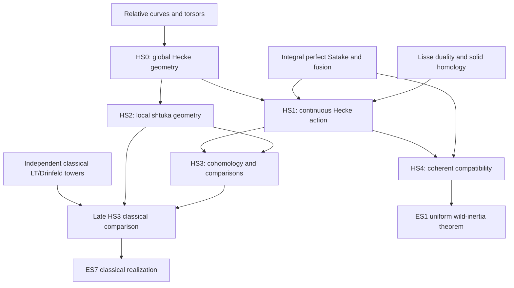

# Hecke correspondences on the Fargues–Fontaine curve and local shtuka cohomology

This roadmap constructs the global modification correspondences, the continuous integral Hecke action, local shtuka towers in both characteristics, and their representation-valued compact-support cohomology. “Global” refers to the relative Fargues–Fontaine curve. Function-field global shtukas are a different owner. The accepted RS-22 restructuring retains HS0–HS4; Satake, relative curves, v-stacks, enhanced sheaves, smooth representation categories and parameter stacks are imported from their owners.

The packet is a complete **target-level plan**: every stage is **planned**, none is closed, and every node has implementation status **unchecked**. Its 46 nodes comprise 14 constructions, 15 theorems, 14 comparisons, one lemma, one definition and one application. There are 47 API items, 46 prototype unit tests, 19 planets, 24 baseline declarations, 32 precise supplier requests and seven recorded gaps. This document is definitive; the [packet](../packets/HeckeStacksAndLocalShtukas.json) is its machine-readable form and the [suggested file](../suggested/HeckeStacksAndLocalShtukas.lean) records ordinary categorical/algebraic signatures and a named catalogue of geometric conditions that cannot yet be typed.

## Conventions and construction order

E is a nonarchimedean local field with residue field F_q of characteristic p; G/E is reductive; k is an algebraic closure of F_q and S belongs to Perf_k. Both characteristics of E are allowed unless a node explicitly says Q_p or E/Q_p finite.

Fix ℓ≠p, a Z_ℓ[r]-algebra Λ with r²=q, and a finite quotient Q of W_E through which the pinned action on the dual group factors. Finite-projective representations and perfect complexes are distinct carriers; integral statements impose no extra good-prime restriction.

For cocharacters, μ⁻¹ means the dominant conjugacy class of the inverse, not coordinatewise negation within a fixed dominant chamber. Berkeley’s modification points from the geometrically trivial bundle to E_b; the FS fibre points in the reverse direction. Thus μ_FS=μ_SW⁻¹ and b∈B(G,μ_SW⁻¹). The completed reflex field is written F̆; it is distinct from the base local field E. Closed bounds Gr_≤μ contain smaller relative positions; the exact Schubert cell Gr_μ^∘ has exact type μ.

The symbol ♮ denotes solid relative homology, the left adjoint to pullback. It is not a substitute notation for an unqualified lower-shriek. The coefficient S′_V is relative Verdier dual followed by solid dual. Relative duality and half-Tate normalization must remain in the cohomology comparisons. Weil equivariance is a map of condensed animated groups to the automorphism group of an object; an abstract action on an ordinary complex does not supply continuity.

The diagram expresses ownership and construction order; it does not edit the atlas. In particular, there is no ET.6a→HS2 requirement. The exact O_E-linear classical comparison consumes both independently constructed towers at the late HS3 boundary. IX.5.1’s uniform wild subgroup is an ES1 consequence of HS4’s action.

## Pinned substrate and supplier boundaries

Statements were read in the source trees at [Mathlib 082e2d37e8b0463410cdb532e111cd43d5a66174](https://github.com/leanprover-community/mathlib4/tree/082e2d37e8b0463410cdb532e111cd43d5a66174) and [Tau Ceti f790474821cf4256814db967cb154e7af3d0c369](https://github.com/TauCetiProject/TauCeti/tree/f790474821cf4256814db967cb154e7af3d0c369). Both source-tree heads matched those pins. The reviewed AUDIT-21 entries in `data/library-coverage.json` mark all five layers not built, with partial substrate. The smooth-discrete carrier already exists: its absence must not be inferred from the audit’s broader HS3 description. No baseline citation below claims an enhanced or geometric construction.

| Declaration and module | Precisely what it supplies |
| --- | --- |
| `mathlib:WittVector` `Mathlib/RingTheory/WittVector/Defs.lean` | Witt-vector carrier and operations. Ramified Witt vectors, the relative product Y_S and period rings are RF0 work; this is not a perfectoid-space construction. |
| `mathlib:WittVector.Isocrystal` `Mathlib/RingTheory/WittVector/Isocrystal.lean` | A module over the Witt fraction field with a Frobenius-semilinear automorphism. Finite dimension is an extra hypothesis. Neither G-structure, B(G), nor integral shtuka data is supplied. |
| `tauceti:TauCeti.AffineGroupSchemeCat` `TauCeti/AlgebraicGeometry/AffineGroupScheme/Basic.lean` | Category of affine group schemes over a base. It does not by itself impose a smooth connected integral model with reductive generic fibre. |
| `tauceti:TauCeti.ReductiveAffineGroupSchemeCat` `TauCeti/AlgebraicGeometry/AffineGroupScheme/Reductive.lean` | The full category of reductive affine group schemes over a field, including the finite-type condition. Relative torsors, pure inner twisting and local-field classifications still come from their owners. |
| `mathlib:Representation` `Mathlib/RepresentationTheory/Basic.lean` | An abstract monoid action by linear endomorphisms, as a monoid homomorphism. Rational algebraic representations of the integral dual group and smooth representations are different structures. |
| `mathlib:CategoryTheory.MonoidalCategory` `Mathlib/CategoryTheory/Monoidal/Category.lean` | Ordinary coherent tensor categories with associator and unitors. The enhanced stable tensor category and coherent finite-set family are supplied by E5/GS4. |
| `mathlib:CategoryTheory.Functor.Monoidal` `Mathlib/CategoryTheory/Monoidal/Functor.lean` | A monoidal functor is equipped with inverse lax/oplax constraints. Its tensor and unit comparisons are used in the ordinary categorical prototypes. |
| `mathlib:CategoryTheory.LeftRigidCategory` `Mathlib/CategoryTheory/Monoidal/Rigid/Basic.lean` | Specified left duals and exact pairings, with evaluation, coevaluation and both triangle equations. Mapping these equations supplies HS4’s formal triangle argument. |
| `mathlib:CategoryTheory.Adjunction` `Mathlib/CategoryTheory/Adjunction/Basic.lean` | Ordinary categorical unit, counit and both triangle equations. This supplies the form of biadjointness, not existence of relative homology on v-stacks. |
| `mathlib:CategoryTheory.Equivalence` `Mathlib/CategoryTheory/Equivalence.lean` | Ordinary categorical equivalence. It supplies comparison shape; it is not an étale-site or stable-category equivalence theorem. |
| `mathlib:CategoryTheory.Idempotents.Karoubi` `Mathlib/CategoryTheory/Idempotents/Karoubi.lean` | Ordinary idempotent completion. It does not include stable closure, perfect complexes or compact generation. |
| `mathlib:CategoryTheory.Sheaf` `Mathlib/CategoryTheory/Sites/Sheaf.lean` | The sheaf category on a Grothendieck site, as a full subcategory of presheaves. The v-site, stack and enhanced coefficient categories require their named suppliers. |
| `mathlib:DerivedCategory` `Mathlib/Algebra/Homology/DerivedCategory/Basic.lean` | Ordinary derived category of an abelian category. E5/SR own the enhanced stable versions used by the action and cohomology. |
| `mathlib:Condensed` `Mathlib/Condensed/Basic.lean` | Sheaves on the compact-Hausdorff site. Condensed anima and the enriched stable category are not supplied by this ordinary carrier. |
| `mathlib:CondensedMod` `Mathlib/Condensed/Module.lean` | Ordinary condensed module sheaves. Mapping complexes as condensed animated modules and relatively discrete enrichment still require VS/E5. |
| `mathlib:Profinite` `Mathlib/Topology/Category/Profinite/Basic.lean` | The category of profinite spaces. Extremally disconnected test objects are a restricted class, not all its objects. |
| `mathlib:CompHaus` `Mathlib/Topology/Category/CompHaus/Basic.lean` | The category of compact Hausdorff spaces, used to type the evaluation-presheaf prototype. |
| `tauceti:TauCeti.Huber.Pair` `TauCeti/RingTheory/Huber/Pair.lean` | Huber pair with a Huber topological ring and its plus subring. It is algebraic input to adic geometry, not a complete rigid or perfectoid space. |
| `tauceti:TauCeti.ValuationSpectrum.spa` `TauCeti/AlgebraicGeometry/AdicSpace/Spa/Basic.lean` | Set of continuous valuations bounded by the plus ring of a Huber pair. This set alone has no adic structure sheaf, diamondification or geometric morphism API. |
| `tauceti:TauCeti.IsSmoothDiscrete` `TauCeti/RepresentationTheory/Homological/ContCohomology/SmoothDiscrete.lean` | Open stabilizers for a TopRep whose underlying topology is discrete. This corrects the audit’s blanket absence claim, but supplies neither derived smooth categories nor compact induction. |
| `tauceti:TauCeti.SmoothDiscreteTopRep` `TauCeti/RepresentationTheory/Homological/ContCohomology/SmoothDiscrete.lean` | Full subcategory of discrete smooth topological representations. It is existing carrier work; SR adds abelian/derived/admissibility and induction interfaces. |
| `mathlib:Subgroup` `Mathlib/Algebra/Group/Subgroup/Defs.lean` | Subgroup carrier; compactness and openness are additional topological hypotheses, omitted in the algebraic level prototype. |
| `mathlib:Subgroup.quotientMapOfLE` `Mathlib/GroupTheory/Coset/Basic.lean` | For K′≤K, the canonical map G/K′→G/K of coset sets, without a normality assumption. This is the trivialized level-transition prototype. |
| `mathlib:CategoryTheory.ExactPairing` `Mathlib/CategoryTheory/Monoidal/Rigid/Basic.lean` | Evaluation/coevaluation with two explicitly stated snake equations. Used directly rather than replanning rigidity. |

The AdicSpaces and ReductiveGroups upstream roadmaps were read for their construction order and boundaries. AdicSpacesPartII supplies the additional classical geometry; group schemes and root data are existing substrate. Tau Ceti’s local Weil layer is imported unchanged. Exact supplier node identifiers below refer to statements read in their packets or integrated decompositions. A coarse stage prerequisite has an explicit request in the supplier list, rather than being treated as a proof.

## HS0. Global and local Hecke stacks

Construct the relative modification groupoid and its two bundle maps, chains and twisted period data. Keep this geometric layer independent of ULA and lisse sheaves. Bounded Grassmannians, loops and convolution are GS0/GS3 imports; their properness applies to the specified relative period morphisms.

**Coverage: planned.** Target-level plan: 5 nodes. Statements, hypotheses, proof routes and supplier requests cover the retained stage; refinements prevent closed status.

**Planets:** Hecke correspondence; Chains of modifications; Twisted period Grassmannian.

**Remaining refinements:** Supplier refinements for general-E Cartier/Frobenius divisors and the local bounded/ad-isomorphism comparison; Lean omits geometric meromorphy/bounds and v-descent.

### `HeckeStacksAndLocalShtukas:HS0/global-hecke-correspondence` — Hecke correspondence on the relative curve

**Construction.** For finite I, Hck^I_G(S) is the groupoid of legs D_i∈Div¹(S), G-bundles E_1,E_2 on X_S and a meromorphic isomorphism α:E_1|_{X_S−∪D_i}≅E_2|_{X_S−∪D_i}. Morphisms are pairs of bundle isomorphisms commuting with α. Define p_1(E_1,E_2,α)=E_1 and p_2(E_1,E_2,α)=(E_2,(D_i)); repeat legs along Δ_a for a:I→J. Use the supplier’s Tannakian meromorphy condition on all representations, not merely an arbitrary isomorphism of sheaves on the complement.

**Construction or proof.**

1. Import RF4’s meromorphic G-modification, including twisting by kD in every representation.
2. Assemble its groupoids over Perf and use torsor/divisor pullback to define p_1,p_2 and Δ_a.
3. Compare the formal-completion data with the local Hecke stack using RF4’s Tannakian gluing; do not construct loops again.

**Direct prerequisites:** `RelativeFarguesFontaine:RF4:G-torsors/meromorphic-G-modification`, `RelativeFarguesFontaine:RF4:G-torsors/tannakian-transfer-of-gluing`, `RelativeFarguesFontaine:RF2:integral-divisors`, `RelativeFarguesFontaine:RF2:untilts`, `BunGAndNewtonStrata:BG2:uniformization`, `GeometricSatakeAndFusion:GS0:loop-geometry/loop-groups-and-local-hecke`.

**Planning API.**

| Name | Role | Statement |
| --- | --- | --- |
| `HckI` | data | The groupoid of meromorphic modifications with leg data; the Lean prototype retains the underlying restriction-isomorphism data and records the omitted meromorphy interface. |
| `HckI.p1` | projection | Source bundle. |
| `HckI.p2` | projection | Target bundle together with legs. |
| `HckI.repeat` | functoriality | Pullback along Δ_a repeats leg i as the divisor indexed by a(i). |

**Uses motivating the API.**

- In `HeckeStacksAndLocalShtukas:HS1/hecke-operator-via-relative-homology`: The pullback/tensor/homology formula uses these projections.
- In `HeckeStacksAndLocalShtukas:HS2/framed-bundle-fibres`: Retaining both framings produces the space of modifications between two fixed bundles.

**Prototype unit tests.** These type the ordinary supplied interfaces. The geometric acceptance tests below are separate obligations.

- `HckI.identity_test` (degenerate): At fixed legs, (E,E,id) has source and target E.
- `HckI.empty_test` (degenerate): With no legs the restriction functor is the identity, so the modification is a global bundle isomorphism.
- `HckI.repeat_test` (computation): For a:Fin 2→Fin 1, the repeated leg tuple has both entries equal to its sole divisor.

**Acceptance.**

- Identity modification at fixed legs lies in weight zero.
- For G_m, twisting a line bundle by D has relative position one in the chosen orientation.
- For I=∅ the groupoid of globally isomorphic pairs is equivalent to Bun_G.

**Source passages.** The short literal anchors below locate the argument; the statement and proof above specify the hypotheses it supplies.

- [Laurent Fargues; Peter Scholze, Geometrization of the local Langlands correspondence](https://people.mpim-bonn.mpg.de/scholze/Geometrization.pdf), **III.3 p.97**: “that is meromorphic along D.” The restriction isomorphism must satisfy meromorphy.
- [Laurent Fargues; Peter Scholze, Geometrization of the local Langlands correspondence](https://people.mpim-bonn.mpg.de/scholze/Geometrization.pdf), **IX introduction p.317**: “Using the correspondence” The two projections used by the action.

### `HeckeStacksAndLocalShtukas:HS0/descent-and-bounded-fibres` — Descent and bounded relative Grassmannian fibres

**Theorem.** Hck^I_G satisfies v-descent. Bounds are pulled back from GS0’s local Schubert unions, with at a repeated divisor the combined dominant bound. After trivializing the fixed bundle formally at the divisors, the relative modification functor is the corresponding bounded Grassmannian, with its change-of-trivialization L⁺G-action. This is a relative identification over a v-cover, descended with its torsor, rather than an inference from geometric fibres. Import bounded properness, spatial representability and finite dim.trg from GS0:Witt-geometry; apply each only to the corresponding relative map. Stack quotients are not assigned these properties without a separate descent argument.

**Construction or proof.**

1. Descend bundles, isomorphisms and formal lattices via RF4.
2. Use the formal trivialization torsor to identify the relative functor with the bounded local Grassmannian.
3. Descend the relative comparison and invoke the exact bounded properness statement; record which morphism each operation uses.

**Direct prerequisites:** `HeckeStacksAndLocalShtukas:HS0/global-hecke-correspondence`, `RelativeFarguesFontaine:RF4:G-torsors/v-descent-and-local-triviality`, `RelativeFarguesFontaine:RF4:G-torsors/modification-of-G-bundle-by-lattice`, `GeometricSatakeAndFusion:GS0:Witt-geometry`, `DiamondsAndVStacks:D5/relative-representability`.

**Acceptance.**

- For G_m the fixed-weight relative Grassmannian is a point over the divisor base.
- For G=1 all bounded fibres are the base.
- Check the formal-trivialization transition action, not only geometric points.

**Source passages.** The short literal anchors below locate the argument; the statement and proof above specify the hypotheses it supplies.

- [Laurent Fargues; Peter Scholze, Geometrization of the local Langlands correspondence](https://people.mpim-bonn.mpg.de/scholze/Geometrization.pdf), **III.3 pp.97–98**: “Beauville–Laszlo gluing then identifies” The formal lattice comparison.
- [Peter Scholze; Jared Weinstein, Berkeley Lectures on p-adic Geometry](https://people.mpim-bonn.mpg.de/scholze/Berkeley.pdf), **19.5.3 pp.180–181**: “Proposition 19.5.3.” v-descent for bundles used in the local moduli.

### `HeckeStacksAndLocalShtukas:HS0/chains-and-composition` — Chains of meromorphic modifications

**Construction.** For an ordered partition I=I_1⊔…⊔I_m, form the iterated fibre product of Hecke correspondences classifying E_0→…→E_m with the jth modification at I_j. Composition is the composed isomorphism on the common complement, with additive meromorphy bounds. On disjoint divisors this identifies with the factorized local Grassmannian diagram; on the repeated-leg diagonal it is the convolution diagram. The chain retains intermediate bundles, so composition need not be an isomorphism at a collision.

**Construction or proof.**

1. Take the fibre products over the target/source bundle maps.
2. Compose restriction isomorphisms; additive pole orders give meromorphy.
3. Use RF4 formal gluing and GS3’s disjoint/collision diagrams to identify, without replanning fusion.

**Direct prerequisites:** `HeckeStacksAndLocalShtukas:HS0/global-hecke-correspondence`, `RelativeFarguesFontaine:RF4:G-torsors/base-change-and-divisor-compatibility`, `GeometricSatakeAndFusion:GS0:loop-geometry/loop-groups-and-local-hecke`.

**Planning API.**

| Name | Role | Statement |
| --- | --- | --- |
| `ModificationChain` | data | Objects and restriction isomorphisms of a finite composable chain. |
| `ModificationChain.compose` | constructor | Endpoint modification by composition on the common complement. |
| `ModificationChain.assoc` | relation | The two parenthesizations of three restriction isomorphisms agree. |

**Uses motivating the API.**

- In `HeckeStacksAndLocalShtukas:HS4/monoidal-and-finite-set-functoriality`: Geometric chain composition supplies action/fusion comparisons.
- In `HeckeStacksAndLocalShtukas:HS0/twisted-period-grassmannian`: Frobenius collisions require chain data.

**Prototype unit tests.** These type the ordinary supplied interfaces. The geometric acceptance tests below are separate obligations.

- `ModificationChain.identity_test` (degenerate): The length-zero endpoint isomorphism is id.
- `ModificationChain.two_test` (computation): A length-two chain composes α then β to α.trans β.
- `ModificationChain.three_test` (compatibility): Composing a triple on the left or right gives the same isomorphism.

**Acceptance.**

- Compose the identity chain.
- Associativity is the canonical comparison of triple chains.
- For torus weights a,b at one divisor composition has weight a+b.

**Source passages.** The short literal anchors below locate the argument; the statement and proof above specify the hypotheses it supplies.

- [Peter Scholze; Jared Weinstein, Berkeley Lectures on p-adic Geometry](https://people.mpim-bonn.mpg.de/scholze/Berkeley.pdf), **23.4 pp.221–222**: “Definition 23.4.1.” Intermediate modifications are necessary when legs meet Frobenius translates.

### `HeckeStacksAndLocalShtukas:HS0/twisted-period-grassmannian` — Twisted multi-leg period Grassmannian

**Construction.** For the Berkeley mixed-characteristic datum, Gr^tw_{G,∏Spd E_i,≤μ•} parametrizes a G-torsor P_η on S×̇Spa Q_p, a meromorphic Frobenius isomorphism off the untilt divisors, and a framing near infinity identifying it with b·Frob; its functor is canonically independent of b. For two legs, glue the ordinary Beilinson–Drinfeld space off all nonzero Frobenius translates of the diagonal to pulled-back convolution spaces around those translates (switching for negative translates). For many legs use finite Frobenius-orbit truncations. Coincident untilts use Σμ_j; Frobenius-collision chains retain intermediate bundles. Define the bounds through GS0’s Schubert unions. The bounded map to ∏Spd E_i is proper and spatial, by 23.5.2.

**Additional hypotheses.**

- This source proves Q_p geometry. General E in both characteristics is handled in HS2/general-local-field; it is not inferred by renaming Witt vectors.

**Construction or proof.**

1. Use 23.4’s explicit positive/negative Frobenius patches and GS0’s convolution object.
2. For 23.5 choose n₀ bounding possible Frobenius coincidences on a qc test base, write the finite modification chain, and embed the bounded functor as a closed subspace of a proper convolution space.
3. The framing-independent comparison is obtained by extending along Frobenius near infinity; the general-E extension is a separate HS2 target.

**Direct prerequisites:** `HeckeStacksAndLocalShtukas:HS0/chains-and-composition`, `GeometricSatakeAndFusion:GS0:Witt-geometry`, `RelativeFarguesFontaine:RF2:untilts`, `RelativeFarguesFontaine:RF4:G-torsors/tannakian-transfer-of-gluing`.

**Planning API.**

| Name | Role | Statement |
| --- | --- | --- |
| `TwistedPeriodData` | data | Generic Frobenius modification and ordered collision chains; the prototype is its restriction-isomorphism data. |
| `TwistedPeriodData.frobenius` | projection | The isomorphism Frob*P_η≅P_η on the complement. |
| `TwistedPeriodData.collision` | projection | Intermediate chain retained at a Frobenius collision. |

**Uses motivating the API.**

- In `HeckeStacksAndLocalShtukas:HS2/multi-leg-period-and-representability`: The level shtuka is a lattice cover of the admissible locus.
- In `HeckeStacksAndLocalShtukas:HS3/satake-coefficients-and-partial-frobenius`: The Satake sheaf must extend over the twisted diagonals.

**Prototype unit tests.** These type the ordinary supplied interfaces. The geometric acceptance tests below are separate obligations.

- `TwistedPeriodData.one_test` (degenerate): The one-step chain composes to its single modification.
- `TwistedPeriodData.zero_test` (degenerate): A zero-step chain contributes the identity isomorphism.
- `TwistedPeriodData.collision_test` (characterisation): A two-step chain has composite equal to α.trans β, retaining the middle object separately.

**Acceptance.**

- One leg recovers ordinary Gr.
- Two separated Frobenius orbits recover BD factorization.
- A positive Frobenius collision uses the indicated pulled-back convolution patch.

**Source passages.** The short literal anchors below locate the argument; the statement and proof above specify the hypotheses it supplies.

- [Peter Scholze; Jared Weinstein, Berkeley Lectures on p-adic Geometry](https://people.mpim-bonn.mpg.de/scholze/Berkeley.pdf), **23.4.1–23.5.2 pp.221–223**: “Definition 23.5.1.” The generic Frobenius-torsor period moduli and its bounded properness proof.

### `HeckeStacksAndLocalShtukas:HS0/structure-group-and-inner-form` — Structure group, central grading and basic inner forms

**Comparison.** Extension of structure group f:G→H sends (E_1,E_2,α) to (f_*E_1,f_*E_2,f_*α), commuting with p_1,p_2, legs and chains, whenever f sends the chosen bound to the H-bound. For a basic c∈B(G), the pure-inner-twisting equivalence Bun_G≃Bun_{G_c} transports both bundles, their modifications and the corresponding bounds. On a geometric fibre the Kottwitz difference of a modification is μ^natural, with sign changed on reversing α; this fixes the central/component grading. Algebraic central characters are imported with structure-group extension, not defined from excursion eigenvalues.

**Construction or proof.**

1. Apply RF4’s structure-group functor to all data.
2. Use BG0’s pure inner twisting for basic c, compatible with restriction to the complement.
3. Compute the component difference via the formal lattice and GS0’s component grading.

**Direct prerequisites:** `HeckeStacksAndLocalShtukas:HS0/global-hecke-correspondence`, `RelativeFarguesFontaine:RF4:G-torsors/change-of-structure-group`, `BunGAndNewtonStrata:BG0/pure-inner-twisting`, `BunGAndNewtonStrata:BG1/newton-and-kottwitz-maps`.

**Acceptance.**

- Identity f fixes the correspondence.
- GL_1 modifications have degree change μ.
- Reverse a torus modification and check degree −μ.

**Source passages.** The short literal anchors below locate the argument; the statement and proof above specify the hypotheses it supplies.

- [Laurent Fargues; Peter Scholze, Geometrization of the local Langlands correspondence](https://people.mpim-bonn.mpg.de/scholze/Geometrization.pdf), **III.4.2–III.4.3 p.101**: “For b basic there is an isomorphism of v-stacks” Basic twisting transports bundles; the same equivalence transports their modification data.

## HS1. Kernels and the coherent Hecke action

Globalize GS4’s integral perfect Satake kernel, apply solid relative homology, and prove lisse preservation, biadjointness, ULA preservation, duality and continuous Weil descent. VS5 must supply the lisse VII.7 statements, and LP3/LP4 must supply the all-prime integral representation extension. The inherited Demazure node keeps its identifier but belongs to this layer.

**Coverage: planned.** Target-level plan: 9 nodes. Statements, hypotheses, proof routes and supplier requests cover the retained stage; refinements prevent closed status.

**Planets:** Solid Satake kernel; Hecke operator; Compact Hecke action; Condensed lisse enrichment; Continuous Weil descent.

**Remaining refinements:** VS1 Drinfeld and VII.4–5/VII.7 lisse refinements; LP3/LP4 integral all-prime perfect extension. Lean omits enhanced/ULA/compact/condensed-anima conditions.

### `HeckeStacksAndLocalShtukas:HS1/satake-kernel-and-solid-monoidal-functor` — Global solid Satake kernel

**Construction.** Import GS4’s normalized integral Satake equivalence and enhanced-perfect extension. Pull its local kernel S′_V=D_rel(S_V)^∨ to the global Hecke correspondence of HS0; D_rel is relative to Hck→[(Div¹)^I/L⁺G], and ∨ is the solid Λ-dual. Extend coefficients using Perf(B((Ĝ⋊Q)^I)_{Z_ℓ[r]})⊗_{Perf(BQ^I_{Z_ℓ[r]})}Perf(BQ^I_Λ)≃Perf(B((Ĝ⋊Q)^I)_Λ). This is coefficient extension preserving Q-equivariance, not removal of that equivariance. This supplies the actual Λ-linear global convolution kernel, coherent in I. Highest-weight/base-change and stable-completion arguments are owned by LP3/LP4 through GS4; the action applies them with all ℓ≠p, including primes dividing dual fundamental-group order.

**Additional hypotheses.**

- The coefficient convention above applies.

**Construction or proof.**

1. Use GS4’s enhanced-perfect-satake-extension rather than rebuild Satake.
2. Use RF4’s gluing comparison to pull the local kernel to the global stack.
3. Apply LP4’s relative perfect tensor-product universal property and VS2’s solid duality, retaining relative Verdier normalization.

**Direct prerequisites:** `HeckeStacksAndLocalShtukas:HS0/global-hecke-correspondence`, `GeometricSatakeAndFusion:GS4:integral-dual-group/enhanced-perfect-satake-extension`, `VStackSheavesAndLisseCategories:VS2/solid-sheaves-on-v-stacks`, `LanglandsParameterStacks:LP3`, `LanglandsParameterStacks:LP4`, `EnhancedDerivedSheaves:E5:abstract`.

**Planning API.**

| Name | Role | Statement |
| --- | --- | --- |
| `globalKernel` | constructor | Pull the imported local solid kernel to the global correspondence. |
| `globalKernel.map` | functoriality | Representation morphisms induce kernel morphisms. |
| `globalKernel.tensor` | compatibility | Tensor product corresponds to global convolution under the supplied monoidal kernel functor. |

**Uses motivating the API.**

- In `HeckeStacksAndLocalShtukas:HS1/hecke-operator-via-relative-homology`: This is the tensor factor in T_V.
- In `HeckeStacksAndLocalShtukas:HS3/satake-coefficients-and-partial-frobenius`: Relative dual normalization controls compact support.

**Prototype unit tests.** These type the ordinary supplied interfaces. The geometric acceptance tests below are separate obligations.

- `globalKernel.identity_test` (degenerate): Under the imported strong monoidal structure, the tensor-unit representation maps isomorphically to the identity convolution kernel.
- `globalKernel.map_id_test` (compatibility): Pullback sends the identity of a kernel to its identity.
- `globalKernel.map_comp_test` (compatibility): Pullback sends a composite of kernel morphisms to the composite of their pullbacks.

**Acceptance.**

- Kernel of tensor unit is the identity convolution kernel.
- Base change Λ→Λ′ intertwines kernels and tensor constraints.
- At a geometric splitting fibre the finite Q-action is forgotten while the dual group remains.

**Source passages.** The short literal anchors below locate the argument; the statement and proof above specify the hypotheses it supplies.

- [Laurent Fargues; Peter Scholze, Geometrization of the local Langlands correspondence](https://people.mpim-bonn.mpg.de/scholze/Geometrization.pdf), **IX.2 p.321**: “We can compose with the functor A 7→ D(A)∨ (where the Verdier duality is relative to the projection HckIG → [(Div1 )I /L+ G])” Relative Verdier dual followed by solid dual, then perfect extension and relative coefficient change on this page.

### `HeckeStacksAndLocalShtukas:HS1/hecke-operator-via-relative-homology` — Hecke action by relative homology

**Construction.** Define T_V(A)=p_{2♮}(p_1* A⊗^L,solid_Λ S′_V). Here p_{2♮} is the left adjoint to p_2* in the enhanced solid category. At a diagonal geometric leg point over a completed algebraic closure of E the functor depends on V|Ĝ^I and acts on D_lis(Bun_G,Λ). Its lisse restriction is proved separately using the Demazure-kernel node. For torsion coefficients and a bounded-Tor-amplitude ULA Satake coefficient, VII.5.2 identifies the formula with the usual compact-support kernel action on representable local models.

**Additional hypotheses.**

- The coefficient convention above applies.

**Construction or proof.**

1. Compose pullback, tensoring with the solid kernel and relative homology in their enhanced categories.
2. Use VII.5.2 with its compactifiable/locally spatial/finite-dimension and ULA hypotheses on the local models.
3. Use the monoidal action comparison for tensor unit, composition and coefficient change.

**Direct prerequisites:** `HeckeStacksAndLocalShtukas:HS1/satake-kernel-and-solid-monoidal-functor`, `VStackSheavesAndLisseCategories:VS2/solid-sheaves-on-v-stacks`, `VStackSheavesAndLisseCategories:VS3/lisse-category-definition`, `mathlib:CategoryTheory.Adjunction`, `mathlib:CategoryTheory.MonoidalCategory`.

**Planning API.**

| Name | Role | Statement |
| --- | --- | --- |
| `heckeOperator` | constructor | Functor p_1* followed by tensor with S′_V and p_{2♮}. |
| `heckeOperator.obj` | simp | Object formula p_{2♮}(p_1*A⊗S′_V). |
| `heckeOperator.map` | functoriality | Map formula obtained by pullback, tensoring and relative homology. |

**Uses motivating the API.**

- In `HeckeStacksAndLocalShtukas:HS3/hecke-cohomology-comparison`: Fibre/base-change reads the action as shtuka cohomology.
- In `HeckeStacksAndLocalShtukas:HS4/monoidal-and-finite-set-functoriality`: This functor is assembled over finite leg sets.

**Prototype unit tests.** These type the ordinary supplied interfaces. The geometric acceptance tests below are separate obligations.

- `heckeOperator.obj_test` (characterisation): The object formula is p_{2♮}(p_1*A⊗S′_V).
- `heckeOperator.map_id_test` (compatibility): The image of id_A is id_{T_V(A)}.
- `heckeOperator.map_comp_test` (compatibility): The image of f≫g is T_V(f)≫T_V(g).
- `heckeOperator.unit_test` (degenerate): With identity pullback and homology functors, tensoring by the actual tensor unit gives the identity functor, by the baseline right unitor.

**Acceptance.**

- The unit representation acts as id.
- T_{V⊗W}≃T_V∘T_W with the specified convolution order.
- An ordinary unnormalized lower-shriek formula does not give the VII.5.2 comparison.

**Source passages.** The short literal anchors below locate the argument; the statement and proof above specify the hypotheses it supplies.

- [Laurent Fargues; Peter Scholze, Geometrization of the local Langlands correspondence](https://people.mpim-bonn.mpg.de/scholze/Geometrization.pdf), **IX.2 p.322**: “Note that we have thus essentially used the translation of Proposition VII.5.2 to extend the Hecke operators from the case of torsion rings Λ to all Λ.” Solid relative homology implements the coefficient extension.

### `HeckeStacksAndLocalShtukas:HS0/demazure-generators-of-ULA-kernels` — Demazure kernels and preservation of lisse sheaves

**Lemma.** After pullback to a diagonal geometric leg point, T_V preserves D_lis. Reduce by integral highest-weight generation and monoidality to one leg and kernels B ULA on the affine Grassmannian. The ULA category is generated by pushforwards of constant sheaves along affine-flag Demazure resolutions modulo an Iwahori. Import this generation/resolution package from GS1. VII.4.3 identifies proper pushforward followed by solid dual with relative homology of the dual; the Demazure Hecke correspondence is proper and cohomologically smooth over both bundle factors. This puts its action in the generators of D_lis.

**Additional hypotheses.**

- The coefficient convention above applies.

**Construction or proof.**

1. Apply LP3/GS4 integral generation to reduce the representation.
2. Apply GS1 ULA Demazure generation, explicitly in the affine flag variety.
3. Invoke VII.4.3 with properness, spatial representability and finite dim.trg, then VS3’s smooth generators.

**Direct prerequisites:** `HeckeStacksAndLocalShtukas:HS1/hecke-operator-via-relative-homology`, `GeometricSatakeAndFusion:GS1`, `VStackSheavesAndLisseCategories:VS2`, `VStackSheavesAndLisseCategories:VS3/lisse-category-definition`, `LanglandsParameterStacks:LP3`.

**Acceptance.**

- Unit and torus kernels preserve lisse objects.
- A PGL_2 minuscule resolution has the required two-factor smoothness.
- The node depends on GS1/VS2 and is in HS1, not bare HS0.

**Source passages.** The short literal anchors below locate the argument; the statement and proof above specify the hypotheses it supplies.

- [Laurent Fargues; Peter Scholze, Geometrization of the local Langlands correspondence](https://people.mpim-bonn.mpg.de/scholze/Geometrization.pdf), **IX.2.1 proof p.322**: “Now the category of such B is generated (under colimits)” Generation by Demazure pushforwards in the following passage.
- [Laurent Fargues; Peter Scholze, Geometrization of the local Langlands correspondence](https://people.mpim-bonn.mpg.de/scholze/Geometrization.pdf), **VII.4.3 p.263**: “Let f : Y → X be a proper map of small v-stacks” Exact proper-pushforward/solid-dual input.

### `HeckeStacksAndLocalShtukas:HS1/properties-and-weil-equivariance` — Adjoints and compactness of Hecke operators

**Theorem.** At a diagonal geometric leg point, V finite projective and dualizable gives T_{V∨}⊣T_V⊣T_{V∨}; the adjunction units/counits are images of representation coevaluation/evaluation. Therefore T_V preserves all limits and colimits and compact objects of D_lis. Tensor-unit and tensor-composition constraints are inherited from the enhanced monoidal kernel action. The continuous Weil-equivariant lift is proved in the separate descent node.

**Additional hypotheses.**

- The coefficient convention above applies.

**Construction or proof.**

1. Apply the monoidal action to both rigidity triangles.
2. Both adjoints preserve colimits, so compact objects are preserved; the two adjunctions give all limit/colimit preservation.
3. Use the enhanced functor rather than a choice of derived-category triangulated action.

**Direct prerequisites:** `HeckeStacksAndLocalShtukas:HS0/demazure-generators-of-ULA-kernels`, `GeometricSatakeAndFusion:GS3:fusion/fusion-verdier-duality`, `mathlib:CategoryTheory.LeftRigidCategory`, `mathlib:CategoryTheory.Adjunction`, `EnhancedDerivedSheaves:E5:abstract`.

**Acceptance.**

- For V=1 both adjunctions are the identity adjunction.
- Apply T_V to j_!c-Ind_K Λ for pro-p K.
- Keep dual V∨ separate from the Chevalley/sw* operation.

**Source passages.** The short literal anchors below locate the argument; the statement and proof above specify the hypotheses it supplies.

- [Laurent Fargues; Peter Scholze, Geometrization of the local Langlands correspondence](https://people.mpim-bonn.mpg.de/scholze/Geometrization.pdf), **IX.2.2 proof pp.322–323**: “As V is dualizable in the Satake category” The two adjoints and preservation argument.

### `HeckeStacksAndLocalShtukas:HS1/ula-preservation` — Hecke preservation of lisse ULA objects

**Theorem.** If A∈D_lis(Bun_G,Λ) is ULA then T_V A is ULA. Use the lisse VII.7.9 criterion: RHom(B,A) is a perfect Λ-complex for every compact B, equivalently the stratumwise perfect pro-p invariants criterion. RHom(B,T_V A)≃RHom(T_{V∨} B,A), and T_{V∨} B is compact. The torsion D_et theorem V.7.1 alone does not establish this integral lisse statement.

**Additional hypotheses.**

- The coefficient convention above applies.

**Construction or proof.**

1. Import VII.7.8–.10 from VS5, including exterior-product compact generation.
2. Apply adjunction and the preceding compactness theorem.
3. Test perfectness against every compact B and apply the reverse criterion.

**Direct prerequisites:** `HeckeStacksAndLocalShtukas:HS1/properties-and-weil-equivariance`, `VStackSheavesAndLisseCategories:VS5`, `VStackSheavesAndLisseCategories:VS4/compact-generation-and-compact-objects`.

**Acceptance.**

- On a basic torus stratum this is the perfect K-invariant criterion.
- ULA is not replaced by finite Λ-generation of every total cohomology group.

**Source passages.** The short literal anchors below locate the argument; the statement and proof above specify the hypotheses it supplies.

- [Laurent Fargues; Peter Scholze, Geometrization of the local Langlands correspondence](https://people.mpim-bonn.mpg.de/scholze/Geometrization.pdf), **VII.7.9 p.275**: “the pullback” Pro-p derived-invariant criterion in this proposition.
- [Laurent Fargues; Peter Scholze, Geometrization of the local Langlands correspondence](https://people.mpim-bonn.mpg.de/scholze/Geometrization.pdf), **IX.2.2 proof p.323**: “is universally locally acyclic if and only if” The Hom-against-compacts argument.

### `HeckeStacksAndLocalShtukas:HS1/duality-exchange` — Hecke exchange with BZ and lisse duality

**Theorem.** For compact A, D_BZ(T_V A)≃T_{sw*V∨}(D_BZ A); for lisse objects the analogous RHom_lis(−,Λ) exchange holds in the source’s range. These follow from π♮(T_V A⊗B)≃π♮(A⊗T_{sw*V}B). Here sw* is the GS4 Chevalley involution with inner correction; it is not just representation duality. The compact BZ autoequivalence is VII.7.6, distinct from its torsion V.5.1 version.

**Additional hypotheses.**

- The coefficient convention above applies.

**Construction or proof.**

1. Identify both homology pairings with the same Hecke correspondence, swapping projections.
2. Use GS4’s sw* comparison of kernels.
3. Use lisse BZ representability and left/right adjunction respectively for the two dualities.

**Direct prerequisites:** `HeckeStacksAndLocalShtukas:HS1/properties-and-weil-equivariance`, `GeometricSatakeAndFusion:GS4:integral-dual-group/chevalley-involution`, `VStackSheavesAndLisseCategories:VS5`, `VStackSheavesAndLisseCategories:VS2/solid-sheaves-on-v-stacks`.

**Acceptance.**

- Unit kernel commutes with both dualities.
- Check a torus character and its inverse, retaining sw*.
- Do not extend compact BZ to all objects by an unstated autoequivalence.

**Source passages.** The short literal anchors below locate the argument; the statement and proof above specify the hypotheses it supplies.

- [Laurent Fargues; Peter Scholze, Geometrization of the local Langlands correspondence](https://people.mpim-bonn.mpg.de/scholze/Geometrization.pdf), **VII.7.6 pp.274–275**: “Moreover, the functor DBZ is a contravariant autoequivalence” The lisse compact BZ involution.
- [Laurent Fargues; Peter Scholze, Geometrization of the local Langlands correspondence](https://people.mpim-bonn.mpg.de/scholze/Geometrization.pdf), **IX.2.2 pp.322–323**: “For the duality statements, we note that” The Hecke pairing proof.

### `HeckeStacksAndLocalShtukas:HS1/condensed-enrichment` — Condensed enrichment of the lisse action

**Construction.** Evaluate D_lis(Bun_G,Λ) on extremally disconnected profinite S by D_lis(Bun_G×S,Λ), as a full subcategory of the hypersheaf S↦D_solid(Bun_G×S,Λ). Descent identifies D_solid(Bun_G×[*/W_E^I],Λ) with condensed W_E^I-equivariant objects, objects equipped with a map of condensed animated groups W_E^I→Aut(A). Enrichment in condensed anima suffices; the full condensed ∞-category need not be specified separately. On compact source objects the Hom-complex enrichment is relatively discrete and is determined by its Λ-linear enhancement (IX.1.2). Ordinary condensed modules supply only the coefficient carrier, not mapping anima or the stable enhancement.

**Additional hypotheses.**

- The coefficient convention above applies.

**Construction or proof.**

1. Use VS2 v-hyperdescent and the E5 enhancement to form the evaluation categories.
2. Apply the bar/torsor descent diagram for the condensed group W_E^I.
3. Use f_K♮ compact generators, VII.7.2 and VII.2.10; for pro-p K, K-invariants are a summand of the stalk, giving IX.1.2 relative discreteness.

**Direct prerequisites:** `VStackSheavesAndLisseCategories:VS2/solid-sheaves-on-v-stacks`, `VStackSheavesAndLisseCategories:VS3/lisse-category-definition`, `VStackSheavesAndLisseCategories:VS4/compact-generation-and-compact-objects`, `VStackSheavesAndLisseCategories:VS5`, `EnhancedDerivedSheaves:E5:abstract`, `tauceti:TauCetiRoadmap/ClassFieldTheory#layer-9-the-local-weil-group`, `mathlib:Condensed`, `mathlib:CondensedMod`.

**Planning API.**

| Name | Role | Statement |
| --- | --- | --- |
| `condensedStructure` | data | Evaluation S↦D_lis(Bun_G×S); prototype uses a supplied evaluation functor on CompHaus. |
| `condensedStructure.pullback` | functoriality | Pullback along S′→S in the supplied evaluation presheaf. |
| `condensedStructure.coefficients` | coercion | Condensed Λ-module of a supplied mapping complex degree; animated structure is an explicit omitted interface. |

**Uses motivating the API.**

- In `HeckeStacksAndLocalShtukas:HS1/continuous-weil-descent`: Defines the continuous equivariant target.
- In `HeckeStacksAndLocalShtukas:HS4/continuous-tensor-generator-export`: Exports the enrichment to ES.

**Prototype unit tests.** These type the ordinary supplied interfaces. The geometric acceptance tests below are separate obligations.

- `condensedStructure.identity_test` (compatibility): Evaluation pullback along id is identity.
- `condensedStructure.composition_test` (compatibility): Pullback along a composite is the composition in the opposite order.
- `condensedStructure.point_test` (degenerate): Evaluating at the one-point CompHaus object gives the supplied point evaluation.

**Acceptance.**

- At S=* recover the original category.
- Descent on a disjoint union has the corresponding product of evaluation categories.
- The induced action on a relatively discrete finite-rank coefficient module is classically continuous.

**Source passages.** The short literal anchors below locate the argument; the statement and proof above specify the hypotheses it supplies.

- [Laurent Fargues; Peter Scholze, Geometrization of the local Langlands correspondence](https://people.mpim-bonn.mpg.de/scholze/Geometrization.pdf), **IX.1 pp.320–321**: “This is in fact easy to do:” The extremally disconnected evaluation and hypersheaf construction.
- [Laurent Fargues; Peter Scholze, Geometrization of the local Langlands correspondence](https://people.mpim-bonn.mpg.de/scholze/Geometrization.pdf), **IX.1 p.320**: “we do not need to know the full structure as a condensed” The exact continuous-action carrier.

### `HeckeStacksAndLocalShtukas:HS1/continuous-weil-descent` — Continuous Weil descent of Hecke kernels

**Theorem.** Pullback from Bun_G×[*/W_E^I] to Bun_G×(Div¹)^I is fully faithful in the solid/lisse setting of IX.1.1, with image characterized by lisse geometric pullback. T_V takes values in this image (IX.2.3), hence yields a condensed continuous W_E^I-action. Reduce to one leg using a possibly infinite resolution by exterior tensor products involving finitely many weights, use VII.2.7, IX.2.1 and VII.7.3. Drinfeld IV.7 gives full faithfulness for all torsion étale objects; essential surjectivity of IV.7.3 is for locally constant perfect objects, not all étale sheaves.

**Additional hypotheses.**

- The coefficient convention above applies.

**Construction or proof.**

1. Import IV.7 from VS1 and the solid lifting/base-extension statements from VS2/VS4.
2. Prove the lisse-image condition of IX.1.1 for the actual global Hecke kernel.
3. Use descent uniqueness to transport tensor and finite-set comparisons to continuous equivariance.

**Direct prerequisites:** `HeckeStacksAndLocalShtukas:HS1/condensed-enrichment`, `HeckeStacksAndLocalShtukas:HS0/demazure-generators-of-ULA-kernels`, `VStackSheavesAndLisseCategories:VS1`, `VStackSheavesAndLisseCategories:VS2`, `VStackSheavesAndLisseCategories:VS4`, `tauceti:TauCetiRoadmap/ClassFieldTheory#layer-9-the-local-weil-group`.

**Acceptance.**

- The unit action has trivial Weil action.
- For a Weil character trivial on Ĝ, T_V is coefficient tensoring by that continuous character.
- A sheaf supported only on a partial diagonal is excluded from the locally constant equivalence.

**Source passages.** The short literal anchors below locate the argument; the statement and proof above specify the hypotheses it supplies.

- [Laurent Fargues; Peter Scholze, Geometrization of the local Langlands correspondence](https://people.mpim-bonn.mpg.de/scholze/Geometrization.pdf), **IV.7.3 p.165**: “The equivalence certainly fails without the local constancy condition” The scope of Drinfeld essential surjectivity.
- [Laurent Fargues; Peter Scholze, Geometrization of the local Langlands correspondence](https://people.mpim-bonn.mpg.de/scholze/Geometrization.pdf), **IX.2.3 p.323**: “Corollary IX.2.3.” The actual Hecke object descends to Weil-equivariant lisse objects.

### `HeckeStacksAndLocalShtukas:HS1/coefficient-base-change` — Coefficient change for the global action

**Comparison.** For a map of allowed coefficient algebras Λ→Λ′, extension by the derived solid tensor product intertwines the global kernels and T_V, together with unit, tensor, finite-set and Weil structures, for representations/perfect objects transported by the integral GS4 extension. No underived tensor is substituted when Λ′ is nonflat; reduction modulo ℓ^m uses derived tensor and completion belongs to HS3.

**Additional hypotheses.**

- The coefficient convention above applies.

**Construction or proof.**

1. Use GS4 coefficient compatibility and VS2 base change/projection formula.
2. Identify p_1 pullback and p_{2♮} after scalar extension, retaining enhanced naturality.
3. Descend the comparison to the lisse/continuous target by uniqueness.

**Direct prerequisites:** `HeckeStacksAndLocalShtukas:HS1/continuous-weil-descent`, `GeometricSatakeAndFusion:GS4:integral-dual-group/multileg-and-coefficient-reconstruction`, `VStackSheavesAndLisseCategories:VS2`.

**Acceptance.**

- For Λ=Z_ℓ, reduction to Z/ℓ^m retains Tor.
- For the unit kernel scalar change is the identity coefficient comparison.

**Source passages.** The short literal anchors below locate the argument; the statement and proof above specify the hypotheses it supplies.

- [Laurent Fargues; Peter Scholze, Geometrization of the local Langlands correspondence](https://people.mpim-bonn.mpg.de/scholze/Geometrization.pdf), **IX.2 p.322**: “Note that we have thus essentially used the translation of Proposition VII.5.2 to extend the Hecke operators from the case of torsion rings Λ to all Λ.” Solid relative homology implements the coefficient extension.

## HS2. Local shtuka moduli and bounds

Build Frobenius-torsor moduli, framed bundle fibres, lattices and level towers before any classical comparison. Separate the Berkeley Q_p construction from its general-E extension; distinguish ordinary Hecke fibres from twisted multi-leg period geometry. Add minuscule rigidification, nonemptiness, connectedness, classical period points, the universal crystalline torsor and generic ad-isomorphism/product comparisons.

**Coverage: planned.** Target-level plan: 16 nodes. Statements, hypotheses, proof routes and supplier requests cover the retained stage; refinements prevent closed status.

**Planets:** Bounded local shtukas; Framed modification fibres; Frobenius torsor lattices; Local shtuka tower; Rigid local Shimura varieties.

**Remaining refinements:** General-E integral lattice equivalence; crystalline G-torsor comparison at classical points; restricted component proof gate. Rigid reconstruction depends on its suppliers, not classical RZ moduli.

### `HeckeStacksAndLocalShtukas:HS2/local-shtuka-moduli` — Bounded Frobenius shtuka datum

**Definition.** For E=Q_p, let 𝒢/Z_p be smooth with reductive generic fibre G and connected special fibre, b∈G(W(k)[1/p]), and conjugacy classes μ_i with reflex fields F_i. Sht_{𝒢,b,μ•}(S) consists of a 𝒢-torsor P on Y_[0,∞)(S)=S×̇Spa Z_p, untilts S_i♯ over F̆_i, φ_P:Frob_S*P≅P off the untilt divisors, meromorphic there, and a germ of framing ι_r near infinity identifying φ_P with b·Frob. At each geometric rank-one point and each repeated untilt impose the GS0 bound Σ_{j:S_j♯=S_i♯}μ_j. Quotient by isomorphisms preserving all data. The germ is part of the data; it is not a choice discarded before taking the moduli. General E is the explicit extension node below.

**Additional hypotheses.**

- The explicit Berkeley integral-model theorem is over Q_p; φ is an isomorphism off the Cartier legs, not an everywhere Frobenius automorphism.

**Construction or proof.**

1. Import the Frobenius product space, Cartier untilt divisors and torsor descent.
2. Form the Frobenius modification and asymptotic framing, imposing the pointwise Schubert bound.
3. Use 23.1.3’s framing change to identify σ-conjugate representatives of b.

**Direct prerequisites:** `HeckeStacksAndLocalShtukas:HS0/twisted-period-grassmannian`, `RelativeFarguesFontaine:RF4:G-torsors/meromorphic-G-modification`, `RelativeFarguesFontaine:RF4:G-torsors/v-descent-and-local-triviality`, `BunGAndNewtonStrata:BG0/g-isocrystals-and-B-of-G`, `GeometricSatakeAndFusion:GS0:Witt-geometry`, `mathlib:WittVector.Isocrystal`, `tauceti:TauCeti.AffineGroupSchemeCat`.

**Planning API.**

| Name | Role | Statement |
| --- | --- | --- |
| `ShtukaDatum` | data | Frobenius restriction-isomorphism and framed endpoints; the prototype omits the absent integral torsor, germ and Schubert conditions explicitly. |
| `ShtukaDatum.frobenius` | projection | Restriction isomorphism from Frob*P to P. |
| `ShtukaDatum.changeFrame` | functoriality | Conjugate the Frobenius matrix by σ(y)by⁻¹ on changing framing. |

**Uses motivating the API.**

- In `HeckeStacksAndLocalShtukas:HS2/lattice-extension-functor`: The near-zero lattice extends the generic shtuka.
- In `HeckeStacksAndLocalShtukas:HS2/multi-leg-period-and-representability`: Its generic data defines the twisted period point.

**Prototype unit tests.** These type the ordinary supplied interfaces. The geometric acceptance tests below are separate obligations.

- `ShtukaDatum.identity_frame_test` (degenerate): Changing framing by 1 leaves b unchanged.
- `ShtukaDatum.scalar_frame_test` (computation): For an abelian group and σ=id, changing framing leaves b unchanged.
- `ShtukaDatum.composite_frame_test` (compatibility): Successive changes y then z change b by σ(zy)b(zy)⁻¹.

**Acceptance.**

- No legs and [b]=1 gives G(Q_p)/𝒢(Z_p), not BAut(E_b).
- Coincident torus bounds add.
- For GL_2 a bound (2,0) is allowed; it does not satisfy the minuscule predicate.

**Source passages.** The short literal anchors below locate the argument; the statement and proof above specify the hypotheses it supplies.

- [Peter Scholze; Jared Weinstein, Berkeley Lectures on p-adic Geometry](https://people.mpim-bonn.mpg.de/scholze/Berkeley.pdf), **23.1.1–23.1.3 pp.216–217**: “a smooth group scheme G with reductive generic fiber G and connected special fiber” The integral-model hypotheses.
- [Peter Scholze; Jared Weinstein, Berkeley Lectures on p-adic Geometry](https://people.mpim-bonn.mpg.de/scholze/Berkeley.pdf), **23.1.1 pp.216–217**: “Before embarking on the proof, let us note that the descent result of Proposition 19.5.3 already implies” Descent of the data; definition and meromorphic Frobenius are in the preceding passage.

### `HeckeStacksAndLocalShtukas:HS2/framed-bundle-fibres` — Framed modifications between two bundles

**Construction.** For b,b′∈B(G), fix E_b,E_b′ with their standard presentations. The framed modification v-sheaf is the 2-fibre of Hck^I_G→Bun_G×Bun_G over these two objects and the chosen legs/bounds; both endpoint identifications are retained. It has commuting actions of Aut(E_b) and Aut(E_b′), by pre- and postcomposition (with an inverse on the source action). J_b(E) and J_b′(E) act through their canonical embeddings. For nonbasic b the full automorphism v-group has a positive Banach–Colmez kernel and is not replaced by J_b(E). This two-bundle modification space and a Frobenius shtuka over Y are compared only in the range where the comparison is proved.

**Construction or proof.**

1. Take a 2-fibre retaining both identifications, so the result is the sheaf of isomorphisms on the complement with bounds.
2. Use BG3’s full automorphism decomposition to construct the two actions.
3. Apply formal gluing and the relative bounded-fibre analysis; identify the rank-one boundedness on all geometric test points.

**Direct prerequisites:** `HeckeStacksAndLocalShtukas:HS0/descent-and-bounded-fibres`, `BunGAndNewtonStrata:BG3/full-automorphism-v-group`, `BunGAndNewtonStrata:BG0/sigma-centralizer-J-b`, `DiamondsAndVStacks:D5/relative-representability`.

**Planning API.**

| Name | Role | Statement |
| --- | --- | --- |
| `FramedModification` | data | Restriction isomorphism between two fixed bundles; meromorphy/bounds are omitted in the prototype and fully required in the roadmap. |
| `FramedModification.sourceAction` | functoriality | a acts by a⁻¹ followed by α. |
| `FramedModification.targetAction` | functoriality | c acts by α followed by c. |

**Uses motivating the API.**

- In `HeckeStacksAndLocalShtukas:HS2/hecke-fibre-description`: The one-leg lattice construction matches this framed geometry.
- In `HeckeStacksAndLocalShtukas:HS3/hecke-cohomology-comparison`: The fibre/base-change map uses the retained actions.

**Prototype unit tests.** These type the ordinary supplied interfaces. The geometric acceptance tests below are separate obligations.

- `FramedModification.identity_test` (degenerate): Identity automorphisms act trivially.
- `FramedModification.commute_test` (compatibility): Precomposition on the source and postcomposition on the target commute.
- `FramedModification.inverse_test` (computation): Acting by a then its inverse restores the original modification.

**Acceptance.**

- Identity endpoints, zero bound: modifications are global isomorphisms, including automorphisms.
- Source and target actions commute.
- For a nonbasic GL_2 bundle O⊕O(1), retain its off-diagonal BC(O(1)) automorphisms.

**Source passages.** The short literal anchors below locate the argument; the statement and proof above specify the hypotheses it supplies.

- [Laurent Fargues; Peter Scholze, Geometrization of the local Langlands correspondence](https://people.mpim-bonn.mpg.de/scholze/Geometrization.pdf), **III.3 p.97**: “If E, E ′ ∈ BunG (S) and D ∈ Div1 (S), a modification” The fixed-bundle modification functor.
- [Peter Scholze; Jared Weinstein, Berkeley Lectures on p-adic Geometry](https://people.mpim-bonn.mpg.de/scholze/Berkeley.pdf), **23.3.1 p.218**: “Proposition 23.3.1.” Comparison for one leg and the geometric-trivial endpoint.

### `HeckeStacksAndLocalShtukas:HS2/lattice-extension-functor` — Lattice extensions of Frobenius torsors

**Construction.** For a φ⁻¹-equivariant generic G-torsor P_η on Y_(0,r](S) and a smooth connected model 𝒢/Z_p, Latt(P_η)(S′) is the set of integral φ⁻¹-equivariant 𝒢-torsors P on Y_[0,r](S′) with an identified generic restriction. By 22.6.1–.2 it is an étale perfectoid space over S with open image S^a where ν and κ both vanish. Over S^a the generic torsor is a pro-étale G(Q_p)-torsor, and Latt(P_η) is its associated G(Q_p)/𝒢(Z_p)-bundle. For GL_n this is the φ⁻¹-module lattice functor of 22.3.3. The vector-bundle/G-torsor equivalence is imported from RF4/BG, not planned again.

**Additional hypotheses.**

- The integral equivalence being used here is SW’s Q_p theorem. General-E extension is recorded in general-local-field.

**Construction or proof.**

1. Use the integral φ⁻¹-module/local-system equivalence and Tannakian torsor interpretation, requested from RF4.
2. Openness follows from Newton semicontinuity and henselian local triviality of the zero-slope fibre functor.
3. Trivialize the pro-étale torsor; the lattice space becomes S^a×G(Q_p)/𝒢(Z_p), then descend.

**Direct prerequisites:** `HeckeStacksAndLocalShtukas:HS2/local-shtuka-moduli`, `RelativeFarguesFontaine:RF4:G-torsors/tannakian-transfer-of-gluing`, `BunGAndNewtonStrata:BG1/newton-and-kottwitz-maps`, `DiamondsAndVStacks:D3/locally-profinite-torsors`, `RelativeFarguesFontaine:RF4:G-torsors`.

**Planning API.**

| Name | Role | Statement |
| --- | --- | --- |
| `LatticeSpace` | data | Associated coset bundle of a supplied locally profinite torsor; the prototype exhibits its trivialized coset fibre. |
| `LatticeSpace.coset` | constructor | The point represented by gK. |
| `LatticeSpace.restrict` | functoriality | For K′≤K the map gK′↦gK. |

**Uses motivating the API.**

- In `HeckeStacksAndLocalShtukas:HS2/one-leg-period-map`: Integral extensions identify finite-level period fibres.
- In `HeckeStacksAndLocalShtukas:HS2/levels-and-tower-limit`: K-lattices give the entire compact-open tower.

**Prototype unit tests.** These type the ordinary supplied interfaces. The geometric acceptance tests below are separate obligations.

- `LatticeSpace.top_test` (degenerate): At K=G the fibre is a singleton.
- `LatticeSpace.bottom_test` (degenerate): At K={1} equality of cosets is equality of group elements.
- `LatticeSpace.equal_level_test` (compatibility): At K′=K the coset transition is identity.

**Acceptance.**

- Trivial generic torsor gives the coset space G(Q_p)/𝒢(Z_p).
- Nonzero Newton slopes give an empty fibre.
- For a torus, vanishing ν alone is not substituted for vanishing ν and κ.

**Source passages.** The short literal anchors below locate the argument; the statement and proof above specify the hypotheses it supplies.

- [Peter Scholze; Jared Weinstein, Berkeley Lectures on p-adic Geometry](https://people.mpim-bonn.mpg.de/scholze/Berkeley.pdf), **22.3.3 and 22.6.2 pp.209–214**: “Then Latt(Pη ) is representable by a perfectoid space” The étale representability theorem and its following description of the image.

### `HeckeStacksAndLocalShtukas:HS2/hecke-fibre-description` — One-leg geometric Hecke fibre comparison

**Comparison.** For E=Q_p and one leg, Sht_{𝒢,b,μ}(S) is the set of quadruples (S♯,E,α,𝒫), where E on X_FF,S is geometrically trivial, α:E|_{X−S♯}≅E_b|_{X−S♯} is meromorphic of bound μ in the Berkeley orientation, and 𝒫 is a 𝒢(Z_p)-lattice in its pro-étale G(Q_p)-torsor. At infinite level a trivialization of that torsor identifies E with E_1, producing the framed Hecke modification. Changing between the FS direction E_b→E_1 and this direction inverts the relative-position class: μ_FS=μ_SW⁻¹, interpreted as the dominant conjugacy class. This is geometry; its action/cohomology comparison is HS3.

**Construction or proof.**

1. Apply 22.5.2 to the geometrically trivial bundle.
2. Extend the generic Frobenius torsor near zero by its lattice using 22.6.2.
3. Reverse the construction using the framing near infinity, then invert the modification for the FS convention.

**Direct prerequisites:** `HeckeStacksAndLocalShtukas:HS2/framed-bundle-fibres`, `HeckeStacksAndLocalShtukas:HS2/lattice-extension-functor`, `RelativeFarguesFontaine:RF4:G-torsors/modification-of-G-bundle-by-lattice`, `BunGAndNewtonStrata:BG3/full-automorphism-v-group`.

**Acceptance.**

- μ=0 and [b]=1 recovers the level coset space.
- For GL_n compare determinant degree signs in both orientations.
- This node has no ET.6a or HS1 prerequisite.

**Source passages.** The short literal anchors below locate the argument; the statement and proof above specify the hypotheses it supplies.

- [Peter Scholze; Jared Weinstein, Berkeley Lectures on p-adic Geometry](https://people.mpim-bonn.mpg.de/scholze/Berkeley.pdf), **23.3.1 pp.218–219**: “trivial at all geometric points of S” The trivial-endpoint condition, with the lattice and modification data in the same proposition.

### `HeckeStacksAndLocalShtukas:HS2/one-leg-period-map` — Étale period map and admissible locus

**Theorem.** The one-leg π_GM:Sht_{𝒢,b,μ}→Gr_{G,Spd F̆,≤μ} is étale, with image the open locus where the modified bundle is geometrically trivial. The associated G(Q_p)-torsor of trivializations on this locus is the infinite-level space, and finite K-levels are its K-lattice bundles. Finite levels are locally spatial because the bounded Grassmannian is spatial and an étale map preserves local spatiality. The period morphism at infinite level is quasi-pro-étale, not finite étale in general.

**Construction or proof.**

1. Use the geometric description and Latt(P_η) representability.
2. Trivialize the generic torsor locally and identify period fibres with G(Q_p)/K.
3. Use locally spatial permanence under étale maps.

**Direct prerequisites:** `HeckeStacksAndLocalShtukas:HS2/hecke-fibre-description`, `DiamondsAndVStacks:D3/locally-profinite-torsors`, `DiamondsAndVStacks:D5/quasi-pro-etale-and-fibre-product-permanence`, `GeometricSatakeAndFusion:GS0:Witt-geometry`.

**Acceptance.**

- For a trivialized universal local system, π_K is the product with G(Q_p)/K.
- For GL_1 its period domain is a point when the datum is acceptable.
- Infinite level has the full locally profinite group fibre.

**Source passages.** The short literal anchors below locate the argument; the statement and proof above specify the hypotheses it supplies.

- [Peter Scholze; Jared Weinstein, Berkeley Lectures on p-adic Geometry](https://people.mpim-bonn.mpg.de/scholze/Berkeley.pdf), **23.3.3 p.220**: “Proposition 23.3.3.” The étale period map and lattice-fibre proof.

### `HeckeStacksAndLocalShtukas:HS2/levels-and-tower-limit` — Compact-open levels and the infinite tower

**Construction.** For compact open K⊂G(E), define Sht_K from the generic G(E)-torsor on the admissible period space as its associated K-lattice bundle. For K′≤K, the transition forgets K′-structure and is finite étale of degree [K:K′]; only if K′ is normal in K is it a K/K′-torsor. Compact open subgroups, and the smaller pro-p compact opens used for cohomology, are cofinal neighbourhood bases. The compatible quotient sheaves have inverse limit Sht_∞, the original G(E)-torsor. Right G(E) change-of-level action and left J_b(E) framing action commute. For a pair of framed endpoints retain both indicated automorphism actions.

**Construction or proof.**

1. Use Diamonds D3’s locally profinite torsors to construct associated coset bundles and finite-level maps.
2. Prove limit recovery v-locally where the torsor is trivial: G(E)≅lim_K G(E)/K, with cofinality and compatible actions.
3. Descend the limit identity and the framing action; establish cofinal pro-p basis using the locally pro-p structure supplied by smooth representations/local groups.

**Direct prerequisites:** `HeckeStacksAndLocalShtukas:HS2/one-leg-period-map`, `HeckeStacksAndLocalShtukas:HS2/framed-bundle-fibres`, `DiamondsAndVStacks:D3/locally-profinite-torsors`, `DiamondsAndVStacks:D5/limits-and-finite-stage-comparisons`, `SmoothRepresentationsOfLocalGroups:SR.0:abelian-category`.

**Planning API.**

| Name | Role | Statement |
| --- | --- | --- |
| `LevelTower` | data | Inverse system of coset level fibres; v-descent and topology are explicitly omitted in the prototype. |
| `LevelTower.transition` | functoriality | For K′≤K send gK′ to gK. |
| `LevelTower.transition_comp` | relation | K″≤K′≤K transitions compose to the direct map. |

**Uses motivating the API.**

- In `HeckeStacksAndLocalShtukas:HS3/compact-support-at-levels`: Finite levels and cofinal pro-p levels index the complexes.
- In `HeckeStacksAndLocalShtukas:HS3/level-trace-and-pullback`: Finite étale transition maps define pullback and trace.

**Prototype unit tests.** These type the ordinary supplied interfaces. The geometric acceptance tests below are separate obligations.

- `LevelTower.identity_test` (degenerate): Equal-level transition fixes every coset.
- `LevelTower.compose_test` (compatibility): Two successive forgetting maps equal the direct forgetting map.
- `LevelTower.representative_test` (characterisation): The transition of the coset represented by g is the coset represented by g at the larger subgroup.

**Acceptance.**

- K′=K gives identity of degree 1.
- Nonnormal finite-index inclusion is not asserted to have a quotient-group action.
- At a torus acceptable datum the levels are T(E)/K.

**Source passages.** The short literal anchors below locate the argument; the statement and proof above specify the hypotheses it supplies.

- [Peter Scholze; Jared Weinstein, Berkeley Lectures on p-adic Geometry](https://people.mpim-bonn.mpg.de/scholze/Berkeley.pdf), **23.3.2–23.3.3 pp.219–220**: “ShtG,b,µ,∞” The infinite-level tower.
- [Ian Gleason; Dong Gyu Lim; Yujie Xu, The connected components of affine Deligne–Lusztig varieties](https://link.springer.com/content/pdf/10.1007/s00222-025-01386-1.pdf), **3.4 pp.824–825**: “This association is functorial in the tuple” Group/level functoriality.

### `HeckeStacksAndLocalShtukas:HS2/multi-leg-period-and-representability` — Multi-leg period maps and local spatiality

**Theorem.** For the SW integral model, forgetting the near-zero extension gives an étale π_GM:Sht_{𝒢,b,μ•}→Gr^tw_{G,∏Spd F̆_i,≤μ•}. Its image is the admissible open where the generic Frobenius torsor extends; it carries the generic G(Q_p)-torsor. Finite levels are K-lattice bundles, locally spatial diamonds, and the infinite level is their limit. Proper bounded spatial geometry belongs to the period space, while shtuka finite levels need not be proper over the leg base. The ordinary multi-leg Hecke fibre agrees off the Frobenius-twisted diagonals; fusion gives the cohomological extension across them in HS3.

**Construction or proof.**

1. Apply 22.6.2 to the generic torsor on each qc base, using the twisted period construction’s finite Frobenius truncation.
2. Identify the admissible image and locally trivial lattice covering.
3. Use étale permanence and level descent; no properness of the lattice covering is inferred.

**Direct prerequisites:** `HeckeStacksAndLocalShtukas:HS0/twisted-period-grassmannian`, `HeckeStacksAndLocalShtukas:HS2/lattice-extension-functor`, `HeckeStacksAndLocalShtukas:HS2/levels-and-tower-limit`.

**Acceptance.**

- One leg specializes to 23.3.3.
- Empty legs specializes to 23.2.1.
- Frobenius-colliding legs use the twisted period map.

**Source passages.** The short literal anchors below locate the argument; the statement and proof above specify the hypotheses it supplies.

- [Peter Scholze; Jared Weinstein, Berkeley Lectures on p-adic Geometry](https://people.mpim-bonn.mpg.de/scholze/Berkeley.pdf), **23.5.3 pp.223–224**: “Corollary 23.5.3.” Étale multi-leg period map and its admissible lattice locus.

### `HeckeStacksAndLocalShtukas:HS2/no-legs-and-basic-duality` — No-leg calculation and basic tower duality

**Theorem.** With no legs, Sht_{𝒢,b,∅} is empty unless [b]=[1], and Sht_{𝒢,1,∅} is the constant perfectoid space G(Q_p)/𝒢(Z_p). Separately, for basic b, set Ǧ=J_b, b̌=b⁻¹ under the inner-form identification and μ̌=μ⁻¹. There is a G(Q_p)×J_b(Q_p)-equivariant isomorphism Sht_{G,b,μ,∞}≃Sht_{Ǧ,b̌,μ̌,∞}, interchanging the two framings. The basic hypothesis is necessary for the inner-form identification; it is not discarded for nonbasic Newton strata.

**Construction or proof.**

1. Use the no-leg integral Frobenius/local-system equivalence; the framing forces the generic class to be trivial.
2. For basic b apply BG0 pure inner twisting and reverse the framed modification.
3. Identify the swapped group actions directly on both endpoint framings.

**Direct prerequisites:** `HeckeStacksAndLocalShtukas:HS2/hecke-fibre-description`, `HeckeStacksAndLocalShtukas:HS2/levels-and-tower-limit`, `BunGAndNewtonStrata:BG0/pure-inner-twisting`.

**Acceptance.**

- For G=1, no legs is a point.
- For GL_1 and nonzero slope it is empty.
- Apply basic duality twice to recover the framed modification.

**Source passages.** The short literal anchors below locate the argument; the statement and proof above specify the hypotheses it supplies.

- [Peter Scholze; Jared Weinstein, Berkeley Lectures on p-adic Geometry](https://people.mpim-bonn.mpg.de/scholze/Berkeley.pdf), **23.2.1 p.217**: “Let us dispense with the case of no legs” No-leg calculation.
- [Peter Scholze; Jared Weinstein, Berkeley Lectures on p-adic Geometry](https://people.mpim-bonn.mpg.de/scholze/Berkeley.pdf), **23.3.2 p.219**: “Corollary 23.3.2.” Basic inner-form tower duality.

### `HeckeStacksAndLocalShtukas:HS2/general-local-field` — General local-field shtukas and reflex descent

**Comparison.** Extend the generic Frobenius-torsor construction to general E, using Y_S=S×̇Spa O_E and its punctured generic part, with the RF0 ramified-Witt construction in mixed characteristic and the equal-characteristic Laurent-series construction when E≅F_q((π)). Use RF2 untilts/divisors and GS0 bounds to construct the twisted period space and K-lattice tower. FS IX.3 after IX.3.1 explicitly supplies this general-E tower and compatible étale period maps. The σ on Ĕ and its action on b and on leg reflex fields gives descent to F_i; geometrically this is partial Frobenius descent over Spd F̆_i/φ^Z. The continuous cohomological W_{F_i} action is constructed in HS3 using HS1’s enrichment, rather than inferred from an abstract automorphism. Equal-characteristic local shtukas are not global curve shtukas or p-divisible-group moduli.

**Construction or proof.**

1. Use the RF0/RF2 relative Y_S and Cartier divisors in each characteristic.
2. Repeat generic extension/gluing and lattice descent, requesting the general-E integral local-system equivalence from RF4.
3. Transport b under σ and the reflex-field stabilizer to construct the descent datum; apply its cocycle law to levels and framing actions.

**Direct prerequisites:** `HeckeStacksAndLocalShtukas:HS2/multi-leg-period-and-representability`, `RelativeFarguesFontaine:RF0`, `RelativeFarguesFontaine:RF2:untilts`, `RelativeFarguesFontaine:RF4:G-torsors/v-descent-and-local-triviality`, `GeometricSatakeAndFusion:GS0:Witt-geometry`, `tauceti:TauCetiRoadmap/ClassFieldTheory#layer-9-the-local-weil-group`, `RelativeFarguesFontaine:RF4:G-torsors`.

**Acceptance.**

- E=Q_p recovers the Berkeley tower.
- For E=F_q((π)), GL_1 has Frobenius on the coefficient factor and meromorphic legs on the local product.
- Reflex descent composes under σ^m and σ^n as σ^{m+n}.

**Source passages.** The short literal anchors below locate the argument; the statement and proof above specify the hypotheses it supplies.

- [Laurent Fargues; Peter Scholze, Geometrization of the local Langlands correspondence](https://people.mpim-bonn.mpg.de/scholze/Geometrization.pdf), **IX.3 pp.325–326**: “We start with a general E now.” The explicit scope of the multi-leg tower.
- [Peter Scholze; Jared Weinstein, Berkeley Lectures on p-adic Geometry](https://people.mpim-bonn.mpg.de/scholze/Berkeley.pdf), **11.1 pp.90–91**: “Definition 11.1.2.” Equal-characteristic local Frobenius bundle; the base geometry is imported.

### `HeckeStacksAndLocalShtukas:HS2/minuscule-rigidification` — Rigid local Shimura tower

**Construction.** For G/Q_p, minuscule μ in the Berkeley orientation and b∈B(G,μ⁻¹), define M_{G,b,μ,K} as the unique smooth rigid space over F̆ whose diamond is Sht_{G,b,μ,K}. GS0’s minuscule BB comparison identifies Gr_≤μ with the flag variety diamond. Since π_K is étale, Diamonds D6’s equivalence of étale sites reconstructs M_K étale over that flag variety. Its transition maps are finite étale; partial properness and smoothness are proved in the local-Shimura range used by FS IX.3. This target does not assert a rigid space for arbitrary nonminuscule data.

**Additional hypotheses.**

- G/Q_p and minuscule μ, with b∈B(G,μ⁻¹); F denotes the reflex field, distinct from the base local field E.

**Construction or proof.**

1. Use SW19.4.2 to identify the minuscule Grassmannian with Fl_μ♦.
2. Apply SW10.4.2 / Diamonds D6 to the étale object π_K, including essential surjectivity and full faithfulness.
3. Transport the finite-level tower and smoothness; import the relevant partial-properness criterion from the classical adic owner.

**Direct prerequisites:** `HeckeStacksAndLocalShtukas:HS2/one-leg-period-map`, `HeckeStacksAndLocalShtukas:HS2/levels-and-tower-limit`, `GeometricSatakeAndFusion:GS0:Schubert-smoothness`, `DiamondsAndVStacks:D6/etale-site-comparison`, `AdicEtaleGeometry:A2`.

**Planning API.**

| Name | Role | Statement |
| --- | --- | --- |
| `Rigidification` | data | The fibre of a supplied diamond functor over the local shtuka diamond, retaining the comparison isomorphism; smoothness/étaleness conditions are omitted only in the prototype. |
| `Rigidification.space` | projection | The rigid space in the fibre. |
| `Rigidification.comparison` | projection | Its diamond isomorphism to the specified finite-level shtuka. |

**Uses motivating the API.**

- In `HeckeStacksAndLocalShtukas:HS3/huber-cohomology-comparison`: Classical compact support is compared via this rigidification.
- In `HeckeStacksAndLocalShtukas:HS3/classical-comparison`: Classical RZ comparison is placed after the independent tower.

**Prototype unit tests.** These type the ordinary supplied interfaces. The geometric acceptance tests below are separate obligations.

- `Rigidification.image_test` (characterisation): The image of the supplied rigid object is isomorphic to the specified diamond.
- `Rigidification.identity_test` (degenerate): A rigid object with the identity comparison gives a point of the fibre over its own diamond.
- `Rigidification.inverse_test` (compatibility): The comparison followed by its inverse is the identity on its diamond.

**Acceptance.**

- Torus μ gives a zero-dimensional smooth rigid tower.
- GL_2 μ=(1,0) gives the local-Shimura minuscule range.
- GL_2 μ=(2,0) fails the minuscule hypothesis, so this constructor is not invoked.

**Source passages.** The short literal anchors below locate the argument; the statement and proof above specify the hypotheses it supplies.

- [Peter Scholze; Jared Weinstein, Berkeley Lectures on p-adic Geometry](https://people.mpim-bonn.mpg.de/scholze/Berkeley.pdf), **24.1.1–24.1.3 pp.225–226**: “unique smooth rigid space” The reconstructed local Shimura space.
- [Peter Scholze; Jared Weinstein, Berkeley Lectures on p-adic Geometry](https://people.mpim-bonn.mpg.de/scholze/Berkeley.pdf), **10.4.2 p.81**: “induces an equivalence of sites” Étale-site reconstruction input.

### `HeckeStacksAndLocalShtukas:HS2/nonemptiness-and-period-connectedness` — Nonemptiness and connected admissible periods

**Theorem.** For G/Q_p reductive and any dominant conjugacy class μ in the Berkeley orientation, the exact-type admissible locus and the closed bounded admissible locus are nonempty iff [b]∈B(G,{μ⁻¹}); the exact-type locus then contains a rigid analytic point. Over an algebraically closed complete extension C of the completed reflex base, the nonempty exact-type admissible locus is connected, and the closed bounded admissible locus is connected and dense in Gr_≤μ. This includes nonminuscule μ. Use HK7.3.3–.4 in its reductive case and GL3.1–.3, with μ_GL=μ_FS=μ_SW⁻¹ and open-cell/closed-union notation translated explicitly.

**Additional hypotheses.**

- Only reductive G is planned; HK’s extension to nonreductive admissible pairs is owned by its own continuation.

**Construction or proof.**

1. Nonemptiness uses SW24.1.2 in the minuscule case and HK7.3.3’s reductive cited nonemptiness criterion in general; request the exact CS/RV classification package from BG1.
2. For connectedness, use GL’s adjoint/pure-inner-form reduction; in the basic case uniformization is cohomologically smooth and nonbasic strata have strictly smaller dimension.
3. For nonbasic b reduce to the slope Levi; import the strict parabolic-stratum dimension bound and corrected unipotent fibre Lemma3.3 from BG3, then use the dimension-removal connectedness criterion from VS1. The open-cell argument gives HK7.3.4; the lower Schubert boundary gives the closed-union statement.

**Direct prerequisites:** `HeckeStacksAndLocalShtukas:HS2/one-leg-period-map`, `HeckeStacksAndLocalShtukas:HS2/general-local-field`, `BunGAndNewtonStrata:BG1/newton-and-kottwitz-maps`, `BunGAndNewtonStrata:BG3`, `VStackSheavesAndLisseCategories:VS1`, `GeometricSatakeAndFusion:GS0:Schubert-smoothness`, `BunGAndNewtonStrata:BG1`.

**Acceptance.**

- For a torus the acceptable class is unique and the admissible period is a point.
- For GL_2 μ=(2,0) the statement remains available.
- If κ_b≠−μ^natural in Berkeley convention, the admissible locus is empty.

**Source passages.** The short literal anchors below locate the argument; the statement and proof above specify the hypotheses it supplies.

- [Sean Howe; Christian Klevdal, Admissible pairs and p-adic Hodge structures II: The bi-analytic Ax-Lindemann theorem](https://arxiv.org/pdf/2308.11064v2), **7.3.3–7.3.4 pp.43–44**: “We now establish the characterization of non-emptiness.” The reductive reduction and nonempty analytic-point theorem.
- [Ian Gleason; João Lourenço, On the connectedness of p-adic period domains](https://arxiv.org/pdf/2210.08625v2), **3.1–3.3 pp.10–12**: “Theorem 3.1.” Connectedness and density, followed by the complete proof.

### `HeckeStacksAndLocalShtukas:HS2/component-transitivity-source-gate` — Component transitivity of the generic tower

**Theorem.** Target GLX Proposition3.12: for acceptable (G/Q_p,b,μ), the G(Q_p)-action on π₀(Sht_∞×Spd C_p) is transitive. The quotient is the connected admissible period locus. The published proof invokes Lemma3.2 on connected components of a quotient by a noncompact group, which the reviewed extraction marks as E01/T21. The theorem is retained with a proof gate: establish π₀(Sht_∞)/G(Q_p)≃π₀(Gr^b) for this particular locally spatial torsor via a valid compact-level/local-triviality argument. No unrestricted noncompact-torsor component lemma is assumed.

**Construction or proof.**

1. Use the connectedness node for the quotient period space.
2. Prove the specified component-quotient comparison in Diamonds D3/D5 in this tower’s range. This step is an explicit unresolved source-proof gap.
3. Only after that comparison conclude transitivity and export it to integral specialization/component consumers.

**Direct prerequisites:** `HeckeStacksAndLocalShtukas:HS2/nonemptiness-and-period-connectedness`, `HeckeStacksAndLocalShtukas:HS2/levels-and-tower-limit`, `DiamondsAndVStacks:D3/locally-profinite-torsors`, `DiamondsAndVStacks:D5`.

**Acceptance.**

- For a torus the infinite-level torsor has the transitive regular action.
- For general G test component transport at a compact level before passing to the limit.
- Do not infer the result for an arbitrary noncompact torsor merely from connectedness of its base.

**Source passages.** The short literal anchors below locate the argument; the statement and proof above specify the hypotheses it supplies.

- [Ian Gleason; Dong Gyu Lim; Yujie Xu, The connected components of affine Deligne–Lusztig varieties](https://link.springer.com/content/pdf/10.1007/s00222-025-01386-1.pdf), **3.12 p.828**: “This follows from Lemma 3.2 and the identity of v-sheaves” Precisely the printed step carrying the extraction proof gate.

### `HeckeStacksAndLocalShtukas:HS2/classical-period-points` — BB comparison on classical period points

**Comparison.** For G/Q_p, the BB map Gr_μ^∘→Fl_μ is an isomorphism for minuscule μ. For arbitrary μ it induces the stated bijection on F-points for finite extensions F/F̆ of the completed reflex field, and identifies classical b-admissibility with the weakly admissible flag condition, with the conventions of GLX3.6. It is not asserted to identify the full nonminuscule diamonds or to equate admissible and weakly admissible loci at all perfectoid points. The BB map itself is imported from GS0; crystalline G-representations/weak admissibility are supplied by p-adic Hodge theory.

**Construction or proof.**

1. Use the minuscule BB theorem already owned by GS0.
2. For classical points apply the lattice-to-filtration comparison and crystalline admissibility theorem cited in GLX3.6, requested at the precise scope.
3. Transport the universal crystalline G(Q_p)-torsor along the classical comparison, without extending to arbitrary diamond points.

**Direct prerequisites:** `HeckeStacksAndLocalShtukas:HS2/one-leg-period-map`, `GeometricSatakeAndFusion:GS0:Schubert-smoothness`, `PadicHodgeTheory:R06.2`, `HeckeStacksAndLocalShtukas:HS2/admissible-period-torsor`.

**Acceptance.**

- GL_2 μ=(1,0) has an isomorphism of diamonds.
- For μ=(2,0) use only the finite-F point statement.
- Retain the universal torsor’s crystalline representation at a finite-F admissible point.

**Source passages.** The short literal anchors below locate the argument; the statement and proof above specify the hypotheses it supplies.

- [Ian Gleason; Dong Gyu Lim; Yujie Xu, The connected components of affine Deligne–Lusztig varieties](https://link.springer.com/content/pdf/10.1007/s00222-025-01386-1.pdf), **3.6 p.829**: “it always induces a bijection on classical points” The finite-extension restriction in the following phrase.

### `HeckeStacksAndLocalShtukas:HS2/adjoint-period-and-tower-comparison` — Ad-isomorphism of admissible period towers

**Comparison.** For an ad-isomorphism f:G→H over Q_p, b_H=f(b), μ_H=f∘μ, and a common reflex base, the closed bounded de Rham Schubert diamonds and their corresponding admissible opens identify. The infinite-level towers satisfy Sht_H,∞≃Sht_G,∞×^{G(Q_p)}H(Q_p), with the natural torsor/framing actions. The period-domain statement includes fixed component/κ data: testing basicness after f alone does not distinguish all central classes. At finite level use f(K)⊆K_H and the actual image level; f(K) is not silently enlarged to a full torus parahoric.

**Construction or proof.**

1. Import GS0’s proper bounded Grassmannian comparison for ad-isomorphisms and prove bijectivity on geometric points as in GLX6.6 Step1.
2. Compare Newton centrality and the already fixed κ of the modified bundles to identify the admissible opens (Step2).
3. The induced equivariant map of universal torsors extends to an H(Q_p)-torsor map; a map of torsors is an isomorphism (Step3).

**Direct prerequisites:** `HeckeStacksAndLocalShtukas:HS2/one-leg-period-map`, `HeckeStacksAndLocalShtukas:HS2/levels-and-tower-limit`, `GeometricSatakeAndFusion:GS0:Witt-geometry`, `BunGAndNewtonStrata:BG1/newton-and-kottwitz-maps`.

**Acceptance.**

- Identity ad-isomorphism yields the original tower.
- For T→1 with acceptable torus datum, the contracted product kills the torus fibre.
- A determinant map is evaluated at det(K), not an assumed maximal level.

**Source passages.** The short literal anchors below locate the argument; the statement and proof above specify the hypotheses it supplies.

- [Ian Gleason; Dong Gyu Lim; Yujie Xu, The connected components of affine Deligne–Lusztig varieties](https://link.springer.com/content/pdf/10.1007/s00222-025-01386-1.pdf), **6.6(1) pp.849–850**: “Step 1.” Bounded period identification.
- [Ian Gleason; Dong Gyu Lim; Yujie Xu, The connected components of affine Deligne–Lusztig varieties](https://link.springer.com/content/pdf/10.1007/s00222-025-01386-1.pdf), **6.6(1) Step3 p.850**: “any map of torsors is an isomorphism” Contracted-product tower comparison.

### `HeckeStacksAndLocalShtukas:HS2/torus-products-and-determinant` — Torus fibres, products and determinant levels

**Comparison.** For an acceptable torus datum, after choosing a geometric basepoint Sht_{T,b,μ,∞} is the T(Q_p)-torsor over Spd C_p and π₀ is the same torsor; level K is T(Q_p)/K. For product data G=G_1×G_2 with b,μ,K decomposed compatibly, the local shtuka tower is the product over the common leg/reflex base. A structure-group map f:G→H induces finite-level maps only with f(K)⊆K_H. In particular the determinant/abelianization morphism is naturally at K^ab=det(K), as GLX3.4 specifies. The integral ADLV product theorem is imported by its own continuation; this node owns only generic shtuka geometry.

**Construction or proof.**

1. For tori the single weight Grassmannian is a point; use the universal torsor description.
2. Take products of torsors, modifications and lattices; period spaces and bounds factor.
3. Apply structure-group extension and retain its actual level image.

**Direct prerequisites:** `HeckeStacksAndLocalShtukas:HS2/levels-and-tower-limit`, `HeckeStacksAndLocalShtukas:HS0/structure-group-and-inner-form`.

**Acceptance.**

- For G=1 all levels are a point.
- For T=G_m, level Z_p× has components Q_p×/Z_p×≃Z.
- Product of two torus fibres is the regular action of their product group.

**Source passages.** The short literal anchors below locate the argument; the statement and proof above specify the hypotheses it supplies.

- [Ian Gleason; Dong Gyu Lim; Yujie Xu, The connected components of affine Deligne–Lusztig varieties](https://link.springer.com/content/pdf/10.1007/s00222-025-01386-1.pdf), **6.4(2) pp.848–849**: “is a T (ℚp )-torsor over Spd ℂp” Geometric infinite-level torus description.
- [Ian Gleason; Dong Gyu Lim; Yujie Xu, The connected components of affine Deligne–Lusztig varieties](https://link.springer.com/content/pdf/10.1007/s00222-025-01386-1.pdf), **3.4 p.824**: “KH = det(K) =: K ab” Actual determinant level.

### `HeckeStacksAndLocalShtukas:HS2/admissible-period-torsor` — Universal torsor on the admissible period locus

**Construction.** On the one-leg admissible open Gr^b_≤μ, let L_b be the pro-étale G(Q_p)-torsor of trivializations of the modified geometrically trivial G-bundle. Its total space is Sht_∞, and L_b/K=Sht_K. Restriction to the exact open Schubert cell has exact Hodge type μ; a point of the closed bound may have smaller type. At a point over a finite extension F of the completed reflex field, the pulled-back local system is the crystalline G(Q_p)-representation associated to the corresponding modification, using the G-valued Tannakian crystalline comparison supplied by p-adic Hodge theory. The torsor is not canonically trivialized, even when its geometric fibre is a regular G(Q_p)-set.

**Construction or proof.**

1. Apply the pro-étale local-system equivalence to the modified geometrically trivial bundle.
2. Identify the trivialization torsor, its level quotients and the period maps by the lattice description.
3. At a finite-F point import the crystalline comparison and match its Hodge filtration, retaining the distinction between exact type and a closed bound.

**Direct prerequisites:** `HeckeStacksAndLocalShtukas:HS2/one-leg-period-map`, `HeckeStacksAndLocalShtukas:HS2/levels-and-tower-limit`, `PadicHodgeTheory:R06.2`, `DiamondsAndVStacks:D3/locally-profinite-torsors`.

**Planning API.**

| Name | Role | Statement |
| --- | --- | --- |
| `admissiblePeriodTorsor` | constructor | The universal pro-étale torsor; the prototype models only a trivialized geometric fibre by an equivalence G≃X. |
| `admissiblePeriodTorsor.point` | projection | The point with prescribed group coordinate in a supplied trivialization. |
| `admissiblePeriodTorsor.translate` | functoriality | Left translation of that fibre, transported through the chosen trivialization. |

**Uses motivating the API.**

- In `HeckeStacksAndLocalShtukas:HS2/component-transitivity-source-gate`: Identifies the specific torsor to which the component comparison must apply.
- In `HeckeStacksAndLocalShtukas:HS2/classical-period-points`: Supplies the Galois representation at each classical admissible point.

**Prototype unit tests.** These type the ordinary supplied interfaces. The geometric acceptance tests below are separate obligations.

- `admissiblePeriodTorsor.unit_test` (degenerate): Translation by 1 fixes the supplied fibre point.
- `admissiblePeriodTorsor.transitive_test` (characterisation): For any x,y there is exactly one g translating x to y.
- `admissiblePeriodTorsor.compose_test` (compatibility): Translate by h then g equals translation by gh.

**Acceptance.**

- For μ=0 and b=1 the geometric fibre is G(Q_p).
- For a torus the admissible geometric period base is a point and each level is T(Q_p)/K.
- A smaller Schubert stratum need not have exact Hodge type μ.

**Source passages.** The short literal anchors below locate the argument; the statement and proof above specify the hypotheses it supplies.

- [Ian Gleason; Dong Gyu Lim; Yujie Xu, The connected components of affine Deligne–Lusztig varieties](https://link.springer.com/content/pdf/10.1007/s00222-025-01386-1.pdf), **3.5 p.827**: “universal crystalline G(ℚp )-torsor” The torsor and its finite-extension crystalline interpretation.
- [Peter Scholze; Jared Weinstein, Berkeley Lectures on p-adic Geometry](https://people.mpim-bonn.mpg.de/scholze/Berkeley.pdf), **23.3.3 p.220**: “The fiber of πGM over S is the space of K-lattices” Identification of the period fibre.

## HS3. Cohomology as a representation-valued functor

Normalize coefficients and construct compact support at each finite level, completing at qc supports before taking support and level colimits. Compare the Hecke, diamond and Huber descriptions; prove compactness and admissibility in their actual ranges. Own SW24.2.5/24.3.5 at the late classical-comparison boundary, after independent deformation moduli exist.

**Coverage: planned.** Target-level plan: 9 nodes. Statements, hypotheses, proof routes and supplier requests cover the retained stage; refinements prevent closed status.

**Planets:** Local shtuka cohomology; Partial Frobenius cohomology; Compact shtuka cohomology; Admissibility and Hecke adjunction.

**Remaining refinements:** Higher-dimensional analytic/diamond compact support; exact O_E-linear independent classical comparison; resolve IX.3.2 all-level scope. Lean omits geometric compactness/admissibility conditions.

### `HeckeStacksAndLocalShtukas:HS3/compact-support-at-levels` — Completed compact support and tower complexes

**Construction.** For a finite level K and geometric leg fibre with Satake coefficient S_W of bounded Tor-amplitude, define C_K using solid relative homology f_{K♮}S′_W, where S′_W=D_rel(S_W)^∨. At torsion levels VII.5.2 gives Rf_{K!}S_W. For a minuscule rigid space M_K and constant Z_ℓ coefficients, classical compact support means colim_{U qc open⊂M_K} Rlim_m RΓ_c(U,Z/ℓ^m); completion is inside the support colimit. Include the smooth dualizing shift/twist when replacing constant coefficients by S′_W. The tower object is colim_K C_K along the specified finite-étale pullbacks, using cofinal pro-p levels when compactness is needed. In general it is not an inverse limit over K. In the minuscule smooth dimension d=⟨2ρ_G,μ⟩, f_{K♮}Λ≃RΓ_c(M_K,Λ)[2d](d); with the normalized Satake coefficient S′=Λ[−d](−d/2), C_K≃RΓ_c(M_K,Λ)[d](d/2). Half twists use the fixed square root r.

**Additional hypotheses.**

- The coefficient convention above applies.

**Construction or proof.**

1. Construct the finite-level f♮ coefficient object using HS1 and VS2.
2. Compare modulo ℓ^m by VII.5.2; at qc supports use perfectness to justify derived completion.
3. Then take the support colimit and the level colimit in that order, recording all group and Weil actions.

**Direct prerequisites:** `HeckeStacksAndLocalShtukas:HS2/levels-and-tower-limit`, `HeckeStacksAndLocalShtukas:HS1/hecke-operator-via-relative-homology`, `VStackSheavesAndLisseCategories:VS2`, `ClassicalAdicEtaleCohomology:H3`, `AdicCoefficientsAndComparisons:L0`, `EnhancedDerivedSheaves:E5:abstract`.

**Planning API.**

| Name | Role | Statement |
| --- | --- | --- |
| `compactSupportAtLevel` | constructor | Given the actual relative-homology functor and normalized kernel, apply it to that kernel. |
| `compactSupportAtLevel.coefficientMap` | functoriality | A map of normalized coefficients induces a map of compact-support objects. |
| `towerCompactSupport` | constructor | Colimit of the supplied finite-level diagram; completion has already occurred at finite qc support. |

**Uses motivating the API.**

- In `HeckeStacksAndLocalShtukas:HS3/compactness-of-shtuka-cohomology`: Defines the complex whose compactness is asserted.
- In `HeckeStacksAndLocalShtukas:HS3/admissibility-duality-and-adjunction`: The level colimit is the input to derived Hom.

**Prototype unit tests.** These type the ordinary supplied interfaces. The geometric acceptance tests below are separate obligations.

- `compactSupportAtLevel.obj_test` (characterisation): The object is the supplied f♮ applied to the normalized coefficient.
- `compactSupportAtLevel.map_id_test` (compatibility): Identity coefficient morphism induces identity on compact support.
- `compactSupportAtLevel.map_comp_test` (compatibility): Coefficient maps compose functorially.

**Acceptance.**

- At torsion coefficients the ℓ-adic completion step is absent.
- For a zero-dimensional geometric point RΓ_c(*,Λ)=Λ in degree zero.
- For a finite disjoint union of n points compact support is Λ^n.

**Source passages.** The short literal anchors below locate the argument; the statement and proof above specify the hypotheses it supplies.

- [Laurent Fargues; Peter Scholze, Geometrization of the local Langlands correspondence](https://people.mpim-bonn.mpg.de/scholze/Geometrization.pdf), **IX.3 p.324**: “Following Huber” The displayed support-colimit/ℓ-adic-limit convention following this phrase.
- [Laurent Fargues; Peter Scholze, Geometrization of the local Langlands correspondence](https://people.mpim-bonn.mpg.de/scholze/Geometrization.pdf), **IX.3.2 p.326**: “is well-defined in general.” The solid coefficient object exists for general coefficients.

### `HeckeStacksAndLocalShtukas:HS3/satake-coefficients-and-partial-frobenius` — Twisted Satake coefficients and partial Frobenius

**Construction.** For W=⊠_i V_{μ_i}, start with the Satake coefficient on the ordinary BD space away from Frobenius-twisted diagonals. Use GS3 fusion uniqueness/existence to extend it to the twisted period space as a ULA perverse sheaf S_W, then pull it to Sht_K and form S′_W=D_rel(S_W)^∨. Its relative homology C_K has partial Frobenii and descends along each Spd F̆_i→Spd F̆_i/φ^Z. Through HS1/Drinfeld it lies in D(J_b(E),Λ)^{B∏_i W_{F_i}}. Partial Frobenius operators and fusion coherence are constructed before naming that action.

**Additional hypotheses.**

- The coefficient convention above applies.

**Construction or proof.**

1. Use the Frobenius-collision chain patches of HS0 and GS3’s coherent fusion extension.
2. Match the ordinary Hecke cohomology away from twisted diagonals.
3. Use ULA extension uniqueness to descend the matches across them and produce the commuting partial Frobenii as in IX.3.2.

**Direct prerequisites:** `HeckeStacksAndLocalShtukas:HS0/twisted-period-grassmannian`, `HeckeStacksAndLocalShtukas:HS2/general-local-field`, `HeckeStacksAndLocalShtukas:HS3/compact-support-at-levels`, `GeometricSatakeAndFusion:GS3:fusion/fusion-product-and-sign-rule`, `GeometricSatakeAndFusion:GS3:fusion/disjoint-leg-factorization-and-full-faithfulness`, `HeckeStacksAndLocalShtukas:HS1/continuous-weil-descent`.

**Planning API.**

| Name | Role | Statement |
| --- | --- | --- |
| `shtukaKernel` | constructor | Pull the already extended twisted-period coefficient to the finite-level shtuka. |
| `shtukaKernel.map` | functoriality | Coefficient maps pull back to shtuka coefficients. |
| `PartialFrobenius` | data | Commuting indexed automorphisms of the cohomology object; the prototype uses explicit equations, never an unspecified Prop field. |

**Uses motivating the API.**

- In `HeckeStacksAndLocalShtukas:HS3/hecke-cohomology-comparison`: The twisted extension makes multi-leg cohomology match the ordinary action.
- In `HeckeStacksAndLocalShtukas:HS3/general-bound-compactness`: Uses the exact normalized coefficient rather than constant coefficients for arbitrary bounds.

**Prototype unit tests.** These type the ordinary supplied interfaces. The geometric acceptance tests below are separate obligations.

- `shtukaKernel.identity_test` (compatibility): Pullback sends the identity coefficient map to identity.
- `PartialFrobenius.commute_test` (relation): For i,j, F_i≫F_j=F_j≫F_i.
- `PartialFrobenius.one_test` (degenerate): For one index the partial Frobenius is its supplied automorphism.

**Acceptance.**

- A single leg has the usual one-variable Frobenius descent.
- A permutation reindexes the partial Frobenii.
- Two different partial Frobenii commute, including on the collision extension.

**Source passages.** The short literal anchors below locate the argument; the statement and proof above specify the hypotheses it supplies.

- [Laurent Fargues; Peter Scholze, Geometrization of the local Langlands correspondence](https://people.mpim-bonn.mpg.de/scholze/Geometrization.pdf), **IX.3.2 pp.326–327**: “One can uniquely extend over these” ULA extension across Frobenius-twisted partial diagonals.

### `HeckeStacksAndLocalShtukas:HS3/hecke-cohomology-comparison` — Hecke action and shtuka cohomology

**Comparison.** Let j:Bun_G^1=[*/G(E)]→Bun_G and i_b:Bun_G^b→Bun_G. For K in the pro-p range and W=⊠V_{μ_i}, identify C_K=f_{K♮}S′_W with i_b^* T_W(j_!c-Ind_K^{G(E)}Λ), preserving framing/level and condensed Weil structures. For one minuscule leg this is the local-Shimura fibre calculation, with its specified dualizing shift/twist. For multiple legs the geometric spaces agree only off twisted diagonals; the cohomological comparison across them uses the ULA fusion extension. The representation category is D(J_b(E),Λ) via VS4, including the connected-kernel invariance for nonbasic b.

**Additional hypotheses.**

- The coefficient convention above applies.

**Construction or proof.**

1. Form the actual framed Hecke fibre and use relative homology base change.
2. Identify its ordinary-locus moduli with HS2’s shtuka description and retain the K-action.
3. Use the twisted Satake coefficient extension and VS4’s stratum comparison to complete the cohomological comparison.

**Direct prerequisites:** `HeckeStacksAndLocalShtukas:HS2/hecke-fibre-description`, `HeckeStacksAndLocalShtukas:HS3/satake-coefficients-and-partial-frobenius`, `HeckeStacksAndLocalShtukas:HS1/hecke-operator-via-relative-homology`, `VStackSheavesAndLisseCategories:VS4/strata-are-classifying-stacks`, `VStackSheavesAndLisseCategories:VS4/compact-generation-and-compact-objects`, `SmoothRepresentationsOfLocalGroups:SR.2`.

**Acceptance.**

- For G=1, μ=0 and K=1 the complex is Λ.
- Check the pro-p torus generator on its zero-dimensional fibre.
- The comparison is coherent with level pullbacks.

**Source passages.** The short literal anchors below locate the argument; the statement and proof above specify the hypotheses it supplies.

- [Laurent Fargues; Peter Scholze, Geometrization of the local Langlands correspondence](https://people.mpim-bonn.mpg.de/scholze/Geometrization.pdf), **IX.3.2 proof pp.326–327**: “The key observation is that” Identification with the stratum restriction of the Hecke image.

### `HeckeStacksAndLocalShtukas:HS3/huber-cohomology-comparison` — Classical compact-support comparison

**Comparison.** For the smooth partially proper minuscule rigid space M_K over the completed reflex field and ℓ≠p, the diamond compact-support complex agrees with the Huber étale compact-support complex after the same support-colimit/derived-ℓ-adic completion convention. Use the étale-site equivalence at torsion level together with compatibility of compactification, Rf_! and the dualizing trace; an equivalence of ordinary étale categories alone does not prove this derived compact-support statement. The comparison respects finite-level maps, group actions and reflex descent.

**Construction or proof.**

1. Use HS2’s rigidification and Diamonds D6 étale-site comparison.
2. Import the classical/diamond shriek and trace comparison from the six-operation owners with partial-properness hypotheses.
3. Pass to derived ℓ-adic limits at qc supports, then to support/level colimits.

**Direct prerequisites:** `HeckeStacksAndLocalShtukas:HS2/minuscule-rigidification`, `HeckeStacksAndLocalShtukas:HS3/compact-support-at-levels`, `DiamondsAndVStacks:D6/etale-site-comparison`, `ClassicalAdicEtaleCohomology:H3`, `DiamondSixOperations:S3`, `AdicCoefficientsAndComparisons:L0`.

**Acceptance.**

- At a point compare both theories to Λ.
- Finite étale maps compare trace and pullback on both sides.
- Keep completion at qc support before the support colimit.

**Source passages.** The short literal anchors below locate the argument; the statement and proof above specify the hypotheses it supplies.

- [Laurent Fargues; Peter Scholze, Geometrization of the local Langlands correspondence](https://people.mpim-bonn.mpg.de/scholze/Geometrization.pdf), **IX.3.1 p.324**: “Theorem IX.3.1.” The classical RΓ_c input identified with solid homology in the proof.
- [Peter Scholze; Jared Weinstein, Berkeley Lectures on p-adic Geometry](https://people.mpim-bonn.mpg.de/scholze/Berkeley.pdf), **10.4.2 p.81**: “restricting to an equivalence” The finite-étale-site restriction of the comparison.

### `HeckeStacksAndLocalShtukas:HS3/compactness-of-shtuka-cohomology` — Compactness for minuscule local Shimura cohomology

**Theorem.** For G/Q_p, minuscule local Shimura datum in FS orientation, ℓ≠p and K⊂G(Q_p) open pro-p, RΓ_c(M_{G,b,μ,K,C},Z_ℓ) is compact in D(J_b(Q_p),Z_ℓ), with a condensed continuous W_F-action. Hence it lies in the thick subcategory generated by c-Ind_{K_b}^{J_b(Q_p)} Z_ℓ for pro-p K_b. At arbitrary compact-open K the source asserts each H^i is finitely generated as a smooth J_b(Q_p)-representation; compactness is not asserted by this proof for arbitrary K. Compact does not mean the total Λ-module is finite.

**Construction or proof.**

1. j_!c-Ind_K Z_ℓ is compact by pro-p compact generation.
2. T_{V_μ} preserves compact objects; i_b^* preserves compactness by VII.7.4.
3. Use the Hecke/cohomology and Huber comparisons, with smooth dualizing normalization; transfer continuous Weil descent.

**Direct prerequisites:** `HeckeStacksAndLocalShtukas:HS3/hecke-cohomology-comparison`, `HeckeStacksAndLocalShtukas:HS3/huber-cohomology-comparison`, `HeckeStacksAndLocalShtukas:HS1/properties-and-weil-equivariance`, `VStackSheavesAndLisseCategories:VS4/compact-generation-and-compact-objects`, `SmoothRepresentationsOfLocalGroups:SR.2`.

**Acceptance.**

- For a zero-dimensional torus space this is its compact-induction generator.
- Non-pro-p K is not used as a counterexample to compactness; it only falls outside this argument.
- Retain both smooth-group and Weil actions.

**Source passages.** The short literal anchors below locate the argument; the statement and proof above specify the hypotheses it supplies.

- [Laurent Fargues; Peter Scholze, Geometrization of the local Langlands correspondence](https://people.mpim-bonn.mpg.de/scholze/Geometrization.pdf), **IX.3.1 pp.324–325**: “if K is pro-p, a compact object” The precise compactness conclusion.

### `HeckeStacksAndLocalShtukas:HS3/general-bound-compactness` — General-bound Satake cohomology finiteness

**Theorem.** For general E and bounded μ•, C_K=f_{K♮}S′_W of IX.3.2 is compact in D(J_b(E),Λ) in the pro-p generator range; its continuous ∏W_{F_i}-action is the partial-Frobenius descent above. For admissible ρ, RHom_{J_b(E)}(C_K,ρ) is a perfect Λ-complex, and its colimit over levels is an admissible G(E)-complex. If ρ is also compact, that output is compact. These conclusions use Satake coefficients S′_W; no corresponding constant-coefficient compactness theorem for arbitrary nonminuscule data is silently supplied.

**Additional hypotheses.**

- The coefficient convention above applies.

**Construction or proof.**

1. Apply compact Hecke action to j_!c-Ind_K Λ and restrict to Bun_G^b.
2. Use the twisted coefficient comparison, giving IX.3.2.
3. Use the lisse ULA/admissibility criterion and the Hecke adjunction for perfectness and the output range.

**Direct prerequisites:** `HeckeStacksAndLocalShtukas:HS3/hecke-cohomology-comparison`, `HeckeStacksAndLocalShtukas:HS1/ula-preservation`, `HeckeStacksAndLocalShtukas:HS1/properties-and-weil-equivariance`, `VStackSheavesAndLisseCategories:VS5`, `SmoothRepresentationsOfLocalGroups:SR.2`.

**Acceptance.**

- For one minuscule leg recover IX.3.1 after normalization.
- For E=F_q((π)) retain local Weil groups of the reflex fields.
- For a nonminuscule μ the coefficient is the full Satake object.

**Source passages.** The short literal anchors below locate the argument; the statement and proof above specify the hypotheses it supplies.

- [Laurent Fargues; Peter Scholze, Geometrization of the local Langlands correspondence](https://people.mpim-bonn.mpg.de/scholze/Geometrization.pdf), **IX.3.2 p.326**: “and its restriction” Compactness of the underlying smooth representation object in the proposition.

### `HeckeStacksAndLocalShtukas:HS3/admissibility-duality-and-adjunction` — Admissibility, duality and the Hecke adjunction

**Theorem.** For an admissible complex ρ of J_b(E)-representations (perfect derived invariants at all open pro-p subgroups), the finite-level derived Hom RHom_{J_b(E)}(C_K,ρ) is perfect in the stated pro-p range. Its level colimit identifies, with the source’s shift/twist, with i_1^* T_{W∨}(Ri_b*[ρ]). Pulling through Verdier duality gives the smooth-dual expression using i_b! and T_{sw*W}; use the lisse VII.7.6–.10 package and HS1 duality. For Λ=Q_ℓ and finite-length admissible ρ, the source’s finite-global-dimension/admissible-compact argument yields finite-length output; this extra range is imported from SR, not inferred for all coefficient rings.

**Additional hypotheses.**

- The coefficient convention above applies.

**Construction or proof.**

1. Apply derived smooth-group Hom to the Hecke fibre comparison.
2. Use T_W⊣T_{W∨}, Ri_b* adjunction and pro-p compact-induction adjunction, then take the level colimit.
3. Use admissible Verdier duality and HS1 duality exchange for the alternate expression; retain the restriction i_1^*.

**Direct prerequisites:** `HeckeStacksAndLocalShtukas:HS3/general-bound-compactness`, `HeckeStacksAndLocalShtukas:HS1/duality-exchange`, `VStackSheavesAndLisseCategories:VS5`, `SmoothRepresentationsOfLocalGroups:SR.0:derived-extension`, `SmoothRepresentationsOfLocalGroups:SR.1`, `SmoothRepresentationsOfLocalGroups:SR.2`.

**Acceptance.**

- For G=1 the adjunction reduces to RHom_Λ(Λ,ρ)≃ρ.
- For a torus check smooth-dual inversion and coefficient shift.
- Do not infer finite length from compactness alone.

**Source passages.** The short literal anchors below locate the argument; the statement and proof above specify the hypotheses it supplies.

- [Laurent Fargues; Peter Scholze, Geometrization of the local Langlands correspondence](https://people.mpim-bonn.mpg.de/scholze/Geometrization.pdf), **IX.3 p.325**: “Passing to the colimit over K” Level-colimit admissibility and the following explicit adjunction/duality computation.

### `HeckeStacksAndLocalShtukas:HS3/level-trace-and-pullback` — Level pullback, trace and index normalization

**Theorem.** For K′≤K the finite étale level map induces compact-support pullback and trace with tr∘pull=[K:K′]·id; both respect J_b and reflex descent. For normal K′, pull∘tr is the sum of deck transforms on level K′. Transitivity holds for triple inclusions. Averaging by [K:K′]⁻¹ is introduced only when that index is invertible in Λ. These maps agree with restriction/corestriction and compact-induction adjunction on the Hecke side. In the pro-p range ℓ≠p ensures the finite p-power indices are invertible.

**Construction or proof.**

1. Import finite-étale trace/pullback from the six-operation owner.
2. Apply it to the exact finite-level maps and compare the Hecke-side adjunction by base change.
3. Prove the degree and deck-sum identities, then allow the inverse-index scalar only under invertibility.

**Direct prerequisites:** `HeckeStacksAndLocalShtukas:HS2/levels-and-tower-limit`, `HeckeStacksAndLocalShtukas:HS3/hecke-cohomology-comparison`, `DiamondSixOperations:S3`, `SmoothRepresentationsOfLocalGroups:SR.1`.

**Acceptance.**

- Equal levels give trace and pullback id.
- For a degree-p transition over Z_ℓ with ℓ≠p the normalized trace retracts pullback.
- At an ℓ-divisible index over F_ℓ, normalization is not defined.

**Source passages.** The short literal anchors below locate the argument; the statement and proof above specify the hypotheses it supplies.

- [Peter Scholze; Jared Weinstein, Berkeley Lectures on p-adic Geometry](https://people.mpim-bonn.mpg.de/scholze/Berkeley.pdf), **23.3.4 p.220**: “is étale.” Étale period map; its lattice fibres yield the finite-level transitions; trace identities are the imported six-operation API.

### `HeckeStacksAndLocalShtukas:HS3/classical-comparison` — Comparison with independent classical RZ towers

**Comparison.** For a p-divisible group X/k of dimension d and height n, b its covariant Dieudonné isocrystal and μ_SW=(1^d,0^{n−d}), SW24.2.5 identifies the generic-fibre diamond of its independently constructed Rapoport–Zink deformation space with Sht_{GL_n,b,μ_SW,GL_n(Z_p)}. Construct the map by the universal vector extension/Dieudonné bundle and the Tate-lattice modification, compare the two étale period maps and fibres, and then identify all finite levels, framing and Weil actions. For EL/PEL data with connected G with parahoric 𝒢 retain SW24.3.1–.5’s periodic lattice chains, determinant condition, polarization/similitude in the PEL case, b∈B(G,μ⁻¹), connected G and parahoric 𝒢 hypotheses. For E/Q_p finite, Lubin–Tate and Drinfeld comparisons use O_E-linear formal modules and the ET.6a two-tower construction; that O_E-linear comparison is explicitly requested, rather than inferred from the GL_n/Q_p theorem. The equivariant compact-support comparison uses the same completion and shifts as HS3. Equal-characteristic formal modules have their distinct owner.

**Additional hypotheses.**

- The comparison is downstream of independent ET.6a construction. No edge from ET.6a to HS2 or from HS2 to ET.6a is added here.

**Construction or proof.**

1. Import the independent classical formal/rigid tower and its Tate/Dieudonné data from ET.6a and finite-flat owners.
2. For GL_n follow SW24.2.5: the quasi-isogeny produces E_b, the universal vector-extension quotient gives its modification to T⊗O_X, and period fibres are the same lattices.
3. For EL/PEL follow SW24.3.5 with tensor-compatible/polarized torsors; for O_E-linearity request the separate classification/comparison proof, then compare cohomology by the Huber node.

**Direct prerequisites:** `HeckeStacksAndLocalShtukas:HS2/minuscule-rigidification`, `HeckeStacksAndLocalShtukas:HS2/no-legs-and-basic-duality`, `HeckeStacksAndLocalShtukas:HS3/huber-cohomology-comparison`, `EndoscopicTransferAndUnitaryTraceComparison:ET.6a`, `FiniteFlatGroupsAndIntegralPadicHodgeTheory:R07.1`, `FiniteFlatGroupsAndIntegralPadicHodgeTheory:R07.2`, `FiniteFlatGroupsAndIntegralPadicHodgeTheory:R07.4`.

**Acceptance.**

- Height-one Lubin–Tate case compares the finite-level coset/tower maps.
- For E≠Q_p use an O_E-linear deformation datum, not the Q_p-only μ=(1,0,…).
- Basic duality compares the Lubin–Tate and Drinfeld sides with group roles reversed.

**Source passages.** The short literal anchors below locate the argument; the statement and proof above specify the hypotheses it supplies.

- [Peter Scholze; Jared Weinstein, Berkeley Lectures on p-adic Geometry](https://people.mpim-bonn.mpg.de/scholze/Berkeley.pdf), **24.2.5 pp.227–229**: “Theorem 24.2.5 ([SW13]).” GL_n deformation-space comparison and its full proof.
- [Peter Scholze; Jared Weinstein, Berkeley Lectures on p-adic Geometry](https://people.mpim-bonn.mpg.de/scholze/Berkeley.pdf), **24.3.5 pp.230–231**: “Corollary 24.3.5.” Connected EL/PEL comparison with its hypotheses.

## HS4. Reusable compatibility library

Apply imported fusion and rigidity to construct the complete finite-set action, dual-leg maps and both triangle equations. Prove the geometric ad-isomorphism, product, Weil-restriction and eligible Levi diagrams. Export their continuous natural transformations to excursion/parameter consumers without constructing those consumers’ theorems.

**Coverage: planned.** Target-level plan: 7 nodes. Statements, hypotheses, proof routes and supplier requests cover the retained stage; refinements prevent closed status.

**Planets:** Coherent Hecke family; Dual-leg creation and annihilation.

**Remaining refinements:** Eligible enhanced Levi correspondence lift; other coherence follows by applying imported exact pairings and fusion. Lean prototypes only the ordinary categorical equations.

### `HeckeStacksAndLocalShtukas:HS4/monoidal-and-finite-set-functoriality` — Coherent finite-set Hecke family

**Theorem.** For every finite I, the continuous action is an exact Rep_Λ(Q^I)-linear monoidal functor Rep_Λ((Ĝ⋊Q)^I)→End_Λ(D_lis(Bun_G,Λ)^ω)^{B W_E^I}. For a:I→J, diagonal restriction of the representation/Weil legs matches the collision/fusion functor of kernels; empty inverse-image blocks insert the unit. Identity/composition comparisons, permutations and disjoint union agree and satisfy higher coherences: the family lifts to the total spaces of the coCartesian fibrations over FinSet. The underlying endofunctor category has trivial W_E^I-action; the interesting structure is on each equivariant functor. The enhanced finitary fibre comparisons are imported from GS3/E5, then applied to this global action.

**Additional hypotheses.**

- The coefficient convention above applies.

**Construction or proof.**

1. Use GS3’s all-finite-set fusion and GS4’s enhanced coherent Satake extension.
2. Check action on chains by relative homology base change and projection formula.
3. Transport comparisons by fully faithful continuous Weil descent and assemble the coCartesian lift.

**Direct prerequisites:** `HeckeStacksAndLocalShtukas:HS1/continuous-weil-descent`, `HeckeStacksAndLocalShtukas:HS0/chains-and-composition`, `GeometricSatakeAndFusion:GS3:fusion/finite-set-functoriality-and-constant-terms`, `GeometricSatakeAndFusion:GS4:integral-dual-group/enhanced-perfect-satake-extension`, `EnhancedDerivedSheaves:E5:abstract`.

**Acceptance.**

- The transposition of two legs squares to identity.
- A:Fin 2→Fin 1 gives the tensor/collision constraint.
- A:∅→Fin 1 inserts the unit.
- For composable finite-set maps the prescribed comparisons agree coherently.

**Source passages.** The short literal anchors below locate the argument; the statement and proof above specify the hypotheses it supplies.

- [Laurent Fargues; Peter Scholze, Geometrization of the local Langlands correspondence](https://people.mpim-bonn.mpg.de/scholze/Geometrization.pdf), **IX.0.1(iii) p.318**: “the functors are then required to lift to the total space of these coCartesian fibrations.” Coherent finite-set transport, beyond a list of pairwise comparisons.

### `HeckeStacksAndLocalShtukas:HS4/creation-annihilation-and-triangles` — Dual-leg creation and annihilation

**Construction.** For a dualizable representation V and its specified dual V∨, apply the monoidal Hecke action to coev:1→V⊗V∨ and ev:V∨⊗V→1. These give creation A→T_{V⊗V∨}A and annihilation T_{V∨⊗V}A→A after the relevant collision maps; moving back to separate legs uses GS3’s finite-set fusion. The two composites with associators/unitors and T_V (respectively T_{V∨}) are identity natural transformations, by the two rigidity triangles. All maps commute with coefficient changes, permutations and continuous Weil structures. Evaluation is not assumed Weil-invariant for two arbitrary independent Weil coordinates: its invariant form uses the specified diagonal/collision pullback.

**Additional hypotheses.**

- The coefficient convention above applies.

**Construction or proof.**

1. Use the baseline exact pairing/rigidity maps, imported Satake dual and GS3 coherent tensor structure.
2. Apply the enhanced monoidal action and the collision functor to the two maps.
3. Map each of the two triangle equations, preserving associator and unitor comparisons; continuous descent carries the resulting natural transformations.

**Direct prerequisites:** `HeckeStacksAndLocalShtukas:HS4/monoidal-and-finite-set-functoriality`, `GeometricSatakeAndFusion:GS3:fusion/fusion-verdier-duality`, `mathlib:CategoryTheory.LeftRigidCategory`, `mathlib:CategoryTheory.Functor.Monoidal`.

**Planning API.**

| Name | Role | Statement |
| --- | --- | --- |
| `createDualLegs` | constructor | Image of coevaluation under the supplied monoidal action. |
| `annihilateDualLegs` | constructor | Image of evaluation under the supplied monoidal action. |
| `dualLegs.leftTriangle` | relation | Left snake identity transported through the action. |
| `dualLegs.rightTriangle` | relation | Right snake identity transported through the action. |

**Uses motivating the API.**

- In `ExcursionOperatorsAndSpectralAction:ES1:finite-ramification`: Receives continuous tensor/duality data; no cutoff is assumed here.
- In `ExcursionOperatorsAndSpectralAction:ES2`: Excursion creation/annihilation consumes these actual natural transformations.

**Prototype unit tests.** These type the ordinary supplied interfaces. The geometric acceptance tests below are separate obligations.

- `dualLegs.coevaluation_test` (characterisation): Creation is the functorial image of the supplied coevaluation.
- `dualLegs.evaluation_test` (characterisation): Annihilation is the functorial image of the supplied evaluation.
- `dualLegs.triangle_test` (compatibility): The image of the left snake composite equals the identity on the image of V; right triangle is also retained as API.

**Acceptance.**

- For V=1 both maps are unit constraints.
- For a rank-one torus character χ, coevaluation/evaluation use χ⁻¹.
- Both triangle composites are id, with their associator/unitors.

**Source passages.** The short literal anchors below locate the argument; the statement and proof above specify the hypotheses it supplies.

- [Laurent Fargues; Peter Scholze, Geometrization of the local Langlands correspondence](https://people.mpim-bonn.mpg.de/scholze/Geometrization.pdf), **IX.2.2 proof p.323**: “As V is dualizable in the Satake category” Rigidity is exactly the formal input whose images give the two triangles.
- [Laurent Fargues; Peter Scholze, Geometrization of the local Langlands correspondence](https://people.mpim-bonn.mpg.de/scholze/Geometrization.pdf), **IX.0.1(iii) p.318**: “the functors are then required to lift to the total space of these coCartesian fibrations.” Coherent finite-set transport, beyond a list of pairwise comparisons.

### `HeckeStacksAndLocalShtukas:HS4/isogeny-product-and-weil-restriction-diagrams` — Geometric Hecke comparison for ad-isomorphisms

**Comparison.** For π:G′→G inducing an isomorphism on adjoint groups, with π_H:Hck^I_{G′}→Hck^I_G and the corresponding dual-restricted representations V′/V, the geometric IX.6.1 identity is π♮T_{V′}(π*A)≃T_V(A⊗^solid π♮Λ). Its kernel comparison is π_{H♮}S′_{V′}≃h_1*π♮Λ⊗S′_V. Construct the commutative source/target/leg diagram, factor π_H through the relative Grassmannian comparison and use GS4’s normalized ad-isomorphism Satake naturality. No equality T_{V′}π*≃π*T_V is asserted without the π♮Λ correction. Bernstein-centre and parameter conclusions belong to ES6/ES7.

**Construction or proof.**

1. Factor the Hecke map through Hck_G×_{Bun_G}Bun_G′.
2. Use GS4’s local ad-isomorphism kernel pushforward.
3. Apply the relative-homology projection formula and base change to obtain the displayed identity, coherent in V and I.

**Direct prerequisites:** `HeckeStacksAndLocalShtukas:HS4/monoidal-and-finite-set-functoriality`, `HeckeStacksAndLocalShtukas:HS0/structure-group-and-inner-form`, `GeometricSatakeAndFusion:GS4:integral-dual-group/adjoint-isomorphism-naturality`, `VStackSheavesAndLisseCategories:VS2/solid-sheaves-on-v-stacks`.

**Acceptance.**

- For identity π, π♮Λ=Λ.
- SL_n→PGL_n is a central isogeny; SL_n→GL_n also induces an adjoint isomorphism but is not a surjective central isogeny.
- For a torus extension retain the π♮Λ factor.

**Source passages.** The short literal anchors below locate the argument; the statement and proof above specify the hypotheses it supplies.

- [Laurent Fargues; Peter Scholze, Geometrization of the local Langlands correspondence](https://people.mpim-bonn.mpg.de/scholze/Geometrization.pdf), **IX.6.1 proof pp.330–331**: “This identification is functorial” The geometric kernel/homology comparison, including its V,I coherence.

### `HeckeStacksAndLocalShtukas:HS4/product-hecke-diagram` — Products of global Hecke kernels

**Comparison.** For G=G_1×G_2, Bun_G and Hck_G over the shared leg base identify with the products of the corresponding objects. For external-tensor representations, S′_{V_1⊠V_2}≃S′_{V_1}⊠S′_{V_2}, and the action on A_1⊠A_2 agrees with the external product of the two actions with their same-leg Weil action. Compact generators factor by pro-p products and the VII.7.10 Hom-Künneth formula. General representations are handled through the imported perfect-generation argument, not by claiming every representation is an external tensor product.

**Construction or proof.**

1. Apply product structure to each bundle, modification and leg map.
2. Use GS4 product naturality and solid tensor/relative-homology Künneth.
3. Check coCartesian and duality structures by coherence of the imported comparison.

**Direct prerequisites:** `HeckeStacksAndLocalShtukas:HS4/monoidal-and-finite-set-functoriality`, `GeometricSatakeAndFusion:GS4:integral-dual-group/product-naturality`, `VStackSheavesAndLisseCategories:VS5`, `VStackSheavesAndLisseCategories:VS2`.

**Acceptance.**

- G_m×G_m has a pair of independent degree shifts.
- The unit on either factor yields the action of the other factor.
- An arbitrary representation is not assumed to split as one external tensor product.

**Source passages.** The short literal anchors below locate the argument; the statement and proof above specify the hypotheses it supplies.

- [Laurent Fargues; Peter Scholze, Geometrization of the local Langlands correspondence](https://people.mpim-bonn.mpg.de/scholze/Geometrization.pdf), **IX.6.2 proof p.331**: “noting that everything decomposes into products” Only the geometric decomposition in the proof is owned here.

### `HeckeStacksAndLocalShtukas:HS4/weil-restriction-hecke-diagram` — Weil restriction of Hecke kernels

**Comparison.** For finite separable E′/E and G=Res_{E′/E}G′, use the imported curve/bundle comparison Bun_G≃Bun_G′. The diagram of Hecke stacks over (Div_E′¹)^I→(Div_E¹)^I is induced by a closed immersion Hck_G′^I→Hck_G^I×_{(Div_E¹)^I}(Div_E′¹)^I in the range of IX.6.3, compatible with the corresponding Grassmannian immersion. Pushforward of the kernel implements projection/inflation from Ĝ⋊W_E′ to Ĝ′⋊W_E′ followed by induction to Ĝ⋊W_E, as GS4 specifies. Retain the field-specific half-Tate normalization and all Weil coordinates; do not replace W_E by W_E′ without induction. The cocycle-stack/excursion-algebra identification is exported to ES’s own parameter comparison.

**Construction or proof.**

1. Import RF/BG Weil-restriction bundle equivalence and GS4 Weil-restriction Satake naturality.
2. Construct the selected-embedding closed immersion of Grassmannians and global Hecke diagrams.
3. Apply proper pushforward/relative dual comparison and descend its induced Weil representation.

**Direct prerequisites:** `HeckeStacksAndLocalShtukas:HS4/monoidal-and-finite-set-functoriality`, `GeometricSatakeAndFusion:GS4:integral-dual-group/weil-restriction-naturality`, `BunGAndNewtonStrata:BG2:uniformization`, `RelativeFarguesFontaine:RF4:G-torsors/change-of-structure-group`, `VStackSheavesAndLisseCategories:VS2`.

**Acceptance.**

- For E′=E the diagram is identity.
- For a quadratic extension and G′=G_m keep the two dual torus factors and permuting W_E action.
- Composition of two field extensions agrees with transitivity of induction.

**Source passages.** The short literal anchors below locate the argument; the statement and proof above specify the hypotheses it supplies.

- [Laurent Fargues; Peter Scholze, Geometrization of the local Langlands correspondence](https://people.mpim-bonn.mpg.de/scholze/Geometrization.pdf), **IX.6.3 proof p.332**: “Geometrically, this procedure amounts to the commutative diagram” The geometric induction/pushforward diagram.

### `HeckeStacksAndLocalShtukas:HS4/levi-compatibility` — Levi constant-term compatibility of the action

**Comparison.** For P⊂G with Levi M, form the geometric parabolic/constant-term Hecke diagram. Its torsion calculation on a fixed sufficiently unstable Harder–Narasimhan stratum is FS IX.7.2, pp.336–337. Use the diagram only where the indicated exceptional pushforwards exist; their coherent extension to the full solid/lisse action is a requested supplier refinement, not a conclusion of the source’s stratum argument alone. Import GS3’s symmetric CT_P[deg_P] and GS4’s normalized Levi naturality, including degree ⟨2ρ_G−2ρ_M,μ⟩ and the Weil correction t_M(w)⁻¹t_G(w). Subject to that eligible correspondence and enhanced lift, the kernel and action diagrams commute with collisions, nested Levis, scalar change and continuous Weil descent. Geometric correspondence functors are supplied by BG and VS; parabolic-induction parameter identities remain ES7. No unshifted/untwisted restriction along ĤM→Ĝ is substituted.

**Construction or proof.**

1. Construct the Hecke diagram for a P-reduction from the supplier’s parabolic bundle correspondences.
2. Pull the GS3 constant-term kernel comparison through the diagram using VS2 projection/base-change.
3. Transport the GS4 degree/Weil normalization and nested-Levi coherence to the action.

**Direct prerequisites:** `HeckeStacksAndLocalShtukas:HS4/monoidal-and-finite-set-functoriality`, `GeometricSatakeAndFusion:GS3:fusion/symmetric-constant-term`, `GeometricSatakeAndFusion:GS4:integral-dual-group/levi-naturality`, `BunGAndNewtonStrata:BG3`, `VStackSheavesAndLisseCategories:VS2`.

**Acceptance.**

- For M=G the degree and correction cocycle are trivial.
- For a GL_2 Borel keep the root degree and half twist.
- For nested Levis degree shifts add and correction cocycles multiply.

**Source passages.** The short literal anchors below locate the argument; the statement and proof above specify the hypotheses it supplies.

- [Laurent Fargues; Peter Scholze, Geometrization of the local Langlands correspondence](https://people.mpim-bonn.mpg.de/scholze/Geometrization.pdf), **IX.7.2 proof pp.336–337**: “Up to the shift” The constant-term degree correction used in the geometric action comparison.

### `HeckeStacksAndLocalShtukas:HS4/continuous-tensor-generator-export` — Continuous tensor generators for excursion consumers

**Application.** Export the actual continuous Weil-equivariant Hecke family, its unit/tensor/duality/finite-set maps, and compatibility on compact tensor generators to ES1:finite-ramification and ES2. ES1 owns IX.5.1: for each compact A there is one open wild subgroup P working for all I,V. That theorem is downstream of the present action and is neither a prerequisite here nor a new HS4 node. The geometric group-map/product/Weil-restriction/Levi diagrams supply ES6/ES7; no L-parameter, simultaneous eigenvalue choice or Bernstein-centre theorem is constructed in this packet.

**Additional hypotheses.**

- The coefficient convention above applies.

**Construction or proof.**

1. Collect the coherent action and continuous natural transformations proved above.
2. Express generation and duality compatibility on the imported integral perfect representation carrier.
3. Document the downstream theorem’s uniform quantifiers for ES1, without reversing its dependency direction.

**Direct prerequisites:** `HeckeStacksAndLocalShtukas:HS4/creation-annihilation-and-triangles`, `HeckeStacksAndLocalShtukas:HS1/condensed-enrichment`, `GeometricSatakeAndFusion:GS4:integral-dual-group/enhanced-perfect-satake-extension`.

**Acceptance.**

- The exported unit action is identity.
- All finite-set comparison maps are continuous.
- There is no ES1 prerequisite edge in this packet.

**Source passages.** The short literal anchors below locate the argument; the statement and proof above specify the hypotheses it supplies.

- [Laurent Fargues; Peter Scholze, Geometrization of the local Langlands correspondence](https://people.mpim-bonn.mpg.de/scholze/Geometrization.pdf), **IX.2.4 p.323**: “Endowing the stable” The exact continuous compact action package exported to the excursion formalism.

## Complete supplier requests

These requests name refinements of existing owners. They are prerequisite endpoints, not assertions that the current supplier already proves the added result. Existing exact node imports remain in each node’s prerequisite list. The Rapoport–Zink formal-moduli extension is proposed as a Part II of the finite-flat/integral-Hodge owner; the classical diamond comparison stays in HS3.

### `AdicCoefficientsAndComparisons:L0`

Derived ℓ-adic coefficient systems and inverse limits at qc supports for ℓ≠p. The support colimit is taken AFTER completion; include compatibility of the six operations with the finite coefficient system.

**Needed by:** `HeckeStacksAndLocalShtukas:HS3/compact-support-at-levels`, `HeckeStacksAndLocalShtukas:HS3/huber-cohomology-comparison`.

### `AdicEtaleGeometry:A2`

Import AdicSpacesPartII’s classical smooth/partially proper rigid geometry, with compatibility with analytic étale sites; these inputs reconstruct the minuscule rigid tower. Do not construct rigid geometry in HS2.

**Needed by:** `HeckeStacksAndLocalShtukas:HS2/minuscule-rigidification`.

### `BunGAndNewtonStrata:BG1`

The exact reductive acceptable-class/nonemptiness criterion used by HK7.3.3: the prescribed exact-type modification to the trivial bundle exists iff [b]∈B(G,{μ⁻¹}) in Berkeley orientation, including arbitrary dominant bounds and a rigid point. Supply the CS Proposition3.5.3/RV Proposition3.1 package with GS0/BG geometry; the Kottwitz/Newton maps alone are not the existence theorem.

**Needed by:** `HeckeStacksAndLocalShtukas:HS2/nonemptiness-and-period-connectedness`.

### `BunGAndNewtonStrata:BG2:uniformization`

Relative Bun_G, its presentations and v-descent; the curve/bundle equivalence for Weil restriction used in IX.6.3. Add its functorial comparison, without parameter-stack conclusions.

**Needed by:** `HeckeStacksAndLocalShtukas:HS0/global-hecke-correspondence`, `HeckeStacksAndLocalShtukas:HS4/weil-restriction-hecke-diagram`.

### `BunGAndNewtonStrata:BG3`

Eligible Bun_P↔Bun_M geometric correspondences and Harder–Narasimhan support control for the IX.7.2 pp.336–337 Hecke diagram. Together with VS2 specify the range of exceptional pushforward before promoting it to the enhanced lisse action. For GL3.1–.3 supply the parabolic-stratum dimension bound (including GL2.15), slope-Levi reduction and the corrected AutFil(E_b)-torsor fibre description, not a constant J_b fibre.

**Needed by:** `HeckeStacksAndLocalShtukas:HS2/nonemptiness-and-period-connectedness`, `HeckeStacksAndLocalShtukas:HS4/levi-compatibility`.

### `ClassicalAdicEtaleCohomology:H3`

The proper-support construction for the partially proper smooth rigid spaces used by FS IX.3, its finite-étale traces and the normalized dualizing comparison. The existing curve duality alone does not cover higher-dimensional local Shimura spaces; add the needed analytic extension at this owner.

**Needed by:** `HeckeStacksAndLocalShtukas:HS3/compact-support-at-levels`, `HeckeStacksAndLocalShtukas:HS3/huber-cohomology-comparison`.

### `DiamondSixOperations:S3`

The trace/pullback formal identities and finite-étale degree/deck-sum normalization. With S1–S2’s eligible shriek, supply the classical analytic/diamond compact-support and dualizing comparison in the minuscule partially proper range; an ordinary site equivalence alone does not prove it.

**Needed by:** `HeckeStacksAndLocalShtukas:HS3/huber-cohomology-comparison`, `HeckeStacksAndLocalShtukas:HS3/level-trace-and-pullback`.

### `DiamondsAndVStacks:D5`

A valid component-quotient comparison for this locally spatial G(Q_p)-period torsor, using compact levels and local triviality; no unrestricted noncompact-torsor lemma. Resolve PAPER-GLEASON-LIM-XU-26/T21,E01 for the particular Proposition3.12 application.

**Needed by:** `HeckeStacksAndLocalShtukas:HS2/component-transitivity-source-gate`.

### `EndoscopicTransferAndUnitaryTraceComparison:ET.6a`

The independently constructed E/Q_p finite Lubin–Tate/Drinfeld O_E-linear towers with GL_n(E), D× and W_E actions, levels and dual moduli. Export their O_E-linear comparison to HS3/classical-comparison AFTER independent construction; do not make it an HS2 construction prerequisite.

**Needed by:** `HeckeStacksAndLocalShtukas:HS3/classical-comparison`.

### `EnhancedDerivedSheaves:E5:abstract`

The single enhanced stable monoidal supplier, exact functors, colimits, compact objects and higher coherent finite-set/coCartesian lifts. Use the existing E5:presentability/compact-objects and E5/single-enhancement-supplier nodes; no derived carrier is rebuilt here.

**Needed by:** `HeckeStacksAndLocalShtukas:HS1/satake-kernel-and-solid-monoidal-functor`, `HeckeStacksAndLocalShtukas:HS1/properties-and-weil-equivariance`, `HeckeStacksAndLocalShtukas:HS1/condensed-enrichment`, `HeckeStacksAndLocalShtukas:HS3/compact-support-at-levels`, `HeckeStacksAndLocalShtukas:HS4/monoidal-and-finite-set-functoriality`.

### `FiniteFlatGroupsAndIntegralPadicHodgeTheory:R07.1`

p-divisible groups, Tate modules and universal vector extensions, O_E-linear formal modules and tensor/polarized chains for the SW24.2–.3 comparison.

**Needed by:** `HeckeStacksAndLocalShtukas:HS3/classical-comparison`.

### `FiniteFlatGroupsAndIntegralPadicHodgeTheory:R07.2`

The covariant Dieudonné convention, dimensions/heights, deformations and the universal vector-extension quotient that constructs the SW24.2.5 modification. As a Part II supplier extension, construct the independent classical Rapoport–Zink deformation functors, their formal representability, generic fibres and period maps for the GL_n and connected/parahoric EL/PEL data used in SW24.2–.3. Nilpotent deformation theory alone does not construct these moduli. ET.6a independently supplies the specific LT/Drinfeld towers.

**Needed by:** `HeckeStacksAndLocalShtukas:HS3/classical-comparison`.

### `FiniteFlatGroupsAndIntegralPadicHodgeTheory:R07.4`

Integral classification and extension of the O_B-tensor/polarized chain over A_inf used in SW24.3.5, including the SW14.1.1/21.2.2 G-torsor extension hypotheses. Add the precise BKF comparison here or name its existing owner; a generic Breuil–Kisin height classification is insufficient.

**Needed by:** `HeckeStacksAndLocalShtukas:HS3/classical-comparison`.

### `GeometricSatakeAndFusion:GS0:Schubert-smoothness`

The minuscule BB identification Gr_≤μ≃Fl_μ♦ (SW19.4.2 pp.176–177), the ordinary BB map and its base change. A smooth open cell alone does not supply the flag-variety comparison.

**Needed by:** `HeckeStacksAndLocalShtukas:HS2/minuscule-rigidification`, `HeckeStacksAndLocalShtukas:HS2/nonemptiness-and-period-connectedness`, `HeckeStacksAndLocalShtukas:HS2/classical-period-points`.

### `GeometricSatakeAndFusion:GS0:Witt-geometry`

Bounded BD/convolution Schubert geometry: proper spatial diamonds of finite dim.trg over the leg base; component grading, and proper ad-isomorphism comparisons under transported bounds and common reflex base (GLX6.6(1) Step1). No properness is inferred for the shtuka lattice cover.

**Needed by:** `HeckeStacksAndLocalShtukas:HS0/descent-and-bounded-fibres`, `HeckeStacksAndLocalShtukas:HS0/twisted-period-grassmannian`, `HeckeStacksAndLocalShtukas:HS2/local-shtuka-moduli`, `HeckeStacksAndLocalShtukas:HS2/one-leg-period-map`, `HeckeStacksAndLocalShtukas:HS2/general-local-field`, `HeckeStacksAndLocalShtukas:HS2/adjoint-period-and-tower-comparison`.

### `GeometricSatakeAndFusion:GS1`

The affine-FLAG Iwahori Demazure resolution package and colimit generation of ULA Grassmannian kernels used in FS IX.2.1. Include proper cohomologically smooth correspondence maps over both Bun factors.

**Needed by:** `HeckeStacksAndLocalShtukas:HS0/demazure-generators-of-ULA-kernels`.

### `LanglandsParameterStacks:LP3`

Integral highest-weight generation of finite-projective rational representations, including non-good primes ℓ≠p; resolutions by exterior tensor products involving finitely many weights, as used in IX.2.3. VIII.5’s good-prime theorem does not replace this input.

**Needed by:** `HeckeStacksAndLocalShtukas:HS1/satake-kernel-and-solid-monoidal-functor`, `HeckeStacksAndLocalShtukas:HS0/demazure-generators-of-ULA-kernels`.

### `LanglandsParameterStacks:LP4`

The enhanced free stable/perfect completion of Rep_Λ((Ĝ⋊Q)^I) and relative coefficient-extension identity over Perf(BQ^I), with tensor universal property and all finite-set/coefficient coherences. The Q-equivariance is retained.

**Needed by:** `HeckeStacksAndLocalShtukas:HS1/satake-kernel-and-solid-monoidal-functor`.

### `PadicHodgeTheory:R06.2`

Tannakian crystalline G-representations at finite extensions F/F̆ of the completed reflex field; comparison of the modification with its filtered isocrystal and the weakly admissible condition in GLX3.6. This is a classical-point theorem, not equality of all nonminuscule diamond loci.

**Needed by:** `HeckeStacksAndLocalShtukas:HS2/classical-period-points`, `HeckeStacksAndLocalShtukas:HS2/admissible-period-torsor`.

### `RelativeFarguesFontaine:RF0`

General E coefficient rings and Y_S=S×̇Spa O_E in mixed and equal characteristic; ramified Witt construction and Frobenius compatible with the punctured generic product.

**Needed by:** `HeckeStacksAndLocalShtukas:HS2/general-local-field`.

### `RelativeFarguesFontaine:RF2:integral-divisors`

Effective Cartier integral divisors, unions and sums, completion along legs and descent, with the exact meromorphy convention needed for modifications.

**Needed by:** `HeckeStacksAndLocalShtukas:HS0/global-hecke-correspondence`.

### `RelativeFarguesFontaine:RF2:untilts`

Untilts over the reflex fields, their Cartier divisors on Y_S and X_S, base change, repeated legs, and Frobenius translates in either characteristic.

**Needed by:** `HeckeStacksAndLocalShtukas:HS0/global-hecke-correspondence`, `HeckeStacksAndLocalShtukas:HS0/twisted-period-grassmannian`, `HeckeStacksAndLocalShtukas:HS2/general-local-field`.

### `RelativeFarguesFontaine:RF4:G-torsors`

Integral φ⁻¹-equivariant local-system/lattice equivalence and its Tannakian G-torsor transfer over Y_[0,r] for general O_E in both characteristics, with generic restriction and descent. Supply the general-E refinement of SW22.3.3/22.5.2/22.6.2; a meromorphic modification theorem alone does not establish the near-zero integral equivalence.

**Needed by:** `HeckeStacksAndLocalShtukas:HS2/lattice-extension-functor`, `HeckeStacksAndLocalShtukas:HS2/general-local-field`.

### `SmoothRepresentationsOfLocalGroups:SR.0:abelian-category`

The early topological local-group interface: G(E) is locally compact and locally pro-p, compact opens and open pro-p subgroups form cofinal neighbourhood bases, and finite nested compact-open indices are finite. Supply this topology/refinement without importing the late derived smooth category into HS2 geometry.

**Needed by:** `HeckeStacksAndLocalShtukas:HS2/levels-and-tower-limit`.

### `SmoothRepresentationsOfLocalGroups:SR.0:derived-extension`

Enhanced derived category on the already existing smooth discrete carrier, pro-p derived invariants and the admissible complex convention; ℓ≠p, with rational localization stated separately.

**Needed by:** `HeckeStacksAndLocalShtukas:HS3/admissibility-duality-and-adjunction`.

### `SmoothRepresentationsOfLocalGroups:SR.1`

Restriction/corestriction, locally unital Hecke algebra, degree/deck-sum formulas and averaging only at unit indices. Locally pro-p finite indices are invertible when ℓ≠p.

**Needed by:** `HeckeStacksAndLocalShtukas:HS3/admissibility-duality-and-adjunction`, `HeckeStacksAndLocalShtukas:HS3/level-trace-and-pullback`.

### `SmoothRepresentationsOfLocalGroups:SR.2`

Compact induction from open pro-p groups, the correct Hom adjunction, compact generation and coefficient hypotheses. For the rational finite-length conclusion supply finite global dimension and admissible finitely generated ⇒ finite length; do not infer these for all rings.

**Needed by:** `HeckeStacksAndLocalShtukas:HS3/hecke-cohomology-comparison`, `HeckeStacksAndLocalShtukas:HS3/compactness-of-shtuka-cohomology`, `HeckeStacksAndLocalShtukas:HS3/general-bound-compactness`, `HeckeStacksAndLocalShtukas:HS3/admissibility-duality-and-adjunction`.

### `VStackSheavesAndLisseCategories:VS1`

FS IV.7.2–.3 pp.164–166: full faithfulness for all torsion étale objects on X×[*/W_E^I]; essential surjectivity only on locally constant perfect objects. Extend through the solid/lisse comparison used in IX.1.1; retain the partial-diagonal counterexample. For GL3.1–.3 add the dimension-removal connectedness criterion cited there from Hansen Corollary4.11: a connected locally spatial, smooth and partially proper diamond over Spa C_p, pure of dimension d, has connected dense open complement to a closed locus of dimension <d. Prove this criterion at the ULA/localization owner, with its exact smoothness and dimension hypotheses; Drinfeld descent alone does not supply it.

**Needed by:** `HeckeStacksAndLocalShtukas:HS1/continuous-weil-descent`, `HeckeStacksAndLocalShtukas:HS2/nonemptiness-and-period-connectedness`.

### `VStackSheavesAndLisseCategories:VS2`

FS VII.4.3 and VII.5.2 pp.261–268 with their proper/spatial/finite-dimension or compactifiable/locally-spatial/ULA/bounded-Tor hypotheses. Supply relative Verdier then solid dual, f♮, projection/base-change, normalized Rf! comparison, coefficient change and the eligible enhanced Levi-correspondence lift.

**Needed by:** `HeckeStacksAndLocalShtukas:HS0/demazure-generators-of-ULA-kernels`, `HeckeStacksAndLocalShtukas:HS1/continuous-weil-descent`, `HeckeStacksAndLocalShtukas:HS1/coefficient-base-change`, `HeckeStacksAndLocalShtukas:HS3/compact-support-at-levels`, `HeckeStacksAndLocalShtukas:HS4/product-hecke-diagram`, `HeckeStacksAndLocalShtukas:HS4/weil-restriction-hecke-diagram`, `HeckeStacksAndLocalShtukas:HS4/levi-compatibility`.

### `VStackSheavesAndLisseCategories:VS4`

VII.7.2–.4: lisse stratum restriction with its left/right adjoints, coefficient base extension (VII.7.3), and compact preservation (VII.7.4). Also VII.2.7/VII.2.10 for the condensed proof IX.1.2. Existing VS4/compact-generation-and-compact-objects already plans VII.7.4; do not duplicate it.

**Needed by:** `HeckeStacksAndLocalShtukas:HS1/continuous-weil-descent`.

### `VStackSheavesAndLisseCategories:VS5`

Supply the integral LISSE VII.7.6–.10 package: compact BZ autoequivalence, lisse internal-Hom duality, stratumwise perfect pro-p invariants, Hom-against-every-compact ULA criterion, and exterior-product compact generation/Künneth. Existing V.5.1/V.7.1 torsion nodes are insufficient. HS1 consumes this before HS3.

**Needed by:** `HeckeStacksAndLocalShtukas:HS1/ula-preservation`, `HeckeStacksAndLocalShtukas:HS1/duality-exchange`, `HeckeStacksAndLocalShtukas:HS1/condensed-enrichment`, `HeckeStacksAndLocalShtukas:HS3/general-bound-compactness`, `HeckeStacksAndLocalShtukas:HS3/admissibility-duality-and-adjunction`, `HeckeStacksAndLocalShtukas:HS4/product-hecke-diagram`.

### `tauceti:TauCetiRoadmap/ClassFieldTheory#layer-9-the-local-weil-group`

Use the existing local Weil group construction over general E, topology, wild inertia and reflex-field inclusions. Condensed interpretation is VS/E5 work; no second local-Weil construction is proposed.

**Needed by:** `HeckeStacksAndLocalShtukas:HS1/condensed-enrichment`, `HeckeStacksAndLocalShtukas:HS1/continuous-weil-descent`, `HeckeStacksAndLocalShtukas:HS2/general-local-field`.

## Proof gates and follow-up obligations

1. **General-E integral extension theorem.** FS IX.3 explicitly supplies general E, whereas SW22–24 proves the detailed integral lattice comparison over Q_p. RF4 must supply the corresponding integral local-system/torsor equivalence for general O_E in both characteristics. This is a missing supplier refinement, not permission to restrict the roadmap to Q_p.
   Needed by `HeckeStacksAndLocalShtukas:HS2/general-local-field`.

2. **Restricted component comparison, GLX3.12.** PAPER-GLEASON-LIM-XU-26/E01 and T21 independently confirm the false unrestricted noncompact-torsor component formula. Proposition3.12 remains a gated target. Prove the restricted G(Q_p)-period-torsor comparison; compact-only replacement is insufficient. No new independent erratum verdict is claimed here.
   Needed by `HeckeStacksAndLocalShtukas:HS2/component-transitivity-source-gate`.

3. **Classical O_E-linear and EL/PEL comparison inputs.** SW24.2.5 and24.3.5 were read in full. Their GL_n/Q_p and connected/parahoric EL/PEL proofs need the exact Tate/Dieudonné/BKF chain inputs. E/Q_p finite LT/Drinfeld comparison additionally needs the independent O_E-linear ET.6a export. Preserve covariant convention, periodic chain and determinant/polarization hypotheses.
   Needed by `HeckeStacksAndLocalShtukas:HS3/classical-comparison`.

4. **Analytic compact support beyond curve-only suppliers.** H3’s present duality target is for curves; general local Shimura spaces have higher dimension. Request the classical/diamond shriek, dualizing trace and derived coefficient comparison in the smooth partially proper minuscule range. D6’s ordinary étale-site equivalence is not the missing derived comparison.
   Needed by `HeckeStacksAndLocalShtukas:HS3/huber-cohomology-comparison`.

5. **Enhanced Levi correspondence range.** FS IX.7.2 pp.336–337 performs a torsion calculation on a sufficiently unstable HN stratum where the exceptional operations exist. BG3/VS2 must provide the eligible correspondence and enhanced solid/lisse lift for the proposed full coherent action diagram. Do not read the stratum calculation as an unrestricted global constant-term theorem.
   Needed by `HeckeStacksAndLocalShtukas:HS4/levi-compatibility`.

6. **Compactness range of IX.3.2.** IX.3.2 prints compactness without an explicit K restriction, while its proof uses j_!c-Ind_KΛ and IX.3.1’s pro-p compactness argument. This plan uses the proof-justified pro-p range. Resolve the additional level/coefficient hypotheses before asserting compactness at every compact-open K; arbitrary K retains the separate smooth finite-generation conclusion.
   Needed by `HeckeStacksAndLocalShtukas:HS3/general-bound-compactness`.

7. **Geometric and enhanced conditions omitted from Lean prototypes.** Neither pinned library supplies the relative curve, v-stacks, meromorphic G-torsor bounds, period maps, condensed anima, solid/lisse stable categories, compact support or six operations. The suggested file types the ordinary categorical/algebraic forms using supplied functors, isomorphisms, cosets, evaluation and exact pairings. Meromorphy, Schubert/germ/topological/v-descent conditions and all enhanced geometric theorems are recorded in its named omission catalogue, never encoded by unspecified proposition fields. These prototypes do not certify the geometric theorems or their analytic tests.
   Applies to all nodes: every geometric/enhanced condition omitted from the prototypes remains required in this document.

The GLX component gate reuses the independently reviewed extraction’s E01/T21 finding. It does not assert that Proposition 3.12 is false. The unrestricted noncompact-torsor lemma cannot be used as its proof; a replacement must establish the component comparison for the specific period torsor. The IX.3.2 range issue is recorded as a verification obligation, not a new independently confirmed erratum.

## Structural proposals and downstream exports

- **RS-22's new title is adopted: the curve in HS0 is the Fargues-Fontaine curve.** The accepted restructuring RS-22 gives this roadmap the title 'Hecke correspondences on the Fargues-Fontaine curve and local shtuka cohomology', with the reason 'Clarify which curve global in HS0 means. Own the local-field/Fargues-Fontaine constructions in both characteristics, with their solid/lisse coefficient and local Weil interfaces. No global function-field Langlands prerequisite is introduced.' The packet is written under that title and global means the modification correspondence on the relative Fargues–Fontaine curve, never a global function-field shtuka moduli space; GlobalShtukasAndFunctionFieldLanglands, the other member of the family, is neither a base nor a supplier here and is not requested. This entry records the adoption so that a reviewer can see the title change was applied and not merely noted.
- **Classical tower comparison is late HS3 work.** Keep all five RS-22 layers. HS2 builds local shtuka geometry independently. HS3/classical-comparison imports ET.6a only after its independent O_E-linear classical construction; propose HS3:classical-comparison as a late sub-layer if stage-level scheduling requires it. Do not add ET.6a→HS2. Do not retain the inherited HS4 split justified by a missing triangle source: the triangles are functorial images of baseline ExactPairing equations.
- **HS1 consumes the lisse and integral representation suppliers.** Record VS5→HS1 for VII.7.6–.10 and LP3/LP4→HS1 for the integral perfect representation extension. They are exact requests here; the packet does not edit atlas edges. ES1:finite-ramification remains a downstream consumer of HS4, not a prerequisite.
- **Finite flat groups and integral p-adic Hodge theory, Part II.** Extend R07.2 with the independent classical Rapoport–Zink formal deformation moduli and period maps required by SW24.2–.3, for GL_n and connected/parahoric EL/PEL data, using its p-divisible-group and Dieudonné deformation substrate. Their diamond comparison is the late HS3 target. This request does not duplicate ET.6a’s specific Lubin–Tate/Drinfeld constructions or rebuild a formal moduli space inside HS2.

HS2 exports its independent local tower and rigidification to the late classical comparison and to the separate equal-characteristic consumers. HS3 exports the equivariant comparison of classical minuscule towers and Hecke fibres to ES7:GLn-comparison. HS4 exports continuous generators, unit, tensor, duality and all finite-set maps to ES1/ES2, and geometric functoriality to ES6/ES7. No parameter-stack or Bernstein-centre conclusion is re-owned here.

## Added-paper route coverage

- **PAPER-GLEASON-LIM-XU-26**: `T29`, `D34`, `D36`, `T34`, `T35`, `T37`, `T70`, `T73`, `T74`. Nodes: `HeckeStacksAndLocalShtukas:HS2/torus-products-and-determinant`, `HeckeStacksAndLocalShtukas:HS2/levels-and-tower-limit`, `HeckeStacksAndLocalShtukas:HS2/admissible-period-torsor`, `HeckeStacksAndLocalShtukas:HS2/nonemptiness-and-period-connectedness`, `HeckeStacksAndLocalShtukas:HS2/component-transitivity-source-gate`, `HeckeStacksAndLocalShtukas:HS2/classical-period-points`, `HeckeStacksAndLocalShtukas:HS2/adjoint-period-and-tower-comparison`. Generic geometry only; integral ADLV/local-model product work is the Part II owner. Published §3.4 is the extraction’s old §3.3. T35 retains E01/T21 gate.
- **PAPER-HOWE-KLEVDAL-26**: `119`, `121`. Nodes: `HeckeStacksAndLocalShtukas:HS2/nonemptiness-and-period-connectedness`. Only the reductive case; nonreductive admissible pairs remain their owner. Read arXiv2308.11064v2 §7.3 and GL2210.08625v2 §3 proofs.
- **PAPER-SCHOLZE-WEINSTEIN-20**: items 160/171 go to the HS2 lattice functor; 75/78 to Frobenius/integral local data through RF owners; 164–170 to the HS2 definition, Hecke-fibre comparison, period/level maps, the HS0 twisted period space, multi-leg representability and minuscule rigidification. Lectures 24.2–.3 also supply the late HS3 classical comparison. The lattice, Frobenius and classical-tower supplier refinements are explicit in the request list.

## Sources read and byte pins

All five public PDFs were downloaded and read on 2026-10-07. Excerpts were checked literally against the downloaded text after whitespace normalization and line-break dehyphenation; printed/PDF pagination was checked separately. Each anchor is at most 300 characters. The PDF files and extracted text are not repository artifacts.

### `FS-geometrization` — [Geometrization of the local Langlands correspondence](https://people.mpim-bonn.mpg.de/scholze/Geometrization.pdf)

Laurent Fargues; Peter Scholze. Author-hosted 356-page file; byte-pinned below. PDF page equals printed page.

SHA-256: `9ab9efbd0df251bfa3b610d1d1d88a8dfb1bdf7c397bd04f4c277280d98ae905`.

- III.3 pp.97–99; III.4 pp.101–102
- IV.7 pp.164–166, statements and proofs
- VII.4–5 pp.261–268, statements and proofs
- VII.7 pp.271–276, lisse strata/adjoints/compactness/BZ/ULA
- IX.1–3 pp.320–327, statements and proofs
- IX.0.1 pp.317–318; IX.6.1–3 pp.330–332 and IX.7.2 pp.336–337, geometric parts of proofs

### `SW20-berkeley` — [Berkeley Lectures on p-adic Geometry](https://people.mpim-bonn.mpg.de/scholze/Berkeley.pdf)

Peter Scholze; Jared Weinstein. Print-ready March 27, 2020. Printed page = PDF page minus 10.

SHA-256: `225505171ef809aa0070c023c881ff1da844923775f2d631474c0b42eea4bffc`.

- 10.4.2 p.81: étale-site equivalence
- 11.1 pp.90–91; 11.4 p.96: two characteristic settings
- 19.4.2 pp.176–177 and 19.5 pp.178–181: flag comparison and torsor descent
- 22.3–22.6 pp.209–214: lattices and admissibility, statements and proofs
- 23.1–23.5 pp.216–224: definitions, representability, twisted periods, proofs
- 24.1–24.3 pp.225–231: rigidification, nonemptiness, GL_n and EL/PEL comparison proofs

### `HK23v2` — [Admissible pairs and p-adic Hodge structures II: The bi-analytic Ax-Lindemann theorem](https://arxiv.org/pdf/2308.11064v2)

Sean Howe; Christian Klevdal. arXiv:2308.11064v2, 28 February 2025. Locators refer to this version, not the published Inventiones pagination.

SHA-256: `c133b06bec1209a04f84d1c2984b78ce2242ba85fc1b72cf5a662002685cab8a`.

- 7.3.3–7.3.4 pp.43–44: reductive nonemptiness and connectedness; only the reductive case is consumed

### `GL22v2` — [On the connectedness of p-adic period domains](https://arxiv.org/pdf/2210.08625v2)

Ian Gleason; João Lourenço. arXiv:2210.08625v2, 28 December 2022; corrected Lemma 3.3.

SHA-256: `24342df8b2c221481c50147299cb63a4b5b60c45d808e4c50e8c89daf4f66946`.

- Theorem 1.1; Theorems 3.1–3.2 and Lemma 3.3 pp.10–12, including proofs

### `GLX26-published` — [The connected components of affine Deligne–Lusztig varieties](https://link.springer.com/content/pdf/10.1007/s00222-025-01386-1.pdf)

Ian Gleason; Dong Gyu Lim; Yujie Xu. Inventiones mathematicae 243 (2026), 805–861; DOI 10.1007/s00222-025-01386-1, CC BY 4.0. Published PDF byte-pinned below.

SHA-256: `c40fe1fc5e0941812cf3aca5ba77c471ee49122c63ed7b0d864d322136031485`.

- 3.4 pp.824–825: generic tower, determinant at actual image level
- 3.5–3.6 pp.827–829: period torsor, connectedness, component proof gate, BB comparison
- 6.1–6.2 pp.848–850: torus and ad-isomorphism, Proposition 6.6(1) Steps 1–3

CS/RV’s full nonemptiness proof, Hansen’s dimension-removal proof and the general-O_E integral lattice comparison are supplier verification obligations. The sources read here identify those precise needs; they are not represented as independently read proofs in this packet. Likewise, the full Dieudonné/BKF classification, formal Rapoport–Zink representability and higher-dimensional Huber duality must be supplied at their named owners.

## Suggested signatures and validation

The suggested file elaborates against the shared pinned build. It imports individual modules and uses actual restriction isomorphisms, intermediate chains, subgroup cosets, supplied functors, tensor/unit constraints and both baseline exact-pairing equations. All 47 API names and 46 named examples agree with the packet, including generated structure projections. Its ordinary biadjunction and tensor/unit signatures give the formal rigidity/coherence shapes. The named omission catalogue records the geometric theorem conditions that the pinned libraries cannot express. The compilation checks these types; it does not verify geometric descent, compactness, ULA, connectedness, continuous mapping anima or the analytic comparisons. Every implementation status remains unchecked.

The final packet passed `scripts/check_blueprint.py` with the pinned declaration index: zero errors and zero warnings. The suggested file passed `lean-check` with proof-placeholder warnings only. See the [handoff](../handoff/BP-HeckeStacksAndLocalShtukas.md) for the confirmed red-team resolutions and precise continuation boundaries.
